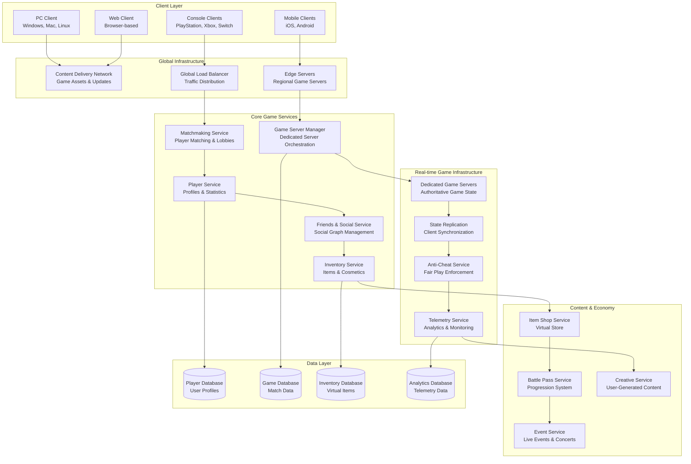
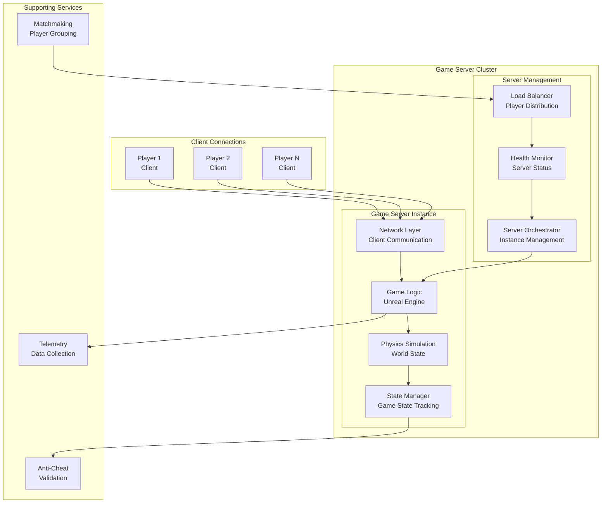
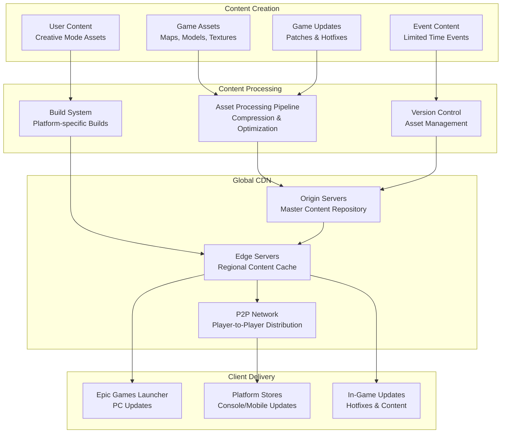
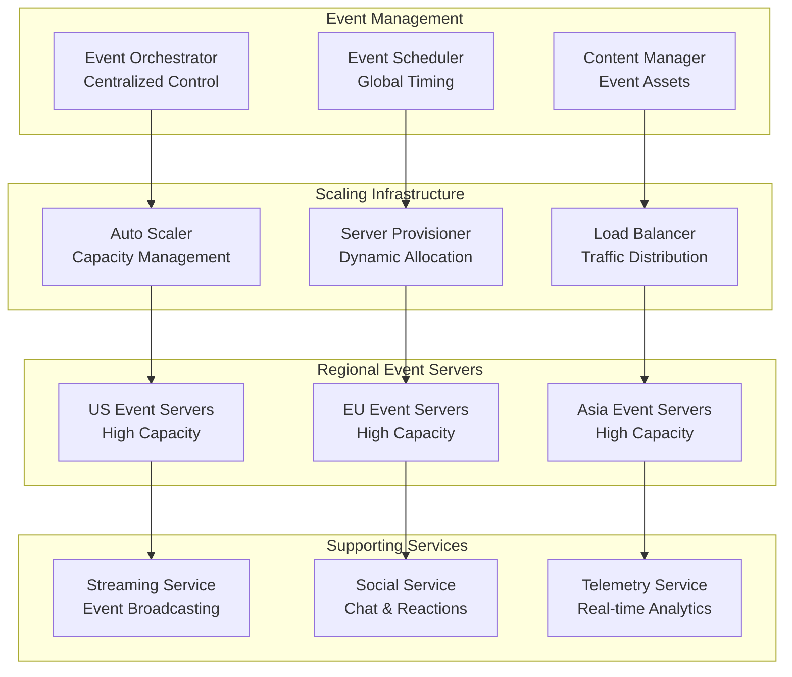

# Fortnite Backend Architecture: Supporting 350M Users and Battle Royale at Scale

## 🎮 Executive Summary

Fortnite, developed by Epic Games, represents one of the most successful multiplayer gaming platforms in history, supporting over **350 million registered users** with **10.8 million concurrent players** during peak events. The game's backend architecture handles **massive real-time multiplayer sessions** with up to **100 players per match**, **cross-platform compatibility** across 9+ platforms, and **global matchmaking** while maintaining **sub-50ms latency** for optimal gameplay experience.

## 📈 Scale and Impact

### Key Metrics
- **350+ million registered users** worldwide
- **10.8 million concurrent players** (peak during Travis Scott concert)
- **100 players per Battle Royale match**
- **3.2 billion hours** played monthly
- **9+ platforms** supported (PC, Console, Mobile)
- **Sub-50ms latency** for competitive gameplay
- **99.9%+ uptime** during major events
- **Billions of items** in virtual economy
- **$5.8+ billion revenue** (2021)

### Game Modes Supported
1. **Battle Royale**: 100-player competitive matches
2. **Creative Mode**: User-generated content and games
3. **Save the World**: Co-operative PvE gameplay
4. **Party Royale**: Social space for events and concerts
5. **Team Rumble**: Respawn-enabled team battles
6. **Limited Time Modes (LTMs)**: Special event games

## 🏗️ High-Level Architecture



## 🎯 Real-Time Game Server Architecture

### Dedicated Server Model
Fortnite uses **authoritative dedicated servers** to ensure fair gameplay:



## 🌍 Global Infrastructure and CDN

### Content Delivery Architecture
Fortnite's massive game assets require sophisticated CDN architecture:



### Update Distribution System
```python
class FortniteUpdateSystem:
    def __init__(self):
        self.cdn_manager = CDNManager()
        self.version_control = VersionControl()
        self.delta_generator = DeltaPatchGenerator()
        self.p2p_network = P2PNetwork()
        self.analytics = UpdateAnalytics()
    
    def distribute_update(self, update_version, target_platforms, rollout_strategy='gradual'):
        """Distribute game update to global player base"""
        
        # Generate platform-specific builds
        platform_builds = self.generate_platform_builds(update_version, target_platforms)
        
        # Create delta patches for existing installations
        delta_patches = self.generate_delta_patches(update_version, platform_builds)
        
        # Upload to origin servers
        self.upload_to_origin_servers(platform_builds, delta_patches)
        
        # Pre-populate edge servers based on player distribution
        self.pre_populate_edge_servers(platform_builds, delta_patches)
        
        # Execute rollout strategy
        if rollout_strategy == 'gradual':
            self.execute_gradual_rollout(update_version, platform_builds)
        elif rollout_strategy == 'immediate':
            self.execute_immediate_rollout(update_version, platform_builds)
        elif rollout_strategy == 'regional':
            self.execute_regional_rollout(update_version, platform_builds)
        
        # Monitor rollout performance
        self.monitor_rollout_performance(update_version)
        
        return {
            'update_version': update_version,
            'platforms': target_platforms,
            'rollout_strategy': rollout_strategy,
            'estimated_completion_time': self.estimate_rollout_completion(),
            'cdn_endpoints': self.get_cdn_endpoints_by_region()
        }
    
    def generate_delta_patches(self, new_version, platform_builds):
        """Generate delta patches to minimize download size"""
        
        delta_patches = {}
        
        for platform, build_data in platform_builds.items():
            # Get previous version builds
            previous_versions = self.version_control.get_recent_versions(platform, count=3)
            
            for prev_version in previous_versions:
                prev_build = self.version_control.get_build(platform, prev_version)
                
                # Generate delta patch
                delta_patch = self.delta_generator.create_delta_patch(
                    source_build=prev_build,
                    target_build=build_data,
                    compression_level='high'
                )
                
                # Only keep delta if it's significantly smaller than full download
                if delta_patch.size < build_data.size * 0.7:  # At least 30% savings
                    delta_patches[f"{platform}_{prev_version}_to_{new_version}"] = delta_patch
        
        return delta_patches
    
    def execute_gradual_rollout(self, update_version, platform_builds):
        """Execute gradual rollout to minimize server load"""
        
        # Define rollout phases
        rollout_phases = [
            {'percentage': 1, 'duration_hours': 2, 'regions': ['test_region']},
            {'percentage': 5, 'duration_hours': 4, 'regions': ['oceania', 'asia']},
            {'percentage': 25, 'duration_hours': 8, 'regions': ['europe']},
            {'percentage': 100, 'duration_hours': 12, 'regions': ['americas']}
        ]
        
        for phase in rollout_phases:
            # Enable update for percentage of players in specified regions
            self.enable_update_for_cohort(
                update_version=update_version,
                percentage=phase['percentage'],
                regions=phase['regions']
            )
            
            # Monitor phase performance
            phase_metrics = self.monitor_phase_performance(
                phase_duration=phase['duration_hours']
            )
            
            # Check for issues before proceeding
            if phase_metrics['error_rate'] > 0.05:  # 5% error rate threshold
                self.pause_rollout(update_version, f"High error rate: {phase_metrics['error_rate']}")
                return False
            
            if phase_metrics['download_success_rate'] < 0.95:  # 95% success rate threshold
                self.pause_rollout(update_version, f"Low success rate: {phase_metrics['download_success_rate']}")
                return False
        
        return True
    
    def monitor_rollout_performance(self, update_version):
        """Monitor update rollout performance in real-time"""
        
        metrics = {
            'total_downloads_initiated': 0,
            'successful_downloads': 0,
            'failed_downloads': 0,
            'average_download_speed': 0,
            'cdn_hit_rate': 0,
            'p2p_utilization': 0,
            'regional_performance': {}
        }
        
        # Collect metrics from all CDN nodes
        for region, cdn_nodes in self.cdn_manager.get_all_nodes().items():
            region_metrics = {
                'downloads': 0,
                'bandwidth_utilization': 0,
                'cache_hit_rate': 0,
                'average_latency': 0
            }
            
            for node in cdn_nodes:
                node_metrics = node.get_metrics(update_version)
                region_metrics['downloads'] += node_metrics['downloads']
                region_metrics['bandwidth_utilization'] += node_metrics['bandwidth_usage']
                region_metrics['cache_hit_rate'] += node_metrics['cache_hit_rate']
                region_metrics['average_latency'] += node_metrics['latency']
            
            # Average metrics across nodes in region
            if cdn_nodes:
                region_metrics['cache_hit_rate'] /= len(cdn_nodes)
                region_metrics['average_latency'] /= len(cdn_nodes)
            
            metrics['regional_performance'][region] = region_metrics
            metrics['total_downloads_initiated'] += region_metrics['downloads']
        
        # Update global metrics
        self.analytics.update_rollout_metrics(update_version, metrics)
        
        # Check for performance issues
        self.check_performance_thresholds(update_version, metrics)
        
        return metrics

class P2PNetwork:
    """Peer-to-peer content distribution network"""
    
    def __init__(self):
        self.peer_manager = PeerManager()
        self.content_tracker = ContentTracker()
        self.bandwidth_manager = BandwidthManager()
    
    def enable_p2p_distribution(self, content_id, content_hash):
        """Enable P2P distribution for content"""
        
        # Find peers with the content
        seed_peers = self.content_tracker.find_peers_with_content(content_id)
        
        if len(seed_peers) < 10:  # Need minimum seed peers
            return False
        
        # Create torrent-like distribution
        content_metadata = {
            'content_id': content_id,
            'content_hash': content_hash,
            'chunk_size': 1024 * 1024,  # 1MB chunks
            'total_chunks': self.calculate_total_chunks(content_id),
            'seed_peers': seed_peers[:50]  # Limit initial seeds
        }
        
        # Register content for P2P distribution
        self.content_tracker.register_content(content_metadata)
        
        # Start peer discovery process
        self.peer_manager.start_peer_discovery(content_id)
        
        return True
    
    def download_via_p2p(self, player_id, content_id):
        """Download content using P2P network"""
        
        # Get available peers for content
        available_peers = self.peer_manager.get_available_peers(content_id)
        
        if not available_peers:
            return {'status': 'no_peers', 'fallback_to_cdn': True}
        
        # Select optimal peers based on latency and bandwidth
        selected_peers = self.select_optimal_peers(player_id, available_peers)
        
        # Start parallel downloads from multiple peers
        download_manager = ParallelDownloadManager()
        
        for peer in selected_peers:
            download_manager.add_peer_source(peer, content_id)
        
        # Monitor download progress
        download_result = download_manager.start_download(
            progress_callback=lambda progress: self.update_download_progress(player_id, progress),
            completion_callback=lambda: self.on_download_complete(player_id, content_id)
        )
        
        return download_result
    
    def select_optimal_peers(self, player_id, available_peers):
        """Select optimal peers for download"""
        
        player_location = self.get_player_location(player_id)
        
        # Score peers based on multiple factors
        peer_scores = []
        
        for peer in available_peers:
            score = 0
            
            # Geographic proximity (40% weight)
            distance = self.calculate_geographic_distance(player_location, peer.location)
            proximity_score = max(0, 1 - (distance / 10000))  # Normalize to 10,000km max
            score += proximity_score * 0.4
            
            # Network latency (30% weight)
            latency = self.measure_latency(player_id, peer.id)
            latency_score = max(0, 1 - (latency / 200))  # Normalize to 200ms max
            score += latency_score * 0.3
            
            # Available bandwidth (20% weight)
            bandwidth = peer.available_bandwidth
            bandwidth_score = min(bandwidth / (10 * 1024 * 1024), 1)  # Normalize to 10 Mbps max
            score += bandwidth_score * 0.2
            
            # Peer reliability (10% weight)
            reliability = peer.success_rate
            score += reliability * 0.1
            
            peer_scores.append((peer, score))
        
        # Sort by score and select top peers
        peer_scores.sort(key=lambda x: x[1], reverse=True)
        
        # Select top 5 peers for parallel download
        return [peer for peer, score in peer_scores[:5]]
```

## 🎪 Live Events and Concerts

### Event Infrastructure
Fortnite's live events (like Travis Scott concert) require massive scale:



## 💰 Virtual Economy Architecture

### Item Shop and Monetization
```python
class FortniteEconomySystem:
    def __init__(self):
        self.item_catalog = ItemCatalog()
        self.pricing_engine = DynamicPricingEngine()
        self.purchase_processor = PurchaseProcessor()
        self.inventory_manager = InventoryManager()
        self.analytics = EconomyAnalytics()
    
    def generate_daily_item_shop(self, region='global'):
        """Generate daily item shop with personalized recommendations"""
        
        # Get featured items (manually curated)
        featured_items = self.item_catalog.get_featured_items(date=datetime.now().date())
        
        # Get daily items (algorithmic selection)
        daily_items = self.select_daily_items(region)
        
        # Personalize shop for different player segments
        personalized_sections = self.create_personalized_sections(region)
        
        shop_layout = {
            'featured_items': featured_items,
            'daily_items': daily_items,
            'personalized_sections': personalized_sections,
            'shop_refresh_time': self.calculate_next_refresh_time(),
            'special_offers': self.get_active_special_offers(region)
        }
        
        # Apply dynamic pricing
        shop_layout = self.apply_dynamic_pricing(shop_layout, region)
        
        return shop_layout
    
    def select_daily_items(self, region):
        """Algorithmically select daily items based on multiple factors"""
        
        # Get item performance data
        item_performance = self.analytics.get_item_performance_data(days=30)
        
        # Get regional preferences
        regional_preferences = self.analytics.get_regional_preferences(region)
        
        # Get seasonal trends
        seasonal_trends = self.analytics.get_seasonal_trends()
        
        # Score all available items
        available_items = self.item_catalog.get_available_items(exclude_featured=True)
        item_scores = []
        
        for item in available_items:
            score = 0
            
            # Performance factor (30%)
            performance_score = item_performance.get(item.id, {}).get('conversion_rate', 0)
            score += performance_score * 0.3
            
            # Regional preference factor (25%)
            regional_score = regional_preferences.get(item.category, 0)
            score += regional_score * 0.25
            
            # Recency factor (20%) - prefer items not seen recently
            days_since_last_appearance = self.get_days_since_last_shop_appearance(item.id)
            recency_score = min(days_since_last_appearance / 30.0, 1.0)  # Normalize to 30 days
            score += recency_score * 0.2
            
            # Seasonal relevance (15%)
            seasonal_score = seasonal_trends.get(item.tags, 0)
            score += seasonal_score * 0.15
            
            # Rarity balance (10%) - ensure mix of rarities
            rarity_score = self.calculate_rarity_balance_score(item.rarity)
            score += rarity_score * 0.1
            
            item_scores.append((item, score))
        
        # Sort by score and select top items
        item_scores.sort(key=lambda x: x[1], reverse=True)
        
        # Select items ensuring variety
        selected_items = self.ensure_item_variety([item for item, score in item_scores])
        
        return selected_items[:6]  # 6 daily items
    
    def process_purchase(self, player_id, item_id, payment_method='v_bucks'):
        """Process item purchase with comprehensive validation"""
        
        # Validate purchase request
        validation_result = self.validate_purchase(player_id, item_id, payment_method)
        if not validation_result['valid']:
            return {'success': False, 'error': validation_result['error']}
        
        # Get item and pricing information
        item = self.item_catalog.get_item(item_id)
        price = self.pricing_engine.get_current_price(item_id, player_id)
        
        # Process payment
        payment_result = self.purchase_processor.process_payment(
            player_id=player_id,
            amount=price,
            currency=payment_method,
            item_id=item_id
        )
        
        if not payment_result['success']:
            return {'success': False, 'error': payment_result['error']}
        
        # Add item to player inventory
        inventory_result = self.inventory_manager.add_item_to_inventory(
            player_id=player_id,
            item_id=item_id,
            source='purchase',
            transaction_id=payment_result['transaction_id']
        )
        
        if not inventory_result['success']:
            # Rollback payment
            self.purchase_processor.refund_payment(payment_result['transaction_id'])
            return {'success': False, 'error': 'Failed to add item to inventory'}
        
        # Record purchase analytics
        self.analytics.record_purchase(
            player_id=player_id,
            item_id=item_id,
            price=price,
            payment_method=payment_method,
            timestamp=time.time()
        )
        
        # Trigger any item-specific logic (e.g., battle pass tier unlock)
        self.trigger_item_effects(player_id, item)
        
        return {
            'success': True,
            'transaction_id': payment_result['transaction_id'],
            'item': item.to_dict(),
            'new_balance': payment_result['new_balance']
        }
    
    def apply_dynamic_pricing(self, shop_layout, region):
        """Apply dynamic pricing based on demand and player behavior"""
        
        for section_name, items in shop_layout.items():
            if isinstance(items, list):
                for item in items:
                    # Get base price
                    base_price = item.get('base_price', 0)
                    
                    # Apply demand-based pricing
                    demand_multiplier = self.calculate_demand_multiplier(item['id'], region)
                    
                    # Apply player segment pricing
                    segment_multiplier = self.calculate_segment_multiplier(item['id'], region)
                    
                    # Apply time-based pricing (sales, limited time offers)
                    time_multiplier = self.calculate_time_multiplier(item['id'])
                    
                    # Calculate final price
                    final_price = int(base_price * demand_multiplier * segment_multiplier * time_multiplier)
                    
                    # Ensure price stays within reasonable bounds
                    min_price = int(base_price * 0.5)  # Maximum 50% discount
                    max_price = int(base_price * 1.5)  # Maximum 50% markup
                    
                    item['current_price'] = max(min_price, min(final_price, max_price))
                    item['discount_percentage'] = int((1 - item['current_price'] / base_price) * 100)
        
        return shop_layout

class BattlePassSystem:
    def __init__(self):
        self.progression_tracker = ProgressionTracker()
        self.reward_manager = RewardManager()
        self.xp_calculator = XPCalculator()
        self.challenge_manager = ChallengeManager()
    
    def calculate_xp_gain(self, player_id, match_data):
        """Calculate XP gain from match performance"""
        
        base_xp = 0
        bonus_xp = 0
        
        # Survival XP (time-based)
        survival_time = match_data.get('survival_time_seconds', 0)
        survival_xp = min(survival_time * 17, 1275)  # Cap at 1275 XP for full match
        base_xp += survival_xp
        
        # Elimination XP
        eliminations = match_data.get('eliminations', 0)
        elimination_xp = eliminations * 50
        base_xp += elimination_xp
        
        # Placement XP
        placement = match_data.get('final_placement', 100)
        if placement == 1:
            placement_xp = 300  # Victory Royale
        elif placement <= 10:
            placement_xp = 200
        elif placement <= 25:
            placement_xp = 100
        else:
            placement_xp = 50
        base_xp += placement_xp
        
        # Team XP (if applicable)
        if match_data.get('game_mode') in ['duos', 'squads']:
            team_placement = match_data.get('team_placement', 100)
            if team_placement <= 3:
                bonus_xp += 100
        
        # First match of day bonus
        if self.is_first_match_of_day(player_id):
            bonus_xp += 100
        
        # Friend XP bonus
        friends_in_match = match_data.get('friends_in_match', 0)
        friend_bonus = min(friends_in_match * 20, 120)  # Cap at 6 friends
        bonus_xp += friend_bonus
        
        # Battle Pass XP boost
        battle_pass_tier = self.get_player_battle_pass_tier(player_id)
        xp_boost_percentage = self.calculate_xp_boost(battle_pass_tier)
        boosted_xp = int((base_xp + bonus_xp) * (1 + xp_boost_percentage))
        
        return {
            'base_xp': base_xp,
            'bonus_xp': bonus_xp,
            'boosted_xp': boosted_xp,
            'total_xp': boosted_xp,
            'xp_breakdown': {
                'survival': survival_xp,
                'eliminations': elimination_xp,
                'placement': placement_xp,
                'first_match_bonus': 100 if self.is_first_match_of_day(player_id) else 0,
                'friend_bonus': friend_bonus,
                'xp_boost_percentage': xp_boost_percentage
            }
        }
```

## 📚 Key Lessons Learned

### Technical Architecture Lessons
1. **Authoritative Servers**: Dedicated servers prevent cheating and ensure fair gameplay
2. **Regional Infrastructure**: Low latency requires servers close to players
3. **Anti-Cheat Integration**: Multi-layered cheat detection with ML and statistical analysis
4. **Scalable Matchmaking**: Skill-based matching with dynamic tolerance for queue times
5. **Event Scalability**: Massive scaling for live events requires automated infrastructure

### Game Design Lessons
1. **Cross-Platform Play**: Unified experience across all platforms drives engagement
2. **Live Events**: Unique shared experiences create viral moments and player retention
3. **Virtual Economy**: Free-to-play with cosmetic monetization scales globally
4. **User-Generated Content**: Creative mode extends game lifespan indefinitely
5. **Social Features**: Friends and party systems drive player acquisition

### Operational Excellence
1. **Real-time Monitoring**: Comprehensive telemetry for game performance and player behavior
2. **Automated Scaling**: Dynamic server allocation for varying player loads
3. **Global CDN**: Efficient content delivery reduces update times and costs
4. **A/B Testing**: Data-driven optimization of game features and monetization
5. **Community Management**: Active community engagement and feedback integration

## 🎯 Business Impact

### Financial Success
- **$5.8+ billion revenue** (2021)
- **350+ million registered users**
- **Free-to-play model** with cosmetic monetization
- **Cross-platform ecosystem** maximizing reach
- **Live events** driving engagement and revenue spikes

### Industry Impact
1. **Battle Royale Genre**: Popularized and refined the battle royale format
2. **Cross-Platform Gaming**: Pioneered seamless cross-platform play
3. **Live Events**: Created new model for virtual concerts and events
4. **User-Generated Content**: Empowered players to create custom games
5. **Gaming Culture**: Became cultural phenomenon beyond gaming

This comprehensive case study demonstrates how Fortnite built a scalable, global gaming platform that supports hundreds of millions of players while maintaining competitive gameplay, social features, and innovative live events that have redefined what's possible in online gaming.
