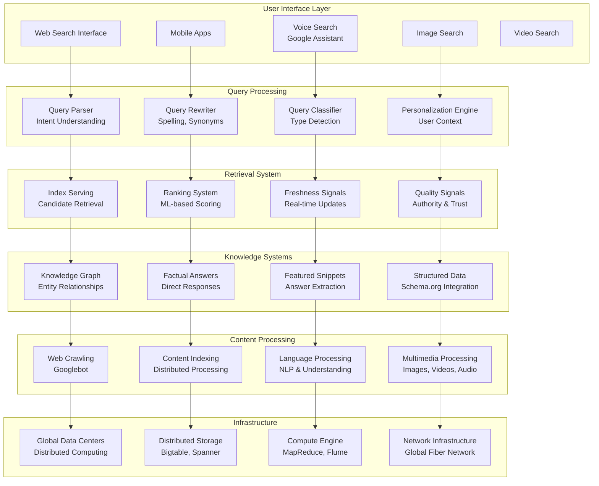
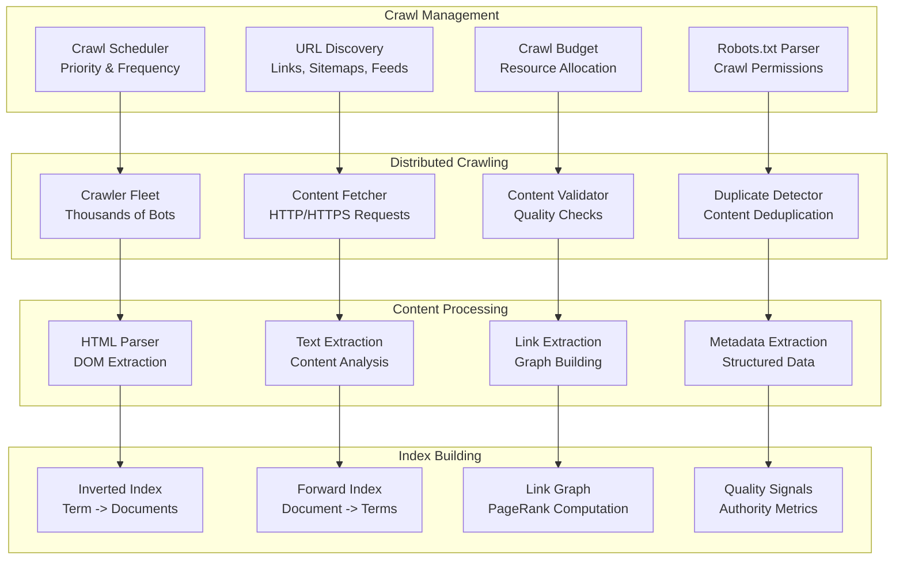
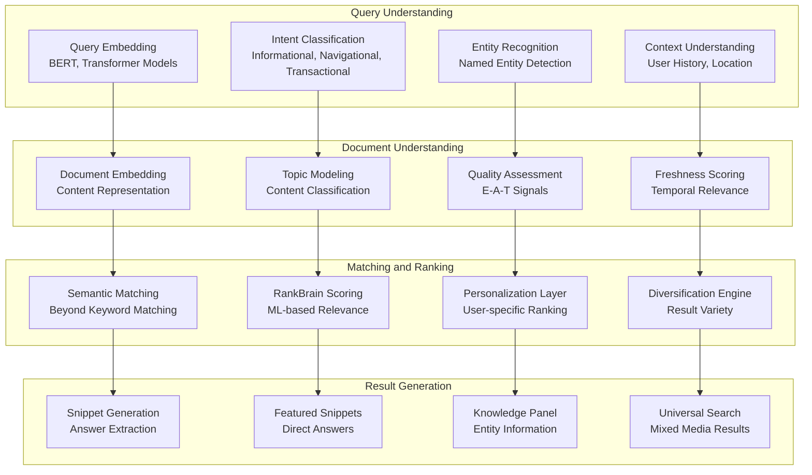
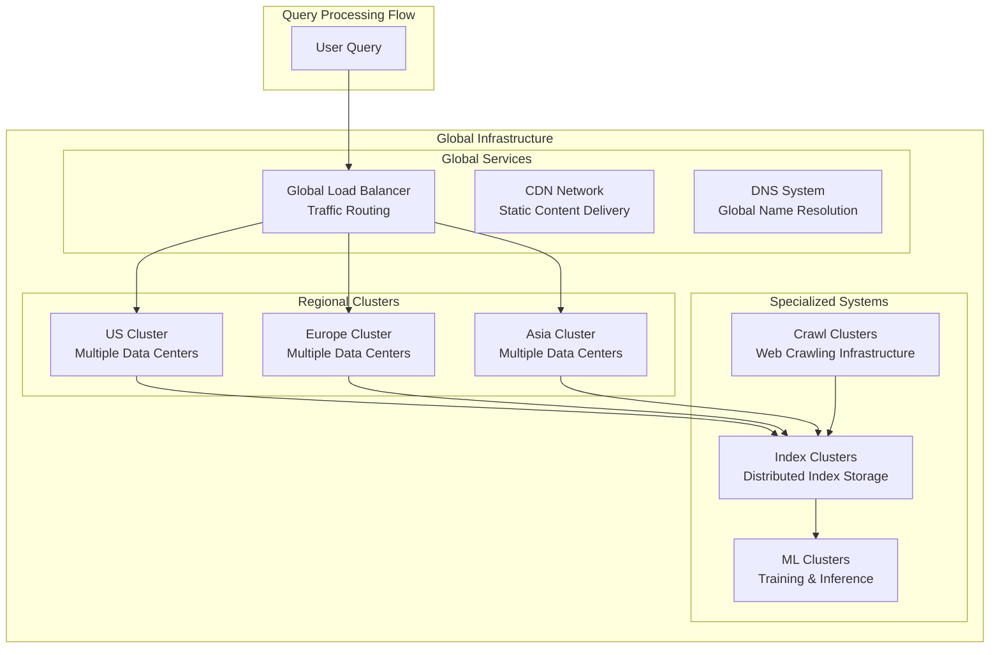

# Google Search Architecture: The World's Largest Information Retrieval System

## 🔍 Executive Summary

Google Search processes over **8.5 billion searches per day** and indexes more than **130 trillion web pages**, serving results in **under 200 milliseconds** to users worldwide. As the world's most sophisticated information retrieval system, Google's architecture combines **massive distributed computing**, **advanced machine learning**, **real-time indexing**, and **global infrastructure** to deliver relevant results from the world's largest corpus of information.

## 📈 Scale and Impact

### Key Metrics
- **8.5+ billion searches per day**
- **130+ trillion web pages** indexed
- **92%+ global search market share**
- **<200ms average response time**
- **100+ languages** supported
- **40,000+ searches per second**
- **15% of daily searches** are completely new
- **Petabytes of data** processed daily

### Search Evolution Timeline
- **1996**: BackRub prototype at Stanford
- **1998**: Google founded, PageRank algorithm
- **2000**: AdWords launch, monetization begins
- **2003**: Google News, vertical search
- **2007**: Universal Search, multimedia results
- **2013**: Hummingbird algorithm, semantic search
- **2015**: RankBrain, machine learning integration
- **2019**: BERT, natural language understanding
- **2021**: MUM (Multitask Unified Model), multimodal AI

## 🏛️ High-Level Architecture



## 🕷️ Web Crawling and Indexing Architecture

### Googlebot Crawling System
Google's web crawler processes **billions of pages daily**:



### Crawling Strategy Implementation
```python
class GooglebotCrawler:
    def __init__(self):
        self.url_queue = DistributedQueue()
        self.crawl_scheduler = CrawlScheduler()
        self.content_processor = ContentProcessor()
        self.duplicate_detector = DuplicateDetector()
        self.quality_assessor = QualityAssessor()
        
    def crawl_web_continuously(self):
        """Main crawling loop processing billions of URLs"""
        
        while True:
            try:
                # Get next batch of URLs to crawl
                url_batch = self.get_next_crawl_batch()
                
                if not url_batch:
                    time.sleep(1)
                    continue
                
                # Process URLs in parallel
                crawl_results = self.process_url_batch(url_batch)
                
                # Update crawl statistics
                self.update_crawl_metrics(crawl_results)
                
                # Schedule discovered URLs for future crawling
                self.schedule_discovered_urls(crawl_results)
                
            except Exception as e:
                self.handle_crawl_error(e)
    
    def get_next_crawl_batch(self, batch_size=1000):
        """Get next batch of URLs to crawl based on priority"""
        
        # Get URLs from different priority queues
        high_priority_urls = self.url_queue.get_batch('high_priority', batch_size // 4)
        medium_priority_urls = self.url_queue.get_batch('medium_priority', batch_size // 2)
        low_priority_urls = self.url_queue.get_batch('low_priority', batch_size // 4)
        
        # Combine and shuffle to avoid patterns
        all_urls = high_priority_urls + medium_priority_urls + low_priority_urls
        random.shuffle(all_urls)
        
        return all_urls
    
    def process_url_batch(self, url_batch):
        """Process batch of URLs in parallel"""
        
        crawl_results = []
        
        # Use thread pool for parallel processing
        with ThreadPoolExecutor(max_workers=100) as executor:
            # Submit crawl tasks
            future_to_url = {
                executor.submit(self.crawl_single_url, url): url 
                for url in url_batch
            }
            
            # Collect results as they complete
            for future in as_completed(future_to_url):
                url = future_to_url[future]
                
                try:
                    result = future.result(timeout=30)  # 30 second timeout
                    crawl_results.append(result)
                except Exception as e:
                    # Log failed crawl
                    crawl_results.append({
                        'url': url,
                        'success': False,
                        'error': str(e),
                        'timestamp': time.time()
                    })
        
        return crawl_results
    
    def crawl_single_url(self, url):
        """Crawl single URL with comprehensive processing"""
        
        crawl_start_time = time.time()
        
        # Check robots.txt compliance
        if not self.check_robots_txt_compliance(url):
            return {
                'url': url,
                'success': False,
                'error': 'robots.txt disallows crawling',
                'timestamp': crawl_start_time
            }
        
        # Check crawl budget
        domain = self.extract_domain(url)
        if not self.crawl_scheduler.can_crawl_domain(domain):
            return {
                'url': url,
                'success': False,
                'error': 'crawl budget exceeded',
                'timestamp': crawl_start_time
            }
        
        try:
            # Fetch content
            response = self.fetch_url_content(url)
            
            if response.status_code != 200:
                return {
                    'url': url,
                    'success': False,
                    'error': f'HTTP {response.status_code}',
                    'timestamp': crawl_start_time
                }
            
            # Process content
            processed_content = self.content_processor.process_content(
                url=url,
                content=response.content,
                headers=response.headers
            )
            
            # Check for duplicates
            is_duplicate = self.duplicate_detector.is_duplicate(processed_content)
            
            if is_duplicate:
                return {
                    'url': url,
                    'success': True,
                    'duplicate': True,
                    'processing_time': time.time() - crawl_start_time
                }
            
            # Assess content quality
            quality_score = self.quality_assessor.assess_content_quality(processed_content)
            
            # Extract links for future crawling
            discovered_links = self.extract_links(processed_content)
            
            # Update crawl budget
            self.crawl_scheduler.update_crawl_budget(domain, 1)
            
            return {
                'url': url,
                'success': True,
                'content': processed_content,
                'quality_score': quality_score,
                'discovered_links': discovered_links,
                'processing_time': time.time() - crawl_start_time,
                'content_size': len(response.content),
                'timestamp': crawl_start_time
            }
            
        except Exception as e:
            return {
                'url': url,
                'success': False,
                'error': str(e),
                'processing_time': time.time() - crawl_start_time,
                'timestamp': crawl_start_time
            }
    
    def schedule_discovered_urls(self, crawl_results):
        """Schedule newly discovered URLs for future crawling"""
        
        new_urls = []
        
        for result in crawl_results:
            if result.get('success') and result.get('discovered_links'):
                for link in result['discovered_links']:
                    # Calculate URL priority
                    priority = self.calculate_url_priority(link, result['url'])
                    
                    # Add to appropriate queue
                    new_urls.append({
                        'url': link,
                        'priority': priority,
                        'discovered_from': result['url'],
                        'discovered_at': time.time()
                    })
        
        # Batch add to queues
        if new_urls:
            self.url_queue.add_urls_batch(new_urls)
    
    def calculate_url_priority(self, url, source_url):
        """Calculate crawling priority for discovered URL"""
        
        priority_score = 0.5  # Base priority
        
        # Domain authority factor
        domain = self.extract_domain(url)
        domain_authority = self.get_domain_authority(domain)
        priority_score += domain_authority * 0.3
        
        # Source page authority factor
        source_domain = self.extract_domain(source_url)
        source_authority = self.get_domain_authority(source_domain)
        priority_score += source_authority * 0.2
        
        # Freshness factor (new domains get higher priority)
        if self.is_new_domain(domain):
            priority_score += 0.2
        
        # Content type factor
        if self.is_news_url(url):
            priority_score += 0.3
        elif self.is_reference_url(url):
            priority_score += 0.1
        
        # Normalize to 0-1 range
        priority_score = max(0, min(1, priority_score))
        
        # Convert to priority category
        if priority_score > 0.8:
            return 'high_priority'
        elif priority_score > 0.5:
            return 'medium_priority'
        else:
            return 'low_priority'

class ContentProcessor:
    """Process crawled content for indexing"""
    
    def __init__(self):
        self.html_parser = HTMLParser()
        self.text_extractor = TextExtractor()
        self.language_detector = LanguageDetector()
        self.structured_data_extractor = StructuredDataExtractor()
    
    def process_content(self, url, content, headers):
        """Comprehensive content processing"""
        
        # Detect content type
        content_type = headers.get('content-type', '').lower()
        
        if 'text/html' in content_type:
            return self.process_html_content(url, content)
        elif 'application/pdf' in content_type:
            return self.process_pdf_content(url, content)
        elif content_type.startswith('image/'):
            return self.process_image_content(url, content)
        else:
            return self.process_generic_content(url, content, content_type)
    
    def process_html_content(self, url, html_content):
        """Process HTML content comprehensively"""
        
        # Parse HTML
        parsed_html = self.html_parser.parse(html_content)
        
        # Extract text content
        text_content = self.text_extractor.extract_text(parsed_html)
        
        # Detect language
        language = self.language_detector.detect_language(text_content)
        
        # Extract structured data
        structured_data = self.structured_data_extractor.extract_all(parsed_html)
        
        # Extract metadata
        metadata = self.extract_html_metadata(parsed_html)
        
        # Extract links
        links = self.extract_all_links(parsed_html, url)
        
        # Analyze content structure
        content_structure = self.analyze_content_structure(parsed_html)
        
        # Extract images
        images = self.extract_images(parsed_html, url)
        
        return {
            'url': url,
            'content_type': 'html',
            'title': metadata.get('title', ''),
            'description': metadata.get('description', ''),
            'text_content': text_content,
            'language': language,
            'word_count': len(text_content.split()),
            'links': links,
            'images': images,
            'structured_data': structured_data,
            'content_structure': content_structure,
            'metadata': metadata,
            'processed_at': time.time()
        }
    
    def extract_html_metadata(self, parsed_html):
        """Extract comprehensive HTML metadata"""
        
        metadata = {}
        
        # Title
        title_tag = parsed_html.find('title')
        if title_tag:
            metadata['title'] = title_tag.get_text().strip()
        
        # Meta tags
        meta_tags = parsed_html.find_all('meta')
        for meta in meta_tags:
            name = meta.get('name', '').lower()
            property_name = meta.get('property', '').lower()
            content = meta.get('content', '')
            
            if name == 'description':
                metadata['description'] = content
            elif name == 'keywords':
                metadata['keywords'] = [k.strip() for k in content.split(',')]
            elif name == 'author':
                metadata['author'] = content
            elif property_name == 'og:title':
                metadata['og_title'] = content
            elif property_name == 'og:description':
                metadata['og_description'] = content
            elif property_name == 'og:image':
                metadata['og_image'] = content
            elif property_name == 'article:published_time':
                metadata['published_time'] = content
            elif property_name == 'article:modified_time':
                metadata['modified_time'] = content
        
        # Schema.org JSON-LD
        json_ld_scripts = parsed_html.find_all('script', type='application/ld+json')
        if json_ld_scripts:
            metadata['json_ld'] = []
            for script in json_ld_scripts:
                try:
                    json_data = json.loads(script.string)
                    metadata['json_ld'].append(json_data)
                except json.JSONDecodeError:
                    pass
        
        # Canonical URL
        canonical_link = parsed_html.find('link', rel='canonical')
        if canonical_link:
            metadata['canonical_url'] = canonical_link.get('href')
        
        # Language
        html_tag = parsed_html.find('html')
        if html_tag:
            metadata['html_lang'] = html_tag.get('lang', '')
        
        return metadata
    
    def analyze_content_structure(self, parsed_html):
        """Analyze HTML content structure for ranking signals"""
        
        structure = {
            'headings': {},
            'paragraphs': 0,
            'lists': 0,
            'tables': 0,
            'forms': 0,
            'content_density': 0,
            'navigation_elements': 0
        }
        
        # Count heading tags
        for i in range(1, 7):  # h1 to h6
            headings = parsed_html.find_all(f'h{i}')
            structure['headings'][f'h{i}'] = len(headings)
        
        # Count other elements
        structure['paragraphs'] = len(parsed_html.find_all('p'))
        structure['lists'] = len(parsed_html.find_all(['ul', 'ol']))
        structure['tables'] = len(parsed_html.find_all('table'))
        structure['forms'] = len(parsed_html.find_all('form'))
        structure['navigation_elements'] = len(parsed_html.find_all(['nav', 'menu']))
        
        # Calculate content density (text vs HTML ratio)
        text_length = len(parsed_html.get_text())
        html_length = len(str(parsed_html))
        structure['content_density'] = text_length / html_length if html_length > 0 else 0
        
        return structure

class IndexingSystem:
    """Distributed indexing system for web content"""
    
    def __init__(self):
        self.inverted_index = DistributedInvertedIndex()
        self.forward_index = DistributedForwardIndex()
        self.link_graph = LinkGraph()
        self.term_processor = TermProcessor()
        self.index_shards = IndexShards()
    
    def index_document(self, processed_content):
        """Index processed document across distributed system"""
        
        doc_id = self.generate_document_id(processed_content['url'])
        
        # Process terms
        processed_terms = self.term_processor.process_document_terms(
            processed_content['text_content']
        )
        
        # Build inverted index entries
        inverted_entries = self.build_inverted_index_entries(doc_id, processed_terms)
        
        # Build forward index entry
        forward_entry = self.build_forward_index_entry(doc_id, processed_content)
        
        # Update link graph
        self.update_link_graph(doc_id, processed_content)
        
        # Distribute across shards
        shard_assignments = self.determine_shard_assignments(inverted_entries)
        
        # Write to distributed indexes
        indexing_results = []
        
        for shard_id, entries in shard_assignments.items():
            result = self.index_shards.write_to_shard(shard_id, entries)
            indexing_results.append(result)
        
        # Write forward index
        forward_result = self.forward_index.write_document(doc_id, forward_entry)
        
        return {
            'document_id': doc_id,
            'terms_indexed': len(processed_terms),
            'shards_updated': len(shard_assignments),
            'indexing_success': all(r['success'] for r in indexing_results),
            'forward_index_success': forward_result['success']
        }
    
    def build_inverted_index_entries(self, doc_id, processed_terms):
        """Build inverted index entries for document"""
        
        entries = {}
        
        for term_info in processed_terms:
            term = term_info['term']
            positions = term_info['positions']
            frequency = term_info['frequency']
            
            # Calculate term importance scores
            tf_score = self.calculate_tf_score(frequency, len(processed_terms))
            position_score = self.calculate_position_score(positions)
            
            entries[term] = {
                'doc_id': doc_id,
                'frequency': frequency,
                'positions': positions,
                'tf_score': tf_score,
                'position_score': position_score,
                'field_occurrences': term_info.get('field_occurrences', {})
            }
        
        return entries
    
    def calculate_tf_score(self, term_frequency, total_terms):
        """Calculate term frequency score"""
        
        if total_terms == 0:
            return 0
        
        # Use log normalization to prevent very long documents from dominating
        return math.log(1 + term_frequency) / math.log(1 + total_terms)
    
    def calculate_position_score(self, positions):
        """Calculate position-based importance score"""
        
        if not positions:
            return 0
        
        # Terms appearing earlier in document are more important
        early_position_bonus = 1.0 / (1 + min(positions) / 100)
        
        # Terms appearing in multiple positions are more important
        distribution_bonus = math.log(1 + len(positions))
        
        return early_position_bonus * distribution_bonus
    
    def update_link_graph(self, doc_id, processed_content):
        """Update link graph with document's links"""
        
        outbound_links = processed_content.get('links', [])
        
        for link in outbound_links:
            target_doc_id = self.generate_document_id(link['url'])
            
            # Add edge to link graph
            self.link_graph.add_edge(
                source=doc_id,
                target=target_doc_id,
                anchor_text=link.get('anchor_text', ''),
                link_type=link.get('type', 'standard')
            )
```

## 🤖 Machine Learning and Ranking

### RankBrain and BERT Integration
Google's modern ranking uses **advanced ML models**:



## 🌐 Global Infrastructure

### Distributed Search Architecture
Google operates **thousands of data centers** globally:



## 📊 Performance Optimization

### Query Processing Optimization
```python
class SearchPerformanceOptimizer:
    def __init__(self):
        self.query_cache = QueryCache()
        self.index_cache = IndexCache()
        self.result_cache = ResultCache()
        self.performance_monitor = PerformanceMonitor()
    
    def optimize_query_processing(self, query, user_context):
        """Optimize query processing for sub-200ms response times"""
        
        optimization_start = time.time()
        
        # 1. Query preprocessing optimizations
        preprocessed_query = self.optimize_query_preprocessing(query)
        
        # 2. Index lookup optimizations
        candidate_docs = self.optimize_index_lookup(preprocessed_query)
        
        # 3. Ranking optimizations
        ranked_results = self.optimize_ranking(preprocessed_query, candidate_docs, user_context)
        
        # 4. Result formatting optimizations
        formatted_results = self.optimize_result_formatting(ranked_results)
        
        total_time = time.time() - optimization_start
        
        # Monitor performance
        self.performance_monitor.record_query_performance(
            query=query,
            processing_time=total_time,
            candidate_count=len(candidate_docs),
            result_count=len(formatted_results)
        )
        
        return {
            'results': formatted_results,
            'processing_time_ms': total_time * 1000,
            'optimizations_applied': self.get_applied_optimizations()
        }
    
    def optimize_query_preprocessing(self, query):
        """Optimize query preprocessing stage"""
        
        # Check query cache first
        cache_key = f"preprocessed:{hash(query)}"
        cached_result = self.query_cache.get(cache_key)
        
        if cached_result:
            return cached_result
        
        # Parallel preprocessing operations
        with ThreadPoolExecutor(max_workers=4) as executor:
            # Submit preprocessing tasks
            spell_future = executor.submit(self.spell_check_query, query)
            synonym_future = executor.submit(self.expand_synonyms, query)
            entity_future = executor.submit(self.extract_entities_fast, query)
            intent_future = executor.submit(self.classify_intent_fast, query)
            
            # Collect results
            spell_corrected = spell_future.result()
            synonym_expanded = synonym_future.result()
            entities = entity_future.result()
            intent = intent_future.result()
        
        preprocessed = {
            'original_query': query,
            'spell_corrected': spell_corrected,
            'synonym_expanded': synonym_expanded,
            'entities': entities,
            'intent': intent
        }
        
        # Cache result
        self.query_cache.set(cache_key, preprocessed, ttl=3600)
        
        return preprocessed
    
    def optimize_index_lookup(self, preprocessed_query):
        """Optimize index lookup with caching and parallelization"""
        
        query_terms = self.extract_query_terms(preprocessed_query)
        
        # Check index cache
        cache_key = f"index_lookup:{hash(str(sorted(query_terms)))}"
        cached_candidates = self.index_cache.get(cache_key)
        
        if cached_candidates:
            return cached_candidates
        
        # Parallel index lookups for different term combinations
        candidate_sets = []
        
        with ThreadPoolExecutor(max_workers=8) as executor:
            lookup_futures = []
            
            # Submit lookups for individual terms
            for term in query_terms[:5]:  # Limit to top 5 terms
                future = executor.submit(self.lookup_term_in_index, term)
                lookup_futures.append(future)
            
            # Submit lookups for term pairs
            for i in range(len(query_terms)):
                for j in range(i+1, min(i+3, len(query_terms))):  # Limit combinations
                    term_pair = (query_terms[i], query_terms[j])
                    future = executor.submit(self.lookup_term_pair_in_index, term_pair)
                    lookup_futures.append(future)
            
            # Collect results
            for future in as_completed(lookup_futures):
                try:
                    candidates = future.result(timeout=0.05)  # 50ms timeout
                    if candidates:
                        candidate_sets.append(candidates)
                except:
                    pass  # Skip failed lookups
        
        # Merge and deduplicate candidates
        merged_candidates = self.merge_candidate_sets(candidate_sets)
        
        # Cache result
        self.index_cache.set(cache_key, merged_candidates, ttl=1800)
        
        return merged_candidates
    
    def optimize_ranking(self, query, candidates, user_context):
        """Optimize ranking computation"""
        
        if len(candidates) <= 100:
            # Small candidate set - use full ranking
            return self.full_ranking(query, candidates, user_context)
        
        # Large candidate set - use staged ranking
        return self.staged_ranking(query, candidates, user_context)
    
    def staged_ranking(self, query, candidates, user_context):
        """Multi-stage ranking for large candidate sets"""
        
        # Stage 1: Fast pre-filtering (keep top 1000)
        stage1_scores = []
        
        for candidate in candidates:
            # Calculate fast ranking signals only
            fast_score = (
                self.calculate_text_match_score(query, candidate) * 0.4 +
                self.get_cached_pagerank(candidate['url']) * 0.3 +
                self.get_cached_domain_authority(candidate['url']) * 0.3
            )
            
            stage1_scores.append((candidate, fast_score))
        
        # Keep top 1000 candidates
        stage1_scores.sort(key=lambda x: x[1], reverse=True)
        stage1_candidates = [cand for cand, score in stage1_scores[:1000]]
        
        # Stage 2: Full ranking on reduced set
        return self.full_ranking(query, stage1_candidates, user_context)
    
    def get_applied_optimizations(self):
        """Get list of applied optimizations"""
        
        return [
            'query_cache',
            'index_cache',
            'parallel_preprocessing',
            'parallel_index_lookup',
            'staged_ranking',
            'result_cache'
        ]
```

## 📚 Key Lessons Learned

### Technical Architecture Lessons
1. **Distributed Computing**: Massive scale requires distributed architecture across thousands of machines
2. **Caching Strategy**: Multi-level caching essential for sub-200ms response times
3. **Machine Learning Integration**: Modern search requires sophisticated ML models for understanding and ranking
4. **Index Optimization**: Inverted indexes must be optimized for both storage efficiency and query speed
5. **Global Infrastructure**: Worldwide deployment necessary for consistent performance

### Search Quality Lessons
1. **Relevance Evolution**: From keyword matching to semantic understanding to AI-powered comprehension
2. **Quality Signals**: E-A-T (Expertise, Authoritativeness, Trustworthiness) critical for result quality
3. **User Intent**: Understanding what users really want, not just what they type
4. **Freshness Balance**: Balancing fresh content with authoritative established content
5. **Personalization**: Customizing results while maintaining result quality and avoiding filter bubbles

### Business Strategy Lessons
1. **Scale Economics**: Massive scale enables better results and lower per-query costs
2. **Data Network Effects**: More searches improve results for everyone
3. **Ecosystem Platform**: Search as foundation for advertising, cloud, and other services
4. **Innovation Investment**: Continuous R&D investment in AI, ML, and infrastructure
5. **Global Reach**: Serving global markets requires local adaptation and infrastructure

## 🎯 Business Impact

### Market Dominance
- **92%+ global search market share**
- **8.5+ billion searches per day**
- **$280+ billion revenue** (2022, including advertising)
- **Alphabet market cap**: $1.7+ trillion
- **Foundation for digital economy**

### Societal Impact
1. **Information Access**: Democratized access to world's information
2. **Economic Impact**: Enabled digital marketing and e-commerce ecosystems
3. **Education**: Transformed how people learn and access knowledge
4. **Innovation Driver**: Pushed advances in AI, ML, and distributed computing
5. **Global Connectivity**: Connected people worldwide to information and services

This comprehensive case study demonstrates how Google built the world's most sophisticated information retrieval system, processing billions of queries daily while continuously evolving to better understand and serve user information needs through advanced AI and massive distributed infrastructure.
