# Netflix Microservices Architecture: Scaling Entertainment to 230M+ Users

## 🎬 Executive Summary

Netflix transformed from a DVD-by-mail service to the world's leading streaming entertainment platform, serving over 230 million subscribers across 190+ countries. Their journey from a monolithic architecture to 700+ microservices represents one of the most successful large-scale distributed system transformations in tech history.

## 🏗️ Architectural Evolution Timeline

### Phase 1: Monolithic Era (1997-2008)
- **Single Java application** handling all functionality
- **Oracle database** as primary data store
- **Physical data centers** with limited scalability
- **DVD rental business model**

### Phase 2: Cloud Migration (2008-2015)
- **AWS adoption** after major database corruption incident
- **Service-oriented architecture (SOA)** introduction
- **Microservices emergence** to handle streaming growth
- **DevOps culture** development

### Phase 3: Global Microservices (2015-Present)
- **700+ microservices** in production
- **Multi-region active-active** deployment
- **Chaos engineering** practices
- **Machine learning** at scale

## 🎯 Core Business Requirements

### Functional Requirements
1. **Content Streaming**: Deliver high-quality video to millions of concurrent users
2. **Personalization**: Provide tailored recommendations for each user
3. **Content Management**: Handle vast library of movies, TV shows, and originals
4. **User Management**: Support profiles, preferences, and viewing history
5. **Global Availability**: 99.99% uptime across all regions

### Non-Functional Requirements
1. **Scale**: Handle 230M+ subscribers, billions of hours watched monthly
2. **Performance**: Start streaming in <3 seconds, minimal buffering
3. **Availability**: Less than 4 minutes downtime per month
4. **Consistency**: Eventually consistent data across regions
5. **Cost Efficiency**: Optimize AWS costs while maintaining quality

## 🏛️ High-Level Architecture

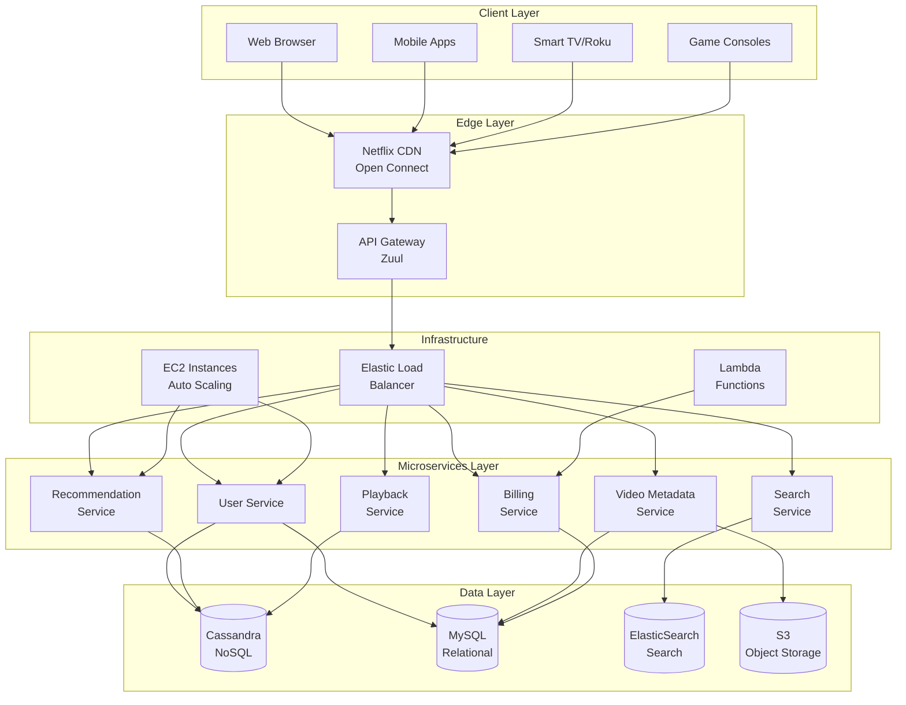

## 🔧 Core Microservices Architecture

**The World's Largest Production Microservices Ecosystem:**
Netflix operates **700+ microservices** in production, representing the most extensive and successful microservices transformation in industry history. This architecture enables **independent scaling, deployment, and failure isolation** across their global platform.

**Microservices Design Principles:**

**1. Business Capability Alignment:**
- **Domain-Driven Design**: Each microservice owns a complete business domain
- **Single Responsibility**: Services handle one business function exceptionally well
- **Autonomous Teams**: Full ownership from development to production support
- **API-First Design**: All inter-service communication through well-defined APIs

**2. Technology Diversity Strategy:**
- **Polyglot Architecture**: Teams choose optimal technologies for their specific use case
- **Java Ecosystem Dominance**: Primary platform with Spring Boot and reactive frameworks
- **Python for ML**: Machine learning services leverage Python's rich ecosystem
- **Node.js for Performance**: High-throughput services use JavaScript/Node.js
- **Scala for Data Processing**: Stream processing and analytics services

**3. Service Communication Patterns:**
- **Synchronous Communication**: REST APIs for real-time request-response patterns
- **Asynchronous Messaging**: Event-driven architecture using Apache Kafka
- **Circuit Breaker Pattern**: Hystrix library prevents cascade failures
- **Bulkhead Isolation**: Resource isolation prevents one service from affecting others

**4. Data Management Strategy:**
- **Database Per Service**: Each microservice owns its data store
- **Polyglot Persistence**: Different databases for different data patterns (Cassandra, MySQL, DynamoDB)
- **Event Sourcing**: Critical business events stored as immutable event streams
- **CQRS Implementation**: Separate read and write models for optimal performance

### 1. API Gateway (Zuul)
**Purpose**: Single entry point for all client requests

**Key Features**:
- **Dynamic routing** to appropriate microservices
- **Load balancing** across service instances
- **Authentication & authorization**
- **Rate limiting** and throttling
- **Request/response transformation**

**Technology Stack**:
- Netflix Zuul (custom-built)
- Ribbon for client-side load balancing
- Hystrix for circuit breaker pattern

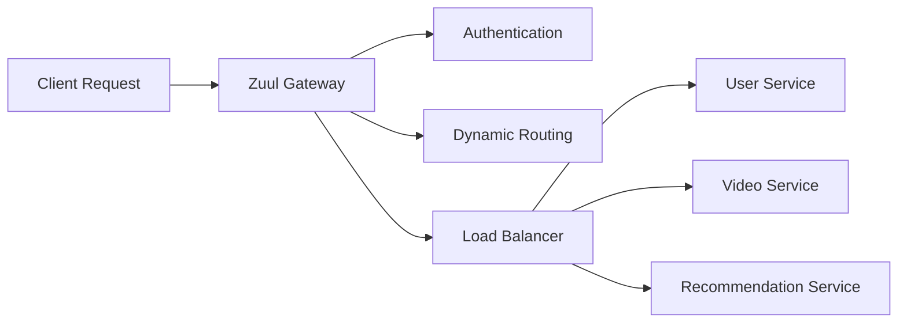

### 2. User Management Service
**Purpose**: Handle user profiles, preferences, and authentication

**Responsibilities**:
- User registration and authentication
- Profile management (multiple profiles per account)
- Viewing history tracking
- Parental controls
- Regional content restrictions

**Data Model**:
```json
{
  "userId": "12345",
  "email": "user@example.com",
  "profiles": [
    {
      "profileId": "profile1",
      "name": "John",
      "maturityLevel": "mature",
      "language": "en-US",
      "viewingHistory": [...]
    }
  ],
  "subscription": {
    "plan": "premium",
    "region": "US",
    "billingCycle": "monthly"
  }
}
```

### 3. Recommendation Engine
**Purpose**: Provide personalized content recommendations

**ML Pipeline**:
1. **Data Collection**: User behavior, content metadata, contextual data
2. **Feature Engineering**: User embeddings, content embeddings
3. **Model Training**: Collaborative filtering, deep learning models
4. **Real-time Serving**: A/B testing, multi-armed bandits
5. **Feedback Loop**: Implicit feedback (watch time, clicks)

**Architecture**:
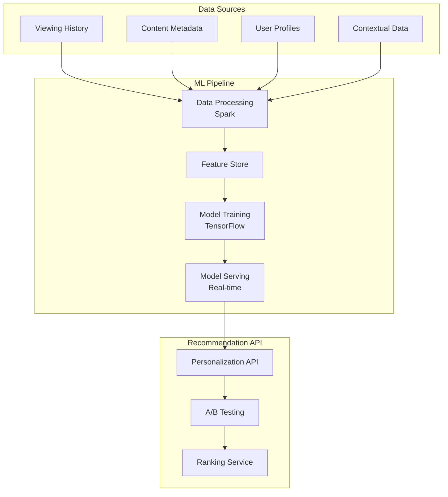

### 4. Video Metadata Service
**Purpose**: Manage content catalog and metadata

**Responsibilities**:
- Content ingestion and processing
- Metadata management (titles, descriptions, genres)
- Content categorization and tagging
- Regional availability rules
- Content lifecycle management

**Data Architecture**:
- **Master Data**: Canonical content information
- **Derived Data**: Processed metadata for different use cases
- **Cache Layer**: Redis for frequently accessed metadata

### 5. Playback Service
**Purpose**: Handle video streaming and playback

**Key Components**:
- **Adaptive Bitrate Streaming**: Adjust quality based on network conditions
- **DRM Integration**: Content protection and licensing
- **Subtitle/Audio Track Management**: Multiple language support
- **Playback Analytics**: Quality metrics and user experience data

**Streaming Protocol**:
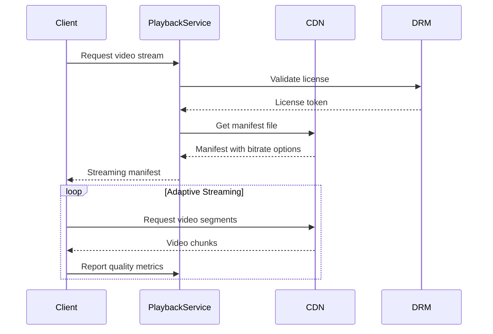

## 📡 Netflix CDN: Open Connect

### Architecture Overview
Netflix built their own CDN called **Open Connect** to deliver content efficiently worldwide.

**Key Components**:
1. **Open Connect Appliances (OCAs)**: Custom servers deployed at ISPs
2. **Control Plane**: Manages content distribution and routing
3. **Data Plane**: Handles actual content delivery

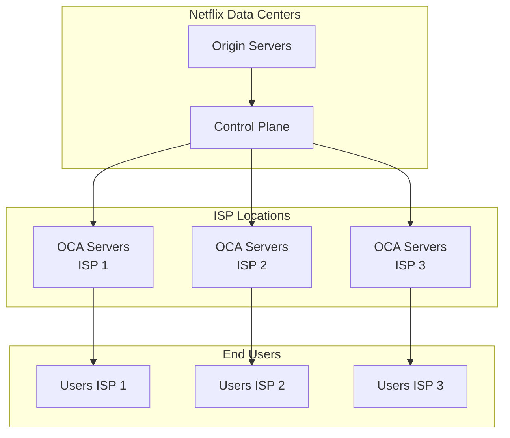

### Content Distribution Strategy

**Intelligent Content Placement Architecture:**

**1. Predictive Caching System:**
- **Machine Learning Algorithms**: Predict content popularity before it becomes popular
- **Viewing Pattern Analysis**: Analyze historical data to forecast demand spikes
- **Content Pre-positioning**: Push content to edge locations 24-48 hours before peak demand
- **Cache Efficiency**: Achieve 95%+ cache hit rates through predictive algorithms

**2. Regional Optimization Framework:**
- **Cultural Content Analysis**: Different regions prefer different content types and genres
- **Language-Specific Caching**: Subtitle and audio track variants cached regionally
- **Local Event Correlation**: Sports events, holidays, and cultural moments drive content preferences
- **Bandwidth Optimization**: Adapt content quality based on regional network capabilities

**3. Peak Hour Load Management:**
- **Off-Peak Distribution**: Content pushed during low-traffic hours (2-6 AM local time)
- **Traffic Shaping**: Intelligent throttling during peak hours to maintain quality
- **Quality Adaptation**: Dynamic bitrate adjustment based on network congestion
- **Load Balancing**: Distribute traffic across multiple OCA servers and ISP connections

**4. Multi-Level Failover Architecture:**
- **Primary OCA Failure**: Automatic failover to secondary OCA in same ISP
- **ISP-Level Failure**: Route traffic to nearby ISP with OCA deployment
- **Regional Failure**: Fallback to origin servers in AWS data centers
- **Content Unavailability**: Graceful degradation with lower quality alternatives

## 🔄 Data Flow Architecture

### User Registration and Onboarding
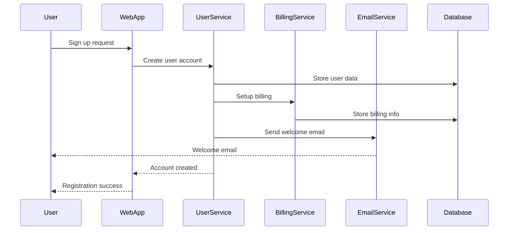

### Content Discovery and Recommendation Flow
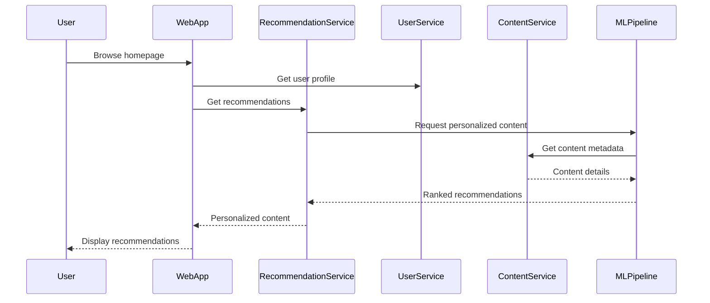

### Video Streaming Flow
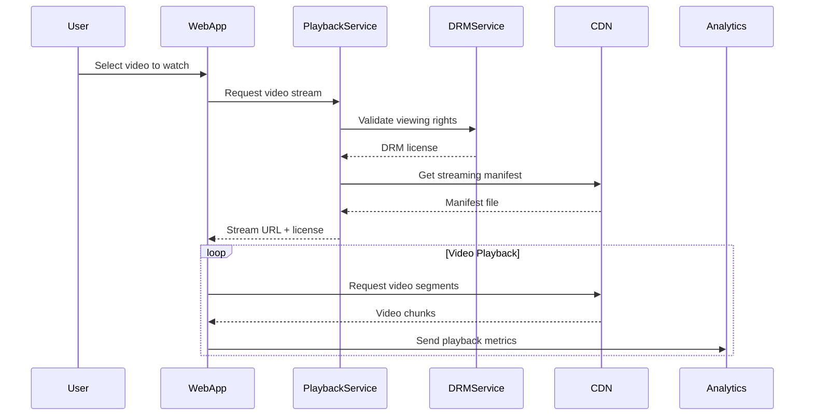

## 🗄️ Data Storage Architecture

### Database Strategy
Netflix uses a **polyglot persistence** approach, choosing the right database for each use case:

#### 1. Cassandra (Primary NoSQL)
**Use Cases**:
- User viewing history
- Content metadata
- Recommendation data
- Time-series data (analytics)

**Configuration**:
- Multi-region clusters
- RF=3 (Replication Factor)
- Eventual consistency
- Custom data models for each use case

#### 2. MySQL (Relational Data)
**Use Cases**:
- Billing information
- User account data
- Content licensing data
- Financial transactions

**Configuration**:
- Master-slave replication
- Read replicas for scaling
- ACID compliance for critical data

#### 3. ElasticSearch (Search & Analytics)
**Use Cases**:
- Content search
- Log analytics
- Real-time monitoring
- Business intelligence

#### 4. Redis (Caching)
**Use Cases**:
- Session storage
- Frequently accessed metadata
- Rate limiting counters
- Real-time recommendations

### Data Consistency Model
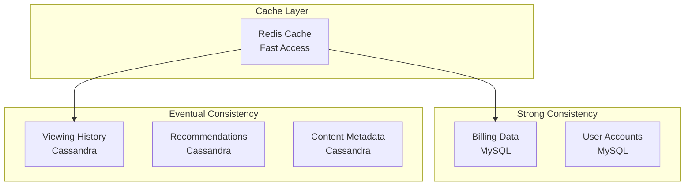

## 🔧 Infrastructure and DevOps

### Container Orchestration
Netflix uses **Titus**, their container management platform built on Apache Mesos:

**Key Features**:
- **Multi-tenant**: Isolated execution environments
- **Auto-scaling**: Based on CPU, memory, and custom metrics
- **Service discovery**: Automatic service registration
- **Health checking**: Continuous health monitoring

### Deployment Pipeline
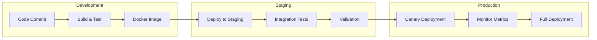

### Chaos Engineering
Netflix pioneered **Chaos Engineering** with tools like:

1. **Chaos Monkey**: Randomly terminates service instances
2. **Chaos Gorilla**: Simulates entire availability zone failures
3. **Chaos Kong**: Simulates entire region failures
4. **Latency Monkey**: Introduces artificial latency
5. **Security Monkey**: Identifies security vulnerabilities

## 📊 Monitoring and Observability

### Metrics and Monitoring Stack
1. **Atlas**: Time-series database for metrics
2. **Spectator**: Client library for metrics collection
3. **Kayenta**: Automated canary analysis
4. **Vizceral**: Real-time traffic visualization

### Key Metrics Tracked
- **SPS (Starts Per Second)**: Video playback initiations
- **Rebuffer Rate**: Video buffering incidents
- **Error Rate**: Service error percentages
- **Latency**: P99 response times
- **Availability**: Service uptime percentages

### Alerting Strategy
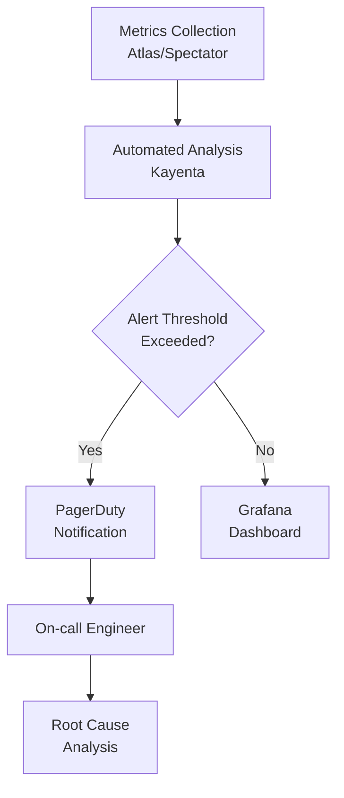

## 🧠 Machine Learning at Scale

### Recommendation System Architecture
Netflix's recommendation system processes over **1 billion hours** of viewing data monthly:

#### Data Pipeline
1. **Real-time Stream Processing**: Kafka + Apache Spark
2. **Batch Processing**: Apache Spark on EMR
3. **Feature Store**: Centralized feature management
4. **Model Training**: TensorFlow on GPU clusters
5. **Model Serving**: Custom serving infrastructure

#### ML Models Used
1. **Collaborative Filtering**: User-item interactions
2. **Content-Based Filtering**: Content similarity
3. **Deep Neural Networks**: Complex pattern recognition
4. **Multi-Armed Bandits**: Exploration vs exploitation
5. **Reinforcement Learning**: Long-term user engagement

### A/B Testing Platform
Netflix runs **thousands of A/B tests** simultaneously:

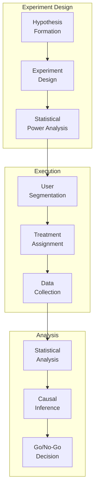

## 🌍 Global Scale and Multi-Region Architecture

### Regional Deployment Strategy
Netflix operates in **3 AWS regions** with active-active configuration:

1. **US-East-1 (Virginia)**: Primary region
2. **US-West-2 (Oregon)**: Secondary region  
3. **EU-West-1 (Ireland)**: European region

### Cross-Region Data Replication
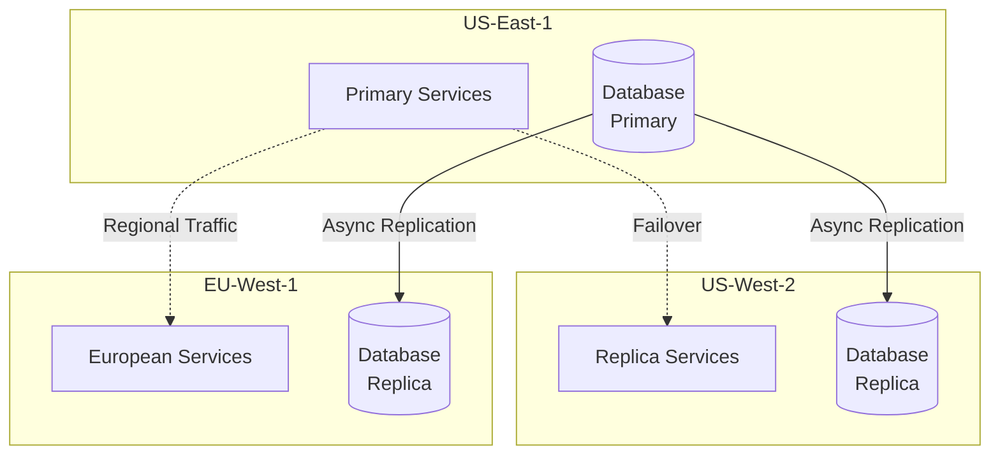

### Disaster Recovery
- **RTO (Recovery Time Objective)**: 15 minutes
- **RPO (Recovery Point Objective)**: 5 minutes
- **Automated failover** between regions
- **Data backup** across multiple regions

## 💰 Cost Optimization Strategies

### AWS Cost Management
Netflix spends **~$1 billion annually** on AWS. Key optimization strategies:

1. **Reserved Instances**: 80% of compute on reserved instances
2. **Spot Instances**: Batch processing workloads
3. **Auto-scaling**: Dynamic capacity management
4. **Resource Right-sizing**: Continuous optimization
5. **Data Transfer Optimization**: CDN and regional strategies

### Efficiency Metrics
- **Cost per Stream Start**: ~$0.003
- **Cost per Viewing Hour**: ~$0.001
- **Infrastructure Cost**: ~15% of revenue
- **Bandwidth Savings**: 40% through Open Connect

## 🔒 Security Architecture

### Multi-layered Security Approach
1. **Network Security**: VPC, security groups, NACLs
2. **Application Security**: OAuth, JWT tokens, RBAC
3. **Data Security**: Encryption at rest and in transit
4. **Infrastructure Security**: IAM, automated security scanning
5. **Content Protection**: DRM, watermarking

### DRM and Content Protection
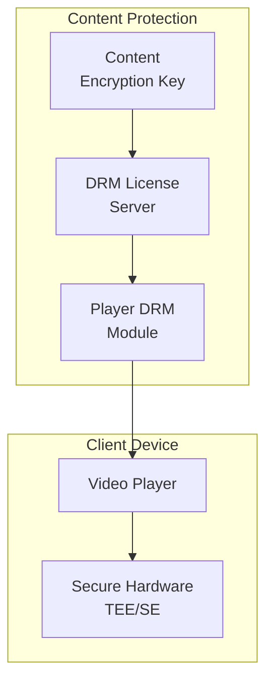

## 📈 Performance Optimization

### Caching Strategy
Multi-level caching for optimal performance:

1. **Browser Cache**: Static assets (24 hours)
2. **CDN Cache**: Video content (persistent)
3. **Application Cache**: API responses (Redis, 5 minutes)
4. **Database Cache**: Query results (Memcached, 1 hour)

### Performance Metrics
- **Time to First Byte**: <100ms
- **Video Start Time**: <3 seconds
- **Rebuffer Rate**: <0.5%
- **API Response Time**: P99 <500ms

## 🚀 Innovation and Future Directions

### Emerging Technologies
1. **AV1 Codec**: Next-generation video compression
2. **Machine Learning**: Enhanced personalization
3. **Edge Computing**: Closer content delivery
4. **5G Integration**: Mobile streaming optimization
5. **Interactive Content**: Choose-your-adventure content

### Technical Debt Management
- **Microservice Decomposition**: Breaking down large services
- **Legacy System Migration**: Gradual modernization
- **API Versioning**: Backward compatibility strategies
- **Database Optimization**: Performance tuning

## 📚 Key Lessons Learned

### Architectural Principles
1. **Embrace Failure**: Design for failure from day one
2. **Loose Coupling**: Services should be independently deployable
3. **High Cohesion**: Related functionality should be grouped together
4. **Stateless Services**: Enable easy scaling and recovery
5. **Eventual Consistency**: Accept trade-offs for scale

### Operational Excellence
1. **Automation First**: Automate everything that can be automated
2. **Measure Everything**: Comprehensive metrics and monitoring
3. **Fail Fast**: Quick detection and recovery from failures
4. **Continuous Improvement**: Regular retrospectives and optimizations
5. **Culture of Learning**: Embrace experimentation and learning

### Scaling Challenges Overcome
1. **Database Scaling**: From single MySQL to distributed NoSQL
2. **Service Discovery**: From static configuration to dynamic discovery
3. **Load Balancing**: From hardware to software load balancers
4. **Deployment**: From manual to fully automated deployments
5. **Monitoring**: From reactive to predictive monitoring

## 🎯 Business Impact

### Key Metrics
- **230M+ subscribers** globally
- **15,000+ titles** in content library
- **1B+ hours** watched monthly
- **190+ countries** served
- **$30B+ annual revenue**

### Competitive Advantages
1. **Personalization**: Best-in-class recommendation engine
2. **Global Scale**: Seamless worldwide content delivery
3. **Original Content**: Data-driven content creation
4. **User Experience**: Minimal buffering, fast load times
5. **Innovation**: Cutting-edge technology adoption

## 🔮 Future Architecture Evolution

### Next 5 Years Vision
1. **Serverless Architecture**: Function-as-a-Service adoption
2. **AI-First**: Machine learning in every component
3. **Real-time Personalization**: Sub-second recommendation updates
4. **Global Edge**: Content delivery from edge locations
5. **Interactive Experiences**: Gaming and interactive content integration

This comprehensive case study demonstrates how Netflix successfully transformed from a DVD rental service to a global streaming giant through innovative microservices architecture, cutting-edge technology adoption, and relentless focus on user experience. Their journey provides invaluable lessons for building and scaling distributed systems at global scale.
