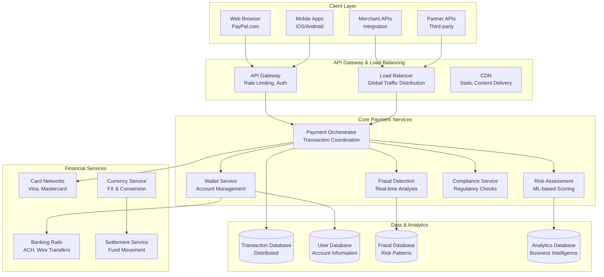
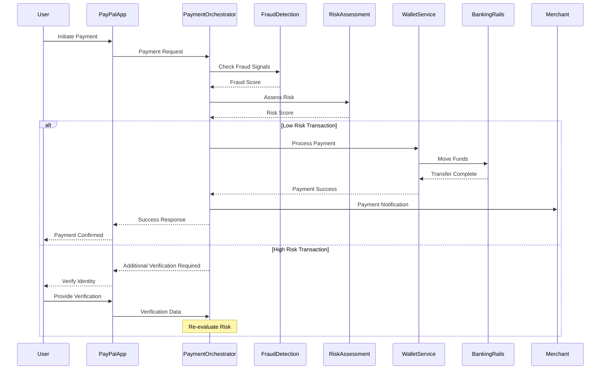
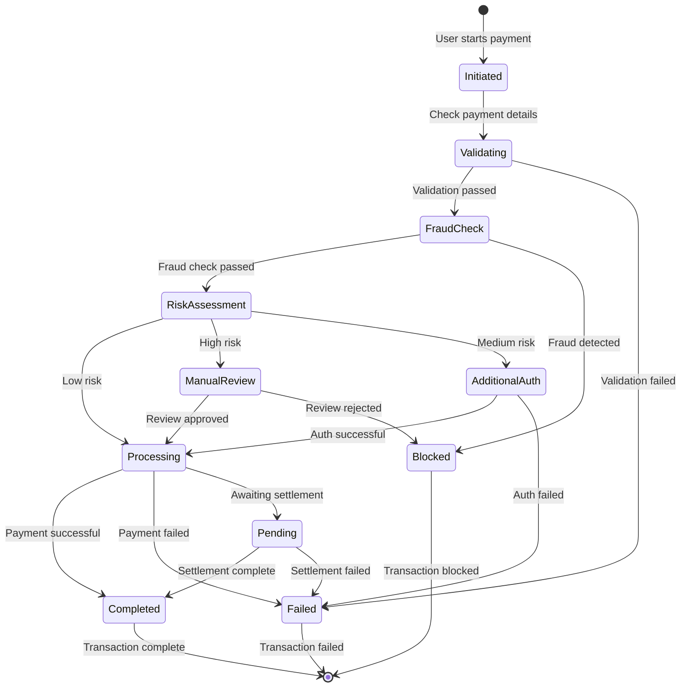
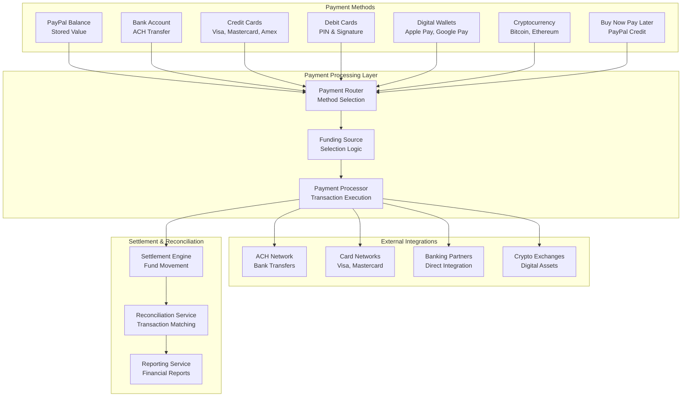
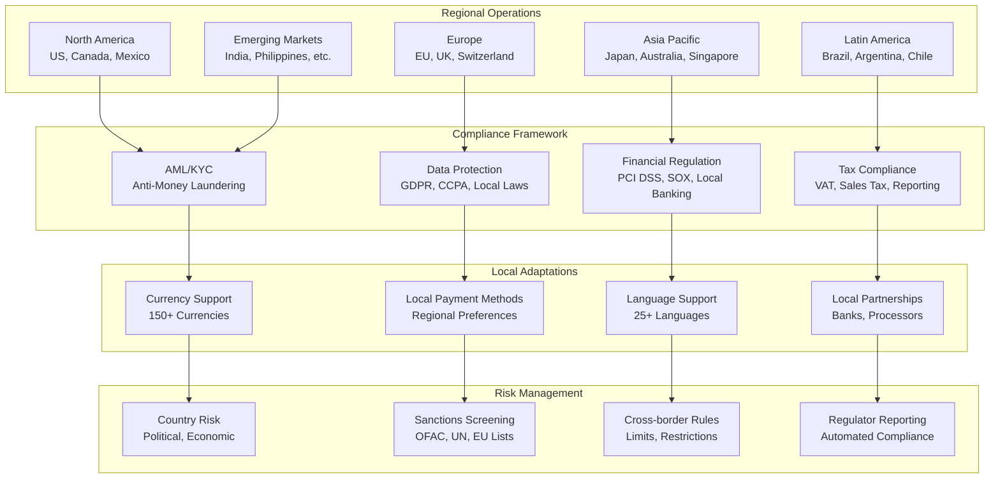
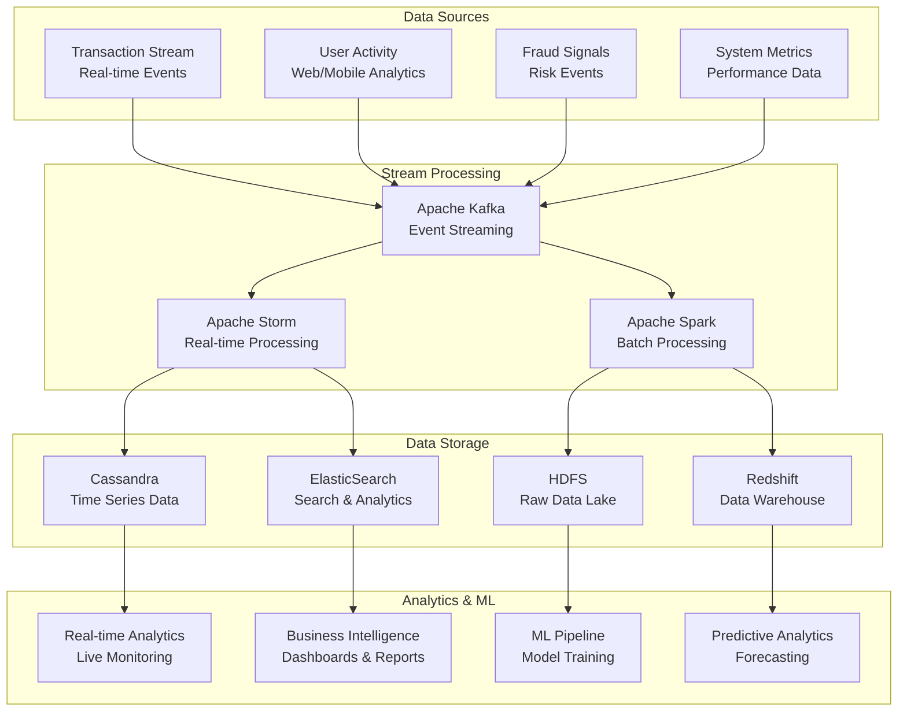
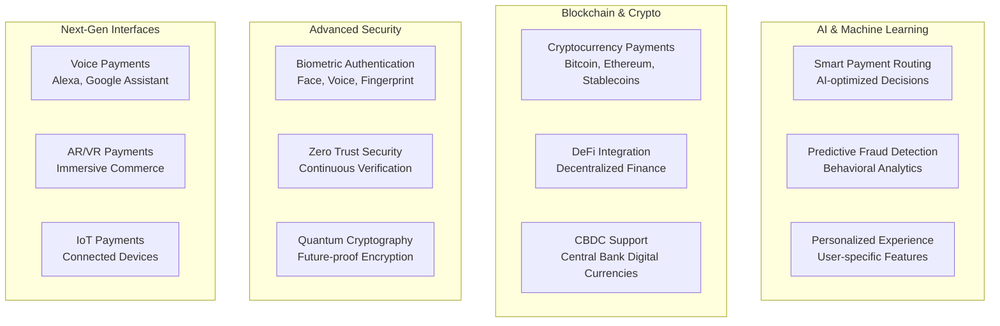

# PayPal Payment Processing System: Handling Billions of Transactions

## 💳 Executive Summary

PayPal operates one of the world's largest payment processing platforms, handling over **22 billion transactions** annually worth more than **$1.4 trillion** in payment volume. Serving **430+ million active accounts** across **200+ markets**, PayPal's system processes **$41 billion in payment volume** every day while maintaining **99.99%+ availability** and industry-leading fraud detection capabilities.

## 📈 Business Scale and Impact

### Key Metrics (2023)
- **430+ million active accounts** globally
- **22+ billion transactions** processed annually
- **$1.4+ trillion** in total payment volume (TPV)
- **$41+ billion** daily payment volume
- **200+ markets** and currencies supported
- **99.99%+ availability** during peak traffic
- **<0.1% fraud rate** through advanced ML detection
- **32+ million merchants** using PayPal services

### Transaction Types
1. **Person-to-Person (P2P)**: Peer-to-peer money transfers
2. **E-commerce**: Online merchant payments
3. **In-store**: Mobile point-of-sale payments
4. **Bill Pay**: Utility and subscription payments
5. **International**: Cross-border remittances
6. **Business**: B2B payment solutions

## 🏛️ High-Level Architecture



## 💰 Payment Processing Architecture

**World's Most Sophisticated Payment Processing System:**
PayPal's payment architecture handles **22+ billion transactions annually** worth over **$1.4 trillion**, representing one of the most complex financial systems ever built. The platform processes **$41+ billion daily** while maintaining **99.99%+ availability**, **sub-second transaction times**, and **industry-leading fraud detection** across **200+ markets** and currencies.

**Multi-Layered Payment Processing Architecture:**

**1. Transaction Orchestration Engine:**
- **Payment Routing**: Intelligent routing of transactions through optimal payment rails and processors
- **Multi-Tender Support**: Single transaction can use multiple funding sources (wallet, card, bank)
- **Real-Time Authorization**: Sub-second authorization decisions across global banking networks
- **Fallback Mechanisms**: Automatic failover to alternative payment methods when primary fails
- **Idempotency Guarantees**: Ensures duplicate transactions are handled safely without double-charging

**2. Risk and Fraud Management:**
- **Real-Time Fraud Detection**: Machine learning models analyze hundreds of signals per transaction
- **Behavioral Analytics**: User behavior patterns analyzed for anomaly detection
- **Device Fingerprinting**: Unique device identification for fraud prevention
- **Velocity Checks**: Transaction frequency and amount limits based on user profiles
- **Global Fraud Network**: Shared intelligence across PayPal's global transaction network

**3. Regulatory Compliance Engine:**
- **Anti-Money Laundering (AML)**: Real-time screening against global watchlists
- **Know Your Customer (KYC)**: Identity verification and customer due diligence
- **Cross-Border Regulations**: Compliance with international transfer regulations
- **Tax Reporting**: Automatic tax reporting and 1099 generation for applicable transactions
- **Data Residency**: Ensuring data stays within required jurisdictions

**4. Multi-Currency and Localization:**
- **Real-Time Currency Conversion**: Live exchange rates with competitive margins
- **Local Payment Methods**: Integration with region-specific payment preferences
- **Regulatory Adaptation**: Country-specific compliance and business rules
- **Local Banking Integration**: Direct connections to local banking systems
- **Cultural Customization**: User experience adapted for local markets

**Payment Processing Pipeline:**

**1. Transaction Initiation and Validation:**
- **Request Parsing**: Payment requests validated for completeness and format
- **Authentication**: Multi-factor authentication and session validation
- **Amount Validation**: Currency conversion and amount limit checks
- **Merchant Verification**: Recipient account validation and status checks
- **Funding Source Validation**: Available balance and payment method verification

**2. Risk Assessment and Fraud Detection:**
- **Multi-Model Scoring**: Ensemble of ML models provides comprehensive risk assessment
- **Real-Time Feature Engineering**: Dynamic feature extraction from transaction context
- **Graph Analytics**: Relationship analysis to detect coordinated fraud attempts
- **Behavioral Biometrics**: Typing patterns and interaction analysis for authentication
- **External Data Integration**: Third-party data sources for enhanced risk assessment

**3. Payment Authorization and Processing:**
- **Optimal Route Selection**: AI-powered routing to maximize approval rates and minimize costs
- **Multi-Rail Processing**: Simultaneous processing across multiple payment networks
- **Real-Time Settlement**: Immediate fund movement for eligible transactions
- **Exception Handling**: Sophisticated retry logic and error recovery mechanisms
- **Transaction Monitoring**: Continuous monitoring throughout payment lifecycle

**4. Post-Transaction Processing:**
- **Settlement and Reconciliation**: Automated reconciliation with banking partners
- **Dispute Management**: Chargeback and dispute resolution workflows
- **Reporting and Analytics**: Real-time transaction reporting and business intelligence
- **Audit Trail**: Comprehensive logging for compliance and investigation
- **Customer Notification**: Real-time alerts and transaction confirmations

### Transaction Flow


### Payment State Machine


## 🔐 Fraud Detection System

## 💳 Multi-Payment Method Architecture

### Payment Method Integration
PayPal supports **multiple payment methods** with unified processing:



### Smart Payment Routing
```python
class PaymentRoutingEngine:
    def __init__(self):
        self.cost_calculator = CostCalculator()
        self.success_rate_predictor = SuccessRatePredictor()
        self.compliance_checker = ComplianceChecker()
        self.fraud_assessor = FraudAssessor()
    
    def select_optimal_payment_method(self, transaction, available_methods):
        """Select optimal payment method based on multiple factors"""
        
        routing_options = []
        
        for method in available_methods:
            # Calculate routing score
            score_factors = {}
            
            # Cost factor (processing fees)
            processing_cost = self.cost_calculator.calculate_cost(method, transaction)
            score_factors['cost'] = 1.0 - (processing_cost / transaction['amount'])
            
            # Success rate factor
            predicted_success_rate = self.success_rate_predictor.predict_success_rate(
                method, transaction
            )
            score_factors['success_rate'] = predicted_success_rate
            
            # Speed factor (settlement time)
            settlement_speed = self.get_settlement_speed(method, transaction)
            score_factors['speed'] = self.normalize_speed_score(settlement_speed)
            
            # Compliance factor
            compliance_score = self.compliance_checker.check_compliance(method, transaction)
            score_factors['compliance'] = compliance_score
            
            # Fraud risk factor
            fraud_risk = self.fraud_assessor.assess_method_fraud_risk(method, transaction)
            score_factors['fraud_risk'] = 1.0 - fraud_risk
            
            # User preference factor
            user_preference = self.get_user_preference_score(
                transaction['user_id'], method
            )
            score_factors['user_preference'] = user_preference
            
            # Calculate weighted score
            weights = {
                'cost': 0.2,
                'success_rate': 0.3,
                'speed': 0.15,
                'compliance': 0.15,
                'fraud_risk': 0.1,
                'user_preference': 0.1
            }
            
            overall_score = sum(
                score_factors[factor] * weight
                for factor, weight in weights.items()
            )
            
            routing_options.append({
                'payment_method': method,
                'overall_score': overall_score,
                'score_breakdown': score_factors,
                'estimated_cost': processing_cost,
                'predicted_success_rate': predicted_success_rate,
                'settlement_time_hours': settlement_speed
            })
        
        # Sort by overall score (descending)
        routing_options.sort(key=lambda x: x['overall_score'], reverse=True)
        
        # Return top recommendation with fallbacks
        return {
            'primary_method': routing_options[0],
            'fallback_methods': routing_options[1:3],  # Top 2 fallbacks
            'routing_decision_factors': self.explain_routing_decision(routing_options[0])
        }
    
    def explain_routing_decision(self, selected_option):
        """Generate explanation for routing decision"""
        
        explanations = []
        score_breakdown = selected_option['score_breakdown']
        
        if score_breakdown['success_rate'] > 0.9:
            explanations.append("High predicted success rate")
        
        if score_breakdown['cost'] > 0.8:
            explanations.append("Low processing cost")
        
        if score_breakdown['speed'] > 0.8:
            explanations.append("Fast settlement time")
        
        if score_breakdown['user_preference'] > 0.7:
            explanations.append("Matches user preference")
        
        return explanations

class SuccessRatePredictor:
    """Predict payment method success rates"""
    
    def __init__(self):
        self.historical_data = HistoricalPaymentData()
        self.ml_model = SuccessRateModel()
    
    def predict_success_rate(self, payment_method, transaction):
        """Predict success rate for payment method"""
        
        # Extract features
        features = {
            'payment_method': payment_method['type'],
            'amount': transaction['amount'],
            'currency': transaction['currency'],
            'merchant_category': transaction.get('merchant_category'),
            'user_country': transaction.get('user_country'),
            'time_of_day': datetime.now().hour,
            'day_of_week': datetime.now().weekday(),
        }
        
        # Get historical success rate
        historical_rate = self.historical_data.get_success_rate(
            payment_method=payment_method['type'],
            filters=features
        )
        
        # Get ML prediction
        ml_prediction = self.ml_model.predict(features)
        
        # Combine historical and ML predictions
        combined_prediction = (historical_rate * 0.6) + (ml_prediction * 0.4)
        
        # Apply business rules
        if payment_method['type'] == 'credit_card':
            if features['amount'] > 10000:  # High amount transactions
                combined_prediction *= 0.9  # Slightly lower success rate
        
        if payment_method['type'] == 'bank_account':
            if features['day_of_week'] >= 5:  # Weekend
                combined_prediction *= 0.8  # Banks may be slower
        
        return min(combined_prediction, 1.0)
```

## 🌍 Global Operations and Compliance

### Multi-Market Architecture
PayPal operates in **200+ markets** with local compliance:



### Compliance Automation
```python
class ComplianceEngine:
    def __init__(self):
        self.aml_service = AMLService()
        self.sanctions_screener = SanctionsScreener()
        self.kyc_service = KYCService()
        self.regulatory_reporter = RegulatoryReporter()
    
    def process_compliance_check(self, transaction):
        """Comprehensive compliance check for transaction"""
        
        compliance_results = {
            'transaction_id': transaction['id'],
            'compliance_status': 'pending',
            'checks_performed': [],
            'violations_found': [],
            'actions_required': []
        }
        
        # 1. AML (Anti-Money Laundering) Check
        aml_result = self.aml_service.check_transaction(transaction)
        compliance_results['checks_performed'].append('AML')
        
        if aml_result['risk_level'] == 'high':
            compliance_results['violations_found'].append('AML_HIGH_RISK')
            compliance_results['actions_required'].append('MANUAL_REVIEW')
        
        # 2. Sanctions Screening
        sanctions_result = self.sanctions_screener.screen_parties(
            sender=transaction['sender'],
            recipient=transaction['recipient'],
            countries=[transaction['sender_country'], transaction['recipient_country']]
        )
        compliance_results['checks_performed'].append('SANCTIONS')
        
        if sanctions_result['matches_found']:
            compliance_results['violations_found'].append('SANCTIONS_MATCH')
            compliance_results['actions_required'].append('BLOCK_TRANSACTION')
        
        # 3. KYC (Know Your Customer) Check
        kyc_result = self.kyc_service.verify_customer_status(transaction['sender'])
        compliance_results['checks_performed'].append('KYC')
        
        if not kyc_result['verified']:
            compliance_results['violations_found'].append('KYC_INCOMPLETE')
            compliance_results['actions_required'].append('REQUEST_DOCUMENTATION')
        
        # 4. Transaction Limits Check
        limits_result = self.check_transaction_limits(transaction)
        compliance_results['checks_performed'].append('LIMITS')
        
        if limits_result['exceeds_limits']:
            compliance_results['violations_found'].append('LIMIT_EXCEEDED')
            compliance_results['actions_required'].append('REQUIRE_ADDITIONAL_AUTH')
        
        # 5. Cross-border Regulations
        if transaction['sender_country'] != transaction['recipient_country']:
            cross_border_result = self.check_cross_border_compliance(transaction)
            compliance_results['checks_performed'].append('CROSS_BORDER')
            
            if not cross_border_result['compliant']:
                compliance_results['violations_found'].append('CROSS_BORDER_VIOLATION')
                compliance_results['actions_required'].append('REJECT_TRANSACTION')
        
        # Determine final compliance status
        if 'BLOCK_TRANSACTION' in compliance_results['actions_required']:
            compliance_results['compliance_status'] = 'blocked'
        elif 'REJECT_TRANSACTION' in compliance_results['actions_required']:
            compliance_results['compliance_status'] = 'rejected'
        elif compliance_results['actions_required']:
            compliance_results['compliance_status'] = 'requires_action'
        else:
            compliance_results['compliance_status'] = 'approved'
        
        # Generate regulatory reports if required
        if compliance_results['violations_found']:
            self.regulatory_reporter.generate_suspicious_activity_report(
                transaction, compliance_results
            )
        
        return compliance_results
    
    def check_transaction_limits(self, transaction):
        """Check transaction against various limits"""
        
        user_limits = self.get_user_limits(transaction['sender'])
        merchant_limits = self.get_merchant_limits(transaction.get('merchant_id'))
        country_limits = self.get_country_limits(
            transaction['sender_country'], 
            transaction['recipient_country']
        )
        
        # Check individual transaction limit
        if transaction['amount'] > user_limits['single_transaction_limit']:
            return {
                'exceeds_limits': True,
                'limit_type': 'single_transaction',
                'limit_value': user_limits['single_transaction_limit'],
                'transaction_amount': transaction['amount']
            }
        
        # Check daily limit
        daily_total = self.get_daily_transaction_total(transaction['sender'])
        if daily_total + transaction['amount'] > user_limits['daily_limit']:
            return {
                'exceeds_limits': True,
                'limit_type': 'daily',
                'limit_value': user_limits['daily_limit'],
                'current_total': daily_total,
                'transaction_amount': transaction['amount']
            }
        
        # Check monthly limit
        monthly_total = self.get_monthly_transaction_total(transaction['sender'])
        if monthly_total + transaction['amount'] > user_limits['monthly_limit']:
            return {
                'exceeds_limits': True,
                'limit_type': 'monthly',
                'limit_value': user_limits['monthly_limit'],
                'current_total': monthly_total,
                'transaction_amount': transaction['amount']
            }
        
        return {'exceeds_limits': False}

class AMLService:
    """Anti-Money Laundering service"""
    
    def __init__(self):
        self.risk_model = AMLRiskModel()
        self.pattern_detector = PatternDetector()
        self.watchlist_screener = WatchlistScreener()
    
    def check_transaction(self, transaction):
        """Perform AML check on transaction"""
        
        risk_factors = []
        
        # 1. Check for structuring (breaking large amounts into smaller ones)
        structuring_risk = self.detect_structuring(transaction)
        if structuring_risk > 0.7:
            risk_factors.append('structuring')
        
        # 2. Check for unusual patterns
        pattern_risk = self.pattern_detector.analyze_transaction_patterns(transaction)
        if pattern_risk > 0.6:
            risk_factors.append('unusual_patterns')
        
        # 3. Check against watchlists
        watchlist_matches = self.watchlist_screener.check_parties(transaction)
        if watchlist_matches:
            risk_factors.append('watchlist_match')
        
        # 4. Geographic risk assessment
        geo_risk = self.assess_geographic_risk(transaction)
        if geo_risk > 0.8:
            risk_factors.append('high_risk_geography')
        
        # 5. Velocity analysis
        velocity_risk = self.analyze_velocity(transaction)
        if velocity_risk > 0.7:
            risk_factors.append('high_velocity')
        
        # Calculate overall risk level
        if len(risk_factors) >= 3:
            risk_level = 'high'
        elif len(risk_factors) >= 1:
            risk_level = 'medium'
        else:
            risk_level = 'low'
        
        return {
            'risk_level': risk_level,
            'risk_factors': risk_factors,
            'risk_score': len(risk_factors) / 5.0,  # Normalized score
            'requires_reporting': risk_level == 'high'
        }
    
    def detect_structuring(self, transaction):
        """Detect potential structuring behavior"""
        
        user_id = transaction['sender']
        amount = transaction['amount']
        
        # Look for multiple transactions just under reporting thresholds
        threshold = 10000  # $10,000 reporting threshold
        
        if amount < threshold * 0.9:  # Within 90% of threshold
            # Check for similar amounts in recent history
            recent_transactions = self.get_recent_transactions(user_id, days=7)
            
            similar_amounts = [
                tx for tx in recent_transactions 
                if abs(tx['amount'] - amount) < threshold * 0.1
            ]
            
            if len(similar_amounts) >= 3:  # 3 or more similar transactions
                total_amount = sum(tx['amount'] for tx in similar_amounts) + amount
                
                if total_amount > threshold:
                    return 0.9  # High structuring risk
        
        return 0.0  # No structuring detected
```

## 📊 Analytics and Business Intelligence

### Real-time Analytics Architecture


## 💡 Innovation and Future Directions

### Emerging Technologies
1. **Blockchain Integration**: Cryptocurrency support and DeFi integration
2. **AI-Powered Personalization**: Smart financial recommendations
3. **Biometric Authentication**: Enhanced security with biometrics
4. **IoT Payments**: Internet of Things payment capabilities
5. **Quantum-Resistant Cryptography**: Future-proof security

### Next-Generation Payment Features


## 📚 Key Lessons Learned

### Technical Architecture Lessons
1. **Distributed Systems**: Design for failure and eventual consistency
2. **Real-time Processing**: Balance speed with accuracy in fraud detection
3. **Scalability**: Horizontal scaling with microservices architecture
4. **Security**: Defense in depth with multiple security layers
5. **Compliance**: Automate regulatory compliance from day one

### Business Strategy Lessons
1. **Global Expansion**: Local adaptation while maintaining core platform
2. **Trust Building**: Transparency and security build customer trust
3. **Network Effects**: Two-sided marketplace benefits from scale
4. **Innovation**: Continuous innovation in payments and financial services
5. **Partnerships**: Strategic partnerships expand reach and capabilities

### Operational Excellence
1. **Monitoring**: Comprehensive monitoring and alerting systems
2. **Automation**: Automate fraud detection and compliance processes
3. **Resilience**: Build systems that gracefully handle failures
4. **Performance**: Sub-second response times for critical operations
5. **Customer Support**: 24/7 global customer support infrastructure

## 🎯 Business Impact and Future

### Financial Performance
- **$25+ billion revenue** (2022)
- **430+ million active accounts**
- **$1.4+ trillion payment volume**
- **32+ million merchants**
- **Global market leader** in digital payments

### Market Position
1. **Digital Payments Pioneer**: First major online payment platform
2. **Global Reach**: Operations in 200+ markets
3. **Trust and Security**: Industry-leading fraud protection
4. **Innovation Leader**: Continuous payment innovation
5. **Financial Inclusion**: Enabling digital commerce globally

This comprehensive case study demonstrates how PayPal built and operates one of the world's most sophisticated payment processing platforms, handling billions of transactions while maintaining security, compliance, and user trust across global markets.
