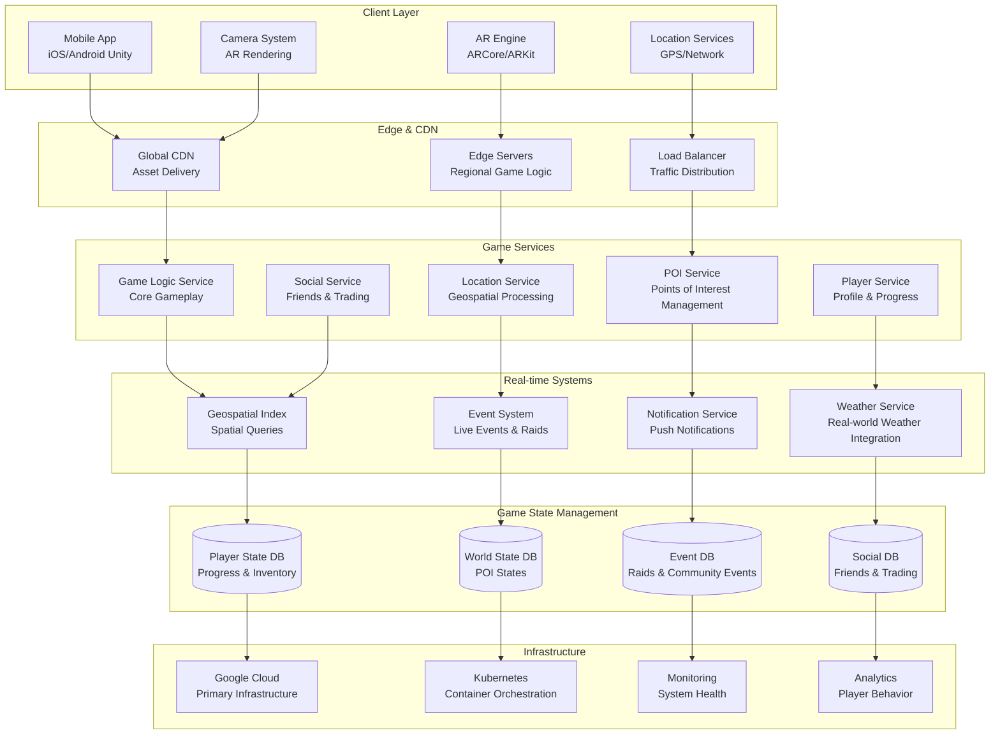
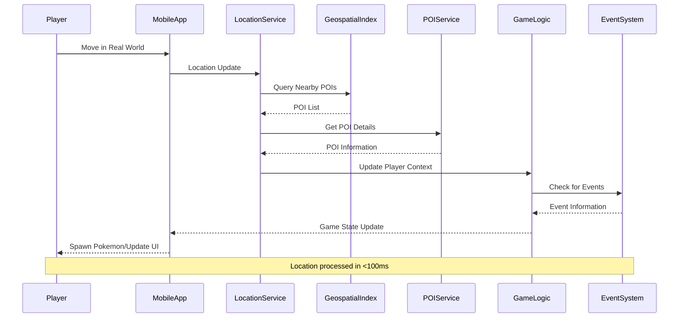
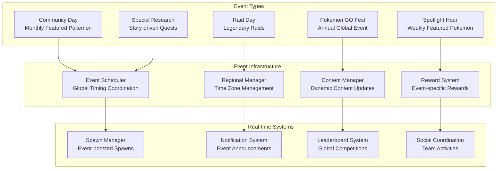

# Pokemon GO Location-Based Gaming: AR Gaming Infrastructure at Global Scale

## 🎮 Executive Summary

Pokemon GO revolutionized mobile gaming by creating the world's largest **location-based augmented reality game**, serving **147+ million monthly active users** across **153 countries**. Processing **billions of location updates** daily while managing **millions of virtual POIs (Points of Interest)**, Pokemon GO's architecture combines **real-time geospatial processing**, **AR rendering**, **massive multiplayer coordination**, and **global event management** to deliver seamless gaming experiences that encourage **5+ billion kilometers of walking** since launch.

## 📈 Scale and Business Impact

### Key Metrics
- **147+ million monthly active users**
- **1+ billion downloads** since 2016 launch
- **153 countries** with active gameplay
- **Billions of location updates** processed daily
- **40+ million POIs** (Pokestops, Gyms) globally
- **5+ billion kilometers** walked by players
- **99.9%+ uptime** during major events
- **$6+ billion revenue** since launch
- **Peak: 232 million MAU** (July 2016)

### Game Evolution Timeline
- **2016**: Initial launch, global phenomenon
- **2017**: Gen 2 Pokemon, weather system
- **2018**: Trading system, friends feature
- **2019**: Team Rocket battles, PvP battles
- **2020**: COVID-19 adaptations, remote play
- **2021**: Mega Evolution, seasons system
- **2022**: Routes feature, party play

## 🏛️ High-Level Architecture

## 🌍 Geospatial Architecture

### Real-Time Location Processing
Pokemon GO processes **billions of location updates** daily:

## 📊 Real-Time Event Management

### Global Event Coordination
Pokemon GO manages **worldwide simultaneous events** for millions of players:

## 📚 Key Lessons Learned

### Technical Architecture Lessons
1. **Geospatial Processing**: H3 hexagonal indexing enables efficient spatial queries at global scale
2. **Real-Time Location**: Processing billions of location updates requires sophisticated anti-cheat systems
3. **Event Coordination**: Global events need precise timing coordination across time zones
4. **AR Integration**: Seamless AR experiences require optimization for diverse mobile hardware
5. **Anti-Cheat Systems**: Location-based games need comprehensive cheat detection and prevention

### Business Strategy Lessons
1. **Location-Based Engagement**: Real-world movement creates unprecedented user engagement
2. **Community Building**: Social features and events drive long-term retention
3. **Freemium Monetization**: Optional purchases enhance gameplay without creating pay-to-win
4. **Global Localization**: Cultural adaptation essential for worldwide success
5. **Health & Safety**: Promoting safe play while encouraging physical activity

### Operational Excellence
1. **Global Infrastructure**: Multi-region deployment essential for worldwide player base
2. **Event Management**: Sophisticated event systems enable engaging live experiences
3. **Performance Monitoring**: Real-time monitoring of game performance and player experience
4. **Community Management**: Active community engagement and feedback integration
5. **Safety Systems**: Comprehensive safety features for real-world gameplay

## 🎯 Business Impact

### Financial Performance
- **$6+ billion revenue** since 2016 launch
- **147+ million monthly active users**
- **1+ billion downloads** globally
- **Strong in-app purchase** conversion rates
- **Sustained engagement** over 7+ years

### Market Position
1. **AR Gaming Pioneer**: Created and defined the location-based AR gaming category
2. **Global Phenomenon**: Massive cultural impact and mainstream adoption
3. **Health & Fitness**: Encouraged billions of kilometers of walking and outdoor activity
4. **Social Gaming**: Demonstrated power of real-world social gaming experiences
5. **Technology Innovation**: Advanced mobile AR and geospatial gaming technology

### Social Impact
1. **Physical Activity**: Encouraged millions to walk and exercise outdoors
2. **Social Connections**: Brought people together through shared gaming experiences
3. **Local Discovery**: Helped players discover local landmarks and points of interest
4. **Community Events**: Created real-world community gatherings and events
5. **Cultural Phenomenon**: Became part of popular culture and social conversation

This comprehensive case study demonstrates how Pokemon GO created the world's most successful location-based AR game, processing billions of location updates while coordinating global events and maintaining anti-cheat systems that ensure fair play for hundreds of millions of players worldwide.
