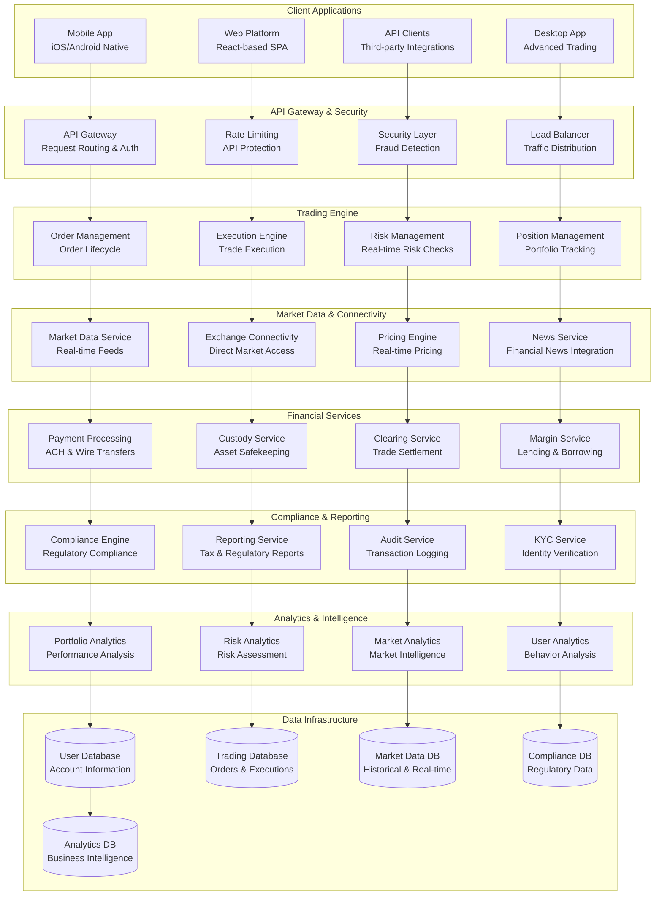

# Robinhood High-Frequency Trading Platform: Commission-Free Trading at Scale

## 📈 Executive Summary

Robinhood operates one of the world's most sophisticated commission-free trading platforms, serving **23+ million users** who execute **billions of trades annually** worth **$1+ trillion in trading volume**. Processing **millions of orders daily** with **sub-millisecond execution speeds**, Robinhood's architecture combines **high-frequency trading systems**, **real-time market data processing**, **sophisticated risk management**, and **mobile-first user experience** to democratize financial trading for retail investors.

## 📈 Scale and Business Impact

### Key Metrics
- **23+ million funded accounts**
- **$1+ trillion annual trading volume**
- **Billions of trades** executed annually
- **Millions of orders** processed daily
- **Sub-millisecond order execution**
- **99.99%+ platform uptime**
- **$80+ billion assets under custody**
- **22+ million monthly active users**
- **$1.8+ billion revenue** (2022)

### Platform Evolution Timeline
- **2013**: Robinhood founded, commission-free trading vision
- **2014**: Mobile app launch, waiting list of 1 million users
- **2015**: Public launch, commission-free stock trading
- **2016**: Instant deposits and margin trading
- **2018**: Options trading and cryptocurrency support
- **2019**: Cash management and debit card features
- **2020**: COVID-19 trading surge, GameStop volatility
- **2021**: IPO launch, retirement accounts introduction
- **2022**: 24/7 cryptocurrency trading, international expansion
- **2023**: Futures trading and advanced analytics tools

## 🏛️ High-Level Architecture

## ⚡ High-Frequency Trading Engine

**Ultra-Low Latency Order Execution System:**
Robinhood's trading engine processes **millions of orders daily** with **sub-millisecond execution speeds**, competing with institutional trading systems while maintaining **cost efficiency** and **regulatory compliance** for retail trading at massive scale.

**Trading Engine Architecture:**

**1. Order Management System (OMS):**
- **Order Lifecycle Management**: Complete order tracking from submission to settlement
- **Order Validation**: Real-time validation of order parameters and account eligibility
- **Order Routing**: Intelligent routing to optimal execution venues
- **Order Types**: Support for market, limit, stop-loss, and advanced order types
- **Order Modification**: Real-time order cancellation and modification capabilities

**2. Execution Engine:**
- **Smart Order Routing**: AI-powered routing to achieve best execution prices
- **Market Making Integration**: Direct integration with market makers for liquidity
- **Exchange Connectivity**: Direct connections to major stock exchanges and ECNs
- **Latency Optimization**: Sub-millisecond order processing and execution
- **Execution Quality Monitoring**: Real-time monitoring of execution quality metrics

**3. Risk Management System:**
- **Real-Time Risk Checks**: Pre-trade risk validation for every order
- **Position Limits**: Dynamic position limit enforcement based on account equity
- **Margin Requirements**: Real-time margin calculation and enforcement
- **Pattern Day Trading**: Automatic PDT rule compliance and monitoring
- **Regulatory Compliance**: Built-in compliance with SEC and FINRA regulations

**High-Performance Trading Infrastructure:**

**1. Low-Latency Architecture:**
- **In-Memory Processing**: Critical trading data stored in high-speed memory
- **Custom Hardware**: Specialized hardware for ultra-low latency processing
- **Network Optimization**: Optimized network protocols and direct market connections
- **Co-location Services**: Strategic placement near major exchange data centers
- **Microsecond Precision**: Timestamp accuracy for regulatory compliance and analysis

**2. Scalability and Reliability:**
- **Horizontal Scaling**: Distributed processing across multiple trading servers
- **Failover Systems**: Automatic failover to backup systems during outages
- **Load Balancing**: Intelligent distribution of trading load across infrastructure
- **Circuit Breakers**: Automatic trading halts during extreme market volatility
- **Disaster Recovery**: Comprehensive disaster recovery and business continuity plans

**3. Order Flow Optimization:**
- **Payment for Order Flow**: Revenue optimization through order flow arrangements
- **Best Execution**: Algorithms ensuring best possible execution prices for customers
- **Market Impact Minimization**: Strategies to minimize market impact of large orders
- **Liquidity Aggregation**: Combining liquidity from multiple sources
- **Execution Analytics**: Detailed analysis of execution quality and performance

## 📊 Real-Time Market Data Processing

**Massive-Scale Financial Data Infrastructure:**
Robinhood processes **billions of market data points daily** including **real-time quotes**, **trade executions**, **news events**, and **market analytics** to provide users with **up-to-the-millisecond market information** and **intelligent trading insights**.

**Market Data Architecture:**

**1. Real-Time Data Ingestion:**
- **Exchange Data Feeds**: Direct connections to all major stock exchange data feeds
- **Market Data Normalization**: Standardizing data formats across different exchanges
- **Data Validation**: Real-time validation and error correction of market data
- **Latency Optimization**: Sub-millisecond data processing and distribution
- **Data Redundancy**: Multiple data sources ensuring reliability and accuracy

**2. Data Processing Pipeline:**
- **Stream Processing**: Real-time processing of millions of market data updates
- **Complex Event Processing**: Detection of market patterns and trading opportunities
- **Data Enrichment**: Adding calculated fields, technical indicators, and analytics
- **Historical Data Integration**: Combining real-time and historical data for analysis
- **Data Quality Monitoring**: Continuous monitoring of data accuracy and completeness

**3. Market Data Distribution:**
- **Real-Time Streaming**: WebSocket-based real-time data streaming to clients
- **Data Compression**: Efficient compression algorithms reducing bandwidth usage
- **Personalized Feeds**: Customized data feeds based on user watchlists and positions
- **Mobile Optimization**: Optimized data delivery for mobile device constraints
- **Caching Strategies**: Intelligent caching of frequently accessed market data

**Advanced Market Analytics:**

**1. Technical Analysis Engine:**
- **Technical Indicators**: Real-time calculation of moving averages, RSI, MACD, and other indicators
- **Chart Pattern Recognition**: AI-powered detection of chart patterns and trends
- **Volume Analysis**: Advanced volume analysis and flow indicators
- **Volatility Modeling**: Real-time volatility calculations and predictions
- **Market Sentiment Analysis**: Social media and news sentiment integration

**2. Fundamental Analysis Integration:**
- **Earnings Data**: Real-time earnings announcements and estimates
- **Financial Statements**: Integration of company financial data and ratios
- **Analyst Ratings**: Aggregation of analyst recommendations and price targets
- **Economic Indicators**: Integration of macroeconomic data and indicators
- **Corporate Actions**: Real-time processing of dividends, splits, and other corporate actions

**3. Alternative Data Sources:**
- **Social Media Sentiment**: Integration of social media sentiment analysis
- **News Analytics**: Real-time news analysis and market impact assessment
- **Satellite Data**: Alternative data sources for sector and company analysis
- **Web Scraping**: Automated collection of publicly available financial information
- **Economic Calendar**: Integration of economic events and their market impact

## 💰 Payment and Settlement Infrastructure

**Comprehensive Financial Services Platform:**
Robinhood operates a **full-service financial infrastructure** handling **billions in daily transaction volume** including **instant deposits**, **ACH transfers**, **wire transfers**, **margin lending**, and **cryptocurrency transactions** with **bank-level security** and **regulatory compliance**.

**Payment Processing Architecture:**

**1. Multi-Modal Payment Systems:**
- **ACH Processing**: Automated Clearing House transfers for deposits and withdrawals
- **Wire Transfers**: Same-day wire transfer capabilities for large transactions
- **Instant Deposits**: Immediate access to deposited funds with risk management
- **Debit Card Integration**: Robinhood Cash Card for spending and ATM access
- **Cryptocurrency Integration**: Seamless crypto buying, selling, and transfers

**2. Settlement and Clearing:**
- **T+2 Settlement**: Standard two-day settlement for equity transactions
- **Real-Time Gross Settlement**: Immediate settlement for certain transaction types
- **Netting Systems**: Efficient netting of offsetting transactions
- **Margin Lending**: Automated margin lending and interest calculations
- **Securities Lending**: Revenue generation through securities lending programs

**3. Custody and Asset Protection:**
- **SIPC Insurance**: Securities Investor Protection Corporation coverage
- **Excess Insurance**: Additional insurance coverage beyond SIPC limits
- **Segregated Accounts**: Customer assets held separately from company assets
- **Bank Partnerships**: FDIC-insured cash management through partner banks
- **Audit and Reconciliation**: Daily reconciliation and third-party audits

**Financial Risk Management:**

**1. Credit Risk Management:**
- **Margin Requirements**: Dynamic margin requirement calculations
- **Credit Scoring**: Advanced credit scoring for margin eligibility
- **Collateral Management**: Real-time monitoring of account collateral
- **Liquidation Systems**: Automated liquidation during margin calls
- **Default Risk Monitoring**: Continuous monitoring of account default risk

**2. Market Risk Management:**
- **Value at Risk (VaR)**: Portfolio-level risk calculations
- **Stress Testing**: Regular stress testing of portfolio exposures
- **Concentration Limits**: Limits on concentrated positions
- **Correlation Analysis**: Understanding portfolio correlation risks
- **Hedging Strategies**: Dynamic hedging of market risk exposures

**3. Operational Risk Management:**
- **Fraud Detection**: AI-powered fraud detection and prevention
- **Transaction Monitoring**: Real-time monitoring of suspicious activities
- **Cyber Security**: Comprehensive cybersecurity measures and monitoring
- **Business Continuity**: Disaster recovery and business continuity planning
- **Vendor Risk Management**: Third-party vendor risk assessment and monitoring

## 📱 Mobile-First User Experience

**Revolutionary Mobile Trading Platform:**
Robinhood pioneered **mobile-first financial services** with an **intuitive interface** designed for **millennial and Gen Z investors**. The platform combines **sophisticated trading capabilities** with **gamified user experience** and **educational content** to make investing accessible to everyone.

**Mobile Application Architecture:**

**1. Native Mobile Development:**
- **iOS Native App**: Swift-based iOS application optimized for iPhone and iPad
- **Android Native App**: Kotlin-based Android application with Material Design
- **Cross-Platform Shared Logic**: Shared business logic and API integrations
- **Offline Capabilities**: Limited offline functionality for viewing portfolios
- **Push Notifications**: Real-time notifications for price alerts and account activity

**2. User Interface Design:**
- **Minimalist Design**: Clean, distraction-free interface focusing on essential information
- **Intuitive Navigation**: Simple navigation designed for one-handed mobile use
- **Visual Data Representation**: Charts and graphs optimized for mobile screens
- **Accessibility Features**: Comprehensive accessibility support for users with disabilities
- **Dark Mode**: Optional dark mode for reduced eye strain

**3. Performance Optimization:**
- **Fast Loading Times**: Optimized app startup and screen loading performance
- **Smooth Animations**: Fluid animations and transitions enhancing user experience
- **Memory Management**: Efficient memory usage for stable long-running sessions
- **Battery Optimization**: Power-efficient design minimizing battery drain
- **Network Optimization**: Efficient data usage and offline caching

**User Experience Innovation:**

**1. Gamification Elements:**
- **Confetti Animations**: Celebratory animations for successful trades
- **Achievement System**: Badges and achievements for trading milestones
- **Social Features**: Sharing capabilities and social trading elements
- **Personalization**: Customizable watchlists and portfolio organization
- **Educational Gamification**: Interactive learning modules and quizzes

**2. Simplified Trading Interface:**
- **One-Tap Trading**: Streamlined order placement with minimal steps
- **Swipe Gestures**: Intuitive swipe gestures for common actions
- **Voice Commands**: Voice-activated trading and portfolio queries
- **Smart Suggestions**: AI-powered investment suggestions and insights
- **Contextual Help**: In-app help and educational content

**3. Advanced Features:**
- **Real-Time Charts**: Interactive charts with technical analysis tools
- **Options Trading**: Simplified options trading interface
- **Cryptocurrency Integration**: Seamless crypto trading within the same app
- **Fractional Shares**: Ability to purchase fractional shares of expensive stocks
- **Recurring Investments**: Automated recurring investment capabilities

## 🔒 Compliance and Regulatory Architecture

**Comprehensive Financial Compliance Platform:**
Robinhood operates under **strict financial regulations** including **SEC**, **FINRA**, and **state securities regulations**. The platform implements **comprehensive compliance systems** for **trade surveillance**, **customer protection**, **anti-money laundering**, and **regulatory reporting**.

**Regulatory Compliance Framework:**

**1. Trade Surveillance and Monitoring:**
- **Pattern Recognition**: AI-powered detection of suspicious trading patterns
- **Wash Sale Detection**: Automatic identification and handling of wash sales
- **Market Manipulation Detection**: Monitoring for pump-and-dump schemes and manipulation
- **Insider Trading Detection**: Analysis of trading patterns around earnings and news events
- **Regulatory Reporting**: Automated generation of required regulatory reports

**2. Customer Protection Measures:**
- **Know Your Customer (KYC)**: Comprehensive customer identity verification
- **Anti-Money Laundering (AML)**: Sophisticated AML monitoring and reporting
- **Sanctions Screening**: Real-time screening against OFAC and other sanctions lists
- **Suspicious Activity Reporting**: Automated SAR filing for suspicious activities
- **Customer Due Diligence**: Enhanced due diligence for high-risk customers

**3. Risk Management and Suitability:**
- **Suitability Assessments**: Investment suitability analysis for customers
- **Risk Tolerance Evaluation**: Assessment of customer risk tolerance and experience
- **Product Appropriateness**: Ensuring customers have appropriate access to complex products
- **Educational Requirements**: Mandatory education for options and margin trading
- **Cooling-Off Periods**: Implemented cooling-off periods for certain trading activities

**Operational Compliance Systems:**

**1. Record Keeping and Audit:**
- **Comprehensive Audit Trails**: Complete audit trails for all customer activities
- **Data Retention Policies**: Long-term retention of required records and communications
- **Third-Party Audits**: Regular audits by independent third-party firms
- **Regulatory Examinations**: Cooperation with regulatory examinations and inquiries
- **Documentation Management**: Systematic management of compliance documentation

**2. Employee Compliance:**
- **Personal Trading Restrictions**: Strict rules governing employee personal trading
- **Code of Ethics**: Comprehensive code of ethics and conduct
- **Training Programs**: Regular compliance training for all employees
- **Conflict of Interest Management**: Identification and management of potential conflicts
- **Whistleblower Protections**: Safe reporting mechanisms for compliance violations

**3. Technology Compliance:**
- **Data Security**: Comprehensive data security measures and encryption
- **Privacy Protection**: Customer privacy protection and data handling procedures
- **System Reliability**: High availability and disaster recovery requirements
- **Change Management**: Controlled change management processes for critical systems
- **Vendor Management**: Due diligence and oversight of third-party vendors

## 📊 Analytics and Business Intelligence

**Comprehensive Trading Analytics Platform:**
Robinhood provides **sophisticated analytics** for **portfolio performance**, **risk assessment**, **market trends**, and **trading behavior** while using **advanced data science** to improve **platform features** and **customer experience**.

**Analytics Architecture:**

**1. Real-Time Analytics:**
- **Portfolio Performance**: Real-time calculation of portfolio returns and performance metrics
- **Risk Metrics**: Continuous monitoring of portfolio risk and volatility
- **Market Impact Analysis**: Understanding the impact of trades on portfolio performance
- **Behavioral Analytics**: Analysis of user trading patterns and decision-making
- **Predictive Modeling**: Machine learning models predicting customer behavior and preferences

**2. Business Intelligence:**
- **Customer Segmentation**: Advanced segmentation based on trading behavior and demographics
- **Product Usage Analytics**: Understanding how customers use different platform features
- **Revenue Analytics**: Analysis of revenue sources and profitability by customer segment
- **Churn Prediction**: Models predicting customer churn and retention strategies
- **Market Research**: Analysis of market trends and competitive positioning

**3. Regulatory Analytics:**
- **Compliance Reporting**: Automated generation of regulatory reports and filings
- **Risk Reporting**: Regular risk reports for internal and regulatory purposes
- **Performance Attribution**: Analysis of investment performance and attribution
- **Best Execution Analysis**: Monitoring and reporting on execution quality
- **Market Structure Analysis**: Understanding market microstructure and its impact

## 📚 Key Lessons Learned

### Technical Architecture Lessons
1. **Ultra-Low Latency Requirements**: Financial trading requires sub-millisecond processing capabilities
2. **Regulatory Compliance Complexity**: Financial services require comprehensive compliance and monitoring systems
3. **Mobile-First Design**: Consumer finance benefits significantly from mobile-optimized experiences
4. **Real-Time Risk Management**: Instantaneous risk assessment and management critical for financial platforms
5. **Data Security Priority**: Financial platforms require the highest levels of security and encryption

### Business Strategy Lessons
1. **Democratization Strategy**: Removing barriers to entry can create massive market opportunities
2. **Commission-Free Model**: Alternative revenue models can disrupt traditional financial services
3. **User Experience Focus**: Superior user experience can overcome established competition
4. **Regulatory Navigation**: Success in financial services requires proactive regulatory engagement
5. **Customer Education**: Educating customers essential for responsible growth in financial services

### Operational Excellence
1. **Reliability Requirements**: Financial platforms require extremely high availability and reliability
2. **Scalability Challenges**: Rapid growth requires sophisticated scaling strategies and infrastructure
3. **Crisis Management**: Financial platforms must handle extreme market volatility and customer demand
4. **Customer Support**: High-quality customer support essential for financial service trust
5. **Continuous Innovation**: Rapid feature development while maintaining regulatory compliance

## 🎯 Business Impact and Future Vision

### Financial Performance
- **$1.8+ billion revenue** (2022)
- **23+ million funded accounts**
- **$80+ billion assets under custody**
- **Strong user growth** across demographics
- **Expanding revenue streams** beyond trading

### Market Transformation
1. **Commission-Free Trading**: Forced entire industry to eliminate trading commissions
2. **Mobile Finance**: Pioneered mobile-first approach to financial services
3. **Retail Investor Growth**: Significantly increased retail participation in financial markets
4. **Fintech Innovation**: Demonstrated potential for technology-driven financial services disruption
5. **Investment Accessibility**: Made investing accessible to previously underserved demographics

### Future Vision
1. **Global Expansion**: International expansion with localized financial products
2. **Comprehensive Banking**: Full-service banking and financial services platform
3. **Retirement Services**: Enhanced retirement planning and investment services
4. **Institutional Services**: Expanding into institutional and advisor services
5. **AI-Powered Investing**: Advanced AI and machine learning for investment recommendations

This comprehensive case study demonstrates how Robinhood built a revolutionary commission-free trading platform that democratized financial investing through mobile-first design, ultra-low latency trading technology, and comprehensive financial services infrastructure serving 23+ million users.
