# Shopify Multi-Tenant E-Commerce Platform: Supporting 2M+ Merchants Globally

## 🛍️ Executive Summary

Shopify operates the world's leading multi-tenant e-commerce platform, empowering **2+ million merchants** across **175+ countries** to build and scale their online businesses. Processing **$197+ billion in gross merchandise volume** annually and handling **traffic spikes of 10,000+ requests per second** during peak events, Shopify's architecture combines **scalable multi-tenancy**, **global infrastructure**, **extensive app ecosystem**, and **enterprise-grade reliability** to enable businesses of all sizes to succeed in e-commerce.

## 📈 Scale and Business Impact

### Key Metrics
- **2+ million active merchants** globally
- **$197+ billion gross merchandise volume** (2022)
- **175+ countries** supported
- **10,000+ apps** in the App Store ecosystem
- **100+ million buyers** across merchant stores
- **99.99%+ platform uptime** during peak traffic
- **Black Friday/Cyber Monday**: 76 million shoppers, $7.5B GMV
- **Peak traffic**: 10,000+ requests per second
- **$5.6+ billion revenue** (2022)

### Platform Evolution Timeline
- **2006**: Shopify founded as simple online store builder
- **2009**: App Store launch, third-party ecosystem begins
- **2010**: Payment processing integration (Shopify Payments)
- **2013**: Point-of-sale system for omnichannel retail
- **2015**: IPO and enterprise market expansion
- **2018**: Shopify Plus for high-volume merchants
- **2020**: COVID-19 surge, massive scaling challenges
- **2022**: Shop Pay accelerated checkout, B2B commerce
- **2023**: AI-powered merchant tools and automation

## 🏛️ High-Level Architecture

```mermaid
graph TB
    subgraph "Merchant Interface Layer"
        AdminPanel[Shopify Admin<br/>Merchant Dashboard]
        MobileAdmin[Mobile Admin<br/>iOS/Android Apps]
        APIClients[API Clients<br/>Third-party Integrations]
        WebhookSystem[Webhook System<br/>Event Notifications]
    end
    
    subgraph "Customer Experience Layer"
        OnlineStore[Online Store<br/>Customer Storefront]
        MobileStore[Mobile Store<br/>Shopping Apps]
        POSSystem[POS System<br/>In-store Checkout]
        ShopApp[Shop App<br/>Universal Shopping]
    end
    
    subgraph "Core Platform Services"
        TenantManagement[Tenant Management<br/>Multi-tenant Isolation]
        ProductCatalog[Product Catalog<br/>Inventory Management]
        OrderManagement[Order Management<br/>Order Processing]
        PaymentProcessing[Payment Processing<br/>Global Payments]
        ShippingService[Shipping Service<br/>Fulfillment Integration]
        CustomerService[Customer Service<br/>CRM & Support]
    end
    
    subgraph "App Ecosystem Platform"
        AppStore[App Store<br/>Third-party Apps]
        APIGateway[API Gateway<br/>Rate Limiting & Auth]
        WebhookDelivery[Webhook Delivery<br/>Event Distribution]
        AppInstallation[App Installation<br/>Permission Management]
        BillingSystem[Billing System<br/>App Revenue Sharing]
    end
    
    subgraph "Commerce Intelligence"
        AnalyticsPlatform[Analytics Platform<br/>Merchant Insights]
        FraudDetection[Fraud Detection<br/>Risk Assessment]
        RecommendationEngine[Recommendation Engine<br/>Product Suggestions]
        MarketingAutomation[Marketing Automation<br/>Email & SMS Campaigns]
        InventoryOptimization[Inventory Optimization<br/>Demand Forecasting]
    end
    
    subgraph "Data Infrastructure"
        MerchantDB[(Merchant Database<br/>Store Configuration)]
        ProductDB[(Product Database<br/>Catalog Data)]
        OrderDB[(Order Database<br/>Transaction History)]
        CustomerDB[(Customer Database<br/>User Profiles)]
        AnalyticsDB[(Analytics Database<br/>Business Intelligence)]
        AppDB[(App Database<br/>Ecosystem Data)]
    end
    
    subgraph "Infrastructure & Operations"
        GlobalCDN[Global CDN<br/>Content Delivery]
        LoadBalancer[Load Balancer<br/>Traffic Distribution]
        AutoScaling[Auto Scaling<br/>Dynamic Capacity]
        Monitoring[Monitoring<br/>System Health]
        BackupSystems[Backup Systems<br/>Data Protection]
    end
    
    AdminPanel --> TenantManagement
    MobileAdmin --> ProductCatalog
    APIClients --> OrderManagement
    WebhookSystem --> PaymentProcessing
    
    OnlineStore --> AppStore
    MobileStore --> APIGateway
    POSSystem --> WebhookDelivery
    ShopApp --> AppInstallation
    
    TenantManagement --> AnalyticsPlatform
    ProductCatalog --> FraudDetection
    OrderManagement --> RecommendationEngine
    PaymentProcessing --> MarketingAutomization
    ShippingService --> InventoryOptimization
    CustomerService --> BillingSystem
    
    AnalyticsPlatform --> MerchantDB
    FraudDetection --> ProductDB
    RecommendationEngine --> OrderDB
    MarketingAutomation --> CustomerDB
    InventoryOptimization --> AnalyticsDB
    BillingSystem --> AppDB
    
    MerchantDB --> GlobalCDN
    ProductDB --> LoadBalancer
    OrderDB --> AutoScaling
    CustomerDB --> Monitoring
    AnalyticsDB --> BackupSystems
```

## 🏢 Multi-Tenant Architecture Design

**World's Most Sophisticated E-Commerce Multi-Tenancy:**
Shopify's multi-tenant architecture serves **2+ million independent merchants** on a shared infrastructure while providing **complete data isolation**, **customizable experiences**, and **enterprise-grade security**. Each merchant operates as an isolated tenant with dedicated resources and configurations.

**Multi-Tenancy Design Principles:**

**1. Tenant Isolation Strategies:**
- **Database-Level Isolation**: Logical separation of merchant data within shared database infrastructure
- **Application-Level Isolation**: Merchant-specific configurations and business logic isolation
- **Network-Level Isolation**: Secure network segmentation between tenant traffic
- **Resource Isolation**: CPU, memory, and storage quotas preventing resource contention
- **Security Isolation**: Complete separation of authentication, authorization, and access controls

**2. Scalable Tenant Management:**
- **Tenant Provisioning**: Automated onboarding and configuration of new merchant stores
- **Resource Allocation**: Dynamic resource assignment based on merchant tier and usage patterns
- **Configuration Management**: Merchant-specific settings, themes, and customizations
- **Data Migration**: Seamless tenant data migration during infrastructure changes
- **Tenant Lifecycle Management**: Handling store creation, suspension, and deletion

**3. Shared Infrastructure Optimization:**
- **Resource Pooling**: Efficient sharing of compute, storage, and network resources
- **Elastic Scaling**: Automatic scaling based on aggregate tenant demand
- **Cost Optimization**: Shared infrastructure costs distributed across tenant base
- **Performance Isolation**: Preventing noisy neighbor problems through resource management
- **Maintenance Coordination**: Zero-downtime updates across all tenants simultaneously

**Multi-Tenant Data Architecture:**

**1. Data Partitioning Strategies:**
- **Horizontal Partitioning**: Sharding merchant data across multiple database instances
- **Vertical Partitioning**: Separating different data types (products, orders, customers) across services
- **Geographic Partitioning**: Regional data placement for compliance and performance
- **Tenant-Based Sharding**: Distributing tenants across shards for load balancing
- **Hybrid Approaches**: Combining multiple partitioning strategies for optimal performance

**2. Data Consistency and Integrity:**
- **ACID Transactions**: Maintaining data consistency within tenant boundaries
- **Cross-Tenant Data Validation**: Preventing data leakage between tenants
- **Referential Integrity**: Maintaining data relationships within tenant contexts
- **Backup and Recovery**: Tenant-specific backup and recovery procedures
- **Data Archival**: Automated archival of inactive tenant data

**3. Performance Optimization:**
- **Query Optimization**: Tenant-aware query optimization and indexing strategies
- **Caching Strategies**: Multi-level caching with tenant-specific cache keys
- **Connection Pooling**: Efficient database connection management across tenants
- **Read Replicas**: Tenant-aware read replica distribution for query performance
- **Database Sharding**: Intelligent sharding strategies for optimal performance distribution

## 🛒 Order Processing and Payment Architecture

**High-Volume Transaction Processing Platform:**
Shopify processes **billions of orders annually** with **peak loads during Black Friday/Cyber Monday** reaching **76 million shoppers** and **$7.5 billion in gross merchandise volume**. The order processing system handles **complex multi-currency transactions**, **global payment methods**, and **real-time inventory management**.

**Order Processing Pipeline:**

**1. Order Creation and Validation:**
- **Cart Management**: Real-time shopping cart state management across devices and sessions
- **Inventory Validation**: Real-time inventory checking and reservation during checkout
- **Pricing Calculation**: Complex pricing rules including taxes, discounts, and shipping
- **Payment Authorization**: Multi-step payment authorization with fraud detection
- **Order Confirmation**: Immediate order confirmation and notification systems

**2. Payment Processing Architecture:**
- **Shopify Payments**: Integrated payment processing with competitive rates
- **Multi-Gateway Support**: Integration with 100+ payment gateways globally
- **Alternative Payment Methods**: Support for digital wallets, buy-now-pay-later, cryptocurrency
- **Multi-Currency Processing**: Real-time currency conversion and local payment preferences
- **Fraud Detection**: Machine learning-powered fraud prevention and risk assessment

**3. Order Fulfillment Coordination:**
- **Fulfillment Network**: Integration with warehouses, dropshippers, and 3PL providers
- **Inventory Allocation**: Intelligent allocation across multiple fulfillment locations
- **Shipping Optimization**: Rate shopping and delivery time optimization
- **Tracking Integration**: Real-time shipment tracking and customer notifications
- **Returns Management**: Automated returns processing and inventory reconciliation

**High-Availability Payment Systems:**

**1. Redundancy and Failover:**
- **Multi-Region Deployment**: Payment processing across multiple geographic regions
- **Gateway Failover**: Automatic failover between payment processors during outages
- **Database Replication**: Real-time replication of transaction data for disaster recovery
- **Circuit Breakers**: Preventing cascade failures during payment gateway issues
- **Graceful Degradation**: Maintaining core functionality during partial system failures

**2. Security and Compliance:**
- **PCI DSS Compliance**: Full compliance with payment card industry security standards
- **Tokenization**: Secure tokenization of payment information for recurring transactions
- **Encryption**: End-to-end encryption of sensitive payment data
- **Audit Logging**: Comprehensive logging of all payment-related activities
- **Regulatory Compliance**: Adherence to global financial regulations and requirements

**3. Performance Optimization:**
- **Payment Caching**: Intelligent caching of payment authorization and validation results
- **Asynchronous Processing**: Non-blocking payment processing for improved user experience
- **Load Balancing**: Intelligent distribution of payment traffic across processing centers
- **Rate Limiting**: Preventing abuse while maintaining legitimate transaction throughput
- **Monitoring and Alerting**: Real-time monitoring of payment success rates and performance

## 🔌 App Ecosystem and API Platform

**World's Largest E-Commerce App Marketplace:**
Shopify's App Store hosts **10,000+ applications** built by **thousands of developers**, extending platform functionality for merchants while creating a **$1+ billion app economy**. The platform provides **comprehensive APIs**, **webhook systems**, and **development tools** for building integrated e-commerce solutions.

**API Platform Architecture:**

**1. RESTful API Design:**
- **Resource-Based Architecture**: Well-structured REST APIs following industry best practices
- **Versioning Strategy**: Backward-compatible API versioning for stable integrations
- **Rate Limiting**: Sophisticated rate limiting preventing abuse while enabling high-volume usage
- **Authentication and Authorization**: OAuth 2.0 and API key-based authentication systems
- **Comprehensive Documentation**: Detailed API documentation with code examples and tutorials

**2. GraphQL Implementation:**
- **Unified Data Layer**: GraphQL API providing flexible data querying capabilities
- **Type Safety**: Strong typing system preventing API misuse and improving reliability
- **Query Optimization**: Intelligent query optimization and caching for performance
- **Real-Time Subscriptions**: WebSocket-based subscriptions for real-time data updates
- **Schema Evolution**: Backward-compatible schema evolution for continuous improvement

**3. Webhook System:**
- **Event-Driven Architecture**: Real-time event notifications for order, product, and customer changes
- **Reliable Delivery**: Guaranteed delivery with retry logic and dead letter queues
- **Payload Security**: Webhook payload verification and encryption for security
- **Filtering and Routing**: Intelligent event filtering and routing based on merchant preferences
- **Monitoring and Analytics**: Comprehensive monitoring of webhook delivery and performance

**App Development Platform:**

**1. Development Tools and SDKs:**
- **Shopify CLI**: Command-line tools for app development, testing, and deployment
- **Multiple Language SDKs**: Official SDKs for JavaScript, Python, Ruby, PHP, and other languages
- **Local Development Environment**: Tools for local app development and testing
- **App Templates**: Starter templates for common app types and use cases
- **Testing Framework**: Comprehensive testing tools for app validation and quality assurance

**2. App Store Ecosystem:**
- **App Review Process**: Quality assurance and security review for all published apps
- **Revenue Sharing**: Fair revenue sharing model encouraging developer innovation
- **App Analytics**: Detailed analytics for app performance and merchant adoption
- **Marketing Support**: App promotion and marketing support for high-quality applications
- **Developer Community**: Active community forums and support resources for developers

**3. Enterprise Integration:**
- **Private Apps**: Custom applications for specific merchant requirements
- **Plus Partners**: Certified development partners for enterprise-level integrations
- **API Governance**: Enterprise-grade API governance and security controls
- **Custom Solutions**: Tailored integration solutions for complex business requirements
- **Dedicated Support**: Premium support for enterprise app development and integration

## 📊 Analytics and Business Intelligence

**Comprehensive Merchant Intelligence Platform:**
Shopify provides **deep analytics and insights** to help merchants understand their **customer behavior**, **sales performance**, **inventory trends**, and **marketing effectiveness** through sophisticated data processing and visualization tools.

**Analytics Architecture:**

**1. Real-Time Data Processing:**
- **Stream Processing**: Real-time analysis of customer interactions and sales events
- **Event Sourcing**: Complete audit trail of all business events for comprehensive analysis
- **Data Pipeline**: Scalable data ingestion and processing pipeline handling billions of events
- **Metric Computation**: Real-time calculation of key performance indicators and business metrics
- **Alerting System**: Automated alerts for significant business events and anomalies

**2. Business Intelligence Platform:**
- **Multi-Dimensional Analysis**: OLAP capabilities for complex business analysis
- **Custom Reporting**: Flexible reporting tools allowing merchants to create custom dashboards
- **Predictive Analytics**: Machine learning models predicting sales trends and customer behavior
- **Cohort Analysis**: Customer lifetime value and retention analysis tools
- **A/B Testing**: Built-in experimentation platform for testing business strategies

**3. Data Visualization:**
- **Interactive Dashboards**: Rich, interactive dashboards for business performance monitoring
- **Mobile Analytics**: Mobile-optimized analytics for on-the-go business monitoring
- **Export Capabilities**: Data export functionality for external analysis and reporting
- **Third-Party Integrations**: Integration with popular analytics and BI tools
- **Custom Visualizations**: Flexible visualization options for different business needs

**Advanced Analytics Features:**

**1. Customer Analytics:**
- **Customer Segmentation**: Automatic segmentation based on behavior, demographics, and purchase history
- **Lifetime Value Modeling**: Predictive models for customer lifetime value estimation
- **Churn Prediction**: Early warning systems for customers at risk of churning
- **Personalization Insights**: Data-driven insights for personalizing customer experiences
- **Attribution Modeling**: Multi-touch attribution for understanding customer journey

**2. Sales and Performance Analytics:**
- **Sales Forecasting**: Machine learning-powered sales prediction and trend analysis
- **Product Performance**: Detailed analysis of product sales, margins, and profitability
- **Channel Attribution**: Understanding performance across different sales channels
- **Geographic Analysis**: Regional sales performance and market opportunity analysis
- **Seasonal Trend Analysis**: Understanding seasonal patterns and planning accordingly

**3. Marketing Intelligence:**
- **Campaign Performance**: Detailed analysis of marketing campaign effectiveness and ROI
- **Customer Acquisition**: Understanding cost and effectiveness of different acquisition channels
- **Email Marketing Analytics**: Comprehensive email campaign performance and optimization insights
- **Social Media Integration**: Analysis of social media marketing impact on sales
- **SEO and Content Analytics**: Understanding organic traffic and content performance impact

## 🌍 Global Infrastructure and Scaling

**Worldwide E-Commerce Infrastructure:**
Shopify operates **global infrastructure** serving merchants in **175+ countries** with **localized payment processing**, **multi-currency support**, **regional compliance**, and **optimized content delivery** while maintaining **consistent platform performance** across all markets.

**Global Architecture Design:**

**1. Multi-Region Infrastructure:**
- **Geographic Distribution**: Data centers strategically located across North America, Europe, and Asia-Pacific
- **Regional Failover**: Automatic failover between regions during outages or performance issues
- **Data Residency**: Compliance with local data residency requirements and regulations
- **Edge Computing**: Regional edge nodes for improved performance and reduced latency
- **Cross-Region Replication**: Real-time data replication for disaster recovery and performance

**2. Content Delivery Network:**
- **Global CDN**: Worldwide content delivery network optimizing store loading times
- **Image Optimization**: Automatic image optimization and format conversion for different devices
- **Static Asset Caching**: Intelligent caching of CSS, JavaScript, and media files
- **Dynamic Content Caching**: Caching of dynamic content with merchant-specific invalidation
- **Mobile Optimization**: Specialized optimizations for mobile device performance

**3. Scaling Strategies:**
- **Horizontal Scaling**: Adding servers and resources to handle increased load
- **Auto-Scaling**: Automatic scaling based on traffic patterns and system load
- **Database Scaling**: Sophisticated database scaling strategies including sharding and read replicas
- **Microservices Architecture**: Decomposing platform into independently scalable services
- **Queue Management**: Asynchronous processing queues for handling traffic spikes

**Peak Traffic Management:**

**1. Black Friday/Cyber Monday Preparation:**
- **Capacity Planning**: Months of preparation and capacity planning for peak shopping events
- **Load Testing**: Comprehensive load testing simulating expected traffic volumes
- **Infrastructure Scaling**: Pre-emptive scaling of infrastructure before peak events
- **Performance Monitoring**: Real-time monitoring and optimization during peak traffic
- **Incident Response**: Dedicated incident response teams during critical shopping periods

**2. Traffic Optimization:**
- **Intelligent Load Balancing**: Smart traffic distribution across global infrastructure
- **Queue Management**: Fair queuing systems during extreme traffic spikes
- **Graceful Degradation**: Maintaining core functionality during overload conditions
- **Priority Processing**: Prioritizing critical functions like checkout during high load
- **Performance Optimization**: Continuous optimization of critical user journeys

## 📚 Key Lessons Learned

### Technical Architecture Lessons
1. **Multi-Tenancy Complexity**: Building secure, performant multi-tenant systems requires sophisticated isolation and resource management
2. **API-First Design**: Comprehensive API strategy enables rich ecosystem development and merchant flexibility
3. **Global Scale Challenges**: Serving global markets requires deep understanding of local requirements and regulations
4. **Peak Traffic Preparation**: E-commerce platforms must be designed for extreme traffic spikes during shopping events
5. **Data Architecture**: Proper data partitioning and management critical for multi-tenant performance and security

### Business Strategy Lessons
1. **Platform Strategy**: Creating developer ecosystem generates significant value for merchants and platform
2. **Merchant Success Focus**: Platform success directly tied to merchant success and growth
3. **Vertical Integration**: Controlling key components (payments, fulfillment) improves merchant experience
4. **Global Expansion**: International expansion requires significant investment in localization and compliance
5. **SMB to Enterprise**: Successfully scaling from small business to enterprise market requires platform evolution

### Operational Excellence
1. **Reliability Requirements**: E-commerce platforms require extremely high availability during peak shopping periods
2. **Security Focus**: Multi-tenant platforms require comprehensive security measures and compliance
3. **Performance Monitoring**: Continuous monitoring and optimization essential for merchant success
4. **Developer Experience**: Quality developer experience drives ecosystem growth and innovation
5. **Customer Support**: Scalable support systems essential for serving millions of merchants globally

## 🎯 Business Impact and Future Vision

### Financial Performance
- **$5.6+ billion revenue** (2022)
- **$197+ billion gross merchandise volume** processed
- **2+ million active merchants** generating revenue
- **Strong growth trajectory** in enterprise and international markets
- **Profitable unit economics** with expanding margins

### Market Transformation
1. **SMB Empowerment**: Democratized e-commerce for small and medium businesses globally
2. **Multi-Channel Commerce**: Pioneered unified online and offline commerce experiences
3. **Developer Economy**: Created thriving ecosystem of developers and service providers
4. **E-commerce Infrastructure**: Became foundational infrastructure for online commerce
5. **Global Commerce**: Enabled businesses worldwide to reach global customers

### Future Vision
1. **AI-Powered Commerce**: Integrating artificial intelligence for personalized shopping experiences
2. **Social Commerce**: Deeper integration with social media platforms for seamless shopping
3. **B2B Commerce**: Expanding into business-to-business e-commerce solutions
4. **International Expansion**: Continued growth in emerging markets and regions
5. **Sustainable Commerce**: Supporting environmentally sustainable business practices

This comprehensive case study demonstrates how Shopify built the world's leading multi-tenant e-commerce platform, enabling millions of merchants to build successful online businesses through sophisticated technology, global infrastructure, and a thriving developer ecosystem.
