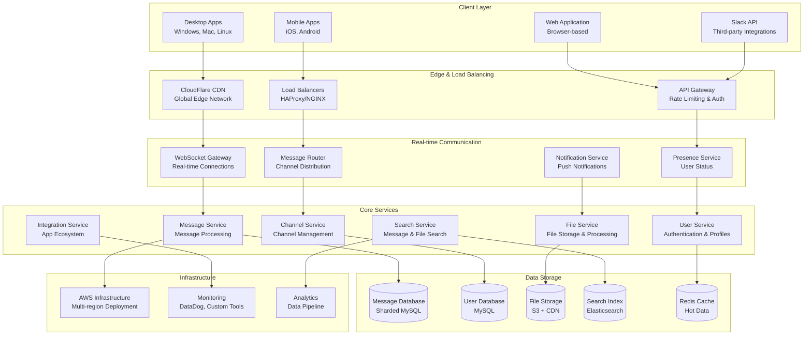
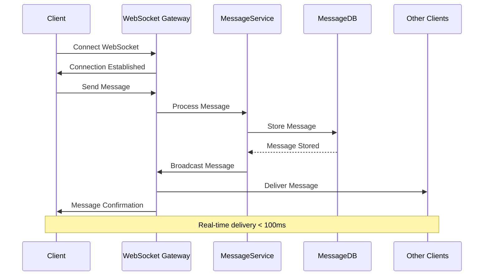
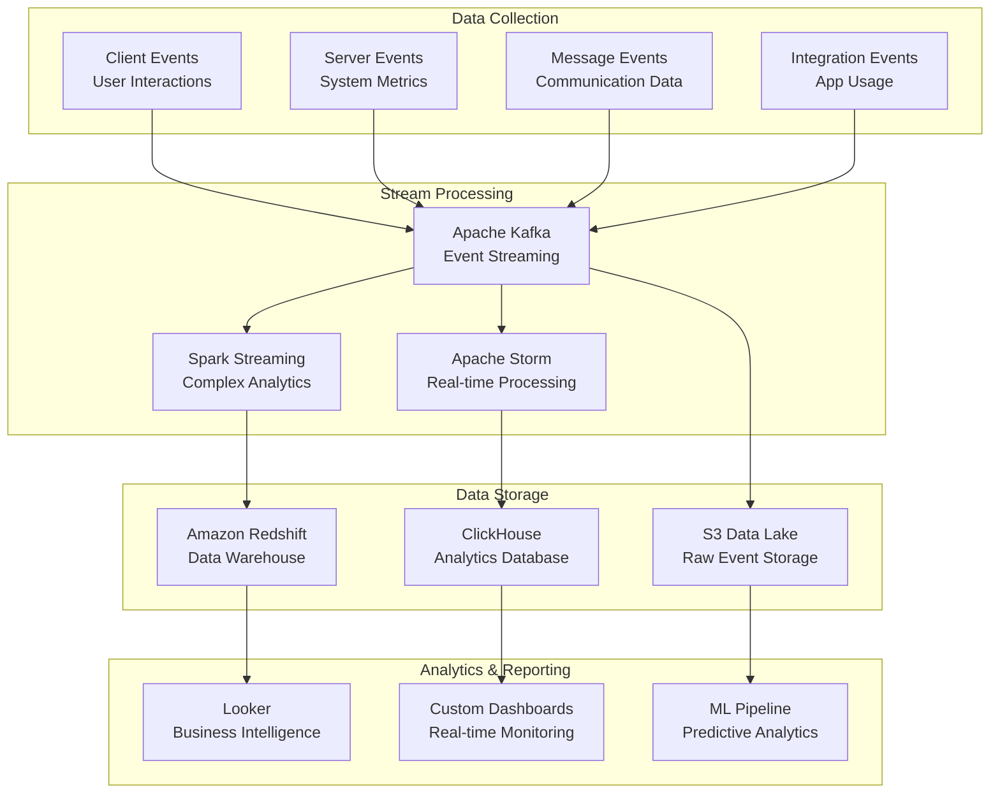
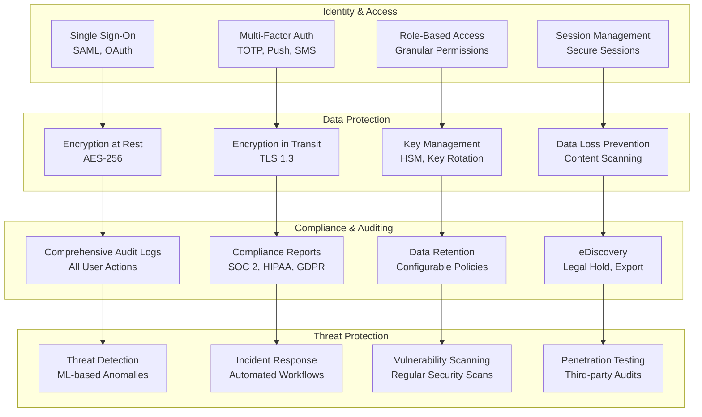

# Slack Real-Time Messaging Architecture: Enterprise Communication at Scale

## 💬 Executive Summary

Slack has revolutionized workplace communication, serving over **20 million daily active users** across **750,000+ organizations** worldwide. Processing **billions of messages** daily with **99.99%+ uptime**, Slack's architecture handles **real-time messaging**, **file sharing**, **integrations with 2,400+ apps**, and **enterprise-grade security** while maintaining sub-second message delivery globally.

## 📈 Scale and Business Impact

### Key Metrics
- **20+ million daily active users**
- **750,000+ paid customers**
- **10+ billion messages** per week
- **2,400+ app integrations** in directory
- **99.99%+ uptime** SLA
- **Sub-second message delivery** globally
- **150+ countries** served
- **$1.54+ billion revenue** (2023)

### Core Features
1. **Real-time Messaging**: Instant message delivery across channels
2. **File Sharing**: Documents, images, and media sharing
3. **Voice & Video Calls**: Integrated communication tools
4. **App Integrations**: Extensive third-party ecosystem
5. **Search**: Powerful message and file search
6. **Workflows**: Automation and business process tools
7. **Enterprise Security**: SOC 2, HIPAA, and compliance features

## 🏛️ High-Level Architecture



## 🔄 Real-Time Messaging Architecture

### WebSocket Gateway System
Slack's real-time messaging relies on **WebSocket connections** for instant delivery:



## 📊 Analytics and Business Intelligence

### Real-time Analytics Architecture


## 🔒 Enterprise Security Architecture

### Security Framework


## 🚀 Performance Optimization

### Caching Strategy
```python
class SlackCachingSystem:
    def __init__(self):
        self.redis_cluster = RedisCluster()
        self.local_cache = LocalCache()
        self.cache_stats = CacheStats()
    
    def get_cached_data(self, cache_key, cache_type='general'):
        """Multi-level cache retrieval"""
        
        # L1 Cache: Local application cache
        local_result = self.local_cache.get(cache_key)
        if local_result:
            self.cache_stats.record_hit('local', cache_type)
            return local_result
        
        # L2 Cache: Redis cluster
        redis_result = self.redis_cluster.get(cache_key)
        if redis_result:
            # Store in local cache for future requests
            self.local_cache.set(cache_key, redis_result, ttl=300)  # 5 min local TTL
            self.cache_stats.record_hit('redis', cache_type)
            return redis_result
        
        # Cache miss
        self.cache_stats.record_miss(cache_type)
        return None
    
    def set_cached_data(self, cache_key, data, ttl=3600, cache_type='general'):
        """Multi-level cache storage"""
        
        # Store in Redis with longer TTL
        self.redis_cluster.setex(cache_key, ttl, data)
        
        # Store in local cache with shorter TTL
        local_ttl = min(ttl, 300)  # Max 5 minutes in local cache
        self.local_cache.set(cache_key, data, ttl=local_ttl)
        
        self.cache_stats.record_set(cache_type)
    
    def invalidate_cache_pattern(self, pattern):
        """Invalidate cache entries matching pattern"""
        
        # Invalidate in Redis
        matching_keys = self.redis_cluster.keys(pattern)
        if matching_keys:
            self.redis_cluster.delete(*matching_keys)
        
        # Invalidate in local cache
        self.local_cache.invalidate_pattern(pattern)
        
        self.cache_stats.record_invalidation(len(matching_keys))

class MessageCacheManager:
    """Specialized caching for messages"""
    
    def __init__(self):
        self.cache_system = SlackCachingSystem()
        self.message_service = MessageService()
    
    def get_channel_messages(self, channel_id, limit=50, cursor=None):
        """Get channel messages with intelligent caching"""
        
        # Generate cache key
        cache_key = f"channel_messages:{channel_id}:{limit}:{cursor or 'latest'}"
        
        # Try cache first
        cached_messages = self.cache_system.get_cached_data(cache_key, 'messages')
        if cached_messages:
            return cached_messages
        
        # Fetch from database
        messages = self.message_service.get_channel_messages(channel_id, limit, cursor)
        
        # Cache with shorter TTL for recent messages
        ttl = 300 if not cursor else 3600  # 5 min for latest, 1 hour for historical
        self.cache_system.set_cached_data(cache_key, messages, ttl, 'messages')
        
        return messages
    
    def invalidate_channel_cache(self, channel_id):
        """Invalidate all cache entries for a channel"""
        
        pattern = f"channel_messages:{channel_id}:*"
        self.cache_system.invalidate_cache_pattern(pattern)
    
    def cache_user_mentions(self, user_id, mentions):
        """Cache user mentions for quick access"""
        
        cache_key = f"user_mentions:{user_id}"
        self.cache_system.set_cached_data(cache_key, mentions, ttl=1800, cache_type='mentions')
```

## 📚 Key Lessons Learned

### Technical Architecture Lessons
1. **WebSocket Management**: Efficient real-time communication requires robust connection management
2. **Message Ordering**: Ensuring message delivery order across distributed systems
3. **Search at Scale**: Elasticsearch optimization for billions of messages
4. **Caching Strategy**: Multi-level caching for performance and cost optimization
5. **Integration Security**: Secure third-party app ecosystem with proper validation

### Business Strategy Lessons
1. **Enterprise Focus**: B2B SaaS requires different architecture than consumer apps
2. **Integration Ecosystem**: Third-party apps drive platform adoption and stickiness
3. **Security First**: Enterprise customers require comprehensive security features
4. **User Experience**: Simple interface hiding complex distributed architecture
5. **Compliance**: Regulatory requirements shape technical architecture decisions

### Operational Excellence
1. **Monitoring**: Comprehensive observability across all system components
2. **Incident Response**: Rapid response to issues affecting real-time communication
3. **Capacity Planning**: Predictive scaling for growing enterprise customer base
4. **Security Operations**: Continuous security monitoring and threat detection
5. **Performance Optimization**: Constant optimization for sub-second response times

## 🎯 Business Impact

### Financial Performance
- **$1.54+ billion revenue** (2023)
- **750,000+ paid customers**
- **20+ million daily active users**
- **High customer retention** rates
- **Strong enterprise market share**

### Market Position
1. **Enterprise Communication Leader**: Dominant position in workplace messaging
2. **Platform Strategy**: Successful third-party ecosystem with 2,400+ apps
3. **Remote Work Enabler**: Critical infrastructure for distributed teams
4. **Innovation Driver**: Continuous feature development and UX improvements
5. **Acquisition Target**: Acquired by Salesforce for $27.7 billion

This comprehensive case study demonstrates how Slack built a scalable, secure, and feature-rich enterprise communication platform that handles billions of messages while maintaining real-time performance and enterprise-grade security across a global user base.
