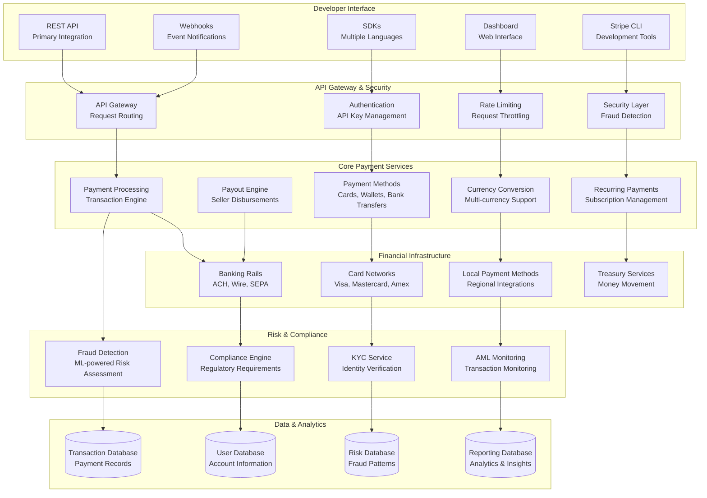
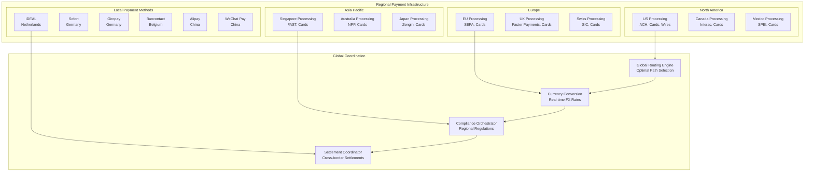

# Stripe Payment Infrastructure: Developer-First Payment Platform at Global Scale

## 💳 Executive Summary

Stripe operates the world's most developer-friendly payment infrastructure, processing **$817+ billion in payment volume** annually for **millions of businesses** across **46+ countries**. Serving companies from **startups to Fortune 500**, Stripe's platform handles **hundreds of millions of API calls** daily with **99.99%+ uptime**, offering **135+ payment methods** while maintaining **enterprise-grade security** and **regulatory compliance** across multiple jurisdictions.

## 📈 Scale and Business Impact

### Key Metrics
- **$817+ billion payment volume** processed (2022)
- **Millions of businesses** using Stripe
- **46+ countries** with local processing
- **135+ payment methods** supported
- **99.99%+ API uptime**
- **Sub-200ms API response times** globally
- **$13.5+ billion revenue** (2022)
- **95%+ developer satisfaction** scores

### Platform Evolution Timeline
- **2010**: Stripe founded, focus on developer experience
- **2011**: Public beta launch with 7 lines of code integration
- **2012**: International expansion begins
- **2014**: Stripe Connect for marketplace payments
- **2016**: Stripe Atlas for global company formation
- **2018**: Stripe Terminal for in-person payments
- **2020**: Pandemic-driven e-commerce surge
- **2022**: Expanded financial services (banking, lending)

## 🏛️ High-Level Architecture



## 💰 Payment Processing Engine

### Payment Engine Implementation
```python
class StripePaymentEngine:
    def __init__(self):
        self.payment_processor = PaymentProcessor()
        self.fraud_detector = FraudDetector()
        self.compliance_engine = ComplianceEngine()
        self.currency_converter = CurrencyConverter()
        self.webhook_dispatcher = WebhookDispatcher()
        self.audit_logger = AuditLogger()
        
    def process_payment_intent(self, payment_intent_data):
        """Process payment intent with comprehensive validation and processing"""
        
        processing_start_time = time.time()
        
        # Generate unique payment intent ID
        payment_intent_id = self.generate_payment_intent_id()
        
        # Validate payment intent data
        validation_result = self.validate_payment_intent(payment_intent_data)
        if not validation_result['valid']:
            return {'success': False, 'error': validation_result['error']}
        
        # Create payment intent record
        payment_intent = {
            'id': payment_intent_id,
            'amount': payment_intent_data['amount'],
            'currency': payment_intent_data['currency'],
            'customer_id': payment_intent_data.get('customer'),
            'payment_method': payment_intent_data.get('payment_method'),
            'metadata': payment_intent_data.get('metadata', {}),
            'status': 'requires_payment_method',
            'created_at': time.time(),
            'merchant_id': payment_intent_data['merchant_id']
        }
        
        # Store payment intent
        self.store_payment_intent(payment_intent)
        
        try:
            # If payment method is provided, attempt to process immediately
            if payment_intent_data.get('payment_method'):
                result = self.confirm_payment_intent(payment_intent_id, {
                    'payment_method': payment_intent_data['payment_method']
                })
                
                return result
            else:
                # Return payment intent for client-side confirmation
                return {
                    'success': True,
                    'payment_intent': {
                        'id': payment_intent_id,
                        'client_secret': self.generate_client_secret(payment_intent_id),
                        'status': payment_intent['status'],
                        'amount': payment_intent['amount'],
                        'currency': payment_intent['currency']
                    }
                }
                
        except Exception as e:
            # Update payment intent status to failed
            self.update_payment_intent_status(payment_intent_id, 'failed', str(e))
            return {'success': False, 'error': str(e)}
    
    def confirm_payment_intent(self, payment_intent_id, confirmation_data):
        """Confirm and process payment intent"""
        
        # Get payment intent
        payment_intent = self.get_payment_intent(payment_intent_id)
        if not payment_intent:
            return {'success': False, 'error': 'Payment intent not found'}
        
        # Validate payment method
        payment_method = confirmation_data['payment_method']
        method_validation = self.validate_payment_method(payment_method, payment_intent)
        if not method_validation['valid']:
            return {'success': False, 'error': method_validation['error']}
        
        # Update payment intent status
        self.update_payment_intent_status(payment_intent_id, 'processing')
        
        try:
            # Risk assessment
            risk_assessment = self.fraud_detector.assess_transaction_risk(
                payment_intent, payment_method
            )
            
            # Compliance checks
            compliance_result = self.compliance_engine.check_transaction_compliance(
                payment_intent, payment_method
            )
            
            if not compliance_result['compliant']:
                self.update_payment_intent_status(payment_intent_id, 'failed', 'Compliance violation')
                return {'success': False, 'error': 'Transaction blocked due to compliance requirements'}
            
            # Determine processing strategy based on risk
            if risk_assessment['risk_level'] == 'high':
                # Require additional authentication
                return self.require_additional_authentication(payment_intent_id, risk_assessment)
            
            elif risk_assessment['risk_level'] == 'medium':
                # Process with enhanced monitoring
                return self.process_with_enhanced_monitoring(payment_intent, payment_method, risk_assessment)
            
            else:
                # Process normally
                return self.process_payment_normally(payment_intent, payment_method, risk_assessment)
                
        except Exception as e:
            self.update_payment_intent_status(payment_intent_id, 'failed', str(e))
            self.audit_logger.log_processing_error(payment_intent_id, str(e))
            return {'success': False, 'error': 'Payment processing failed'}
    
    def process_payment_normally(self, payment_intent, payment_method, risk_assessment):
        """Process payment through normal flow"""
        
        payment_intent_id = payment_intent['id']
        
        # Determine payment processor based on method and region
        processor = self.select_payment_processor(payment_method, payment_intent)
        
        # Process payment
        processing_result = processor.process_payment({
            'payment_intent_id': payment_intent_id,
            'amount': payment_intent['amount'],
            'currency': payment_intent['currency'],
            'payment_method': payment_method,
            'merchant_id': payment_intent['merchant_id'],
            'risk_score': risk_assessment['risk_score']
        })
        
        if processing_result['success']:
            # Payment succeeded
            self.update_payment_intent_status(payment_intent_id, 'succeeded')
            
            # Create charge record
            charge = self.create_charge_record(payment_intent, processing_result)
            
            # Dispatch webhooks
            self.webhook_dispatcher.dispatch_payment_succeeded(payment_intent, charge)
            
            # Schedule settlement
            self.schedule_settlement(charge)
            
            return {
                'success': True,
                'payment_intent': {
                    'id': payment_intent_id,
                    'status': 'succeeded',
                    'charges': [charge]
                }
            }
        else:
            # Payment failed
            failure_reason = processing_result.get('failure_reason', 'Unknown error')
            self.update_payment_intent_status(payment_intent_id, 'failed', failure_reason)
            
            # Dispatch webhook
            self.webhook_dispatcher.dispatch_payment_failed(payment_intent, failure_reason)
            
            return {
                'success': False,
                'error': failure_reason,
                'payment_intent': {
                    'id': payment_intent_id,
                    'status': 'failed'
                }
            }
    
    def require_additional_authentication(self, payment_intent_id, risk_assessment):
        """Require additional authentication for high-risk transactions"""
        
        payment_intent = self.get_payment_intent(payment_intent_id)
        
        # Update status to require authentication
        self.update_payment_intent_status(payment_intent_id, 'requires_action')
        
        # Create 3D Secure authentication request
        auth_request = self.create_3d_secure_authentication(payment_intent, risk_assessment)
        
        return {
            'success': True,
            'payment_intent': {
                'id': payment_intent_id,
                'status': 'requires_action',
                'next_action': {
                    'type': 'use_stripe_sdk',
                    'use_stripe_sdk': {
                        'type': 'three_d_secure_redirect',
                        'stripe_js': auth_request['stripe_js_url']
                    }
                }
            }
        }
    
    def select_payment_processor(self, payment_method, payment_intent):
        """Select optimal payment processor based on method and context"""
        
        method_type = payment_method['type']
        currency = payment_intent['currency']
        amount = payment_intent['amount']
        merchant_country = self.get_merchant_country(payment_intent['merchant_id'])
        
        # Card payments
        if method_type == 'card':
            card_brand = payment_method['card']['brand']
            
            # Select processor based on optimization criteria
            if currency == 'USD' and merchant_country == 'US':
                # Domestic US transactions
                return self.get_domestic_card_processor(card_brand)
            else:
                # International transactions
                return self.get_international_card_processor(card_brand, currency)
        
        # Bank transfers
        elif method_type in ['ach_debit', 'ach_credit']:
            return self.get_ach_processor(merchant_country)
        
        # Digital wallets
        elif method_type in ['apple_pay', 'google_pay']:
            return self.get_wallet_processor(method_type, currency)
        
        # Local payment methods
        elif method_type in ['ideal', 'sofort', 'bancontact', 'giropay']:
            return self.get_local_payment_processor(method_type)
        
        else:
            raise Exception(f"Unsupported payment method type: {method_type}")

class FraudDetectionSystem:
    """Advanced fraud detection using machine learning"""
    
    def __init__(self):
        self.ml_models = MLModelEnsemble()
        self.rule_engine = RuleEngine()
        self.graph_analyzer = GraphAnalyzer()
        self.device_profiler = DeviceProfiler()
        self.behavioral_analyzer = BehavioralAnalyzer()
        
    def assess_transaction_risk(self, payment_intent, payment_method):
        """Comprehensive risk assessment for transaction"""
        
        # Extract comprehensive features
        features = self.extract_risk_features(payment_intent, payment_method)
        
        # Multiple risk assessment layers
        risk_signals = []
        
        # 1. Rule-based risk assessment
        rule_risk = self.rule_engine.evaluate_transaction(payment_intent, payment_method, features)
        risk_signals.append({
            'type': 'rule_based',
            'risk_score': rule_risk['risk_score'],
            'weight': 0.3,
            'triggered_rules': rule_risk['triggered_rules']
        })
        
        # 2. Machine learning risk assessment
        ml_risk = self.ml_models.predict_fraud_probability(features)
        risk_signals.append({
            'type': 'machine_learning',
            'risk_score': ml_risk['fraud_probability'],
            'weight': 0.4,
            'model_confidence': ml_risk['confidence']
        })
        
        # 3. Graph-based risk assessment
        graph_risk = self.graph_analyzer.analyze_transaction_network(payment_intent, payment_method)
        risk_signals.append({
            'type': 'graph_analysis',
            'risk_score': graph_risk['network_risk_score'],
            'weight': 0.2,
            'network_anomalies': graph_risk['anomalies']
        })
        
        # 4. Device and behavioral analysis
        device_risk = self.device_profiler.assess_device_risk(payment_method.get('device_info'))
        behavioral_risk = self.behavioral_analyzer.assess_behavioral_risk(payment_intent)
        
        combined_device_behavioral_risk = (device_risk + behavioral_risk) / 2
        risk_signals.append({
            'type': 'device_behavioral',
            'risk_score': combined_device_behavioral_risk,
            'weight': 0.1,
            'device_anomalies': self.device_profiler.get_device_anomalies()
        })
        
        # Combine risk signals
        overall_risk_score = sum(
            signal['risk_score'] * signal['weight'] 
            for signal in risk_signals
        )
        
        # Determine risk level and required actions
        if overall_risk_score > 0.8:
            risk_level = 'high'
            required_actions = ['additional_authentication', 'manual_review']
        elif overall_risk_score > 0.6:
            risk_level = 'medium'
            required_actions = ['enhanced_monitoring']
        elif overall_risk_score > 0.3:
            risk_level = 'low'
            required_actions = ['standard_monitoring']
        else:
            risk_level = 'very_low'
            required_actions = []
        
        return {
            'risk_score': overall_risk_score,
            'risk_level': risk_level,
            'required_actions': required_actions,
            'risk_signals': risk_signals,
            'assessment_time': time.time(),
            'explanation': self.generate_risk_explanation(risk_signals, overall_risk_score)
        }
    
    def extract_risk_features(self, payment_intent, payment_method):
        """Extract comprehensive features for risk assessment"""
        
        features = {}
        
        # Transaction features
        features['amount'] = payment_intent['amount']
        features['currency'] = payment_intent['currency']
        features['amount_usd'] = self.convert_to_usd(payment_intent['amount'], payment_intent['currency'])
        
        # Temporal features
        current_time = time.time()
        features['hour_of_day'] = datetime.fromtimestamp(current_time).hour
        features['day_of_week'] = datetime.fromtimestamp(current_time).weekday()
        features['is_weekend'] = 1 if features['day_of_week'] >= 5 else 0
        features['is_night'] = 1 if features['hour_of_day'] < 6 or features['hour_of_day'] > 22 else 0
        
        # Payment method features
        features['payment_method_type'] = payment_method['type']
        
        if payment_method['type'] == 'card':
            card = payment_method['card']
            features['card_brand'] = card['brand']
            features['card_funding'] = card['funding']  # credit, debit, prepaid
            features['card_country'] = card['country']
            features['card_last4'] = card['last4']
            features['card_exp_month'] = card['exp_month']
            features['card_exp_year'] = card['exp_year']
            
            # Card risk indicators
            features['card_is_international'] = 1 if card['country'] != payment_intent.get('merchant_country') else 0
            features['card_is_prepaid'] = 1 if card['funding'] == 'prepaid' else 0
        
        # Merchant features
        merchant_id = payment_intent['merchant_id']
        merchant_features = self.get_merchant_risk_features(merchant_id)
        features.update(merchant_features)
        
        # Customer features (if available)
        if payment_intent.get('customer_id'):
            customer_features = self.get_customer_risk_features(payment_intent['customer_id'])
            features.update(customer_features)
        
        # Velocity features
        velocity_features = self.calculate_velocity_features(payment_intent, payment_method)
        features.update(velocity_features)
        
        # Geographic features
        if payment_method.get('billing_details', {}).get('address'):
            billing_address = payment_method['billing_details']['address']
            features['billing_country'] = billing_address.get('country')
            features['billing_postal_code'] = billing_address.get('postal_code')
            
            # Geographic risk
            features['billing_merchant_country_match'] = 1 if billing_address.get('country') == payment_intent.get('merchant_country') else 0
        
        # Device features (if available)
        if payment_method.get('device_info'):
            device_info = payment_method['device_info']
            features['device_type'] = device_info.get('type')
            features['user_agent'] = device_info.get('user_agent')
            features['ip_address'] = device_info.get('ip_address')
            features['screen_resolution'] = device_info.get('screen_resolution')
            
            # Device risk indicators
            features['is_mobile_device'] = 1 if device_info.get('type') == 'mobile' else 0
            features['is_tor_exit_node'] = 1 if self.is_tor_exit_node(device_info.get('ip_address')) else 0
            features['is_vpn'] = 1 if self.is_vpn_ip(device_info.get('ip_address')) else 0
        
        return features
    
    def calculate_velocity_features(self, payment_intent, payment_method):
        """Calculate velocity-based risk features"""
        
        velocity_features = {}
        
        # Time windows for velocity calculation
        time_windows = ['1h', '24h', '7d', '30d']
        current_time = time.time()
        
        # Identify unique transaction identifiers
        identifiers = {
            'merchant_id': payment_intent['merchant_id'],
            'customer_id': payment_intent.get('customer_id'),
            'card_fingerprint': payment_method.get('card', {}).get('fingerprint'),
            'ip_address': payment_method.get('device_info', {}).get('ip_address'),
            'email': payment_method.get('billing_details', {}).get('email')
        }
        
        for window in time_windows:
            window_start = current_time - self.parse_time_window(window)
            
            for identifier_type, identifier_value in identifiers.items():
                if identifier_value:
                    # Count transactions and total amount for this identifier in time window
                    window_stats = self.get_transaction_stats(
                        identifier_type, identifier_value, window_start, current_time
                    )
                    
                    velocity_features[f'{identifier_type}_tx_count_{window}'] = window_stats['count']
                    velocity_features[f'{identifier_type}_tx_amount_{window}'] = window_stats['total_amount']
                    velocity_features[f'{identifier_type}_unique_merchants_{window}'] = window_stats['unique_merchants']
        
        return velocity_features
    
    def generate_risk_explanation(self, risk_signals, overall_score):
        """Generate human-readable explanation for risk assessment"""
        
        explanations = []
        
        # Identify main risk contributors
        high_risk_signals = [s for s in risk_signals if s['risk_score'] > 0.7]
        
        for signal in high_risk_signals:
            if signal['type'] == 'rule_based':
                if signal.get('triggered_rules'):
                    explanations.append(f"Triggered {len(signal['triggered_rules'])} risk rules")
            
            elif signal['type'] == 'machine_learning':
                if signal['risk_score'] > 0.8:
                    explanations.append("ML models detected high fraud probability")
            
            elif signal['type'] == 'graph_analysis':
                if signal.get('network_anomalies'):
                    explanations.append("Connected to suspicious transaction network")
            
            elif signal['type'] == 'device_behavioral':
                if signal.get('device_anomalies'):
                    explanations.append("Unusual device or behavioral patterns detected")
        
        # Overall risk assessment
        if overall_score > 0.8:
            explanations.append("Multiple high-risk indicators detected")
        elif overall_score > 0.6:
            explanations.append("Moderate risk indicators present")
        
        return explanations if explanations else ["Low risk transaction"]

class PaymentMethodManager:
    """Manage diverse payment methods and their processing"""
    
    def __init__(self):
        self.card_processor = CardProcessor()
        self.bank_processor = BankTransferProcessor()
        self.wallet_processor = DigitalWalletProcessor()
        self.local_payment_processor = LocalPaymentProcessor()
        self.crypto_processor = CryptocurrencyProcessor()
        
    def process_payment_method(self, payment_method, payment_intent):
        """Process payment using appropriate method handler"""
        
        method_type = payment_method['type']
        
        # Route to appropriate processor
        if method_type == 'card':
            return self.card_processor.process_card_payment(payment_method, payment_intent)
        
        elif method_type in ['ach_debit', 'ach_credit']:
            return self.bank_processor.process_ach_payment(payment_method, payment_intent)
        
        elif method_type == 'sepa_debit':
            return self.bank_processor.process_sepa_payment(payment_method, payment_intent)
        
        elif method_type in ['apple_pay', 'google_pay']:
            return self.wallet_processor.process_wallet_payment(payment_method, payment_intent)
        
        elif method_type in ['ideal', 'sofort', 'bancontact', 'giropay', 'eps', 'p24']:
            return self.local_payment_processor.process_local_payment(payment_method, payment_intent)
        
        elif method_type == 'bitcoin':
            return self.crypto_processor.process_crypto_payment(payment_method, payment_intent)
        
        else:
            raise Exception(f"Unsupported payment method: {method_type}")

class CardProcessor:
    """Credit and debit card processing"""
    
    def __init__(self):
        self.network_routers = {
            'visa': VisaNetworkRouter(),
            'mastercard': MastercardNetworkRouter(),
            'amex': AmexNetworkRouter(),
            'discover': DiscoverNetworkRouter()
        }
        self.tokenization_service = TokenizationService()
        self.three_d_secure = ThreeDSecureService()
        
    def process_card_payment(self, payment_method, payment_intent):
        """Process credit/debit card payment"""
        
        card = payment_method['card']
        card_brand = card['brand'].lower()
        
        # Get appropriate network router
        if card_brand not in self.network_routers:
            return {'success': False, 'error': f'Unsupported card brand: {card_brand}'}
        
        network_router = self.network_routers[card_brand]
        
        try:
            # Tokenize card if not already tokenized
            if not card.get('token'):
                tokenization_result = self.tokenization_service.tokenize_card(card)
                if not tokenization_result['success']:
                    return {'success': False, 'error': 'Card tokenization failed'}
                card['token'] = tokenization_result['token']
            
            # Prepare authorization request
            auth_request = {
                'card_token': card['token'],
                'amount': payment_intent['amount'],
                'currency': payment_intent['currency'],
                'merchant_id': payment_intent['merchant_id'],
                'transaction_id': payment_intent['id'],
                'cardholder_name': card.get('name'),
                'billing_address': payment_method.get('billing_details', {}).get('address'),
                'cvv': card.get('cvc'),  # Only for real-time processing
                'three_d_secure_required': self.requires_3d_secure(payment_intent, card)
            }
            
            # Process authorization
            if auth_request['three_d_secure_required']:
                return self.process_with_3d_secure(auth_request, network_router)
            else:
                return self.process_direct_authorization(auth_request, network_router)
                
        except Exception as e:
            return {'success': False, 'error': f'Card processing failed: {str(e)}'}
    
    def process_direct_authorization(self, auth_request, network_router):
        """Process direct card authorization"""
        
        # Send authorization request to card network
        auth_response = network_router.authorize_transaction(auth_request)
        
        if auth_response['approved']:
            return {
                'success': True,
                'authorization_code': auth_response['authorization_code'],
                'transaction_id': auth_response['transaction_id'],
                'network_transaction_id': auth_response['network_transaction_id'],
                'processor_response': auth_response
            }
        else:
            return {
                'success': False,
                'error': auth_response.get('decline_reason', 'Authorization declined'),
                'decline_code': auth_response.get('decline_code'),
                'processor_response': auth_response
            }
    
    def process_with_3d_secure(self, auth_request, network_router):
        """Process authorization with 3D Secure authentication"""
        
        # Initiate 3D Secure authentication
        three_ds_result = self.three_d_secure.initiate_authentication(auth_request)
        
        if three_ds_result['authentication_required']:
            # Return authentication challenge to client
            return {
                'success': True,
                'requires_action': True,
                'action_type': '3d_secure_authentication',
                'authentication_url': three_ds_result['authentication_url'],
                'authentication_token': three_ds_result['token']
            }
        else:
            # Authentication not required or already completed
            auth_request['three_d_secure_result'] = three_ds_result
            return self.process_direct_authorization(auth_request, network_router)
    
    def requires_3d_secure(self, payment_intent, card):
        """Determine if 3D Secure authentication is required"""
        
        # EU Strong Customer Authentication (SCA) requirements
        if self.is_eu_transaction(payment_intent, card):
            return True
        
        # High-value transactions
        amount_usd = self.convert_to_usd(payment_intent['amount'], payment_intent['currency'])
        if amount_usd > 500:  # $500 USD threshold
            return True
        
        # Merchant risk settings
        merchant_settings = self.get_merchant_3ds_settings(payment_intent['merchant_id'])
        if merchant_settings.get('always_require_3ds'):
            return True
        
        # Risk-based authentication
        if payment_intent.get('risk_score', 0) > 0.7:
            return True
        
        return False

class RecurringPaymentEngine:
    """Handle subscription and recurring payment processing"""
    
    def __init__(self):
        self.subscription_manager = SubscriptionManager()
        self.billing_cycle_manager = BillingCycleManager()
        self.retry_engine = RetryEngine()
        self.dunning_manager = DunningManager()
        
    def create_subscription(self, subscription_data):
        """Create new subscription with recurring billing"""
        
        # Validate subscription data
        validation_result = self.validate_subscription_data(subscription_data)
        if not validation_result['valid']:
            return {'success': False, 'error': validation_result['error']}
        
        # Generate subscription ID
        subscription_id = self.generate_subscription_id()
        
        # Create subscription record
        subscription = {
            'id': subscription_id,
            'customer_id': subscription_data['customer_id'],
            'price_id': subscription_data['price_id'],
            'payment_method': subscription_data['payment_method'],
            'billing_cycle': subscription_data['billing_cycle'],
            'trial_period_days': subscription_data.get('trial_period_days', 0),
            'status': 'trialing' if subscription_data.get('trial_period_days', 0) > 0 else 'active',
            'created_at': time.time(),
            'current_period_start': time.time(),
            'current_period_end': self.calculate_period_end(
                time.time(), subscription_data['billing_cycle']
            ),
            'metadata': subscription_data.get('metadata', {})
        }
        
        # Store subscription
        storage_result = self.subscription_manager.store_subscription(subscription)
        
        if storage_result['success']:
            # Schedule first billing cycle
            if subscription['status'] == 'active':
                self.schedule_next_billing(subscription)
            else:
                # Schedule trial end
                self.schedule_trial_end(subscription)
            
            return {
                'success': True,
                'subscription': subscription
            }
        else:
            return {'success': False, 'error': storage_result['error']}
    
    def process_recurring_billing(self, subscription_id):
        """Process recurring billing for subscription"""
        
        subscription = self.subscription_manager.get_subscription(subscription_id)
        if not subscription:
            return {'success': False, 'error': 'Subscription not found'}
        
        if subscription['status'] != 'active':
            return {'success': False, 'error': 'Subscription not active'}
        
        # Get pricing information
        price_info = self.get_price_info(subscription['price_id'])
        
        # Create invoice for billing period
        invoice = self.create_subscription_invoice(subscription, price_info)
        
        # Attempt payment
        payment_result = self.attempt_subscription_payment(subscription, invoice)
        
        if payment_result['success']:
            # Payment successful
            self.mark_invoice_paid(invoice['id'], payment_result)
            
            # Update subscription for next billing cycle
            next_period_start = subscription['current_period_end']
            next_period_end = self.calculate_period_end(
                next_period_start, subscription['billing_cycle']
            )
            
            self.subscription_manager.update_subscription(subscription_id, {
                'current_period_start': next_period_start,
                'current_period_end': next_period_end,
                'last_payment_date': time.time()
            })
            
            # Schedule next billing
            self.schedule_next_billing(subscription)
            
            return {
                'success': True,
                'invoice': invoice,
                'payment_result': payment_result
            }
        else:
            # Payment failed - handle with retry logic
            return self.handle_payment_failure(subscription, invoice, payment_result)
    
    def handle_payment_failure(self, subscription, invoice, payment_result):
        """Handle failed recurring payment with smart retry logic"""
        
        subscription_id = subscription['id']
        
        # Get retry configuration
        retry_config = self.get_retry_configuration(subscription)
        
        # Determine if we should retry
        retry_attempt = invoice.get('retry_attempt', 0) + 1
        
        if retry_attempt <= retry_config['max_retries']:
            # Schedule retry
            retry_delay = self.calculate_retry_delay(retry_attempt, retry_config)
            
            self.retry_engine.schedule_retry(
                subscription_id, 
                invoice['id'], 
                retry_delay,
                retry_attempt
            )
            
            # Update subscription status if needed
            if retry_attempt == 1:
                self.subscription_manager.update_subscription_status(
                    subscription_id, 'past_due'
                )
            
            return {
                'success': False,
                'error': 'Payment failed, retry scheduled',
                'retry_attempt': retry_attempt,
                'next_retry_at': time.time() + retry_delay
            }
        else:
            # Max retries exceeded - cancel subscription or apply dunning
            if retry_config.get('use_dunning', True):
                return self.apply_dunning_management(subscription, invoice)
            else:
                # Cancel subscription
                self.subscription_manager.update_subscription_status(
                    subscription_id, 'canceled'
                )
                
                return {
                    'success': False,
                    'error': 'Payment failed, subscription canceled',
                    'subscription_canceled': True
                }
    
    def calculate_retry_delay(self, retry_attempt, retry_config):
        """Calculate delay before next retry attempt"""
        
        strategy = retry_config.get('retry_strategy', 'exponential_backoff')
        
        if strategy == 'exponential_backoff':
            # Exponential backoff: 1 hour, 2 hours, 4 hours, etc.
            base_delay = retry_config.get('base_delay_hours', 1)
            return base_delay * (2 ** (retry_attempt - 1)) * 3600  # Convert to seconds
        
        elif strategy == 'fixed_interval':
            # Fixed interval retries
            interval_hours = retry_config.get('retry_interval_hours', 24)
            return interval_hours * 3600
        
        elif strategy == 'smart_timing':
            # Smart timing based on historical success rates
            optimal_hours = self.get_optimal_retry_timing(retry_attempt)
            return optimal_hours * 3600
        
        else:
            # Default to 24 hours
            return 24 * 3600
```

## 🌍 Global Payment Infrastructure

### Multi-Region Payment Processing
Stripe operates payment infrastructure across **46+ countries**:



## 📚 Key Lessons Learned

### Technical Architecture Lessons
1. **Developer Experience First**: Simple APIs and comprehensive documentation drive adoption
2. **Global Infrastructure**: Local processing and compliance essential for international expansion
3. **Real-time Processing**: Sub-200ms response times critical for user experience
4. **Fraud Prevention**: Multi-layered ML-powered fraud detection prevents losses
5. **Reliability**: 99.99%+ uptime through redundant systems and graceful degradation

### Business Strategy Lessons
1. **Platform Strategy**: Enabling other businesses to accept payments creates massive network effects
2. **Developer-First GTM**: Focus on developers as primary users drives bottom-up adoption
3. **Global Expansion**: Local payment methods and compliance unlock new markets
4. **Product Expansion**: Building adjacent financial services increases customer lifetime value
5. **Enterprise Focus**: Large enterprise customers provide stable, high-value revenue

### Operational Excellence
1. **Monitoring**: Real-time monitoring of payment success rates and system performance
2. **Incident Response**: Rapid response to payment processing issues
3. **Compliance**: Automated compliance with global financial regulations
4. **Security**: Comprehensive security measures for handling sensitive financial data
5. **Performance**: Continuous optimization of payment processing speed and reliability

## 🎯 Business Impact

### Financial Performance
- **$13.5+ billion revenue** (2022)
- **$817+ billion payment volume** processed
- **Millions of businesses** using Stripe
- **46+ countries** with local processing
- **Strong growth** in enterprise segment

### Market Position
1. **Developer-First Leader**: Leading position in developer-friendly payment infrastructure
2. **Global Reach**: Processing payments in 46+ countries with local methods
3. **Platform Innovation**: Continuous expansion of financial services beyond payments
4. **Enterprise Adoption**: Growing presence in large enterprise and marketplace segments
5. **Fintech Enabler**: Powering the growth of digital businesses and fintech companies

This comprehensive case study demonstrates how Stripe built the world's most developer-friendly payment infrastructure, processing hundreds of billions in payment volume while maintaining exceptional reliability, security, and user experience through innovative API design and global financial infrastructure.
