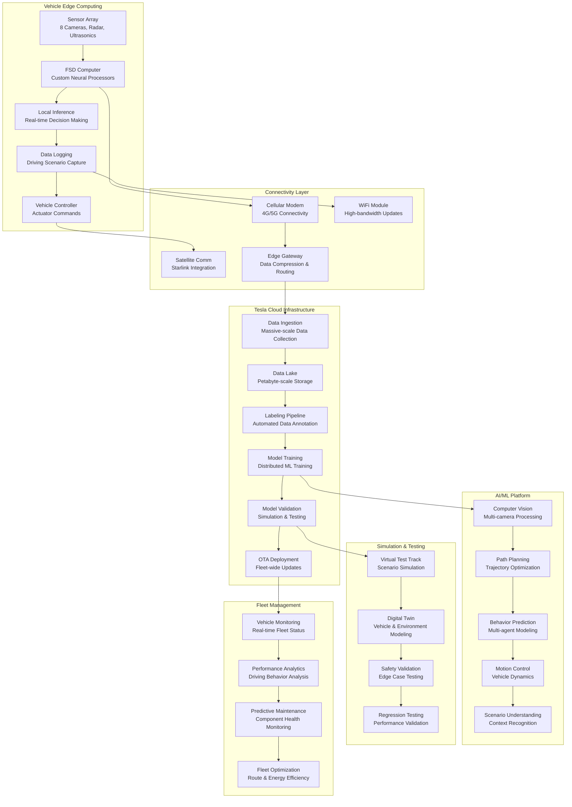

# Tesla Autopilot and Fleet Management: Real-Time Autonomous Vehicle Intelligence

## 🚗 Executive Summary

Tesla operates the world's most advanced autonomous vehicle fleet management system, coordinating **5+ million vehicles** globally that collectively generate **10+ petabytes of driving data daily**. Processing **billions of sensor readings per second** from cameras, radar, and ultrasonic sensors, Tesla's architecture combines **real-time edge computing**, **massive-scale data collection**, **distributed machine learning training**, and **over-the-air software updates** to continuously improve autonomous driving capabilities across the entire fleet.

## 📈 Scale and Business Impact

### Key Metrics
- **5+ million vehicles** on the road globally
- **10+ petabytes** of driving data collected daily
- **Billions of sensor readings** processed per second
- **1+ billion miles** of Autopilot data monthly
- **99.9%+ vehicle connectivity** uptime
- **40+ neural networks** running simultaneously per vehicle
- **8 cameras, 12 ultrasonic sensors, 1 radar** per vehicle
- **1,000+ TOPS** of inference compute per vehicle
- **$15+ billion** autonomous driving development investment

### Tesla Autopilot Evolution Timeline
- **2014**: First Autopilot hardware (HW1) with Mobileye
- **2016**: Second generation hardware (HW2) with NVIDIA
- **2017**: Enhanced Autopilot features, neural network transition
- **2019**: Full Self-Driving (FSD) Computer (HW3) with custom chips
- **2020**: City street driving beta, traffic light recognition
- **2022**: FSD Beta expanded to 100,000+ drivers
- **2023**: Hardware 4.0 with enhanced compute and sensor suite
- **2024**: Robotaxi network preparation and validation

## 🏛️ High-Level Architecture

## 🧠 Real-Time Edge Computing Architecture

**World's Most Advanced Automotive Edge Computing System:**
Tesla's Full Self-Driving (FSD) Computer represents the pinnacle of automotive edge computing, delivering **1,000+ TOPS of inference performance** while consuming less than **100 watts of power**. Each vehicle processes **billions of sensor readings per second** to make **real-time driving decisions** with **sub-millisecond latency** requirements.

**Edge Computing Processing Pipeline:**

**1. Multi-Modal Sensor Fusion:**
- **8-Camera Vision System**: 360-degree coverage with overlapping fields of view for redundancy
- **Forward-Facing Radar**: Long-range detection for highway driving and adverse weather conditions
- **12 Ultrasonic Sensors**: Short-range precision for parking and low-speed maneuvering
- **IMU and GPS**: Precise vehicle positioning and motion sensing
- **Sensor Calibration**: Real-time calibration and alignment of sensor coordinate systems

**2. Neural Network Processing Architecture:**
- **Custom Silicon Design**: Purpose-built neural processing units optimized for automotive inference
- **Parallel Processing**: Multiple neural networks running simultaneously for different driving tasks
- **Memory Optimization**: Efficient memory architecture minimizing data movement and power consumption
- **Thermal Management**: Advanced cooling systems maintaining performance under extreme conditions
- **Fault Tolerance**: Redundant processing paths and error detection for safety-critical operations

**3. Real-Time Decision Making:**
- **Perception Pipeline**: Object detection, classification, and tracking in 3D space
- **Prediction Models**: Forecasting behavior of other vehicles, pedestrians, and cyclists
- **Path Planning**: Optimal trajectory generation considering safety, comfort, and efficiency
- **Control Systems**: Precise actuator commands for steering, acceleration, and braking
- **Safety Monitoring**: Continuous validation of system state and emergency intervention capabilities

**Edge Computing Optimization Strategies:**

**1. Efficient Neural Network Design:**
- **Model Compression**: Quantization and pruning techniques reducing model size without accuracy loss
- **Hardware-Software Co-optimization**: Neural networks designed specifically for Tesla's custom silicon
- **Dynamic Model Loading**: Contextual loading of specialized models based on driving scenarios
- **Inference Batching**: Efficient batching of computations across multiple sensor inputs
- **Pipeline Optimization**: Minimizing latency through optimized processing pipelines

**2. Power and Thermal Management:**
- **Dynamic Frequency Scaling**: Adjusting compute frequency based on processing demands
- **Intelligent Task Scheduling**: Prioritizing critical safety tasks while managing resource allocation
- **Thermal Throttling**: Graceful performance degradation under extreme temperature conditions
- **Power Budget Management**: Balancing compute performance with vehicle energy efficiency
- **Sleep Mode Optimization**: Minimal power consumption during vehicle standby periods

## 📡 Massive-Scale Data Collection System

**Petabyte-Scale Autonomous Driving Data Platform:**
Tesla operates the world's largest autonomous driving data collection system, gathering **10+ petabytes daily** from **5+ million vehicles** including **video streams**, **sensor telemetry**, **driving decisions**, and **edge cases** to continuously improve autonomous driving capabilities through machine learning.

**Data Collection Architecture:**

**1. Intelligent Data Selection:**
- **Scenario-Based Triggers**: Automatic data collection during interesting or challenging driving scenarios
- **Edge Case Detection**: Machine learning models identify unusual situations requiring human review
- **Error Condition Logging**: Comprehensive logging when Autopilot disengages or makes corrections
- **Random Sampling**: Statistical sampling of normal driving scenarios for baseline performance validation
- **User-Initiated Collection**: Driver feedback mechanisms for reporting system behavior

**2. Multi-Modal Data Capture:**
- **High-Resolution Video**: 8-camera system capturing 1280x960 resolution at 30+ FPS per camera
- **Sensor Telemetry**: Complete sensor readings including radar, ultrasonic, IMU, and GPS data
- **Vehicle State Information**: Speed, acceleration, steering angle, and other vehicle dynamics
- **Driver Interactions**: Steering wheel inputs, pedal positions, and control system overrides
- **Environmental Context**: Weather conditions, time of day, traffic density, and road conditions

**3. Data Compression and Transmission:**
- **Intelligent Compression**: Context-aware compression algorithms optimized for driving data
- **Differential Encoding**: Efficient encoding of temporal sequences and spatial relationships
- **Bandwidth Management**: Adaptive data transmission based on cellular network conditions
- **Prioritized Upload**: Critical safety data prioritized over routine telemetry
- **WiFi Offloading**: High-bandwidth data uploads during vehicle charging or parking

**Data Processing and Labeling Pipeline:**

**1. Automated Data Annotation:**
- **Computer Vision Labeling**: Automated object detection and segmentation for training data
- **Temporal Consistency**: Ensuring label consistency across video sequences
- **Multi-View Reconciliation**: Combining labels from multiple camera perspectives
- **Quality Assurance**: Automated validation of label accuracy and completeness
- **Human-in-the-Loop**: Human reviewers for complex scenarios and edge cases

**2. Data Curation and Management:**
- **Scenario Classification**: Automatic categorization of driving scenarios and conditions
- **Data Deduplication**: Removing redundant data while preserving scenario diversity
- **Privacy Protection**: Automated anonymization of personally identifiable information
- **Data Retention Policies**: Intelligent data lifecycle management for storage optimization
- **Regulatory Compliance**: Ensuring data collection complies with global privacy regulations

## 🤖 Distributed Machine Learning Training

**World's Largest Autonomous Driving ML Training Infrastructure:**
Tesla operates one of the world's most sophisticated machine learning training infrastructures, utilizing **thousands of GPUs** in **custom-built supercomputers** to train **neural networks** on **exabytes of real-world driving data** collected from their global fleet.

**ML Training Architecture:**

**1. Supercomputer Infrastructure:**
- **Custom Supercomputer Design**: Purpose-built systems optimized for computer vision training
- **Massive GPU Clusters**: Thousands of high-end GPUs (A100, H100) for parallel training
- **High-Speed Interconnect**: InfiniBand networking for efficient multi-GPU communication
- **Distributed Storage**: Petabyte-scale storage systems optimized for ML workload access patterns
- **Specialized Cooling**: Custom cooling solutions for high-density compute environments

**2. Multi-Task Learning Framework:**
- **Shared Feature Extraction**: Common neural network backbone for multiple driving tasks
- **Task-Specific Heads**: Specialized output layers for object detection, segmentation, depth estimation
- **Multi-Scale Processing**: Processing at multiple resolutions for different detection ranges
- **Temporal Modeling**: Incorporating temporal information for motion prediction and tracking
- **Multi-Modal Fusion**: Combining camera, radar, and ultrasonic sensor information

**3. Training Data Management:**
- **Massive Dataset Curation**: Managing exabytes of labeled driving data from global fleet
- **Active Learning**: Intelligently selecting most valuable data for training efficiency
- **Data Augmentation**: Synthetic data generation for rare scenarios and edge cases
- **Balanced Sampling**: Ensuring training data represents diverse driving conditions and scenarios
- **Continuous Dataset Updates**: Real-time integration of new data from fleet operations

**Training Optimization Strategies:**

**1. Distributed Training Techniques:**
- **Data Parallelism**: Distributing training data across multiple GPUs and nodes
- **Model Parallelism**: Splitting large models across multiple devices for memory efficiency
- **Gradient Synchronization**: Efficient gradient aggregation and parameter updates
- **Mixed Precision Training**: Using FP16 and FP32 precision for memory and speed optimization
- **Dynamic Loss Scaling**: Preventing gradient underflow in mixed precision training

**2. Continuous Learning Pipeline:**
- **Online Learning**: Incorporating new data without full model retraining
- **Transfer Learning**: Leveraging pre-trained models for new tasks and scenarios
- **Model Versioning**: Systematic versioning and comparison of model iterations
- **A/B Testing**: Controlled deployment of model variants for performance comparison
- **Regression Testing**: Ensuring new models don't degrade performance on existing scenarios

## 🔄 Over-the-Air Update System

**Global Fleet Software Deployment Platform:**
Tesla's over-the-air (OTA) update system represents the most sophisticated automotive software deployment platform, capable of updating **millions of vehicles simultaneously** with **new autonomous driving capabilities**, **performance improvements**, and **safety enhancements** while maintaining **fleet-wide consistency** and **rollback capabilities**.

**OTA Architecture:**

**1. Update Distribution Infrastructure:**
- **Global CDN Network**: Distributed content delivery for efficient update distribution
- **Edge Caching**: Regional caching systems reducing bandwidth and latency
- **Differential Updates**: Only transmitting changed components to minimize bandwidth usage
- **Compression Optimization**: Advanced compression techniques for large software packages
- **Bandwidth Throttling**: Intelligent bandwidth management to avoid network congestion

**2. Staged Rollout Strategy:**
- **Canary Deployments**: Initial deployment to small subset of vehicles for validation
- **Geographic Rollouts**: Gradual expansion by region to manage support and feedback
- **Vehicle Segmentation**: Targeted updates based on hardware version and configuration
- **Performance Monitoring**: Real-time monitoring of update success rates and system performance
- **Automatic Rollback**: Immediate rollback capabilities if issues are detected

**3. Safety and Validation:**
- **Code Signing**: Cryptographic verification of update authenticity and integrity
- **Incremental Validation**: Progressive validation of system functionality during updates
- **Backup Systems**: Maintaining previous software versions for emergency rollback
- **Safety-Critical Isolation**: Ensuring safety-critical systems remain operational during updates
- **User Consent Management**: Appropriate user notifications and consent for major updates

**Update Deployment Pipeline:**

**1. Pre-Deployment Validation:**
- **Simulation Testing**: Comprehensive testing in virtual environments before fleet deployment
- **Hardware-in-the-Loop**: Testing on physical hardware systems in controlled environments
- **Regression Testing**: Ensuring new updates don't break existing functionality
- **Performance Benchmarking**: Validating performance improvements and resource utilization
- **Safety Certification**: Regulatory compliance verification for safety-critical updates

**2. Fleet-Wide Coordination:**
- **Update Scheduling**: Intelligent scheduling to minimize user disruption
- **Network Load Balancing**: Distributing update traffic across available network capacity
- **Regional Adaptation**: Customizing updates for local regulations and requirements
- **Support Integration**: Coordinating with customer support for update-related inquiries
- **Telemetry Collection**: Gathering performance data during and after updates

## 🛡️ Safety and Validation Systems

**Comprehensive Safety Architecture for Autonomous Driving:**
Tesla implements multiple layers of safety validation including **simulation-based testing**, **real-world validation**, **redundant safety systems**, and **continuous monitoring** to ensure autonomous driving systems meet the highest safety standards before deployment to the global fleet.

**Safety Validation Framework:**

**1. Simulation-Based Testing:**
- **Virtual Test Environments**: Photorealistic simulation of diverse driving scenarios
- **Edge Case Generation**: Systematic generation of challenging and rare driving situations
- **Monte Carlo Testing**: Statistical validation across millions of simulated scenarios
- **Physics-Based Modeling**: Accurate vehicle dynamics and environmental physics simulation
- **Scenario Libraries**: Comprehensive databases of real-world driving scenarios for testing

**2. Real-World Validation:**
- **Shadow Mode Testing**: New algorithms run in background without controlling vehicle
- **Closed-Course Testing**: Controlled testing on private test tracks and facilities
- **Gradual Feature Rollout**: Progressive deployment of new capabilities with monitoring
- **Human Override Analysis**: Learning from situations where human drivers intervene
- **Incident Investigation**: Comprehensive analysis of any safety-related incidents

**3. Redundant Safety Systems:**
- **Multiple Sensor Modalities**: Camera, radar, and ultrasonic sensors providing redundant information
- **Diverse Algorithm Approaches**: Multiple algorithms solving same problems for cross-validation
- **Hardware Redundancy**: Backup systems for critical components and processing units
- **Human Monitoring**: Driver monitoring systems ensuring human readiness to intervene
- **Emergency Protocols**: Automated safe stop procedures when system limits are reached

## 📊 Fleet Analytics and Optimization

**Global Fleet Intelligence Platform:**
Tesla analyzes **petabytes of driving data** to optimize **fleet performance**, **predict maintenance needs**, **improve energy efficiency**, and **enhance user experience** across **5+ million vehicles** through advanced analytics and machine learning.

**Fleet Analytics Architecture:**

**1. Real-Time Fleet Monitoring:**
- **Vehicle Health Monitoring**: Continuous monitoring of all vehicle systems and components
- **Performance Analytics**: Real-time analysis of driving efficiency and system performance
- **Energy Optimization**: Fleet-wide energy consumption analysis and optimization recommendations
- **Route Intelligence**: Aggregated routing data for traffic pattern analysis and optimization
- **Usage Pattern Analysis**: Understanding how customers use their vehicles for product improvement

**2. Predictive Maintenance:**
- **Component Health Modeling**: Machine learning models predicting component failure probabilities
- **Maintenance Scheduling**: Optimal maintenance scheduling based on usage patterns and predictions
- **Parts Inventory Optimization**: Predictive analytics for service center inventory management
- **Remote Diagnostics**: Ability to diagnose many issues remotely without service visits
- **Proactive Notifications**: Early warning systems for potential maintenance needs

**3. Fleet Optimization Insights:**
- **Charging Infrastructure**: Analysis of charging patterns to optimize Supercharger network
- **Software Performance**: Identifying opportunities for software optimization across the fleet
- **Feature Usage Analytics**: Understanding which features are most valuable to customers
- **Safety Performance**: Continuous monitoring of safety metrics and improvement opportunities
- **Customer Experience**: Analyzing user interactions to improve overall experience

## 📚 Key Lessons Learned

### Technical Architecture Lessons
1. **Edge Computing Criticality**: Autonomous driving requires massive edge computing capabilities with sub-millisecond latency requirements
2. **Data Scale Challenges**: Managing petabytes of daily data requires sophisticated compression, transmission, and storage strategies
3. **Safety-First Design**: Multiple redundancy layers and validation systems essential for safety-critical autonomous systems
4. **Continuous Learning**: Real-world deployment generates data that continuously improves system capabilities
5. **Hardware-Software Co-Design**: Custom silicon and software optimization necessary for performance and efficiency

### Business Strategy Lessons
1. **Vertical Integration**: Controlling entire stack from silicon to software enables rapid innovation and optimization
2. **Fleet Learning Advantage**: Large deployed fleet provides massive competitive advantage in data collection
3. **OTA Capabilities**: Over-the-air updates transform vehicles from depreciating assets to continuously improving platforms
4. **Regulatory Navigation**: Autonomous driving requires proactive engagement with regulators and safety organizations
5. **Customer Trust**: Building customer confidence in autonomous systems requires transparency and proven safety records

### Operational Excellence
1. **Global Scale Operations**: Managing millions of connected vehicles requires sophisticated operational infrastructure
2. **Safety Culture**: Safety-first culture essential when deploying potentially life-critical systems
3. **Rapid Iteration**: Ability to rapidly test, validate, and deploy improvements across global fleet
4. **Data Privacy**: Balancing data collection needs with customer privacy requirements and regulations
5. **Cross-Functional Coordination**: Autonomous driving requires coordination across hardware, software, AI, and operations teams

## 🎯 Business Impact and Future Vision

### Financial Performance
- **$15+ billion investment** in autonomous driving development
- **Significant competitive moat** through data and technology advantages
- **Future robotaxi revenue** potential of hundreds of billions annually
- **Increased vehicle value** through autonomous capabilities
- **Reduced insurance costs** through improved safety performance

### Industry Transformation
1. **Autonomous Driving Leadership**: Tesla leads in real-world autonomous driving deployment and capability
2. **Data-Driven Development**: Demonstrated the power of real-world data for AI system improvement
3. **OTA Standard**: Established over-the-air updates as standard for modern vehicles
4. **AI Chip Innovation**: Advanced custom silicon design for automotive AI applications
5. **Safety Standards Evolution**: Influencing development of autonomous driving safety standards

### Future Vision
1. **Full Self-Driving**: Achieving Level 5 autonomy for unsupervised driving in all conditions
2. **Robotaxi Network**: Deploying autonomous taxi service using Tesla vehicle fleet
3. **Global Deployment**: Expanding autonomous capabilities to all markets and driving conditions
4. **AI Generalization**: Applying autonomous driving AI to other robotics and automation applications
5. **Transportation Revolution**: Fundamentally transforming personal and commercial transportation

This comprehensive case study demonstrates how Tesla built the world's most advanced autonomous vehicle platform, combining cutting-edge AI, massive-scale data processing, and sophisticated safety systems to create continuously improving autonomous driving capabilities deployed across millions of vehicles globally.
