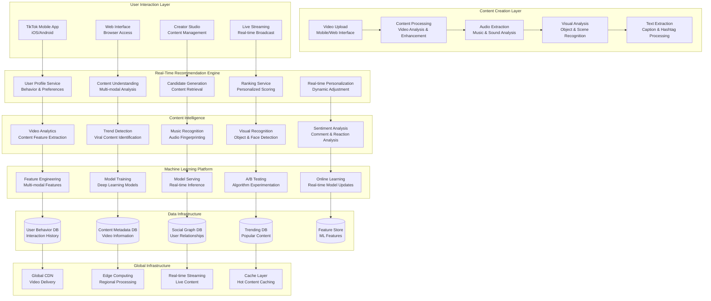

# TikTok Real-Time Recommendation Engine: AI-Powered Short-Form Video Discovery

## 🎵 Executive Summary

TikTok operates the world's most sophisticated real-time recommendation engine for short-form video content, serving **1+ billion monthly active users** with **personalized video feeds** that process **billions of video views daily**. The platform's "For You Page" algorithm analyzes **hundreds of signals** including **user behavior**, **video content**, **audio features**, and **social interactions** to deliver **highly engaging content** with **sub-second recommendation latency** across **150+ countries**.

## 📈 Scale and Business Impact

### Key Metrics
- **1+ billion monthly active users** globally
- **150+ countries and regions** served
- **Billions of videos** watched daily
- **100+ million videos** uploaded daily
- **52 minutes average** daily time spent per user
- **Sub-second recommendation** response times
- **90%+ recommendation accuracy** for user engagement
- **75+ languages** supported
- **$75+ billion revenue** (2022 estimated)

### Platform Evolution Timeline
- **2016**: Douyin launches in China with AI-powered recommendations
- **2018**: TikTok global launch, international expansion
- **2019**: 1 billion downloads milestone, creator fund launch
- **2020**: COVID-19 surge, 2 billion downloads
- **2021**: Shopping and e-commerce integration
- **2022**: Long-form content support, live streaming growth
- **2023**: AI-generated content and virtual influencers
- **2024**: Real-time collaboration and AR effects expansion

## 🏛️ High-Level Architecture

## 🧠 Real-Time Recommendation Algorithm

**World's Most Advanced Short-Form Content Recommendation System:**
TikTok's recommendation engine processes **billions of user interactions** and **hundreds of content features** in real-time to generate personalized video feeds that achieve **unprecedented user engagement** with **90%+ recommendation accuracy** and **sub-second response times** across a global user base.

**Multi-Stage Recommendation Pipeline:**

**1. User Understanding and Profiling:**
- **Behavioral Pattern Analysis**: Deep analysis of user interactions, viewing time, engagement patterns
- **Interest Graph Construction**: Multi-dimensional interest representation based on content consumption
- **Demographic and Contextual Factors**: Age, location, device, time of day, and seasonal preferences
- **Social Network Analysis**: Influence of social connections and community preferences
- **Real-time Preference Updates**: Dynamic adjustment of user profiles based on immediate interactions

**2. Content Understanding and Feature Extraction:**
- **Multi-Modal Content Analysis**: Simultaneous processing of video, audio, and text components
- **Visual Feature Extraction**: Object detection, scene recognition, aesthetic quality assessment
- **Audio Fingerprinting**: Music recognition, sound effect analysis, vocal pattern detection
- **Text and Hashtag Processing**: Natural language understanding of captions and hashtags
- **Creator Profile Analysis**: Creator popularity, content style, and historical performance

**3. Candidate Generation and Retrieval:**
- **Collaborative Filtering**: Finding users with similar preferences and recommending their liked content
- **Content-Based Filtering**: Matching user interests with content features and characteristics
- **Trend-Based Retrieval**: Incorporating viral and trending content into candidate pool
- **Social Network Influence**: Content from followed creators and friends' interactions
- **Diversity Injection**: Ensuring variety in content types, creators, and topics

**Real-Time Personalization Engine:**

**1. Dynamic User State Modeling:**
- **Session-Based Learning**: Adapting recommendations within single app session based on immediate behavior
- **Context Awareness**: Adjusting for time of day, location, device orientation, and usage patterns
- **Mood Detection**: Inferring user emotional state from interaction patterns and content preferences
- **Attention Modeling**: Understanding user attention patterns and optimal content sequencing
- **Fatigue Detection**: Preventing content saturation and maintaining engagement freshness

**2. Multi-Armed Bandit Optimization:**
- **Exploration vs Exploitation**: Balancing between showing proven engaging content and discovering new interests
- **Thompson Sampling**: Probabilistic approach to content selection under uncertainty
- **Contextual Bandits**: Incorporating user and content context into recommendation decisions
- **Cold Start Handling**: Effective recommendations for new users and new content
- **Performance Feedback**: Real-time learning from user responses to improve future recommendations

**3. Real-Time Ranking and Scoring:**
- **Deep Neural Networks**: Multi-layer neural networks processing hundreds of features
- **Gradient Boosting Models**: Ensemble methods combining multiple prediction models
- **Attention Mechanisms**: Focusing on most relevant features for each user-content pair
- **Multi-Task Learning**: Simultaneously optimizing for engagement, retention, and platform objectives
- **Real-Time Feature Updates**: Incorporating latest user interactions and content performance

## 🎬 Content Understanding and Analysis

**Comprehensive Multi-Modal Content Intelligence:**
TikTok analyzes **every aspect of uploaded content** including **visual elements**, **audio components**, **text information**, and **metadata** to create rich content representations that enable precise matching with user preferences and interests.

**Advanced Content Analysis Pipeline:**

**1. Visual Content Processing:**
- **Object and Scene Detection**: Identifying objects, people, animals, locations, and activities in videos
- **Face Recognition and Analysis**: Detecting faces, expressions, age estimation, and demographic analysis
- **Action Recognition**: Understanding human actions, sports, dances, and movement patterns
- **Aesthetic Quality Assessment**: Evaluating video quality, lighting, composition, and visual appeal
- **Style and Filter Detection**: Recognizing video effects, filters, and editing techniques

**2. Audio and Music Analysis:**
- **Music Recognition**: Identifying songs, artists, and genres using audio fingerprinting
- **Sound Effect Classification**: Categorizing various sound effects and ambient audio
- **Voice Analysis**: Analyzing vocal characteristics, language, accent, and emotional tone
- **Audio Quality Assessment**: Evaluating audio clarity, volume levels, and production quality
- **Beat and Rhythm Detection**: Understanding musical tempo and synchronization with video

**3. Text and Language Processing:**
- **Natural Language Understanding**: Processing captions, descriptions, and comments
- **Hashtag Analysis**: Understanding trending hashtags and their semantic meaning
- **Language Detection**: Supporting 75+ languages with automatic language identification
- **Sentiment Analysis**: Analyzing emotional tone of text content and user comments
- **Topic Modeling**: Extracting key themes and subjects from textual content

**Content Feature Engineering:**

**1. Multi-Modal Feature Fusion:**
- **Cross-Modal Correlation**: Understanding relationships between visual, audio, and text elements
- **Temporal Feature Extraction**: Analyzing how content elements change over time within videos
- **Semantic Embedding**: Creating dense vector representations of content meaning
- **Style Transfer Detection**: Identifying content creation techniques and artistic styles
- **Virality Prediction**: Early detection of content with viral potential

**2. Creator and Community Analysis:**
- **Creator Style Profiling**: Understanding individual creator's content patterns and preferences
- **Community Detection**: Identifying content communities and subcultures
- **Influence Network Analysis**: Mapping content influence and inspiration patterns
- **Collaboration Pattern Recognition**: Detecting duets, responses, and collaborative content
- **Authenticity Assessment**: Identifying original content vs. reposts and copies

## 📊 Real-Time User Behavior Analytics

**Comprehensive User Interaction Intelligence:**
TikTok processes **billions of user interactions daily** including **video views**, **engagement actions**, **sharing behavior**, and **creation patterns** to build detailed user profiles that enable highly personalized content recommendations.

**User Behavior Analysis Framework:**

**1. Engagement Pattern Analysis:**
- **View Duration Modeling**: Understanding optimal video length and user attention spans
- **Interaction Sequence Analysis**: Analyzing patterns of likes, shares, comments, and follows
- **Scroll Behavior Understanding**: Detecting user engagement levels from scrolling patterns
- **Replay and Revisit Analysis**: Identifying content that users return to multiple times
- **Cross-Platform Behavior**: Understanding user behavior across different devices and platforms

**2. Interest Evolution Tracking:**
- **Short-Term Interest Dynamics**: Capturing immediate interest changes within sessions
- **Long-Term Preference Evolution**: Understanding how user interests develop over time
- **Seasonal Interest Patterns**: Detecting cyclical preferences related to events and seasons
- **Life Event Detection**: Identifying major life changes affecting content preferences
- **Interest Intensity Modeling**: Understanding depth and strength of user interests

**3. Social Behavior Analysis:**
- **Social Network Influence**: Analyzing impact of friends and followed creators on preferences
- **Community Participation**: Understanding user engagement with different communities and trends
- **Content Creation Patterns**: Analyzing user-generated content for interest insights
- **Sharing and Virality Behavior**: Understanding what content users choose to share
- **Comment and Interaction Analysis**: Extracting insights from user communications

**Real-Time Behavioral Adaptation:**

**1. Session-Based Personalization:**
- **In-Session Learning**: Adapting recommendations based on current session behavior
- **Context-Aware Adjustment**: Modifying recommendations based on time, location, and device
- **Mood and Energy Detection**: Inferring user emotional state from interaction patterns
- **Attention Management**: Optimizing content flow to maintain user engagement
- **Fatigue Prevention**: Detecting and preventing content overconsumption

**2. Predictive User Modeling:**
- **Next Action Prediction**: Anticipating user's next interaction or content preference
- **Churn Risk Assessment**: Identifying users at risk of leaving the platform
- **Engagement Optimization**: Predicting optimal timing and content for maximum engagement
- **Content Creation Propensity**: Identifying users likely to create content
- **Premium Feature Adoption**: Predicting likelihood of using advanced platform features

## 🌊 Trend Detection and Viral Content Identification

**Real-Time Trend Intelligence Platform:**
TikTok operates sophisticated trend detection systems that identify **emerging viral content**, **music trends**, **hashtag movements**, and **cultural phenomena** in real-time, enabling rapid amplification of trending content and early detection of viral potential.

**Trend Detection Architecture:**

**1. Multi-Signal Trend Analysis:**
- **Engagement Velocity Tracking**: Monitoring rapid increases in likes, shares, and comments
- **Hashtag Momentum Analysis**: Detecting emerging hashtags and their growth patterns
- **Music Virality Detection**: Identifying songs gaining rapid popularity on the platform
- **Creator Influence Mapping**: Tracking content spread through influential creator networks
- **Geographic Trend Propagation**: Understanding how trends spread across different regions

**2. Viral Content Prediction:**
- **Early Viral Detection**: Machine learning models predicting viral potential within hours of upload
- **Content DNA Analysis**: Identifying common characteristics of viral content
- **Network Effect Modeling**: Understanding how content spreads through social networks
- **Timing and Context Analysis**: Optimal timing factors for viral content success
- **Cross-Platform Virality**: Tracking content performance across multiple social platforms

**3. Cultural and Social Trend Monitoring:**
- **Meme Evolution Tracking**: Understanding how memes develop and spread on the platform
- **Social Movement Detection**: Identifying emerging social causes and movements
- **Cultural Moment Identification**: Detecting significant cultural events and their impact
- **Language and Slang Evolution**: Tracking new language patterns and expressions
- **Fashion and Style Trend Analysis**: Identifying emerging fashion and aesthetic trends

**Trend Amplification Strategies:**

**1. Algorithmic Trend Boosting:**
- **Trend-Aware Recommendation**: Incorporating trending content into personalized feeds
- **Creator Trend Suggestions**: Recommending trending topics and formats to content creators
- **Hashtag Challenge Promotion**: Amplifying branded and organic hashtag challenges
- **Music Trend Integration**: Promoting trending audio in content creation tools
- **Regional Trend Localization**: Adapting global trends for local markets and cultures

**2. Community-Driven Trend Curation:**
- **Creator Program Integration**: Partnering with creators to amplify emerging trends
- **Brand Partnership Opportunities**: Connecting brands with relevant trending content
- **Educational Content Promotion**: Amplifying informative content during trending topics
- **Safety and Moderation**: Ensuring trending content meets community guidelines
- **Cultural Sensitivity**: Monitoring trends for cultural appropriation and sensitivity issues

## 🔧 Machine Learning Infrastructure

**Massive-Scale Real-Time ML Platform:**
TikTok operates one of the world's most sophisticated machine learning infrastructures, training and serving **hundreds of models** that process **billions of predictions daily** with **sub-millisecond latency** requirements for real-time recommendation delivery.

**ML Infrastructure Architecture:**

**1. Distributed Model Training:**
- **GPU Cluster Management**: Thousands of GPUs for parallel model training across multiple data centers
- **Federated Learning**: Privacy-preserving training across global user bases
- **Multi-Task Learning**: Shared model architectures optimizing multiple objectives simultaneously
- **Transfer Learning**: Leveraging pre-trained models for new markets and content types
- **Continuous Learning**: Real-time model updates incorporating latest user interactions

**2. Real-Time Model Serving:**
- **Low-Latency Inference**: Sub-millisecond model predictions for real-time recommendations
- **Model Caching**: Intelligent caching of frequently accessed model predictions
- **A/B Testing Infrastructure**: Sophisticated experimentation platform for algorithm improvements
- **Gradual Rollout Systems**: Safe deployment of new models with automatic rollback capabilities
- **Performance Monitoring**: Real-time monitoring of model accuracy and system performance

**3. Feature Engineering Platform:**
- **Real-Time Feature Store**: Centralized storage and serving of ML features
- **Streaming Feature Processing**: Real-time feature computation from user interactions
- **Feature Validation**: Automated testing and validation of feature quality
- **Feature Lineage Tracking**: Complete traceability of feature derivation and dependencies
- **Cross-Modal Feature Fusion**: Combining features from video, audio, text, and behavioral data

**Advanced ML Techniques:**

**1. Deep Learning Architectures:**
- **Transformer Networks**: Attention-based models for content understanding and user modeling
- **Graph Neural Networks**: Modeling complex relationships between users, content, and creators
- **Reinforcement Learning**: Optimizing long-term user engagement and platform objectives
- **Generative AI**: Creating personalized content and enhancing user-generated content
- **Multi-Modal Learning**: Joint learning across video, audio, and text modalities

**2. Optimization and Efficiency:**
- **Model Compression**: Reducing model size while maintaining accuracy for mobile deployment
- **Quantization**: Using lower precision arithmetic for faster inference
- **Knowledge Distillation**: Training smaller models from larger teacher models
- **Dynamic Model Selection**: Choosing optimal models based on user and content characteristics
- **Edge Computing**: Deploying ML models closer to users for reduced latency

## 🌍 Global Infrastructure and Localization

**Worldwide Content Delivery and Cultural Adaptation:**
TikTok operates a global infrastructure serving **150+ countries** with **localized content experiences**, **regional compliance**, **cultural adaptation**, and **optimized content delivery** while maintaining **consistent platform quality** across diverse markets.

**Global Infrastructure Design:**

**1. Multi-Region Architecture:**
- **Regional Data Centers**: Strategically located data centers for optimal performance and compliance
- **Edge Computing Network**: Distributed edge nodes for low-latency content delivery
- **Cross-Region Replication**: Ensuring content availability and disaster recovery
- **Load Balancing**: Intelligent traffic distribution across global infrastructure
- **CDN Optimization**: Specialized content delivery networks for video streaming

**2. Cultural and Linguistic Adaptation:**
- **Multi-Language Support**: Platform available in 75+ languages with native user experiences
- **Cultural Content Curation**: Localized trending content and culturally relevant recommendations
- **Regional Creator Programs**: Supporting local creators and content ecosystems
- **Local Compliance**: Adhering to regional content policies and regulatory requirements
- **Cultural Sensitivity**: AI models trained to understand cultural context and appropriateness

**3. Performance Optimization:**
- **Adaptive Bitrate Streaming**: Dynamic video quality adjustment based on network conditions
- **Regional Content Caching**: Intelligent caching of popular content closer to users
- **Network Optimization**: Partnerships with ISPs and carriers for optimal content delivery
- **Mobile Optimization**: Specialized optimizations for mobile networks and devices
- **Offline Capabilities**: Limited offline viewing and content pre-loading features

## 📚 Key Lessons Learned

### Technical Architecture Lessons
1. **Real-Time Processing**: Short-form content requires sub-second recommendation latency for optimal user experience
2. **Multi-Modal Understanding**: Effective content recommendations require analysis of video, audio, and text simultaneously
3. **Behavioral Adaptation**: User preferences change rapidly, requiring real-time learning and adaptation
4. **Global Scale Challenges**: Serving billions of users requires sophisticated distributed systems and edge computing
5. **Cultural Intelligence**: AI systems must understand cultural context and local preferences for global success

### Business Strategy Lessons
1. **Algorithm as Product**: The recommendation algorithm itself becomes the primary product differentiator
2. **Creator Economy**: Supporting content creators is essential for platform growth and content quality
3. **Trend Amplification**: Identifying and amplifying trends creates viral growth and user engagement
4. **Mobile-First Design**: Optimizing for mobile consumption patterns drives user adoption
5. **Global Localization**: Success in international markets requires deep cultural understanding and adaptation

### Operational Excellence
1. **Content Moderation**: AI-powered content moderation essential for platform safety and compliance
2. **Real-Time Monitoring**: Continuous monitoring of algorithm performance and user satisfaction
3. **Experimentation Culture**: Systematic A/B testing drives continuous algorithm improvement
4. **Data Privacy**: Balancing personalization with user privacy and regulatory compliance
5. **Crisis Response**: Rapid response capabilities for trending content that may cause harm

## 🎯 Business Impact and Future Vision

### Financial Performance
- **$75+ billion estimated revenue** (2022)
- **Massive advertising platform** with unprecedented user engagement
- **Creator monetization** driving content quality and platform growth
- **E-commerce integration** creating new revenue streams
- **Global market penetration** across diverse demographics

### Industry Transformation
1. **Short-Form Video Revolution**: Created entirely new content consumption patterns
2. **AI-Driven Content Discovery**: Demonstrated power of AI for content recommendation
3. **Creator Economy Evolution**: Transformed how creators monetize content and build audiences
4. **Music Industry Impact**: Became major driver of music discovery and viral hits
5. **Social Commerce**: Pioneered integration of social content with e-commerce

### Future Vision
1. **Enhanced AI Personalization**: Even more sophisticated understanding of user preferences and content
2. **Augmented Reality Integration**: AR effects and filters becoming central to content creation
3. **Live Commerce Expansion**: Real-time shopping integration with live streaming content
4. **Educational Content Growth**: Becoming major platform for learning and educational content
5. **Global Cultural Exchange**: Facilitating cross-cultural understanding through content sharing

This comprehensive case study demonstrates how TikTok built the world's most engaging short-form video platform through sophisticated AI-powered recommendations, real-time content analysis, and global-scale infrastructure that serves over 1 billion users with highly personalized content experiences.
