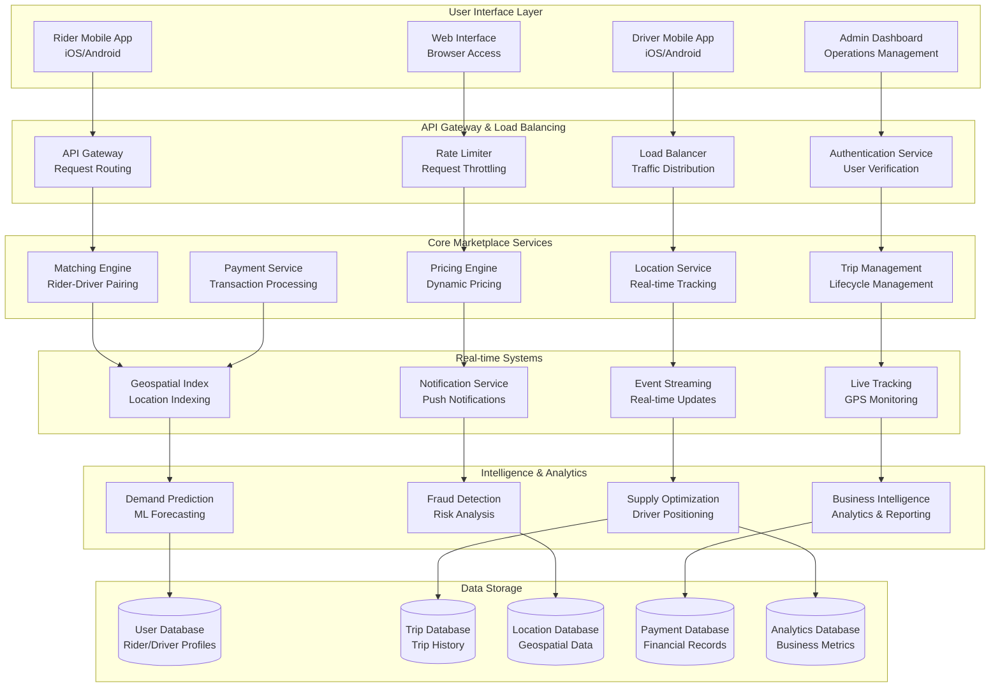
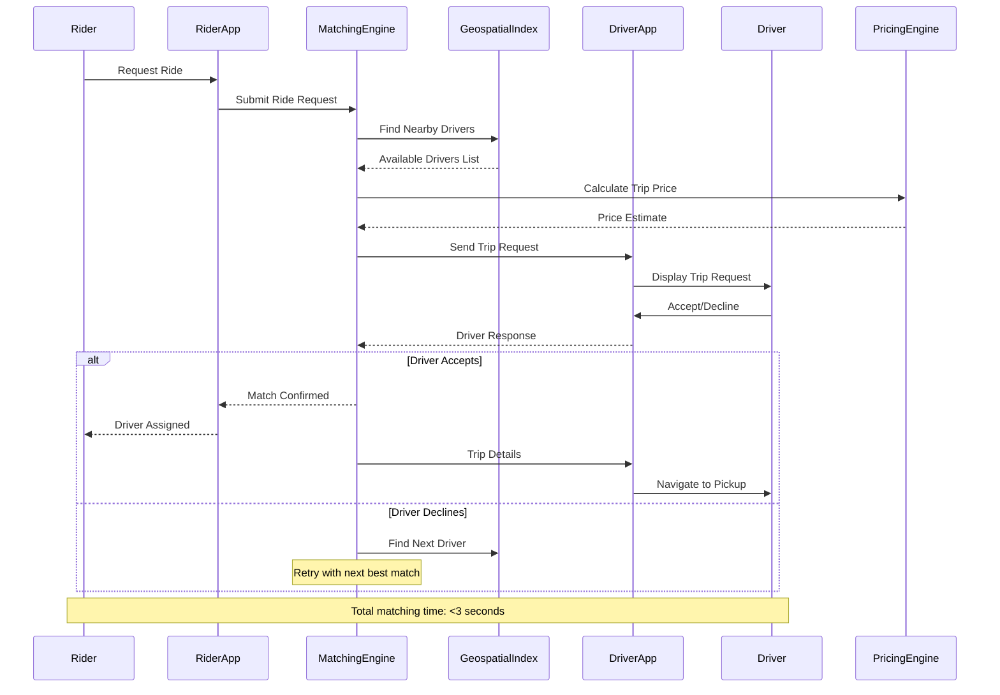
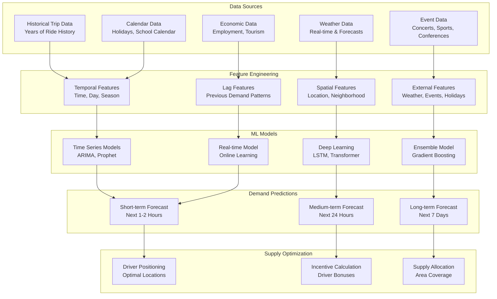
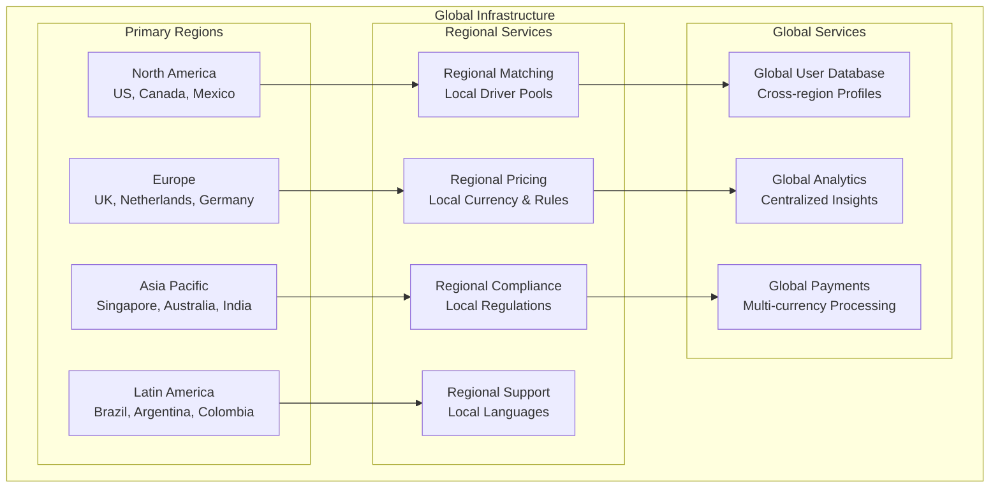

# Uber Real-Time Marketplace: Matching Riders and Drivers at Global Scale

## 🚗 Executive Summary

Uber operates the world's largest real-time marketplace, facilitating over **5 billion trips annually** by connecting **118+ million monthly active users** with **5+ million drivers** across **70+ countries**. Processing **millions of ride requests per day** with **sub-second matching**, Uber's architecture combines **real-time geospatial processing**, **dynamic pricing algorithms**, **predictive analytics**, and **global distributed systems** to create seamless transportation experiences in **10,000+ cities** worldwide.

## 📈 Scale and Business Impact

### Key Metrics
- **118+ million monthly active users**
- **5+ million active drivers** globally
- **5+ billion trips completed** annually
- **70+ countries** and **10,000+ cities** served
- **15+ million trips per day** at peak
- **Sub-second matching** for 95% of requests
- **99.99%+ platform availability**
- **$31+ billion gross bookings** (2022)
- **$17+ billion revenue** (2022)

### Platform Evolution Timeline
- **2009**: UberCab founded in San Francisco
- **2011**: UberX launch (non-luxury vehicles)
- **2012**: International expansion begins
- **2014**: UberPOOL (ride sharing) introduction
- **2016**: Self-driving car research begins
- **2018**: Uber Eats becomes major revenue driver
- **2019**: IPO and focus on profitability
- **2022**: Autonomous vehicle partnerships expand

## 🏛️ High-Level Architecture

## 🎯 Real-Time Matching Engine

**World's Most Sophisticated Real-Time Marketplace Algorithm:**
Uber's matching engine represents the pinnacle of real-time marketplace technology, processing **millions of ride requests daily** while considering **hundreds of variables** to make optimal rider-driver pairings in **sub-second timeframes**. The system balances **supply and demand**, **geographical constraints**, **driver preferences**, **rider requirements**, and **business objectives** to maximize **marketplace efficiency** and **user satisfaction**.

**Multi-Dimensional Matching Architecture:**

**1. Geospatial Processing Engine:**
- **Real-Time Location Tracking**: GPS coordinates processed from millions of devices every second
- **Geohashing Implementation**: Spatial indexing using geohash for efficient proximity queries
- **Dynamic Service Areas**: City boundaries and service zones updated in real-time based on demand
- **Traffic-Aware Routing**: Integration with real-time traffic data for accurate ETA calculations
- **Predictive Positioning**: ML models predict optimal driver positioning for anticipated demand

**2. Multi-Objective Optimization Framework:**
- **Supply-Demand Balancing**: Real-time marketplace equilibrium maintenance
- **Driver Utilization Maximization**: Minimize driver idle time while maintaining service quality
- **Rider Experience Optimization**: Balance wait times with ride quality and pricing
- **Platform Revenue Optimization**: Maximize long-term marketplace value
- **Global System Efficiency**: Consider city-wide transportation patterns and optimization

**3. Real-Time Decision Architecture:**
- **Sub-Second Processing**: Matching decisions completed within 100-500 milliseconds
- **Concurrent Request Handling**: Thousands of simultaneous matching operations
- **Dynamic Pricing Integration**: Surge pricing calculations seamlessly integrated
- **Predictive Analytics**: Machine learning models predict cancellations and optimize matches
- **Adaptive Algorithms**: Continuous learning from marketplace feedback and outcomes

### Geospatial Matching System
Uber's matching engine processes **millions of requests per minute**:

## 📊 Demand Prediction and Supply Optimization

### ML-Powered Demand Forecasting
Uber uses machine learning to predict demand patterns:

## 🌍 Global Infrastructure

### Multi-Region Architecture
Uber operates in **70+ countries** with localized infrastructure:

## 📚 Key Lessons Learned

### Technical Architecture Lessons
1. **Real-time Geospatial Processing**: Efficient spatial indexing critical for sub-second matching
2. **Event-Driven Architecture**: Asynchronous processing enables real-time updates at scale
3. **Machine Learning Integration**: ML models essential for demand prediction and pricing optimization
4. **Global Distribution**: Regional infrastructure necessary for latency and compliance requirements
5. **Fault Tolerance**: System must handle failures gracefully to maintain marketplace operation

### Business Strategy Lessons
1. **Network Effects**: Two-sided marketplace benefits from scale on both supply and demand sides
2. **Dynamic Pricing**: Surge pricing balances supply and demand while maximizing revenue
3. **Global Localization**: Each market requires local adaptation for regulations, culture, and preferences
4. **Data-Driven Operations**: Extensive use of data analytics for operational optimization
5. **Platform Strategy**: Expanding beyond rides to food delivery, freight, and other services

### Operational Excellence
1. **Real-time Monitoring**: Comprehensive monitoring of matching performance and system health
2. **Incident Response**: Rapid response to issues affecting marketplace operation
3. **Capacity Planning**: Predictive scaling for demand spikes and special events
4. **Quality Assurance**: Continuous testing of matching algorithms and pricing models
5. **Performance Optimization**: Constant optimization of matching speed and accuracy

## 🎯 Business Impact

### Financial Performance
- **$31+ billion gross bookings** (2022)
- **$17+ billion revenue** (2022)
- **118+ million monthly active users**
- **5+ million active drivers** globally
- **Path to profitability** achieved

### Market Position
1. **Ridesharing Leader**: Dominant position in most major markets
2. **Super App Strategy**: Expanding to food delivery, freight, and other services
3. **Technology Innovation**: Leading in autonomous vehicle development
4. **Global Expansion**: Operations in 70+ countries and 10,000+ cities
5. **Economic Impact**: Created new employment opportunities for millions of drivers

This comprehensive case study demonstrates how Uber built the world's largest real-time marketplace, connecting millions of riders and drivers globally through sophisticated matching algorithms, dynamic pricing, and distributed infrastructure that operates at massive scale while maintaining sub-second response times.
