# WhatsApp Real-Time Messaging System: 2 Billion Users with 50 Engineers

## 📱 Executive Summary

WhatsApp represents one of the most remarkable engineering achievements in modern technology - supporting over **2 billion users** with a team of just **50 engineers** at the time of Facebook acquisition. Built on Erlang/OTP, WhatsApp demonstrates how the right architectural choices can create systems that scale massively while maintaining simplicity and reliability.

## 🏗️ System Overview

### Core Statistics (at acquisition in 2014)
- **450 million users** (grew to 2B+ by 2023)
- **50 engineers** total team
- **32 billion messages** per day
- **50 million messages** per second at peak
- **99.9%+ uptime** globally
- **$19 billion acquisition** by Facebook

### Design Philosophy
1. **Keep it Simple**: Minimal feature set, maximum reliability
2. **Erlang/OTP**: Built for telecom-grade fault tolerance
3. **No Advertisements**: Focus purely on messaging
4. **End-to-End Encryption**: Privacy by design
5. **Minimal Metadata**: Store as little as possible

## 🎯 Business Requirements

### Functional Requirements
1. **Real-time Messaging**: Instant message delivery
2. **Group Chat**: Support for group conversations
3. **Media Sharing**: Photos, videos, documents
4. **Voice Messages**: Audio recording and playback
5. **Status Updates**: Temporary status sharing
6. **Cross-platform**: iOS, Android, Web support

### Non-Functional Requirements
1. **Scale**: Support billions of users
2. **Latency**: <100ms message delivery
3. **Availability**: 99.9%+ uptime
4. **Consistency**: Message ordering and delivery guarantees
5. **Security**: End-to-end encryption
6. **Efficiency**: Minimal server resources per user

## 🏛️ High-Level Architecture

```mermaid
graph TB
    subgraph "Client Layer"
        iOS[iOS App]
        Android[Android App]
        Web[WhatsApp Web]
        Desktop[Desktop App]
    end
    
    subgraph "Load Balancing"
        LB[Load Balancers<br/>HAProxy]
        SSL[SSL Termination]
    end
    
    subgraph "Application Layer"
        ChatServers[Chat Servers<br/>Erlang/OTP]
        MediaServers[Media Servers<br/>FreeBSD]
        WebServers[Web Servers<br/>YAWS]
    end
    
    subgraph "Storage Layer"
        MessageDB[(Message Storage<br/>Custom)]
        MediaStorage[(Media Storage<br/>Distributed)]
        UserDB[(User Database<br/>MySQL)]
    end
    
    subgraph "Infrastructure"
        Monitoring[Monitoring<br/>Custom Tools]
        Analytics[Analytics<br/>Minimal)]
    end
    
    iOS --> LB
    Android --> LB
    Web --> LB
    Desktop --> LB
    
    LB --> SSL
    SSL --> ChatServers
    SSL --> MediaServers
    SSL --> WebServers
    
    ChatServers --> MessageDB
    ChatServers --> UserDB
    MediaServers --> MediaStorage
    WebServers --> ChatServers
    
    ChatServers --> Monitoring
    MediaServers --> Analytics
```

## 🔧 Core Technology Stack

### Programming Languages & Frameworks
1. **Erlang/OTP**: Core messaging infrastructure
2. **FreeBSD**: Operating system of choice
3. **C++**: Performance-critical components
4. **JavaScript**: Web client
5. **Objective-C/Java**: Mobile clients

### Key Technologies
1. **YAWS (Yet Another Web Server)**: Erlang-based web server
2. **Mnesia**: Distributed database (Erlang)
3. **HAProxy**: Load balancing
4. **MySQL**: User data storage
5. **Custom Protocol**: Efficient binary protocol

## 🚀 Erlang/OTP Architecture Deep Dive

### Why Erlang? The Strategic Technology Decision

WhatsApp's choice of Erlang/OTP was **the most critical architectural decision** that enabled their unprecedented scale with minimal engineering resources:

**1. Massive Concurrency Architecture:**
- **Lightweight Processes**: Each Erlang process consumes only **2KB of memory**, enabling millions of concurrent processes
- **Actor Model**: Each user connection becomes an independent actor with its own mailbox and state
- **Preemptive Scheduling**: BEAM VM ensures fair CPU distribution across millions of processes
- **No Shared State**: Eliminates race conditions and complex locking mechanisms

**2. Fault Tolerance Philosophy:**
- **"Let It Crash" Design**: Individual process failures don't affect the entire system
- **Supervision Trees**: Hierarchical process monitoring and automatic restart capabilities  
- **Isolation**: Process crashes are contained - one user's connection failure doesn't impact others
- **Self-Healing**: Automatic recovery from transient failures without human intervention

**3. Hot Code Swapping Capabilities:**
- **Zero-Downtime Updates**: Deploy new code without dropping user connections
- **Gradual Migration**: Processes can migrate to new code versions individually
- **Rollback Safety**: Instant rollback to previous versions if issues arise
- **Production Continuity**: Critical for 24/7 global messaging service

**4. Built-in Distribution:**
- **Transparent Clustering**: Processes can communicate across machines seamlessly
- **Location Transparency**: Process communication works identically locally or across data centers
- **Automatic Load Distribution**: Work naturally spreads across available nodes
- **Fault-Tolerant Clustering**: Nodes can join/leave cluster without service disruption

**5. Telecom-Grade Reliability:**
- **99.999% Uptime Design**: Originally built for telephone switches requiring extreme reliability
- **Proven at Scale**: Decades of use in mission-critical telecom infrastructure
- **Mature Ecosystem**: OTP (Open Telecom Platform) provides battle-tested patterns
- **Predictable Performance**: Soft real-time guarantees for message processing

### Process Model
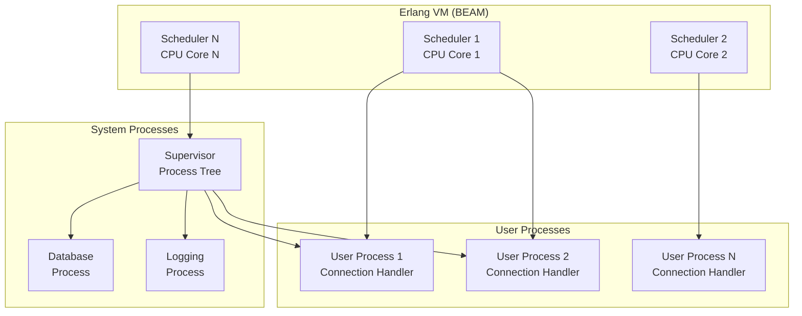

### Connection Handling Architecture

**Dedicated Process Per Connection Design:**
WhatsApp's breakthrough was assigning **one Erlang process per user connection**, a design that seems wasteful but proves incredibly efficient:

**Connection Process Responsibilities:**
- **State Management**: Maintains user session state, authentication, and connection metadata
- **Message Routing**: Handles incoming/outgoing message routing and delivery confirmations
- **Protocol Handling**: Manages WhatsApp's custom binary protocol parsing and generation
- **Presence Management**: Tracks user online/offline status and last-seen timestamps
- **Rate Limiting**: Enforces per-user rate limits to prevent spam and abuse

**Process Lifecycle Management:**
- **Connection Establishment**: New process spawned when user connects
- **Authentication**: Process validates user credentials and initializes session state
- **Message Processing**: Handles all user interactions through message passing
- **Graceful Shutdown**: Process cleanup when user disconnects or crashes
- **Resource Cleanup**: Automatic memory and resource deallocation

**Inter-Process Communication Pattern:**

```erlang
%% Simplified user connection process
-module(user_connection).
-behaviour(gen_server).

%% User connection state
-record(state, {
    user_id,
    socket,
    last_seen,
    message_queue
}).

%% Handle incoming message
handle_info({tcp, Socket, Data}, State) ->
    Message = decode_message(Data),
    case Message of
        {send_message, ToUser, Content} ->
            deliver_message(ToUser, Content, State#state.user_id),
            {noreply, State};
        {get_messages} ->
            Messages = get_pending_messages(State#state.user_id),
            send_messages(Socket, Messages),
            {noreply, State}
    end.
```

## 📡 Real-Time Messaging Protocol

### Custom Binary Protocol
WhatsApp developed a custom binary protocol for efficiency:

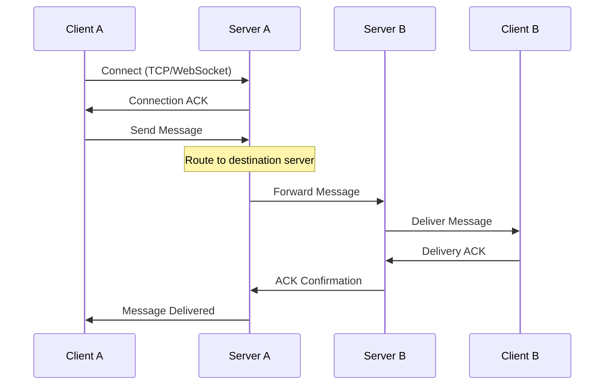

### Message Format
```
+----------+----------+----------+----------+
| Version  | Type     | Length   | Payload  |
| (1 byte) | (1 byte) | (2 bytes)| (N bytes)|
+----------+----------+----------+----------+
```

### Message Types
1. **TEXT**: Plain text message
2. **IMAGE**: Photo with metadata
3. **AUDIO**: Voice message
4. **VIDEO**: Video file
5. **DOCUMENT**: File attachment
6. **LOCATION**: GPS coordinates
7. **CONTACT**: Contact information

## 🔄 Message Delivery Architecture

### Message Flow
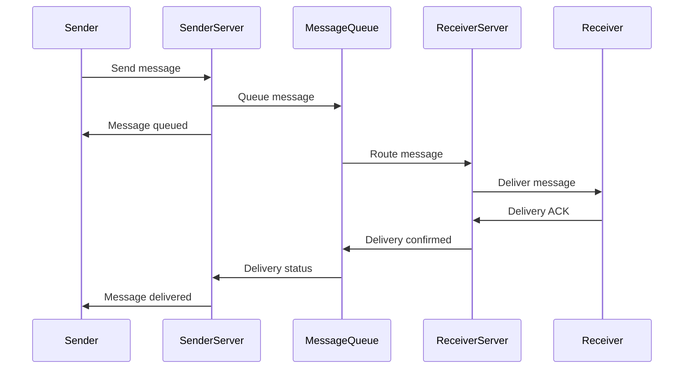

### Delivery Guarantees
1. **At-least-once delivery**: Messages won't be lost
2. **Idempotent processing**: Duplicate messages handled
3. **Ordered delivery**: Messages arrive in sent order
4. **Retry mechanism**: Failed deliveries are retried
5. **Offline message storage**: Messages stored for offline users

### Message States
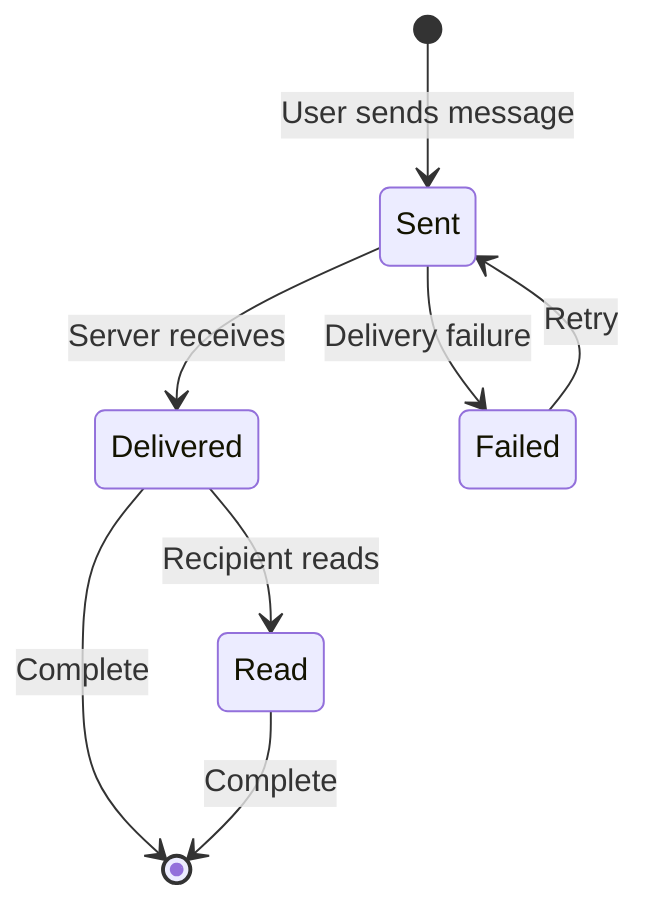

## 🗄️ Data Storage Architecture

### Message Storage Strategy
WhatsApp uses a **minimal storage** approach:

1. **Temporary Storage**: Messages stored briefly for delivery
2. **No Long-term Storage**: Messages deleted after delivery
3. **Client-side Storage**: Messages stored on user devices
4. **Backup Integration**: Optional cloud backup

### Database Schema (Simplified)
```sql
-- User table
CREATE TABLE users (
    user_id BIGINT PRIMARY KEY,
    phone_number VARCHAR(20) UNIQUE,
    status VARCHAR(255),
    last_seen TIMESTAMP,
    created_at TIMESTAMP
);

-- Temporary message queue
CREATE TABLE message_queue (
    message_id BIGINT PRIMARY KEY,
    from_user BIGINT,
    to_user BIGINT,
    message_type TINYINT,
    content BLOB,
    created_at TIMESTAMP,
    expires_at TIMESTAMP,
    INDEX idx_to_user_created (to_user, created_at)
);

-- Group membership
CREATE TABLE group_members (
    group_id BIGINT,
    user_id BIGINT,
    joined_at TIMESTAMP,
    role ENUM('admin', 'member'),
    PRIMARY KEY (group_id, user_id)
);
```

### Data Retention Policy
- **Messages**: Deleted after successful delivery
- **Media**: Temporary storage (30 days max)
- **User metadata**: Minimal required data only
- **Analytics**: Aggregated data only, no personal info

## 👥 Group Chat Architecture

### Group Management
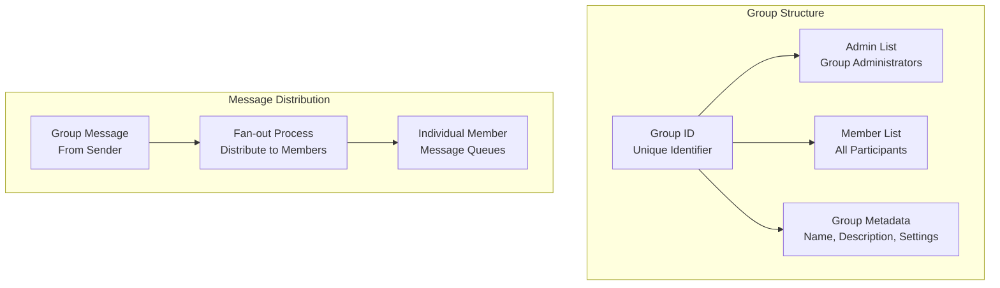

### Group Message Delivery
```erlang
%% Simplified group message delivery
deliver_group_message(GroupId, SenderId, Message) ->
    Members = get_group_members(GroupId),
    ActiveMembers = filter_active_members(Members),
    
    %% Spawn parallel delivery processes
    DeliveryPids = [
        spawn(fun() -> 
            deliver_to_user(UserId, Message, GroupId) 
        end) || UserId <- ActiveMembers
    ],
    
    %% Wait for delivery confirmations
    wait_for_deliveries(DeliveryPids).
```

### Group Limits
- **Members**: 256 participants maximum
- **Admins**: Multiple admins supported
- **Message history**: Not stored on servers
- **Media sharing**: Same as individual chats

## 🔐 Security Architecture

### End-to-End Encryption (Signal Protocol)
WhatsApp implemented the **Signal Protocol** for E2E encryption:

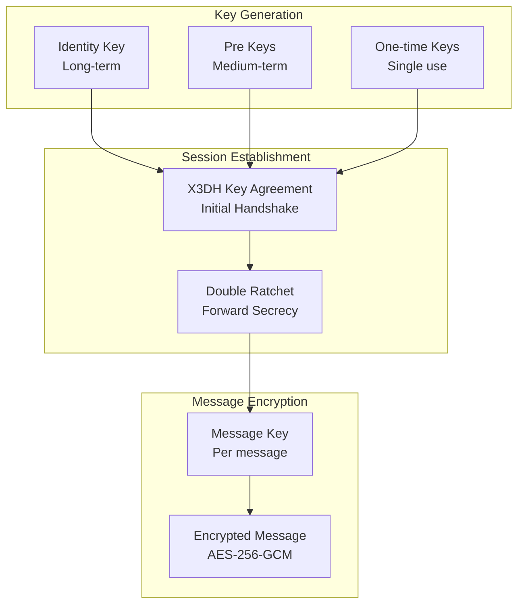

### Key Exchange Process
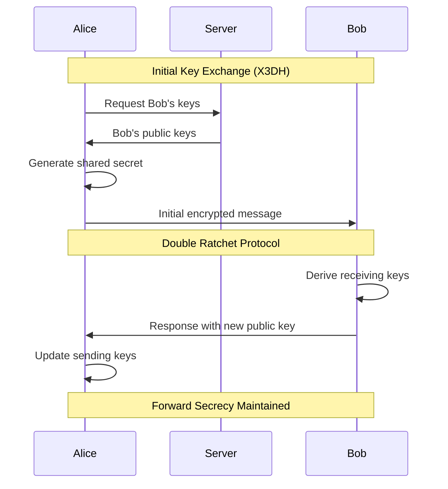

### Security Features
1. **End-to-End Encryption**: All messages encrypted
2. **Forward Secrecy**: Past messages secure even if keys compromised
3. **Authentication**: Verify contact identity
4. **No Backdoors**: WhatsApp cannot read messages
5. **Metadata Protection**: Minimal metadata stored

## 📊 Scaling Strategies

### Horizontal Scaling Architecture

**Scale-Out Strategy Over Scale-Up:**
WhatsApp's fundamental scaling philosophy prioritizes **adding commodity servers** rather than upgrading to more powerful hardware:

**Consistent Hashing Distribution:**
- **User ID Hashing**: Each user mapped to specific server based on phone number hash
- **Hash Ring Management**: Servers organized in consistent hash ring for even distribution
- **Minimal Reshuffling**: Adding/removing servers affects minimal user reassignments
- **Predictable Routing**: Message routing becomes deterministic and cacheable

**Server Capacity Planning:**
- **2+ Million Connections Per Server**: Each server handles massive concurrent connection loads
- **Commodity Hardware**: Standard x86 servers with 32-64GB RAM, avoiding expensive specialized hardware
- **Linear Scalability**: Adding N servers increases capacity by exactly N times
- **No Single Points of Failure**: Any server can fail without affecting overall system

**Load Distribution Mechanisms:**

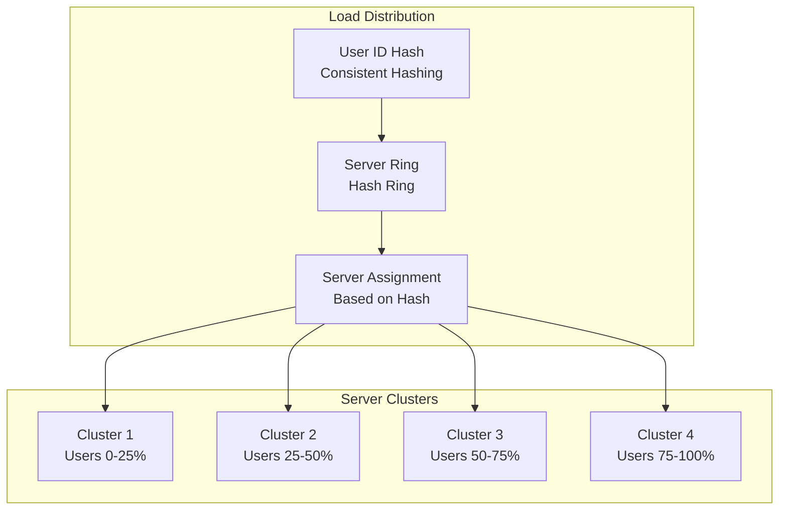

### Connection Management
Each server can handle **2+ million concurrent connections**:

```erlang
%% Server capacity configuration
-define(MAX_CONNECTIONS, 2000000).
-define(CONNECTION_POOL_SIZE, 1000).

%% Connection acceptance loop
accept_connections(ListenSocket) ->
    case gen_tcp:accept(ListenSocket) of
        {ok, Socket} ->
            %% Spawn new process for connection
            Pid = spawn(fun() -> handle_connection(Socket) end),
            gen_tcp:controlling_process(Socket, Pid),
            accept_connections(ListenSocket);
        {error, Reason} ->
            error_logger:error_msg("Accept failed: ~p~n", [Reason])
    end.
```

### Memory Management
Erlang's garbage collection is per-process, enabling:
- **Isolated GC**: No global GC pauses
- **Predictable latency**: Per-process GC cycles
- **Memory efficiency**: Automatic cleanup of terminated processes

## 🌍 Global Infrastructure

### Data Center Strategy
WhatsApp operates from **multiple data centers** worldwide:

1. **Primary DCs**: US East Coast, US West Coast
2. **Regional DCs**: Europe, Asia, South America
3. **Edge Locations**: CDN for media content
4. **Disaster Recovery**: Cross-region replication

### Network Architecture
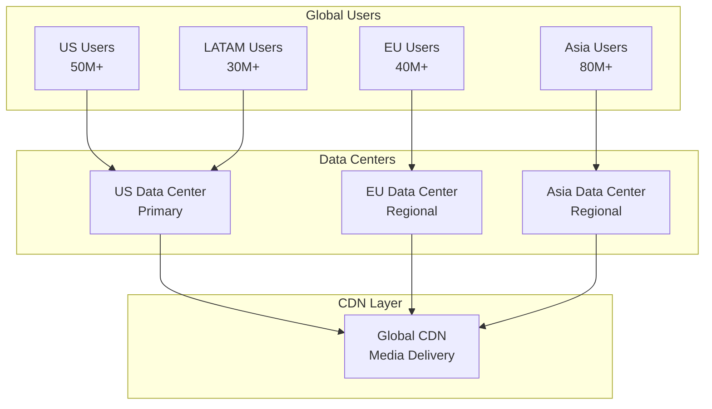

### Cross-Region Message Routing
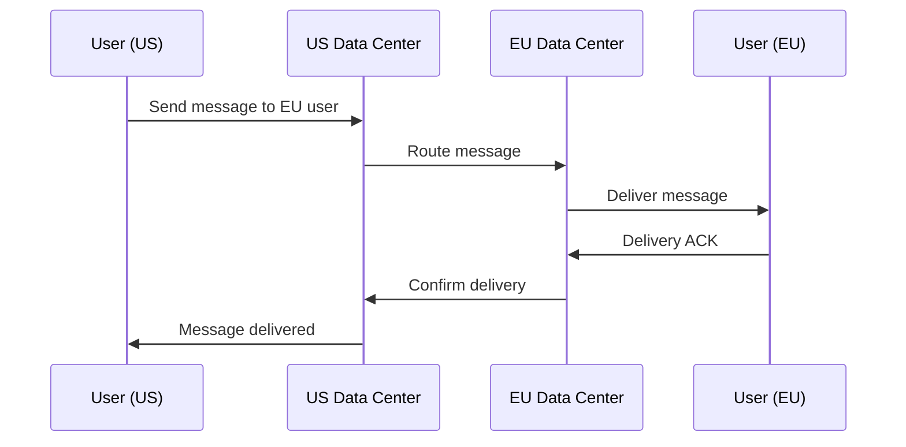

## 📱 Client Architecture

### Multi-Platform Strategy
WhatsApp supports multiple platforms with shared protocol:

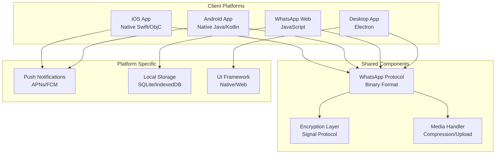

### Client-Side Storage
- **SQLite**: Mobile apps use SQLite for message storage
- **IndexedDB**: Web clients use browser storage
- **Encryption**: Local database encrypted with user key
- **Sync**: Multi-device synchronization via server

### Offline Capabilities
1. **Message Queueing**: Store messages when offline
2. **Auto-retry**: Retry failed sends when back online
3. **Status Sync**: Update message status when reconnected
4. **Media Caching**: Cache frequently accessed media

## 📈 Performance Optimizations

### Network Optimizations
1. **Binary Protocol**: Efficient message encoding
2. **Connection Pooling**: Reuse TCP connections
3. **Compression**: Gzip compression for text
4. **Keep-alive**: Maintain persistent connections

### Server Optimizations
```erlang
%% Message processing optimization
process_message_batch(Messages) ->
    %% Process messages in batches for efficiency
    BatchSize = 100,
    Batches = split_into_batches(Messages, BatchSize),
    
    %% Parallel processing of batches
    Results = pmap(fun process_batch/1, Batches),
    
    %% Collect results
    lists:flatten(Results).

%% Parallel map implementation
pmap(Fun, List) ->
    Parent = self(),
    Pids = [spawn(fun() -> 
        Parent ! {self(), Fun(Item)} 
    end) || Item <- List],
    
    [receive {Pid, Result} -> Result end || Pid <- Pids].
```

### Database Optimizations
1. **Sharding**: Distribute users across databases
2. **Indexing**: Optimize for common queries
3. **Connection Pooling**: Efficient database connections
4. **Query Optimization**: Minimize database load

## 🔍 Monitoring and Operations

### Monitoring Stack
WhatsApp built custom monitoring tools:

1. **Real-time Metrics**: Message rates, connection counts
2. **Error Tracking**: Failed deliveries, connection drops
3. **Performance Monitoring**: Latency, throughput metrics
4. **Capacity Planning**: Growth trend analysis

### Key Metrics
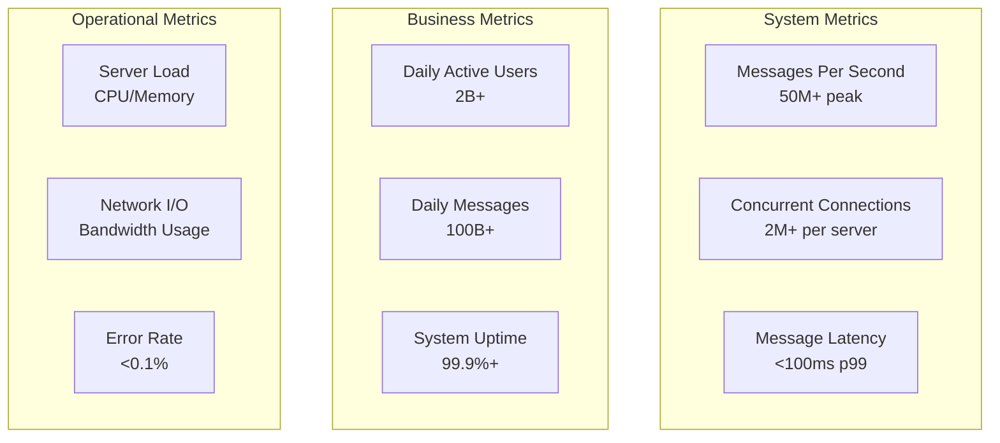

### Alerting System
```erlang
%% Simplified alerting system
-module(alert_system).

check_system_health() ->
    Metrics = get_current_metrics(),
    
    %% Check critical thresholds
    case check_thresholds(Metrics) of
        {critical, Reason} ->
            send_alert(critical, Reason),
            trigger_auto_recovery();
        {warning, Reason} ->
            send_alert(warning, Reason);
        ok ->
            ok
    end.

check_thresholds(Metrics) ->
    MessageRate = maps:get(message_rate, Metrics),
    ErrorRate = maps:get(error_rate, Metrics),
    
    if 
        ErrorRate > 0.01 ->  %% > 1% error rate
            {critical, "High error rate"};
        MessageRate < 1000 ->  %% Unusual low traffic
            {warning, "Low message rate"};
        true ->
            ok
    end.
```

## 🚀 Deployment and DevOps

### Deployment Strategy
WhatsApp uses **blue-green deployments** with Erlang's hot code swapping:

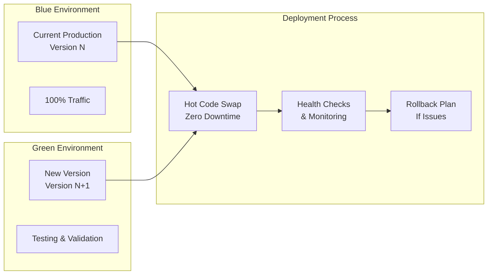

### Hot Code Swapping
```erlang
%% Hot code upgrade example
upgrade_server_code() ->
    %% Load new code version
    code:load_file(message_handler),
    
    %% Notify all processes to upgrade
    Processes = erlang:processes(),
    [Pid ! {upgrade_code, message_handler} || Pid <- Processes],
    
    %% Verify upgrade success
    verify_code_upgrade().

%% Process handles code upgrade
handle_info({upgrade_code, Module}, State) ->
    %% Suspend current operations
    NewState = suspend_operations(State),
    
    %% Upgrade to new code
    ?MODULE:handle_info(resume_operations, NewState).
```

### Release Process
1. **Code Review**: Peer review for all changes
2. **Testing**: Comprehensive unit and integration tests
3. **Staging**: Deploy to staging environment
4. **Canary**: Gradual rollout to small user percentage
5. **Full Deployment**: Complete rollout after validation

## 💰 Cost Efficiency

### Infrastructure Costs
At acquisition, WhatsApp's efficiency was remarkable:
- **$19B acquisition** for 450M users = ~$42 per user
- **50 engineers** supporting 450M users = 9M users per engineer
- **Minimal server footprint** due to Erlang efficiency

### Cost Optimization Strategies
1. **Efficient Protocol**: Minimal bandwidth usage
2. **Stateless Design**: Easy horizontal scaling
3. **Minimal Storage**: No long-term message storage
4. **Open Source**: Erlang/OTP, FreeBSD, MySQL
5. **Hardware Efficiency**: Commodity servers

### Resource Utilization
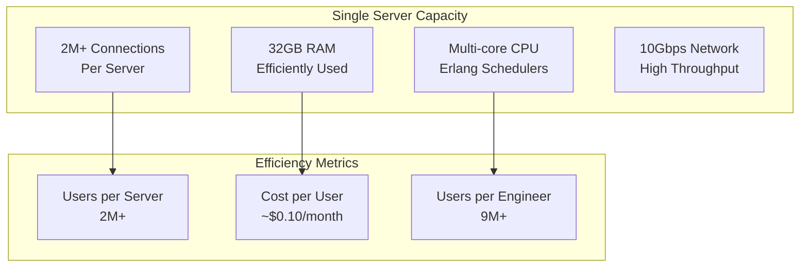

## 🔮 Evolution Post-Facebook Acquisition

### New Features Added
1. **Voice Calls**: VoIP calling functionality
2. **Video Calls**: Video communication
3. **Status Updates**: Story-like feature
4. **WhatsApp Business**: Business communication tools
5. **Payments**: Money transfer capabilities

### Architecture Changes
1. **Infrastructure Scaling**: Massive capacity increases
2. **New Data Centers**: Global expansion
3. **Enhanced Security**: Improved encryption
4. **Business Features**: Enterprise capabilities
5. **Integration**: Limited Facebook integration

### Challenges Faced
1. **Scale Growth**: From 450M to 2B+ users
2. **Feature Complexity**: Adding features while maintaining simplicity
3. **Regulatory Compliance**: Global privacy regulations
4. **Competition**: Telegram, Signal, other messaging apps
5. **Monetization**: Balancing revenue with user experience

## 📚 Key Lessons Learned

### Technical Lessons
1. **Right Technology Choice**: Erlang was perfect for the use case
2. **Simplicity Wins**: Focus on core functionality
3. **Fault Tolerance**: Design for failure from day one
4. **Minimal State**: Stateless design enables scaling
5. **Efficient Protocols**: Custom protocols can be worth it

### Operational Lessons
1. **Small Teams**: Right technology enables small teams
2. **Focus**: Do one thing exceptionally well
3. **User Experience**: Reliability over features
4. **Privacy**: Privacy as a competitive advantage
5. **Global Thinking**: Design for worldwide scale

### Business Lessons
1. **Network Effects**: Messaging benefits from network effects
2. **Timing**: Mobile messaging at the right time
3. **Execution**: Technical excellence drives business success
4. **Acquisition Value**: Technical assets have enormous value
5. **User Trust**: Privacy and reliability build trust

## 🎯 WhatsApp's Impact on Industry

### Technical Influence
1. **Erlang Adoption**: Increased interest in Erlang/OTP
2. **Messaging Protocols**: Influenced other messaging apps
3. **E2E Encryption**: Mainstream adoption of encryption
4. **Minimal Design**: Influenced app design philosophy
5. **Scaling Patterns**: Demonstrated efficient scaling

### Business Impact
1. **Acquisition Valuations**: Set precedent for tech acquisitions
2. **Messaging Market**: Transformed communication industry
3. **Mobile-First**: Demonstrated mobile-first strategy success
4. **Global Reach**: Showed potential of global messaging
5. **Privacy Focus**: Influenced privacy-first products

## 🔮 Future Architecture Considerations

### Emerging Challenges
1. **Regulatory Compliance**: Global data protection laws
2. **Content Moderation**: Balancing privacy with safety
3. **Business Features**: Enterprise communication needs
4. **Competition**: Maintaining market position
5. **Technical Debt**: Evolving 10+ year old codebase

### Technology Evolution
1. **Cloud Native**: Moving to cloud-native architectures
2. **AI Integration**: Smart features while maintaining privacy
3. **Edge Computing**: Reducing latency globally
4. **Quantum Resistance**: Preparing for quantum computing
5. **5G Optimization**: Leveraging next-generation networks

This comprehensive case study of WhatsApp demonstrates how the right architectural choices, combined with relentless focus on simplicity and reliability, can create systems that scale to serve billions of users efficiently. WhatsApp's journey from startup to global platform provides invaluable lessons for building massively scalable messaging systems.
