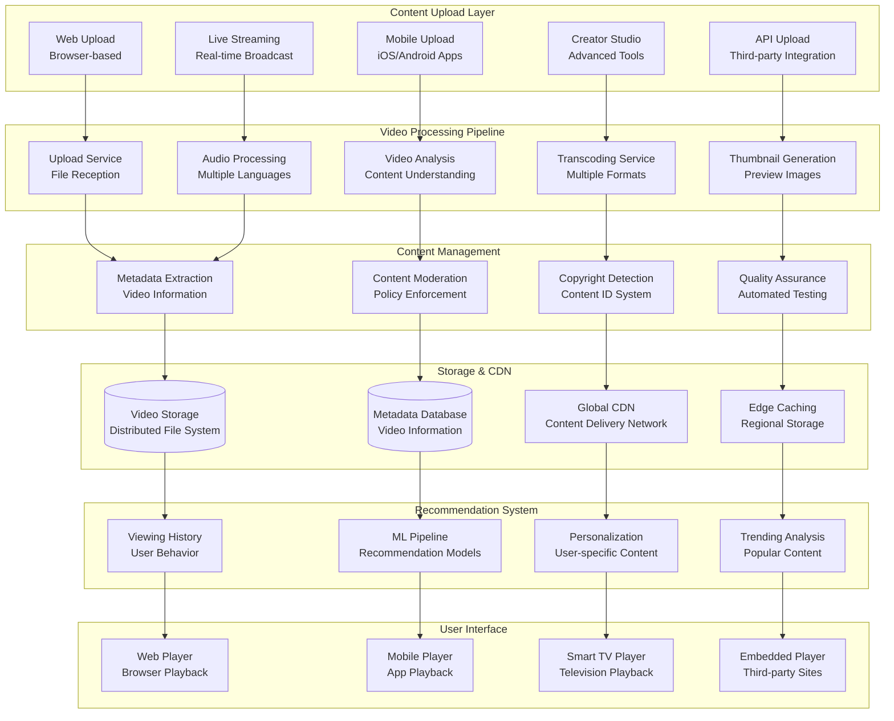
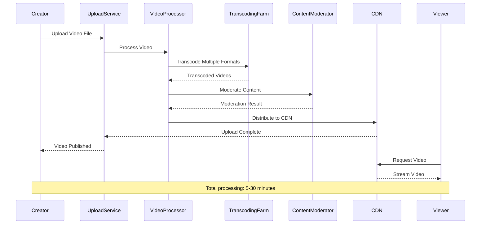
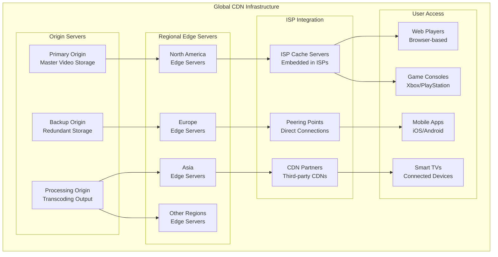

# YouTube Video Processing Pipeline: Handling 500 Hours of Video per Minute

## 🎥 Executive Summary

YouTube processes over **500 hours of video content every minute**, serving **2+ billion logged-in users** monthly who watch **1+ billion hours** of video daily. As the world's largest video platform, YouTube's architecture handles **massive video ingestion**, **real-time transcoding**, **global content delivery**, **AI-powered recommendations**, and **content moderation** while maintaining **99.9%+ availability** and supporting **4K, 8K, and HDR** content at planetary scale.

## 📈 Scale and Business Impact

### Key Metrics
- **2+ billion logged-in monthly users**
- **500+ hours of video uploaded every minute**
- **1+ billion hours watched daily**
- **100+ languages** supported
- **2+ billion videos** in the platform
- **80+ countries** with localized versions
- **4K, 8K, HDR** content support
- **99.9%+ availability** globally
- **$28+ billion revenue** (2022)

### Platform Evolution Timeline
- **2005**: YouTube founded, basic video sharing
- **2006**: Google acquisition for $1.65 billion
- **2007**: Partner Program launch, monetization begins
- **2009**: 1080p HD video support
- **2012**: 4 billion hours watched monthly
- **2015**: YouTube Red (Premium) subscription service
- **2017**: 1 billion hours watched daily milestone
- **2020**: YouTube Shorts launch (TikTok competitor)
- **2022**: 8K video support, advanced AI features

## 🏛️ High-Level Architecture

## 🎬 Video Processing Pipeline

**Massive-Scale Video Transcoding Architecture:**
YouTube's video processing pipeline represents one of the most sophisticated media processing systems ever built, handling **500+ hours of video uploads every minute** while transcoding each video into **dozens of different formats, resolutions, and quality levels** optimized for every conceivable playback scenario.

**Multi-Stage Processing Architecture:**

**1. Upload Ingestion Strategy:**
- **Chunked Upload Protocol**: Large videos split into manageable chunks for reliable upload over unstable connections
- **Resume Capability**: Failed uploads can resume from last successful chunk, critical for large files
- **Parallel Processing**: Multiple chunks processed simultaneously to reduce total processing time
- **Format Validation**: Immediate validation of video format, codec, and container compatibility
- **Duplicate Detection**: Hash-based detection prevents duplicate content uploads and saves processing resources

**2. Video Analysis and Understanding:**
- **Content Classification**: AI models analyze video content for appropriate categorization and recommendations
- **Scene Detection**: Automatic identification of scene changes for optimal thumbnail generation
- **Audio Analysis**: Speech recognition, music detection, and audio quality assessment
- **Visual Quality Assessment**: Automated detection of video quality issues and encoding artifacts
- **Content Safety Scanning**: Initial automated screening for policy violations before human review

**3. Distributed Transcoding Engine:**
- **Global Processing**: Video transcoding distributed across thousands of servers in multiple data centers
- **Adaptive Bitrate Generation**: Multiple quality levels (144p to 8K) generated for adaptive streaming
- **Platform Optimization**: Specific optimizations for mobile, web, smart TV, and VR platforms
- **Hardware Acceleration**: GPU clusters and specialized chips (TPU) for efficient video encoding
- **Content-Aware Encoding**: Different encoding settings optimized for content type (animation, sports, music videos)

**4. Audio Processing Pipeline:**
- **Multi-Language Support**: Audio track separation and automatic language detection
- **Audio Enhancement**: Noise reduction, normalization, and quality improvement algorithms
- **Subtitle Generation**: Automatic speech recognition generates closed captions in multiple languages
- **Codec Optimization**: Multiple audio formats (AAC, Opus, MP3) optimized for different platforms
- **Spatial Audio**: Support for 3D and surround sound formats for immersive experiences

### Upload and Ingestion System
YouTube handles **500+ hours of video every minute**:

## 🔍 Content ID and Copyright Detection System

**World's Most Advanced Copyright Detection Architecture:**
YouTube's Content ID system represents the most sophisticated copyright detection technology ever deployed, scanning **every uploaded video** against a database of **100+ million reference files** submitted by content owners, processing **400+ hours of video every minute** for potential copyright matches.

**Multi-Modal Content Matching:**

**1. Audio Fingerprinting Technology:**
- **Acoustic Fingerprinting**: Generates unique audio signatures resilient to compression, pitch changes, and background noise
- **Spectral Analysis**: Analyzes frequency domain characteristics for robust matching across different audio qualities
- **Temporal Pattern Recognition**: Identifies audio patterns across time for accurate matching even with edits
- **Multi-Language Detection**: Handles dubbed content and multiple language versions of the same material
- **Live Audio Monitoring**: Real-time copyright detection for live streams and premieres

**2. Video Fingerprinting System:**
- **Visual Fingerprinting**: Creates compact representations of video frames for efficient comparison at scale
- **Scene Change Detection**: Identifies key frames and transitions for matching even with re-editing
- **Color Histogram Analysis**: Robust matching despite color grading, filtering, and visual effects changes
- **Motion Vector Analysis**: Detects video content even with cropping, letterboxing, or aspect ratio changes
- **Frame Rate Independence**: Matches content regardless of frame rate conversions or time stretching

**3. Machine Learning Enhancement:**
- **Deep Learning Models**: Neural networks trained on billions of video comparisons for improved accuracy
- **Context Understanding**: AI models understand fair use, parody, and educational content contexts
- **False Positive Reduction**: Advanced algorithms minimize incorrect copyright claims
- **Automated Appeals**: ML systems handle routine copyright disputes and appeals
- **Content Evolution Tracking**: Systems adapt to new forms of content manipulation and evasion techniques

## 📊 Global Content Delivery Network

**Planetary-Scale Video Distribution Architecture:**
YouTube's CDN represents one of the world's largest content delivery networks, serving **billions of video views daily** with **sub-second startup times** across **100+ countries**. The system dynamically adapts to network conditions, device capabilities, and user preferences to deliver optimal viewing experiences.

### CDN Architecture
YouTube operates one of the world's largest CDNs:

## 📚 Key Lessons Learned

### Technical Architecture Lessons
1. **Distributed Processing**: Video transcoding requires massive parallel processing infrastructure
2. **Multi-Format Strategy**: Supporting multiple codecs and resolutions for different devices and network conditions
3. **Content Moderation**: AI-powered moderation with human oversight essential for policy enforcement
4. **Global CDN**: Massive CDN infrastructure critical for video delivery performance
5. **Real-time Analytics**: Continuous monitoring of video processing and delivery performance

### Business Strategy Lessons
1. **Creator Economy**: Supporting content creators drives platform growth and engagement
2. **Monetization Balance**: Balancing user experience with advertising revenue
3. **Global Localization**: Adapting content and features for different markets and cultures
4. **Copyright Management**: Sophisticated copyright detection system essential for legal compliance
5. **Platform Evolution**: Continuous feature development to compete with emerging platforms

### Operational Excellence
1. **Automated Processing**: Fully automated video processing pipeline for scale
2. **Quality Assurance**: Comprehensive quality checks throughout the processing pipeline
3. **Performance Monitoring**: Real-time monitoring of processing times and success rates
4. **Capacity Planning**: Predictive scaling for viral content and traffic spikes
5. **Incident Response**: Rapid response to processing failures and quality issues

## 🎯 Business Impact

### Financial Performance
- **$28+ billion revenue** (2022)
- **2+ billion logged-in monthly users**
- **Strong advertising growth** year-over-year
- **YouTube Premium/Music** subscription revenue
- **Creator revenue sharing** program success

### Market Position
1. **Video Platform Dominance**: Leading global video sharing platform
2. **Digital Advertising**: Major player in video advertising ecosystem
3. **Creator Economy**: Foundation for millions of content creators worldwide
4. **Cultural Impact**: Significant influence on global entertainment and culture
5. **Educational Platform**: Major source of educational and instructional content

This comprehensive case study demonstrates how YouTube built the world's largest video platform, processing hundreds of hours of content every minute while delivering high-quality video experiences to billions of users globally through sophisticated processing pipelines, AI-powered recommendations, and massive distributed infrastructure.
