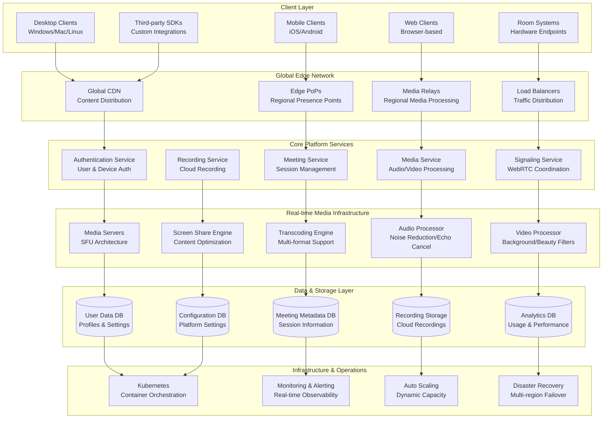
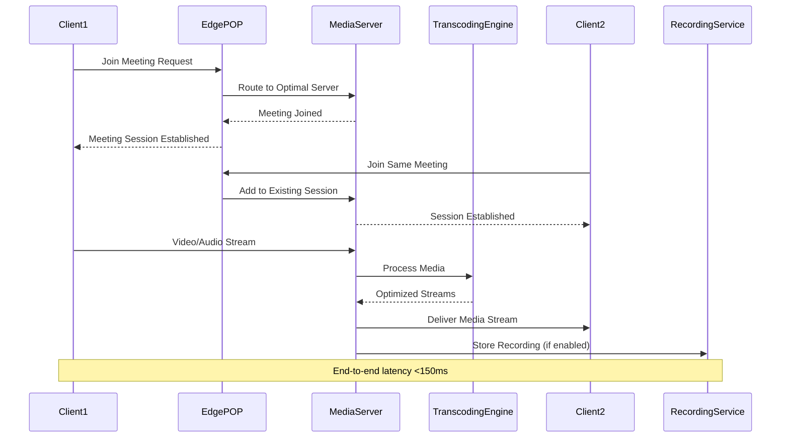

# Zoom Video Conferencing Infrastructure: Scaling to 500M+ Daily Participants

## 🎥 Executive Summary

Zoom revolutionized video conferencing by building the world's most scalable and reliable video communication platform, serving **500+ million daily meeting participants** across **190+ countries**. Processing **3+ billion meeting minutes daily** while maintaining **99.99% uptime**, Zoom's architecture combines **real-time media processing**, **global edge distribution**, **adaptive video encoding**, and **intelligent routing** to deliver seamless video experiences that became essential infrastructure during the global pandemic and beyond.

## 📈 Scale and Business Impact

### Key Metrics
- **500+ million daily meeting participants** (peak 2021)
- **3+ billion meeting minutes** processed daily
- **190+ countries and territories** served
- **1,000+ data centers** globally
- **99.99% uptime** SLA achievement
- **40+ languages** supported
- **150 milliseconds average latency** globally
- **4.5+ billion users** registered
- **$4+ billion annual revenue** (2023)

### Growth Timeline
- **2011**: Zoom founded, initial product launch
- **2013**: 1 million participants milestone
- **2016**: IPO preparation, enterprise focus
- **2019**: 10 million daily participants
- **2020**: COVID-19 surge to 300+ million daily
- **2021**: Peak usage, platform stability
- **2022**: Hybrid work optimization
- **2023**: AI-powered features integration

## 🏛️ High-Level Architecture

## 🎬 Real-Time Media Processing Architecture

### Video Conferencing Flow
Zoom processes **millions of simultaneous video streams** with ultra-low latency:

## 📊 Global Infrastructure and Scaling

### Multi-Region Deployment
Zoom operates **1,000+ data centers** across **17 regions** worldwide:

```mermaid
graph TB
    subgraph "Americas"
        USWest[US West<br/>Primary DC]
        USEast[US East<br/>Secondary DC]
        Canada[Canada<br/>Regional DC]
        Brazil[Brazil<br/>LATAM Hub]
    end
    
    subgraph "Europe"
        UKLondon[UK London<br/>EMEA Hub]
        Germany[Germany<br/>EU Central]
        Ireland[Ireland<br/>EU West]
        Netherlands[Netherlands<br/>EU North]
    end
    
    subgraph "Asia Pacific"
        Singapore[Singapore<br/>APAC Hub]
        Japan[Japan<br/>Regional DC]
        Australia[Australia<br/>Regional DC]
        India[India<br/>Regional DC]
        HongKong[Hong Kong<br/>Regional DC]
    end
    
    subgraph "Global Backbone"
        GlobalDNS[Global DNS<br/>Route 53 + CloudFlare]
        TrafficManager[Traffic Manager<br/>Intelligent Routing]
        CDNNetwork[CDN Network<br/>Content Distribution]
        MonitoringSystem[Global Monitoring<br/>Real-time Health]
    end
    
    USWest --> GlobalDNS
    USEast --> TrafficManager
    Canada --> CDNNetwork
    Brazil --> MonitoringSystem
    
    UKLondon --> GlobalDNS
    Germany --> TrafficManager
    Ireland --> CDNNetwork
    Netherlands --> MonitoringSystem
    
    Singapore --> GlobalDNS
    Japan --> TrafficManager
    Australia --> CDNNetwork
    India --> MonitoringSystem
    HongKong --> GlobalDNS
```

## 📚 Key Lessons Learned

### Technical Architecture Lessons
1. **SFU Architecture**: Selective Forwarding Units provide optimal balance of quality and scalability
2. **Adaptive Streaming**: Dynamic quality adjustment based on network conditions ensures consistent experience
3. **Edge Computing**: Regional media processing reduces latency and improves quality
4. **Global Load Balancing**: Intelligent routing to optimal data centers based on proximity and capacity
5. **Real-time Optimization**: Continuous optimization of encoding, routing, and quality parameters

### Business Strategy Lessons
1. **Freemium Model**: Free tier drives adoption while paid plans provide revenue sustainability
2. **Developer Ecosystem**: APIs and SDKs enable third-party integrations and platform growth
3. **Enterprise Focus**: B2B sales strategy with enterprise-grade security and compliance
4. **Pandemic Readiness**: Scalable architecture enabled rapid growth during COVID-19
5. **User Experience**: Simple, reliable experience drives user adoption and retention

### Operational Excellence
1. **Global Monitoring**: Comprehensive real-time monitoring across all regions and services
2. **Automated Scaling**: Dynamic capacity management based on demand patterns
3. **Security First**: End-to-end encryption and comprehensive security measures
4. **Quality Assurance**: Continuous quality monitoring and optimization
5. **Disaster Recovery**: Multi-region failover and backup systems

## 🎯 Business Impact

### Financial Performance
- **$4+ billion annual revenue** (2023)
- **500+ million daily participants** at peak
- **Strong enterprise adoption** across industries
- **High customer retention** rates
- **Global market leadership** in video conferencing

### Market Position
1. **Video Conferencing Leader**: Dominant position in business video conferencing market
2. **Pandemic Infrastructure**: Became essential infrastructure during COVID-19
3. **Enterprise Standard**: Widely adopted as corporate communication platform
4. **Developer Platform**: Extensive API ecosystem enabling integrations
5. **Innovation Pioneer**: Continuous innovation in video technology and user experience

### Social Impact
1. **Remote Work Enablement**: Enabled global shift to remote and hybrid work
2. **Education Continuity**: Supported online learning during school closures
3. **Healthcare Access**: Facilitated telemedicine and remote healthcare
4. **Global Connectivity**: Connected people across geographic boundaries
5. **Business Continuity**: Maintained business operations during disruptions

This comprehensive case study demonstrates how Zoom built the world's most scalable video conferencing platform, processing billions of meeting minutes daily while maintaining industry-leading reliability and quality for hundreds of millions of users worldwide.
