# URL Shortener System Design Architecture

## 1. Executive Summary & Requirements

### System Overview
A URL shortener service that converts long URLs into short, manageable links while providing analytics, custom aliases, and high availability. The system handles millions of URL shortening requests daily with sub-second response times.

### Functional Requirements
- **URL Shortening**: Convert long URLs to short URLs (6-8 character codes)
- **URL Redirection**: Redirect short URLs to original URLs with minimal latency
- **Custom Aliases**: Allow users to create custom short URLs
- **Analytics**: Track click counts, geographic data, referrer information, and timestamps
- **User Management**: User accounts, URL management dashboard
- **Expiration**: Support URL expiration dates
- **Bulk Operations**: API for bulk URL shortening

### Non-Functional Requirements
- **Availability**: 99.9% uptime
- **Latency**: <100ms for URL redirection, <500ms for URL creation
- **Scale**: 100M URLs shortened per day, 10:1 read/write ratio
- **Storage**: 5 years of URL retention
- **Throughput**: 100K read requests per second, 10K write requests per second

### Key Constraints
- Short URLs must be unique and collision-free
- System must handle traffic spikes (viral content)
- Geographic distribution for global low latency
- GDPR and data privacy compliance

### Success Metrics
- 99.9% availability SLA
- Average redirection latency <50ms
- 99.99% URL uniqueness guarantee
- Support 1B+ total URLs in system

## 2. High-Level Architecture Overview

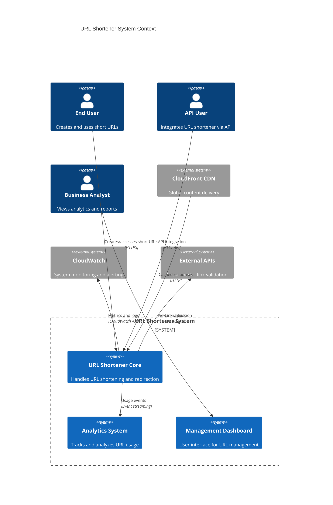

**Architectural Style Rationale**: Microservices architecture chosen for:
- Independent scaling of URL creation vs redirection services
- Technology diversity (different databases optimized for different use cases)
- Fault isolation and independent deployments
- Team autonomy and parallel development

## 3. Detailed System Architecture

### 3.1 AWS Service Stack Selection

**Presentation Layer:**
- **CloudFront**: Global CDN for caching redirections and static assets
- **API Gateway**: RESTful API management with rate limiting and authentication
- **Route 53**: DNS management with health checks and failover

**Application Layer:**
- **ECS Fargate**: Containerized microservices for URL shortener core services
- **Application Load Balancer**: Distributes traffic with health checks
- **Lambda**: Serverless functions for analytics processing and batch jobs

**Data Layer:**
- **DynamoDB**: Primary database for URL mappings (high read performance)
- **RDS Aurora**: User management and analytics data (ACID compliance)
- **ElastiCache Redis**: Caching layer for frequently accessed URLs

**Storage Layer:**
- **S3**: Analytics data archival and static asset storage
- **EFS**: Shared storage for application logs and temporary files

**Streaming/Messaging:**
- **Kinesis Data Streams**: Real-time analytics event streaming
- **SQS**: Asynchronous processing queues
- **SNS**: Notification system for alerts and user notifications

**Analytics:**
- **Kinesis Analytics**: Real-time stream processing
- **Glue**: ETL jobs for analytics data transformation
- **QuickSight**: Business intelligence and dashboard visualization

**Security:**
- **Cognito**: User authentication and authorization
- **WAF**: Web application firewall protection
- **KMS**: Encryption key management
- **Secrets Manager**: API keys and database credentials

**Monitoring:**
- **CloudWatch**: Metrics, logs, and alerting
- **X-Ray**: Distributed tracing
- **CloudTrail**: API audit logging

### 3.2 Component Architecture Diagram

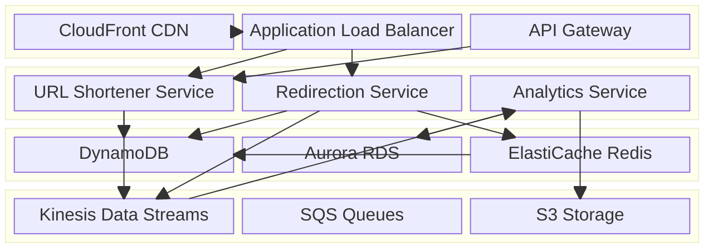

## 4. Data Architecture & Flow

### 4.1 Data Flow Diagrams

#### Read Path (URL Redirection)
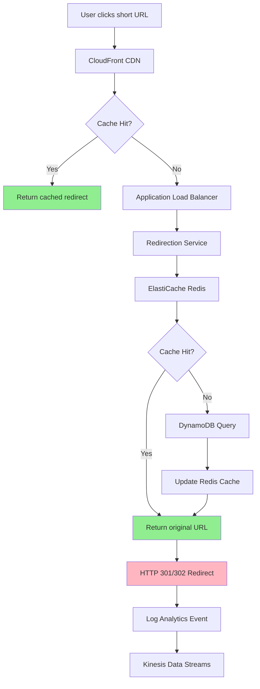

#### Write Path (URL Creation)
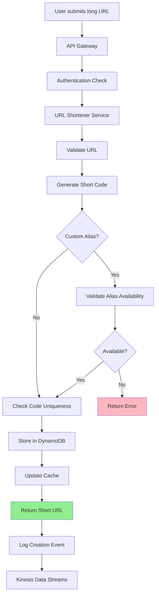

#### Real-time Analytics Processing
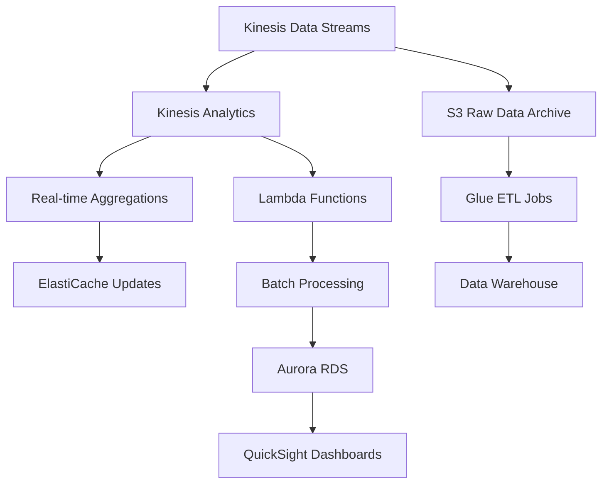

### 4.2 Database Design

#### Primary URL Mapping (DynamoDB)
```mermaid
erDiagram
    URL_MAPPING {
        string short_code PK
        string original_url
        string user_id
        timestamp created_at
        timestamp expires_at
        number click_count
        string status
    }
    
    USER_URLS {
        string user_id PK
        string short_code SK
        timestamp created_at
        string title
        boolean is_custom_alias
    }
    
    ANALYTICS_EVENTS {
        string short_code PK
        timestamp event_time SK
        string ip_address
        string user_agent
        string referrer
        string country
        string city
    }
    
    URL_MAPPING ||--o{ USER_URLS : "belongs to"
    URL_MAPPING ||--o{ ANALYTICS_EVENTS : "generates"
```

#### User Management (Aurora RDS)
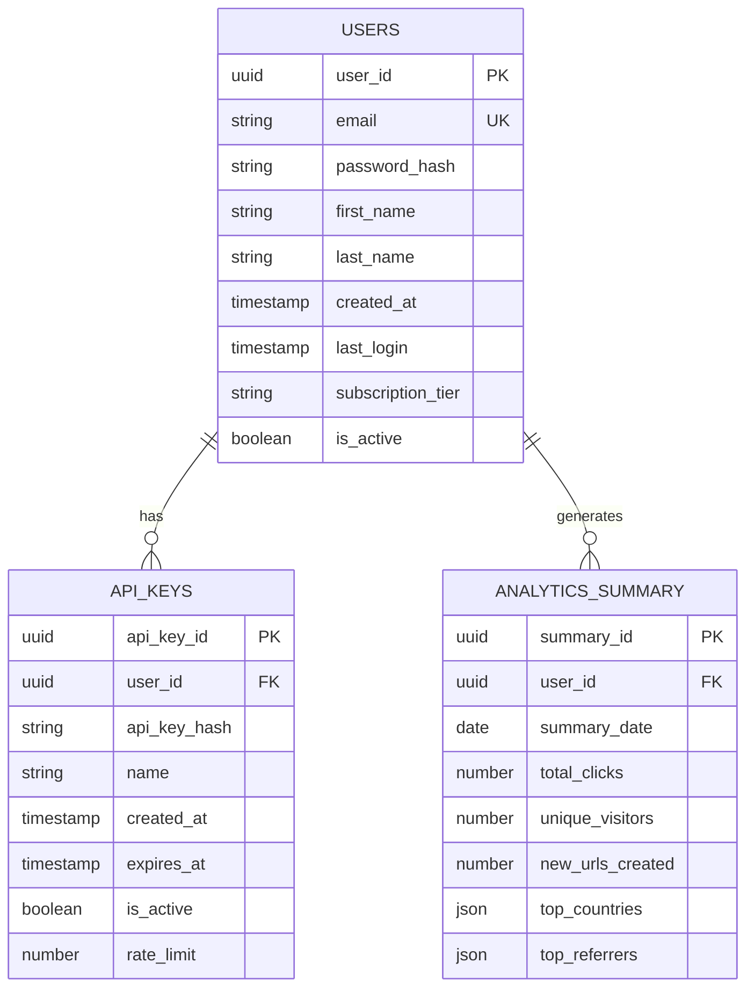

## 5. Detailed Component Design

### 5.1 URL Shortener Service

**Purpose & Responsibilities:**
- Generate unique short codes for URLs
- Validate and sanitize input URLs
- Handle custom alias requests
- Manage URL metadata and expiration
- Rate limiting and user quota enforcement

**AWS Service Selection:**
- **ECS Fargate**: Serverless containers for auto-scaling without infrastructure management
- **Application Load Balancer**: Health checks and traffic distribution
- **DynamoDB**: Single-digit millisecond latency for URL storage

**Scaling Characteristics:**
- Horizontal scaling based on CPU and request metrics
- Auto-scaling target: 70% CPU utilization
- Scale out: +2 tasks per scaling event
- Scale in: -1 task per scaling event (conservative)

**Failure Modes & Recovery:**
- Service failure: ALB health checks redirect to healthy instances
- Database failure: DynamoDB auto-failover to secondary regions
- Code generation failure: Fallback to timestamp-based generation

### 5.2 Redirection Service

**Purpose & Responsibilities:**
- High-performance URL lookups
- HTTP redirect responses (301/302)
- Analytics event generation
- Cache management and warming

**Performance Considerations:**
- Read-optimized with Redis caching (99% cache hit rate target)
- Connection pooling for database connections
- Async analytics event publishing
- CDN integration for geographic distribution

### 5.3 Analytics Service

**Purpose & Responsibilities:**
- Real-time event processing from Kinesis streams
- Aggregation and summarization of click data
- Geographic and demographic analysis
- Report generation and data export

**Scaling Characteristics:**
- Lambda auto-scaling for stream processing
- Kinesis shard scaling based on throughput
- Aurora read replicas for analytics queries

### Critical User Journey Sequence Diagrams

#### URL Shortening Flow
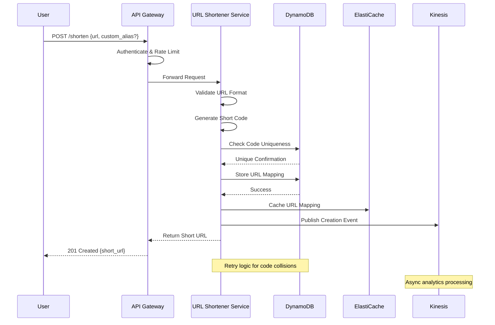

#### URL Redirection Flow
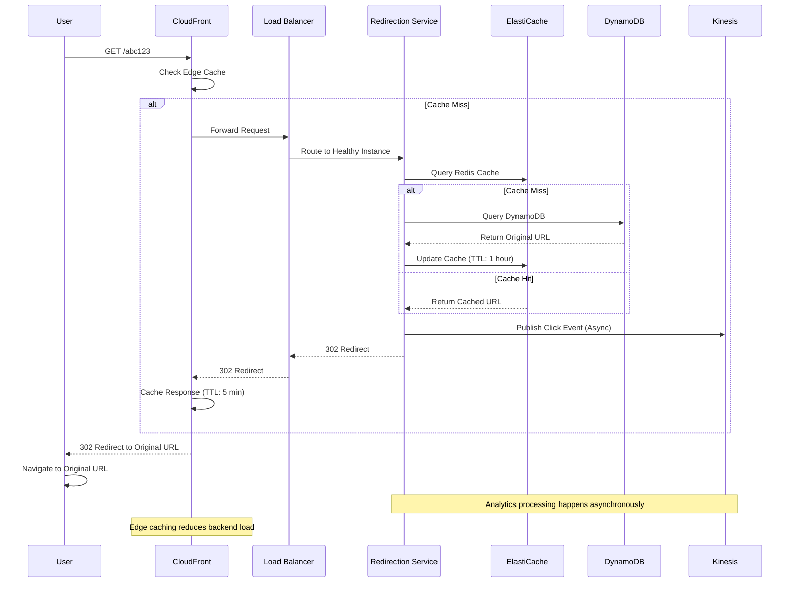

## 6. Scalability & Performance

### 6.1 Scaling Architecture

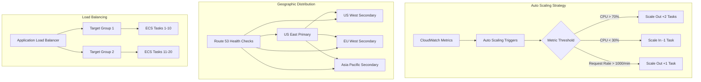

### 6.2 Performance Optimization

**Caching Strategy:**
- **L1 Cache (CloudFront)**: 5-minute TTL for redirections, 1-hour for static assets
- **L2 Cache (ElastiCache)**: 1-hour TTL for URL mappings, LRU eviction
- **L3 Cache (Application)**: In-memory cache for frequently accessed data

**CDN Configuration:**
- **Origin Shield**: Enabled in primary regions to reduce origin load
- **Compression**: Gzip/Brotli compression for API responses
- **HTTP/2**: Enabled for improved connection efficiency

**Database Optimization:**
- **DynamoDB**: On-demand billing with burst capacity
- **Read Replicas**: Aurora read replicas in each region
- **Connection Pooling**: Managed connection pools with circuit breakers

## 7. Reliability & Fault Tolerance

### 7.1 High Availability Design

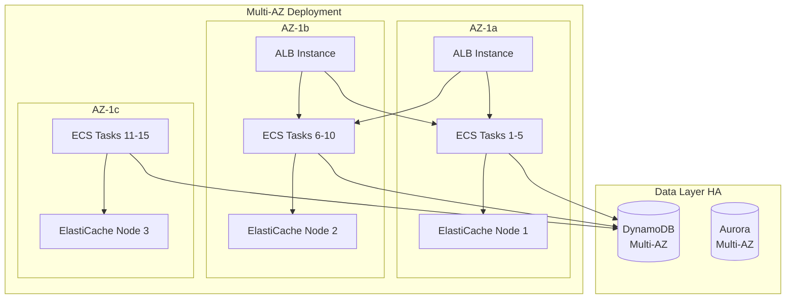

**Circuit Breaker Patterns:**
- **Database Circuit Breaker**: 50% error rate threshold, 30-second timeout
- **Cache Circuit Breaker**: Fallback to database on cache failures
- **External API Circuit Breaker**: Graceful degradation for non-critical services

### 7.2 Disaster Recovery

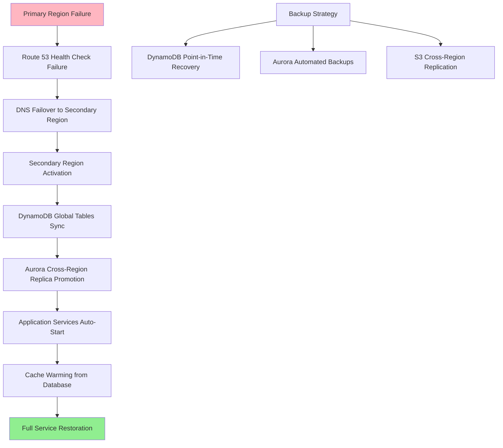

**RTO/RPO Targets:**
- **RTO (Recovery Time Objective)**: 15 minutes
- **RPO (Recovery Point Objective)**: 1 minute
- **Backup Retention**: 35 days for DynamoDB, 7 days for Aurora
- **Cross-Region Replication**: Real-time for DynamoDB Global Tables

## 8. Security Architecture

### 8.1 Security Layers

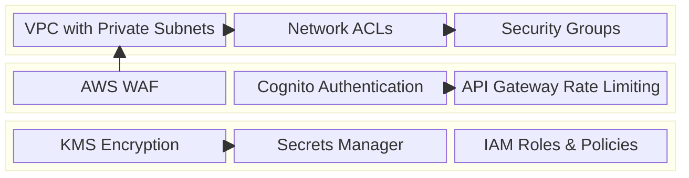

**Network Security:**
- **VPC**: Isolated network with private subnets for application tier
- **Security Groups**: Least privilege access (port 443/80 only from ALB)
- **NACLs**: Additional subnet-level protection
- **NAT Gateway**: Secure outbound internet access for private subnets

**Application Security:**
- **WAF Rules**: SQL injection, XSS, and rate limiting protection
- **API Authentication**: JWT tokens with Cognito integration
- **Rate Limiting**: 1000 requests/hour per user, 10 requests/second burst

**Data Security:**
- **Encryption at Rest**: KMS encryption for DynamoDB, Aurora, S3
- **Encryption in Transit**: TLS 1.3 for all communications
- **Key Rotation**: Automatic 90-day rotation for encryption keys

### 8.2 Authentication & Authorization Flow

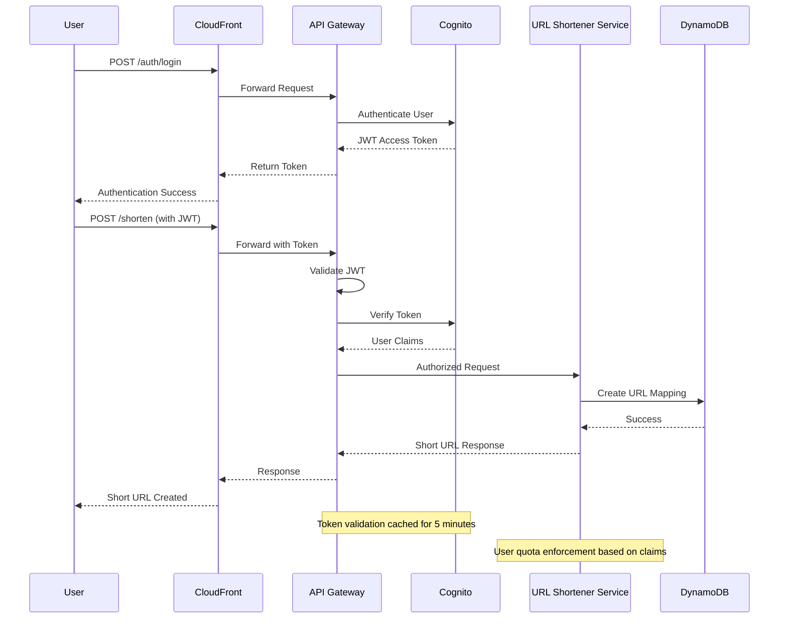

## 9. Monitoring & Observability

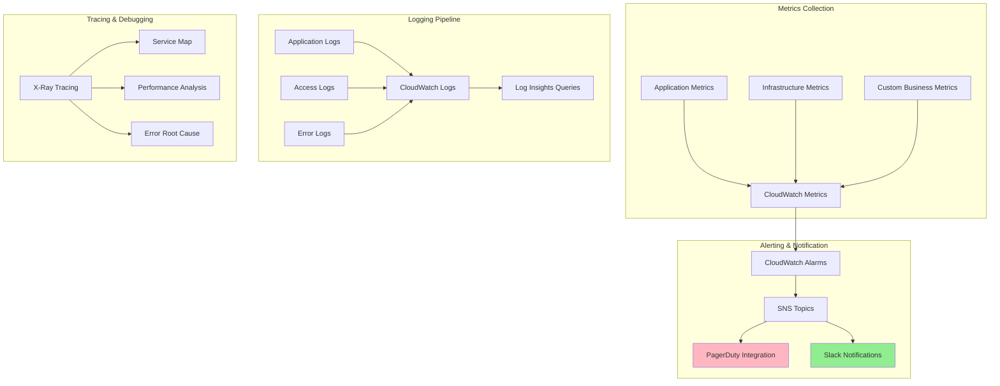

**Key Metrics Monitored:**
- **Application**: Request latency, error rate, throughput
- **Infrastructure**: CPU, memory, disk utilization
- **Business**: URLs created/hour, click-through rates, user engagement
- **Security**: Failed authentication attempts, suspicious IP patterns

**Alerting Thresholds:**
- **Critical**: >5% error rate, >1000ms average latency, service unavailability
- **Warning**: >2% error rate, >500ms average latency, >80% resource utilization
- **Info**: Unusual traffic patterns, quota approaching limits

## 10. Cost Optimization

**Service-Level Cost Analysis:**
- **DynamoDB**: $800/month (on-demand, 100M reads, 10M writes)
- **ECS Fargate**: $1,200/month (10 tasks, 2 vCPU, 4GB RAM each)
- **ElastiCache**: $400/month (3 cache.r6g.large nodes)
- **CloudFront**: $300/month (1TB data transfer, 10M requests)
- **Aurora**: $600/month (2 instances, 1TB storage)
- **Total Estimated**: ~$3,300/month

**Cost Optimization Strategies:**
- **Reserved Capacity**: 40% savings on predictable workloads
- **Spot Instances**: Use for non-critical batch processing
- **S3 Intelligent Tiering**: Automatic cost optimization for analytics data
- **DynamoDB On-Demand**: Pay-per-request pricing for variable workloads

**Cost Monitoring:**
- **Budget Alerts**: 80% and 100% of monthly budget
- **Cost Anomaly Detection**: Unusual spending pattern alerts
- **Resource Optimization**: Weekly reviews of underutilized resources

## 11. Implementation Strategy

### 11.1 Migration/Deployment Plan

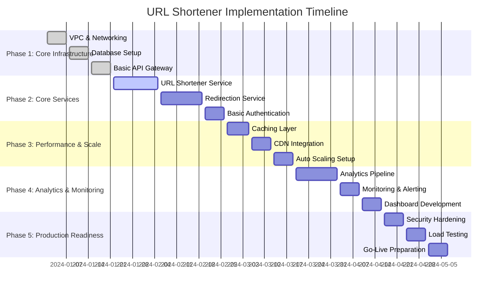

### 11.2 Technology Decisions & Trade-offs

**Database Selection Rationale:**
- **DynamoDB vs RDS**: Chose DynamoDB for URL mappings due to predictable access patterns and need for single-digit millisecond latency
- **Aurora for Analytics**: ACID compliance needed for financial and user data
- **ElastiCache Redis**: Superior performance over Memcached for complex data structures

**Service Architecture Trade-offs:**
- **Microservices vs Monolith**: Microservices chosen for independent scaling, despite increased operational complexity
- **Serverless vs Containers**: ECS Fargate for predictable workloads, Lambda for event processing
- **Synchronous vs Asynchronous**: Async analytics processing to maintain low latency for core operations

**Future Evolution Path:**
- **GraphQL API**: Consider for complex client requirements
- **Machine Learning**: Fraud detection and URL classification
- **Blockchain Integration**: Decentralized URL verification
- **Edge Computing**: Lambda@Edge for ultra-low latency redirections

**Technical Debt & Improvement Areas:**
- **Code Generation Algorithm**: Move from random to more sophisticated base62 encoding
- **Database Sharding**: Implement when DynamoDB limits are approached
- **Multi-Region Active-Active**: Currently active-passive setup
- **Advanced Analytics**: Real-time fraud detection and bot filtering
