# Social Media Feed System Design Architecture

## 1. Executive Summary & Requirements

### System Overview
A personalized social media feed system that generates and delivers customized news feeds to users based on their social connections, interests, and engagement patterns. The system handles billions of posts and serves millions of concurrent users with real-time updates.

### Functional Requirements
- **Feed Generation**: Create personalized feeds based on friends, pages, and interests
- **Post Publishing**: Allow users to create posts with text, images, videos, and links
- **Real-time Updates**: Instant feed updates when new content is available
- **Engagement**: Support likes, comments, shares, and reactions
- **Content Filtering**: Spam detection, inappropriate content filtering
- **Trending Topics**: Identify and promote viral content
- **User Interactions**: Follow/unfollow, friend requests, blocking
- **Content Search**: Search posts, users, and hashtags

### Non-Functional Requirements
- **Availability**: 99.99% uptime
- **Latency**: <200ms for feed loading, <100ms for interactions
- **Scale**: 1B+ users, 100M+ posts per day, 10K+ posts per second peak
- **Storage**: Unlimited post retention with intelligent archiving
- **Throughput**: 500K feed requests per second, 50K writes per second
- **Consistency**: Eventual consistency for feeds, strong consistency for user data

### Key Constraints
- Real-time feed updates without overwhelming users
- Personalization without compromising privacy
- Global content distribution with local relevance
- Scalable to handle viral content spikes

### Success Metrics
- 99.99% availability SLA
- Average feed load time <150ms
- 95% user engagement with personalized content
- <1% spam content in feeds
- Support 10B+ posts in total system storage

## 2. High-Level Architecture Overview

```mermaid
C4Context
    title Social Media Feed System Context

    Person(user, "Social Media User", "Creates content and consumes feeds")
    Person(content_creator, "Content Creator", "Publishes content to large audiences")
    Person(advertiser, "Advertiser", "Creates sponsored content")
    Person(moderator, "Content Moderator", "Reviews and moderates content")

    System_Boundary(feed_system, "Social Media Feed System") {
        System(feed_gen, "Feed Generation", "Creates personalized feeds")
        System(content_mgmt, "Content Management", "Handles post creation and storage")
        System(social_graph, "Social Graph", "Manages user relationships")
        System(engagement, "Engagement System", "Handles likes, comments, shares")
        System(recommendation, "Recommendation Engine", "Content and user recommendations")
    }

    System_Ext(cdn, "CloudFront CDN", "Global content delivery")
    System_Ext(ml_services, "ML Services", "Content classification and recommendation")
    System_Ext(notification, "Notification System", "Push notifications and alerts")
    System_Ext(analytics, "Analytics Platform", "User behavior and content analytics")

    Rel(user, feed_gen, "Views personalized feed", "HTTPS")
    Rel(content_creator, content_mgmt, "Creates posts", "HTTPS API")
    Rel(advertiser, content_mgmt, "Creates sponsored content", "HTTPS API")
    Rel(moderator, content_mgmt, "Moderates content", "Admin Interface")
    
    Rel(feed_gen, social_graph, "Fetches user connections", "gRPC")
    Rel(feed_gen, recommendation, "Gets content recommendations", "gRPC")
    Rel(engagement, notification, "Triggers notifications", "Event Stream")
    Rel(content_mgmt, ml_services, "Content analysis", "API")
    Rel(feed_system, analytics, "Usage metrics", "Event Stream")
```

**Architectural Style Rationale**: Event-driven microservices architecture chosen for:
- Independent scaling of different system components (feed generation vs content storage)
- Real-time event processing for immediate feed updates
- Technology diversity optimized for specific use cases
- Fault isolation and graceful degradation
- Support for A/B testing and feature rollouts

## 3. Detailed System Architecture

### 3.1 AWS Service Stack Selection

**Presentation Layer:**
- **CloudFront**: Global CDN for media content and API responses
- **API Gateway**: RESTful and WebSocket APIs with rate limiting
- **Route 53**: DNS with geographic routing and health checks

**Application Layer:**
- **EKS**: Kubernetes for microservices orchestration and auto-scaling
- **Application Load Balancer**: Layer 7 load balancing with content-based routing
- **Lambda**: Serverless functions for event processing and ML inference

**Data Layer:**
- **DynamoDB**: User profiles, social graph, and feed metadata
- **Aurora PostgreSQL**: Posts, comments, and relational data
- **ElastiCache Redis**: Feed caching and session management
- **OpenSearch**: Full-text search for posts and users

**Storage Layer:**
- **S3**: Media storage (images, videos) with lifecycle policies
- **EFS**: Shared storage for ML models and temporary processing

**Streaming/Messaging:**
- **MSK (Managed Kafka)**: Event streaming for feed updates and analytics
- **Kinesis Data Streams**: Real-time data ingestion and processing
- **SQS**: Asynchronous task processing queues
- **SNS**: Fan-out notifications and alerts

**Analytics:**
- **Kinesis Analytics**: Real-time stream processing and aggregations
- **EMR**: Large-scale data processing and ML training
- **Glue**: ETL jobs and data catalog management
- **QuickSight**: Business intelligence dashboards

**Security:**
- **Cognito**: User authentication and social login integration
- **WAF**: Web application firewall with custom rules
- **KMS**: Encryption key management
- **Secrets Manager**: Database credentials and API keys

**Monitoring:**
- **CloudWatch**: Comprehensive monitoring and alerting
- **X-Ray**: Distributed tracing and performance analysis
- **CloudTrail**: Security audit logging

### 3.2 Component Architecture Diagram

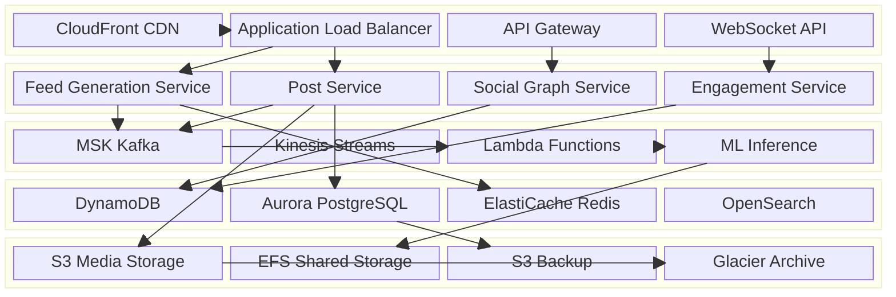

## 4. Data Architecture & Flow

### 4.1 Data Flow Diagrams

#### Feed Generation Flow
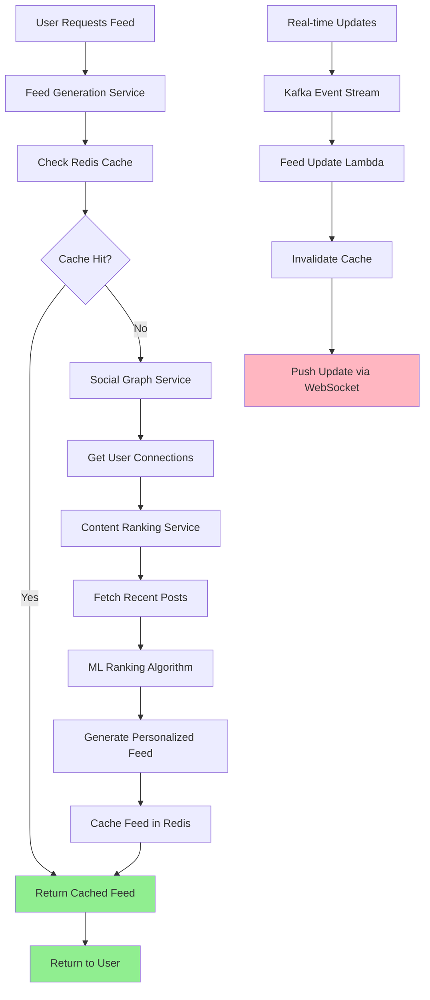

#### Post Publishing Flow
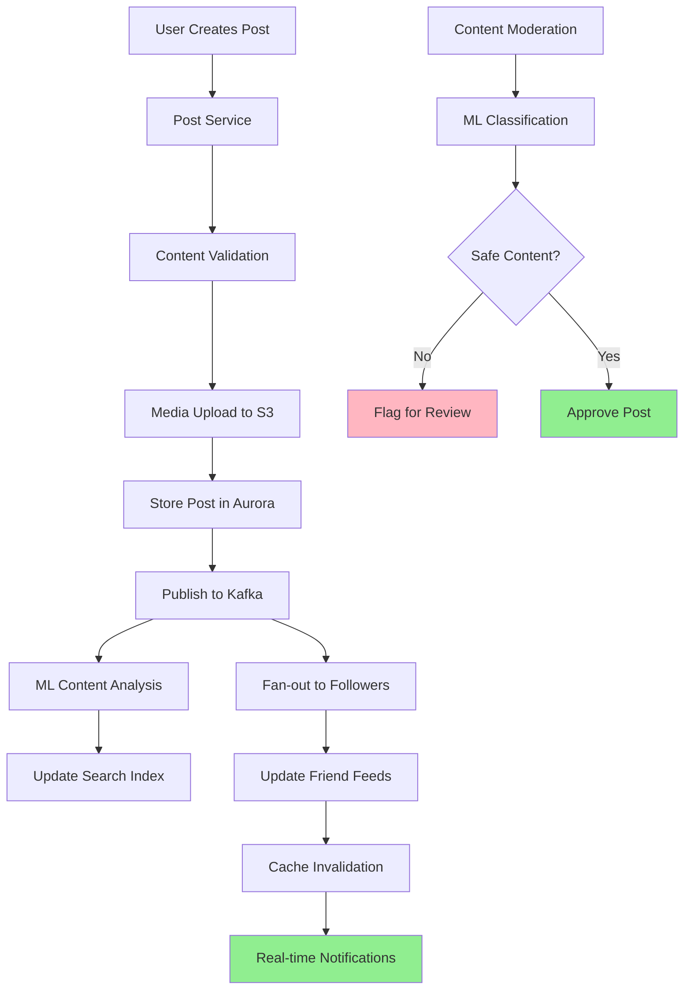

#### Real-time Engagement Processing
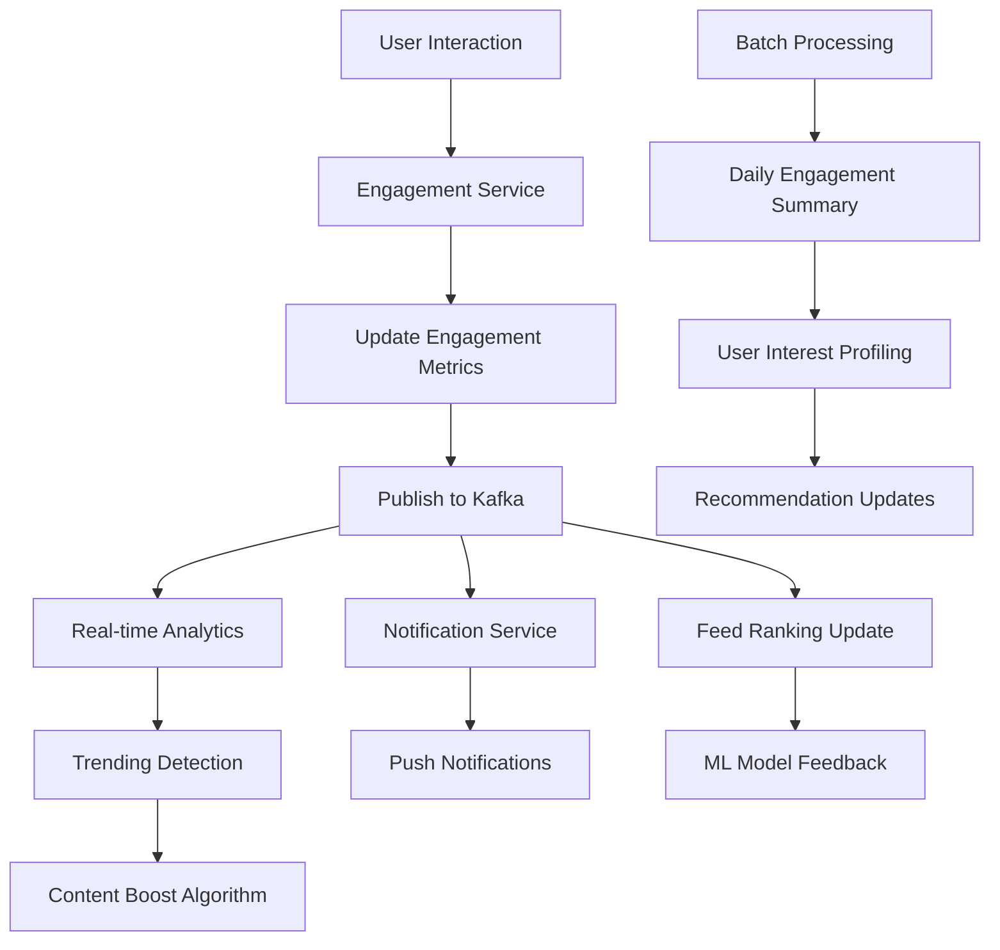

### 4.2 Database Design

#### Social Graph (DynamoDB)
```mermaid
erDiagram
    USER_PROFILE {
        string user_id PK
        string username
        string display_name
        string email
        string profile_image_url
        timestamp created_at
        timestamp last_active
        json preferences
        number follower_count
        number following_count
    }
    
    USER_CONNECTIONS {
        string user_id PK
        string connection_id SK
        string connection_type
        timestamp created_at
        string status
    }
    
    FEED_METADATA {
        string user_id PK
        timestamp last_updated
        number feed_version
        json feed_preferences
        string feed_algorithm
    }
    
    USER_PROFILE ||--o{ USER_CONNECTIONS : "has connections"
    USER_PROFILE ||--|| FEED_METADATA : "has feed settings"
```

#### Content Management (Aurora PostgreSQL)
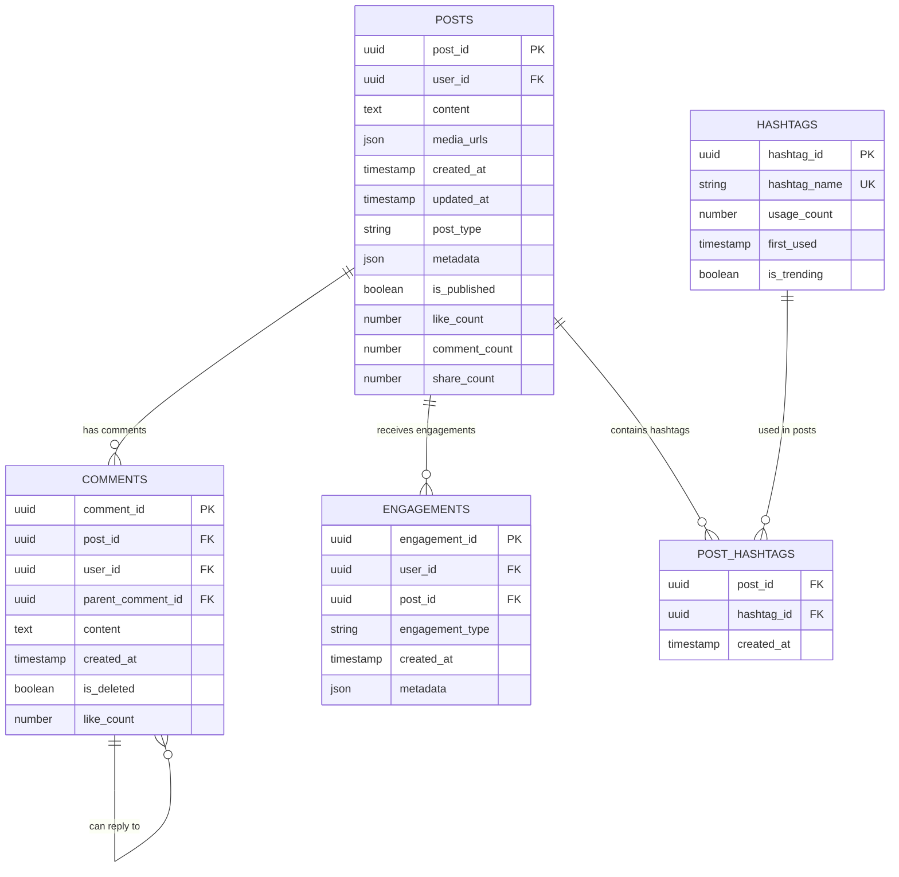

## 5. Detailed Component Design

### 5.1 Feed Generation Service

**Purpose & Responsibilities:**
- Generate personalized feeds based on user preferences and social graph
- Implement multiple feed algorithms (chronological, algorithmic, interest-based)
- Cache generated feeds for performance optimization
- Handle real-time feed updates and invalidation

**AWS Service Selection:**
- **EKS**: Kubernetes for horizontal scaling and resource management
- **ElastiCache Redis**: Sub-millisecond feed caching with TTL management
- **DynamoDB**: Fast access to user preferences and social connections

**Scaling Characteristics:**
- Horizontal Pod Autoscaler based on CPU (target: 70%) and custom metrics
- Cluster Autoscaler for node scaling during traffic spikes
- Redis cluster mode for distributed caching across availability zones

**Failure Modes & Recovery:**
- Service failure: Kubernetes automatic pod restart and load balancing
- Cache failure: Graceful degradation to database queries with circuit breaker
- Algorithm failure: Fallback to chronological feed ordering

### 5.2 Content Management Service

**Purpose & Responsibilities:**
- Handle post creation, editing, and deletion
- Media upload and processing coordination
- Content moderation and safety checks
- Post metadata management and versioning

**Performance Considerations:**
- Async media processing to reduce post creation latency
- Connection pooling for database operations
- Batch operations for bulk content updates
- CDN integration for media delivery

### 5.3 Social Graph Service

**Purpose & Responsibilities:**
- Manage user relationships (friends, followers, blocked users)
- Provide fast lookups for feed generation
- Handle relationship changes and propagation
- Privacy settings enforcement

**Scaling Characteristics:**
- Read-heavy workload optimized with DynamoDB read replicas
- Graph traversal algorithms optimized for social network patterns
- Caching of frequently accessed relationship data

### Critical User Journey Sequence Diagrams

#### Feed Loading Flow
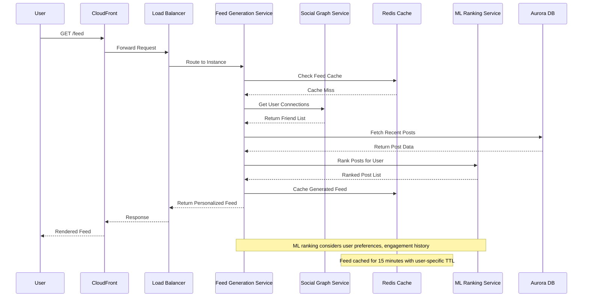

#### Post Creation Flow
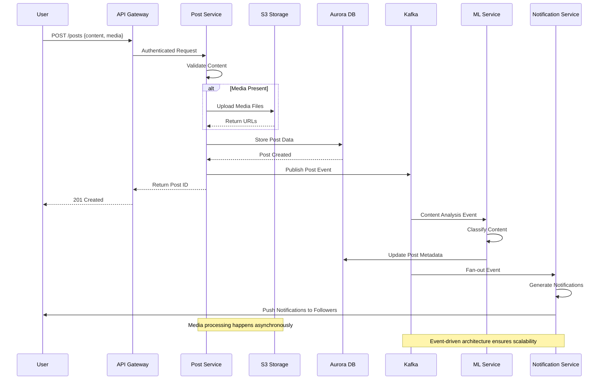

## 6. Scalability & Performance

### 6.1 Scaling Architecture

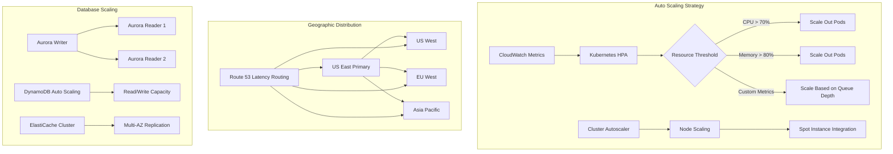

### 6.2 Performance Optimization

**Caching Strategy:**
- **L1 (CloudFront)**: 1-hour TTL for media, 5-minute for API responses
- **L2 (ElastiCache)**: 15-minute TTL for feeds, 1-hour for user data
- **L3 (Application)**: In-memory caching for frequently accessed data
- **Database Query Cache**: Aurora query result caching enabled

**Content Delivery Optimization:**
- **Image Processing**: Multiple resolutions and formats (WebP, AVIF)
- **Video Streaming**: Adaptive bitrate streaming with HLS/DASH
- **Lazy Loading**: Progressive content loading for better perceived performance
- **Prefetching**: Predictive content loading based on user behavior

**Database Optimization:**
- **Read Replicas**: Geographically distributed for reduced latency
- **Partitioning**: Time-based partitioning for posts table
- **Indexing**: Optimized indexes for common query patterns
- **Connection Pooling**: PgBouncer for PostgreSQL connection management

## 7. Reliability & Fault Tolerance

### 7.1 High Availability Design

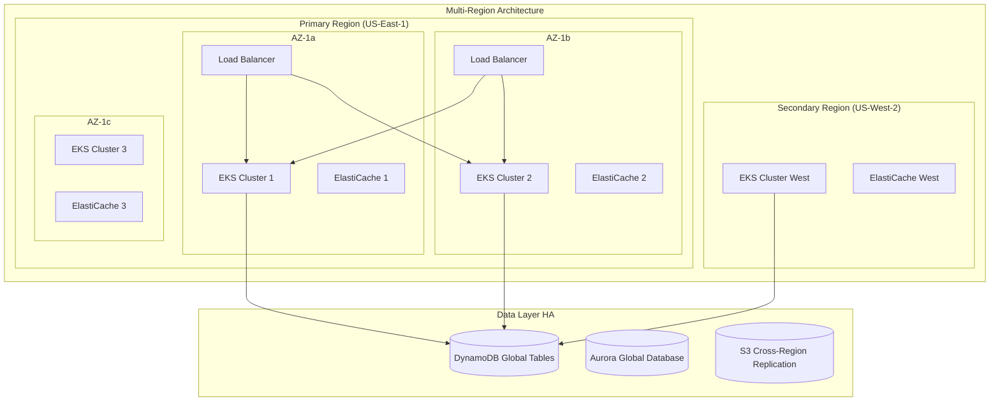

**Circuit Breaker Patterns:**
- **Database Circuit Breaker**: 30% error rate threshold, 60-second timeout
- **ML Service Circuit Breaker**: Fallback to rule-based ranking
- **External API Circuit Breaker**: Graceful degradation for non-critical features

### 7.2 Disaster Recovery

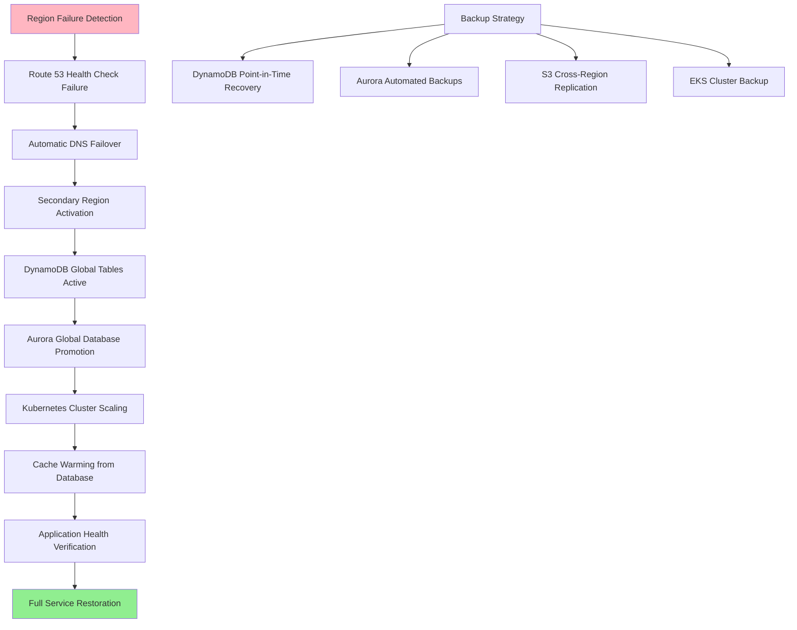

**RTO/RPO Targets:**
- **RTO (Recovery Time Objective)**: 10 minutes
- **RPO (Recovery Point Objective)**: 30 seconds
- **Backup Retention**: 30 days for databases, 90 days for media content
- **Cross-Region Replication**: Real-time for critical data, eventual consistency for feeds

## 8. Security Architecture

### 8.1 Security Layers

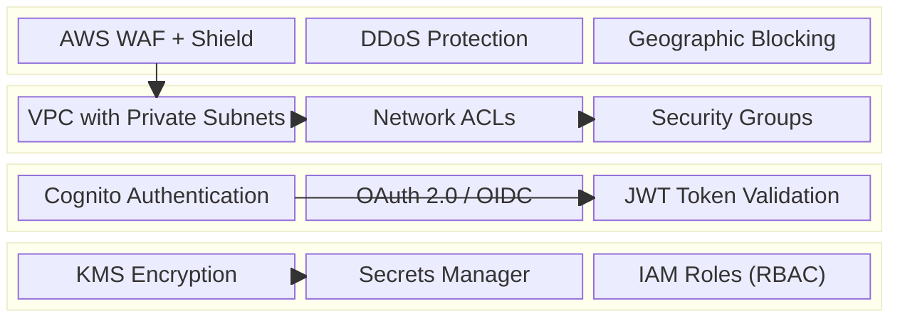

**Content Security:**
- **Content Moderation**: ML-based automated screening + human review
- **Spam Detection**: Real-time pattern analysis and user behavior monitoring
- **Privacy Controls**: Granular post visibility and user blocking features
- **Data Encryption**: End-to-end encryption for private messages

**API Security:**
- **Rate Limiting**: User-based and IP-based rate limiting
- **Input Validation**: Comprehensive input sanitization and validation
- **CORS Policy**: Strict cross-origin resource sharing policies
- **API Versioning**: Backward compatibility and secure deprecation

### 8.2 Authentication & Authorization Flow

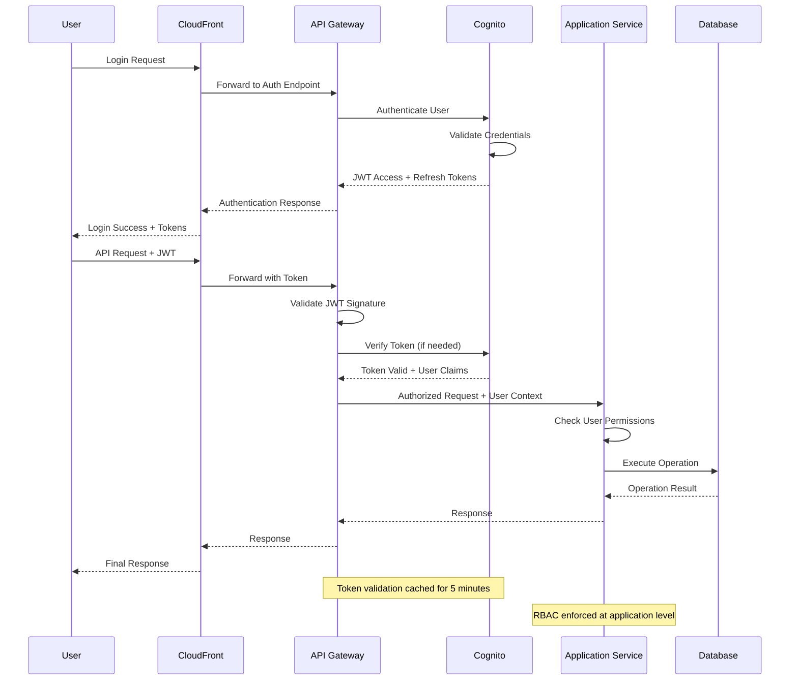

## 9. Monitoring & Observability

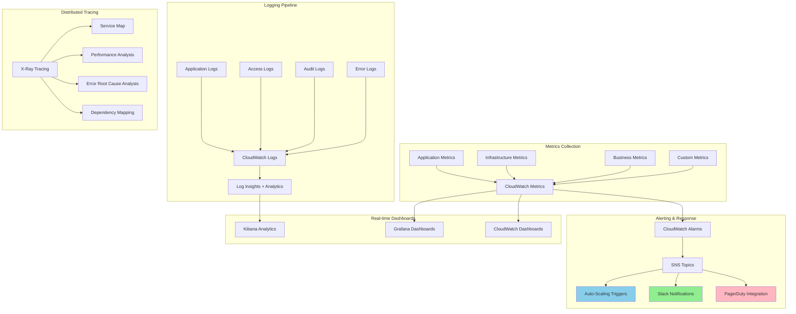

**Key Performance Indicators:**
- **User Experience**: Feed load time, engagement rate, session duration
- **System Performance**: API response time, error rate, throughput
- **Business Metrics**: Daily active users, post creation rate, viral content detection
- **Infrastructure**: Resource utilization, cost per user, scaling efficiency

**Alerting Strategy:**
- **Critical**: Service unavailability, >5% error rate, security breaches
- **Warning**: High latency (>500ms), resource utilization >85%, unusual traffic patterns
- **Info**: New feature rollout metrics, A/B test results, capacity planning alerts

## 10. Cost Optimization

**Service-Level Cost Analysis:**
- **EKS**: $2,500/month (50 nodes, mixed instance types with Spot)
- **DynamoDB**: $1,800/month (on-demand, 1B reads, 100M writes)
- **Aurora**: $1,200/month (multi-AZ, 2TB storage, read replicas)
- **ElastiCache**: $800/month (Redis cluster, 6 nodes)
- **S3**: $1,500/month (media storage, 10TB with intelligent tiering)
- **CloudFront**: $600/month (global distribution, 5TB transfer)
- **MSK**: $900/month (3-node Kafka cluster)
- **Total Estimated**: ~$9,300/month for 1M active users

**Cost Optimization Strategies:**
- **Spot Instances**: 60% cost reduction for batch processing workloads
- **Reserved Instances**: 40% savings on predictable compute workloads
- **S3 Intelligent Tiering**: Automatic cost optimization for media storage
- **DynamoDB On-Demand**: Pay-per-request for variable workloads
- **Resource Right-Sizing**: Continuous optimization based on utilization metrics

**Cost Monitoring & Control:**
- **Budget Alerts**: Multi-level alerts at 50%, 80%, and 100% of budget
- **Cost Anomaly Detection**: ML-based unusual spending pattern detection
- **Resource Tagging**: Comprehensive cost allocation and chargeback
- **Regular Reviews**: Weekly cost optimization reviews and recommendations

## 11. Implementation Strategy

### 11.1 Migration/Deployment Plan

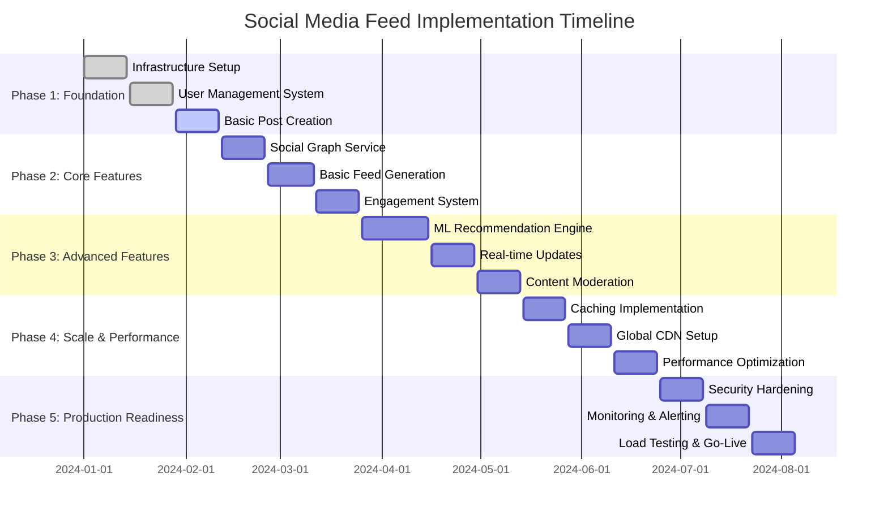

### 11.2 Technology Decisions & Trade-offs

**Database Architecture Decisions:**
- **DynamoDB for Social Graph**: Chosen for predictable performance and infinite scaling
- **Aurora for Content**: ACID compliance needed for posts and financial transactions
- **ElastiCache for Performance**: Redis chosen over Memcached for advanced data structures
- **OpenSearch for Discovery**: Full-text search capabilities for content discovery

**Processing Architecture Trade-offs:**
- **Event-Driven vs Request-Response**: Event-driven chosen for real-time updates and scalability
- **Microservices vs Monolith**: Microservices for team autonomy and independent scaling
- **Kubernetes vs Serverless**: Kubernetes for long-running services, Lambda for event processing
- **Synchronous vs Asynchronous**: Async processing for non-critical path operations

**Future Evolution Path:**
- **AI/ML Enhancement**: Advanced content understanding and personalization
- **Blockchain Integration**: Decentralized content verification and creator monetization
- **AR/VR Support**: Immersive content creation and consumption
- **Edge Computing**: Ultra-low latency with Lambda@Edge and IoT integration

**Technical Debt & Improvement Areas:**
- **Feed Algorithm Sophistication**: Move from simple ranking to deep learning models
- **Global Consistency**: Implement stronger consistency guarantees across regions
- **Advanced Analytics**: Real-time user behavior analysis and predictive modeling
- **Content Creator Tools**: Enhanced publishing tools and monetization features
