# Chat System Design Architecture

## 1. Executive Summary & Requirements

### System Overview
A real-time messaging system supporting one-on-one and group conversations with message delivery guarantees, media sharing, and cross-platform synchronization. The system handles billions of messages daily with sub-second delivery times and 99.99% availability.

### Functional Requirements
- **Real-time Messaging**: Instant message delivery with typing indicators and read receipts
- **Group Chats**: Support for group conversations up to 1000 participants
- **Media Sharing**: Images, videos, documents, and voice messages
- **Message History**: Persistent message storage with search capabilities
- **Cross-platform Sync**: Seamless synchronization across mobile and web clients
- **User Presence**: Online/offline status and last seen timestamps
- **Message Encryption**: End-to-end encryption for private conversations
- **Push Notifications**: Offline message notifications across platforms

### Non-Functional Requirements
- **Availability**: 99.99% uptime with global distribution
- **Latency**: <100ms message delivery, <50ms typing indicators
- **Scale**: 1B+ users, 10B+ messages per day, 1M+ concurrent connections
- **Storage**: 7-year message retention with intelligent archiving
- **Throughput**: 500K messages per second peak, 50M concurrent users
- **Consistency**: Strong consistency for message ordering, eventual consistency for presence

### Key Constraints
- Message ordering must be preserved within conversations
- End-to-end encryption without compromising performance
- Global message delivery with minimal latency
- Offline message queuing and delivery

### Success Metrics
- 99.99% message delivery success rate
- <100ms average message latency globally
- 99.9% client uptime and connection stability
- <1% message duplication rate
- Support 100M+ concurrent WebSocket connections

## 2. High-Level Architecture Overview

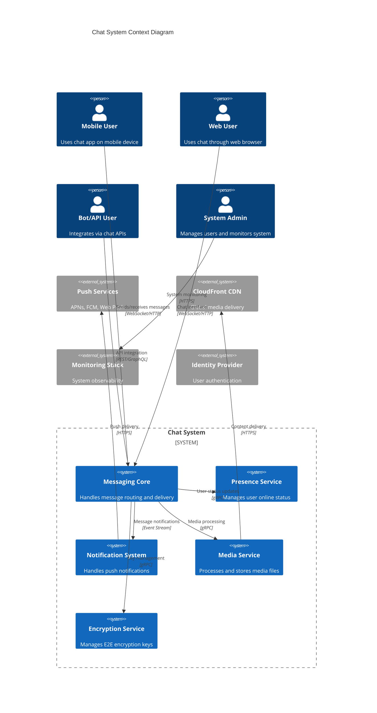

**Architectural Style Rationale**: Event-driven microservices with WebSocket-based real-time communication chosen for:
- Real-time bidirectional communication requirements
- Independent scaling of message processing vs media handling
- Technology specialization for different service concerns
- Fault isolation and graceful degradation capabilities
- Global distribution with regional failover support

## 3. Detailed System Architecture

### 3.1 AWS Service Stack Selection

**Presentation Layer:**
- **CloudFront**: Global CDN for media content and WebSocket connection termination
- **API Gateway**: WebSocket API management with connection routing
- **Route 53**: DNS with health checks and geographic routing

**Application Layer:**
- **EKS**: Kubernetes orchestration for microservices with auto-scaling
- **Application Load Balancer**: Layer 7 load balancing with sticky sessions
- **Lambda**: Serverless functions for event processing and notifications

**Data Layer:**
- **DynamoDB**: Message storage with strong consistency and global tables
- **Aurora PostgreSQL**: User profiles, chat metadata, and relationships
- **ElastiCache Redis**: Connection management and presence caching
- **OpenSearch**: Message search and analytics

**Storage Layer:**
- **S3**: Media file storage with lifecycle management
- **EFS**: Shared storage for temporary file processing

**Streaming/Messaging:**
- **MSK (Managed Kafka)**: Message event streaming and fan-out
- **Kinesis Data Streams**: Real-time analytics and monitoring
- **SQS**: Offline message queuing and retry mechanisms
- **SNS**: Push notification fan-out to multiple providers

**Security:**
- **Cognito**: User authentication with social login support
- **KMS**: Encryption key management for E2E encryption
- **WAF**: WebSocket and API protection
- **Secrets Manager**: Service credentials and API keys

**Monitoring:**
- **CloudWatch**: Comprehensive metrics and logging
- **X-Ray**: Distributed tracing for message flows
- **CloudTrail**: Security and compliance auditing

### 3.2 Component Architecture Diagram

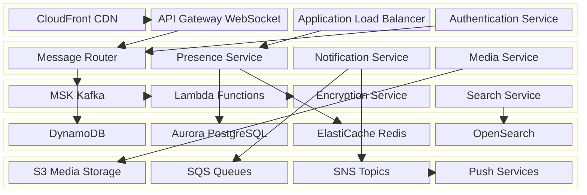

## 4. Data Architecture & Flow

### 4.1 Data Flow Diagrams

#### Real-time Message Flow
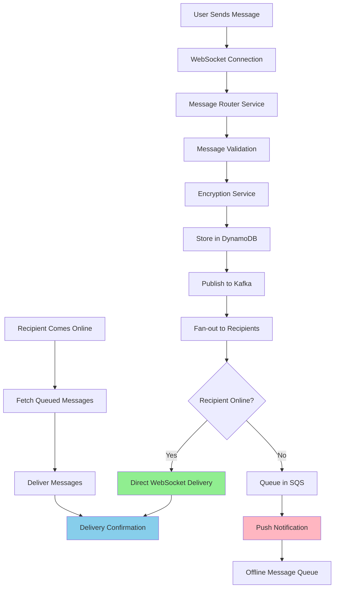

#### Group Message Distribution
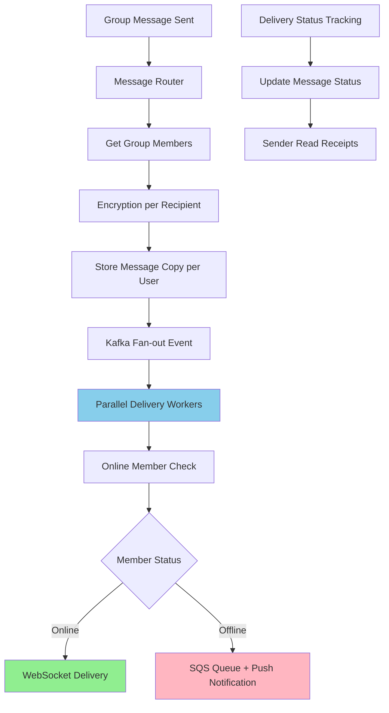

#### Media Upload and Sharing Flow
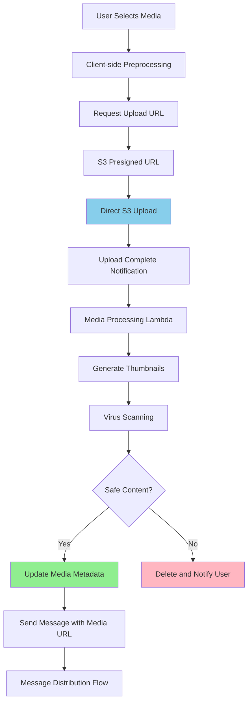

### 4.2 Database Design

#### Message Storage (DynamoDB)
```mermaid
erDiagram
    MESSAGES {
        string conversation_id PK
        string message_id SK
        string sender_id
        string message_type
        text content
        json media_urls
        timestamp created_at
        string encryption_key_id
        json delivery_status
        boolean is_deleted
    }
    
    CONVERSATIONS {
        string conversation_id PK
        string conversation_type
        json participants
        string last_message_id
        timestamp last_activity
        json metadata
        boolean is_archived
    }
    
    USER_CONVERSATIONS {
        string user_id PK
        string conversation_id SK
        timestamp joined_at
        timestamp last_read_at
        string role
        boolean notifications_enabled
        json preferences
    }
    
    CONVERSATION_MEMBERS {
        string conversation_id PK
        string user_id SK
        timestamp added_at
        string added_by
        string status
        json permissions
    }
    
    MESSAGES ||--|| CONVERSATIONS : "belongs to"
    CONVERSATIONS ||--o{ USER_CONVERSATIONS : "has participants"
    CONVERSATIONS ||--o{ CONVERSATION_MEMBERS : "contains members"
```

#### User Management (Aurora PostgreSQL)
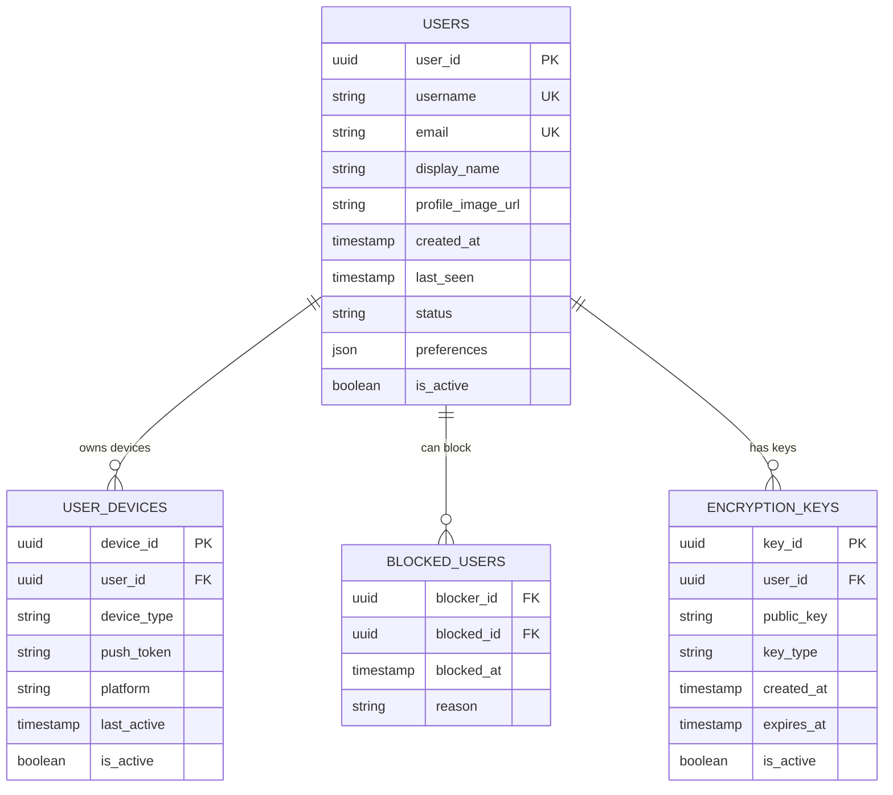

## 5. Detailed Component Design

### 5.1 Message Router Service

**Purpose & Responsibilities:**
- Route messages between users and groups efficiently
- Maintain WebSocket connections and connection state
- Handle message ordering and delivery guarantees
- Implement backpressure and rate limiting

**AWS Service Selection:**
- **EKS with HPA**: Horizontal scaling based on connection count and message throughput
- **ElastiCache Redis**: Connection registry and session management
- **DynamoDB**: Message persistence with strong consistency

**Scaling Characteristics:**
- WebSocket connection affinity with consistent hashing
- Auto-scaling based on active connections (target: 10K connections per pod)
- Connection draining during pod restarts
- Circuit breakers for downstream service protection

**Failure Modes & Recovery:**
- Connection failure: Automatic reconnection with exponential backoff
- Service failure: Load balancer health checks and pod replacement
- Message loss prevention: At-least-once delivery with deduplication

### 5.2 Presence Service

**Purpose & Responsibilities:**
- Track user online/offline status in real-time
- Manage typing indicators and activity status
- Handle presence updates across multiple devices
- Provide presence information for UI updates

**Performance Considerations:**
- Redis pub/sub for real-time presence broadcasting
- Debounced presence updates to reduce system load
- Presence information caching with TTL
- Batch presence updates for efficiency

### 5.3 Notification Service

**Purpose & Responsibilities:**
- Send push notifications for offline users
- Handle notification preferences and scheduling
- Integrate with multiple push service providers
- Track notification delivery and engagement

**Scaling Characteristics:**
- Lambda-based processing for automatic scaling
- SQS for reliable notification queuing
- SNS for fan-out to multiple push providers
- Dead letter queues for failed deliveries

### Critical User Journey Sequence Diagrams

#### Message Send and Delivery
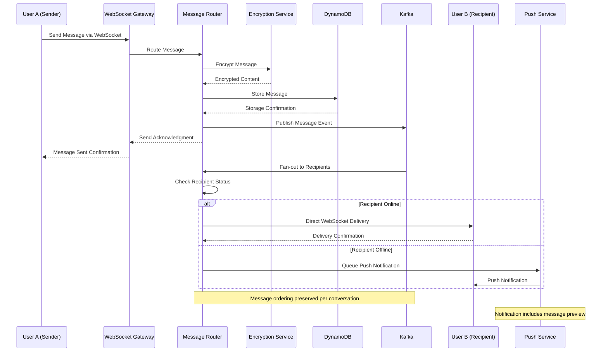

#### Group Chat Message Flow
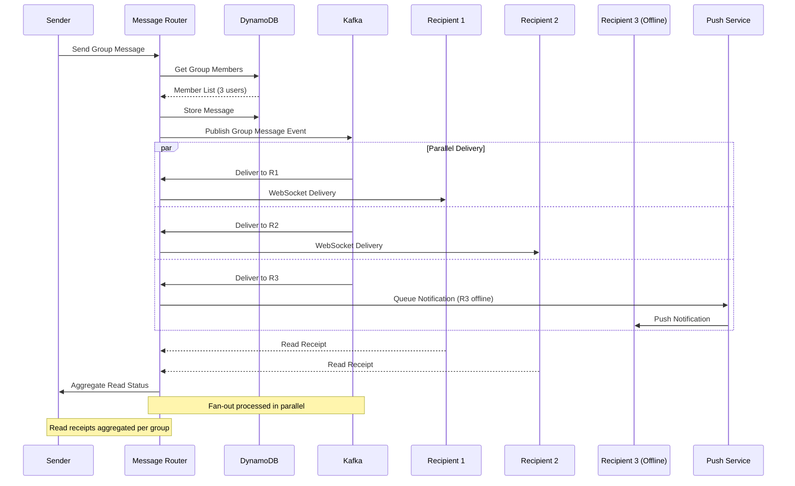

## 6. Scalability & Performance

### 6.1 Scaling Architecture

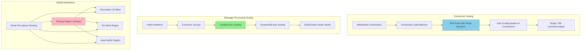

### 6.2 Performance Optimization

**Connection Management:**
- **WebSocket Pooling**: Connection reuse and efficient resource management
- **Connection Affinity**: Consistent hashing for session stickiness
- **Heartbeat Optimization**: Efficient keep-alive with minimal overhead
- **Graceful Degradation**: Fallback to HTTP polling when WebSocket fails

**Message Delivery Optimization:**
- **Batch Processing**: Group message deliveries for efficiency
- **Compression**: Message compression for bandwidth optimization
- **Caching Strategy**: Frequently accessed messages cached in Redis
- **Database Optimization**: DynamoDB with optimized partition keys

**Media Handling:**
- **Progressive Upload**: Chunked upload for large files
- **CDN Integration**: Global media delivery with edge caching
- **Format Optimization**: Automatic image/video format optimization
- **Lazy Loading**: On-demand media loading in chat history

## 7. Reliability & Fault Tolerance

### 7.1 High Availability Design

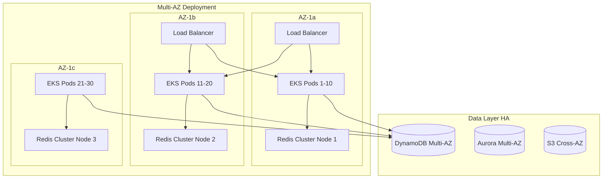

**Message Delivery Guarantees:**
- **At-Least-Once Delivery**: Retry mechanisms with exponential backoff
- **Idempotency**: Message deduplication using unique message IDs
- **Ordering Guarantees**: FIFO ordering within conversations
- **Delivery Confirmation**: End-to-end acknowledgment system

### 7.2 Disaster Recovery

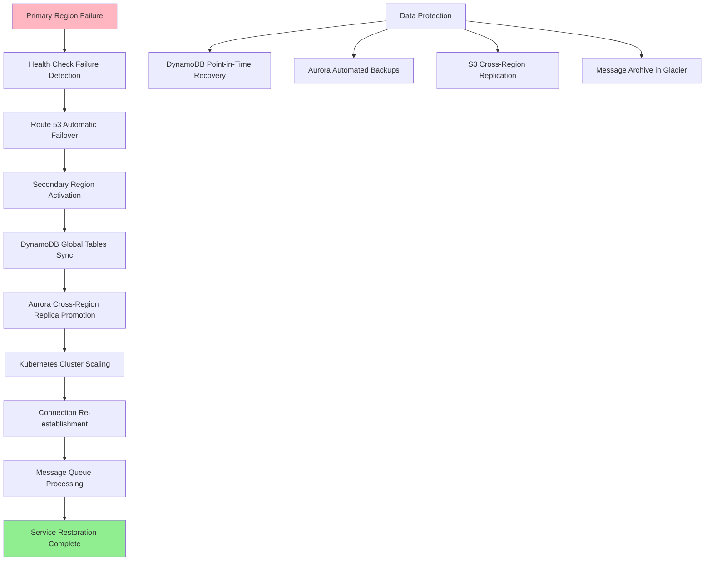

**RTO/RPO Targets:**
- **RTO (Recovery Time Objective)**: 5 minutes for critical messaging functions
- **RPO (Recovery Point Objective)**: 10 seconds maximum message loss
- **Backup Retention**: 30 days for operational data, 7 years for message archives
- **Cross-Region Sync**: Real-time for active conversations, eventual consistency for archives

## 8. Security Architecture

### 8.1 Security Layers

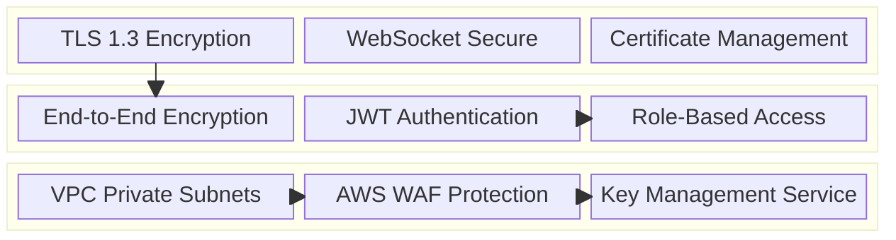

**End-to-End Encryption Implementation:**
- **Signal Protocol**: Double Ratchet algorithm for forward secrecy
- **Key Exchange**: X3DH key agreement protocol
- **Key Management**: Per-device encryption keys with rotation
- **Message Encryption**: AES-256-GCM with unique keys per message

**Authentication & Authorization:**
- **Multi-Factor Authentication**: TOTP and SMS-based 2FA
- **Device Registration**: Unique device certificates and attestation
- **Session Management**: JWT with refresh token rotation
- **API Security**: Rate limiting and request signing

### 8.2 Encryption Key Management Flow

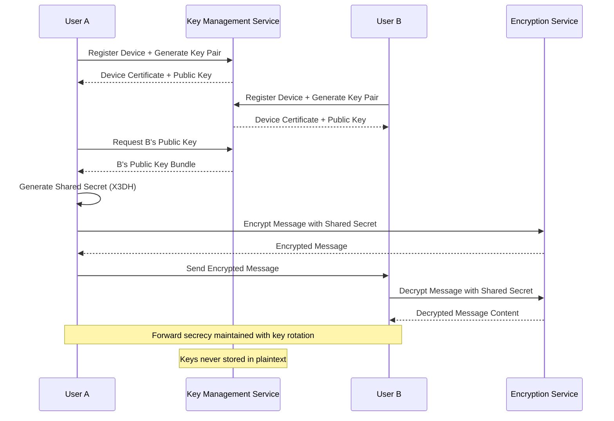

## 9. Monitoring & Observability

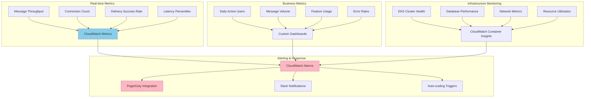

**Key Performance Indicators:**
- **Message Delivery**: Success rate, latency distribution, retry rates
- **User Experience**: Connection stability, typing indicator responsiveness
- **System Health**: CPU/memory utilization, error rates, throughput
- **Business Metrics**: User engagement, feature adoption, growth rates

**Alerting Strategy:**
- **Critical**: Message delivery failures >1%, system unavailability
- **Warning**: High latency >200ms, connection drops >5%
- **Info**: Capacity planning alerts, feature usage anomalies

## 10. Cost Optimization

**Service-Level Cost Analysis:**
- **EKS**: $3,000/month (100 nodes, mixed instance types)
- **DynamoDB**: $2,000/month (strong consistency, global tables)
- **ElastiCache**: $1,200/month (Redis cluster, 9 nodes)
- **MSK**: $800/month (3-broker cluster, high throughput)
- **S3**: $500/month (media storage with intelligent tiering)
- **CloudFront**: $400/month (global media delivery)
- **Lambda**: $300/month (event processing and notifications)
- **Total Estimated**: ~$8,200/month for 10M active users

**Cost Optimization Strategies:**
- **Spot Instances**: 60% savings on batch processing workloads
- **Reserved Capacity**: 40% savings on predictable compute workloads
- **DynamoDB On-Demand**: Cost-effective for variable message patterns
- **S3 Lifecycle Policies**: Automatic archiving of old media content

## 11. Implementation Strategy

### 11.1 Migration/Deployment Plan

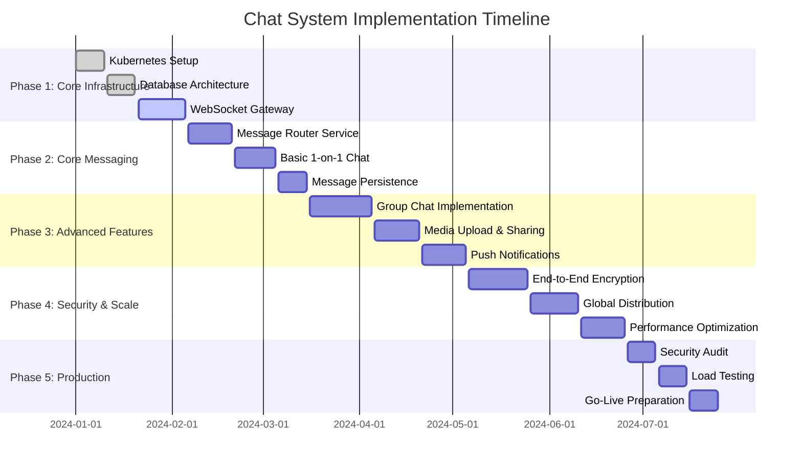

### 11.2 Technology Decisions & Trade-offs

**Communication Protocol Decisions:**
- **WebSocket vs HTTP/2**: WebSocket chosen for true bidirectional real-time communication
- **Custom Protocol vs MQTT**: Custom protocol for chat-optimized message structure
- **Binary vs JSON**: JSON chosen for development velocity, binary for future optimization

**Database Architecture Trade-offs:**
- **DynamoDB vs Cassandra**: DynamoDB for managed service benefits and AWS integration
- **Strong vs Eventual Consistency**: Strong consistency for messages, eventual for presence
- **Relational vs NoSQL**: Hybrid approach optimized for different data patterns

**Future Evolution Path:**
- **AI Integration**: Smart replies, message translation, content moderation
- **Voice/Video Calling**: WebRTC integration for multimedia communication
- **Blockchain**: Decentralized identity and message verification
- **IoT Integration**: Chat capabilities for connected devices

**Technical Debt & Improvement Areas:**
- **Message Search**: Advanced full-text search with semantic understanding
- **Advanced Encryption**: Post-quantum cryptography preparation
- **Cross-Platform SDK**: Unified client libraries for all platforms
- **Analytics Enhancement**: Real-time user behavior analysis and insights
