# Video Streaming Service System Design Architecture

## 1. Executive Summary & Requirements

### System Overview
A global video streaming platform that enables content creators to upload, process, and distribute video content to millions of viewers worldwide. The system supports live streaming, on-demand content, adaptive bitrate streaming, and comprehensive analytics with 99.99% availability.

### Functional Requirements
- **Video Upload**: Support multiple video formats up to 8K resolution
- **Video Processing**: Transcoding, thumbnail generation, and quality optimization
- **Adaptive Streaming**: Multiple bitrates and resolutions for different devices/networks
- **Live Streaming**: Real-time video broadcasting with low latency
- **Content Management**: Video metadata, playlists, and content organization
- **User Management**: Creator accounts, viewer profiles, and subscription management
- **Search & Discovery**: Video search, recommendations, and trending content
- **Analytics**: View counts, engagement metrics, and performance analytics
- **Monetization**: Ad insertion, subscription tiers, and creator revenue sharing

### Non-Functional Requirements
- **Availability**: 99.99% uptime globally
- **Latency**: <2 seconds for video start, <500ms for live streaming
- **Scale**: 1B+ hours watched per day, 100M+ concurrent viewers
- **Storage**: Petabyte-scale video storage with global distribution
- **Throughput**: 10M+ video uploads per day, 1PB+ daily data transfer
- **Quality**: 4K/8K support with adaptive bitrate streaming

### Key Constraints
- Global content delivery with regional compliance
- Copyright protection and content moderation
- Bandwidth optimization for mobile networks
- Real-time processing for live streams

### Success Metrics
- 99.99% video availability SLA
- <2 second average video start time globally
- 99.9% successful video upload rate
- Support 100M+ concurrent video streams
- <1% video buffering rate

## 2. High-Level Architecture Overview

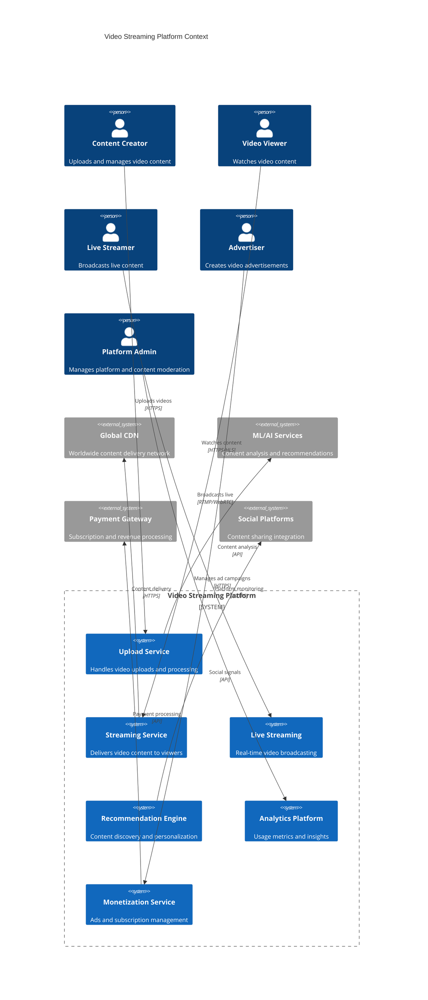

**Architectural Style Rationale**: Event-driven microservices with specialized media processing pipeline chosen for:
- Independent scaling of upload processing vs streaming delivery
- Technology specialization for video processing, storage, and delivery
- Global content distribution requirements
- Real-time processing for live streaming
- Fault isolation for different service concerns

## 3. Detailed System Architecture

### 3.1 AWS Service Stack Selection

**Presentation Layer:**
- **CloudFront**: Global CDN with video streaming optimizations
- **API Gateway**: RESTful APIs with caching and rate limiting
- **Route 53**: Global DNS with health checks and geographic routing

**Application Layer:**
- **EKS**: Kubernetes for microservices orchestration
- **ECS Fargate**: Containerized services for video processing
- **Lambda**: Serverless functions for event-driven processing

**Media Processing:**
- **MediaConvert**: Professional video transcoding service
- **Elemental MediaLive**: Live video processing and streaming
- **Elemental MediaPackage**: Video packaging and origin services
- **Rekognition Video**: AI-powered content analysis and moderation

**Data Layer:**
- **DynamoDB**: Video metadata, user profiles, and viewing history
- **Aurora PostgreSQL**: User management, subscriptions, and analytics
- **ElastiCache Redis**: Session management and caching
- **OpenSearch**: Video search and content discovery

**Storage Layer:**
- **S3**: Video storage with intelligent tiering and lifecycle policies
- **EFS**: Shared storage for processing workflows
- **Glacier**: Long-term archive for old content

**Streaming/Messaging:**
- **Kinesis Video Streams**: Live video ingestion and processing
- **MSK (Managed Kafka)**: Event streaming for analytics and notifications
- **SQS**: Asynchronous job processing queues
- **SNS**: Notification fan-out for uploads and live streams

**Analytics:**
- **Kinesis Analytics**: Real-time video analytics processing
- **EMR**: Large-scale data processing for recommendations
- **QuickSight**: Business intelligence dashboards
- **Athena**: Ad-hoc analytics queries on viewing data

**Security:**
- **Cognito**: User authentication and authorization
- **WAF**: Web application firewall with video-specific rules
- **KMS**: Content encryption and DRM key management
- **Certificate Manager**: SSL/TLS certificate management

### 3.2 Component Architecture Diagram

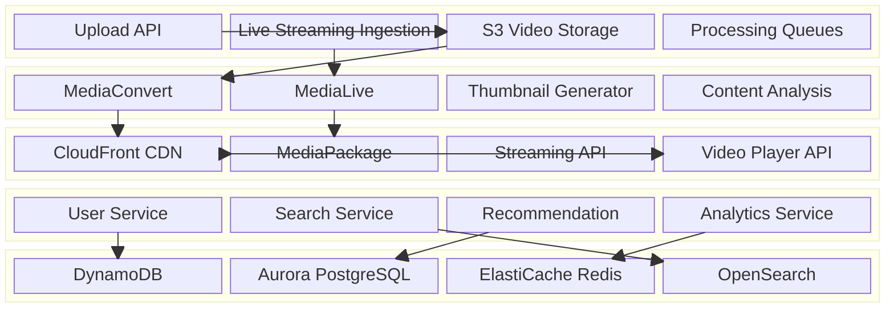

## 4. Data Architecture & Flow

### 4.1 Data Flow Diagrams

#### Video Upload and Processing Pipeline
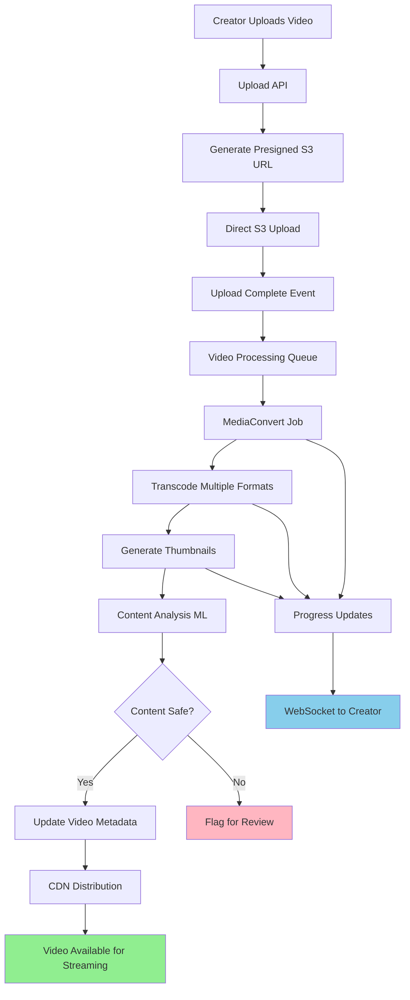

#### Live Streaming Flow
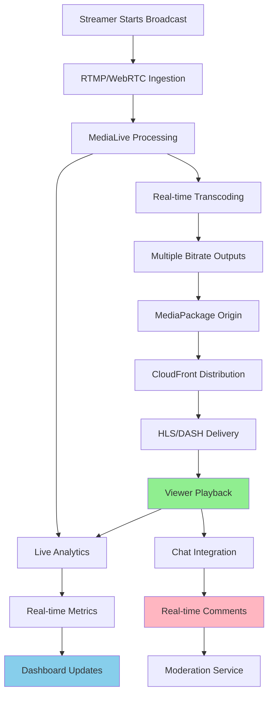

#### Video Streaming and Adaptive Bitrate
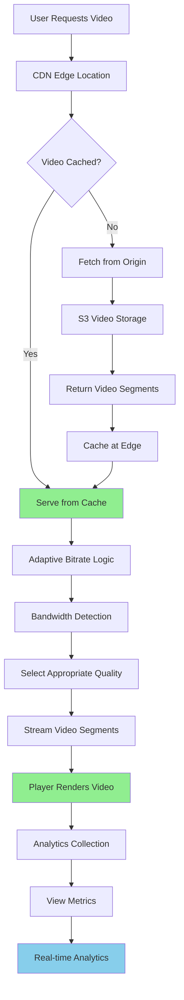

### 4.2 Database Design

#### Video Metadata (DynamoDB)
```mermaid
erDiagram
    VIDEOS {
        string video_id PK
        string creator_id
        string title
        text description
        json tags
        timestamp upload_date
        number duration_seconds
        string status
        json processing_status
        json video_formats
        string thumbnail_url
        number view_count
        number like_count
        json metadata
    }
    
    VIDEO_ANALYTICS {
        string video_id PK
        date analytics_date SK
        number views
        number unique_viewers
        number watch_time_seconds
        json geographic_data
        json device_data
        number engagement_score
    }
    
    USER_VIEWING_HISTORY {
        string user_id PK
        timestamp watched_at SK
        string video_id
        number watch_duration
        number video_position
        string device_type
        boolean completed
    }
    
    LIVE_STREAMS {
        string stream_id PK
        string creator_id
        string title
        timestamp start_time
        timestamp end_time
        string status
        number concurrent_viewers
        json stream_settings
    }
    
    VIDEOS ||--o{ VIDEO_ANALYTICS : "has analytics"
    VIDEOS ||--o{ USER_VIEWING_HISTORY : "viewed by users"
```

#### User Management (Aurora PostgreSQL)
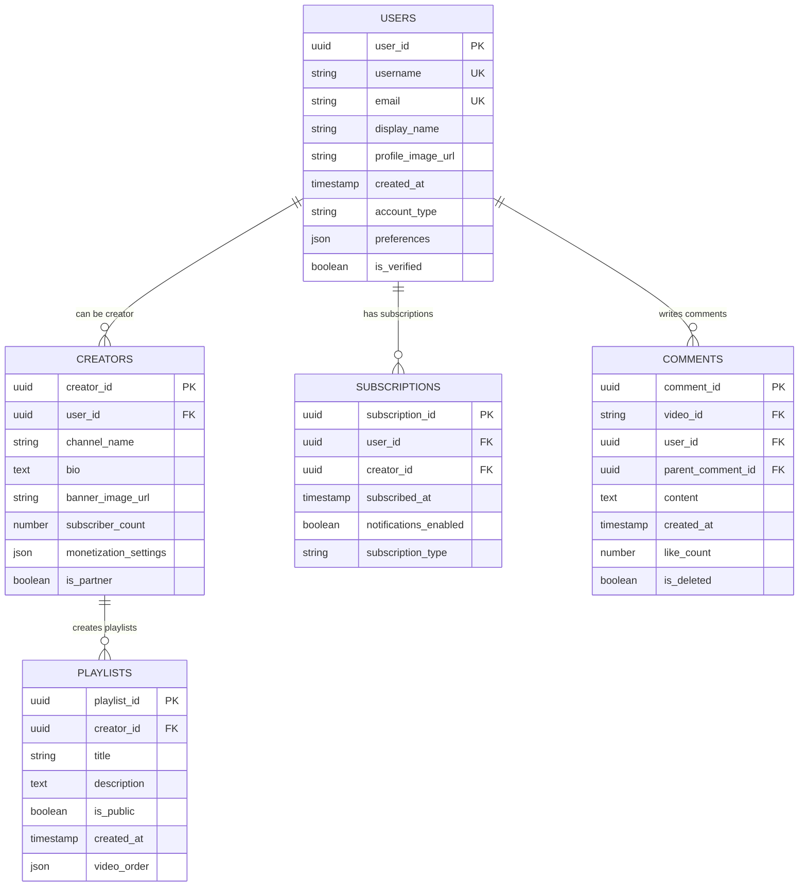

## 5. Detailed Component Design

### 5.1 Video Upload Service

**Purpose & Responsibilities:**
- Handle multi-part video uploads with resume capability
- Generate presigned URLs for direct S3 uploads
- Validate video formats and metadata
- Trigger video processing workflows
- Provide upload progress tracking

**AWS Service Selection:**
- **API Gateway**: Upload endpoint with large payload support
- **Lambda**: Upload validation and workflow orchestration
- **S3 Transfer Acceleration**: Faster uploads from global locations
- **Step Functions**: Complex video processing workflows

**Scaling Characteristics:**
- Auto-scaling based on upload queue depth
- Parallel processing of multiple video formats
- S3 multipart upload for large files
- Regional upload endpoints for global performance

### 5.2 Video Processing Service

**Purpose & Responsibilities:**
- Transcode videos to multiple formats and resolutions
- Generate thumbnails and preview clips
- Extract metadata and perform content analysis
- Apply content moderation and copyright detection
- Optimize videos for different devices and networks

**Performance Considerations:**
- MediaConvert job queues with priority handling
- Parallel processing of different output formats
- GPU-accelerated encoding for faster processing
- Intelligent bitrate selection based on content analysis

### 5.3 Streaming Delivery Service

**Purpose & Responsibilities:**
- Serve video content with adaptive bitrate streaming
- Handle CDN cache management and invalidation
- Implement DRM and content protection
- Provide analytics data collection
- Support multiple streaming protocols (HLS, DASH)

**Scaling Characteristics:**
- Global CDN with edge caching
- Auto-scaling based on concurrent viewer metrics
- Bandwidth-aware delivery optimization
- Regional failover for high availability

### Critical User Journey Sequence Diagrams

#### Video Upload and Processing
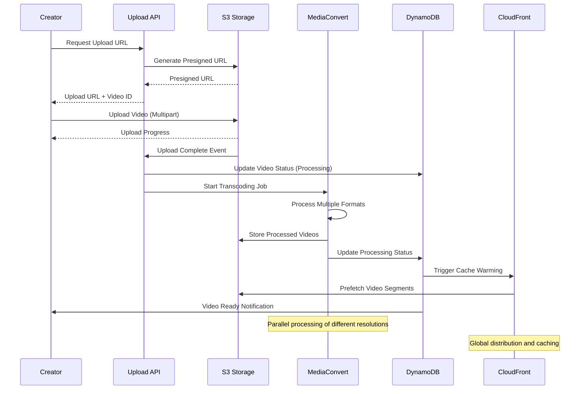

#### Live Streaming Session
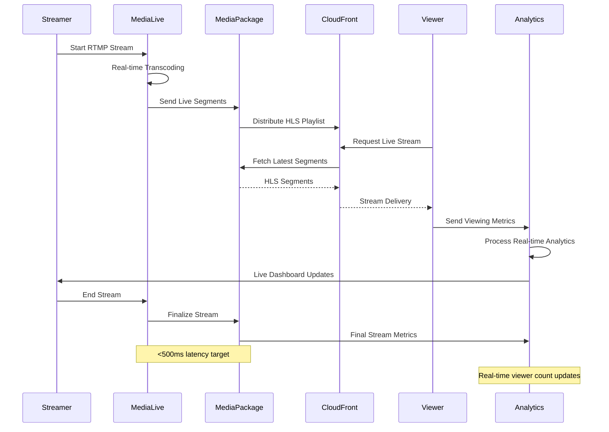

## 6. Scalability & Performance

### 6.1 Scaling Architecture

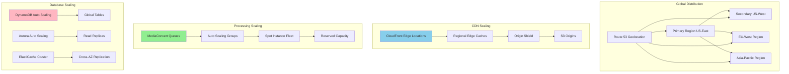

### 6.2 Performance Optimization

**Video Delivery Optimization:**
- **Adaptive Bitrate**: Dynamic quality adjustment based on network conditions
- **Edge Caching**: 95%+ cache hit rate at CDN edges
- **Preloading**: Intelligent prefetching of popular content
- **Compression**: Advanced video codecs (H.265, AV1) for bandwidth efficiency

**Processing Optimization:**
- **Parallel Transcoding**: Multiple output formats processed simultaneously
- **Smart Encoding**: Content-aware encoding settings
- **GPU Acceleration**: Hardware-accelerated encoding for faster processing
- **Queue Prioritization**: Priority processing for live streams and popular creators

**Database Performance:**
- **Hot Data Caching**: Frequently accessed metadata in Redis
- **Read Replicas**: Geographic distribution for reduced latency
- **Partitioning**: Time-based partitioning for analytics data
- **Indexing**: Optimized indexes for search and recommendation queries

## 7. Reliability & Fault Tolerance

### 7.1 High Availability Design

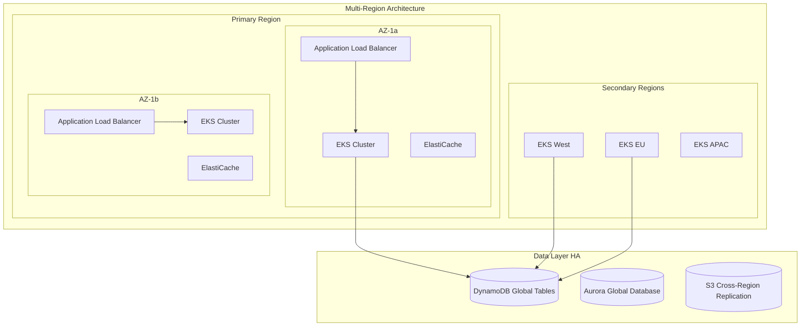

**Content Availability Guarantees:**
- **Multi-Region Replication**: Video content replicated across 3+ regions
- **CDN Redundancy**: Multiple CDN providers for failover
- **Origin Failover**: Automatic failover between S3 origins
- **Processing Redundancy**: Multiple processing queues with failover

### 7.2 Disaster Recovery

```mermaid
flowchart TD
    A[Region Failure Detected] --> B[Route 53 Health Check Failure]
    B --> C[DNS Failover to Secondary Region]
    C --> D[CDN Origin Failover]
    D --> E[Database Failover (Global Tables)]
    E --> F[Processing Queue Redirection]
    F --> G[Service Discovery Updates]
    G --> H[Application Restart in New Region]
    H --> I[Cache Warming]
    I --> J[Full Service Restoration]
    
    K[Backup Strategy] --> L[S3 Cross-Region Replication]
    K --> M[DynamoDB Point-in-Time Recovery]
    K --> N[Aurora Automated Backups]
    K --> O[Video Content Archival]
    
    style A fill:#FFB6C1
    style J fill:#90EE90
```

**RTO/RPO Targets:**
- **RTO (Recovery Time Objective)**: 5 minutes for critical services
- **RPO (Recovery Point Objective)**: 1 minute for metadata, 0 for video content
- **Content Availability**: 99.999% for popular content
- **Backup Retention**: 90 days for metadata, 7 years for video content

## 8. Security Architecture

### 8.1 Security Layers

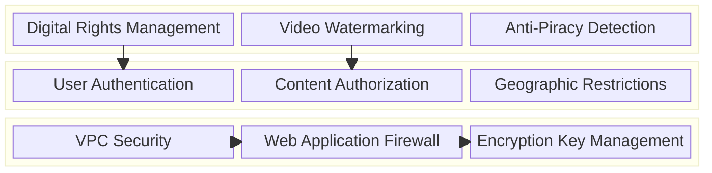

**Content Protection:**
- **DRM Integration**: Widevine, PlayReady, and FairPlay support
- **Token-Based Access**: Time-limited video access tokens
- **Watermarking**: Forensic watermarking for piracy tracking
- **Geographic Restrictions**: Content licensing compliance

**Data Security:**
- **Encryption at Rest**: AES-256 encryption for all video content
- **Encryption in Transit**: TLS 1.3 for all API communications
- **Key Management**: Hardware security modules for DRM keys
- **Access Logging**: Comprehensive audit trails for content access

### 8.2 Content Access Control Flow

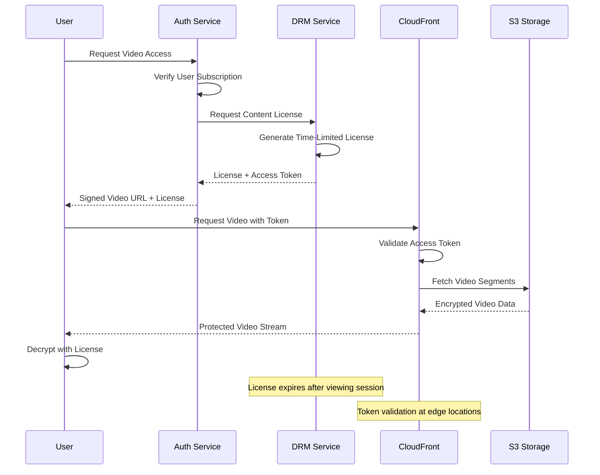

## 9. Monitoring & Observability

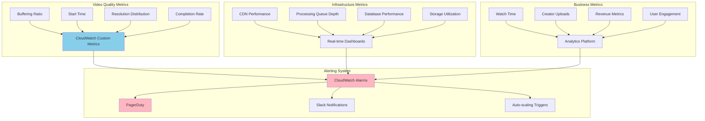

**Key Performance Indicators:**
- **Video Quality**: Buffering ratio <1%, start time <2s, completion rate >85%
- **System Performance**: 99.99% uptime, processing success rate >99.9%
- **User Experience**: Search relevance, recommendation click-through rate
- **Business Metrics**: Watch time growth, creator retention, revenue per user

**Alerting Strategy:**
- **Critical**: Video unavailability, processing failures, security breaches
- **Warning**: High buffering rates, slow processing, capacity warnings
- **Info**: Usage trends, performance optimizations, capacity planning

## 10. Cost Optimization

**Service-Level Cost Analysis:**
- **S3 Storage**: $5,000/month (video content with intelligent tiering)
- **CloudFront**: $8,000/month (global video delivery, 100TB/month)
- **MediaConvert**: $3,000/month (transcoding 1M+ videos)
- **EKS**: $2,500/month (application services, 50 nodes)
- **DynamoDB**: $1,500/month (metadata and analytics)
- **ElastiCache**: $800/month (caching layer)
- **Data Transfer**: $2,000/month (inter-service communication)
- **Total Estimated**: ~$22,800/month for 10M active users

**Cost Optimization Strategies:**
- **S3 Intelligent Tiering**: 30% savings on storage costs
- **Spot Instances**: 60% savings on video processing workloads
- **Reserved Capacity**: 40% savings on predictable compute workloads
- **CDN Optimization**: Smart caching and compression for reduced bandwidth costs
- **Processing Efficiency**: Advanced codecs and optimized encoding settings

**Cost Monitoring:**
- **Budget Alerts**: Multi-tier alerts at 70%, 90%, and 100% of budget
- **Cost Anomaly Detection**: ML-based unusual spending pattern detection
- **Resource Optimization**: Weekly reviews of underutilized resources
- **Creator Cost Allocation**: Transparent cost sharing with content creators

## 11. Implementation Strategy

### 11.1 Migration/Deployment Plan

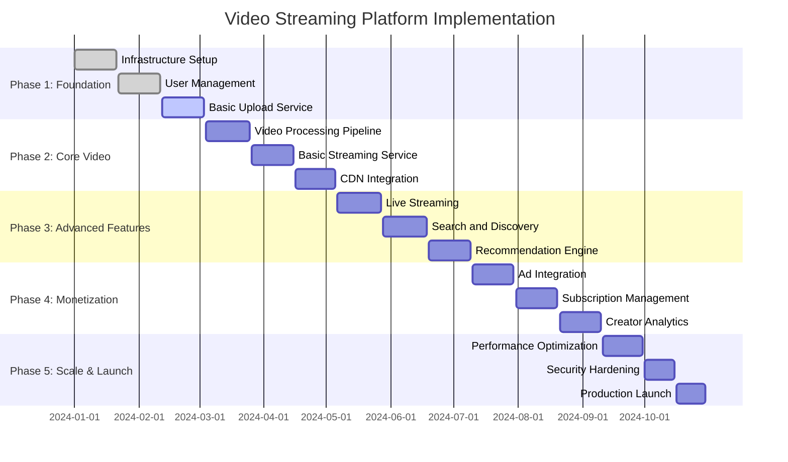

### 11.2 Technology Decisions & Trade-offs

**Video Processing Decisions:**
- **MediaConvert vs Custom**: AWS MediaConvert chosen for managed scaling and format support
- **H.264 vs H.265 vs AV1**: Multi-codec support with H.264 as baseline, H.265/AV1 for efficiency
- **HLS vs DASH**: HLS primary for iOS compatibility, DASH for advanced features

**Storage Architecture Trade-offs:**
- **S3 vs EFS**: S3 for scalable video storage, EFS for processing workflows
- **Hot vs Cold Storage**: Intelligent tiering based on content popularity and age
- **Regional vs Global**: Global replication for popular content, regional for long-tail

**Streaming Technology Decisions:**
- **CDN Provider**: CloudFront primary with multi-CDN strategy for redundancy
- **Adaptive Bitrate**: Client-side adaptation with server-side hints
- **Live Streaming**: MediaLive for professional streams, WebRTC for interactive content

**Future Evolution Path:**
- **AI Enhancement**: Advanced content understanding and automated editing
- **VR/AR Support**: Immersive video content and 360-degree streaming
- **Blockchain Integration**: Creator monetization and content verification
- **Edge Computing**: Ultra-low latency with edge processing and caching

**Technical Debt & Improvement Areas:**
- **Advanced Analytics**: Real-time video quality optimization
- **Content Moderation**: Enhanced AI-powered content safety
- **Creator Tools**: Advanced video editing and production capabilities
- **Personalization**: Deep learning-based recommendation improvements
