# Web Crawler System Design Architecture

## 1. Executive Summary & Requirements

### System Overview
A distributed web crawler system that systematically browses and indexes web pages for search engines. The system handles billions of web pages, respects robots.txt policies, manages crawl frequency, and provides fresh content for search indexing with intelligent prioritization.

### Functional Requirements
- **Web Page Discovery**: Discover new web pages through links and sitemaps
- **Content Extraction**: Extract text, metadata, and structured data from web pages
- **Duplicate Detection**: Identify and handle duplicate content efficiently
- **Robots.txt Compliance**: Respect website crawling policies and rate limits
- **Content Freshness**: Re-crawl pages based on update frequency patterns
- **Link Graph Construction**: Build and maintain web link relationships
- **Content Classification**: Categorize content by type, quality, and relevance
- **Distributed Crawling**: Coordinate crawling across multiple geographic regions

### Non-Functional Requirements
- **Availability**: 99.9% uptime with graceful degradation
- **Scale**: 10B+ pages crawled per day, 1M+ pages per second peak
- **Storage**: Petabyte-scale content storage with efficient compression
- **Throughput**: 100K+ concurrent crawling threads globally
- **Latency**: <1 second average page fetch time
- **Politeness**: Respect website server capacity and crawling ethics

### Key Constraints
- Must comply with robots.txt and crawl-delay directives
- Avoid overwhelming target websites with requests
- Handle dynamic content and JavaScript-rendered pages
- Manage crawl budget efficiently across billions of URLs

### Success Metrics
- 99.9% successful page crawls
- <24 hour average content freshness for news sites
- 95% robots.txt compliance rate
- <0.1% duplicate content in index
- Support 50M+ websites in crawl database

## 2. High-Level Architecture Overview

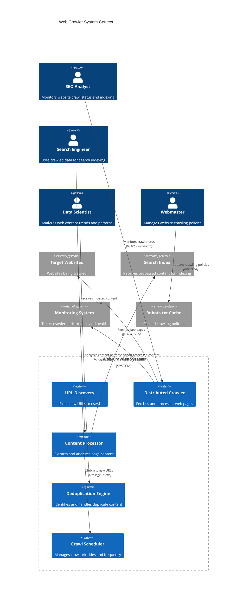

**Architectural Style Rationale**: Distributed event-driven architecture chosen for:
- Massive horizontal scaling across multiple regions
- Independent scaling of URL discovery vs content processing
- Fault tolerance and graceful handling of website failures
- Efficient resource utilization and cost optimization
- Support for different crawling strategies per content type

## 3. Detailed System Architecture

### 3.1 AWS Service Stack Selection

**Presentation Layer:**
- **API Gateway**: RESTful APIs for crawler management and monitoring
- **CloudFront**: Global distribution of crawler status dashboards
- **Route 53**: DNS management with health checks

**Application Layer:**
- **EKS**: Kubernetes orchestration for distributed crawler workers
- **ECS Fargate**: Serverless containers for content processing tasks
- **Lambda**: Event-driven processing for URL discovery and scheduling

**Data Layer:**
- **DynamoDB**: URL queue, crawl metadata, and robots.txt cache
- **Aurora PostgreSQL**: Website profiles, crawl history, and analytics
- **ElastiCache Redis**: Bloom filters for duplicate detection and caching
- **OpenSearch**: Full-text search for crawled content analysis

**Storage Layer:**
- **S3**: Raw page content storage with intelligent tiering
- **EFS**: Shared storage for ML models and temporary processing
- **Glacier**: Long-term archival of historical crawl data

**Streaming/Messaging:**
- **SQS**: URL queues with priority handling and dead letter queues
- **SNS**: Event notifications for crawl completion and errors
- **Kinesis Data Streams**: Real-time crawl metrics and analytics
- **MSK**: High-throughput event streaming for content processing

**Analytics:**
- **Kinesis Analytics**: Real-time analysis of crawl patterns
- **EMR**: Large-scale data processing for link graph analysis
- **Glue**: ETL jobs for data transformation and cleanup
- **Athena**: Ad-hoc queries on crawl data and analytics

**Security:**
- **IAM**: Fine-grained access control for crawler components
- **Secrets Manager**: API keys and database credentials
- **KMS**: Encryption for sensitive crawl data
- **VPC**: Network isolation for crawler infrastructure

**Monitoring:**
- **CloudWatch**: Comprehensive metrics and alerting
- **X-Ray**: Distributed tracing for crawl request flows
- **CloudTrail**: Audit logging for compliance

### 3.2 Component Architecture Diagram

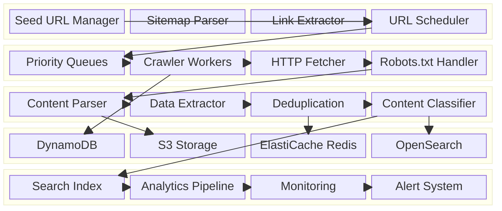

## 4. Data Architecture & Flow

### 4.1 Data Flow Diagrams

#### URL Discovery and Scheduling Flow
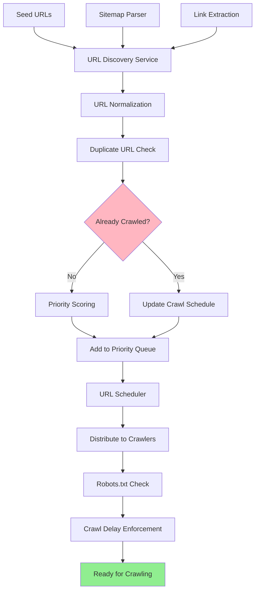

#### Web Page Crawling and Processing Flow
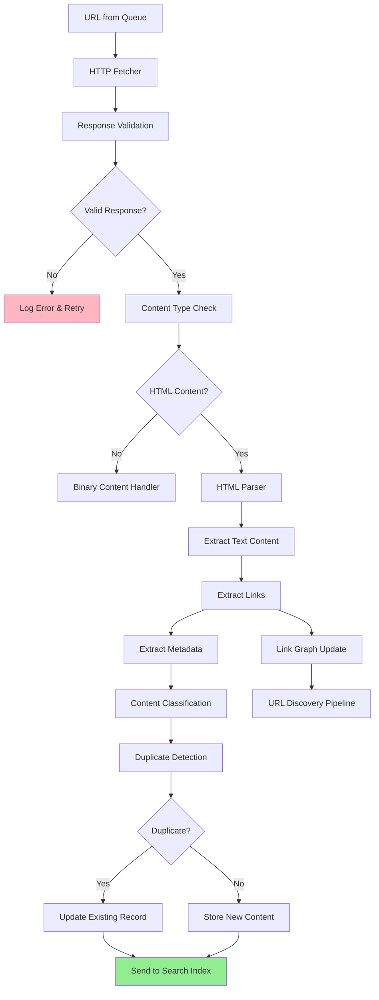

#### Content Deduplication and Quality Assessment
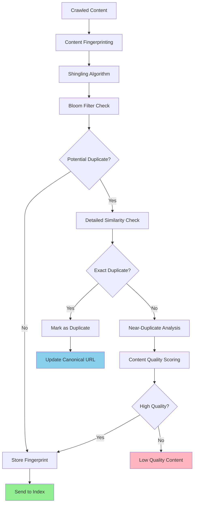

### 4.2 Database Design

#### URL Management (DynamoDB)
```mermaid
erDiagram
    URL_QUEUE {
        string url_hash PK
        string url
        number priority_score
        timestamp scheduled_crawl_time
        timestamp last_crawled
        string crawl_status
        number retry_count
        json crawl_metadata
    }
    
    WEBSITE_PROFILES {
        string domain PK
        string robots_txt_url
        number crawl_delay_seconds
        timestamp robots_last_updated
        json allowed_paths
        json disallowed_paths
        number daily_crawl_budget
        string website_category
    }
    
    CRAWL_HISTORY {
        string url_hash PK
        timestamp crawl_time SK
        number response_code
        number response_size
        number processing_time_ms
        string content_hash
        boolean is_duplicate
        json extracted_links
    }
    
    DUPLICATE_FINGERPRINTS {
        string content_hash PK
        string canonical_url
        timestamp first_seen
        number duplicate_count
        json similar_urls
    }
    
    URL_QUEUE ||--|| WEBSITE_PROFILES : "belongs to domain"
    URL_QUEUE ||--o{ CRAWL_HISTORY : "has crawl history"
    CRAWL_HISTORY ||--o{ DUPLICATE_FINGERPRINTS : "may have duplicates"
```

#### Content Storage (Aurora PostgreSQL)
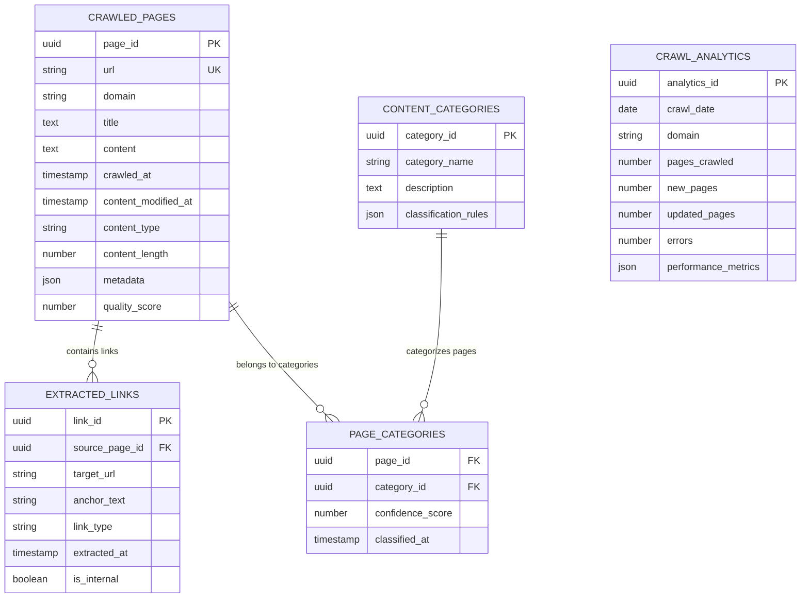

## 5. Detailed Component Design

### 5.1 Distributed Crawler Service

**Purpose & Responsibilities:**
- Coordinate crawling across multiple worker nodes
- Implement politeness policies and rate limiting
- Handle HTTP requests with proper headers and user agents
- Manage crawl sessions and connection pooling
- Process different content types (HTML, PDF, images)

**AWS Service Selection:**
- **EKS**: Kubernetes for auto-scaling crawler workers
- **Application Load Balancer**: Health checks and traffic distribution
- **ElastiCache**: Shared state management across crawler instances

**Scaling Characteristics:**
- Horizontal scaling based on queue depth and target throughput
- Geographic distribution for reduced latency to target websites
- Auto-scaling policies: scale out at 80% CPU, scale in at 30%
- Connection pooling and HTTP/2 support for efficiency

**Failure Modes & Recovery:**
- Website timeout: Exponential backoff with maximum retry limits
- Rate limiting: Dynamic delay adjustment based on server responses
- Content parsing errors: Graceful degradation with partial content extraction
- Worker node failure: Automatic job redistribution via Kubernetes

### 5.2 Content Processing Service

**Purpose & Responsibilities:**
- Parse HTML and extract structured data
- Perform content quality assessment and classification
- Extract and normalize metadata (title, description, keywords)
- Handle dynamic content rendered by JavaScript
- Generate content fingerprints for deduplication

**Performance Considerations:**
- Parallel processing of multiple content types
- Efficient DOM parsing with streaming parsers
- Memory-optimized content processing for large pages
- Batch processing for improved throughput

### 5.3 URL Scheduler Service

**Purpose & Responsibilities:**
- Prioritize URLs based on importance and freshness requirements
- Implement crawl frequency policies per website
- Distribute URLs across crawler workers efficiently
- Handle crawl budget management and optimization
- Coordinate with robots.txt policies

**Scaling Characteristics:**
- Priority queue implementation with multiple tiers
- Load balancing across geographic regions
- Dynamic priority adjustment based on content changes
- Efficient URL deduplication using bloom filters

### Critical User Journey Sequence Diagrams

#### Website Discovery and Initial Crawl
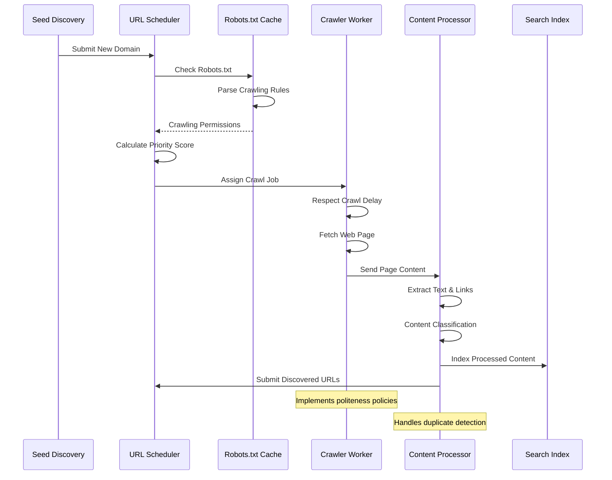

#### Large-Scale Crawling Coordination
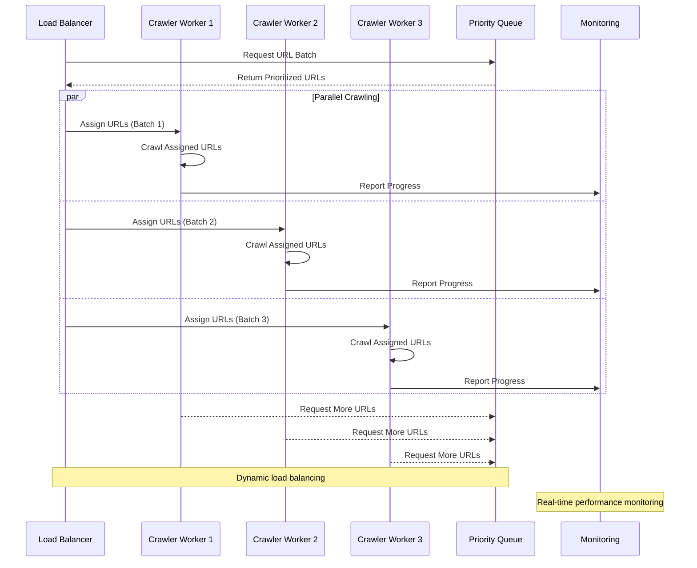

## 6. Scalability & Performance

### 6.1 Scaling Architecture

```mermaid
flowchart TD
    subgraph "Global Distribution"
        A[US-East Primary] --> B[US-West Secondary]
        A --> C[EU-West Region]
        A --> D[Asia-Pacific Region]
        E[Route 53 Latency Routing] --> A
        E --> B
        E --> C
        E --> D
    end
    
    subgraph "Horizontal Scaling"
        F[Kubernetes HPA] --> G[Crawler Pods 1-100]
        H[Queue-based Scaling] --> I[SQS Message Count]
        I --> J[Auto Scaling Triggers]
        J --> F
    end
    
    subgraph "Database Scaling"
        K[DynamoDB Auto Scaling] --> L[Read/Write Capacity]
        M[Aurora Auto Scaling] --> N[Read Replicas]
        O[ElastiCache Cluster] --> P[Multi-AZ Replication]
    end
    
    subgraph "Storage Scaling"
        Q[S3 Intelligent Tiering] --> R[Hot/Cold Storage]
        S[Compression Pipeline] --> T[Content Deduplication]
        T --> Q
    end
    
    style F fill:#87CEEB
    style K fill:#90EE90
    style Q fill:#FFB6C1
```

### 6.2 Performance Optimization

**Crawling Performance:**
- **Connection Pooling**: Reuse HTTP connections for multiple requests to same domain
- **Concurrent Requests**: Parallel processing with configurable limits per domain
- **Compression**: Support for gzip/brotli compression to reduce bandwidth
- **Caching**: DNS caching and robots.txt caching for reduced overhead

**Content Processing Optimization:**
- **Streaming Parsers**: Process content as it's downloaded
- **Parallel Processing**: Multiple worker threads for content analysis
- **Memory Management**: Efficient memory usage for large document processing
- **Batch Operations**: Group similar operations for improved throughput

**Storage Optimization:**
- **Content Deduplication**: Reduce storage costs through duplicate detection
- **Compression**: Intelligent compression based on content type
- **Tiering**: Automatic movement of old content to cheaper storage tiers
- **Indexing**: Optimized database indexes for fast URL lookups

## 7. Reliability & Fault Tolerance

### 7.1 High Availability Design

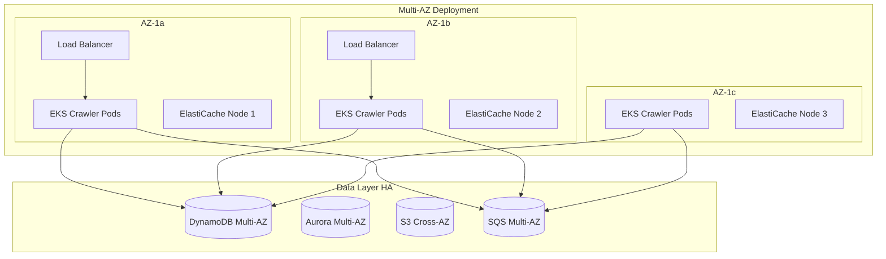

**Crawling Reliability:**
- **Retry Mechanisms**: Exponential backoff for failed requests
- **Circuit Breakers**: Automatic failure detection and recovery
- **Graceful Degradation**: Continue crawling when some components fail
- **Job Distribution**: Automatic redistribution of failed crawl jobs

### 7.2 Disaster Recovery

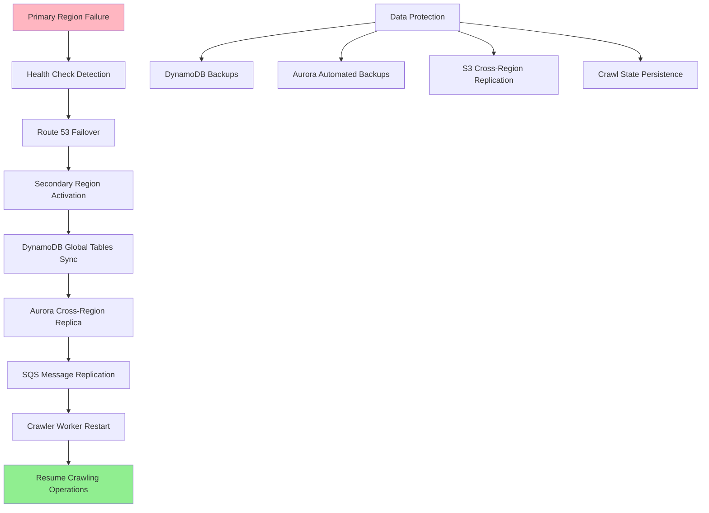

**RTO/RPO Targets:**
- **RTO (Recovery Time Objective)**: 15 minutes for crawling operations
- **RPO (Recovery Point Objective)**: 5 minutes for crawl state
- **Data Retention**: 90 days for operational data, 7 years for content archives
- **Backup Strategy**: Real-time replication for critical crawl queues

## 8. Security Architecture

### 8.1 Security Layers

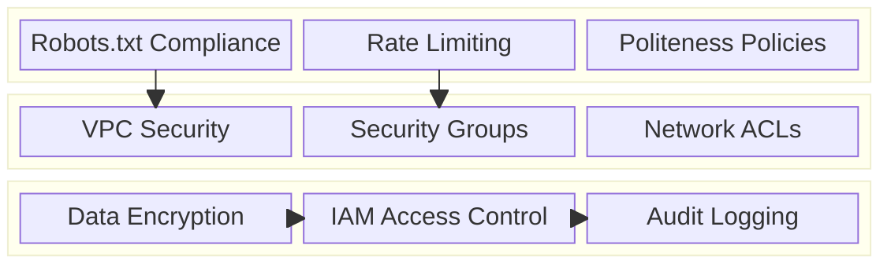

**Ethical Crawling Practices:**
- **Robots.txt Compliance**: Strict adherence to website crawling policies
- **Rate Limiting**: Configurable delays to avoid overwhelming servers
- **User Agent Identification**: Clear identification of crawler purpose
- **Content Respect**: Honor no-index and no-follow directives

**Data Security:**
- **Encryption in Transit**: TLS 1.3 for all HTTP requests
- **Encryption at Rest**: AES-256 encryption for stored content
- **Access Control**: IAM roles with least privilege principles
- **Audit Trails**: Comprehensive logging of all crawl activities

### 8.2 Robots.txt Compliance Flow

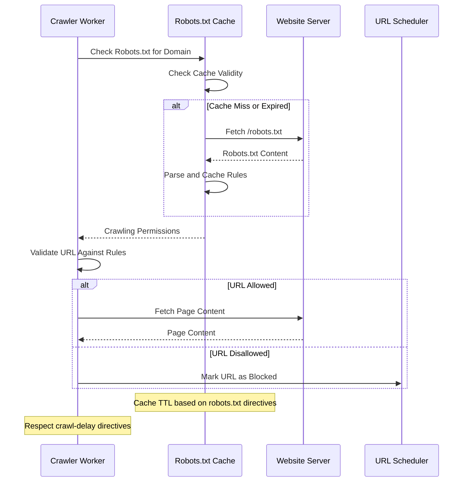

## 9. Monitoring & Observability

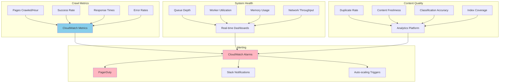

**Key Performance Indicators:**
- **Crawl Efficiency**: Pages crawled per hour, success rate, coverage metrics
- **Content Quality**: Duplicate detection rate, content freshness, classification accuracy
- **System Performance**: Response times, error rates, resource utilization
- **Compliance**: Robots.txt adherence, politeness policy compliance

**Alerting Strategy:**
- **Critical**: Crawler system down, high error rates (>10%), robots.txt violations
- **Warning**: Queue backup, slow response times, high duplicate rates
- **Info**: Capacity planning alerts, new website discoveries, performance trends

## 10. Cost Optimization

**Service-Level Cost Analysis:**
- **EKS**: $4,000/month (crawler workers, 200 nodes with spot instances)
- **DynamoDB**: $2,500/month (URL queues and metadata, on-demand pricing)
- **S3**: $3,000/month (content storage with intelligent tiering)
- **SQS**: $800/month (URL queues and job processing)
- **ElastiCache**: $1,200/month (caching and deduplication)
- **Data Transfer**: $1,500/month (outbound traffic and cross-AZ)
- **Aurora**: $1,000/month (analytics and reporting database)
- **Total Estimated**: ~$14,000/month for 10B pages/day crawling

**Cost Optimization Strategies:**
- **Spot Instances**: 70% cost reduction for crawler workers
- **Intelligent Tiering**: 40% storage cost savings through automated tiering
- **Reserved Capacity**: 30% savings on predictable database workloads
- **Compression**: 60% bandwidth reduction through content compression
- **Deduplication**: 25% storage savings through duplicate content elimination

**Cost Monitoring:**
- **Budget Alerts**: Multi-tier alerts at 75%, 90%, and 100% of budget
- **Cost per Page**: Track cost efficiency metrics per crawled page
- **Resource Optimization**: Weekly analysis of underutilized resources
- **Crawl Budget**: Intelligent allocation of crawling resources based on content value

## 11. Implementation Strategy

### 11.1 Migration/Deployment Plan

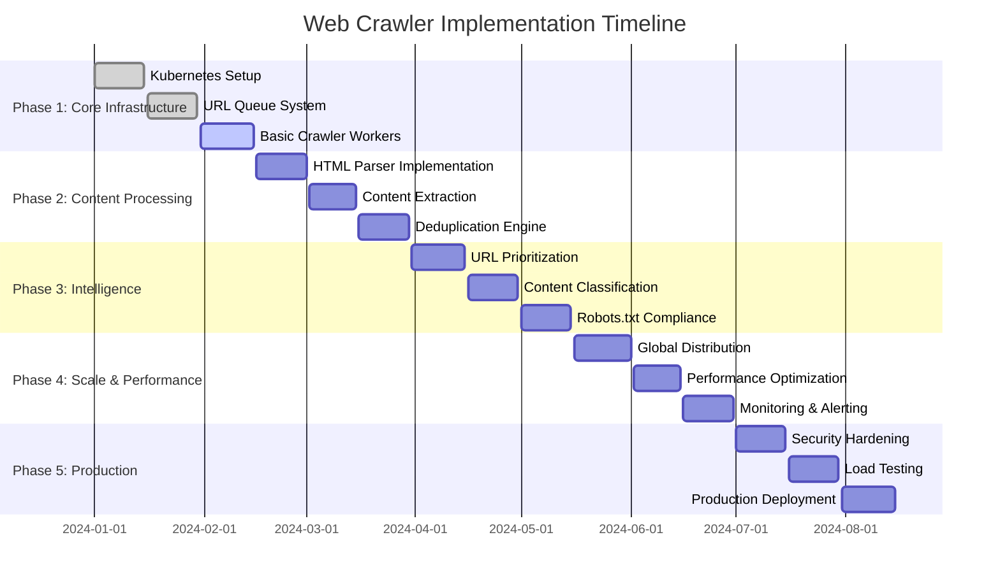

### 11.2 Technology Decisions & Trade-offs

**Crawling Technology Decisions:**
- **HTTP Client**: Custom HTTP client with connection pooling vs off-the-shelf libraries
- **Content Parsing**: BeautifulSoup vs lxml vs custom parsers for performance
- **JavaScript Rendering**: Headless browsers vs static HTML parsing trade-offs
- **Distributed Coordination**: SQS-based vs Kafka-based job distribution

**Storage Architecture Trade-offs:**
- **URL Storage**: DynamoDB vs Cassandra for massive URL queues
- **Content Storage**: S3 vs distributed file systems for petabyte-scale content
- **Caching Strategy**: Redis vs Memcached for different caching patterns
- **Search Integration**: Direct indexing vs batch processing for search engines

**Scalability Decisions:**
- **Worker Architecture**: Kubernetes pods vs Lambda functions for crawl workers
- **Geographic Distribution**: Multi-region vs single-region with global CDN
- **Queue Management**: Priority queues vs FIFO queues for URL processing
- **Resource Allocation**: Fixed vs dynamic resource allocation based on demand

**Future Evolution Path:**
- **AI Enhancement**: Machine learning for content quality assessment and crawl prioritization
- **Real-time Processing**: Stream processing for immediate content indexing
- **Advanced Analytics**: Deep learning for content understanding and classification
- **Blockchain Integration**: Decentralized crawling and content verification

**Technical Debt & Improvement Areas:**
- **JavaScript Rendering**: Enhanced support for dynamic content and SPAs
- **Content Understanding**: Advanced NLP for better content classification
- **Crawl Efficiency**: Machine learning-based crawl scheduling and prioritization
- **Global Compliance**: Enhanced support for regional data protection regulations
