# Search Engine System Design Architecture

## 1. Executive Summary & Requirements

### System Overview
A comprehensive search engine system that crawls, indexes, and searches billions of web pages with relevance ranking, real-time query processing, and personalized results. The system provides sub-second search results with high accuracy and supports complex query types including text, image, and voice search.

### Functional Requirements
- **Web Crawling**: Systematic discovery and indexing of web content
- **Text Search**: Full-text search with Boolean operators and phrase matching
- **Relevance Ranking**: Machine learning-based ranking algorithms
- **Real-time Indexing**: Near real-time updates to search index
- **Query Processing**: Natural language query understanding and processing
- **Personalization**: User-specific search results and recommendations
- **Multi-modal Search**: Support for image, video, and voice search
- **Auto-complete**: Real-time search suggestions and spell correction
- **Analytics**: Search analytics and performance monitoring

### Non-Functional Requirements
- **Availability**: 99.99% uptime with global distribution
- **Latency**: <200ms average query response time globally
- **Scale**: 100B+ indexed pages, 10B+ queries per day
- **Storage**: Exabyte-scale index storage with efficient compression
- **Throughput**: 1M+ queries per second peak, 100M+ pages indexed daily
- **Accuracy**: >95% relevance for top 10 search results

### Key Constraints
- Real-time index updates without impacting query performance
- Handling duplicate and spam content effectively
- Balancing freshness vs authority in ranking algorithms
- Managing computational costs for complex ranking models

### Success Metrics
- 99.99% search availability SLA
- <150ms average global query latency
- >90% user satisfaction with search results
- 95% query success rate (non-empty results)
- Support 50+ languages and regional variations

## 2. High-Level Architecture Overview

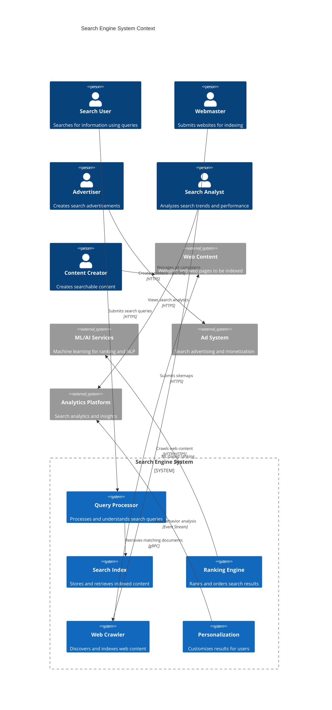

**Architectural Style Rationale**: Distributed microservices with specialized indexing and ranking pipeline chosen for:
- Independent scaling of crawling, indexing, and query processing
- Technology specialization for different aspects (NLP, ML, storage)
- Real-time query processing with batch index updates
- Global distribution for low-latency search results
- Fault isolation between critical search components

## 3. Detailed System Architecture

### 3.1 AWS Service Stack Selection

**Presentation Layer:**
- **CloudFront**: Global CDN for search interface and static assets
- **API Gateway**: Search API management with rate limiting and caching
- **Route 53**: Global DNS with health checks and geographic routing

**Application Layer:**
- **EKS**: Kubernetes for query processing and ranking services
- **ECS Fargate**: Containerized services for indexing and crawling
- **Lambda**: Serverless functions for query preprocessing and analytics

**Search & Analytics:**
- **OpenSearch**: Primary search index with advanced query capabilities
- **Elasticsearch**: Alternative search backend with custom analyzers
- **Comprehend**: Natural language processing for query understanding
- **Kendra**: Enterprise search capabilities for structured content

**Data Layer:**
- **DynamoDB**: User profiles, query logs, and real-time data
- **Aurora PostgreSQL**: Structured data, analytics, and reporting
- **ElastiCache Redis**: Query caching and session management
- **MemoryDB**: Real-time personalization and user context

**Storage Layer:**
- **S3**: Web page content, crawl data, and ML model artifacts
- **EFS**: Shared storage for large-scale indexing operations
- **FSx**: High-performance storage for index building

**Machine Learning:**
- **SageMaker**: ML model training and deployment for ranking
- **Bedrock**: Large language models for query understanding
- **Rekognition**: Image and video content analysis
- **Textract**: Document text extraction and analysis

**Streaming/Messaging:**
- **MSK (Managed Kafka)**: Real-time indexing updates and analytics
- **Kinesis Data Streams**: Query logs and user behavior tracking
- **SQS**: Asynchronous processing queues for indexing
- **SNS**: Notifications for index updates and alerts

**Analytics:**
- **Kinesis Analytics**: Real-time query analysis and trending
- **EMR**: Large-scale data processing for index optimization
- **QuickSight**: Search analytics dashboards and reporting
- **Athena**: Ad-hoc analysis of search logs and performance

**Security:**
- **Cognito**: User authentication and personalization
- **WAF**: Protection against malicious queries and attacks
- **KMS**: Encryption for sensitive search data and user information
- **Certificate Manager**: SSL/TLS certificate management

### 3.2 Component Architecture Diagram

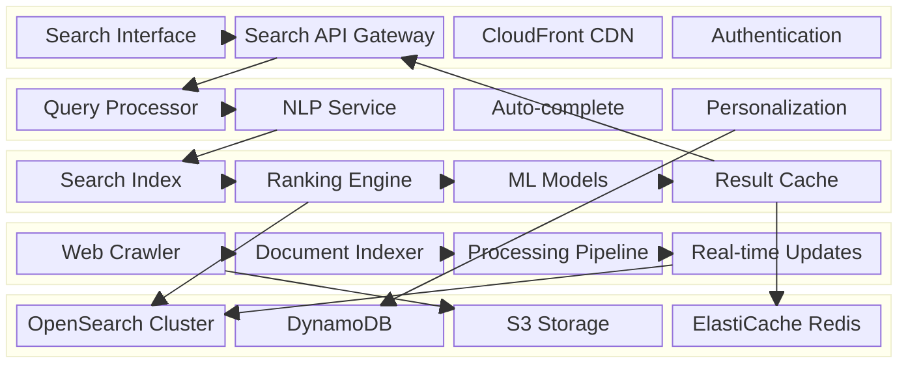

## 4. Data Architecture & Flow

### 4.1 Data Flow Diagrams

#### Query Processing and Search Flow
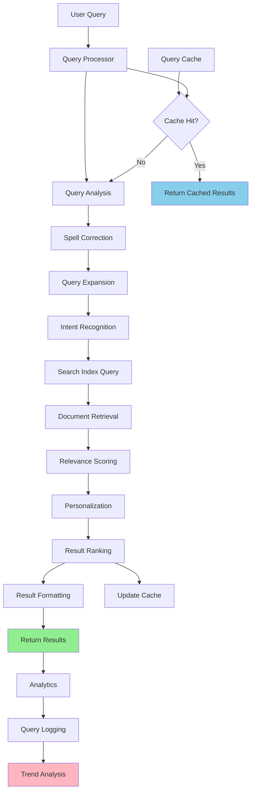

#### Document Indexing and Update Flow
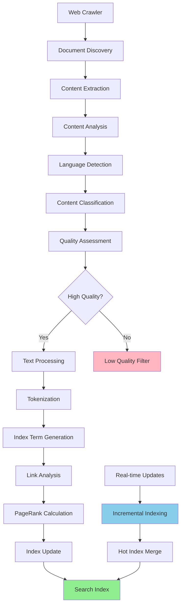

#### Machine Learning Ranking Pipeline
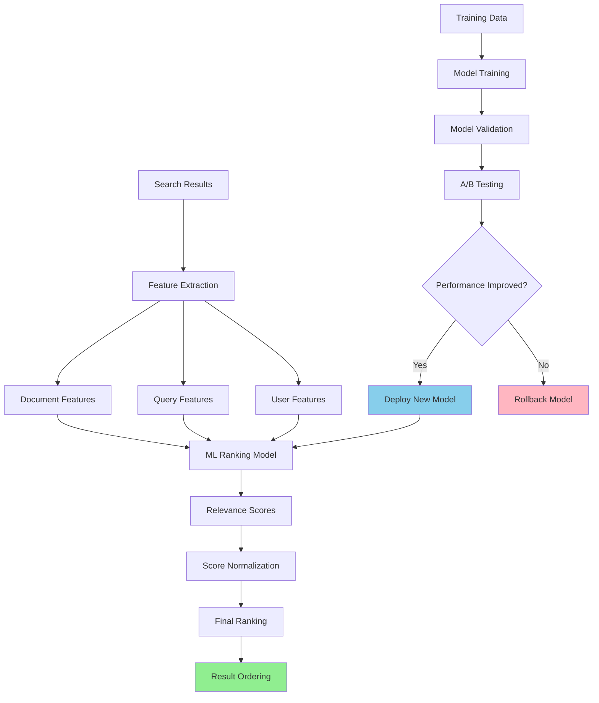

### 4.2 Database Design

#### Search Index Structure (OpenSearch)
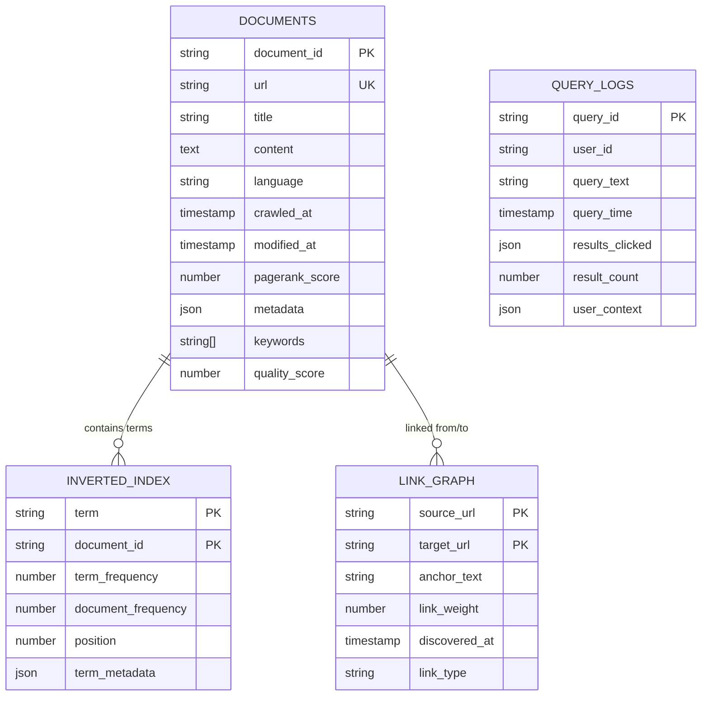

#### User and Personalization Data (DynamoDB)
```mermaid
erDiagram
    USERS {
        string user_id PK
        string session_id
        json search_preferences
        json location_data
        timestamp last_active
        string[] search_history
        json interest_profile
    }
    
    SEARCH_SESSIONS {
        string session_id PK
        timestamp session_start SK
        string user_id
        json queries
        json clicked_results
        number session_duration
        string user_agent
    }
    
    PERSONALIZATION_FEATURES {
        string user_id PK
        string feature_type SK
        json feature_values
        number feature_weight
        timestamp last_updated
        boolean is_active
    }
    
    QUERY_SUGGESTIONS {
        string query_prefix PK
        string suggestion
        number popularity_score
        timestamp last_used
        json context_filters
    }
    
    USERS ||--o{ SEARCH_SESSIONS : "has sessions"
    USERS ||--o{ PERSONALIZATION_FEATURES : "has features"
```

## 5. Detailed Component Design

### 5.1 Query Processing Service

**Purpose & Responsibilities:**
- Parse and understand natural language queries
- Perform spell correction and query expansion
- Handle complex query types (Boolean, phrase, proximity)
- Extract user intent and context
- Generate optimized search queries for the index

**AWS Service Selection:**
- **EKS**: Kubernetes for auto-scaling query processors
- **Comprehend**: Natural language understanding and entity extraction
- **Lambda**: Serverless functions for lightweight query preprocessing

**Scaling Characteristics:**
- Auto-scaling based on query volume and latency targets
- Geographic distribution for reduced query processing latency
- Connection pooling for downstream search index queries
- Caching of processed queries and expansions

**Performance Considerations:**
- Sub-100ms query processing target
- Parallel processing of query analysis tasks
- Efficient caching of common query patterns
- Optimized NLP models for real-time inference

### 5.2 Search Index Service

**Purpose & Responsibilities:**
- Maintain inverted index for fast document retrieval
- Handle complex query execution with Boolean logic
- Provide relevance scoring and initial ranking
- Support real-time index updates and merging
- Manage index sharding and distribution

**AWS Service Selection:**
- **OpenSearch**: Primary search engine with advanced querying
- **EKS**: Kubernetes for index management services
- **S3**: Index backup and disaster recovery storage

**Scaling Characteristics:**
- Horizontal sharding across multiple OpenSearch nodes
- Read replicas for query load distribution
- Hot-warm-cold index architecture for cost optimization
- Auto-scaling based on query load and index size

### 5.3 Ranking Engine Service

**Purpose & Responsibilities:**
- Apply machine learning models for relevance ranking
- Combine multiple ranking signals (PageRank, content quality, freshness)
- Implement personalization and user context
- A/B testing framework for ranking experiments
- Real-time ranking score computation

**Performance Considerations:**
- Model inference optimization for sub-millisecond scoring
- Feature caching for frequently accessed documents
- Batch scoring for efficiency with parallel processing
- Progressive ranking for large result sets

### Critical User Journey Sequence Diagrams

#### Search Query Processing
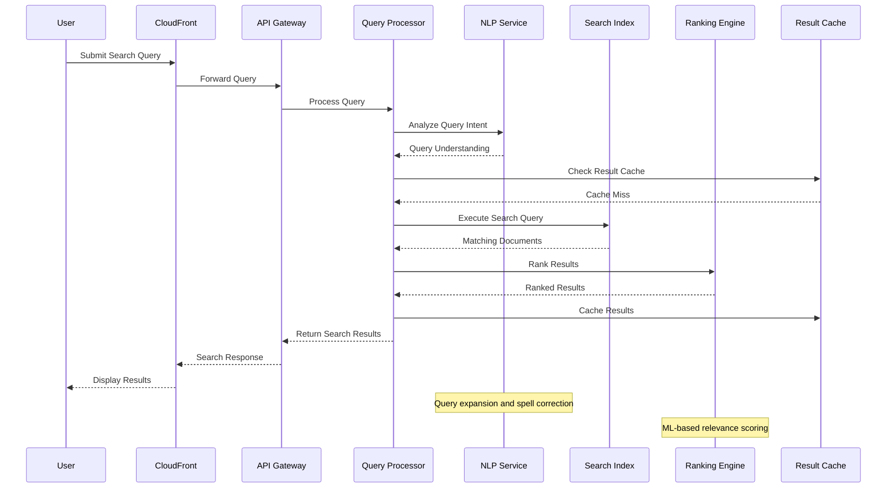

#### Real-time Index Update
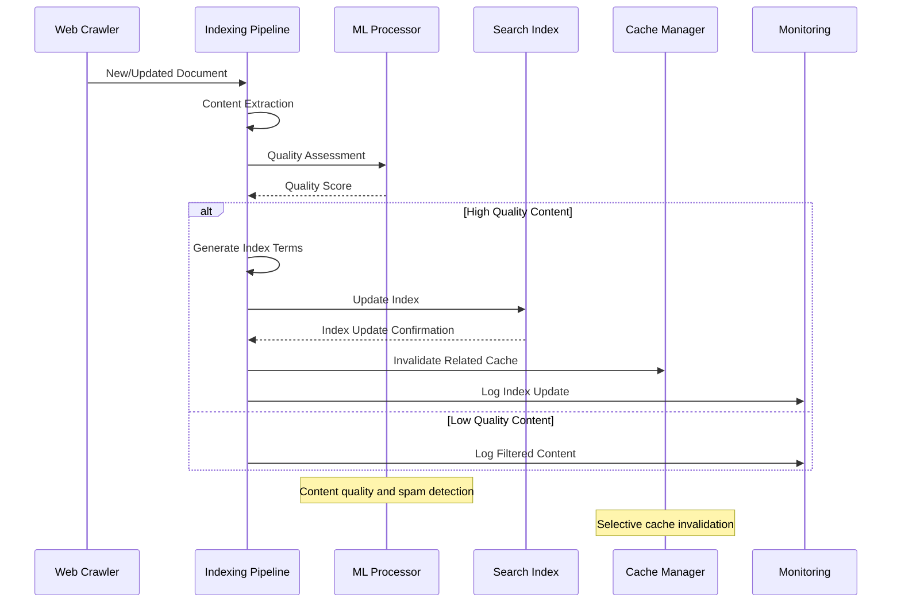

## 6. Scalability & Performance

### 6.1 Scaling Architecture

```mermaid
flowchart TD
    subgraph "Global Query Distribution"
        A[US-East Primary] --> B[US-West Secondary]
        A --> C[EU-West Region]
        A --> D[Asia-Pacific Region]
        E[Route 53 Geolocation] --> A
        E --> B
        E --> C
        E --> D
    end
    
    subgraph "Index Scaling"
        F[OpenSearch Cluster] --> G[Index Sharding]
        G --> H[Hot Tier (SSD)]
        G --> I[Warm Tier (HDD)]
        G --> J[Cold Tier (S3)]
    end
    
    subgraph "Query Processing Scaling"
        K[Kubernetes HPA] --> L[Query Processors]
        M[Load Balancer] --> L
        N[Auto-scaling Metrics] --> K
    end
    
    subgraph "Caching Layers"
        O[CDN Edge Cache] --> P[Regional Cache]
        P --> Q[Application Cache]
        Q --> R[Database Cache]
    end
    
    style F fill:#87CEEB
    style K fill:#90EE90
    style O fill:#FFB6C1
```

### 6.2 Performance Optimization

**Query Performance:**
- **Multi-level Caching**: CDN, application, and database caching layers
- **Index Optimization**: Efficient data structures and compression algorithms
- **Parallel Processing**: Concurrent query execution across index shards
- **Result Prefetching**: Predictive caching based on query patterns

**Index Performance:**
- **Incremental Updates**: Real-time index updates without full rebuilds
- **Index Compression**: Advanced compression techniques for storage efficiency
- **Tiered Storage**: Hot-warm-cold architecture for cost-performance balance
- **Selective Indexing**: Index only high-quality, relevant content

**Machine Learning Optimization:**
- **Model Optimization**: Quantization and pruning for faster inference
- **Feature Caching**: Cache computed features for frequently accessed documents
- **Batch Processing**: Group similar queries for efficient ML processing
- **Edge Inference**: Deploy lightweight models at edge locations

## 7. Reliability & Fault Tolerance

### 7.1 High Availability Design

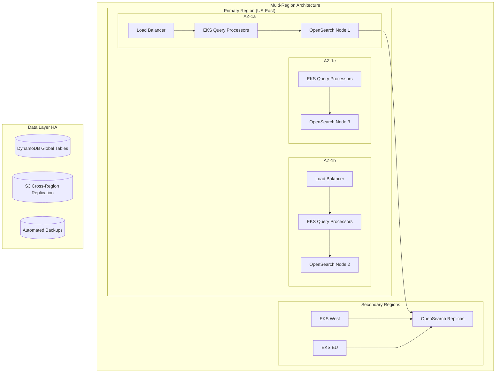

**Search Availability Guarantees:**
- **Index Replication**: Multi-AZ and cross-region index replication
- **Query Failover**: Automatic failover to healthy query processing nodes
- **Graceful Degradation**: Reduced functionality during partial outages
- **Circuit Breakers**: Automatic failure detection and isolation

### 7.2 Disaster Recovery

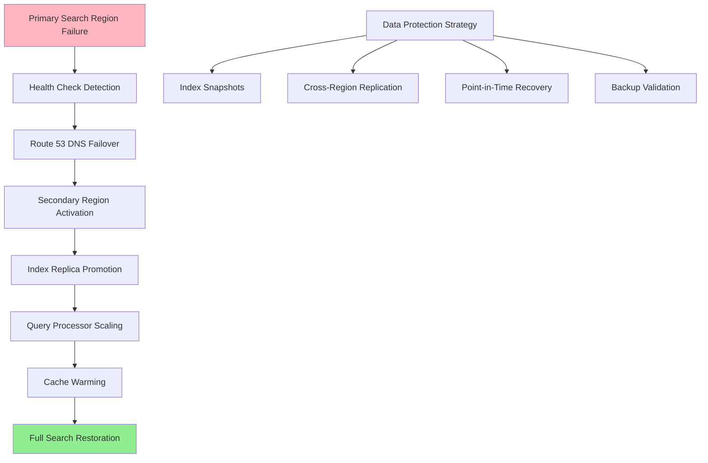

**RTO/RPO Targets:**
- **RTO (Recovery Time Objective)**: 5 minutes for basic search functionality
- **RPO (Recovery Point Objective)**: 15 minutes for index updates
- **Index Availability**: 99.999% for core search functionality
- **Data Retention**: 90 days for operational data, permanent for search index

## 8. Security Architecture

### 8.1 Security Layers

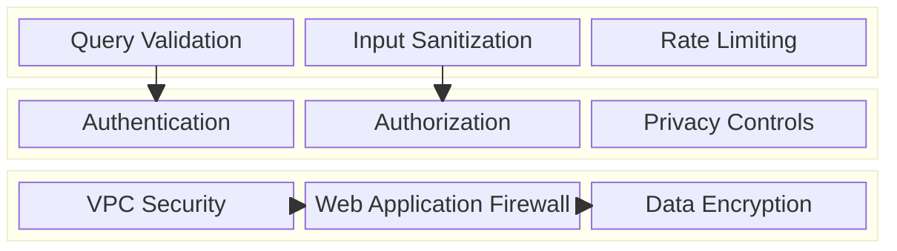

**Query Security:**
- **Input Validation**: Comprehensive validation of search queries
- **Injection Prevention**: Protection against search injection attacks
- **Rate Limiting**: User and IP-based rate limiting for abuse prevention
- **Query Filtering**: Content filtering and safe search capabilities

**Data Security:**
- **Encryption at Rest**: AES-256 encryption for all indexed content
- **Encryption in Transit**: TLS 1.3 for all API communications
- **Access Control**: Fine-grained permissions for search index access
- **Audit Logging**: Comprehensive logging of search queries and access

### 8.2 Privacy-Preserving Search Flow

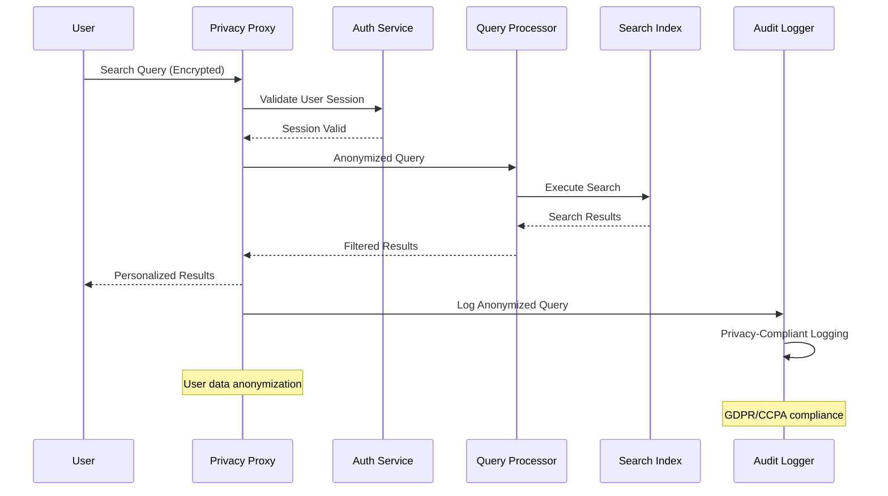

## 9. Monitoring & Observability

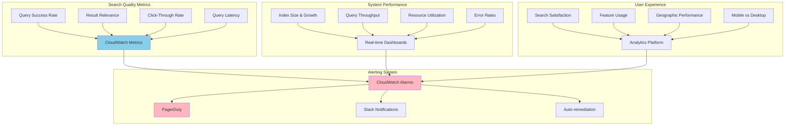

**Key Performance Indicators:**
- **Search Quality**: Result relevance, query success rate, user satisfaction
- **Performance**: Query latency, throughput, availability, error rates
- **Business Metrics**: Search volume, user engagement, feature adoption
- **Infrastructure**: Resource utilization, cost efficiency, scaling metrics

**Alerting Strategy:**
- **Critical**: Search unavailability, high error rates (>5%), security breaches
- **Warning**: Increased latency (>300ms), index update delays, capacity warnings
- **Info**: Query trend changes, performance optimizations, capacity planning

## 10. Cost Optimization

**Service-Level Cost Analysis:**
- **OpenSearch**: $15,000/month (large cluster with hot-warm-cold tiers)
- **EKS**: $8,000/month (query processing, 300 nodes with spot instances)
- **S3**: $5,000/month (index backups and crawled content storage)
- **DynamoDB**: $3,000/month (user data and query logs)
- **CloudFront**: $2,000/month (global search interface delivery)
- **ML Services**: $4,000/month (SageMaker for ranking models)
- **Data Transfer**: $3,000/month (cross-region and internet traffic)
- **Total Estimated**: ~$40,000/month for 1B queries/day

**Cost Optimization Strategies:**
- **Spot Instances**: 60% cost reduction for batch processing workloads
- **Index Tiering**: 50% storage cost savings with hot-warm-cold architecture
- **Reserved Capacity**: 40% savings on predictable OpenSearch workloads
- **Compression**: 70% reduction in storage and transfer costs
- **Query Caching**: 30% reduction in compute costs through result reuse

**Cost Monitoring:**
- **Budget Alerts**: Multi-tier alerts at 70%, 85%, and 100% of budget
- **Cost per Query**: Track cost efficiency metrics per search query
- **Resource Optimization**: Daily analysis of underutilized resources
- **Index Optimization**: Automated cleanup of low-value indexed content

## 11. Implementation Strategy

### 11.1 Migration/Deployment Plan

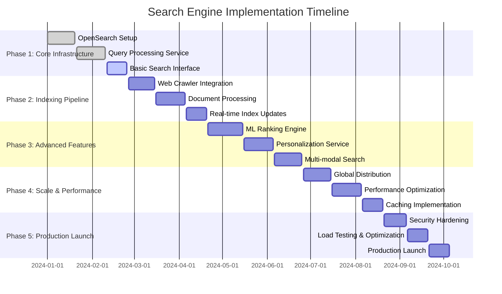

### 11.2 Technology Decisions & Trade-offs

**Search Engine Technology:**
- **OpenSearch vs Elasticsearch**: OpenSearch chosen for AWS integration and cost
- **Custom vs Off-the-shelf**: Hybrid approach with custom ranking and standard indexing
- **Real-time vs Batch**: Near real-time indexing with batch optimization
- **Monolithic vs Distributed**: Distributed architecture for independent scaling

**Machine Learning Decisions:**
- **Traditional vs Deep Learning**: Hybrid approach with traditional features and deep learning
- **Online vs Offline Learning**: Offline training with online feature updates
- **Model Complexity**: Balance between accuracy and inference latency
- **Personalization Approach**: Collaborative filtering combined with content-based recommendations

**Infrastructure Trade-offs:**
- **Cloud vs On-premise**: Full cloud deployment for global scalability
- **Managed vs Self-managed**: Managed services where possible for operational efficiency
- **Cost vs Performance**: Tiered architecture balancing cost and performance requirements
- **Consistency vs Availability**: Eventual consistency for better availability

**Future Evolution Path:**
- **AI Enhancement**: Large language models for better query understanding
- **Voice Search**: Advanced speech recognition and natural language processing
- **Visual Search**: Computer vision for image and video search capabilities
- **Semantic Search**: Knowledge graphs and semantic understanding

**Technical Debt & Improvement Areas:**
- **Index Optimization**: Advanced compression and storage optimization techniques
- **Query Understanding**: Enhanced natural language processing and intent recognition
- **Real-time Features**: Improved real-time personalization and trending detection
- **Global Compliance**: Enhanced support for regional search regulations and requirements
