# Ride-Sharing Service System Design Architecture

## 1. Executive Summary & Requirements

### System Overview
A comprehensive ride-sharing platform that connects riders with drivers, handling real-time location tracking, dynamic pricing, route optimization, and payment processing. The system supports millions of concurrent users with sub-second matching and real-time tracking capabilities.

### Functional Requirements
- **User Management**: Rider and driver registration, profiles, and verification
- **Real-time Matching**: Connect riders with nearby available drivers
- **Location Tracking**: Real-time GPS tracking for riders and drivers
- **Route Optimization**: Efficient routing and navigation with traffic consideration
- **Dynamic Pricing**: Surge pricing based on demand and supply
- **Trip Management**: Trip booking, tracking, and completion workflow
- **Payment Processing**: Secure payment handling with multiple payment methods
- **Rating System**: Bidirectional rating and feedback system
- **Trip History**: Complete trip records and analytics
- **Driver Earnings**: Driver compensation and payout management

### Non-Functional Requirements
- **Availability**: 99.99% uptime with global coverage
- **Latency**: <2 seconds for driver matching, <1 second for location updates
- **Scale**: 10M+ active users, 1M+ active drivers globally
- **Throughput**: 100K+ concurrent trips, 1M+ location updates per second
- **Accuracy**: <50m location accuracy, >95% successful trip completion
- **Compliance**: Regional transportation regulations and data privacy

### Key Constraints
- Real-time location processing at massive scale
- Efficient driver-rider matching algorithms
- Dynamic pricing without market manipulation
- Regulatory compliance across different regions

### Success Metrics
- 99.99% platform availability
- <30 seconds average driver matching time
- >4.5 average user rating
- <2% trip cancellation rate
- Support 100+ cities globally

## 2. High-Level Architecture Overview

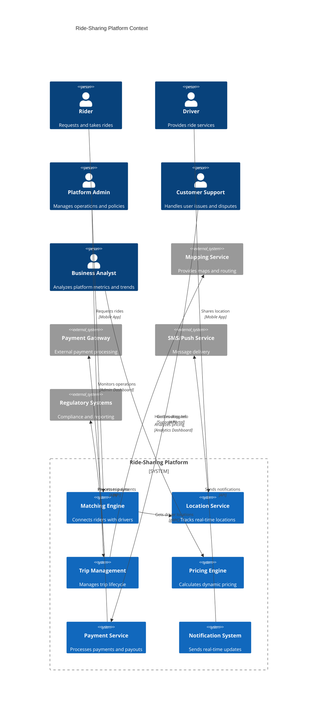

**Architectural Style Rationale**: Event-driven microservices with real-time data processing chosen for:
- Independent scaling of location tracking vs payment processing
- Real-time event processing for location updates and trip status
- Geographic distribution for global operations
- Technology specialization for different service concerns
- High availability and fault tolerance requirements

## 3. Detailed System Architecture

### 3.1 AWS Service Stack Selection

**Presentation Layer:**
- **CloudFront**: Global CDN for mobile apps and web interfaces
- **API Gateway**: Mobile API management with rate limiting
- **Route 53**: DNS with health checks and geographic routing

**Application Layer:**
- **EKS**: Kubernetes for core microservices
- **ECS Fargate**: Serverless containers for event processing
- **Lambda**: Real-time event processing and notifications

**Real-time Processing:**
- **Kinesis Data Streams**: Location updates and trip events
- **Kinesis Analytics**: Real-time analytics and monitoring
- **IoT Core**: Device connectivity for driver mobile apps
- **AppSync**: Real-time GraphQL for mobile applications

**Data Layer:**
- **DynamoDB**: User profiles, trip data, and real-time state
- **Aurora PostgreSQL**: Financial data, analytics, and reporting
- **ElastiCache Redis**: Session management and caching
- **MemoryDB**: Real-time location data and matching cache

**Geospatial:**
- **Location Service**: Geocoding, routing, and place indexing
- **OpenSearch**: Geospatial queries and driver search
- **Neptune**: Graph database for network analysis

**Storage Layer:**
- **S3**: Trip data archives, driver documents, and analytics
- **EFS**: Shared storage for ML models and batch processing

**Streaming/Messaging:**
- **MSK (Managed Kafka)**: High-throughput event streaming
- **SQS**: Asynchronous task processing
- **SNS**: Push notifications and alerts
- **EventBridge**: Event routing and integration

**Analytics & ML:**
- **SageMaker**: ML models for demand prediction and pricing
- **EMR**: Large-scale data processing for analytics
- **QuickSight**: Business intelligence dashboards
- **Athena**: Ad-hoc analytics on trip data

**Security:**
- **Cognito**: User authentication and mobile app security
- **WAF**: API protection and rate limiting
- **KMS**: Encryption for sensitive data
- **Secrets Manager**: API keys and database credentials

### 3.2 Component Architecture Diagram

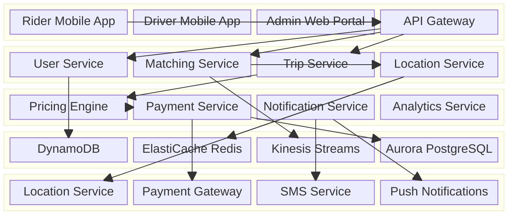

## 4. Data Architecture & Flow

### 4.1 Data Flow Diagrams

#### Ride Request and Matching Flow
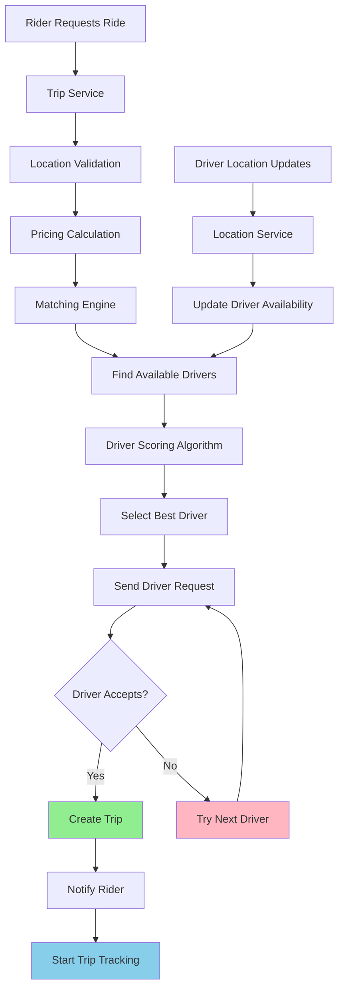

#### Real-time Location Tracking Flow
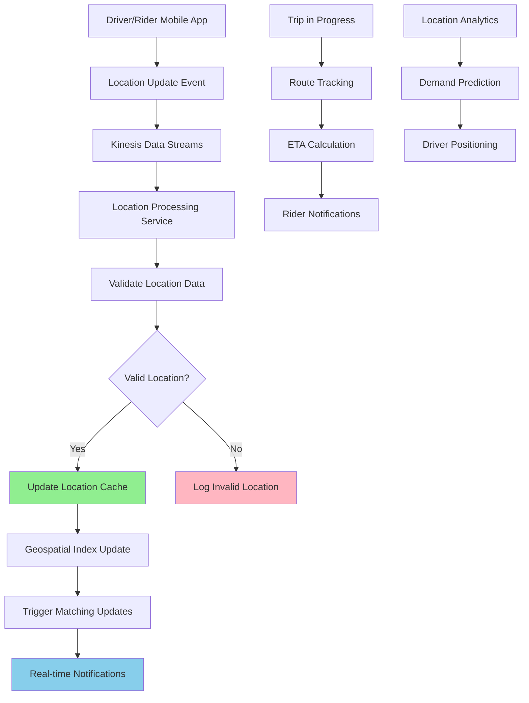

#### Dynamic Pricing and Payment Flow
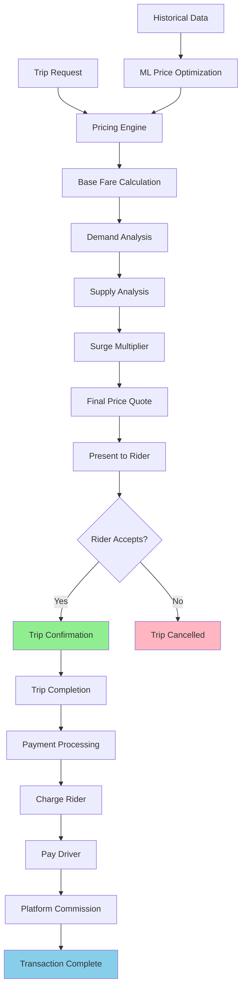

### 4.2 Database Design

#### User and Trip Management (DynamoDB)
```mermaid
erDiagram
    USERS {
        string user_id PK
        string user_type
        string email UK
        string phone_number
        json profile_data
        timestamp created_at
        string status
        json preferences
        number rating
    }
    
    DRIVERS {
        string driver_id PK
        string user_id FK
        string license_number
        json vehicle_info
        json documents
        string approval_status
        json location_data
        boolean is_available
        number earnings_total
    }
    
    TRIPS {
        string trip_id PK
        string rider_id FK
        string driver_id FK
        json pickup_location
        json dropoff_location
        timestamp requested_at
        timestamp started_at
        timestamp completed_at
        string status
        number fare_amount
        number distance_km
        json route_data
    }
    
    TRIP_EVENTS {
        string trip_id PK
        timestamp event_time SK
        string event_type
        json event_data
        string user_id
        json location_data
    }
    
    USERS ||--o{ DRIVERS : "can be driver"
    USERS ||--o{ TRIPS : "takes rides"
    DRIVERS ||--o{ TRIPS : "provides rides"
    TRIPS ||--o{ TRIP_EVENTS : "has events"
```

#### Financial and Analytics (Aurora PostgreSQL)
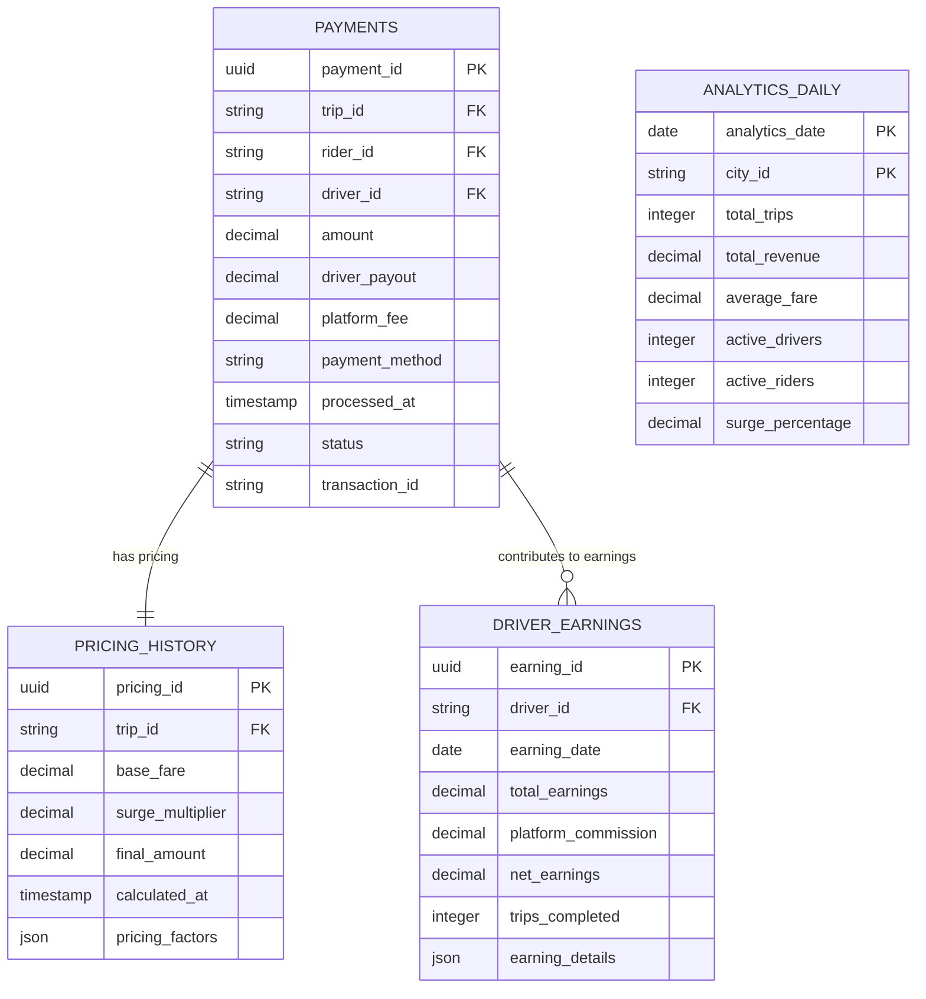

## 5. Detailed Component Design

### 5.1 Matching Engine Service

**Purpose & Responsibilities:**
- Match riders with optimal drivers based on proximity, ratings, and preferences
- Implement sophisticated matching algorithms considering multiple factors
- Handle high-volume matching requests with sub-second response times
- Manage driver availability and capacity optimization
- Support different ride types (economy, premium, shared rides)

**AWS Service Selection:**
- **EKS**: Kubernetes for auto-scaling matching workers
- **MemoryDB**: Ultra-fast in-memory database for real-time matching
- **OpenSearch**: Geospatial queries for driver location searches

**Scaling Characteristics:**
- Horizontal scaling based on request volume and geographic regions
- Geospatial partitioning for efficient location-based matching
- Connection pooling and async processing for high throughput
- Circuit breakers for handling driver unavailability

**Performance Considerations:**
- Sub-2-second matching target with 99th percentile optimization
- Efficient geospatial indexing and range queries
- Parallel processing of multiple matching criteria
- Caching of driver availability and location data

### 5.2 Location Service

**Purpose & Responsibilities:**
- Process millions of real-time location updates per second
- Maintain accurate driver and rider locations with minimal latency
- Provide geospatial queries for driver discovery
- Handle location privacy and data retention policies
- Support offline location caching and synchronization

**AWS Service Selection:**
- **Kinesis Data Streams**: High-throughput location event ingestion
- **Location Service**: AWS managed geospatial services
- **MemoryDB**: Real-time location caching with TTL management

**Scaling Characteristics:**
- Auto-scaling based on location update volume
- Sharding by geographic regions for optimal performance
- Efficient data structures for geospatial operations
- Batch processing for analytics and historical data

### 5.3 Pricing Engine Service

**Purpose & Responsibilities:**
- Calculate dynamic pricing based on real-time supply and demand
- Implement surge pricing algorithms with fairness constraints
- Provide transparent pricing estimates to users
- Support promotional pricing and discount codes
- Handle complex pricing rules for different markets

**Performance Considerations:**
- Real-time demand prediction using ML models
- Efficient pricing calculation with sub-second response times
- Historical data analysis for pricing optimization
- A/B testing framework for pricing strategies

### Critical User Journey Sequence Diagrams

#### Complete Ride Request Flow
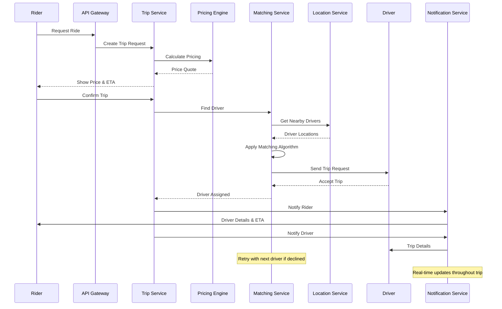

#### Real-time Trip Tracking
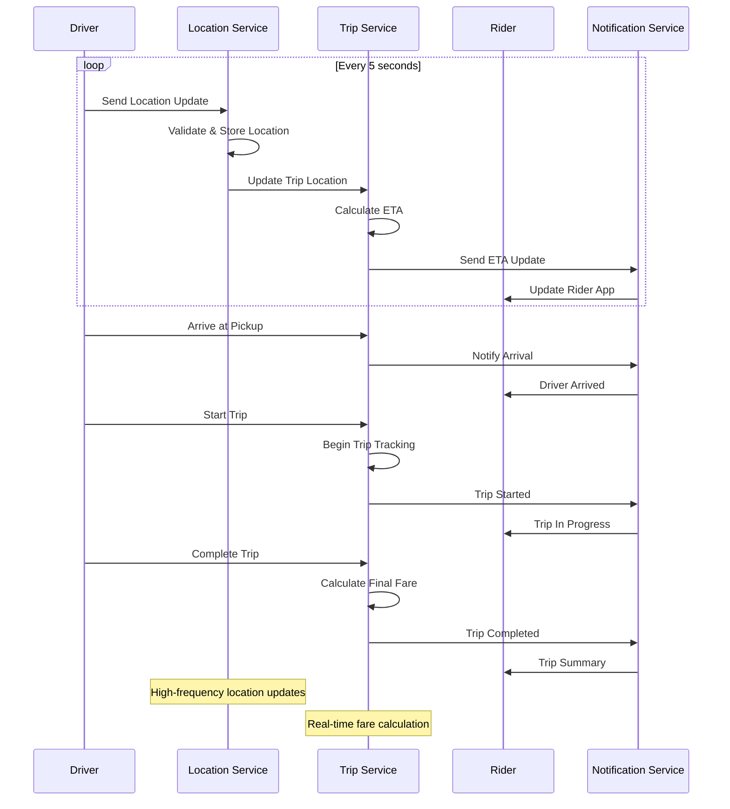

## 6. Scalability & Performance

### 6.1 Scaling Architecture

```mermaid
flowchart TD
    subgraph "Global Geographic Distribution"
        A[North America Region] --> B[Europe Region]
        A --> C[Asia-Pacific Region]
        A --> D[Latin America Region]
        E[Route 53 Geolocation] --> A
        E --> B
        E --> C
        E --> D
    end
    
    subgraph "City-Level Scaling"
        F[City Microservices] --> G[Driver Pool Management]
        G --> H[Demand Prediction]
        H --> I[Supply Optimization]
    end
    
    subgraph "Real-time Processing Scale"
        J[Kinesis Sharding] --> K[Location Processing]
        K --> L[Matching Workers]
        L --> M[Notification Fanout]
    end
    
    subgraph "Database Scaling"
        N[DynamoDB Auto Scaling] --> O[Global Tables]
        P[Aurora Auto Scaling] --> Q[Read Replicas]
        R[MemoryDB Cluster] --> S[Multi-AZ Replication]
    end
    
    style F fill:#87CEEB
    style J fill:#90EE90
    style N fill:#FFB6C1
```

### 6.2 Performance Optimization

**Real-time Performance:**
- **Location Processing**: Efficient geospatial indexing and range queries
- **Matching Optimization**: Pre-computed driver pools and smart filtering
- **Caching Strategy**: Multi-level caching for locations, pricing, and user data
- **Connection Management**: WebSocket connections for real-time updates

**Database Performance:**
- **Hot Data Optimization**: Keep active trip data in memory-based storage
- **Query Optimization**: Efficient indexes for geospatial and time-based queries
- **Read Replicas**: Geographic distribution for reduced query latency
- **Partitioning**: Time and location-based partitioning for large datasets

**Mobile App Performance:**
- **Offline Capabilities**: Local caching for poor network conditions
- **Efficient APIs**: GraphQL for flexible data fetching
- **Push Notifications**: Real-time updates without constant polling
- **Image Optimization**: Compressed images and progressive loading

## 7. Reliability & Fault Tolerance

### 7.1 High Availability Design

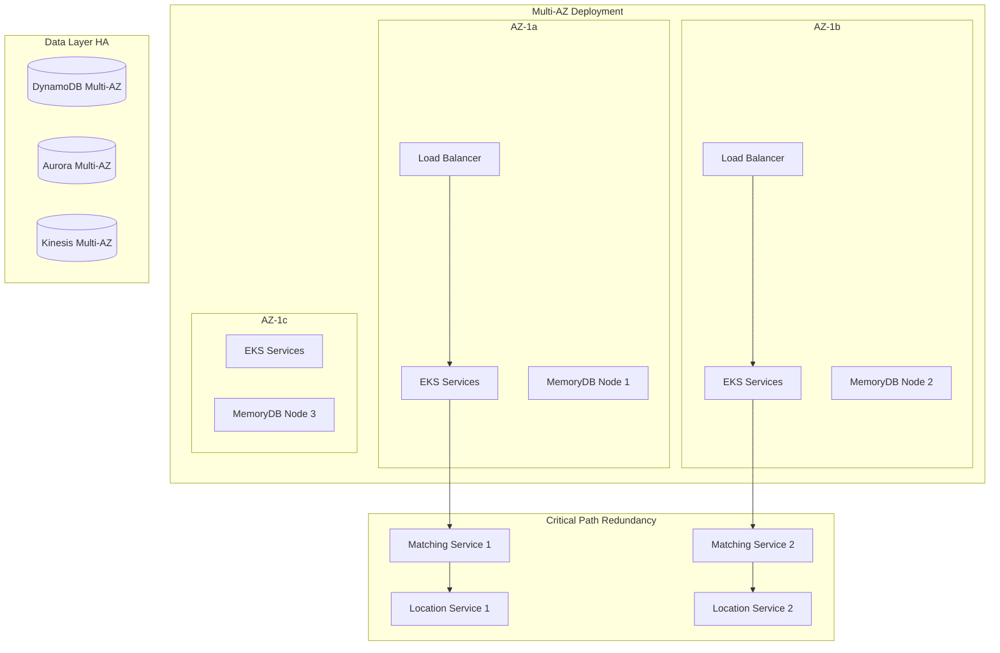

**Critical Path Protection:**
- **Matching Service**: Multiple instances with automatic failover
- **Location Service**: Redundant processing with conflict resolution
- **Payment Processing**: Idempotent operations with retry mechanisms
- **Trip State Management**: Consistent state across service failures

### 7.2 Disaster Recovery

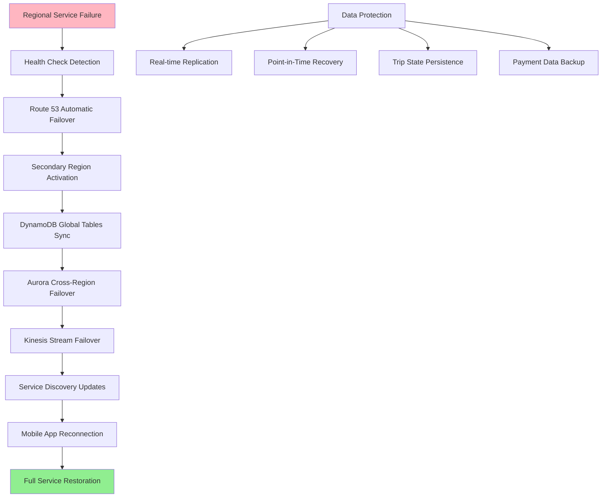

**RTO/RPO Targets:**
- **RTO (Recovery Time Objective)**: 2 minutes for critical services
- **RPO (Recovery Point Objective)**: 30 seconds for trip data
- **Trip Continuity**: 99.9% trip completion during failures
- **Data Consistency**: Strong consistency for financial transactions

## 8. Security Architecture

### 8.1 Security Layers

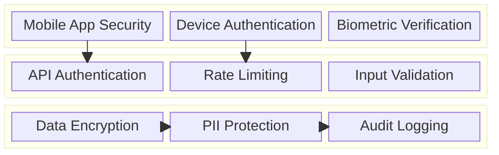

**Mobile Security:**
- **App Authentication**: Certificate pinning and app attestation
- **User Verification**: Multi-factor authentication and identity verification
- **Location Privacy**: Encrypted location data with access controls
- **Secure Communication**: End-to-end encryption for sensitive data

**Data Protection:**
- **PII Encryption**: Advanced encryption for personal information
- **Payment Security**: PCI DSS compliance for payment data
- **Location Data**: GDPR-compliant location data handling
- **Driver Verification**: Background checks and document verification

### 8.2 User Authentication and Safety Flow

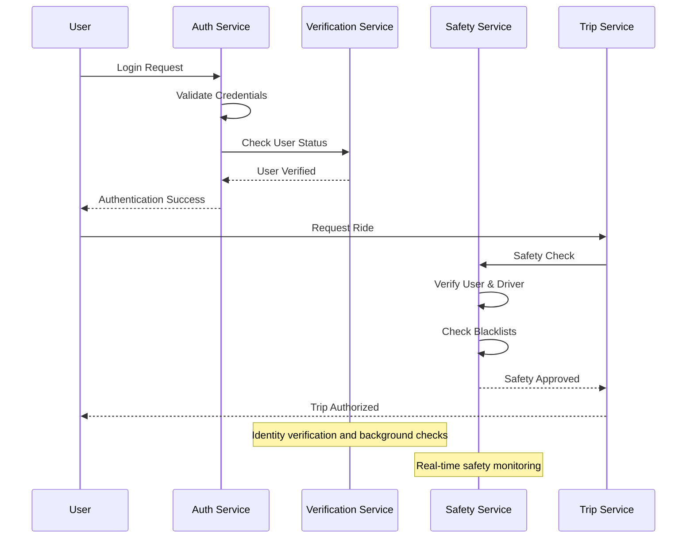

## 9. Monitoring & Observability

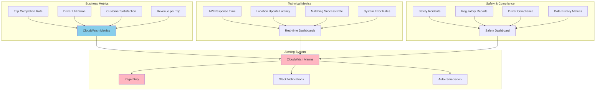

**Key Performance Indicators:**
- **User Experience**: Trip completion rate, driver arrival time, app responsiveness
- **Business Health**: Revenue growth, driver retention, market penetration
- **System Performance**: API latency, matching efficiency, error rates
- **Safety Metrics**: Incident rates, driver verification status, compliance scores

**Alerting Strategy:**
- **Critical**: System outages, payment failures, safety incidents
- **Warning**: High latency, driver shortages, unusual patterns
- **Info**: Performance trends, capacity planning, business metrics

## 10. Cost Optimization

**Service-Level Cost Analysis:**
- **EKS**: $12,000/month (core services, 400 nodes with spot instances)
- **DynamoDB**: $8,000/month (user and trip data, global tables)
- **Kinesis**: $5,000/month (location streams and analytics)
- **MemoryDB**: $4,000/month (real-time caching and matching)
- **Aurora**: $3,000/month (financial data and analytics)
- **Location Service**: $2,000/month (geocoding and routing)
- **Data Transfer**: $3,000/month (global distribution and mobile apps)
- **Total Estimated**: ~$37,000/month for 1M active users

**Cost Optimization Strategies:**
- **Spot Instances**: 60% cost reduction for batch processing workloads
- **Reserved Capacity**: 40% savings on predictable database workloads
- **Efficient Data Storage**: Intelligent tiering and compression for trip data
- **Regional Optimization**: Deploy services closer to user bases
- **Resource Right-sizing**: Continuous optimization based on usage patterns

**Cost Monitoring:**
- **Budget Alerts**: Multi-tier alerts at 75%, 90%, and 100% of budget
- **Cost per Trip**: Track unit economics and profitability metrics
- **Resource Utilization**: Daily analysis of underutilized resources
- **Geographic Cost Analysis**: Optimize costs by region and city

## 11. Implementation Strategy

### 11.1 Migration/Deployment Plan

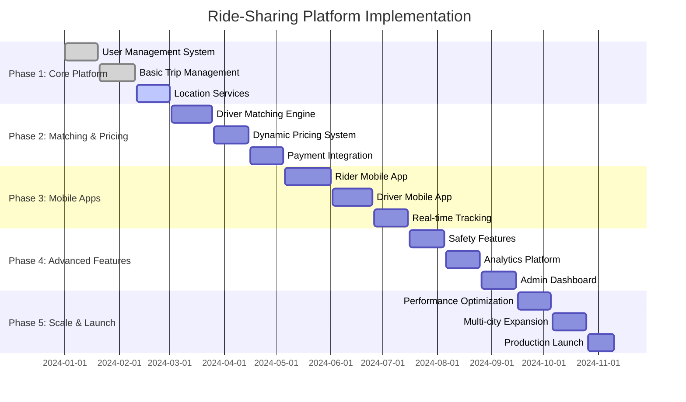

### 11.2 Technology Decisions & Trade-offs

**Real-time Processing Decisions:**
- **Kinesis vs Kafka**: Kinesis chosen for managed service benefits and AWS integration
- **WebSocket vs Polling**: WebSocket for real-time updates with polling fallback
- **In-memory vs Database**: MemoryDB for ultra-low latency location processing
- **Push vs Pull**: Push notifications for immediate user updates

**Geospatial Technology:**
- **AWS Location Service vs Custom**: AWS Location Service for managed geospatial capabilities
- **PostGIS vs DynamoDB**: DynamoDB for scalability, PostGIS for complex queries
- **Client vs Server Routing**: Hybrid approach with server validation
- **Map Provider**: Multi-provider strategy for redundancy and cost optimization

**Mobile Architecture:**
- **Native vs Cross-platform**: Native apps for performance-critical features
- **Offline Capabilities**: Local storage and sync for poor connectivity areas
- **Real-time Updates**: WebSocket connections with efficient reconnection
- **Battery Optimization**: Smart location tracking to minimize battery drain

**Future Evolution Path:**
- **Autonomous Vehicles**: Integration with self-driving car platforms
- **Multi-modal Transportation**: Integration with public transit and micro-mobility
- **AI Enhancement**: Advanced demand prediction and route optimization
- **Blockchain Integration**: Decentralized payment and reputation systems

**Technical Debt & Improvement Areas:**
- **Advanced Matching**: Machine learning-based matching with preference learning
- **Predictive Analytics**: Enhanced demand forecasting and driver positioning
- **Global Expansion**: Multi-currency, multi-language, and regulatory compliance
- **Sustainability Features**: Carbon footprint tracking and electric vehicle incentives
