# Notification System Design Architecture

## 1. Executive Summary & Requirements

### System Overview
A comprehensive notification system that delivers push notifications, emails, SMS, and in-app messages to millions of users reliably across multiple channels. The system supports real-time delivery, personalization, scheduling, and comprehensive analytics with 99.99% delivery reliability.

### Functional Requirements
- **Multi-channel Delivery**: Push notifications, email, SMS, in-app messages, and webhooks
- **Real-time Notifications**: Instant delivery for time-sensitive messages
- **Scheduled Notifications**: Delayed and recurring notification scheduling
- **Personalization**: User preferences, localization, and targeted messaging
- **Template Management**: Dynamic content templates with variable substitution
- **Delivery Tracking**: Read receipts, click tracking, and engagement analytics
- **A/B Testing**: Campaign optimization and message testing
- **Rate Limiting**: Prevent spam and respect user preferences
- **Retry Mechanisms**: Guaranteed delivery with intelligent retry logic

### Non-Functional Requirements
- **Availability**: 99.99% uptime with global distribution
- **Latency**: <500ms for notification processing, <2s for delivery
- **Scale**: 1B+ notifications per day, 10M+ concurrent deliveries
- **Throughput**: 100K+ notifications per second peak
- **Reliability**: 99.9% successful delivery rate across all channels
- **Compliance**: GDPR, CAN-SPAM, and regional privacy regulations

### Key Constraints
- Respect user notification preferences and opt-out requests
- Handle different time zones and delivery windows
- Manage rate limits from external providers (APNs, FCM, SMS)
- Ensure message ordering for critical notifications

### Success Metrics
- 99.99% system availability
- 99.9% notification delivery success rate
- <500ms average processing latency
- >85% user engagement with notifications
- Support 50+ languages and regions

## 2. High-Level Architecture Overview

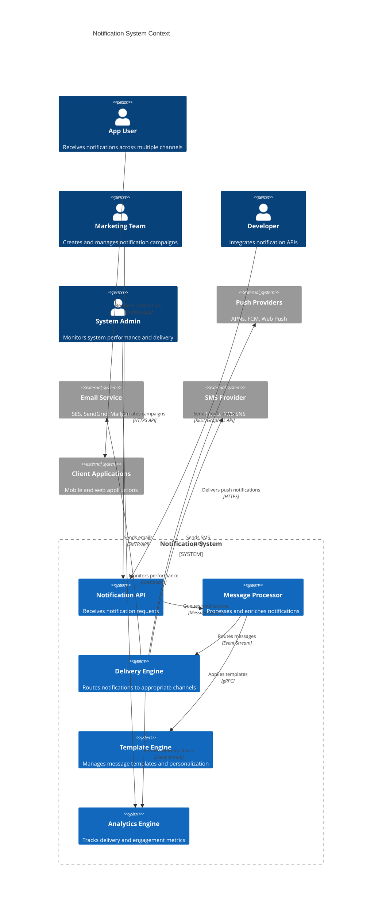

**Architectural Style Rationale**: Event-driven microservices architecture chosen for:
- Independent scaling of different notification channels
- Fault isolation between delivery mechanisms
- Flexible routing and processing pipeline
- Support for multiple external service providers
- Real-time processing with batch optimization capabilities

## 3. Detailed System Architecture

### 3.1 AWS Service Stack Selection

**Presentation Layer:**
- **API Gateway**: RESTful APIs with rate limiting and authentication
- **CloudFront**: Global CDN for notification management interfaces
- **Route 53**: DNS management with health checks

**Application Layer:**
- **EKS**: Kubernetes for notification processing services
- **Lambda**: Serverless functions for event processing and webhooks
- **ECS Fargate**: Containerized services for template processing

**Messaging & Queuing:**
- **SQS**: Primary message queuing with dead letter queues
- **SNS**: Fan-out notifications and mobile push delivery
- **EventBridge**: Event routing and third-party integrations
- **MSK (Managed Kafka)**: High-throughput event streaming

**Communication Services:**
- **SES**: Email delivery with bounce and complaint handling
- **SNS**: SMS delivery and mobile push notifications
- **Pinpoint**: Multi-channel campaign management and analytics
- **Connect**: Voice notifications and IVR integration

**Data Layer:**
- **DynamoDB**: User preferences, notification logs, and templates
- **Aurora PostgreSQL**: Analytics, campaign data, and reporting
- **ElastiCache Redis**: Rate limiting, caching, and session management
- **OpenSearch**: Notification search and analytics

**Storage Layer:**
- **S3**: Template assets, attachment storage, and data archival
- **EFS**: Shared storage for processing workflows

**Analytics & ML:**
- **Kinesis Analytics**: Real-time notification analytics
- **EMR**: Large-scale data processing for insights
- **SageMaker**: ML models for send-time optimization
- **QuickSight**: Business intelligence dashboards

**Security:**
- **Cognito**: User authentication and preference management
- **KMS**: Encryption for sensitive notification content
- **Secrets Manager**: Third-party API keys and credentials
- **WAF**: API protection and rate limiting

**Monitoring:**
- **CloudWatch**: Comprehensive metrics and alerting
- **X-Ray**: Distributed tracing for notification flows
- **CloudTrail**: Audit logging for compliance

### 3.2 Component Architecture Diagram

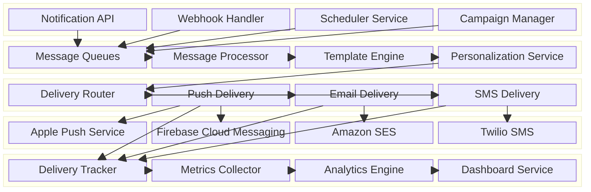

## 4. Data Architecture & Flow

### 4.1 Data Flow Diagrams

#### Real-time Notification Processing Flow
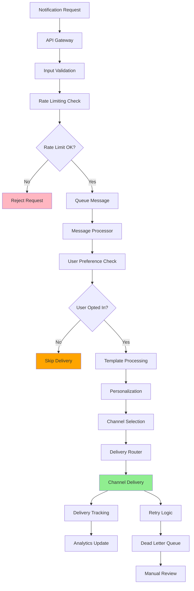

#### Campaign Notification Flow
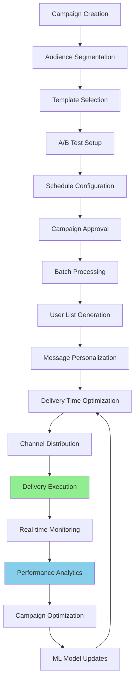

#### Multi-channel Delivery Coordination
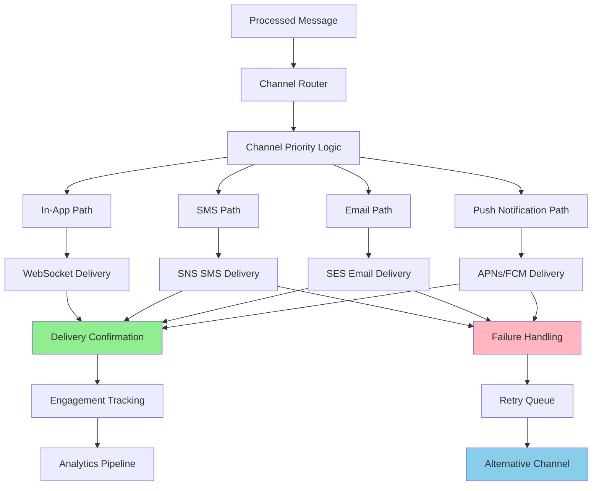

### 4.2 Database Design

#### Notification Management (DynamoDB)
```mermaid
erDiagram
    NOTIFICATIONS {
        string notification_id PK
        string user_id
        string channel
        string status
        text message_content
        json template_data
        timestamp created_at
        timestamp scheduled_at
        timestamp delivered_at
        string campaign_id
        json metadata
    }
    
    USER_PREFERENCES {
        string user_id PK
        string channel SK
        boolean enabled
        json preferences
        timestamp updated_at
        string timezone
        json quiet_hours
    }
    
    TEMPLATES {
        string template_id PK
        string template_name
        text content
        json variables
        string channel_type
        string language
        timestamp created_at
        boolean is_active
    }
    
    CAMPAIGNS {
        string campaign_id PK
        string campaign_name
        string template_id FK
        json audience_criteria
        timestamp start_time
        timestamp end_time
        string status
        json ab_test_config
    }
    
    NOTIFICATIONS ||--|| USER_PREFERENCES : "respects preferences"
    NOTIFICATIONS ||--|| TEMPLATES : "uses template"
    NOTIFICATIONS ||--o{ CAMPAIGNS : "belongs to campaign"
```

#### Analytics and Reporting (Aurora PostgreSQL)
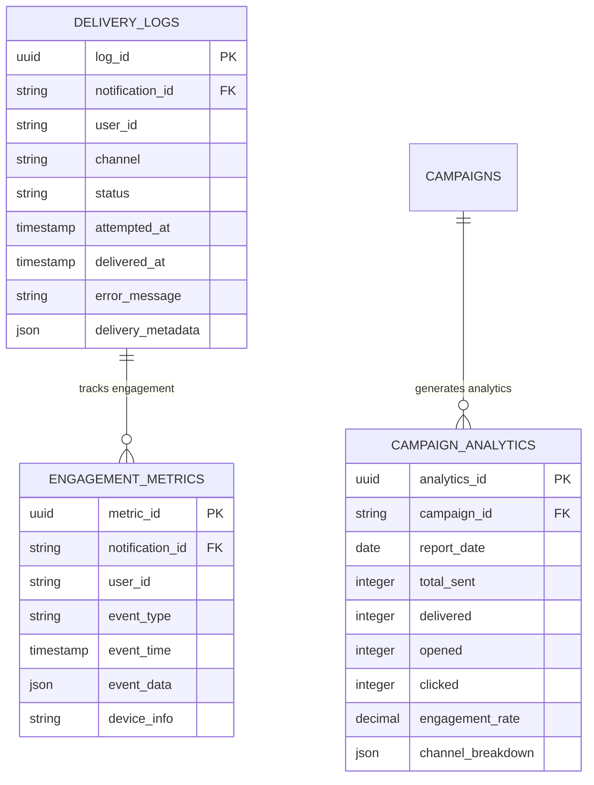

## 5. Detailed Component Design

### 5.1 Message Processor Service

**Purpose & Responsibilities:**
- Process incoming notification requests with validation
- Apply user preferences and opt-out rules
- Enrich messages with personalization data
- Handle message templating and localization
- Implement rate limiting and spam prevention

**AWS Service Selection:**
- **EKS**: Kubernetes for auto-scaling message processors
- **SQS**: Reliable message queuing with visibility timeout
- **DynamoDB**: Fast user preference lookups

**Scaling Characteristics:**
- Auto-scaling based on queue depth and processing latency
- Parallel processing with configurable concurrency limits
- Batch processing optimization for campaign messages
- Circuit breakers for external service dependencies

**Performance Considerations:**
- Sub-500ms message processing target
- Efficient caching of user preferences and templates
- Parallel template rendering for personalization
- Optimized database queries with connection pooling

### 5.2 Delivery Engine Service

**Purpose & Responsibilities:**
- Route messages to appropriate delivery channels
- Handle external provider integrations (APNs, FCM, SES)
- Implement retry logic with exponential backoff
- Track delivery status and handle failures
- Support multiple providers per channel for redundancy

**AWS Service Selection:**
- **Lambda**: Serverless delivery functions for each channel
- **SNS**: Native AWS push notification delivery
- **SES**: Email delivery with bounce handling
- **EventBridge**: Event-driven delivery coordination

**Scaling Characteristics:**
- Independent scaling per delivery channel
- Lambda concurrency limits based on provider rate limits
- Automatic failover between multiple providers
- Dead letter queues for failed delivery attempts

### 5.3 Analytics Engine Service

**Purpose & Responsibilities:**
- Collect and process delivery and engagement metrics
- Generate real-time dashboards and reports
- Provide campaign performance analytics
- Support A/B testing and optimization insights
- Handle compliance reporting and audit trails

**Performance Considerations:**
- Real-time metric collection with batched processing
- Time-series data optimization for trend analysis
- Efficient aggregation queries for dashboard performance
- Data retention policies for compliance and cost optimization

### Critical User Journey Sequence Diagrams

#### Real-time Notification Delivery
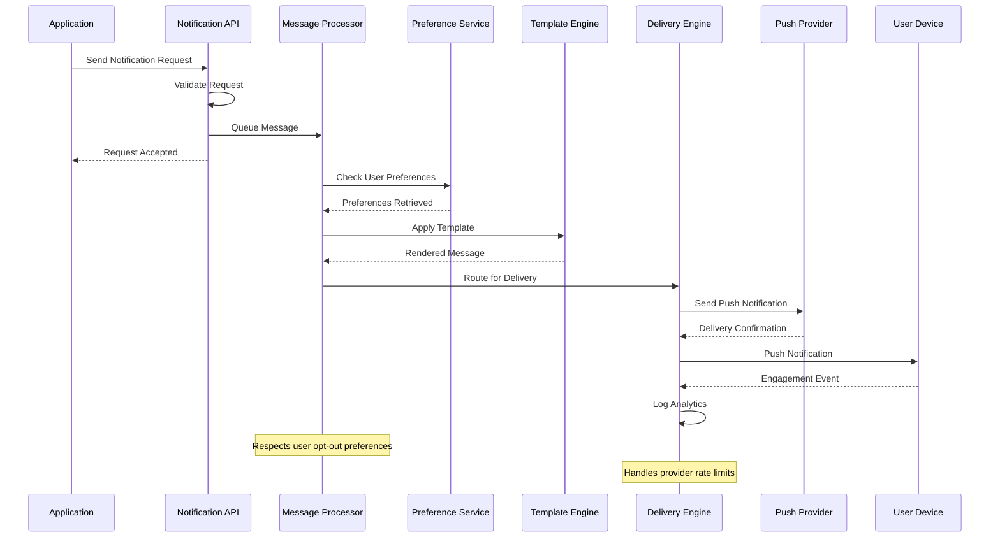

#### Campaign Notification Processing
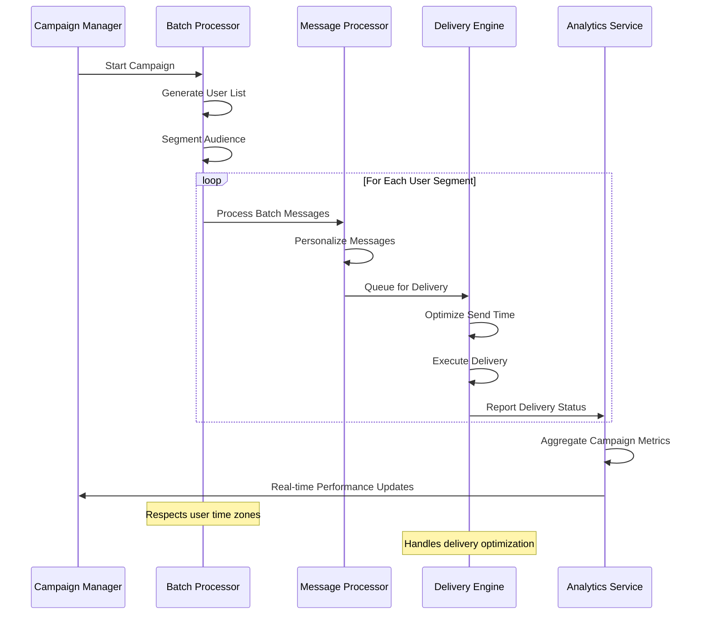

## 6. Scalability & Performance

### 6.1 Scaling Architecture

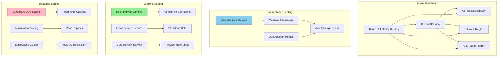

### 6.2 Performance Optimization

**Processing Performance:**
- **Batch Processing**: Group similar notifications for efficient processing
- **Template Caching**: Cache rendered templates to reduce processing time
- **Connection Pooling**: Reuse database connections across requests
- **Parallel Processing**: Process multiple notifications concurrently

**Delivery Optimization:**
- **Send-Time Optimization**: ML-based optimal delivery time prediction
- **Channel Prioritization**: Intelligent channel selection based on user behavior
- **Rate Limit Management**: Respect external provider rate limits
- **Retry Optimization**: Exponential backoff with jitter for failed deliveries

**Caching Strategy:**
- **User Preferences**: Cache frequently accessed user settings
- **Template Data**: Cache processed templates and personalization data
- **Provider Status**: Cache external provider availability and rate limits
- **Analytics Data**: Cache aggregated metrics for dashboard performance

## 7. Reliability & Fault Tolerance

### 7.1 High Availability Design

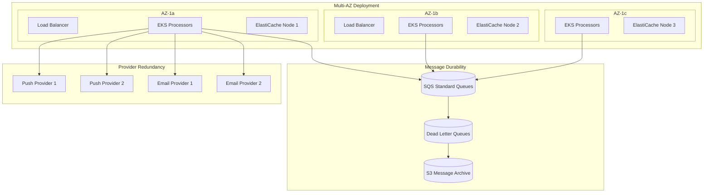

**Delivery Guarantees:**
- **At-Least-Once Delivery**: Message persistence with retry mechanisms
- **Idempotency**: Duplicate detection and handling
- **Provider Failover**: Automatic failover between multiple providers
- **Message Durability**: SQS message persistence and dead letter queues

### 7.2 Disaster Recovery

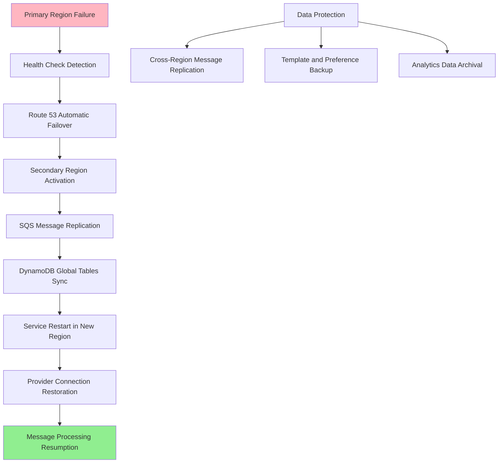

**RTO/RPO Targets:**
- **RTO (Recovery Time Objective)**: 5 minutes for notification processing
- **RPO (Recovery Point Objective)**: 1 minute for message data
- **Message Persistence**: 99.99% message durability guarantee
- **Cross-Region Sync**: Real-time replication for critical notification data

## 8. Security Architecture

### 8.1 Security Layers

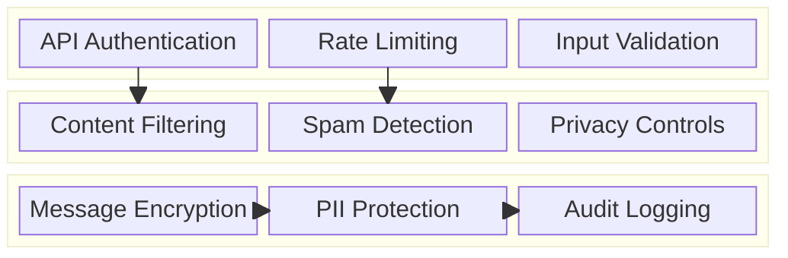

**Content Security:**
- **Spam Prevention**: ML-based spam detection and content filtering
- **Content Validation**: Message content sanitization and validation
- **Privacy Protection**: User data anonymization and GDPR compliance
- **Opt-out Management**: Comprehensive unsubscribe and preference management

**Data Security:**
- **Encryption in Transit**: TLS 1.3 for all API communications
- **Encryption at Rest**: AES-256 encryption for stored messages and user data
- **Key Management**: KMS-based key rotation and management
- **Access Control**: IAM roles with least privilege principles

### 8.2 Privacy and Compliance Flow

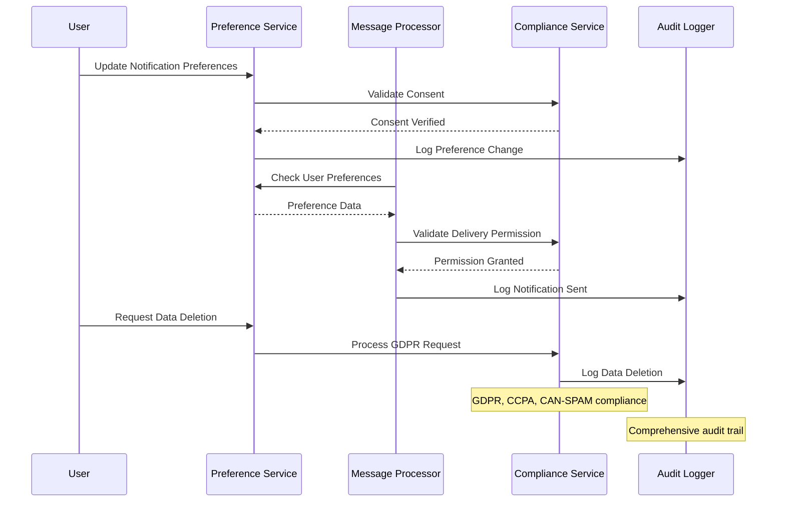

## 9. Monitoring & Observability

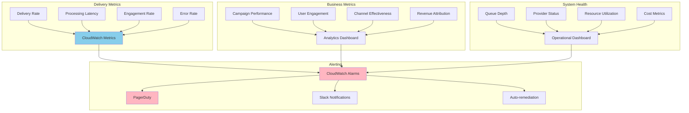

**Key Performance Indicators:**
- **Delivery Performance**: Success rate, latency, throughput
- **User Engagement**: Open rates, click rates, conversion rates
- **System Health**: Queue depth, error rates, resource utilization
- **Business Impact**: Campaign ROI, user retention, revenue attribution

**Alerting Strategy:**
- **Critical**: System outages, delivery failures >5%, security breaches
- **Warning**: High latency, provider issues, capacity warnings
- **Info**: Performance trends, engagement insights, optimization opportunities

## 10. Cost Optimization

**Service-Level Cost Analysis:**
- **SQS**: $2,000/month (1B messages, standard queues)
- **Lambda**: $1,500/month (delivery functions, 100M invocations)
- **SNS**: $1,000/month (push notifications and SMS)
- **SES**: $500/month (email delivery, 10M emails)
- **DynamoDB**: $1,200/month (preferences and logs)
- **EKS**: $2,000/month (processing services, 20 nodes)
- **Data Transfer**: $800/month (cross-region and external)
- **Total Estimated**: ~$9,000/month for 100M notifications/day

**Cost Optimization Strategies:**
- **Message Batching**: Reduce per-message costs through batching
- **Provider Optimization**: Choose cost-effective providers per region
- **Data Retention**: Implement lifecycle policies for log data
- **Reserved Capacity**: Use reserved instances for predictable workloads
- **Compression**: Compress message payloads to reduce transfer costs

**Cost Monitoring:**
- **Budget Alerts**: Multi-tier alerts at 80%, 95%, and 100% of budget
- **Cost per Notification**: Track unit economics across channels
- **Provider Cost Analysis**: Compare costs across different providers
- **Resource Optimization**: Daily analysis of underutilized resources

## 11. Implementation Strategy

### 11.1 Migration/Deployment Plan

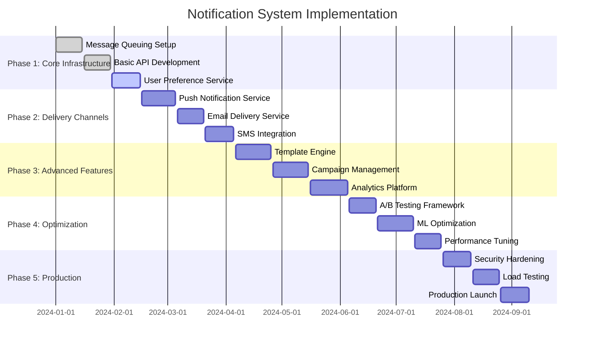

### 11.2 Technology Decisions & Trade-offs

**Messaging Architecture:**
- **SQS vs Kafka**: SQS chosen for managed service benefits and AWS integration
- **Push vs Pull**: Push-based delivery for real-time requirements
- **Synchronous vs Asynchronous**: Asynchronous processing for scalability
- **Single vs Multi-Queue**: Multiple queues for different priority levels

**Delivery Strategy:**
- **Direct Integration vs Aggregator**: Direct integration for better control
- **Single vs Multi-Provider**: Multi-provider approach for redundancy
- **Real-time vs Batch**: Hybrid approach based on message urgency
- **Template Location**: Server-side templating for security and consistency

**Data Architecture:**
- **SQL vs NoSQL**: DynamoDB for user preferences, PostgreSQL for analytics
- **Hot vs Cold Storage**: Tiered storage based on data access patterns
- **Real-time vs Batch Analytics**: Real-time for operational, batch for insights
- **Data Retention**: Configurable retention based on compliance requirements

**Future Evolution Path:**
- **AI Enhancement**: Advanced personalization and send-time optimization
- **Rich Media**: Support for interactive and rich media notifications
- **Voice Notifications**: Integration with voice assistants and IVR systems
- **Blockchain**: Decentralized notification delivery and verification

**Technical Debt & Improvement Areas:**
- **Advanced Personalization**: ML-based content optimization and targeting
- **Cross-Channel Orchestration**: Intelligent multi-channel campaign coordination
- **Real-time Analytics**: Enhanced real-time performance monitoring and optimization
- **Global Compliance**: Advanced support for regional privacy regulations
