# Distributed Cache System Design Architecture

## 1. Executive Summary & Requirements

### System Overview
A high-performance distributed caching system that provides sub-millisecond data access with data consistency, fault tolerance, and horizontal scalability. The system supports various data structures, automatic scaling, and intelligent cache management policies similar to Redis Cluster or Memcached.

### Functional Requirements
- **Key-Value Operations**: GET, SET, DELETE with O(1) complexity
- **Data Structures**: Strings, Lists, Sets, Sorted Sets, Hashes, Bitmaps
- **Expiration Policies**: TTL-based expiration with configurable policies
- **Persistence Options**: In-memory only, periodic snapshots, append-only logs
- **Clustering**: Automatic sharding and replication across nodes
- **Consistency Models**: Strong, eventual, and session consistency options
- **Atomic Operations**: Multi-key transactions and atomic operations
- **Pub/Sub Messaging**: Real-time messaging capabilities
- **Memory Management**: Intelligent eviction policies (LRU, LFU, Random)

### Non-Functional Requirements
- **Availability**: 99.99% uptime with automatic failover
- **Latency**: <1ms for GET operations, <2ms for SET operations
- **Throughput**: 1M+ operations per second per node
- **Scale**: Support for 1000+ nodes in a single cluster
- **Memory Efficiency**: >90% memory utilization with minimal fragmentation
- **Durability**: Configurable durability guarantees

### Key Constraints
- Maintain cache coherency across distributed nodes
- Handle network partitions gracefully
- Minimize memory overhead and fragmentation
- Support hot key scenarios without performance degradation

### Success Metrics
- 99.99% availability with <1 second failover time
- <1ms P99 latency for read operations
- >1M QPS sustained throughput per cluster
- <5% memory fragmentation
- 99.9% data consistency across replicas

## 2. High-Level Architecture Overview

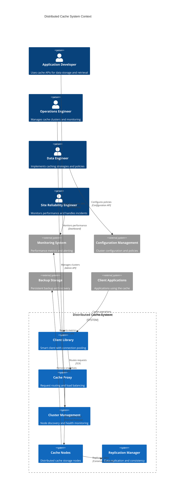

**Architectural Style Rationale**: Distributed peer-to-peer architecture with smart clients chosen for:
- Horizontal scalability without single points of failure
- Low-latency direct client-to-node communication
- Automatic sharding and replication management
- Fault tolerance with automatic failover capabilities
- Flexible consistency models based on use case requirements

## 3. Detailed System Architecture

### 3.1 AWS Service Stack Selection

**Compute Layer:**
- **EC2**: High-memory instances (R6g, X2gd) for cache nodes
- **EKS**: Kubernetes orchestration for cache management services
- **Lambda**: Serverless functions for monitoring and automation

**Networking:**
- **VPC**: Isolated network with optimized instance placement
- **Placement Groups**: Cluster placement for low-latency communication
- **Enhanced Networking**: SR-IOV for high-performance networking
- **Elastic Load Balancer**: Application load balancing for proxy tier

**Storage:**
- **Instance Store**: High-performance local SSD storage for persistence
- **EBS**: gp3 volumes for configuration and backup data
- **S3**: Long-term backup storage and disaster recovery
- **EFS**: Shared configuration and monitoring data

**Monitoring & Management:**
- **CloudWatch**: Comprehensive metrics and custom dashboards
- **Systems Manager**: Configuration management and automation
- **X-Ray**: Distributed tracing for cache operations
- **Config**: Configuration compliance and drift detection

**Security:**
- **Security Groups**: Network-level access control
- **IAM**: Fine-grained access control for management operations
- **KMS**: Encryption key management for data at rest
- **Secrets Manager**: Secure credential storage

**Data & Analytics:**
- **Kinesis**: Real-time metrics streaming
- **EMR**: Large-scale analytics on cache usage patterns
- **QuickSight**: Performance analytics and reporting
- **Athena**: Ad-hoc queries on cache metrics

### 3.2 Component Architecture Diagram

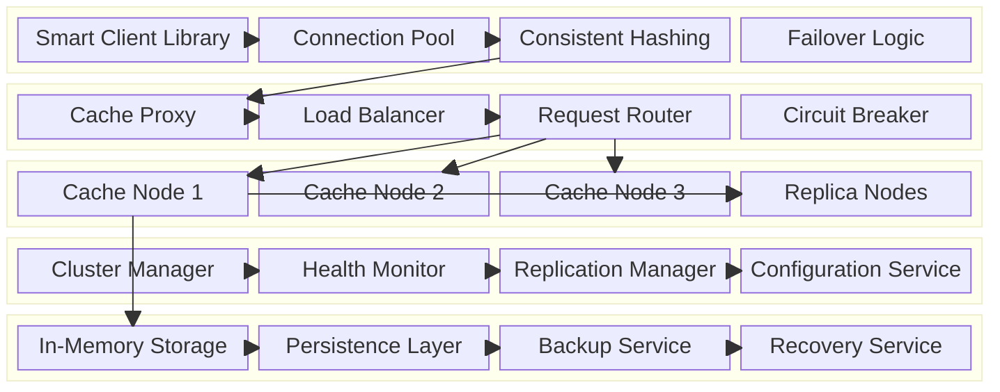

## 4. Data Architecture & Flow

### 4.1 Data Flow Diagrams

#### Cache Read Operation Flow
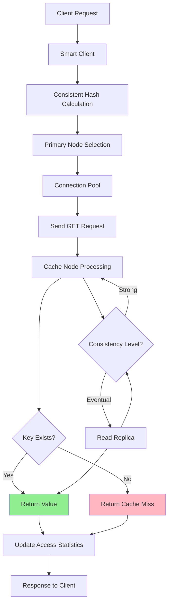

#### Cache Write Operation Flow
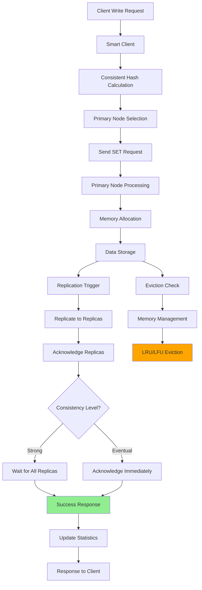

#### Cluster Rebalancing Flow
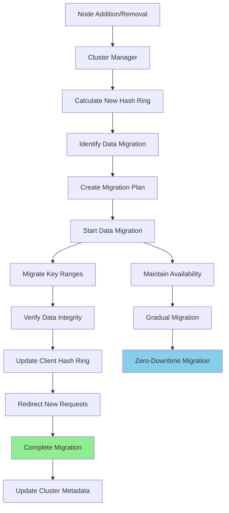

### 4.2 Database Design

#### Cache Node Internal Structure
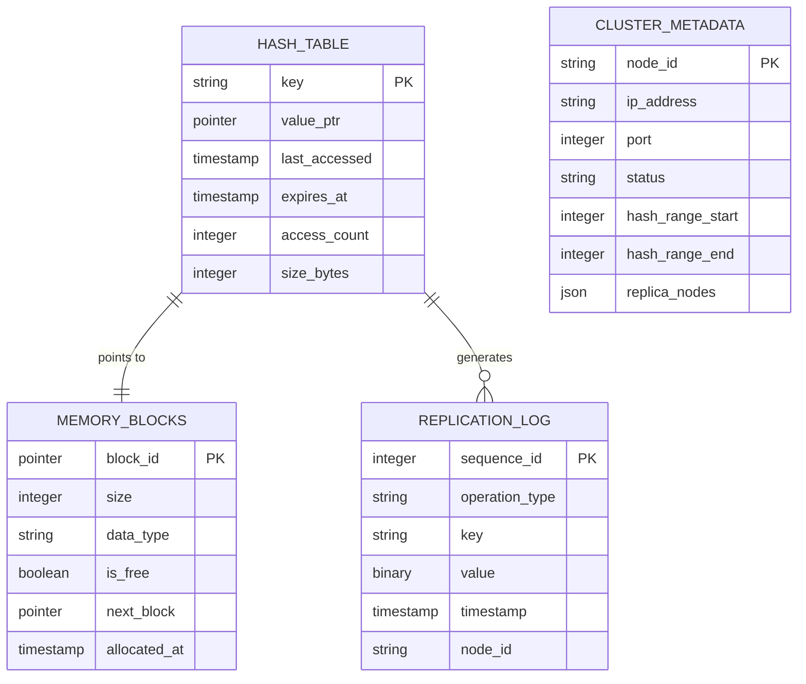

#### Cluster Management Schema
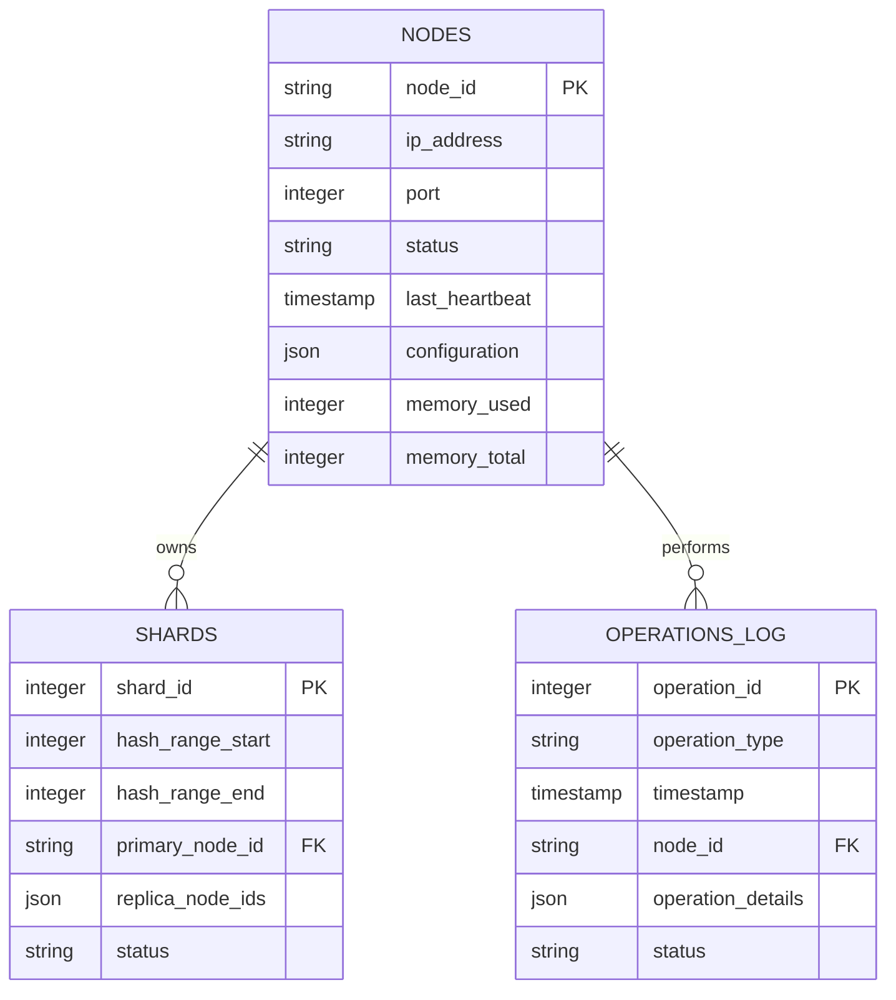

## 5. Detailed Component Design

### 5.1 Cache Node Service

**Purpose & Responsibilities:**
- Store and retrieve key-value data with sub-millisecond latency
- Implement various data structures (strings, lists, sets, hashes)
- Handle memory management and eviction policies
- Maintain replication logs for data consistency
- Process atomic operations and transactions

**Memory Management:**
- **Slab Allocation**: Pre-allocated memory chunks to reduce fragmentation
- **Jemalloc Integration**: Advanced memory allocator for efficiency
- **Copy-on-Write**: Efficient memory usage for replicated data
- **Compression**: Optional compression for large values

**Data Structures:**
- **Hash Tables**: O(1) key-value operations with Robin Hood hashing
- **Skip Lists**: Efficient sorted data structures for ranges
- **Radix Trees**: Memory-efficient string storage
- **Bloom Filters**: Probabilistic data structures for existence checks

### 5.2 Replication Manager Service

**Purpose & Responsibilities:**
- Coordinate data replication across cluster nodes
- Implement consistency protocols (eventual, strong consistency)
- Handle conflict resolution for concurrent updates
- Manage replica placement and failover scenarios
- Monitor replication lag and performance

**Consistency Models:**
- **Eventual Consistency**: Asynchronous replication with conflict resolution
- **Strong Consistency**: Synchronous replication with consensus protocols
- **Session Consistency**: Consistent reads within client sessions
- **Monotonic Reads**: Guarantee monotonic read consistency

**Replication Strategies:**
- **Master-Slave**: Primary node handles writes, replicas handle reads
- **Multi-Master**: Multiple nodes can handle writes with conflict resolution
- **Chain Replication**: Sequential replication for strong consistency
- **Quorum-Based**: Configurable read/write quorum requirements

### 5.3 Smart Client Library

**Purpose & Responsibilities:**
- Implement consistent hashing for automatic sharding
- Maintain connection pools for efficient network usage
- Handle failover and retry logic transparently
- Cache cluster topology for optimal routing
- Provide high-level APIs for various data structures

**Connection Management:**
- **Connection Pooling**: Reuse connections across requests
- **Load Balancing**: Distribute load across available nodes
- **Health Checking**: Monitor node health and availability
- **Automatic Reconnection**: Handle network failures gracefully

### Critical User Journey Sequence Diagrams

#### High-Performance Cache Read
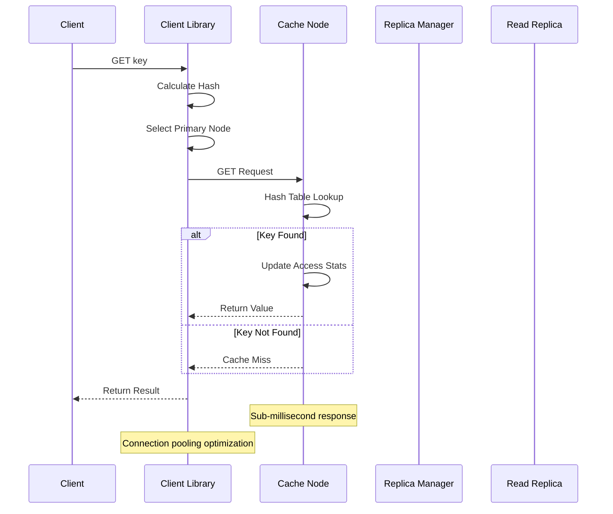

#### Distributed Cache Write with Replication
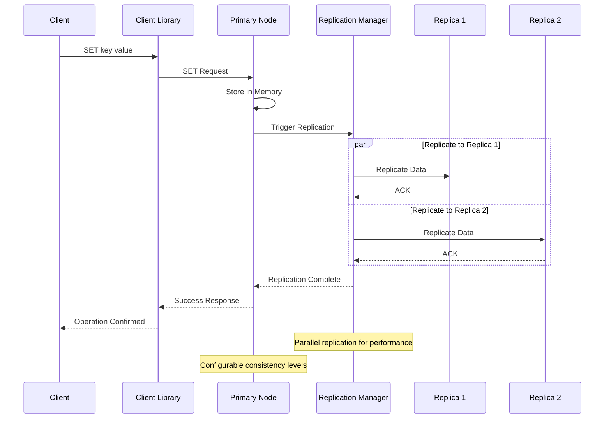

#### Cluster Node Failover
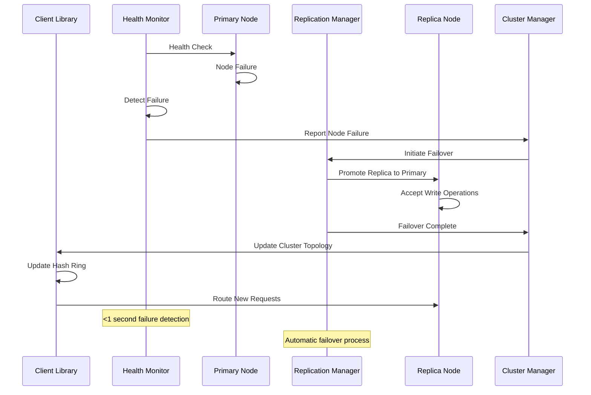

## 6. Scalability & Performance

### 6.1 Scaling Architecture

```mermaid
flowchart TD
    subgraph "Horizontal Scaling"
        A[Auto Scaling Group] --> B[Cache Node Fleet]
        B --> C[Dynamic Node Addition]
        C --> D[Automatic Rebalancing]
        D --> E[Zero-Downtime Scaling]
    end
    
    subgraph "Consistent Hashing"
        F[Hash Ring] --> G[Virtual Nodes]
        G --> H[Load Distribution]
        H --> I[Minimal Data Movement]
    end
    
    subgraph "Memory Optimization"
        J[Memory Pools] --> K[Slab Allocation]
        K --> L[Fragmentation Reduction]
        L --> M[Efficient Memory Usage]
    end
    
    subgraph "Network Optimization"
        N[Connection Pooling] --> O[Multiplexing]
        O --> P[Batch Operations]
        P --> Q[Reduced Latency]
    end
    
    style B fill:#87CEEB
    style F fill:#90EE90
    style J fill:#FFB6C1
    style N fill:#DDA0DD
```

### 6.2 Performance Optimization

**Memory Performance:**
- **Lock-Free Data Structures**: Minimize synchronization overhead
- **NUMA Awareness**: Optimize for Non-Uniform Memory Access
- **Memory Prefetching**: Predictive data loading for cache efficiency
- **Compression Algorithms**: LZ4/Snappy for space-time trade-offs

**Network Performance:**
- **Protocol Optimization**: Binary protocols for reduced overhead
- **Connection Multiplexing**: Multiple requests per connection
- **Batch Operations**: Group operations for efficiency
- **Zero-Copy Networking**: Direct memory-to-network transfers

**CPU Performance:**
- **Lock-Free Programming**: Atomic operations and CAS loops
- **SIMD Instructions**: Vectorized operations for bulk processing
- **CPU Affinity**: Pin threads to specific CPU cores
- **Branch Prediction**: Optimize hot code paths

## 7. Reliability & Fault Tolerance

### 7.1 High Availability Design

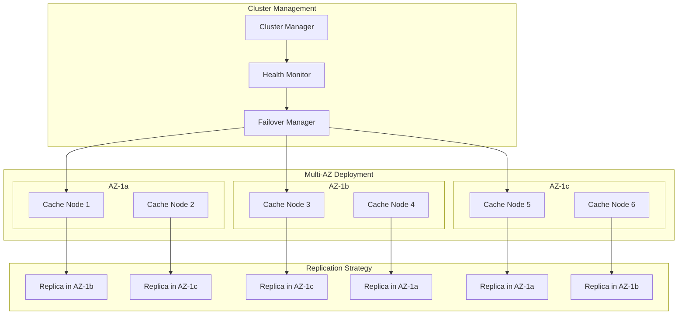

**Fault Tolerance Mechanisms:**
- **Automatic Failover**: Sub-second failover to replica nodes
- **Split-Brain Prevention**: Consensus protocols for cluster decisions
- **Graceful Degradation**: Partial functionality during failures
- **Circuit Breakers**: Prevent cascade failures

### 7.2 Disaster Recovery

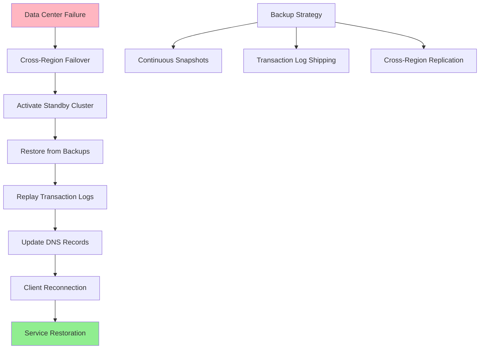

**RTO/RPO Targets:**
- **RTO (Recovery Time Objective)**: 30 seconds for local failover, 5 minutes for DR
- **RPO (Recovery Point Objective)**: 1 second for synchronous replication
- **Data Durability**: 99.999999999% (11 9's) with cross-region replication
- **Backup Frequency**: Continuous transaction logs, hourly snapshots

## 8. Security Architecture

### 8.1 Security Layers

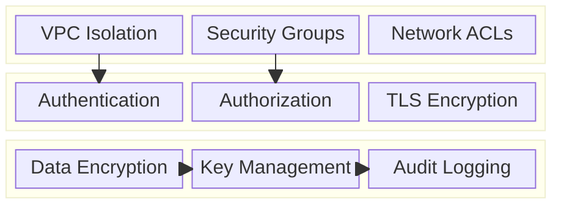

**Access Control:**
- **Client Authentication**: Certificate-based client authentication
- **Role-Based Access**: Different permissions for read/write operations
- **Network Isolation**: VPC with private subnets for cache nodes
- **API Security**: Rate limiting and request validation

**Data Protection:**
- **Encryption in Transit**: TLS 1.3 for all client-server communication
- **Encryption at Rest**: AES-256 encryption for persistent data
- **Key Rotation**: Automatic encryption key rotation
- **Memory Protection**: Secure memory allocation and clearing

### 8.2 Security Flow

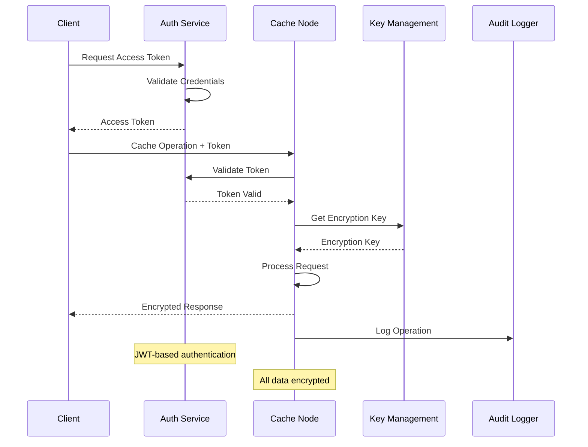

## 9. Monitoring & Observability

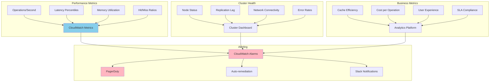

**Key Performance Indicators:**
- **Latency**: P50, P95, P99 response times for operations
- **Throughput**: Operations per second across the cluster
- **Availability**: Uptime and successful operation rates
- **Efficiency**: Cache hit ratios and memory utilization

**Alerting Strategy:**
- **Critical**: Node failures, high error rates (>1%), severe latency spikes
- **Warning**: Memory usage >80%, replication lag >100ms
- **Info**: Performance trends, capacity planning alerts

## 10. Cost Optimization

**Service-Level Cost Analysis:**
- **EC2 Instances**: $8,000/month (R6g.xlarge instances for cache nodes)
- **EBS Storage**: $500/month (Configuration and backup storage)
- **Data Transfer**: $1,000/month (Inter-AZ and cross-region traffic)
- **CloudWatch**: $300/month (Custom metrics and dashboards)
- **S3**: $200/month (Backup storage and disaster recovery)
- **Load Balancers**: $200/month (Application load balancers)
- **Total Estimated**: ~$10,200/month for 20-node cluster

**Cost Optimization Strategies:**
- **Spot Instances**: Use spot instances for non-critical replica nodes
- **Reserved Instances**: 40% savings on predictable workloads
- **Memory Optimization**: Efficient memory usage reduces instance requirements
- **Data Compression**: Reduce memory footprint and network transfer costs
- **Tiered Storage**: Use different instance types for different access patterns

## 11. Implementation Strategy

### 11.1 Migration/Deployment Plan

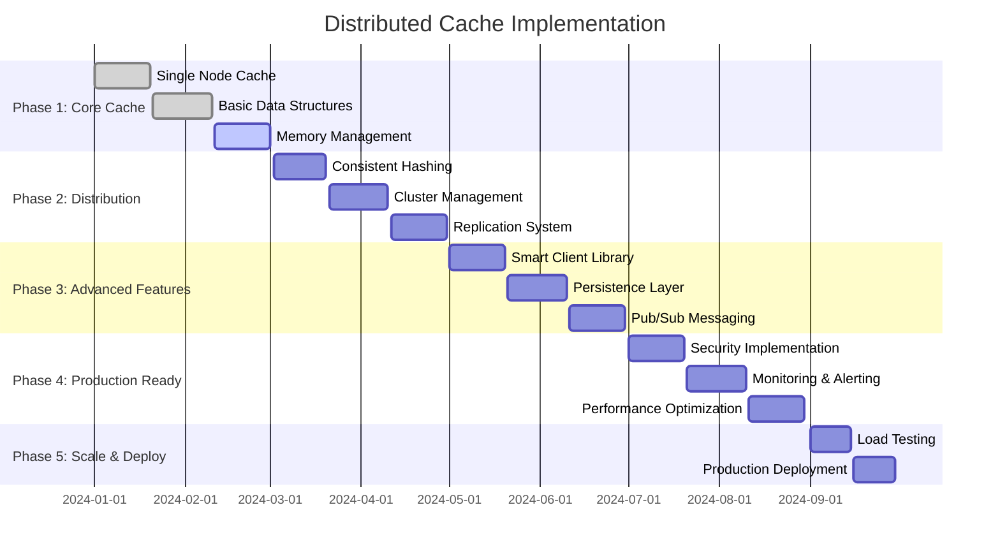

### 11.2 Technology Decisions & Trade-offs

**Memory Management:**
- **Jemalloc vs TCMalloc**: Jemalloc chosen for better fragmentation handling
- **Slab Allocation vs Buddy System**: Slab allocation for predictable allocation patterns
- **Copy-on-Write vs Deep Copy**: COW for memory efficiency in replication

**Consistency Models:**
- **Strong vs Eventual Consistency**: Configurable based on use case requirements
- **Synchronous vs Asynchronous Replication**: Hybrid approach with tunable consistency
- **Conflict Resolution**: Last-writer-wins with vector clocks for ordering

**Network Architecture:**
- **TCP vs UDP**: TCP for reliability, UDP for high-performance scenarios
- **Binary vs Text Protocol**: Binary protocol for performance optimization
- **Connection Pooling**: Persistent connections for reduced latency

**Future Evolution Path:**
- **GPU Acceleration**: CUDA-based acceleration for specific workloads
- **RDMA Support**: Remote Direct Memory Access for ultra-low latency
- **Machine Learning**: ML-based cache optimization and prediction
- **Cloud-Native Features**: Kubernetes operators and service mesh integration
