# Key-Value Store System Design Architecture

## 1. Executive Summary & Requirements

### System Overview
A distributed NoSQL key-value database that provides high availability, horizontal scalability, and tunable consistency similar to Amazon DynamoDB or Apache Cassandra. The system handles massive scale with automatic partitioning, replication, and global distribution.

### Functional Requirements
- **CRUD Operations**: Create, Read, Update, Delete with atomic operations
- **Flexible Schema**: Schema-less design with support for complex data types
- **Secondary Indexes**: Global and local secondary indexes for flexible querying
- **Transactions**: ACID transactions with optimistic concurrency control
- **Batch Operations**: Efficient bulk read/write operations
- **Time-to-Live (TTL)**: Automatic item expiration
- **Point-in-Time Recovery**: Continuous backups with point-in-time restore
- **Global Tables**: Multi-region active-active replication
- **Auto-scaling**: Automatic capacity scaling based on demand

### Non-Functional Requirements
- **Availability**: 99.99% availability with multi-AZ deployment
- **Durability**: 99.999999999% (11 9's) data durability
- **Latency**: Single-digit millisecond latency at any scale
- **Throughput**: Support millions of requests per second
- **Consistency**: Tunable consistency levels (strong, eventual, session)
- **Scalability**: Seamless scaling from gigabytes to petabytes

### Key Constraints
- CAP theorem trade-offs (Consistency vs Availability vs Partition tolerance)
- Hot partition handling without performance degradation
- Global consistency with acceptable latency
- Cost optimization for different access patterns

### Success Metrics
- 99.99% availability SLA
- <10ms P99 latency for single-item operations
- >99.999% successful request rate
- Automatic scaling without manual intervention
- Support for 100+ TB tables with consistent performance

## 2. High-Level Architecture Overview

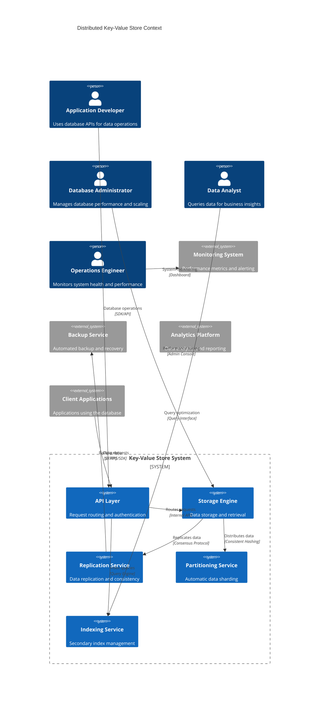

**Architectural Style Rationale**: Distributed shared-nothing architecture chosen for:
- Horizontal scalability without single points of failure
- Automatic data partitioning and load distribution
- Tunable consistency models for different use cases
- High availability with automatic failover
- Global distribution capabilities for low latency

## 3. Detailed System Architecture

### 3.1 AWS Service Stack Selection

**Core Database Services:**
- **DynamoDB**: Managed NoSQL service for reference architecture
- **EC2**: Custom implementation on high-performance instances
- **EBS**: High-IOPS storage for database nodes
- **Instance Store**: Local NVMe for ultra-low latency

**Compute & Orchestration:**
- **EKS**: Kubernetes for database node orchestration
- **Auto Scaling Groups**: Automatic capacity management
- **Lambda**: Serverless functions for maintenance tasks
- **Batch**: Large-scale data processing jobs

**Networking:**
- **VPC**: Isolated network with optimized placement
- **Placement Groups**: Cluster placement for low-latency communication
- **Transit Gateway**: Multi-region connectivity
- **Direct Connect**: Dedicated network connections

**Storage & Backup:**
- **S3**: Backup storage and data archival
- **EFS**: Shared configuration and metadata
- **Glacier**: Long-term data archival
- **Storage Gateway**: Hybrid storage integration

**Security:**
- **IAM**: Fine-grained access control
- **KMS**: Encryption key management
- **CloudHSM**: Hardware security modules
- **VPC Endpoints**: Secure service access

**Monitoring & Analytics:**
- **CloudWatch**: Comprehensive monitoring
- **X-Ray**: Distributed tracing
- **Kinesis**: Real-time data streaming
- **EMR**: Large-scale analytics

### 3.2 Component Architecture Diagram

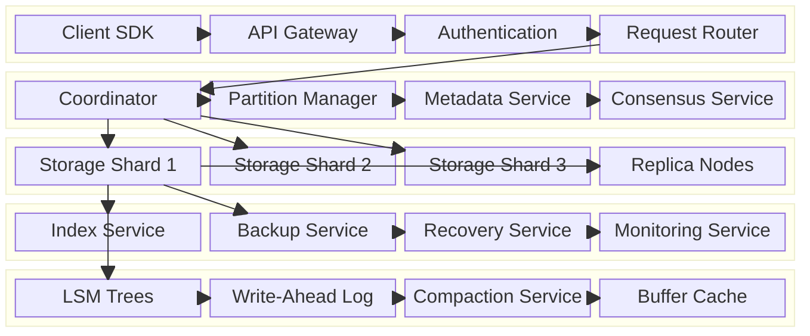

## 4. Data Architecture & Flow

### 4.1 Data Flow Diagrams

#### Read Operation Flow
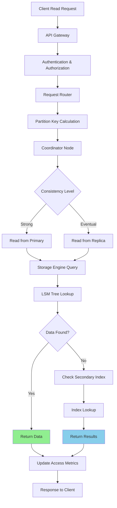

#### Write Operation Flow
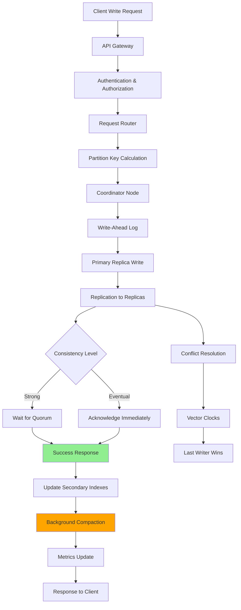

#### Auto-scaling and Partitioning Flow
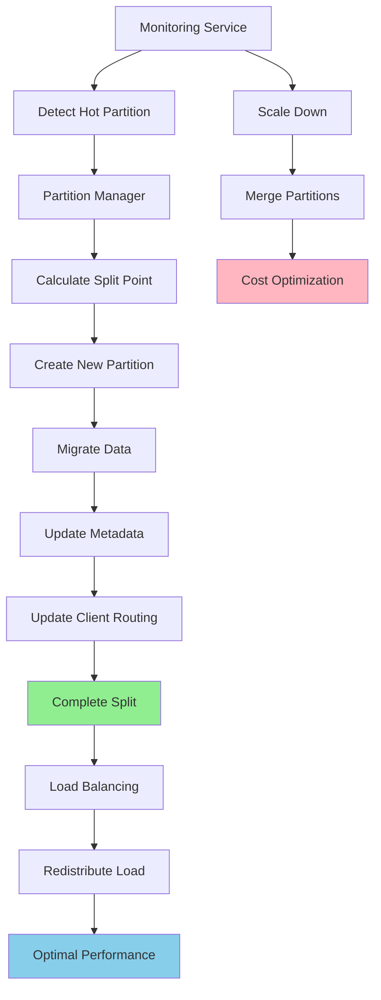

### 4.2 Database Design

#### Core Data Model
```mermaid
erDiagram
    PARTITION {
        string partition_key PK
        string sort_key SK
        binary data_value
        timestamp created_at
        timestamp updated_at
        integer version
        timestamp ttl
        json attributes
    }
    
    REPLICA_SET {
        string partition_id PK
        string replica_id SK
        string node_address
        string status
        timestamp last_sync
        integer lag_seconds
    }
    
    SECONDARY_INDEX {
        string index_name PK
        string index_key SK
        string primary_key
        json projected_attributes
        timestamp created_at
        string status
    }
    
    METADATA {
        string table_name PK
        json schema_definition
        json partition_config
        json index_definitions
        integer read_capacity
        integer write_capacity
        string status
    }
    
    PARTITION ||--o{ REPLICA_SET : "replicated to"
    PARTITION ||--o{ SECONDARY_INDEX : "indexed by"
    METADATA ||--o{ PARTITION : "contains"
```

#### Storage Engine Schema
```mermaid
erDiagram
    LSM_LEVEL {
        integer level_number PK
        string file_id SK
        integer file_size
        string min_key
        string max_key
        timestamp created_at
        string status
    }
    
    WRITE_AHEAD_LOG {
        integer sequence_number PK
        string operation_type
        string partition_key
        string sort_key
        binary data_value
        timestamp timestamp
        string checksum
    }
    
    BLOOM_FILTER {
        string file_id PK
        binary filter_data
        integer hash_functions
        integer expected_elements
        double false_positive_rate
    }
    
    COMPACTION_JOB {
        string job_id PK
        json input_files
        string output_file
        timestamp start_time
        timestamp end_time
        string status
    }
    
    LSM_LEVEL ||--o{ BLOOM_FILTER : "has filter"
    LSM_LEVEL ||--o{ COMPACTION_JOB : "compacted by"
```

## 5. Detailed Component Design

### 5.1 Storage Engine

**Purpose & Responsibilities:**
- Implement LSM (Log-Structured Merge) trees for write-optimized storage
- Handle data compaction and garbage collection
- Manage write-ahead logs for durability
- Implement efficient range queries and point lookups
- Handle data compression and encoding

**LSM Tree Implementation:**
- **MemTable**: In-memory sorted structure for recent writes
- **SSTable**: Immutable sorted files on disk
- **Compaction**: Background merging of SSTables
- **Bloom Filters**: Probabilistic filters to reduce disk I/O

**Write Path Optimization:**
- **Batch Writes**: Group writes for efficiency
- **Compression**: LZ4/Snappy compression for storage efficiency
- **Write Coalescing**: Merge multiple writes to same key
- **Async I/O**: Non-blocking disk operations

### 5.2 Replication Service

**Purpose & Responsibilities:**
- Coordinate data replication across multiple replicas
- Implement consensus protocols for strong consistency
- Handle replica failure and recovery
- Manage read preferences and load balancing
- Ensure data durability and availability

**Replication Strategies:**
- **Synchronous Replication**: Strong consistency with higher latency
- **Asynchronous Replication**: Eventual consistency with better performance
- **Quorum-based**: Configurable consistency levels
- **Multi-Master**: Active-active replication across regions

**Consensus Protocols:**
- **Raft**: Leader-based consensus for strong consistency
- **PBFT**: Byzantine fault tolerance for untrusted environments
- **Gossip**: Decentralized failure detection and membership

### 5.3 Partitioning Service

**Purpose & Responsibilities:**
- Implement consistent hashing for data distribution
- Handle automatic partition splitting and merging
- Manage hot partition detection and mitigation
- Coordinate data migration during rebalancing
- Optimize partition placement for performance

**Partitioning Strategies:**
- **Hash-based**: Consistent hashing with virtual nodes
- **Range-based**: Ordered partitioning for range queries
- **Composite**: Combination of hash and range partitioning
- **Custom**: Application-specific partitioning logic

### Critical User Journey Sequence Diagrams

#### Single Item Read Operation
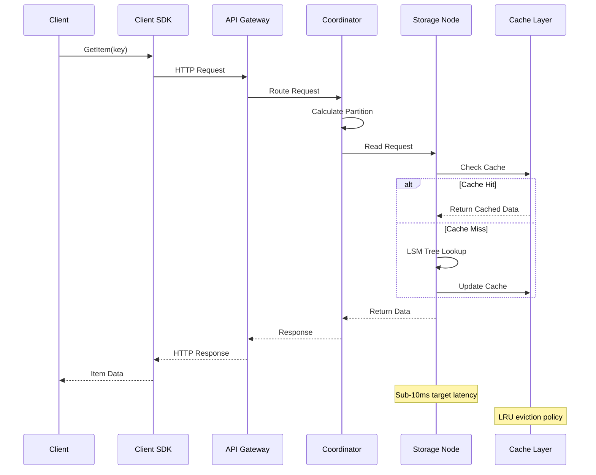

#### Batch Write Operation
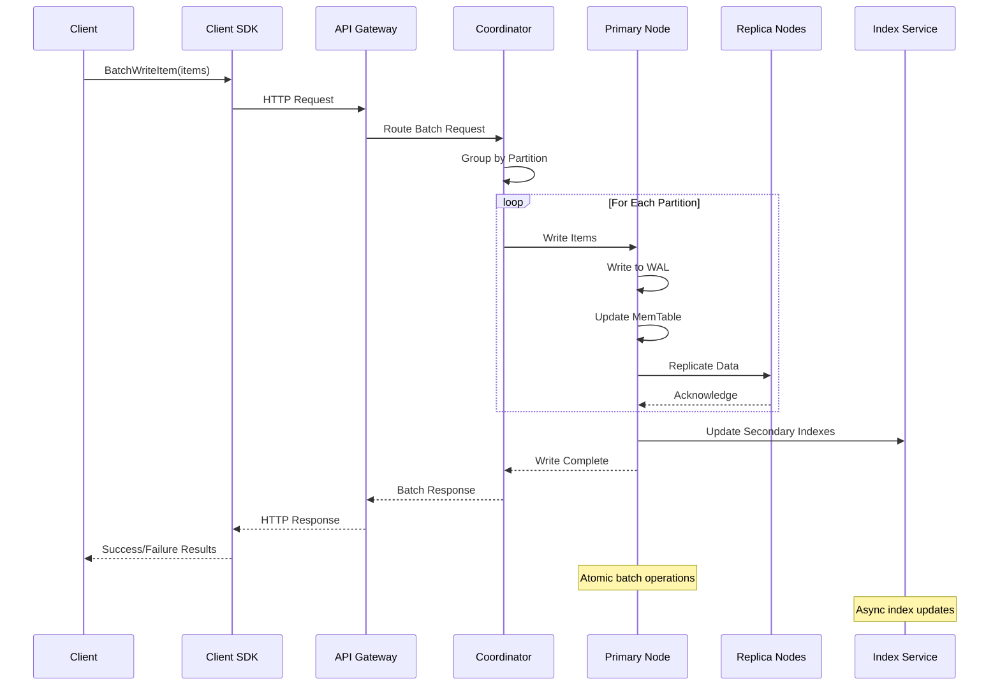

#### Auto-scaling Trigger
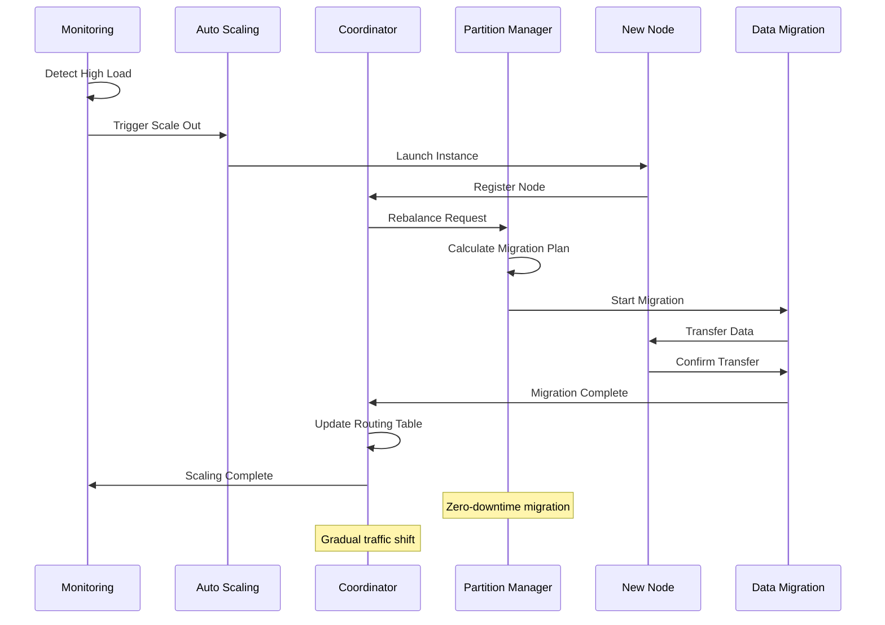

## 6. Scalability & Performance

### 6.1 Scaling Architecture

```mermaid
flowchart TD
    subgraph "Horizontal Scaling"
        A[Auto Scaling Groups] --> B[Dynamic Node Addition]
        B --> C[Automatic Rebalancing]
        C --> D[Load Distribution]
    end
    
    subgraph "Partitioning Strategy"
        E[Consistent Hashing] --> F[Virtual Nodes]
        F --> G[Even Distribution]
        G --> H[Hot Spot Mitigation]
    end
    
    subgraph "Performance Optimization"
        I[LSM Trees] --> J[Write Optimization]
        J --> K[Compaction Strategy]
        K --> L[Read Performance]
    end
    
    subgraph "Caching Layers"
        M[Application Cache] --> N[Database Cache]
        N --> O[OS Page Cache]
        O --> P[Storage Cache]
    end
    
    style A fill:#87CEEB
    style E fill:#90EE90
    style I fill:#FFB6C1
    style M fill:#DDA0DD
```

### 6.2 Performance Optimization

**Storage Optimization:**
- **LSM Tree Tuning**: Optimize level ratios and compaction triggers
- **Bloom Filter Sizing**: Balance memory usage and false positive rates
- **Compression**: Choose optimal compression algorithms per use case
- **Index Optimization**: Efficient secondary index structures

**Memory Management:**
- **Buffer Pool**: Intelligent caching of frequently accessed data
- **Memory Tables**: Optimize in-memory data structures
- **Garbage Collection**: Efficient memory reclamation
- **NUMA Awareness**: Optimize for multi-socket architectures

**Network Optimization:**
- **Connection Pooling**: Reuse connections across requests
- **Batch Operations**: Reduce network round trips
- **Compression**: Network-level compression for large payloads
- **Protocol Optimization**: Efficient binary protocols

## 7. Reliability & Fault Tolerance

### 7.1 High Availability Design

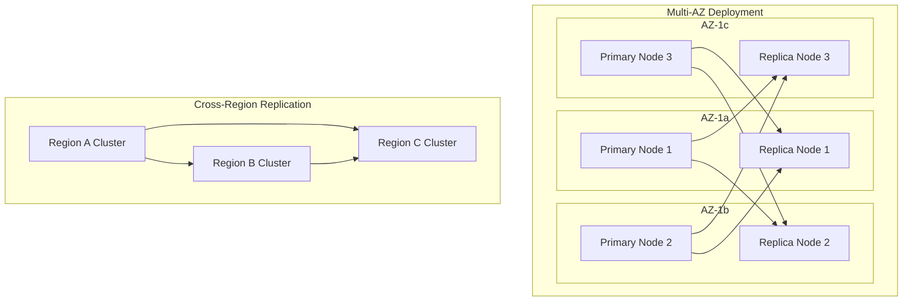

**Fault Tolerance Mechanisms:**
- **Automatic Failover**: Sub-second failover to healthy replicas
- **Split-Brain Prevention**: Quorum-based decision making
- **Graceful Degradation**: Partial functionality during failures
- **Data Integrity**: Checksums and validation at multiple levels

### 7.2 Disaster Recovery

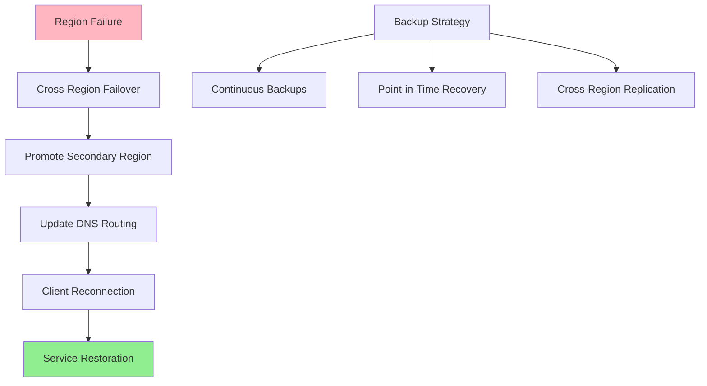

**RTO/RPO Targets:**
- **RTO**: 1 minute for automatic failover
- **RPO**: Near-zero with synchronous replication
- **Backup Frequency**: Continuous with point-in-time recovery
- **Data Durability**: 99.999999999% (11 9's)

## 8. Security Architecture

### 8.1 Security Layers

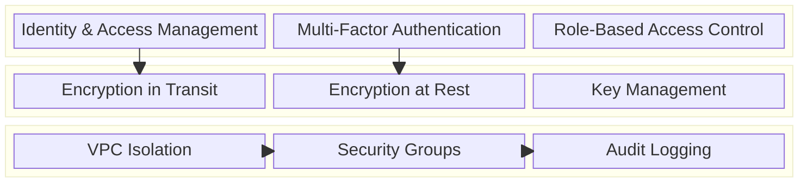

**Data Protection:**
- **Encryption**: AES-256 encryption for data at rest and in transit
- **Key Management**: Automatic key rotation and HSM integration
- **Access Control**: Fine-grained permissions and attribute-based access
- **Audit Trails**: Comprehensive logging of all database operations

## 9. Monitoring & Observability

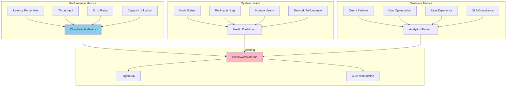

**Key Performance Indicators:**
- **Latency**: P50, P95, P99 response times
- **Availability**: Successful request percentage
- **Throughput**: Requests per second capacity
- **Durability**: Data loss prevention metrics

## 10. Cost Optimization

**Service-Level Cost Analysis:**
- **EC2 Instances**: $15,000/month (High-memory instances for database nodes)
- **EBS Storage**: $3,000/month (High-IOPS storage volumes)
- **Data Transfer**: $2,000/month (Cross-AZ and cross-region)
- **Backup Storage**: $1,000/month (S3 storage for backups)
- **Monitoring**: $500/month (CloudWatch and custom metrics)
- **Total Estimated**: ~$21,500/month for production cluster

**Cost Optimization Strategies:**
- **Auto-scaling**: Scale resources based on actual demand
- **Storage Tiering**: Use appropriate storage types for different access patterns
- **Reserved Instances**: Significant savings for predictable workloads
- **Data Compression**: Reduce storage and network costs
- **Query Optimization**: Efficient queries reduce compute costs

## 11. Implementation Strategy

### 11.1 Migration/Deployment Plan

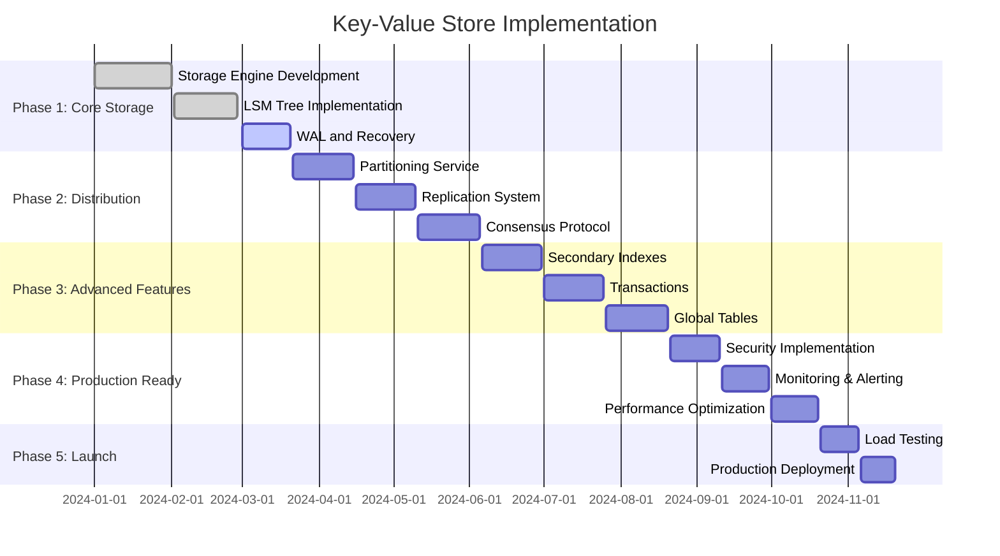

### 11.2 Technology Decisions & Trade-offs

**Storage Engine Choice:**
- **LSM Trees vs B+ Trees**: LSM chosen for write-heavy workloads
- **RocksDB vs Custom**: Custom implementation for specific optimizations
- **Compression**: LZ4 for balance of speed and compression ratio
- **Memory Management**: jemalloc for reduced fragmentation

**Consistency Model:**
- **Strong vs Eventual**: Tunable consistency based on application needs
- **Consensus Protocol**: Raft chosen for simplicity and proven reliability
- **Conflict Resolution**: Vector clocks with last-writer-wins

**Future Evolution Path:**
- **Machine Learning**: ML-based query optimization and caching
- **Serverless Integration**: Function-as-a-service database triggers
- **Multi-Model**: Support for document and graph data models
- **Edge Computing**: Database replication to edge locations
