# Content Delivery Network (CDN) System Design Architecture

## 1. Executive Summary & Requirements

### System Overview
A global content delivery network that provides fast, reliable, and secure delivery of web content, media files, and APIs to users worldwide. The system minimizes latency through intelligent caching, load balancing, and geographic distribution of content across edge locations.

### Functional Requirements
- **Content Caching**: Intelligent caching of static and dynamic content at edge locations
- **Global Distribution**: Worldwide network of edge servers for low-latency delivery
- **Origin Shield**: Additional caching layer to reduce origin server load
- **Dynamic Content Acceleration**: Optimization for dynamic content and APIs
- **Media Streaming**: Adaptive bitrate streaming for video and audio content
- **Security Features**: DDoS protection, Web Application Firewall, and SSL/TLS termination
- **Real-time Analytics**: Performance metrics, traffic analysis, and reporting
- **Cache Invalidation**: Instant content purging and cache management
- **Custom Rules**: Flexible routing, caching, and transformation rules

### Non-Functional Requirements
- **Availability**: 99.99% uptime with global redundancy
- **Latency**: <50ms response time from nearest edge location
- **Throughput**: Support for 100+ Tbps aggregate bandwidth
- **Scale**: Serve 1M+ requests per second globally
- **Cache Hit Ratio**: >95% for static content, >80% for dynamic content
- **Global Coverage**: 200+ edge locations across 6 continents

### Key Constraints
- Intelligent cache management to balance hit ratio and freshness
- Handle traffic spikes and DDoS attacks gracefully
- Comply with regional data sovereignty requirements
- Minimize origin server load while maintaining content freshness

### Success Metrics
- 99.99% availability SLA globally
- <100ms P95 response time worldwide
- >90% cache hit ratio across all content types
- 99.9% successful content delivery rate
- Support 10+ PB of data transfer per month

## 2. High-Level Architecture Overview

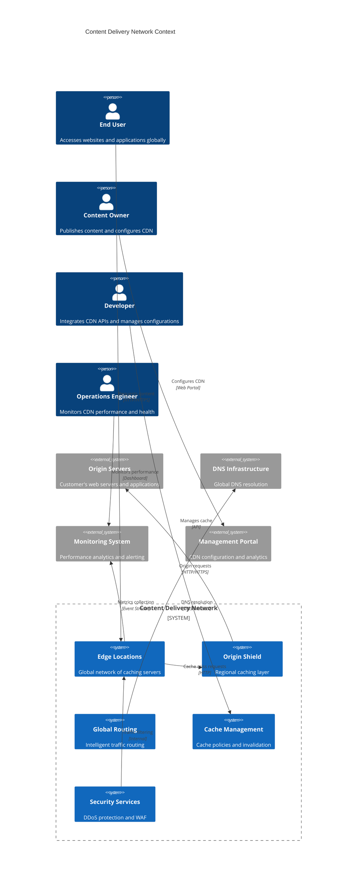

**Architectural Style Rationale**: Distributed edge computing architecture chosen for:
- Global content distribution with minimal latency
- Hierarchical caching to reduce origin load
- Intelligent routing based on network conditions
- Horizontal scaling through edge location expansion
- Fault tolerance with automatic failover capabilities

## 3. Detailed System Architecture

### 3.1 AWS Service Stack Selection

**Edge Infrastructure:**
- **CloudFront**: Global CDN service with 200+ edge locations
- **Lambda@Edge**: Serverless compute at edge locations
- **CloudFront Functions**: Lightweight edge computing for simple transformations
- **Global Accelerator**: Network performance optimization

**Origin Services:**
- **S3**: Static content origin with high availability
- **ELB**: Load balancing for dynamic content origins
- **API Gateway**: API acceleration and caching
- **EC2**: Custom origin servers and applications

**Caching & Storage:**
- **ElastiCache**: Distributed caching at regional level
- **S3**: Content storage with intelligent tiering
- **EFS**: Shared storage for edge applications
- **FSx**: High-performance file systems

**Security:**
- **AWS WAF**: Web application firewall integration
- **AWS Shield**: DDoS protection at network and application layers
- **Certificate Manager**: SSL/TLS certificate management
- **KMS**: Encryption key management

**Networking:**
- **Route 53**: Global DNS with health checks and latency routing
- **Direct Connect**: Dedicated network connections
- **Transit Gateway**: Multi-region connectivity
- **VPC**: Secure network isolation

**Analytics & Monitoring:**
- **CloudWatch**: Real-time metrics and monitoring
- **Kinesis**: Real-time data streaming and analytics
- **Athena**: Log analysis and querying
- **QuickSight**: Business intelligence dashboards

**Management:**
- **Systems Manager**: Configuration management
- **CloudFormation**: Infrastructure as code
- **Config**: Compliance monitoring
- **CloudTrail**: API audit logging

### 3.2 Component Architecture Diagram

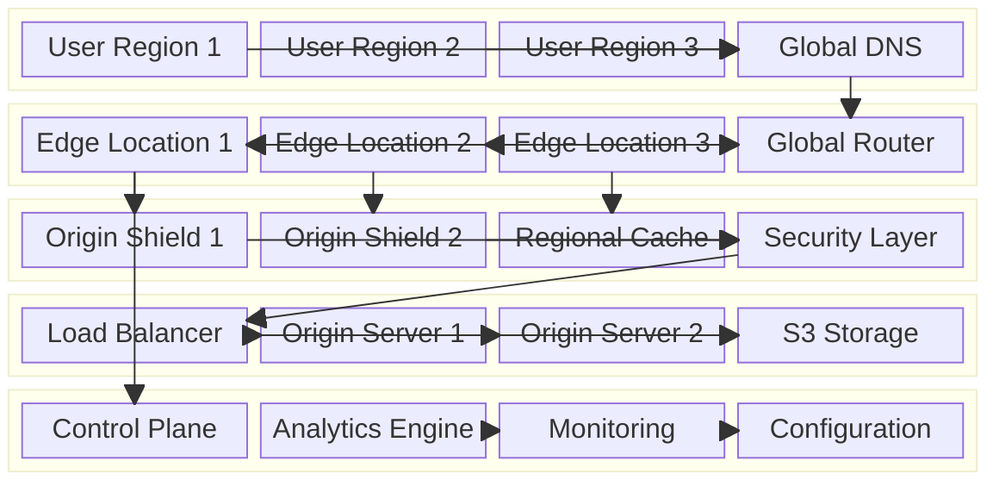

## 4. Data Architecture & Flow

### 4.1 Data Flow Diagrams

#### Content Request and Delivery Flow
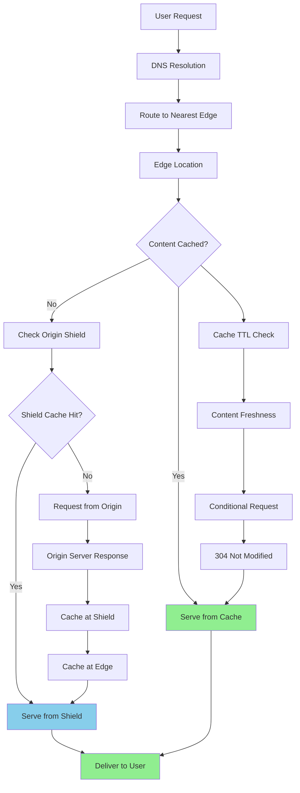

#### Dynamic Content Acceleration Flow
```mermaid
flowchart TD
    A[API Request] --> B[Edge Location]
    B --> C[SSL Termination]
    C --> D[Request Optimization]
    D --> E[Connection Pooling]
    E --> F[Origin Server]
    F --> G[Response Processing]
    G --> H[Compression]
    H --> I[Edge Caching]
    I --> J[Response to User]
    
    K[Lambda@Edge] --> L[Request Modification]
    D --> K
    L --> M[Custom Logic]
    M --> N[Header Manipulation]
    N --> E
    
    O[Performance Monitoring] --> P[Route Optimization]
    J --> O
    P --> Q[Network Path Selection]
    
    style J fill:#90EE90
    style M fill:#FFB6C1
```

#### Cache Invalidation and Purge Flow
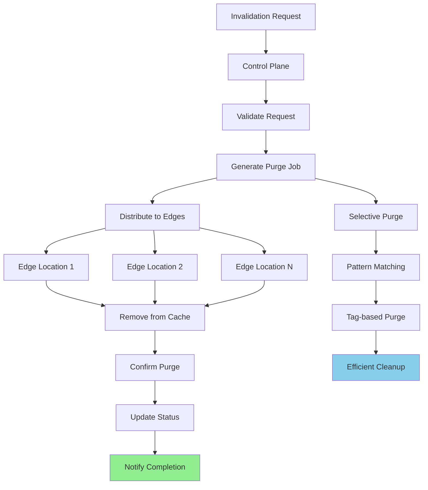

### 4.2 Database Design

#### Edge Location Management
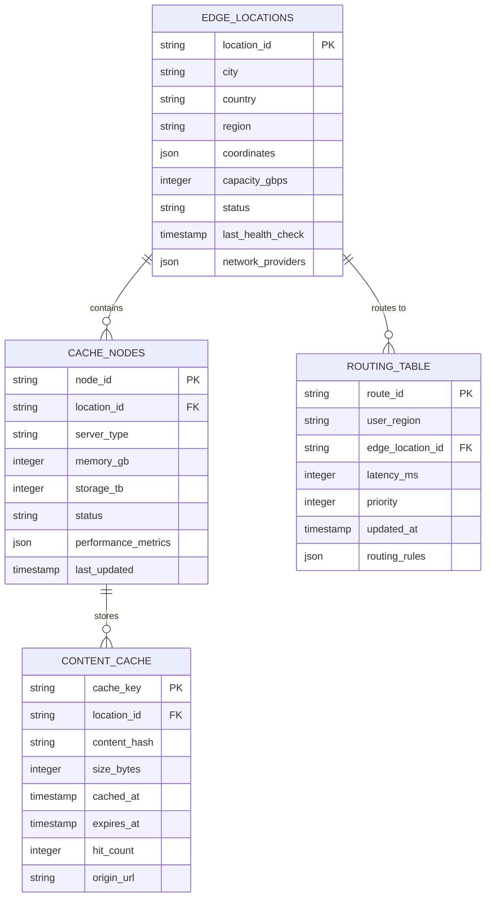

#### Performance and Analytics Schema
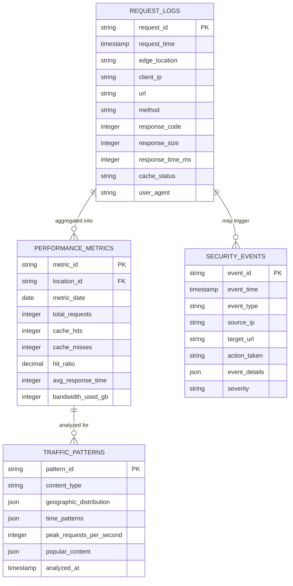

## 5. Detailed Component Design

### 5.1 Edge Location Service

**Purpose & Responsibilities:**
- Cache and serve content with sub-50ms latency
- Handle SSL/TLS termination and HTTP/2 optimization
- Implement intelligent caching policies and TTL management
- Process Lambda@Edge functions for custom logic
- Collect performance metrics and security events

**Caching Strategies:**
- **Static Content**: Long TTL with version-based invalidation
- **Dynamic Content**: Short TTL with conditional requests
- **API Responses**: Configurable caching based on headers
- **Personalized Content**: Edge-side includes and assembly

**Performance Optimizations:**
- **HTTP/2 and HTTP/3**: Modern protocol support
- **Compression**: Gzip, Brotli, and custom compression
- **Connection Coalescing**: Efficient connection reuse
- **Prefetching**: Predictive content loading

### 5.2 Global Routing Engine

**Purpose & Responsibilities:**
- Route users to optimal edge locations based on latency and load
- Implement intelligent failover and load balancing
- Handle geographic and regulatory routing constraints
- Optimize network paths for performance
- Manage DNS-based and Anycast routing

**Routing Algorithms:**
- **Latency-based**: Route to lowest latency edge location
- **Load-based**: Consider edge location capacity and load
- **Geographic**: Route based on user location and data sovereignty
- **Health-based**: Avoid unhealthy or degraded locations

**Failover Mechanisms:**
- **Automatic Failover**: Sub-second failover to healthy locations
- **Graceful Degradation**: Serve stale content during outages
- **Circuit Breakers**: Prevent cascade failures
- **Health Monitoring**: Continuous health checks and monitoring

### 5.3 Origin Shield Service

**Purpose & Responsibilities:**
- Provide regional caching layer between edge locations and origins
- Reduce origin server load through request consolidation
- Handle cache warming and pre-population
- Implement advanced caching strategies for dynamic content
- Coordinate cache invalidation across edge locations

**Cache Optimization:**
- **Request Collapsing**: Merge concurrent requests for same content
- **Cache Warming**: Proactive content population
- **Intelligent Purging**: Efficient cache invalidation
- **Compression**: Origin response compression and optimization

### Critical User Journey Sequence Diagrams

#### First-Time Content Request
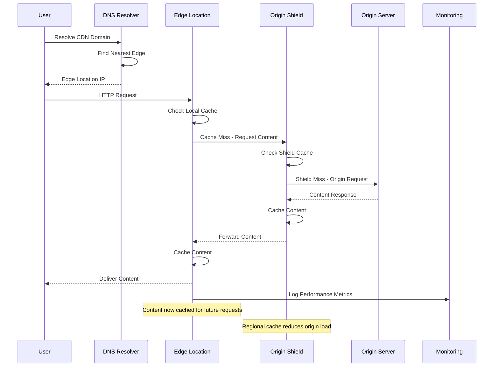

#### Cached Content Delivery
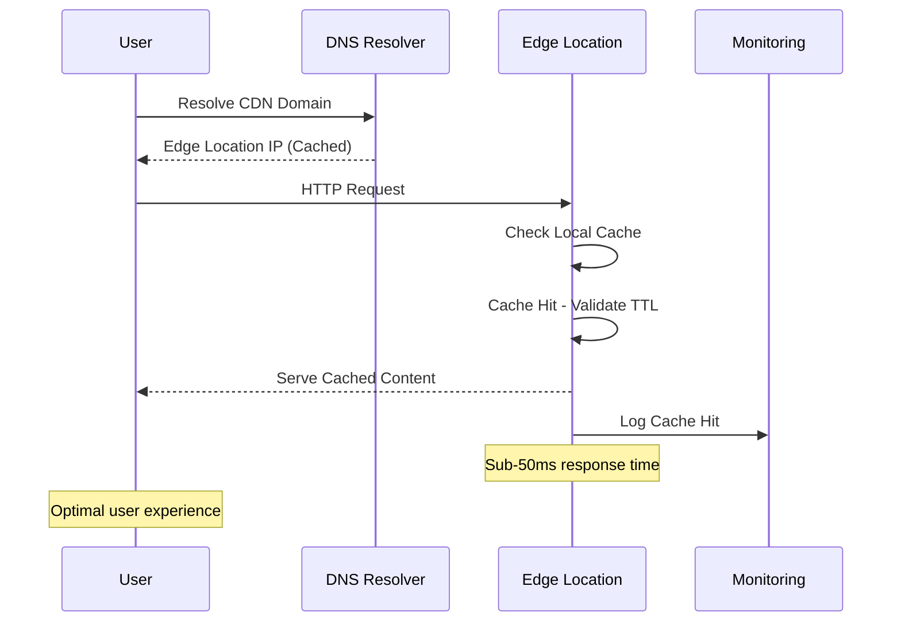

#### Cache Invalidation Process
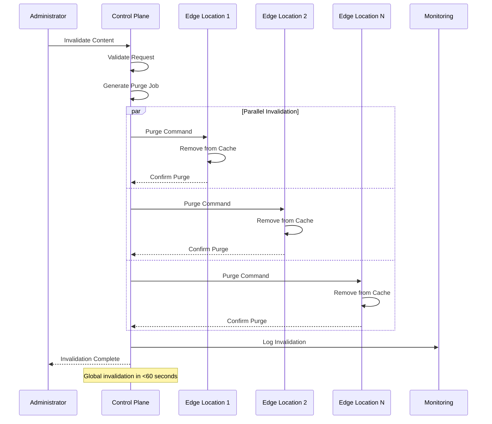

## 6. Scalability & Performance

### 6.1 Scaling Architecture

```mermaid
flowchart TD
    subgraph "Global Edge Expansion"
        A[Current Edge Locations] --> B[Traffic Analysis]
        B --> C[Identify New Markets]
        C --> D[Deploy New Edge Locations]
        D --> E[Update Global Routing]
    end
    
    subgraph "Capacity Scaling"
        F[Edge Location Monitoring] --> G[Capacity Thresholds]
        G --> H[Auto-scaling Triggers]
        H --> I[Add Cache Nodes]
        I --> J[Load Redistribution]
    end
    
    subgraph "Performance Optimization"
        K[Content Analysis] --> L[Caching Strategy Optimization]
        L --> M[TTL Adjustments]
        M --> N[Cache Hit Ratio Improvement]
    end
    
    subgraph "Network Optimization"
        O[Network Path Analysis] --> P[Route Optimization]
        P --> Q[Peering Agreements]
        Q --> R[Latency Reduction]
    end
    
    style D fill:#87CEEB
    style I fill:#90EE90
    style N fill:#FFB6C1
    style R fill:#DDA0DD
```

### 6.2 Performance Optimization

**Caching Optimizations:**
- **Intelligent TTL**: Dynamic TTL based on content type and update patterns
- **Predictive Caching**: Machine learning-based content pre-population
- **Edge-Side Includes**: Assemble pages from cached fragments
- **Compression**: Advanced compression algorithms and optimization

**Network Optimizations:**
- **Anycast Routing**: Route to nearest available edge location
- **TCP Optimization**: Connection pooling and keep-alive optimization
- **Protocol Optimization**: HTTP/2 push and HTTP/3 support
- **DNS Optimization**: Intelligent DNS resolution and caching

**Content Optimizations:**
- **Image Optimization**: Automatic format conversion and resizing
- **Minification**: CSS, JavaScript, and HTML minification
- **Bundling**: Resource bundling and concatenation
- **Lazy Loading**: Progressive content loading optimization

## 7. Reliability & Fault Tolerance

### 7.1 High Availability Design

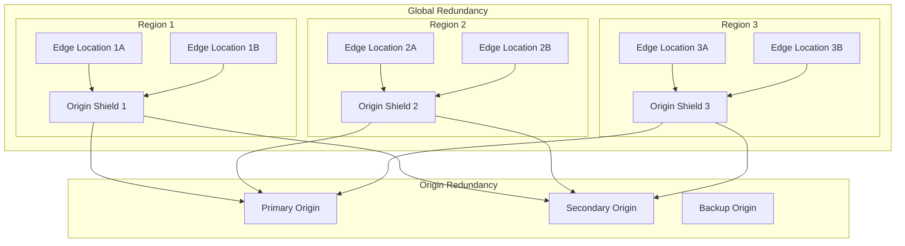

**Fault Tolerance Mechanisms:**
- **Automatic Failover**: Sub-second failover between edge locations
- **Origin Failover**: Automatic failover to backup origins
- **Graceful Degradation**: Serve stale content during origin outages
- **Circuit Breakers**: Prevent cascade failures across the network

### 7.2 Disaster Recovery

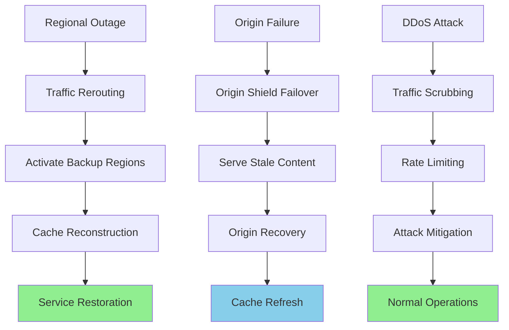

**RTO/RPO Targets:**
- **RTO**: 30 seconds for edge failover, 5 minutes for regional failover
- **RPO**: Near-zero for cached content, 1 minute for origin data
- **Availability**: 99.99% global availability with 99.999% regional availability
- **Content Durability**: 99.999999999% with multi-region replication

## 8. Security Architecture

### 8.1 Security Layers

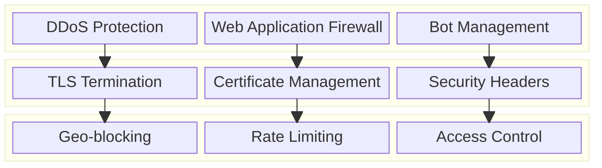

**Edge Security Features:**
- **DDoS Protection**: Multi-layered protection against volumetric and application attacks
- **Web Application Firewall**: OWASP Top 10 protection with custom rules
- **Bot Management**: Intelligent bot detection and mitigation
- **SSL/TLS**: Modern encryption with perfect forward secrecy

**Access Control:**
- **Geographic Restrictions**: Country and region-based access control
- **IP Whitelisting/Blacklisting**: Custom IP-based access rules
- **Signed URLs**: Time-limited access to protected content
- **Token Authentication**: JWT and custom token validation

### 8.2 Security Event Handling Flow

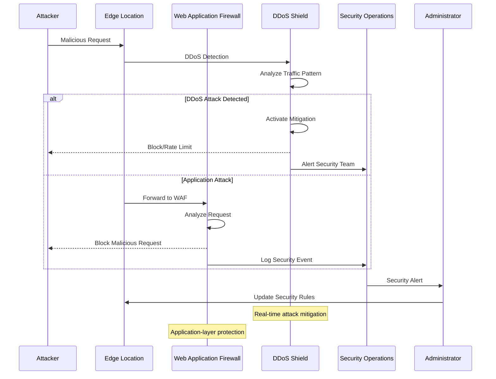

## 9. Monitoring & Observability

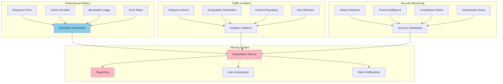

**Key Performance Indicators:**
- **Latency**: P50, P95, P99 response times from edge locations
- **Availability**: Uptime percentage and successful request rates
- **Cache Performance**: Hit ratios, miss rates, and TTL effectiveness
- **Security**: Attack mitigation success and false positive rates

**Alerting Strategy:**
- **Critical**: Edge location failures, major DDoS attacks, origin outages
- **Warning**: High latency, low cache hit ratios, capacity thresholds
- **Info**: Traffic pattern changes, security events, performance trends

## 10. Cost Optimization

**Service-Level Cost Analysis:**
- **Edge Infrastructure**: $50,000/month (200+ edge locations worldwide)
- **Bandwidth**: $30,000/month (10 PB monthly data transfer)
- **Origin Shield**: $8,000/month (regional caching infrastructure)
- **Security Services**: $5,000/month (DDoS protection and WAF)
- **Monitoring**: $2,000/month (analytics and reporting)
- **Management**: $3,000/month (control plane and APIs)
- **Total Estimated**: ~$98,000/month for global CDN

**Cost Optimization Strategies:**
- **Intelligent Caching**: Optimize cache hit ratios to reduce origin costs
- **Compression**: Reduce bandwidth costs through efficient compression
- **Regional Optimization**: Deploy edge locations based on traffic patterns
- **Reserved Capacity**: Long-term commitments for predictable savings
- **Content Optimization**: Automatic optimization to reduce transfer costs

**Cost Monitoring:**
- **Per-Location Analytics**: Track cost efficiency by edge location
- **Bandwidth Optimization**: Monitor and optimize data transfer costs
- **Cache Efficiency**: Measure cost savings from improved cache hit ratios
- **ROI Analysis**: Calculate return on investment for new edge locations

## 11. Implementation Strategy

### 11.1 Migration/Deployment Plan

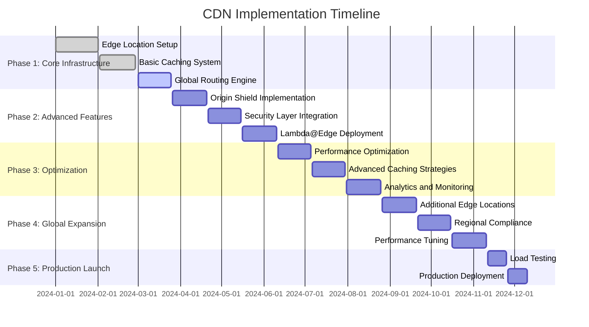

### 11.2 Technology Decisions & Trade-offs

**Caching Strategy Decisions:**
- **Pull vs Push**: Pull-based caching for better origin control
- **TTL Management**: Dynamic TTL based on content type and patterns
- **Invalidation**: Tag-based invalidation for efficient cache management
- **Compression**: Multi-algorithm compression for optimal performance

**Network Architecture:**
- **Anycast vs GeoDNS**: Hybrid approach for optimal routing
- **HTTP/2 vs HTTP/3**: Support both protocols with automatic negotiation
- **TCP vs UDP**: TCP for reliability, UDP for real-time content
- **IPv4 vs IPv6**: Dual-stack support for global compatibility

**Security Implementation:**
- **WAF Rules**: Machine learning-based rule generation and updates
- **DDoS Mitigation**: Multi-layered protection with automatic scaling
- **Certificate Management**: Automated certificate provisioning and renewal
- **Access Control**: Flexible rule engine for complex access patterns

**Future Evolution Path:**
- **Edge Computing**: Enhanced Lambda@Edge capabilities and containers
- **AI/ML Integration**: Intelligent caching and content optimization
- **5G Optimization**: Edge computing for ultra-low latency applications
- **IoT Support**: Specialized protocols and optimization for IoT devices

**Technical Debt & Improvement Areas:**
- **Cache Warming**: Intelligent pre-population based on traffic patterns
- **Content Optimization**: Advanced image and video optimization
- **Real-time Analytics**: Enhanced real-time performance monitoring
- **Edge AI**: Machine learning inference at edge locations
