# Load Balancer System Design Architecture

## 1. Executive Summary & Requirements

### System Overview
A highly available and scalable load balancing system that distributes incoming requests across multiple servers efficiently, ensuring optimal resource utilization, fault tolerance, and seamless traffic management. The system supports various load balancing algorithms, health checking, and auto-scaling capabilities.

### Functional Requirements
- **Traffic Distribution**: Distribute requests across multiple backend servers
- **Health Monitoring**: Continuous health checks and automatic failover
- **Load Balancing Algorithms**: Round-robin, least connections, weighted, IP hash
- **SSL Termination**: Handle SSL/TLS encryption and certificate management
- **Session Persistence**: Sticky sessions and session affinity
- **Auto-scaling Integration**: Dynamic backend server management
- **Geographic Load Balancing**: Global traffic distribution
- **Rate Limiting**: Request throttling and DDoS protection
- **Real-time Monitoring**: Performance metrics and analytics

### Non-Functional Requirements
- **Availability**: 99.99% uptime with multi-AZ deployment
- **Latency**: <5ms additional latency for load balancing
- **Throughput**: Handle 1M+ requests per second
- **Scalability**: Support 10,000+ backend servers
- **Reliability**: Automatic failover within 10 seconds
- **Security**: DDoS protection and secure connections

### Key Constraints
- Minimize single points of failure
- Handle traffic spikes and sudden load changes
- Maintain session consistency for stateful applications
- Comply with regional data residency requirements

### Success Metrics
- 99.99% availability SLA
- <10ms P99 latency overhead
- >99% successful request routing
- <10 second failover time
- Support 100+ Gbps throughput

## 2. High-Level Architecture Overview

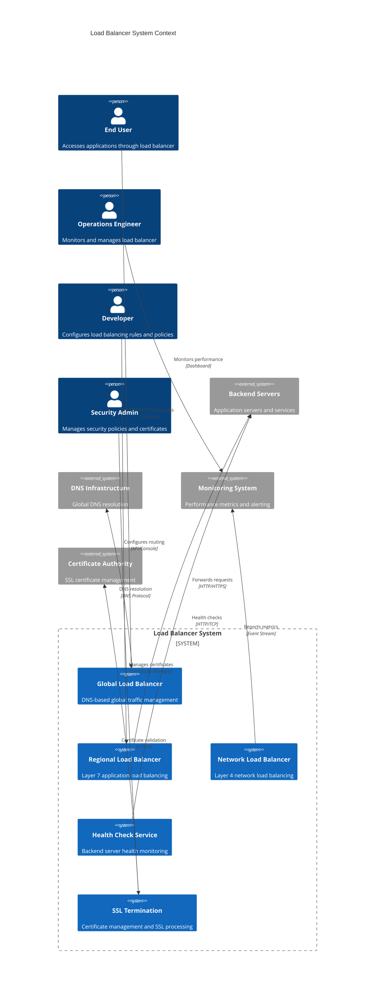

**Architectural Style Rationale**: Multi-tier load balancing architecture chosen for:
- Separation of concerns between global and regional traffic management
- Independent scaling of different load balancing layers
- Technology specialization for different traffic types
- High availability with redundancy at multiple levels
- Flexible routing policies for different application requirements

## 3. Detailed System Architecture

### 3.1 AWS Service Stack Selection

**Load Balancing Services:**
- **Application Load Balancer (ALB)**: Layer 7 HTTP/HTTPS load balancing
- **Network Load Balancer (NLB)**: Layer 4 TCP/UDP load balancing
- **Gateway Load Balancer**: Third-party appliance integration
- **Global Accelerator**: Global network optimization and failover

**DNS and Routing:**
- **Route 53**: Global DNS with health checks and traffic policies
- **CloudFront**: CDN with origin load balancing
- **API Gateway**: API-specific load balancing and throttling

**Compute and Auto-scaling:**
- **Auto Scaling Groups**: Dynamic backend server management
- **EC2**: Backend application servers
- **ECS/EKS**: Containerized application load balancing
- **Lambda**: Serverless backend integration

**Security:**
- **AWS WAF**: Web application firewall integration
- **AWS Shield**: DDoS protection
- **Certificate Manager**: SSL/TLS certificate management
- **Security Groups**: Network-level security controls

**Monitoring and Analytics:**
- **CloudWatch**: Load balancer metrics and logging
- **X-Ray**: Distributed tracing and performance analysis
- **VPC Flow Logs**: Network traffic analysis
- **Kinesis**: Real-time metrics streaming

**Storage and Configuration:**
- **S3**: Configuration backups and static content
- **Parameter Store**: Configuration management
- **Secrets Manager**: SSL certificates and credentials

### 3.2 Component Architecture Diagram

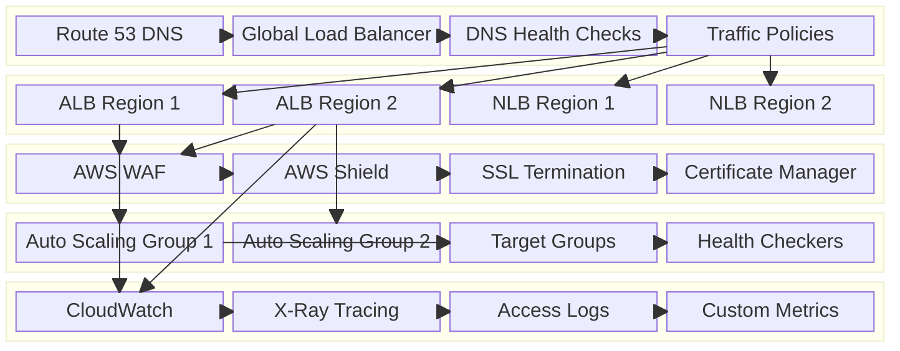

## 4. Data Architecture & Flow

### 4.1 Data Flow Diagrams

#### Request Routing and Load Balancing Flow
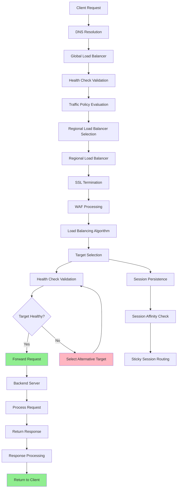

#### Health Check and Failover Flow
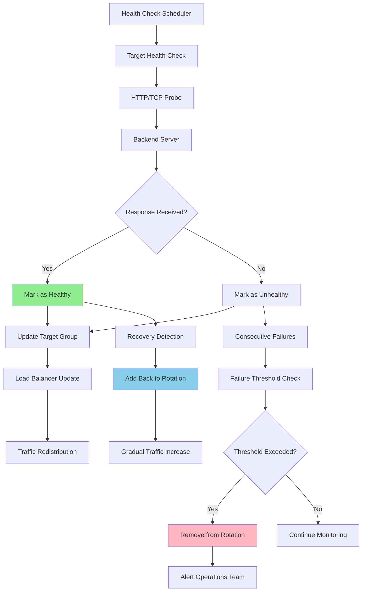

#### Auto-scaling Integration Flow
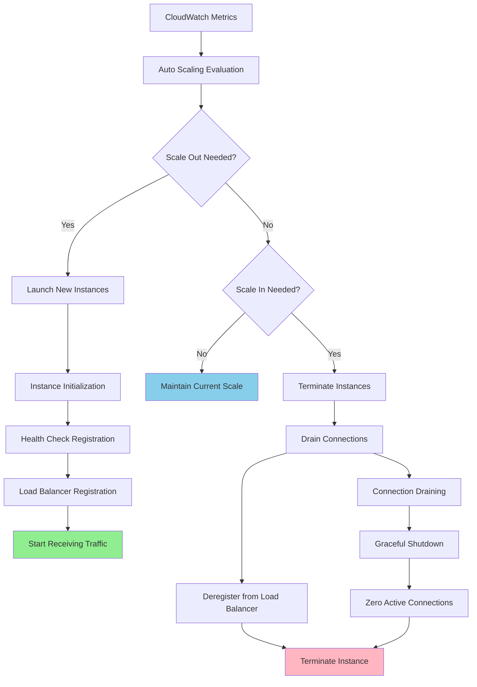

### 4.2 Database Design

#### Load Balancer Configuration Schema
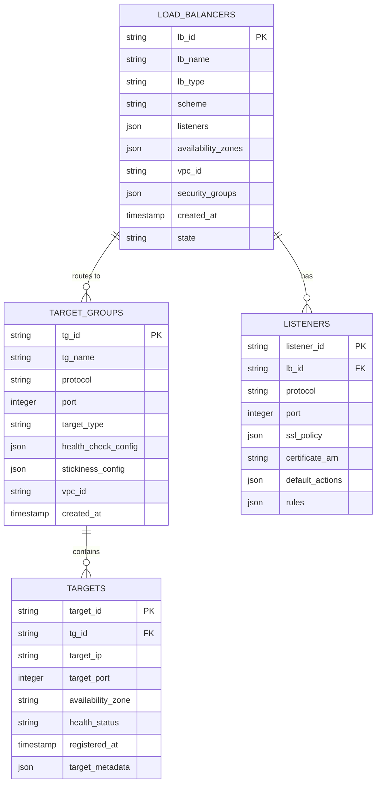

#### Health Check and Monitoring Schema
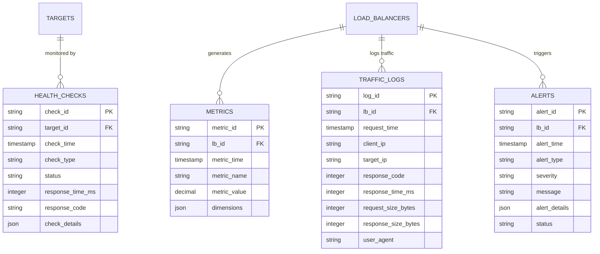

## 5. Detailed Component Design

### 5.1 Global Load Balancer Service

**Purpose & Responsibilities:**
- Implement DNS-based global traffic management
- Route users to optimal regional load balancers
- Handle geographic load balancing and failover
- Manage global health checks and traffic policies
- Implement disaster recovery and multi-region failover

**Traffic Routing Policies:**
- **Latency-based**: Route to lowest latency region
- **Geolocation**: Route based on user geographic location
- **Weighted**: Distribute traffic based on configured weights
- **Failover**: Primary-secondary failover configuration
- **Multi-value**: Return multiple healthy endpoints

**Health Check Integration:**
- **Deep Health Checks**: Application-level health validation
- **Synthetic Monitoring**: Proactive health monitoring
- **Failover Automation**: Automatic traffic redirection on failures
- **Recovery Detection**: Automatic traffic restoration on recovery

### 5.2 Regional Load Balancer Service

**Purpose & Responsibilities:**
- Handle Layer 7 HTTP/HTTPS load balancing
- Implement advanced routing rules and content-based routing
- Manage SSL termination and certificate handling
- Process Web Application Firewall rules
- Handle session persistence and sticky sessions

**Load Balancing Algorithms:**
- **Round Robin**: Equal distribution across targets
- **Least Outstanding Requests**: Route to least busy target
- **Weighted Round Robin**: Distribute based on target capacity
- **IP Hash**: Consistent routing based on client IP
- **Custom**: Application-specific routing logic

**Advanced Features:**
- **Content-based Routing**: Route based on URL, headers, or query parameters
- **Blue-Green Deployments**: Traffic shifting for deployments
- **A/B Testing**: Traffic splitting for experimentation
- **Rate Limiting**: Request throttling and quota management

### 5.3 Health Check Service

**Purpose & Responsibilities:**
- Continuously monitor backend server health
- Implement multiple health check protocols (HTTP, HTTPS, TCP)
- Handle health check intervals and timeout configurations
- Manage failure thresholds and recovery detection
- Integrate with auto-scaling for capacity management

**Health Check Types:**
- **HTTP Health Checks**: Application-level health validation
- **TCP Health Checks**: Network-level connectivity checks
- **Custom Health Checks**: Application-specific health logic
- **Passive Health Checks**: Monitor actual request success rates

### Critical User Journey Sequence Diagrams

#### Normal Request Processing
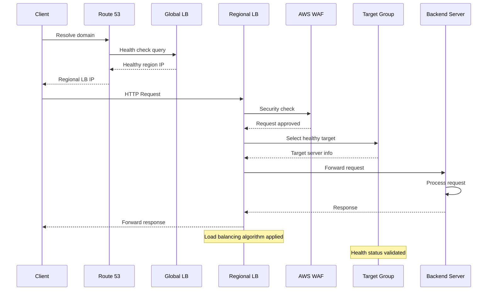

#### Failover Scenario
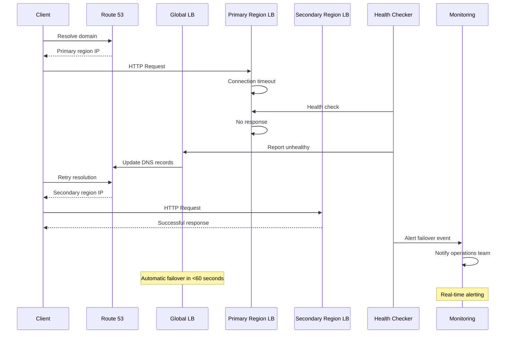

#### Auto-scaling Integration
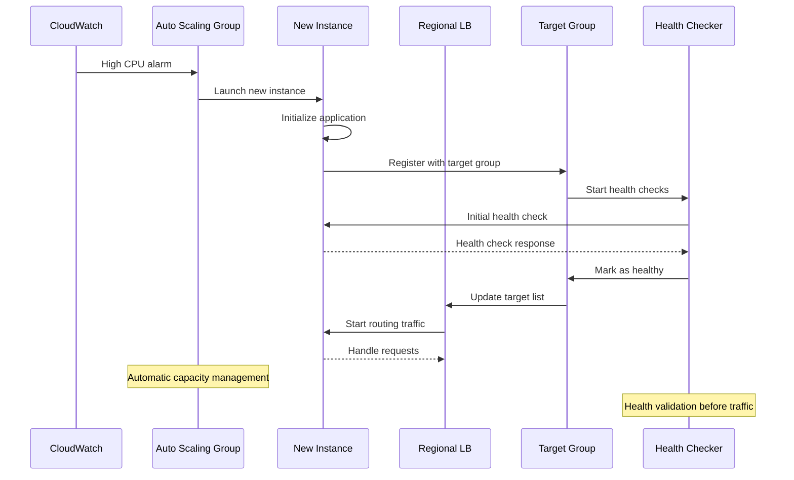

## 6. Scalability & Performance

### 6.1 Scaling Architecture

```mermaid
flowchart TD
    subgraph "Global Scaling"
        A[Traffic Growth] --> B[Regional Expansion]
        B --> C[New Load Balancer Deployment]
        C --> D[DNS Traffic Policy Updates]
    end
    
    subgraph "Regional Scaling"
        E[Regional Traffic Growth] --> F[Load Balancer Scaling]
        F --> G[Target Group Expansion]
        G --> H[Backend Auto-scaling]
    end
    
    subgraph "Performance Optimization"
        I[Connection Optimization] --> J[Keep-alive Tuning]
        J --> K[SSL Session Reuse]
        K --> L[HTTP/2 Optimization]
    end
    
    subgraph "Capacity Management"
        M[Predictive Scaling] --> N[Pre-warming]
        N --> O[Reserved Capacity]
        O --> P[Cost Optimization]
    end
    
    style C fill:#87CEEB
    style G fill:#90EE90
    style K fill:#FFB6C1
    style O fill:#DDA0DD
```

### 6.2 Performance Optimization

**Connection Optimization:**
- **Connection Pooling**: Reuse connections to backend servers
- **Keep-alive Optimization**: Optimize connection persistence
- **HTTP/2 Support**: Modern protocol optimization
- **SSL Session Reuse**: Reduce SSL handshake overhead

**Algorithm Optimization:**
- **Weighted Algorithms**: Distribute based on server capacity
- **Least Connections**: Route to least busy servers
- **Health-aware Routing**: Avoid routing to degraded servers
- **Geographic Optimization**: Route to nearest healthy servers

**Caching and Acceleration:**
- **Response Caching**: Cache responses at load balancer level
- **SSL Termination**: Offload SSL processing from backends
- **Compression**: Compress responses to reduce bandwidth
- **Request Coalescing**: Combine similar requests

## 7. Reliability & Fault Tolerance

### 7.1 High Availability Design

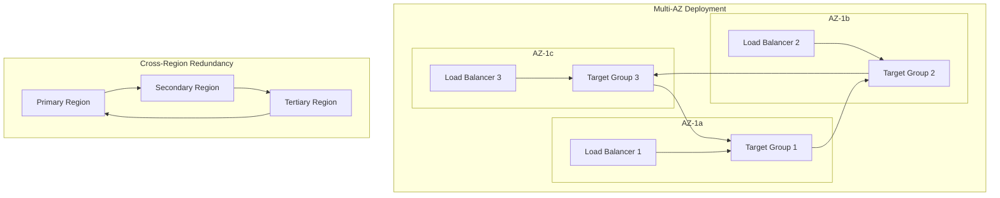

**Fault Tolerance Mechanisms:**
- **Multi-AZ Deployment**: Automatic failover between availability zones
- **Cross-Region Failover**: Global disaster recovery capabilities
- **Health Check Redundancy**: Multiple health check mechanisms
- **Connection Draining**: Graceful handling of server maintenance

### 7.2 Disaster Recovery

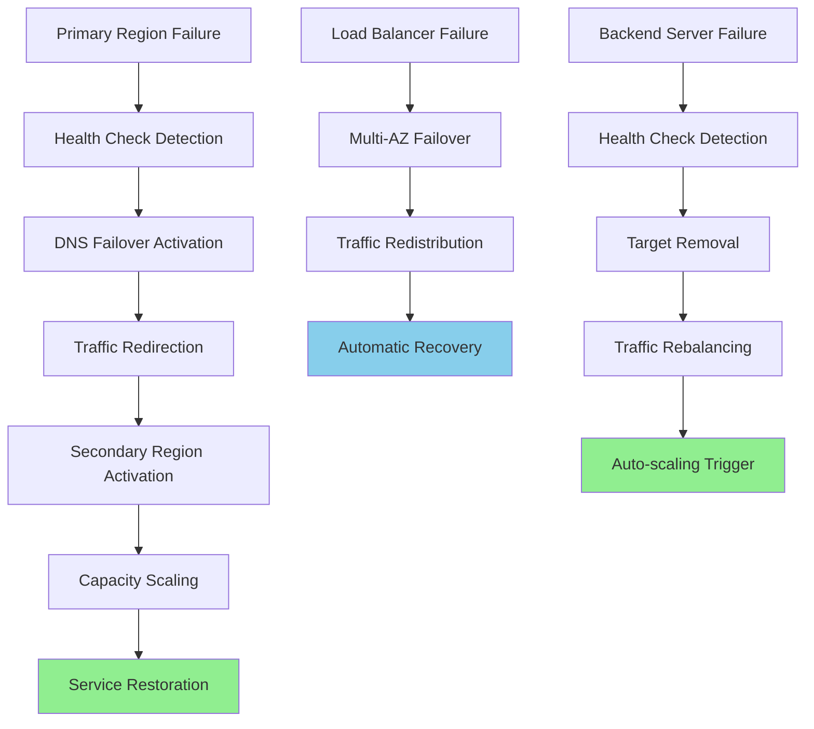

**RTO/RPO Targets:**
- **RTO**: 60 seconds for regional failover, 10 seconds for AZ failover
- **RPO**: Near-zero for stateless applications
- **Availability**: 99.99% with multi-region deployment
- **Failover Time**: <30 seconds for automatic failover

## 8. Security Architecture

### 8.1 Security Layers

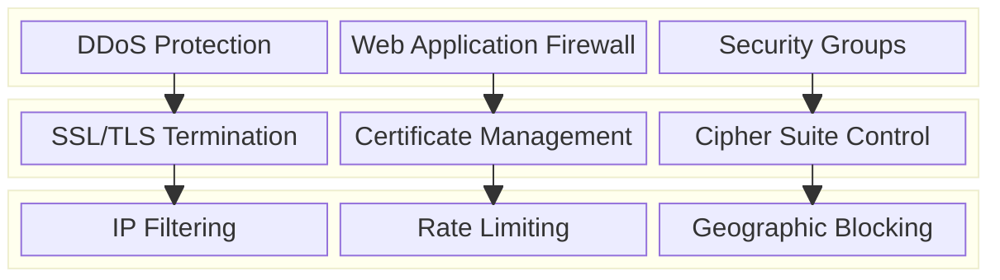

**Security Features:**
- **DDoS Protection**: Multi-layer protection against volumetric attacks
- **SSL/TLS Termination**: Modern encryption with perfect forward secrecy
- **Web Application Firewall**: OWASP Top 10 protection
- **Access Control**: IP-based and geographic access restrictions

**Certificate Management:**
- **Automatic Provisioning**: Automated certificate deployment
- **Renewal Management**: Automatic certificate renewal
- **Multi-domain Support**: Wildcard and SAN certificates
- **Security Standards**: TLS 1.2+ enforcement

### 8.2 Security Event Handling

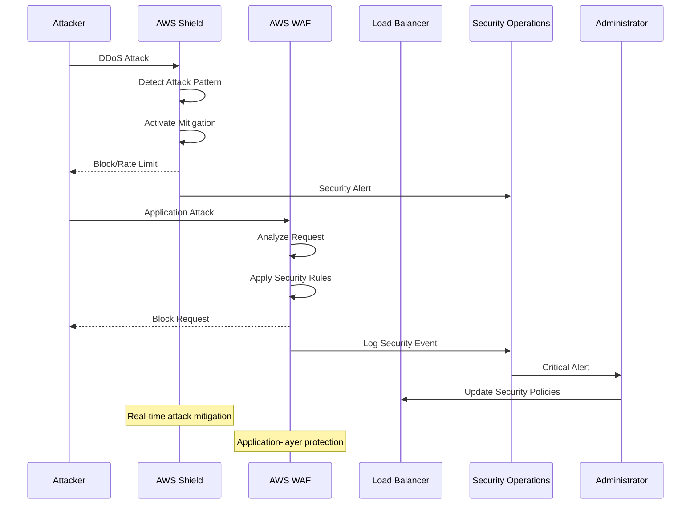

## 9. Monitoring & Observability

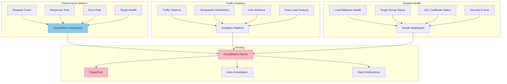

**Key Performance Indicators:**
- **Latency**: P50, P95, P99 response times including load balancer overhead
- **Throughput**: Requests per second handled by load balancers
- **Availability**: Successful request percentage and uptime
- **Health**: Backend server health and availability metrics

**Alerting Strategy:**
- **Critical**: Load balancer failures, high error rates (>5%), security attacks
- **Warning**: High latency (>100ms), target health issues, certificate expiration
- **Info**: Traffic pattern changes, capacity scaling events, performance trends

## 10. Cost Optimization

**Service-Level Cost Analysis:**
- **Application Load Balancers**: $3,000/month (10 ALBs across regions)
- **Network Load Balancers**: $2,000/month (5 NLBs for TCP traffic)
- **Global Accelerator**: $1,500/month (global traffic optimization)
- **Route 53**: $500/month (DNS queries and health checks)
- **Certificate Manager**: $0/month (free SSL certificates)
- **CloudWatch**: $800/month (metrics and logs storage)
- **Data Transfer**: $2,000/month (cross-AZ and internet traffic)
- **Total Estimated**: ~$9,800/month for global load balancing

**Cost Optimization Strategies:**
- **Right-sizing**: Choose appropriate load balancer types for workloads
- **Reserved Capacity**: Long-term commitments for predictable savings
- **Cross-AZ Optimization**: Minimize cross-AZ data transfer costs
- **Health Check Optimization**: Optimize health check frequency and targets
- **Certificate Consolidation**: Use wildcard certificates to reduce management overhead

**Cost Monitoring:**
- **Usage Analytics**: Track load balancer utilization and efficiency
- **Data Transfer Costs**: Monitor and optimize data transfer patterns
- **Resource Optimization**: Regular review of underutilized load balancers
- **Cost Allocation**: Tag-based cost allocation for different applications

## 11. Implementation Strategy

### 11.1 Migration/Deployment Plan

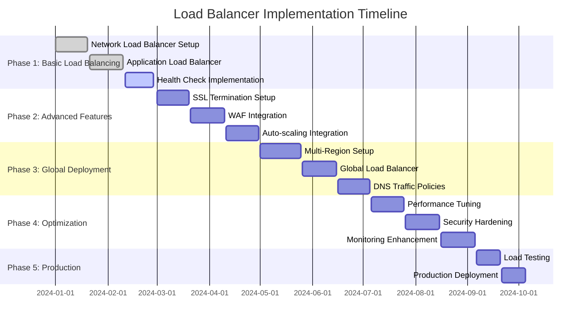

### 11.2 Technology Decisions & Trade-offs

**Load Balancer Type Selection:**
- **ALB vs NLB**: ALB for HTTP/HTTPS, NLB for TCP/UDP and extreme performance
- **Layer 4 vs Layer 7**: Layer 7 for advanced routing, Layer 4 for simplicity
- **Regional vs Global**: Regional for application-specific, global for disaster recovery
- **Managed vs Self-managed**: AWS managed services for operational simplicity

**Algorithm Selection:**
- **Round Robin vs Least Connections**: Round robin for uniform servers, least connections for variable processing times
- **Weighted vs Equal**: Weighted for heterogeneous server capacities
- **Hash-based**: For session affinity requirements
- **Custom Logic**: For complex routing requirements

**Security Implementation:**
- **WAF Rules**: Balance security and performance with custom rule sets
- **SSL Policies**: Modern cipher suites with backward compatibility
- **DDoS Protection**: Multi-layer protection with automatic scaling
- **Access Control**: Flexible IP and geographic filtering

**Future Evolution Path:**
- **Service Mesh Integration**: Istio and Envoy proxy integration
- **AI/ML Optimization**: Machine learning-based traffic prediction and routing
- **Edge Computing**: Load balancing at edge locations
- **Serverless Integration**: Native integration with serverless architectures

**Technical Debt & Improvement Areas:**
- **Advanced Routing**: Machine learning-based intelligent routing
- **Predictive Scaling**: AI-driven capacity planning and scaling
- **Enhanced Security**: Advanced threat detection and response
- **Performance Analytics**: Deep performance analysis and optimization recommendations
