# Rate Limiter System Design Architecture

## 1. Executive Summary & Requirements

### System Overview
A distributed rate limiting system that controls the rate of requests to prevent abuse, ensure fair usage, and protect backend services from overload. The system supports multiple rate limiting algorithms, flexible policies, and real-time enforcement across distributed environments.

### Functional Requirements
- **Request Throttling**: Limit requests per user, IP, API key, or custom identifiers
- **Multiple Algorithms**: Token bucket, sliding window, fixed window, leaky bucket
- **Flexible Policies**: Different limits for different users, endpoints, or time periods
- **Distributed Enforcement**: Consistent rate limiting across multiple servers
- **Real-time Monitoring**: Track usage patterns and limit violations
- **Dynamic Configuration**: Runtime policy updates without service restart
- **Allowlist/Blocklist**: Bypass or block specific users or IPs
- **Burst Handling**: Allow temporary bursts within configured limits
- **Multi-tier Limits**: Different limits for different service tiers

### Non-Functional Requirements
- **Availability**: 99.99% uptime with fault tolerance
- **Latency**: <1ms additional latency for rate limit checks
- **Throughput**: Handle 1M+ rate limit evaluations per second
- **Accuracy**: >99% accuracy in rate limit enforcement
- **Scalability**: Support 100K+ concurrent rate limit policies
- **Consistency**: Eventually consistent across distributed nodes

### Key Constraints
- Minimize performance impact on application requests
- Handle distributed system challenges (network partitions, clock skew)
- Balance between accuracy and performance
- Support both synchronous and asynchronous enforcement

### Success Metrics
- 99.99% availability for rate limiting service
- <1ms P99 latency for rate limit checks
- >99% accuracy in rate limit enforcement
- <0.1% false positives in rate limiting decisions
- Support 1M+ unique rate limit keys

## 2. High-Level Architecture Overview

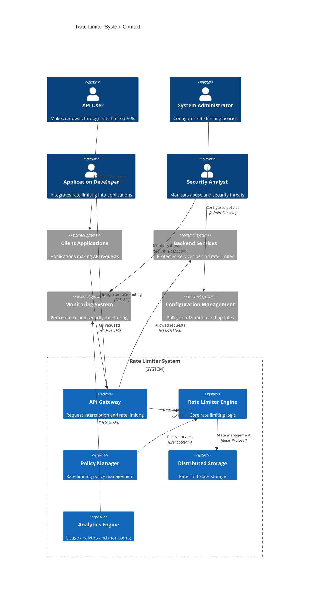
```mermaid
C4Context
    title Rate Limiter System Context

    Person(api_user, "API User", "Makes requests through rate-limited APIs")
    Person(admin, "System Administrator", "Configures rate limiting policies")
    Person(developer, "Application Developer", "Integrates rate limiting into applications")
    Person(security_analyst, "Security Analyst", "Monitors abuse and security threats")

    System_Boundary(rate_limiter, "Rate Limiter System") {
        System(gateway, "API Gateway", "Request interception and rate limiting")
        System(limiter_engine, "Rate Limiter Engine", "Core rate limiting logic")
        System(policy_manager, "Policy Manager", "Rate limiting policy management")
        System(storage_layer, "Distributed Storage", "Rate limit state storage")
        System(analytics, "Analytics Engine", "Usage analytics and monitoring")
    }

    System_Ext(client_apps, "Client Applications", "Applications making API requests")
    System_Ext(backend_services, "Backend Services", "Protected services behind rate limiter")
    System_Ext(monitoring, "Monitoring System", "Performance and security monitoring")
    System_Ext(config_mgmt, "Configuration Management", "Policy configuration and updates")

    Rel(api_user, client_apps, "Makes API requests", "HTTP/HTTPS")
    Rel(admin, config_mgmt, "Configures policies", "Admin Console")
    Rel(developer, gateway, "Integrates rate limiting", "SDK/API")
    Rel(security_analyst, monitoring, "Monitors threats", "Security Dashboard")
    
    Rel(client_apps, gateway, "API requests", "HTTP/HTTPS")
    Rel(gateway, limiter_engine, "Rate limit checks", "gRPC")
    Rel(limiter_engine, storage_layer, "State management", "Redis Protocol")
    Rel(policy_manager, limiter_engine, "Policy updates", "Event Stream")
    Rel(gateway, backend_services, "Allowed requests", "HTTP/HTTPS")
    Rel(analytics, monitoring, "Usage metrics", "Metrics API")
```

**Architectural Style Rationale**: Distributed microservices architecture with centralized policy management chosen for:
- Independent scaling of rate limiting components
- Flexible policy management and runtime updates
- High-performance distributed state management
- Integration with existing API gateway infrastructure
- Support for multiple rate limiting strategies

## 3. Detailed System Architecture

### 3.1 AWS Service Stack Selection

**API Management:**
- **API Gateway**: Built-in throttling and rate limiting capabilities
- **Application Load Balancer**: Request routing and basic rate limiting
- **CloudFront**: Edge-level rate limiting and DDoS protection
- **AWS WAF**: Advanced rate limiting rules and IP blocking

**Compute:**
- **Lambda**: Serverless rate limiting functions
- **ECS Fargate**: Containerized rate limiting services
- **EKS**: Kubernetes-based rate limiting microservices
- **EC2**: High-performance rate limiting nodes

**Storage and Caching:**
- **ElastiCache Redis**: Distributed rate limit state storage
- **MemoryDB**: Ultra-low latency in-memory database
- **DynamoDB**: Configuration and policy storage
- **S3**: Rate limiting logs and analytics data

**Messaging:**
- **SQS**: Asynchronous rate limiting decisions
- **SNS**: Rate limit violation notifications
- **Kinesis**: Real-time rate limiting analytics
- **EventBridge**: Policy update events

**Monitoring:**
- **CloudWatch**: Rate limiting metrics and alarms
- **X-Ray**: Distributed tracing for rate limiting flows
- **Kinesis Analytics**: Real-time usage pattern analysis
- **QuickSight**: Rate limiting analytics dashboards

**Security:**
- **IAM**: Fine-grained access control for rate limiting APIs
- **Secrets Manager**: API keys and authentication tokens
- **KMS**: Encryption for sensitive rate limiting data

### 3.2 Component Architecture Diagram

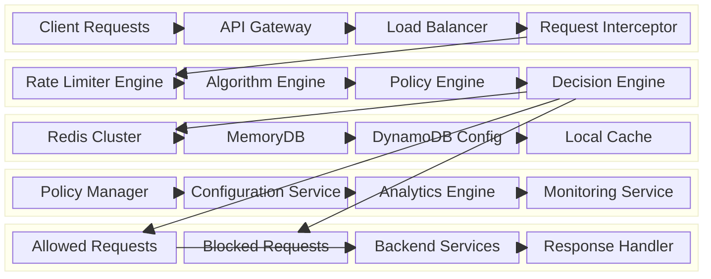
```mermaid
block-beta
    columns 4
    
    block:ingress:4
        CLIENT["Client Requests"]
        GATEWAY["API Gateway"]
        LB["Load Balancer"]
        INTERCEPTOR["Request Interceptor"]
    end
    
    block:limiting:4
        LIMITER["Rate Limiter Engine"]
        ALGORITHMS["Algorithm Engine"]
        POLICY["Policy Engine"]
        DECISION["Decision Engine"]
    end
    
    block:storage:4
        REDIS["Redis Cluster"]
        MEMORY_DB["MemoryDB"]
        CONFIG_DB["DynamoDB Config"]
        CACHE["Local Cache"]
    end
    
    block:management:4
        POLICY_MGR["Policy Manager"]
        CONFIG["Configuration Service"]
        ANALYTICS["Analytics Engine"]
        MONITOR["Monitoring Service"]
    end
    
    block:backend:4
        ALLOWED["Allowed Requests"]
        BLOCKED["Blocked Requests"]
        BACKEND["Backend Services"]
        RESPONSE["Response Handler"]
    end
    
    CLIENT --> GATEWAY
    GATEWAY --> LB
    LB --> INTERCEPTOR
    INTERCEPTOR --> LIMITER
    
    LIMITER --> ALGORITHMS
    ALGORITHMS --> POLICY
    POLICY --> DECISION
    DECISION --> REDIS
    
    REDIS --> MEMORY_DB
    MEMORY_DB --> CONFIG_DB
    CONFIG_DB --> CACHE
    
    POLICY_MGR --> CONFIG
    CONFIG --> ANALYTICS
    ANALYTICS --> MONITOR
    
    DECISION --> ALLOWED
    DECISION --> BLOCKED
    ALLOWED --> BACKEND
    BACKEND --> RESPONSE
```

## 4. Data Architecture & Flow

### 4.1 Data Flow Diagrams

#### Request Rate Limiting Flow
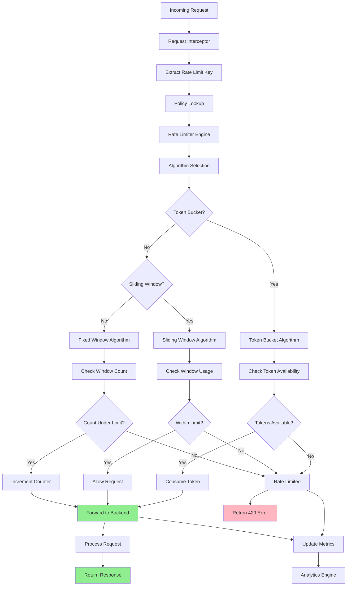
```mermaid
flowchart TD
    A[Incoming Request] --> B[Request Interceptor]
    B --> C[Extract Rate Limit Key]
    C --> D[Policy Lookup]
    D --> E[Rate Limiter Engine]
    E --> F[Algorithm Selection]
    F --> G{Token Bucket?}
    G -->|Yes| H[Token Bucket Algorithm]
    G -->|No| I{Sliding Window?}
    I -->|Yes| J[Sliding Window Algorithm]
    I -->|No| K[Fixed Window Algorithm]
    
    H --> L[Check Token Availability]
    J --> M[Check Window Usage]
    K --> N[Check Window Count]
    
    L --> O{Tokens Available?}
    M --> P{Within Limit?}
    N --> Q{Count Under Limit?}
    
    O -->|Yes| R[Consume Token]
    O -->|No| S[Rate Limited]
    P -->|Yes| T[Allow Request]
    P -->|No| S
    Q -->|Yes| U[Increment Counter]
    Q -->|No| S
    
    R --> V[Forward to Backend]
    T --> V
    U --> V
    S --> W[Return 429 Error]
    V --> X[Process Request]
    X --> Y[Return Response]
    
    Z[Update Metrics] --> AA[Analytics Engine]
    S --> Z
    V --> Z
    
    style V fill:#90EE90
    style W fill:#FFB6C1
    style Y fill:#90EE90
```

#### Distributed Rate Limit Synchronization
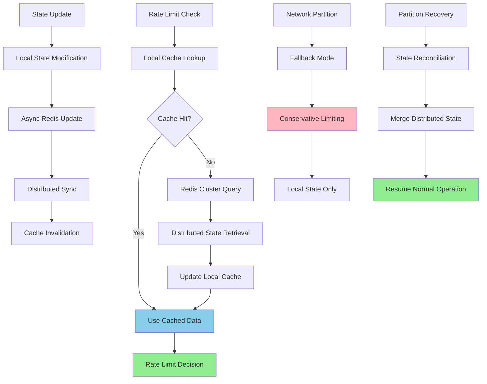
```mermaid
flowchart TD
    A[Rate Limit Check] --> B[Local Cache Lookup]
    B --> C{Cache Hit?}
    C -->|Yes| D[Use Cached Data]
    C -->|No| E[Redis Cluster Query]
    E --> F[Distributed State Retrieval]
    F --> G[Update Local Cache]
    G --> D
    D --> H[Rate Limit Decision]
    
    I[State Update] --> J[Local State Modification]
    J --> K[Async Redis Update]
    K --> L[Distributed Sync]
    L --> M[Cache Invalidation]
    
    N[Network Partition] --> O[Fallback Mode]
    O --> P[Conservative Limiting]
    P --> Q[Local State Only]
    
    R[Partition Recovery] --> S[State Reconciliation]
    S --> T[Merge Distributed State]
    T --> U[Resume Normal Operation]
    
    style D fill:#87CEEB
    style H fill:#90EE90
    style P fill:#FFB6C1
    style U fill:#90EE90
```

#### Policy Update and Configuration Flow
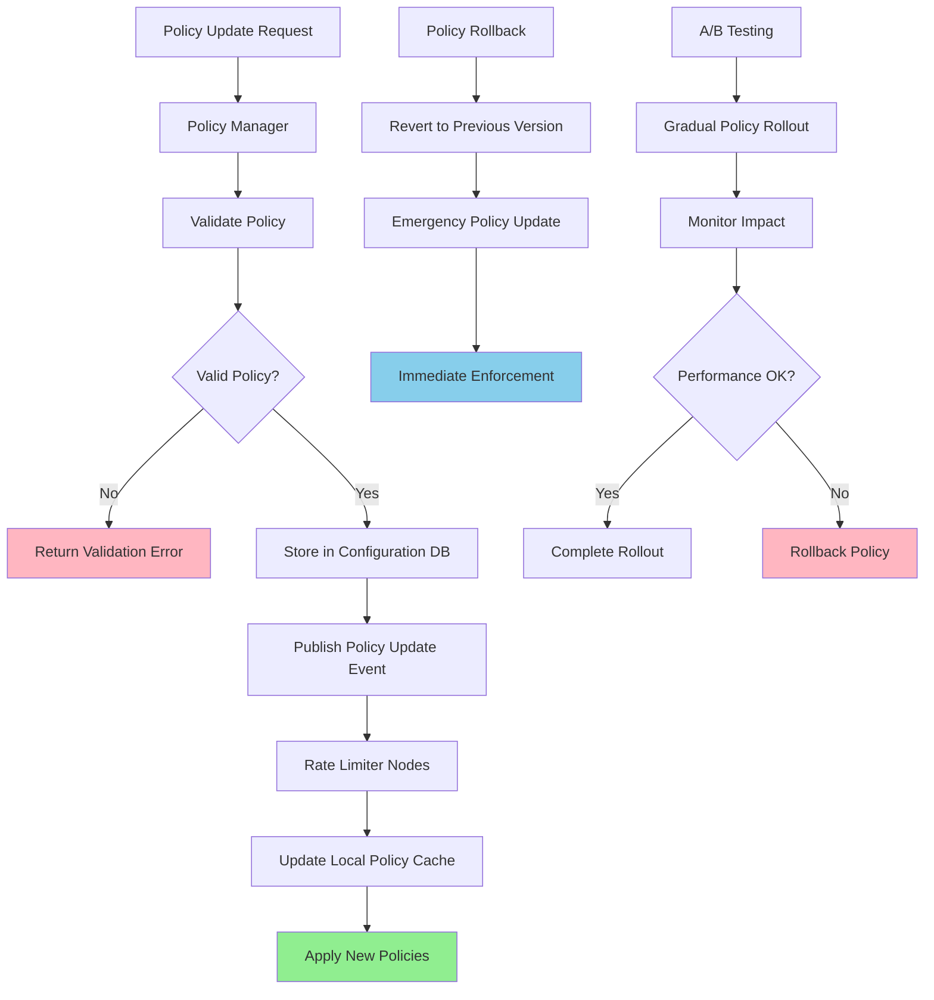
```mermaid
flowchart TD
    A[Policy Update Request] --> B[Policy Manager]
    B --> C[Validate Policy]
    C --> D{Valid Policy?}
    D -->|No| E[Return Validation Error]
    D -->|Yes| F[Store in Configuration DB]
    F --> G[Publish Policy Update Event]
    G --> H[Rate Limiter Nodes]
    H --> I[Update Local Policy Cache]
    I --> J[Apply New Policies]
    
    K[Policy Rollback] --> L[Revert to Previous Version]
    L --> M[Emergency Policy Update]
    M --> N[Immediate Enforcement]
    
    O[A/B Testing] --> P[Gradual Policy Rollout]
    P --> Q[Monitor Impact]
    Q --> R{Performance OK?}
    R -->|Yes| S[Complete Rollout]
    R -->|No| T[Rollback Policy]
    
    style J fill:#90EE90
    style E fill:#FFB6C1
    style N fill:#87CEEB
    style T fill:#FFB6C1
```

### 4.2 Database Design

#### Rate Limiting State Schema
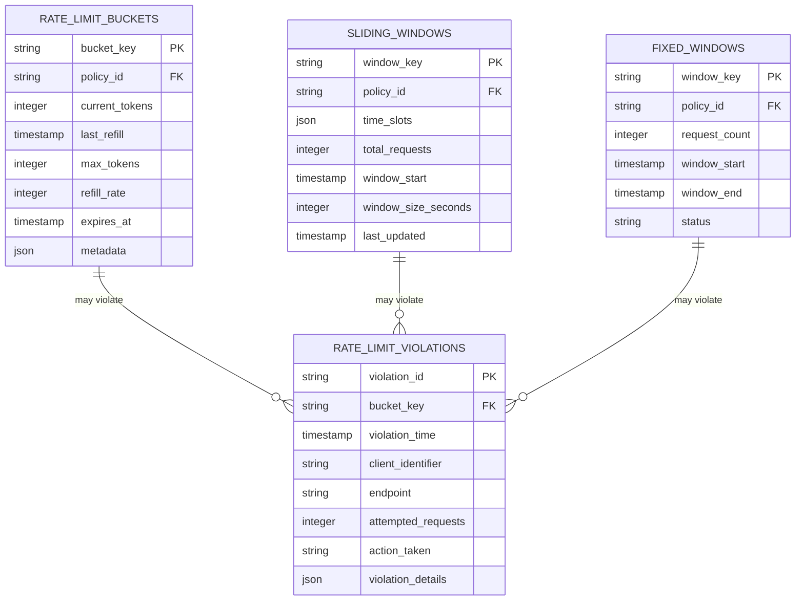
```mermaid
erDiagram
    RATE_LIMIT_BUCKETS {
        string bucket_key PK
        string policy_id FK
        integer current_tokens
        timestamp last_refill
        integer max_tokens
        integer refill_rate
        timestamp expires_at
        json metadata
    }
    
    SLIDING_WINDOWS {
        string window_key PK
        string policy_id FK
        json time_slots
        integer total_requests
        timestamp window_start
        integer window_size_seconds
        timestamp last_updated
    }
    
    FIXED_WINDOWS {
        string window_key PK
        string policy_id FK
        integer request_count
        timestamp window_start
        timestamp window_end
        string status
    }
    
    RATE_LIMIT_VIOLATIONS {
        string violation_id PK
        string bucket_key FK
        timestamp violation_time
        string client_identifier
        string endpoint
        integer attempted_requests
        string action_taken
        json violation_details
    }
    
    RATE_LIMIT_BUCKETS ||--o{ RATE_LIMIT_VIOLATIONS : "may violate"
    SLIDING_WINDOWS ||--o{ RATE_LIMIT_VIOLATIONS : "may violate"
    FIXED_WINDOWS ||--o{ RATE_LIMIT_VIOLATIONS : "may violate"
```

#### Policy and Configuration Schema
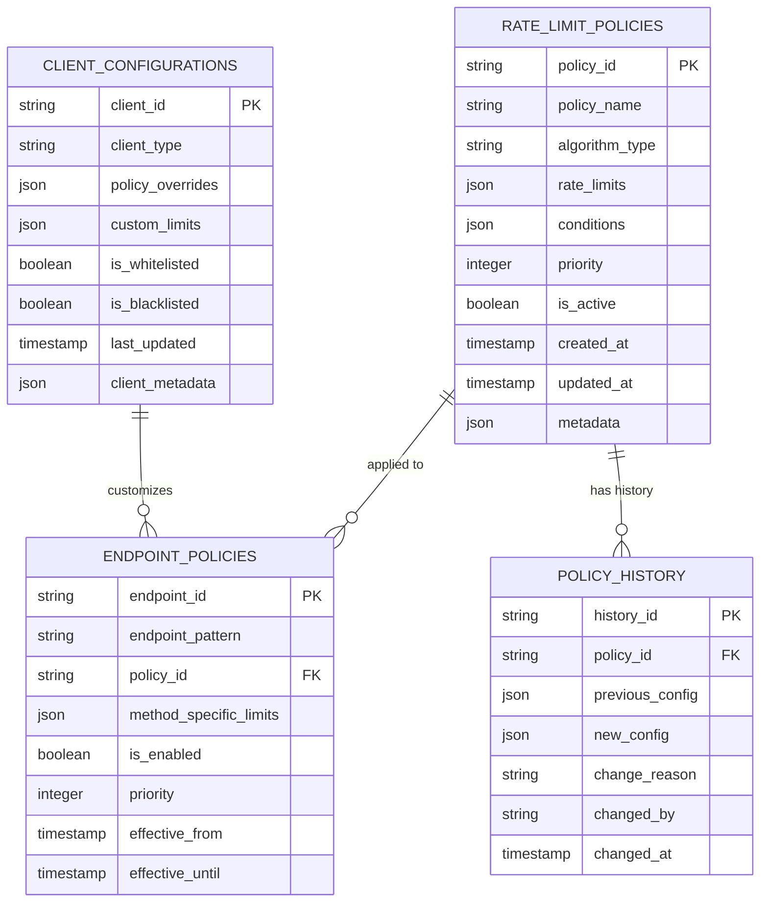
```mermaid
erDiagram
    RATE_LIMIT_POLICIES {
        string policy_id PK
        string policy_name
        string algorithm_type
        json rate_limits
        json conditions
        integer priority
        boolean is_active
        timestamp created_at
        timestamp updated_at
        json metadata
    }
    
    CLIENT_CONFIGURATIONS {
        string client_id PK
        string client_type
        json policy_overrides
        json custom_limits
        boolean is_whitelisted
        boolean is_blacklisted
        timestamp last_updated
        json client_metadata
    }
    
    ENDPOINT_POLICIES {
        string endpoint_id PK
        string endpoint_pattern
        string policy_id FK
        json method_specific_limits
        boolean is_enabled
        integer priority
        timestamp effective_from
        timestamp effective_until
    }
    
    POLICY_HISTORY {
        string history_id PK
        string policy_id FK
        json previous_config
        json new_config
        string change_reason
        string changed_by
        timestamp changed_at
    }
    
    RATE_LIMIT_POLICIES ||--o{ ENDPOINT_POLICIES : "applied to"
    RATE_LIMIT_POLICIES ||--o{ POLICY_HISTORY : "has history"
    CLIENT_CONFIGURATIONS ||--o{ ENDPOINT_POLICIES : "customizes"
```

## 5. Detailed Component Design

### 5.1 Rate Limiter Engine

**Purpose & Responsibilities:**
- Implement multiple rate limiting algorithms (token bucket, sliding window, etc.)
- Handle high-throughput rate limit evaluations with sub-millisecond latency
- Manage distributed state consistency across multiple nodes
- Support dynamic policy updates and real-time configuration changes
- Handle burst traffic and graceful degradation scenarios

**Algorithm Implementations:**
- **Token Bucket**: Fixed capacity with constant refill rate
- **Sliding Window Log**: Precise tracking with higher memory usage
- **Sliding Window Counter**: Approximate tracking with lower memory usage
- **Fixed Window Counter**: Simple implementation with potential burst issues
- **Leaky Bucket**: Smooth rate limiting with queue-based processing

**Performance Optimizations:**
- **Local Caching**: Cache frequently accessed rate limit states
- **Batch Processing**: Group multiple rate limit checks
- **Async Updates**: Non-blocking state updates to distributed storage
- **Connection Pooling**: Efficient Redis connection management

### 5.2 Policy Manager Service

**Purpose & Responsibilities:**
- Manage rate limiting policies and configuration
- Handle policy validation and conflict resolution
- Support policy versioning and rollback capabilities
- Implement A/B testing for policy changes
- Provide APIs for policy management and updates

**Policy Features:**
- **Hierarchical Policies**: Global, service, and endpoint-specific policies
- **Conditional Logic**: Complex conditions based on user attributes
- **Time-based Policies**: Different limits for different time periods
- **Geolocation Policies**: Region-specific rate limiting
- **Dynamic Scaling**: Auto-adjust limits based on system load

### 5.3 Distributed Storage Layer

**Purpose & Responsibilities:**
- Provide high-performance distributed storage for rate limit state
- Ensure data consistency across multiple nodes and regions
- Handle network partitions and node failures gracefully
- Support efficient range queries and bulk operations
- Implement data expiration and cleanup mechanisms

**Storage Strategies:**
- **Redis Cluster**: Distributed hash slots for horizontal scaling
- **Consistent Hashing**: Even distribution of rate limit keys
- **Replication**: Master-slave replication for high availability
- **Persistence**: Configurable persistence for durability requirements

### Critical User Journey Sequence Diagrams

#### High-Throughput Rate Limiting
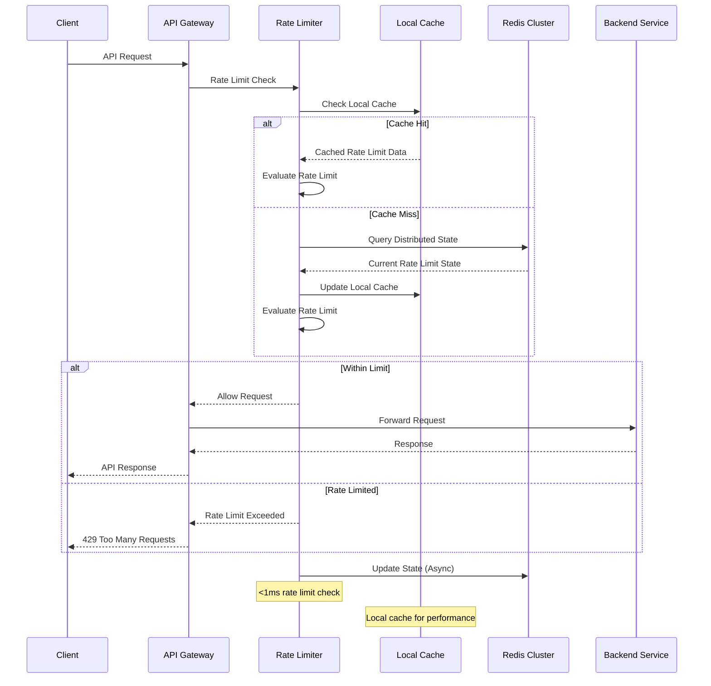
```mermaid
sequenceDiagram
    participant C as Client
    participant GW as API Gateway
    participant RL as Rate Limiter
    participant CACHE as Local Cache
    participant REDIS as Redis Cluster
    participant BS as Backend Service
    
    C->>GW: API Request
    GW->>RL: Rate Limit Check
    RL->>CACHE: Check Local Cache
    
    alt Cache Hit
        CACHE-->>RL: Cached Rate Limit Data
        RL->>RL: Evaluate Rate Limit
    else Cache Miss
        RL->>REDIS: Query Distributed State
        REDIS-->>RL: Current Rate Limit State
        RL->>CACHE: Update Local Cache
        RL->>RL: Evaluate Rate Limit
    end
    
    alt Within Limit
        RL-->>GW: Allow Request
        GW->>BS: Forward Request
        BS-->>GW: Response
        GW-->>C: API Response
    else Rate Limited
        RL-->>GW: Rate Limit Exceeded
        GW-->>C: 429 Too Many Requests
    end
    
    RL->>REDIS: Update State (Async)
    
    Note over RL: <1ms rate limit check
    Note over CACHE: Local cache for performance
```

#### Policy Update Propagation
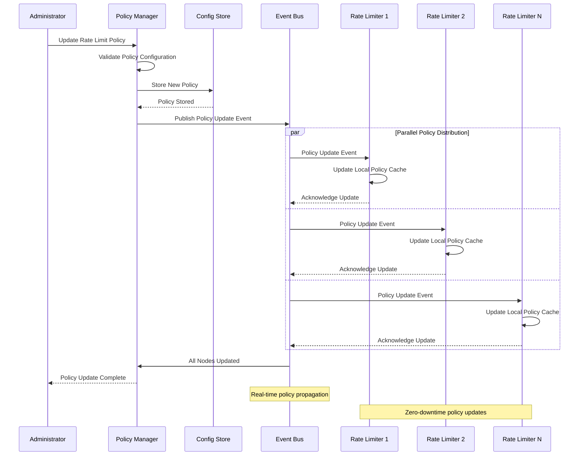
```mermaid
sequenceDiagram
    participant ADMIN as Administrator
    participant PM as Policy Manager
    participant CONFIG as Config Store
    participant EVENT as Event Bus
    participant RL1 as Rate Limiter 1
    participant RL2 as Rate Limiter 2
    participant RLN as Rate Limiter N
    
    ADMIN->>PM: Update Rate Limit Policy
    PM->>PM: Validate Policy Configuration
    PM->>CONFIG: Store New Policy
    CONFIG-->>PM: Policy Stored
    PM->>EVENT: Publish Policy Update Event
    
    par Parallel Policy Distribution
        EVENT->>RL1: Policy Update Event
        RL1->>RL1: Update Local Policy Cache
        RL1-->>EVENT: Acknowledge Update
        and
        EVENT->>RL2: Policy Update Event
        RL2->>RL2: Update Local Policy Cache
        RL2-->>EVENT: Acknowledge Update
        and
        EVENT->>RLN: Policy Update Event
        RLN->>RLN: Update Local Policy Cache
        RLN-->>EVENT: Acknowledge Update
    end
    
    EVENT->>PM: All Nodes Updated
    PM-->>ADMIN: Policy Update Complete
    
    Note over EVENT: Real-time policy propagation
    Note over RL1,RLN: Zero-downtime policy updates
```

#### Distributed State Synchronization
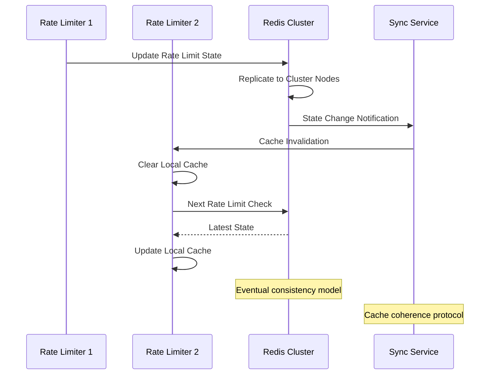
```mermaid
sequenceDiagram
    participant RL1 as Rate Limiter 1
    participant RL2 as Rate Limiter 2
    participant REDIS as Redis Cluster
    participant SYNC as Sync Service
    
    RL1->>REDIS: Update Rate Limit State
    REDIS->>REDIS: Replicate to Cluster Nodes
    REDIS->>SYNC: State Change Notification
    
    SYNC->>RL2: Cache Invalidation
    RL2->>RL2: Clear Local Cache
    
    RL2->>REDIS: Next Rate Limit Check
    REDIS-->>RL2: Latest State
    RL2->>RL2: Update Local Cache
    
    Note over REDIS: Eventual consistency model
    Note over SYNC: Cache coherence protocol
```

## 6. Scalability & Performance

### 6.1 Scaling Architecture

```mermaid
flowchart TD
    subgraph "Horizontal Scaling"
        A[Traffic Growth] --> B[Rate Limiter Scaling]
        B --> C[Load Balancer Distribution]
        C --> D[Auto Scaling Groups]
    end
    
    subgraph "Storage Scaling"
        E[State Storage Growth] --> F[Redis Cluster Scaling]
        F --> G[Horizontal Sharding]
        G --> H[Consistent Hashing]
    end
    
    subgraph "Performance Optimization"
        I[Latency Optimization] --> J[Local Caching]
        J --> K[Connection Pooling]
        K --> L[Batch Processing]
    end
    
    subgraph "Geographic Distribution"
        M[Global Traffic] --> N[Regional Rate Limiters]
        N --> O[Edge Location Deployment]
        O --> P[Latency Reduction]
    end
    
    style D fill:#87CEEB
    style H fill:#90EE90
    style L fill:#FFB6C1
    style P fill:#DDA0DD
```

### 6.2 Performance Optimization

**Latency Optimization:**
- **Local Caching**: Cache rate limit state locally for frequently accessed keys
- **Connection Pooling**: Reuse Redis connections across requests
- **Batch Operations**: Group multiple rate limit checks into single Redis calls
- **Async Updates**: Non-blocking state updates to distributed storage

**Memory Optimization:**
- **Efficient Data Structures**: Optimized data structures for different algorithms
- **TTL Management**: Automatic expiration of unused rate limit entries
- **Compression**: Compress rate limit state data for storage efficiency
- **Memory Pooling**: Reuse memory allocations to reduce garbage collection

**Network Optimization:**
- **Protocol Optimization**: Use efficient binary protocols for Redis communication
- **Compression**: Compress network traffic between rate limiter nodes
- **Regional Deployment**: Deploy rate limiters close to application servers
- **CDN Integration**: Edge-level rate limiting for global applications

## 7. Reliability & Fault Tolerance

### 7.1 High Availability Design

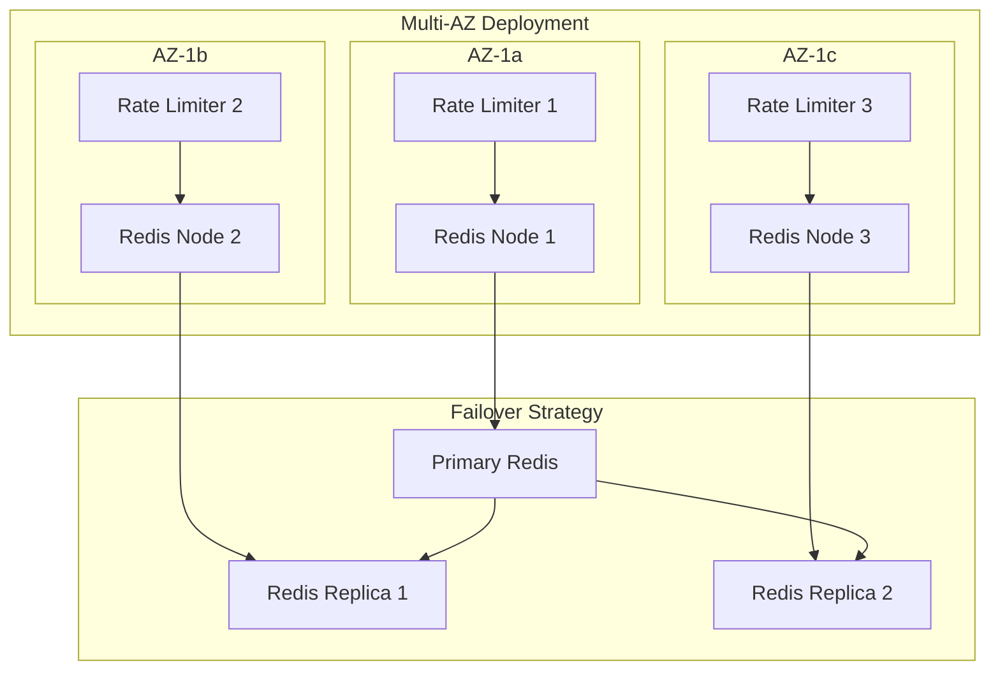
```mermaid
graph TB
    subgraph "Multi-AZ Deployment"
        subgraph "AZ-1a"
            RL1[Rate Limiter 1]
            REDIS1[Redis Node 1]
        end
        
        subgraph "AZ-1b"
            RL2[Rate Limiter 2]
            REDIS2[Redis Node 2]
        end
        
        subgraph "AZ-1c"
            RL3[Rate Limiter 3]
            REDIS3[Redis Node 3]
        end
    end
    
    subgraph "Failover Strategy"
        PRIMARY[Primary Redis]
        REPLICA1[Redis Replica 1]
        REPLICA2[Redis Replica 2]
    end
    
    RL1 --> REDIS1
    RL2 --> REDIS2
    RL3 --> REDIS3
    
    REDIS1 --> PRIMARY
    REDIS2 --> REPLICA1
    REDIS3 --> REPLICA2
    
    PRIMARY --> REPLICA1
    PRIMARY --> REPLICA2
```

**Fault Tolerance Mechanisms:**
- **Graceful Degradation**: Continue operation with reduced accuracy during failures
- **Circuit Breakers**: Prevent cascade failures in distributed components
- **Fallback Strategies**: Local rate limiting when distributed state is unavailable
- **Health Monitoring**: Continuous health checks and automatic recovery

### 7.2 Disaster Recovery

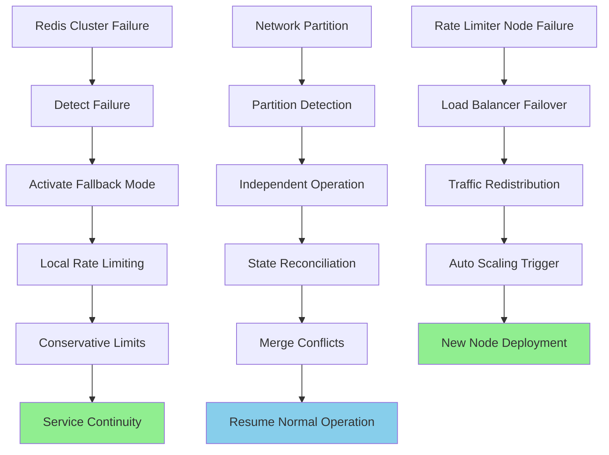
```mermaid
flowchart TD
    A[Redis Cluster Failure] --> B[Detect Failure]
    B --> C[Activate Fallback Mode]
    C --> D[Local Rate Limiting]
    D --> E[Conservative Limits]
    E --> F[Service Continuity]
    
    G[Network Partition] --> H[Partition Detection]
    H --> I[Independent Operation]
    I --> J[State Reconciliation]
    J --> K[Merge Conflicts]
    K --> L[Resume Normal Operation]
    
    M[Rate Limiter Node Failure] --> N[Load Balancer Failover]
    N --> O[Traffic Redistribution]
    O --> P[Auto Scaling Trigger]
    P --> Q[New Node Deployment]
    
    style F fill:#90EE90
    style L fill:#87CEEB
    style Q fill:#90EE90
```

**RTO/RPO Targets:**
- **RTO**: 30 seconds for node failover, 5 minutes for cluster recovery
- **RPO**: 1 second for rate limit state (acceptable for rate limiting use case)
- **Availability**: 99.99% with graceful degradation to 99.9% during failures
- **Data Consistency**: Eventual consistency with conflict resolution

## 8. Security Architecture

### 8.1 Security Layers

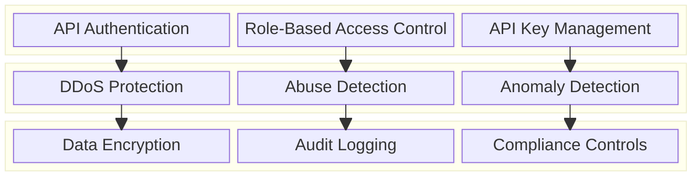
```mermaid
block-beta
    columns 3
    
    block:access:3
        API_AUTH["API Authentication"]
        RBAC["Role-Based Access Control"]
        API_KEYS["API Key Management"]
    end
    
    block:protection:3
        DDOS["DDoS Protection"]
        ABUSE["Abuse Detection"]
        ANOMALY["Anomaly Detection"]
    end
    
    block:data:3
        ENCRYPT["Data Encryption"]
        AUDIT["Audit Logging"]
        COMPLIANCE["Compliance Controls"]
    end
    
    API_AUTH --> DDOS
    RBAC --> ABUSE
    API_KEYS --> ANOMALY
    DDOS --> ENCRYPT
    ABUSE --> AUDIT
    ANOMALY --> COMPLIANCE
```

**Security Features:**
- **Authentication**: Secure API access for rate limiting configuration
- **Authorization**: Role-based access control for policy management
- **Audit Logging**: Comprehensive logging of rate limiting decisions
- **Anomaly Detection**: Detect unusual patterns and potential attacks

**Threat Protection:**
- **DDoS Mitigation**: Rate limiting as part of DDoS protection strategy
- **Abuse Prevention**: Detect and prevent API abuse patterns
- **Bot Detection**: Identify and handle automated traffic
- **IP Reputation**: Integrate with IP reputation services

### 8.2 Security Event Response

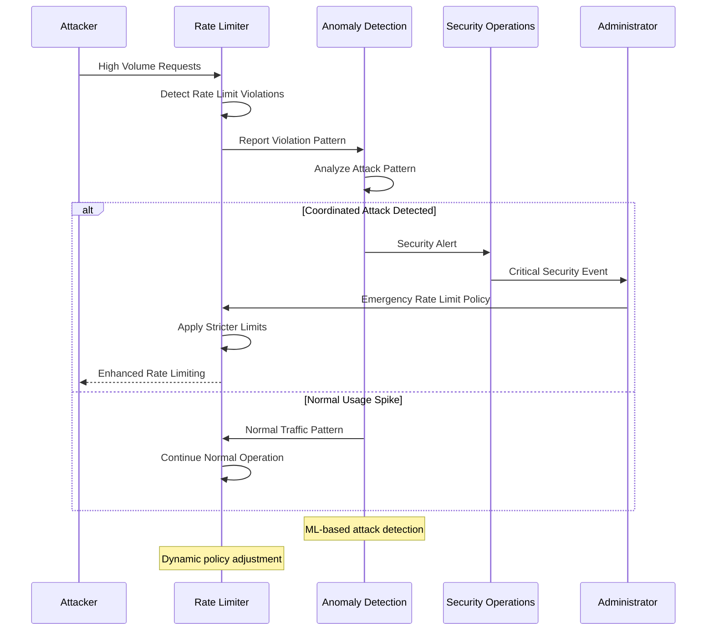
```mermaid
sequenceDiagram
    participant ATTACKER as Attacker
    participant RL as Rate Limiter
    participant ANOMALY as Anomaly Detection
    participant SOC as Security Operations
    participant ADMIN as Administrator
    
    ATTACKER->>RL: High Volume Requests
    RL->>RL: Detect Rate Limit Violations
    RL->>ANOMALY: Report Violation Pattern
    ANOMALY->>ANOMALY: Analyze Attack Pattern
    
    alt Coordinated Attack Detected
        ANOMALY->>SOC: Security Alert
        SOC->>ADMIN: Critical Security Event
        ADMIN->>RL: Emergency Rate Limit Policy
        RL->>RL: Apply Stricter Limits
        RL-->>ATTACKER: Enhanced Rate Limiting
    else Normal Usage Spike
        ANOMALY->>RL: Normal Traffic Pattern
        RL->>RL: Continue Normal Operation
    end
    
    Note over ANOMALY: ML-based attack detection
    Note over RL: Dynamic policy adjustment
```

## 9. Monitoring & Observability

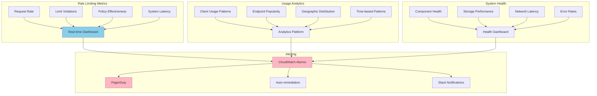
```mermaid
flowchart TD
    subgraph "Rate Limiting Metrics"
        A[Request Rate] --> E[Real-time Dashboard]
        B[Limit Violations] --> E
        C[Policy Effectiveness] --> E
        D[System Latency] --> E
    end
    
    subgraph "Usage Analytics"
        F[Client Usage Patterns] --> G[Analytics Platform]
        H[Endpoint Popularity] --> G
        I[Geographic Distribution] --> G
        J[Time-based Patterns] --> G
    end
    
    subgraph "System Health"
        K[Component Health] --> L[Health Dashboard]
        M[Storage Performance] --> L
        N[Network Latency] --> L
        O[Error Rates] --> L
    end
    
    subgraph "Alerting"
        E --> P[CloudWatch Alarms]
        G --> P
        L --> P
        P --> Q[PagerDuty]
        P --> R[Auto-remediation]
        P --> S[Slack Notifications]
    end
    
    style E fill:#87CEEB
    style P fill:#FFB6C1
    style Q fill:#FFB6C1
```

**Key Performance Indicators:**
- **Rate Limiting Accuracy**: Percentage of correctly applied rate limits
- **System Performance**: Latency and throughput of rate limiting checks
- **Policy Effectiveness**: Success rate of rate limiting policies
- **Security Metrics**: Blocked attacks and abuse prevention effectiveness

**Alerting Strategy:**
- **Critical**: Rate limiter service failures, security attacks, data inconsistency
- **Warning**: High latency, policy conflicts, unusual traffic patterns
- **Info**: Policy updates, capacity scaling events, usage trends

## 10. Cost Optimization

**Service-Level Cost Analysis:**
- **ElastiCache Redis**: $2,500/month (Redis cluster for distributed state)
- **ECS Fargate**: $1,800/month (Rate limiting service containers)
- **DynamoDB**: $800/month (Policy and configuration storage)
- **CloudWatch**: $400/month (Metrics, logs, and monitoring)
- **Data Transfer**: $600/month (Cross-AZ and internet traffic)
- **Lambda**: $300/month (Event processing and notifications)
- **Load Balancers**: $200/month (Traffic distribution)
- **Total Estimated**: ~$6,600/month for enterprise-scale rate limiting

**Cost Optimization Strategies:**
- **Right-sizing**: Optimize Redis cluster size based on actual usage
- **Reserved Instances**: Long-term commitments for predictable savings
- **Data Retention**: Implement TTL for rate limiting data to reduce storage costs
- **Regional Optimization**: Deploy services in cost-effective regions
- **Compression**: Reduce network and storage costs through data compression

**Cost Monitoring:**
- **Usage Analytics**: Track cost per rate limit evaluation
- **Resource Utilization**: Monitor and optimize underutilized resources
- **Policy Efficiency**: Measure cost-effectiveness of different rate limiting policies
- **Scaling Efficiency**: Optimize auto-scaling to minimize costs

## 11. Implementation Strategy

### 11.1 Migration/Deployment Plan

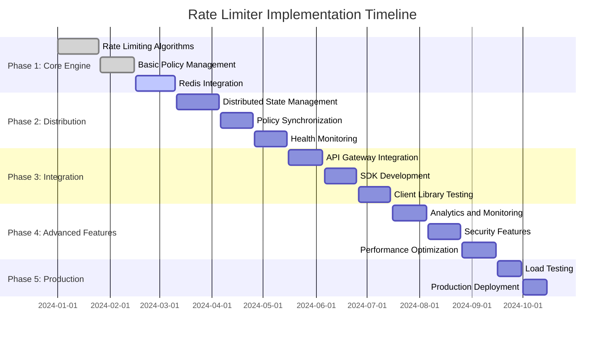
```mermaid
gantt
    title Rate Limiter Implementation Timeline
    dateFormat  YYYY-MM-DD
    section Phase 1: Core Engine
    Rate Limiting Algorithms    :done,    algo1,   2024-01-01, 2024-01-25
    Basic Policy Management     :done,    policy1, 2024-01-26, 2024-02-15
    Redis Integration          :active,  redis1,  2024-02-16, 2024-03-10
    
    section Phase 2: Distribution
    Distributed State Management :       dist1,   2024-03-11, 2024-04-05
    Policy Synchronization      :       sync1,   2024-04-06, 2024-04-25
    Health Monitoring          :       health1, 2024-04-26, 2024-05-15
    
    section Phase 3: Integration
    API Gateway Integration     :       api1,    2024-05-16, 2024-06-05
    SDK Development            :       sdk1,    2024-06-06, 2024-06-25
    Client Library Testing     :       test1,   2024-06-26, 2024-07-15
    
    section Phase 4: Advanced Features
    Analytics and Monitoring    :       mon1,    2024-07-16, 2024-08-05
    Security Features          :       sec1,    2024-08-06, 2024-08-25
    Performance Optimization   :       perf1,   2024-08-26, 2024-09-15
    
    section Phase 5: Production
    Load Testing               :       load1,   2024-09-16, 2024-09-30
    Production Deployment      :       prod1,   2024-10-01, 2024-10-15
```

### 11.2 Technology Decisions & Trade-offs

**Algorithm Selection:**
- **Token Bucket vs Sliding Window**: Token bucket for burst handling, sliding window for precise limiting
- **Fixed vs Sliding Window**: Sliding window for accuracy, fixed window for simplicity
- **Memory vs Accuracy**: Trade-off between memory usage and rate limiting precision
- **Centralized vs Distributed**: Distributed for scalability, centralized for consistency

**Storage Technology:**
- **Redis vs MemoryDB**: Redis for cost-effectiveness, MemoryDB for ultra-low latency
- **Cluster vs Single Node**: Cluster for scalability, single node for simplicity
- **Persistence vs In-memory**: Persistence for durability, in-memory for performance
- **Replication Strategy**: Master-slave for read scaling, master-master for write scaling

**Integration Approach:**
- **Sidecar vs Gateway**: Sidecar for fine-grained control, gateway for centralized management
- **Synchronous vs Asynchronous**: Synchronous for accuracy, asynchronous for performance
- **Pull vs Push**: Pull for client control, push for real-time updates
- **SDK vs API**: SDK for ease of use, API for flexibility

**Future Evolution Path:**
- **Machine Learning**: AI-based rate limiting with predictive capabilities
- **Edge Computing**: Rate limiting at CDN edge locations
- **Blockchain Integration**: Decentralized rate limiting for distributed applications
- **5G Optimization**: Ultra-low latency rate limiting for 5G applications

**Technical Debt & Improvement Areas:**
- **Advanced Algorithms**: Implement more sophisticated rate limiting algorithms
- **Predictive Scaling**: AI-based prediction of rate limiting requirements
- **Cross-Region Consistency**: Improve consistency across geographic regions
- **Real-time Analytics**: Enhanced real-time monitoring and alerting capabilities
