# Online Marketplace System Design Architecture

## 1. Executive Summary & Requirements

### System Overview
A comprehensive online marketplace platform that connects buyers and sellers, facilitating product discovery, transactions, and fulfillment. The system handles millions of products, users, and transactions with advanced search, recommendation engines, and integrated payment processing similar to Amazon or eBay.

### Functional Requirements
- **Product Catalog**: Manage millions of products with rich metadata and media
- **User Management**: Buyer and seller accounts with profiles and preferences
- **Search & Discovery**: Advanced search with filters, facets, and recommendations
- **Shopping Cart**: Persistent cart across devices with saved items
- **Order Management**: End-to-end order processing and tracking
- **Payment Processing**: Multiple payment methods with fraud detection
- **Inventory Management**: Real-time inventory tracking and updates
- **Reviews & Ratings**: User-generated reviews and seller ratings
- **Seller Tools**: Seller dashboard, analytics, and inventory management
- **Customer Service**: Support ticket system and dispute resolution

### Non-Functional Requirements
- **Availability**: 99.99% uptime with global distribution
- **Latency**: <200ms for search, <100ms for product pages
- **Scale**: 100M+ products, 10M+ active users, 1M+ orders per day
- **Throughput**: 10K+ concurrent users, 1K+ orders per minute
- **Consistency**: Strong consistency for orders and payments, eventual for catalog
- **Security**: PCI DSS compliance and fraud prevention

### Key Constraints
- Handle seasonal traffic spikes (Black Friday, holiday shopping)
- Maintain inventory accuracy across multiple sellers
- Ensure payment security and regulatory compliance
- Support international markets with different currencies and languages

### Success Metrics
- 99.99% availability during peak shopping periods
- <150ms average search response time
- >95% successful payment processing rate
- <1% cart abandonment due to technical issues
- Support 1M+ concurrent active users

## 2. High-Level Architecture Overview

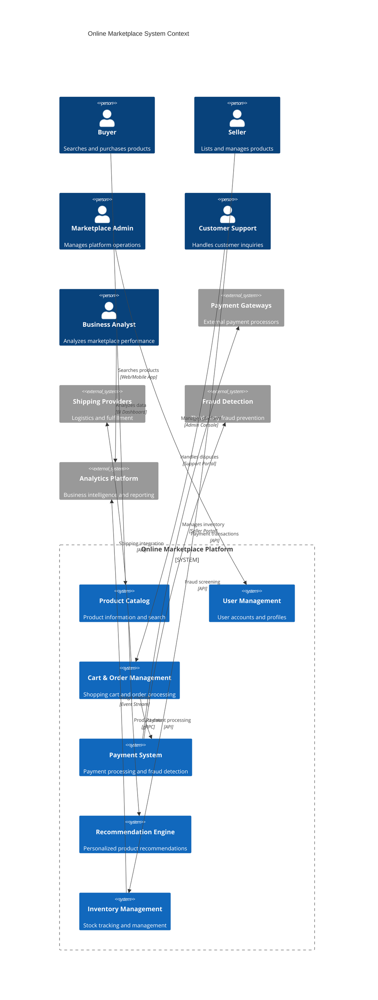

**Architectural Style Rationale**: Event-driven microservices architecture chosen for:
- Independent scaling of different marketplace functions
- Technology diversity for specialized requirements (search, payments, ML)
- Fault isolation between critical and non-critical services
- Support for multiple seller integrations and third-party services
- Flexible deployment and feature rollout capabilities

## 3. Detailed System Architecture

### 3.1 AWS Service Stack Selection

**Application Services:**
- **EKS**: Kubernetes orchestration for microservices
- **ECS Fargate**: Serverless containers for batch processing
- **Lambda**: Event processing and serverless functions
- **API Gateway**: API management with rate limiting and caching

**Search & Analytics:**
- **OpenSearch**: Product search and analytics
- **Kinesis**: Real-time data streaming and processing
- **EMR**: Large-scale data processing for recommendations
- **SageMaker**: Machine learning for recommendations and fraud detection

**Data Layer:**
- **DynamoDB**: Product catalog, user profiles, and cart data
- **Aurora PostgreSQL**: Orders, payments, and transactional data
- **ElastiCache Redis**: Session management and caching
- **S3**: Product images, documents, and data lakes

**Payment & Security:**
- **Payment Cryptography**: Secure payment processing
- **KMS**: Encryption key management
- **Secrets Manager**: API keys and credentials
- **WAF**: Web application firewall protection

**Messaging:**
- **SQS**: Order processing and inventory updates
- **SNS**: Event notifications and alerts
- **EventBridge**: Event routing and third-party integrations
- **MSK**: High-throughput event streaming

**Storage & CDN:**
- **S3**: Static assets and media storage
- **CloudFront**: Global content delivery
- **EFS**: Shared file storage for applications

**Monitoring:**
- **CloudWatch**: Application and infrastructure monitoring
- **X-Ray**: Distributed tracing and performance analysis
- **CloudTrail**: API audit logging

### 3.2 Component Architecture Diagram

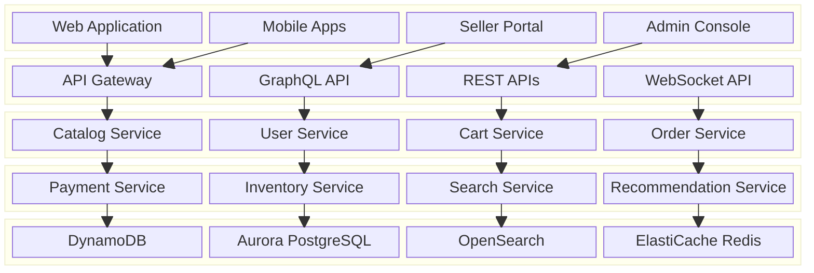

## 4. Data Architecture & Flow

### 4.1 Data Flow Diagrams

#### Product Search and Discovery Flow
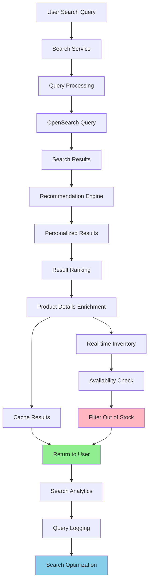

#### Order Processing and Fulfillment Flow
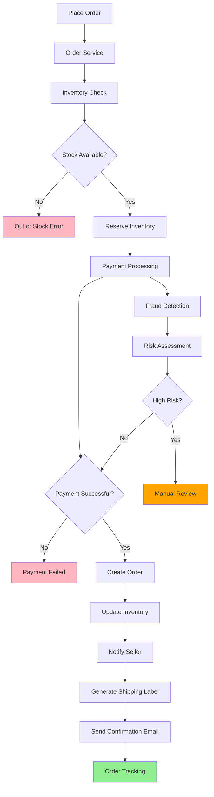

#### Real-time Inventory Synchronization Flow
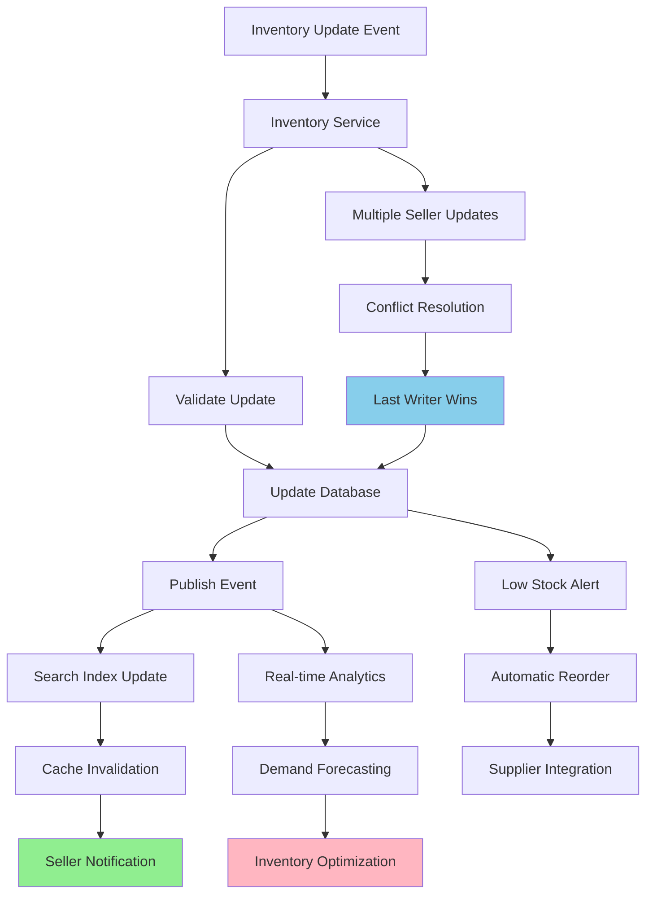

### 4.2 Database Design

#### Product Catalog Schema (DynamoDB)
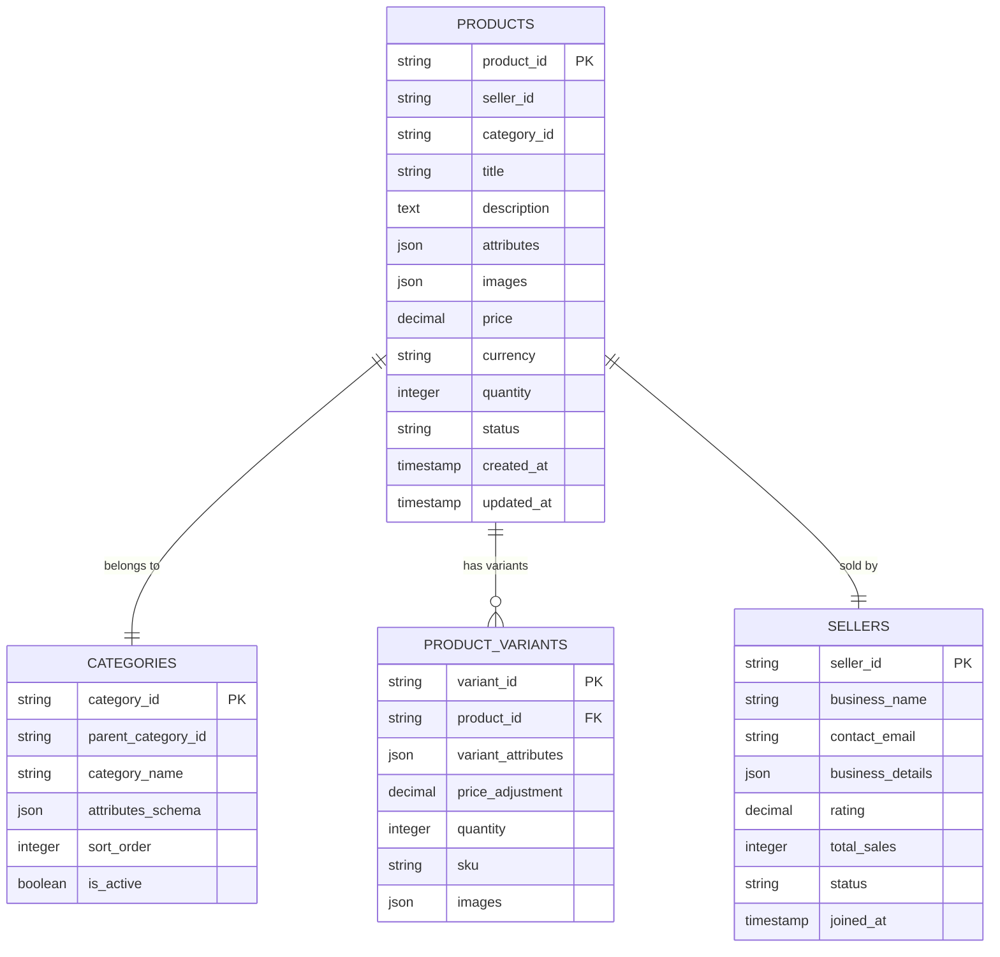

#### Order Management Schema (Aurora PostgreSQL)
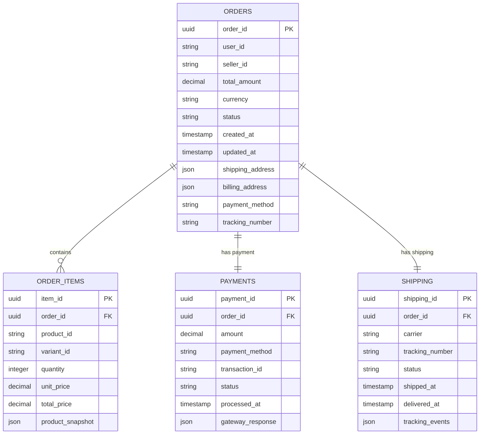

## 5. Detailed Component Design

### 5.1 Product Catalog Service

**Purpose & Responsibilities:**
- Manage product information, metadata, and media assets
- Handle product categorization and attribute management
- Support bulk product uploads and updates
- Maintain product relationships and variants
- Implement product lifecycle management

**Key Features:**
- **Rich Product Data**: Support for complex product attributes and specifications
- **Media Management**: Image optimization, multiple formats, and CDN integration
- **Bulk Operations**: Efficient handling of large product catalogs
- **Versioning**: Track product changes and maintain history
- **Multi-language**: Support for international product descriptions

**Performance Optimizations:**
- **Caching Strategy**: Multi-layer caching for frequently accessed products
- **CDN Integration**: Global distribution of product images and media
- **Lazy Loading**: Progressive loading of product details
- **Search Integration**: Real-time sync with search indexes

### 5.2 Search Service

**Purpose & Responsibilities:**
- Provide fast and relevant product search capabilities
- Handle complex queries with filters, facets, and sorting
- Implement auto-complete and search suggestions
- Support typo tolerance and synonym handling
- Generate search analytics and insights

**Search Features:**
- **Full-text Search**: Advanced text matching with relevance scoring
- **Faceted Search**: Dynamic filters based on product attributes
- **Personalization**: Search results tailored to user preferences
- **Visual Search**: Image-based product discovery
- **Voice Search**: Natural language query processing

**Scaling Strategies:**
- **Index Sharding**: Distribute search indexes across multiple nodes
- **Caching**: Cache popular search queries and results
- **Real-time Updates**: Incremental index updates for product changes
- **Geographic Distribution**: Regional search clusters for reduced latency

### 5.3 Order Management Service

**Purpose & Responsibilities:**
- Handle the complete order lifecycle from creation to fulfillment
- Coordinate with inventory, payment, and shipping services
- Implement order state management and transitions
- Support order modifications and cancellations
- Generate order analytics and reporting

**Order Processing Features:**
- **Atomic Transactions**: Ensure order consistency across services
- **State Machine**: Robust order state management
- **Compensation**: Handle failed transactions with compensating actions
- **Audit Trail**: Complete order history and change tracking
- **Bulk Processing**: Efficient handling of large order volumes

### Critical User Journey Sequence Diagrams

#### Product Search and Purchase Flow
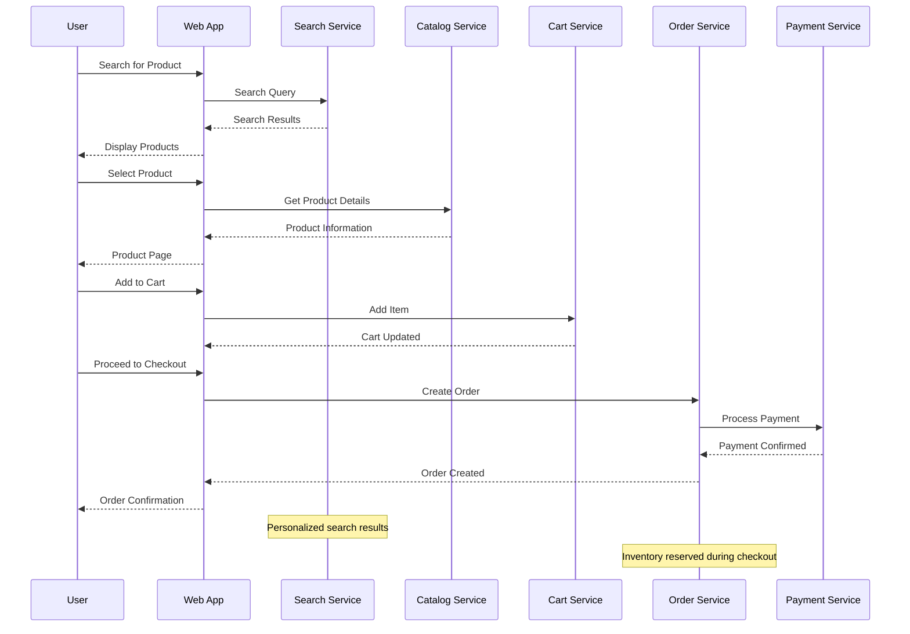

#### Seller Product Management
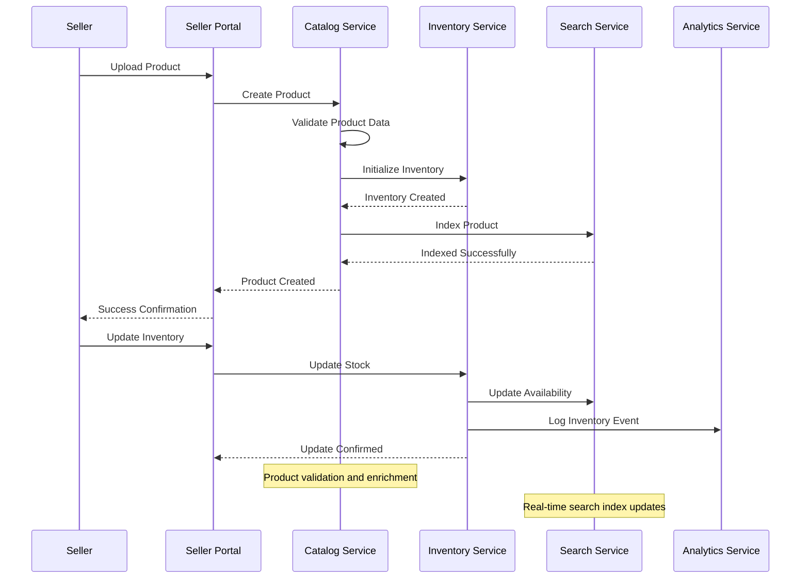

#### Order Fulfillment Process
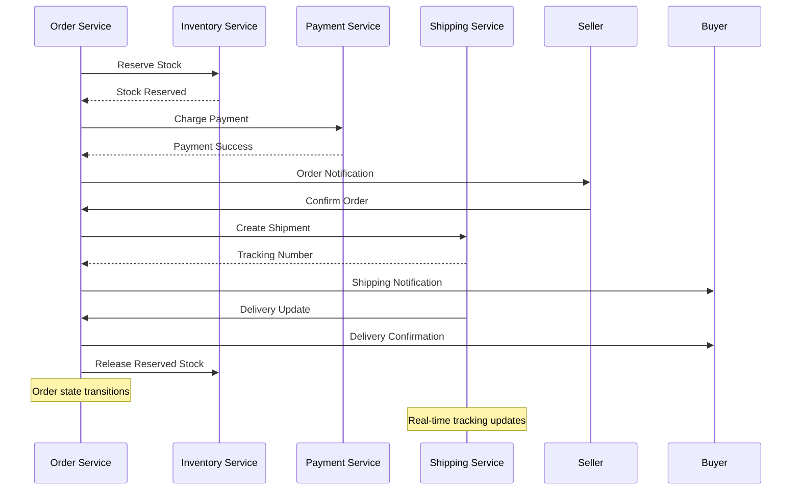

## 6. Scalability & Performance

### 6.1 Scaling Architecture

```mermaid
flowchart TD
    subgraph "Horizontal Scaling"
        A[Traffic Growth] --> B[Load Balancer Scaling]
        B --> C[Microservice Auto-scaling]
        C --> D[Database Sharding]
    end
    
    subgraph "Search Scaling"
        E[Search Volume Growth] --> F[OpenSearch Cluster Scaling]
        F --> G[Index Sharding]
        G --> H[Query Optimization]
    end
    
    subgraph "Data Scaling"
        I[Data Growth] --> J[Database Partitioning]
        J --> K[Read Replicas]
        K --> L[Caching Layers]
    end
    
    subgraph "Global Scaling"
        M[Geographic Expansion] --> N[Multi-Region Deployment]
        N --> O[CDN Edge Locations]
        O --> P[Regional Data Centers]
    end
    
    style C fill:#87CEEB
    style G fill:#90EE90
    style K fill:#FFB6C1
    style P fill:#DDA0DD
```

### 6.2 Performance Optimization

**Frontend Performance:**
- **CDN Integration**: Global content delivery for static assets
- **Image Optimization**: Multiple formats, lazy loading, and compression
- **Caching Strategy**: Browser caching and service worker implementation
- **Progressive Loading**: Incremental page rendering and content loading

**Backend Performance:**
- **Database Optimization**: Query optimization, indexing, and connection pooling
- **Caching Layers**: Multi-level caching (application, database, CDN)
- **Async Processing**: Background processing for non-critical operations
- **Connection Pooling**: Efficient database and service connections

**Search Performance:**
- **Index Optimization**: Efficient index structures and query patterns
- **Result Caching**: Cache popular search queries and results
- **Facet Optimization**: Pre-computed facets for faster filtering
- **Personalization**: Cached user preferences and recommendation models

## 7. Reliability & Fault Tolerance

### 7.1 High Availability Design

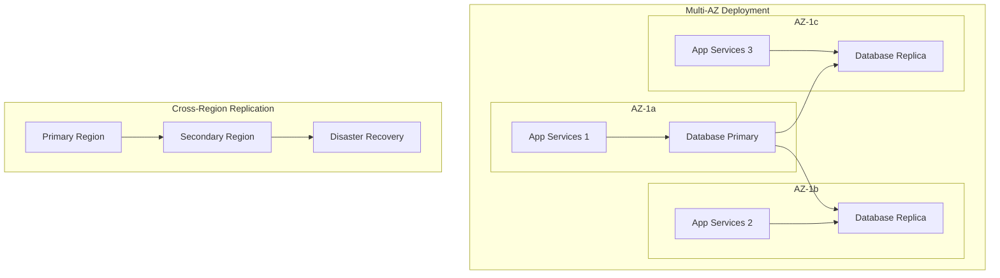

**Fault Tolerance Mechanisms:**
- **Circuit Breakers**: Prevent cascade failures between services
- **Bulkhead Pattern**: Isolate critical resources and prevent resource exhaustion
- **Graceful Degradation**: Maintain core functionality during partial outages
- **Retry Logic**: Intelligent retry mechanisms with exponential backoff

### 7.2 Disaster Recovery

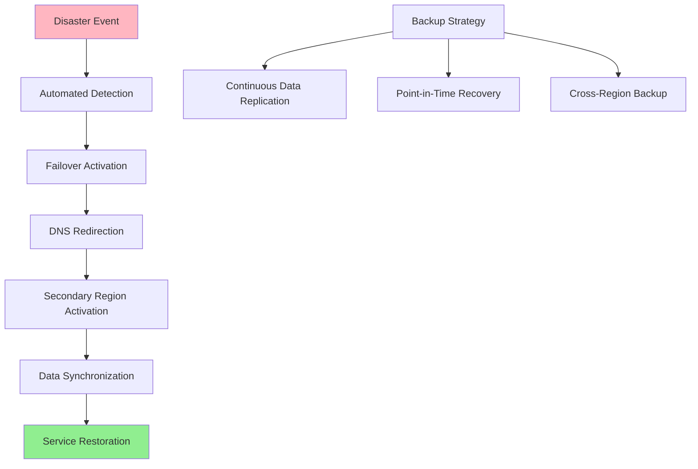

**RTO/RPO Targets:**
- **RTO**: 15 minutes for critical services, 1 hour for full restoration
- **RPO**: 5 minutes for transactional data, 1 hour for catalog data
- **Backup Frequency**: Continuous replication for critical data
- **Recovery Testing**: Monthly disaster recovery drills

## 8. Security Architecture

### 8.1 Security Layers

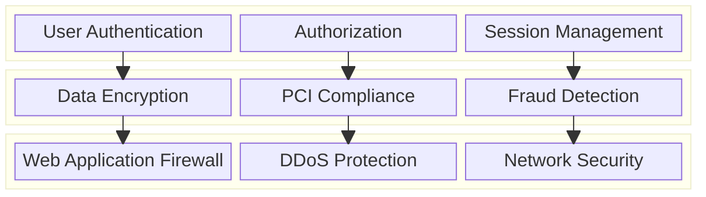

**Security Features:**
- **Multi-Factor Authentication**: Enhanced security for seller and admin accounts
- **PCI DSS Compliance**: Secure payment card data handling
- **Fraud Detection**: ML-based fraud prevention and risk assessment
- **Data Encryption**: End-to-end encryption for sensitive data

**Payment Security:**
- **Tokenization**: Replace sensitive payment data with tokens
- **Secure Vault**: Encrypted storage of payment information
- **Fraud Scoring**: Real-time fraud risk assessment
- **3D Secure**: Additional authentication for card transactions

### 8.2 Payment Security Flow

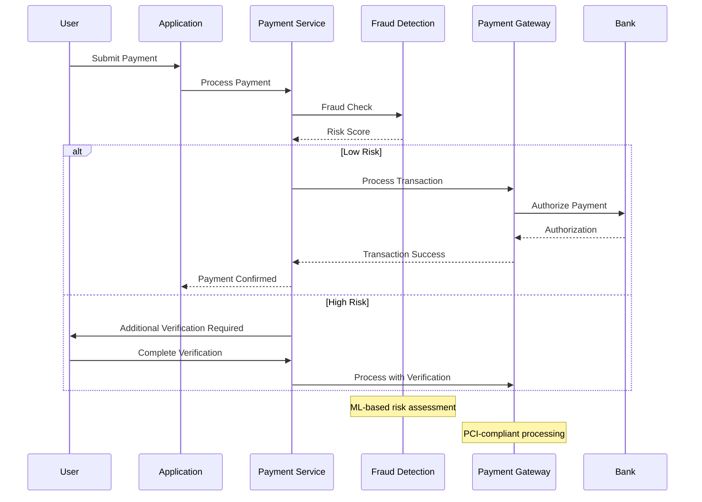

## 9. Monitoring & Observability

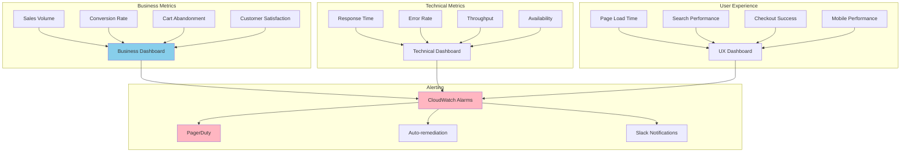

**Key Performance Indicators:**
- **Business**: Revenue, conversion rates, average order value, customer lifetime value
- **Technical**: API response times, error rates, search performance, database performance
- **User Experience**: Page load times, checkout success rates, mobile performance
- **Security**: Fraud detection accuracy, security incident response times

**Alerting Strategy:**
- **Critical**: Payment processing failures, security breaches, site outages
- **Warning**: High error rates, slow response times, inventory issues
- **Info**: Traffic spikes, new seller registrations, promotional campaign performance

## 10. Cost Optimization

**Service-Level Cost Analysis:**
- **EKS**: $8,000/month (Application services, 100 nodes)
- **DynamoDB**: $4,000/month (Product catalog and user data)
- **Aurora**: $3,500/month (Orders and transactional data)
- **OpenSearch**: $3,000/month (Product search and analytics)
- **ElastiCache**: $2,000/month (Caching layer)
- **S3 + CloudFront**: $2,500/month (Media storage and delivery)
- **Data Transfer**: $1,500/month (Cross-region and internet traffic)
- **Other Services**: $2,500/month (Lambda, SQS, monitoring, etc.)
- **Total Estimated**: ~$27,000/month for 1M active users

**Cost Optimization Strategies:**
- **Reserved Instances**: 40% savings on predictable compute workloads
- **Spot Instances**: 60% savings on batch processing and development environments
- **S3 Intelligent Tiering**: Automatic cost optimization for media storage
- **Database Optimization**: Query optimization and right-sizing
- **CDN Optimization**: Efficient caching to reduce origin costs

## 11. Implementation Strategy

### 11.1 Migration/Deployment Plan

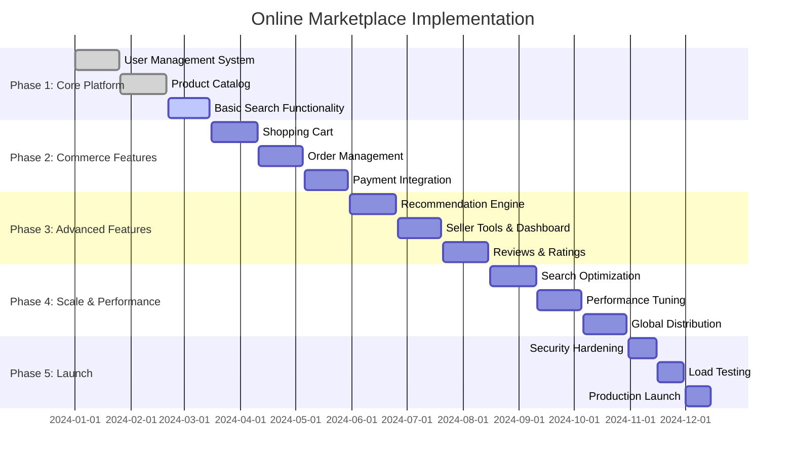

### 11.2 Technology Decisions & Trade-offs

**Database Strategy:**
- **DynamoDB vs Aurora**: DynamoDB for catalog and user data (scale), Aurora for transactions (ACID)
- **NoSQL vs SQL**: NoSQL for flexible product schemas, SQL for structured transactional data
- **Read Replicas**: Aurora read replicas for analytics and reporting workloads
- **Caching Strategy**: Multi-layer caching with Redis for performance optimization

**Search Technology:**
- **OpenSearch vs Elasticsearch**: OpenSearch for cost-effectiveness and AWS integration
- **Real-time vs Batch**: Real-time indexing for inventory, batch for analytics
- **Personalization**: Machine learning-based personalization with SageMaker
- **Faceted Search**: Pre-computed facets for better performance

**Payment Architecture:**
- **In-house vs Third-party**: Hybrid approach with third-party gateways and in-house fraud detection
- **PCI Compliance**: Minimize PCI scope with tokenization and secure vault
- **Multi-currency**: Support for international payments and currency conversion
- **Fraud Prevention**: ML-based fraud detection with real-time scoring

**Future Evolution Path:**
- **AI Enhancement**: Advanced recommendation algorithms and chatbot integration
- **Mobile Optimization**: Progressive web app and native mobile applications
- **Voice Commerce**: Voice-activated shopping and search capabilities
- **Blockchain Integration**: Supply chain transparency and smart contracts

**Technical Debt & Improvement Areas:**
- **Advanced Search**: Machine learning-based search ranking and personalization
- **Real-time Analytics**: Enhanced real-time business intelligence and reporting
- **International Expansion**: Multi-language, multi-currency, and regional compliance
- **Sustainability Features**: Carbon footprint tracking and eco-friendly options
