# Food Delivery System Design Architecture

## 1. Executive Summary & Requirements

### System Overview
A comprehensive food delivery platform that connects customers, restaurants, and delivery drivers, facilitating food ordering, real-time tracking, and efficient delivery logistics. The system handles millions of orders with real-time location tracking, dynamic pricing, and multi-party coordination similar to DoorDash or Uber Eats.

### Functional Requirements
- **Restaurant Management**: Restaurant profiles, menus, availability, and order management
- **Customer Ordering**: Browse restaurants, customize orders, and track deliveries
- **Driver Management**: Driver onboarding, order assignment, and earnings tracking
- **Real-time Tracking**: Live location tracking for customers and drivers
- **Order Management**: End-to-end order lifecycle from placement to delivery
- **Payment Processing**: Multi-party payments with driver commissions and restaurant payouts
- **Dynamic Pricing**: Surge pricing based on demand, distance, and availability
- **Ratings & Reviews**: Multi-party rating system for restaurants, drivers, and customers
- **Promotional System**: Discounts, coupons, and loyalty programs
- **Analytics Dashboard**: Business intelligence for all stakeholders

### Non-Functional Requirements
- **Availability**: 99.99% uptime during peak meal times
- **Latency**: <2 seconds for order placement, <1 second for location updates
- **Scale**: 1M+ orders per day, 100K+ concurrent users during peak hours
- **Throughput**: 10K+ orders per minute during peak times
- **Accuracy**: <50m location accuracy, >95% successful order completion
- **Real-time**: Sub-second location updates and order status changes

### Key Constraints
- Handle peak meal time traffic spikes (lunch and dinner rushes)
- Coordinate three different user types with conflicting interests
- Ensure food safety and delivery time constraints
- Manage complex logistics with dynamic driver allocation

### Success Metrics
- 99.99% availability during peak hours
- <30 minutes average delivery time
- >4.5 average platform rating across all parties
- <2% order cancellation rate
- Support 50+ cities with localized operations

## 2. High-Level Architecture Overview

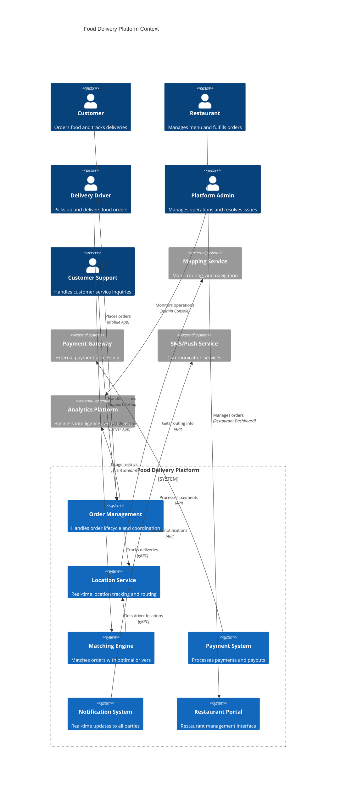

**Architectural Style Rationale**: Event-driven microservices with real-time coordination chosen for:
- Independent scaling of different business functions (ordering, delivery, payments)
- Real-time event processing for location tracking and order updates
- Multi-tenant architecture supporting different stakeholder interfaces
- Complex business logic coordination between multiple parties
- Geographic distribution for local market operations

## 3. Detailed System Architecture

### 3.1 AWS Service Stack Selection

**Application Services:**
- **EKS**: Kubernetes for microservices orchestration
- **ECS Fargate**: Serverless containers for batch processing
- **Lambda**: Event processing and real-time functions
- **API Gateway**: Mobile API management with rate limiting

**Real-time Services:**
- **IoT Core**: Device connectivity for driver mobile apps
- **Kinesis Data Streams**: Real-time location and order event streaming
- **AppSync**: Real-time GraphQL for mobile applications
- **WebSocket API**: Real-time bidirectional communication

**Location Services:**
- **Location Service**: Geocoding, routing, and place indexing
- **Kinesis Analytics**: Real-time location analytics
- **OpenSearch**: Geospatial queries for restaurant and driver search

**Data Layer:**
- **DynamoDB**: Orders, user profiles, and real-time state
- **Aurora PostgreSQL**: Financial data, analytics, and reporting
- **ElastiCache Redis**: Session management and real-time caching
- **MemoryDB**: Ultra-low latency location data

**Storage:**
- **S3**: Restaurant images, documents, and data lakes
- **EFS**: Shared storage for batch processing

**Messaging:**
- **SQS**: Order processing and driver assignment queues
- **SNS**: Multi-party notifications and alerts
- **EventBridge**: Event routing and third-party integrations
- **MSK**: High-throughput event streaming

**Machine Learning:**
- **SageMaker**: Demand prediction and delivery time estimation
- **Personalize**: Restaurant recommendations
- **Forecast**: Demand forecasting for dynamic pricing

**Monitoring:**
- **CloudWatch**: Application and infrastructure monitoring
- **X-Ray**: Distributed tracing for order flows
- **Kinesis Analytics**: Real-time operational analytics

### 3.2 Component Architecture Diagram

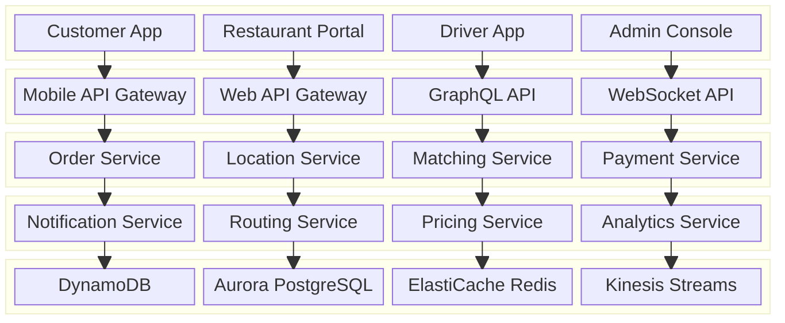

## 4. Data Architecture & Flow

### 4.1 Data Flow Diagrams

#### Order Placement and Matching Flow
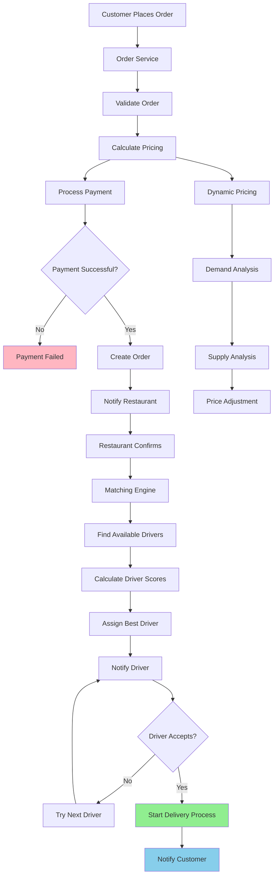

#### Real-time Delivery Tracking Flow
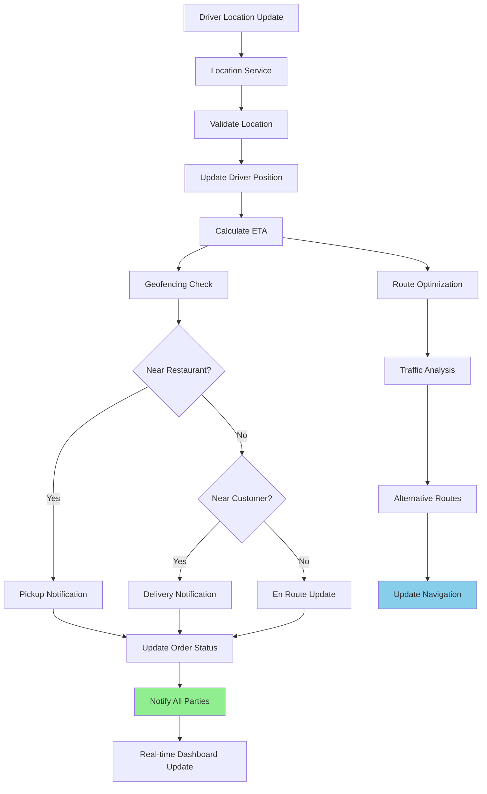

#### Multi-party Payment Processing Flow
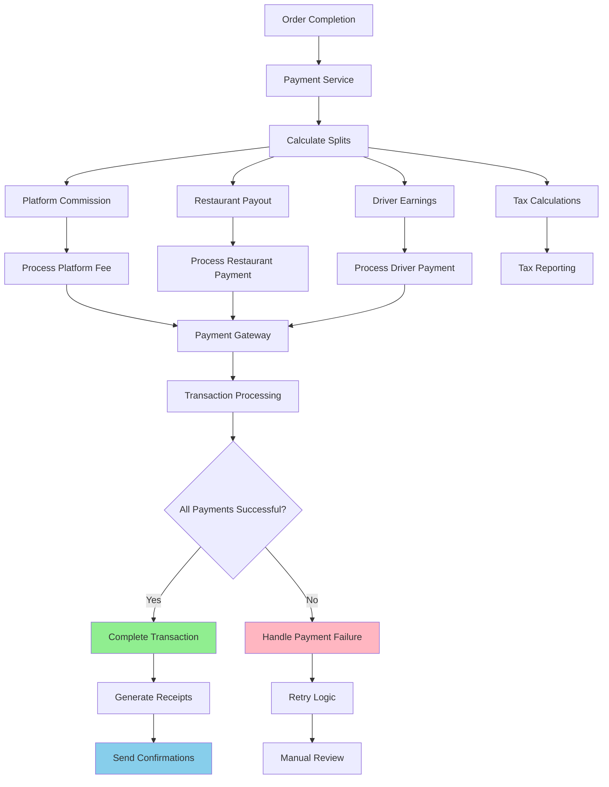

### 4.2 Database Design

#### Order Management Schema (DynamoDB)
```mermaid
erDiagram
    ORDERS {
        string order_id PK
        string customer_id
        string restaurant_id
        string driver_id
        json order_items
        decimal total_amount
        string status
        timestamp created_at
        timestamp estimated_delivery
        json delivery_address
        json special_instructions
    }
    
    ORDER_TRACKING {
        string order_id PK
        timestamp timestamp SK
        string status
        json location_data
        string updated_by
        json metadata
    }
    
    RESTAURANTS {
        string restaurant_id PK
        string restaurant_name
        json location
        json operating_hours
        json menu
        decimal rating
        boolean is_active
        json delivery_zones
    }
    
    DRIVERS {
        string driver_id PK
        string user_id
        json current_location
        string status
        decimal rating
        json vehicle_info
        boolean is_available
        json earnings_summary
    }
    
    ORDERS ||--o{ ORDER_TRACKING : "has tracking"
    ORDERS ||--|| RESTAURANTS : "placed at"
    ORDERS ||--|| DRIVERS : "delivered by"
```

#### Financial and Analytics Schema (Aurora PostgreSQL)
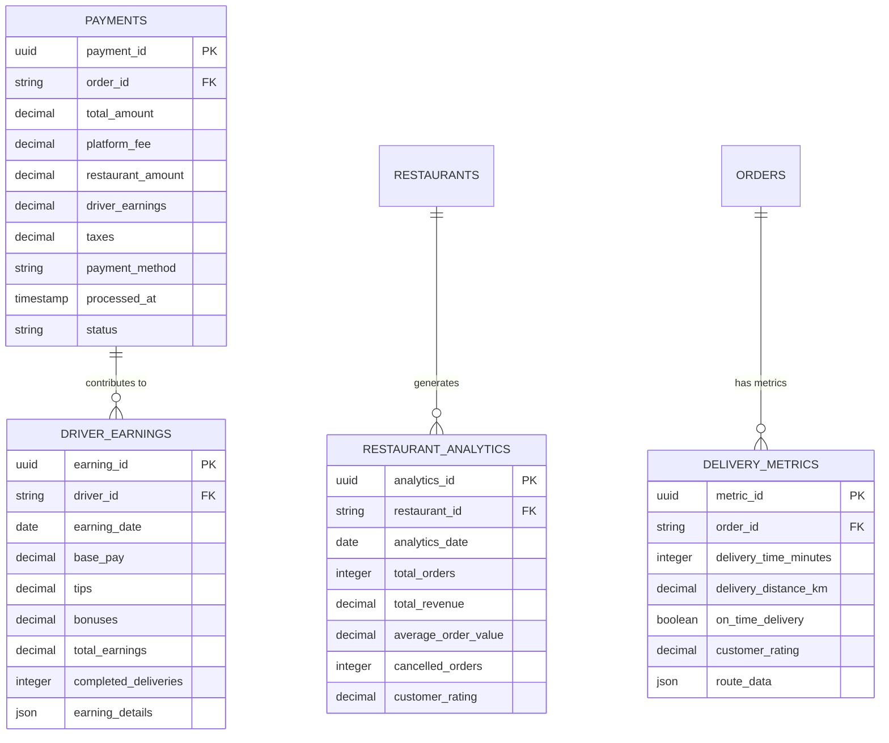

## 5. Detailed Component Design

### 5.1 Matching Engine Service

**Purpose & Responsibilities:**
- Match food orders with optimal delivery drivers
- Implement sophisticated driver selection algorithms
- Handle real-time driver availability and location
- Optimize for delivery time, cost, and driver utilization
- Support different delivery modes (standard, express, scheduled)

**Matching Algorithms:**
- **Distance-based**: Assign nearest available driver
- **Efficiency-based**: Optimize for overall system efficiency
- **Earnings-based**: Balance driver earnings opportunities
- **Customer-centric**: Prioritize customer experience metrics
- **Multi-objective**: Balance multiple competing objectives

**Real-time Optimization:**
- **Dynamic Assignment**: Real-time reassignment based on conditions
- **Batch Optimization**: Group nearby orders for efficient delivery
- **Predictive Assignment**: Anticipate future orders and position drivers
- **Machine Learning**: Learn from historical data to improve matching

### 5.2 Location Service

**Purpose & Responsibilities:**
- Track real-time locations of drivers and orders
- Provide accurate ETA calculations and route optimization
- Handle geofencing for pickup and delivery notifications
- Support offline location caching and synchronization
- Implement location privacy and data retention policies

**Location Features:**
- **High-Frequency Updates**: Sub-second location updates during active deliveries
- **Geofencing**: Automated notifications for location-based events
- **Route Optimization**: Dynamic routing based on traffic and conditions
- **Location History**: Audit trail for delivery verification
- **Privacy Controls**: Configurable location sharing and retention

### 5.3 Order Management Service

**Purpose & Responsibilities:**
- Handle complete order lifecycle from placement to completion
- Coordinate between customers, restaurants, and drivers
- Implement order state machine with proper transitions
- Handle order modifications, cancellations, and refunds
- Generate comprehensive order analytics and reporting

**Order States:**
- **Placed**: Order received and payment processed
- **Confirmed**: Restaurant accepts and starts preparation
- **Preparing**: Food being prepared by restaurant
- **Ready**: Food ready for pickup
- **Picked Up**: Driver has collected the order
- **En Route**: Driver delivering to customer
- **Delivered**: Order successfully completed
- **Cancelled**: Order cancelled by any party

### Critical User Journey Sequence Diagrams

#### Complete Food Delivery Flow
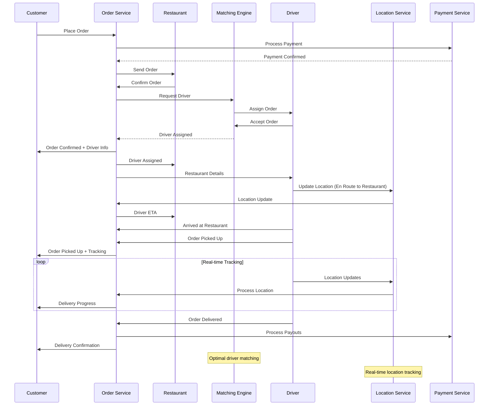

#### Driver Assignment and Optimization
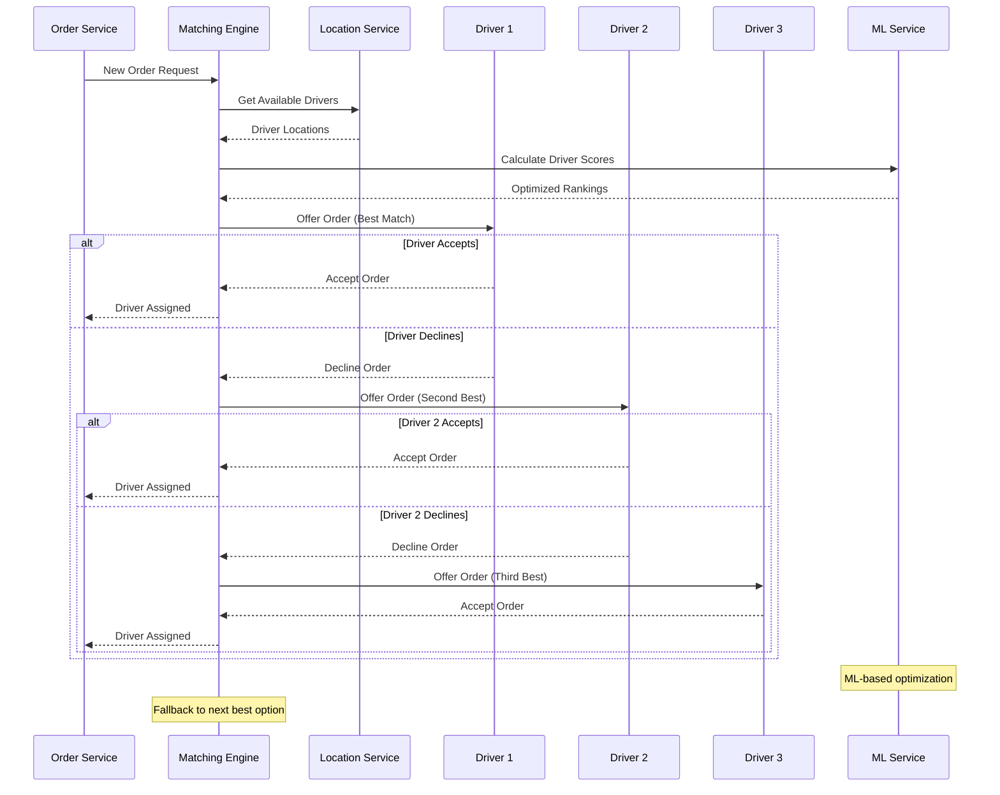

#### Real-time Location Tracking
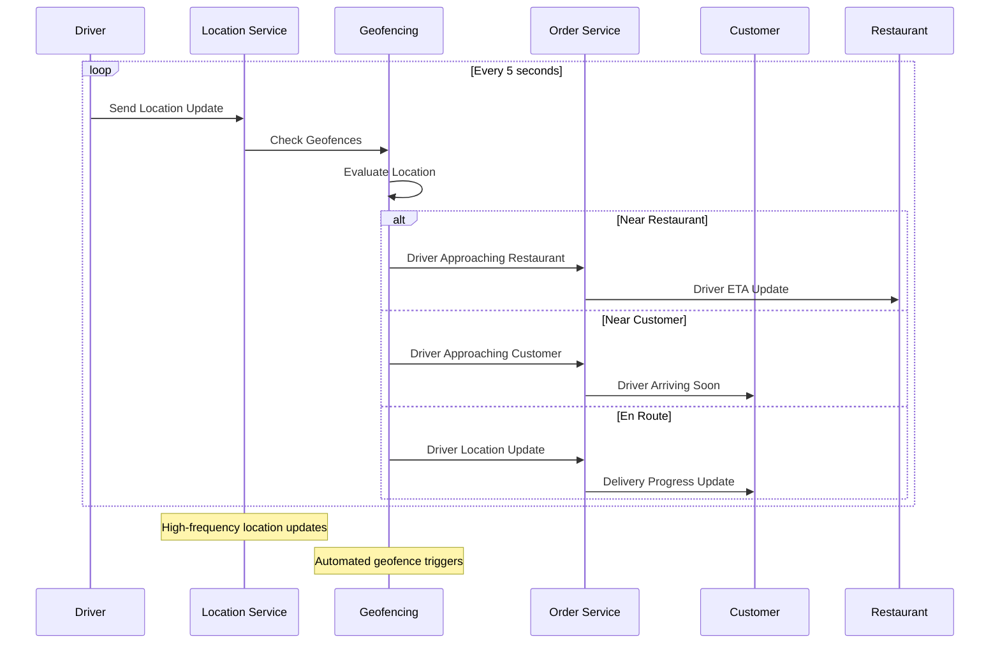

## 6. Scalability & Performance

### 6.1 Scaling Architecture

```mermaid
flowchart TD
    subgraph "Geographic Scaling"
        A[City Expansion] --> B[Regional Data Centers]
        B --> C[Local Service Deployment]
        C --> D[Market-Specific Optimization]
    end
    
    subgraph "Demand-Based Scaling"
        E[Peak Hour Traffic] --> F[Auto Scaling Groups]
        F --> G[Dynamic Resource Allocation]
        G --> H[Load Balancing]
    end
    
    subgraph "Real-time Scaling"
        I[Location Update Volume] --> J[Kinesis Scaling]
        J --> K[Stream Processing]
        K --> L[Location Service Scaling]
    end
    
    subgraph "Database Scaling"
        M[Order Volume Growth] --> N[DynamoDB Auto Scaling]
        N --> O[Read Replicas]
        O --> P[Caching Layers]
    end
    
    style C fill:#87CEEB
    style G fill:#90EE90
    style K fill:#FFB6C1
    style P fill:#DDA0DD
```

### 6.2 Performance Optimization

**Real-time Performance:**
- **Location Processing**: Efficient geospatial indexing and queries
- **Matching Optimization**: Pre-computed driver pools and smart filtering
- **Caching Strategy**: Multi-level caching for restaurants, menus, and driver data
- **Connection Management**: WebSocket connections for real-time updates

**Mobile App Performance:**
- **Offline Capabilities**: Local caching for poor network conditions
- **Progressive Loading**: Incremental data loading for better UX
- **Image Optimization**: Compressed images and lazy loading
- **Battery Optimization**: Efficient location tracking to minimize battery drain

**Database Performance:**
- **Hot Data Optimization**: Keep active order data in memory-based storage
- **Query Optimization**: Efficient indexes for geospatial and time-based queries
- **Read Replicas**: Geographic distribution for reduced query latency
- **Data Partitioning**: Time and location-based partitioning for large datasets

## 7. Reliability & Fault Tolerance

### 7.1 High Availability Design

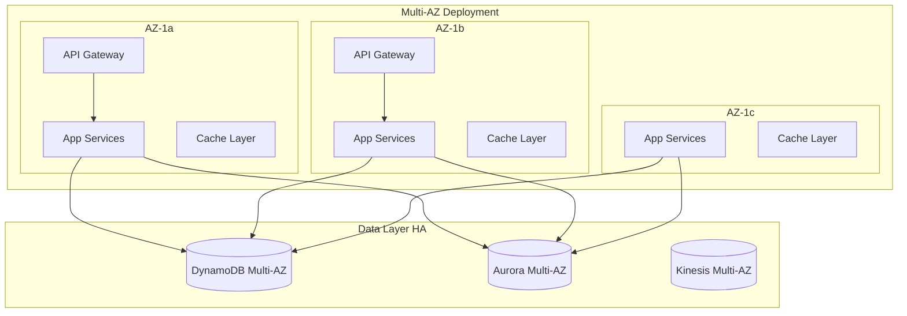

**Fault Tolerance Mechanisms:**
- **Circuit Breakers**: Prevent cascade failures between services
- **Graceful Degradation**: Essential functions continue during partial outages
- **Retry Logic**: Intelligent retry with exponential backoff
- **Bulkhead Pattern**: Isolate critical resources

### 7.2 Disaster Recovery

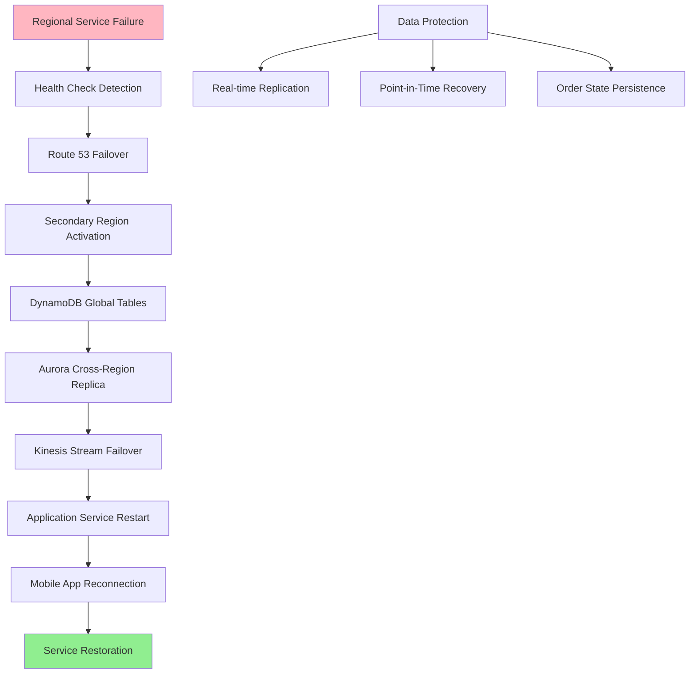

**RTO/RPO Targets:**
- **RTO**: 2 minutes for critical order processing services
- **RPO**: 30 seconds for order and location data
- **Order Continuity**: 99.9% order completion during failures
- **Data Consistency**: Strong consistency for financial transactions

## 8. Security Architecture

### 8.1 Security Layers

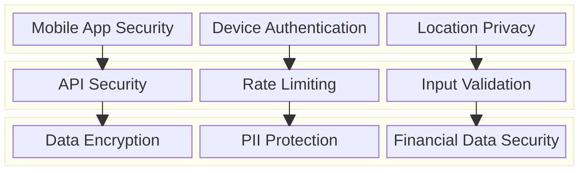

**Security Features:**
- **Multi-Factor Authentication**: Enhanced security for driver and restaurant accounts
- **Location Privacy**: Granular location sharing controls and data retention
- **Payment Security**: PCI DSS compliance and tokenization
- **Background Checks**: Driver verification and ongoing monitoring

**Data Protection:**
- **Encryption**: End-to-end encryption for sensitive data
- **Tokenization**: Replace sensitive payment data with tokens
- **Access Control**: Role-based access with principle of least privilege
- **Audit Trails**: Comprehensive logging of all financial transactions

### 8.2 Multi-party Security Flow

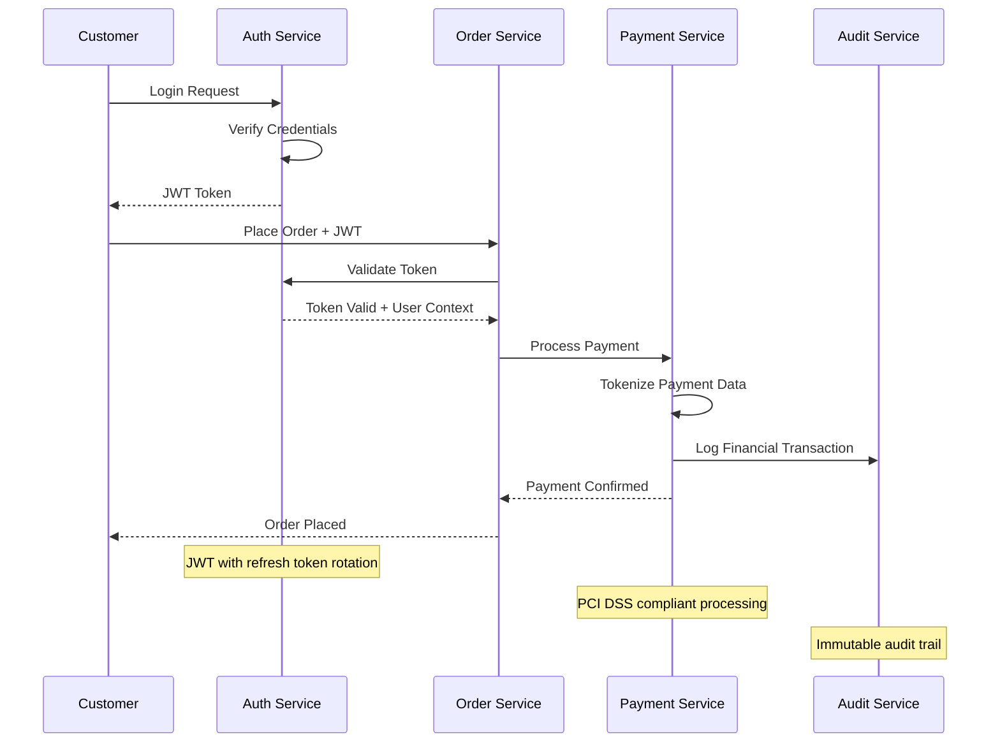

## 9. Monitoring & Observability

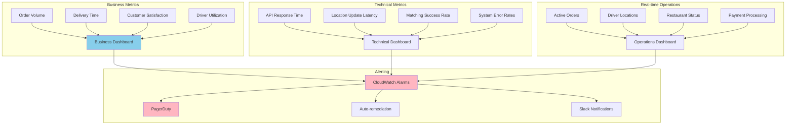

**Key Performance Indicators:**
- **Business**: Order completion rate, average delivery time, customer lifetime value
- **Technical**: API latency, location update frequency, matching algorithm efficiency
- **Operations**: Driver utilization, restaurant partnership health, payment success rates
- **Customer Experience**: App performance, order accuracy, support resolution time

**Alerting Strategy:**
- **Critical**: Payment failures, order processing outages, safety incidents
- **Warning**: High delivery times, driver shortages, restaurant issues
- **Info**: Traffic spikes, new market launches, promotional campaign performance

## 10. Cost Optimization

**Service-Level Cost Analysis:**
- **EKS**: $10,000/month (Microservices, 150 nodes with mixed instance types)
- **DynamoDB**: $6,000/month (Orders and real-time data, global tables)
- **Kinesis**: $3,000/month (Location streams and real-time analytics)
- **Location Service**: $2,000/month (Geocoding and routing API calls)
- **Aurora**: $2,500/month (Financial data and analytics)
- **ElastiCache**: $1,500/month (Session and location caching)
- **Data Transfer**: $2,000/month (Mobile apps and cross-region traffic)
- **Other Services**: $3,000/month (Lambda, SQS, monitoring, etc.)
- **Total Estimated**: ~$30,000/month for 100K daily orders

**Cost Optimization Strategies:**
- **Spot Instances**: 60% cost reduction for batch processing workloads
- **Reserved Instances**: 40% savings on predictable compute workloads
- **Location Optimization**: Efficient location update frequency based on delivery status
- **Regional Deployment**: Deploy services closer to major markets
- **Caching Strategy**: Reduce API calls through intelligent caching

**Cost Monitoring:**
- **Unit Economics**: Track cost per order and delivery
- **Geographic Analysis**: Optimize costs by market and region
- **Resource Utilization**: Monitor and optimize underutilized resources
- **Scaling Efficiency**: Optimize auto-scaling policies for cost-effectiveness

## 11. Implementation Strategy

### 11.1 Migration/Deployment Plan

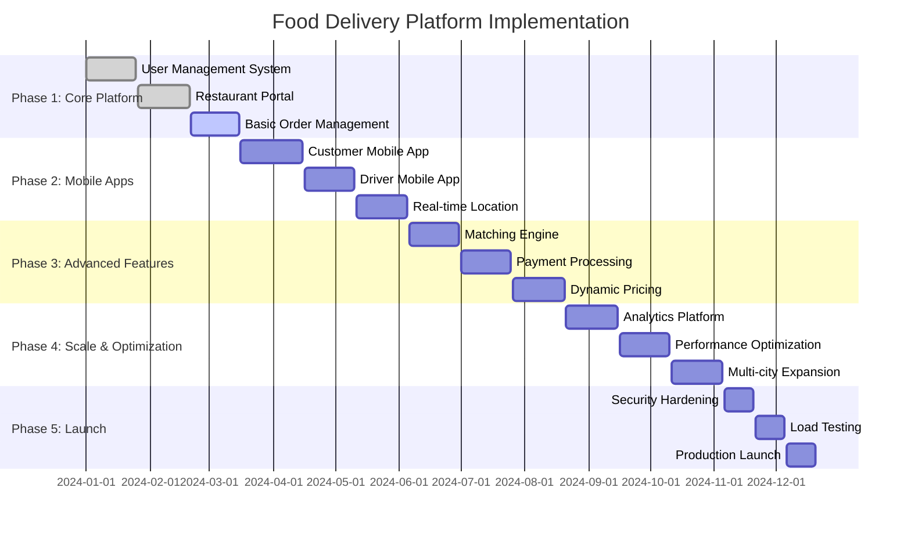

### 11.2 Technology Decisions & Trade-offs

**Real-time Architecture:**
- **WebSocket vs Server-Sent Events**: WebSocket for bidirectional communication
- **Kinesis vs Kafka**: Kinesis for managed service benefits and AWS integration
- **Push vs Pull**: Push notifications for immediate updates
- **Synchronous vs Asynchronous**: Async processing for non-critical operations

**Location Technology:**
- **AWS Location Service vs Google Maps**: AWS for cost and integration benefits
- **High vs Low Frequency Updates**: Dynamic frequency based on delivery status
- **Client vs Server Processing**: Hybrid approach for optimal performance
- **Battery Optimization**: Smart location tracking to minimize battery drain

**Database Strategy:**
- **DynamoDB vs Aurora**: DynamoDB for real-time data, Aurora for analytics
- **NoSQL vs SQL**: NoSQL for flexible order data, SQL for financial transactions
- **Caching Strategy**: Multi-layer caching with Redis for performance
- **Data Consistency**: Strong consistency for payments, eventual for location

**Future Evolution Path:**
- **Autonomous Delivery**: Integration with drones and autonomous vehicles
- **AI Enhancement**: Advanced demand prediction and route optimization
- **Sustainability**: Carbon footprint tracking and eco-friendly delivery options
- **Global Expansion**: Multi-currency, multi-language, and regulatory compliance

**Technical Debt & Improvement Areas:**
- **Advanced Matching**: Machine learning-based driver assignment optimization
- **Predictive Analytics**: Enhanced demand forecasting and inventory management
- **Customer Experience**: Advanced personalization and recommendation systems
- **Operational Efficiency**: Automated customer service and dispute resolution
