# Parking Lot System Design Architecture

## 1. Executive Summary & Requirements

### System Overview
A comprehensive smart parking management system that handles multi-level parking facilities with real-time space availability, automated entry/exit, dynamic pricing, and reservation capabilities. The system integrates IoT sensors, mobile applications, and payment processing to optimize parking utilization and user experience.

### Functional Requirements
- **Space Management**: Real-time tracking of parking space availability across multiple levels
- **Entry/Exit Control**: Automated gate control with license plate recognition
- **Reservation System**: Advance booking with guaranteed space allocation
- **Dynamic Pricing**: Time-based and demand-based pricing strategies
- **Payment Processing**: Multiple payment methods including contactless payments
- **User Mobile App**: Space finding, navigation, and payment functionality
- **Admin Dashboard**: Facility management, analytics, and configuration
- **Violation Management**: Overstay detection and penalty processing
- **Maintenance Tracking**: Equipment monitoring and maintenance scheduling
- **Analytics & Reporting**: Utilization analytics and revenue reporting

### Non-Functional Requirements
- **Availability**: 99.9% uptime for critical parking operations
- **Response Time**: <2 seconds for space availability queries
- **Scalability**: Support 10,000+ parking spaces across multiple facilities
- **Accuracy**: >99% accuracy in space occupancy detection
- **Reliability**: <0.1% false positive rate for entry/exit detection
- **Integration**: Support for various hardware vendors and payment systems

### Key Constraints
- Integration with existing parking infrastructure
- Compliance with local parking regulations and accessibility requirements
- Hardware reliability in various weather conditions
- Network connectivity challenges in underground facilities

### Success Metrics
- 99.9% system availability during operating hours
- <30 seconds average time to find and navigate to available space
- >95% customer satisfaction with parking experience
- 20% improvement in parking space utilization
- <1% payment processing failures

## 2. High-Level Architecture Overview

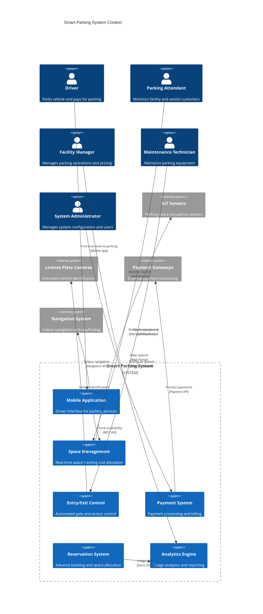

**Architectural Style Rationale**: IoT-enabled microservices architecture chosen for:
- Integration with diverse hardware systems (sensors, cameras, gates)
- Real-time processing of sensor data and space availability
- Scalability across multiple parking facilities
- Independent scaling of different system components
- Support for various third-party integrations

## 3. Detailed System Architecture

### 3.1 AWS Service Stack Selection

**IoT and Edge Computing:**
- **IoT Core**: Device connectivity for parking sensors and cameras
- **IoT Device Management**: Fleet management for parking hardware
- **Greengrass**: Edge computing for local processing and offline capability
- **IoT Analytics**: Real-time analysis of parking sensor data

**Application Services:**
- **EKS**: Kubernetes orchestration for microservices
- **Lambda**: Serverless functions for event processing
- **API Gateway**: Mobile and web API management
- **AppSync**: Real-time GraphQL for mobile applications

**Data Processing:**
- **Kinesis Data Streams**: Real-time sensor data ingestion
- **Kinesis Analytics**: Real-time occupancy analytics
- **EMR**: Large-scale data processing for historical analysis
- **Glue**: ETL jobs for data transformation

**Data Storage:**
- **DynamoDB**: Real-time parking space state and reservations
- **Aurora PostgreSQL**: User accounts, payments, and historical data
- **ElastiCache Redis**: Session management and caching
- **S3**: Sensor data archives and image storage

**Machine Learning:**
- **SageMaker**: Predictive analytics for demand forecasting
- **Rekognition**: License plate recognition and vehicle detection
- **Forecast**: Demand prediction for dynamic pricing

**Security:**
- **Cognito**: User authentication and mobile app security
- **IAM**: Device and service access control
- **KMS**: Encryption for sensitive parking and payment data
- **Certificate Manager**: SSL/TLS certificates for APIs

**Monitoring:**
- **CloudWatch**: Infrastructure and application monitoring
- **IoT Device Defender**: Security monitoring for IoT devices
- **X-Ray**: Distributed tracing for API calls

### 3.2 Component Architecture Diagram

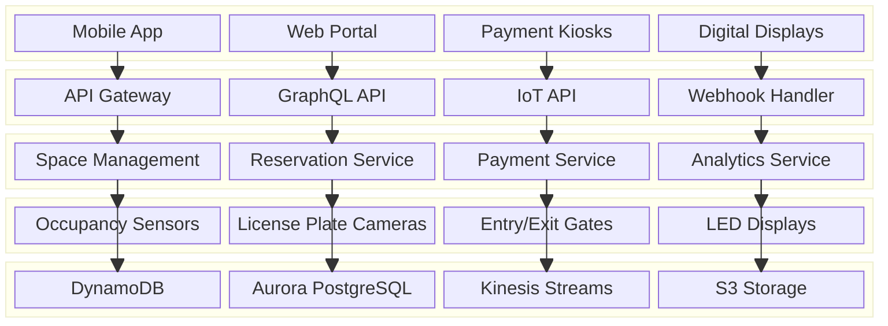

## 4. Data Architecture & Flow

### 4.1 Data Flow Diagrams

#### Real-time Space Occupancy Tracking
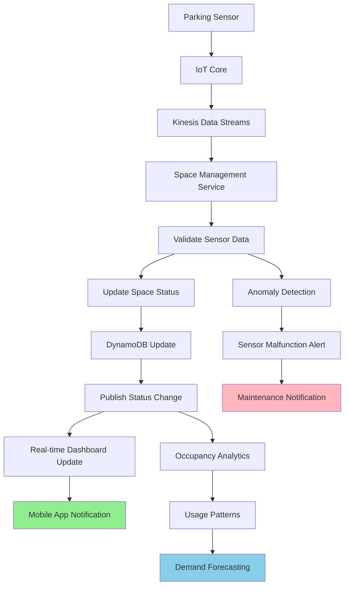

#### Vehicle Entry and Exit Flow
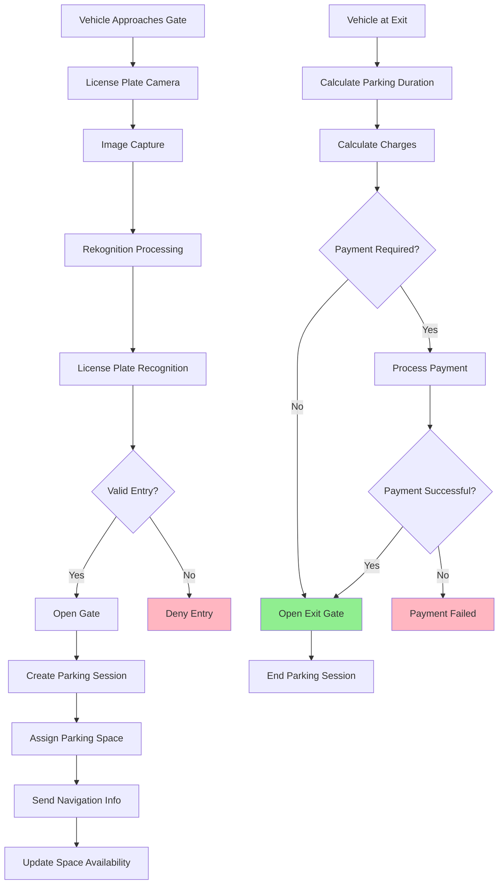

#### Reservation and Space Allocation Flow
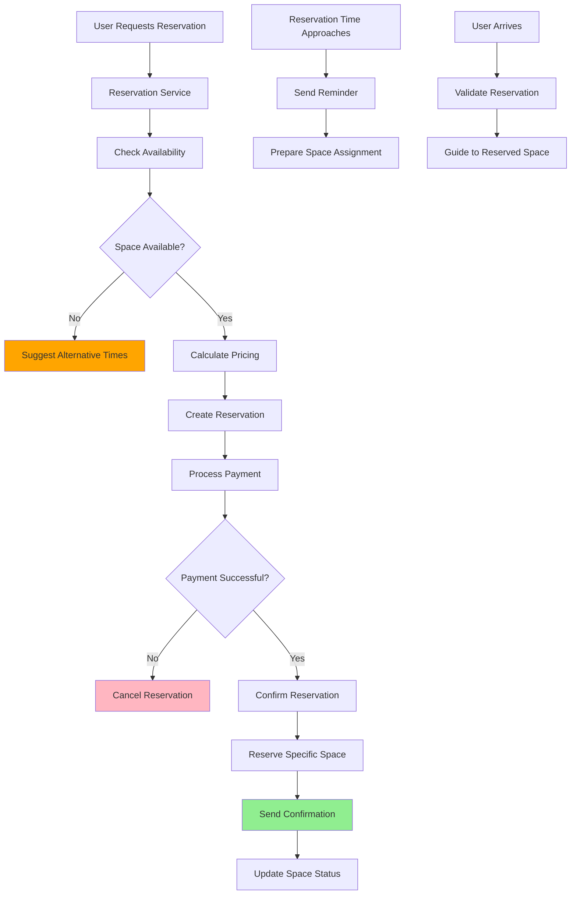

### 4.2 Database Design

#### Parking Space Management Schema
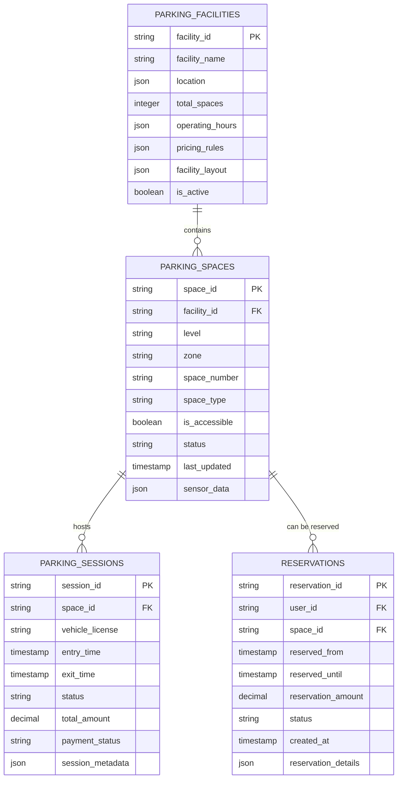

#### User and Payment Schema
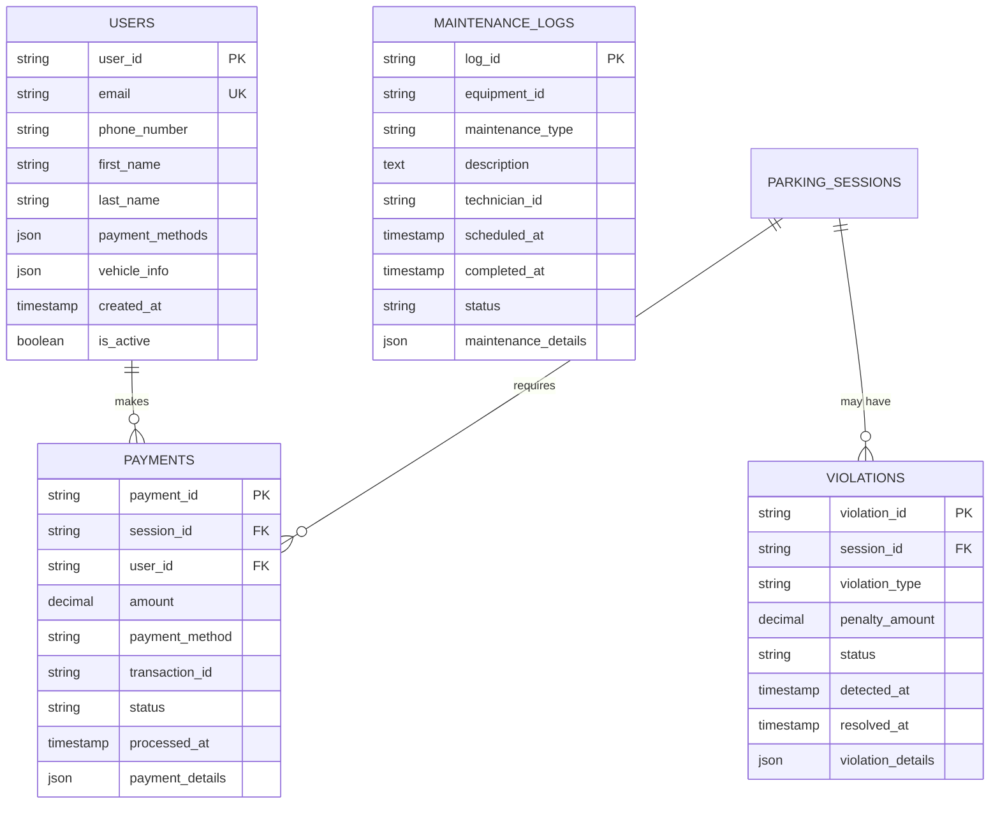

## 5. Detailed Component Design

### 5.1 Space Management Service

**Purpose & Responsibilities:**
- Track real-time occupancy status of all parking spaces
- Process sensor data and maintain space availability
- Handle space allocation and reservation management
- Provide real-time space availability APIs
- Manage facility configuration and layout

**IoT Integration:**
- **Sensor Data Processing**: Handle various sensor types (ultrasonic, magnetic, camera-based)
- **Data Validation**: Filter noise and validate sensor readings
- **Offline Handling**: Maintain functionality during network outages
- **Device Management**: Monitor sensor health and battery status

**Performance Optimizations:**
- **Event-Driven Updates**: Only process actual state changes
- **Caching Strategy**: Cache frequently accessed space data
- **Batch Processing**: Group sensor updates for efficiency
- **Real-time Sync**: WebSocket connections for instant updates

### 5.2 Entry/Exit Control Service

**Purpose & Responsibilities:**
- Manage automated gate operations and access control
- Process license plate recognition for vehicle identification
- Handle entry/exit authorization and validation
- Integrate with payment systems for exit processing
- Maintain security and access logs

**Access Control Features:**
- **License Plate Recognition**: AI-powered vehicle identification
- **Whitelist/Blacklist**: Manage authorized and banned vehicles
- **Temporary Access**: Handle visitor and contractor access
- **Manual Override**: Support for attendant-controlled access
- **Security Integration**: Integration with facility security systems

### 5.3 Payment Processing Service

**Purpose & Responsibilities:**
- Handle multiple payment methods (credit cards, mobile payments, subscriptions)
- Calculate parking fees based on dynamic pricing rules
- Process refunds and handle payment disputes
- Integrate with external payment gateways
- Generate receipts and payment confirmations

**Payment Features:**
- **Dynamic Pricing**: Time-based and demand-based pricing
- **Multiple Methods**: Credit cards, mobile wallets, subscription plans
- **Contactless Payments**: NFC and QR code payment options
- **Automated Billing**: Recurring payments for frequent users
- **Fraud Detection**: Payment security and fraud prevention

### Critical User Journey Sequence Diagrams

#### Complete Parking Session Flow
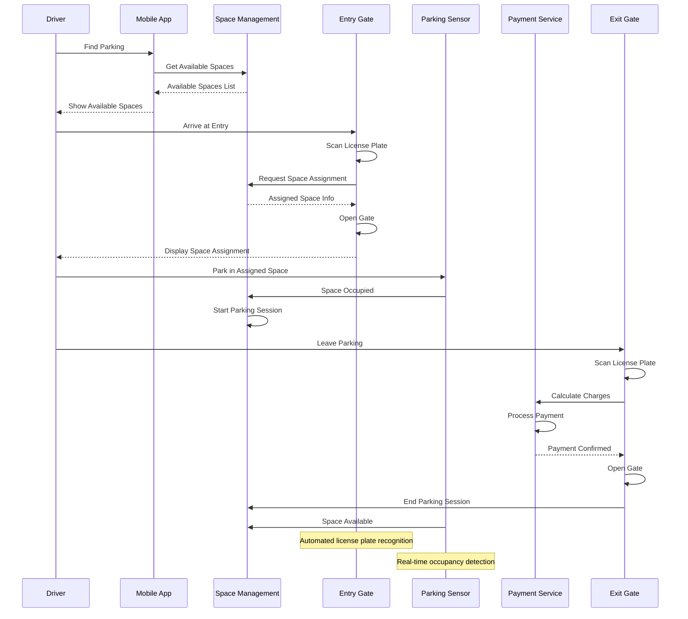

#### Reservation and Guaranteed Parking
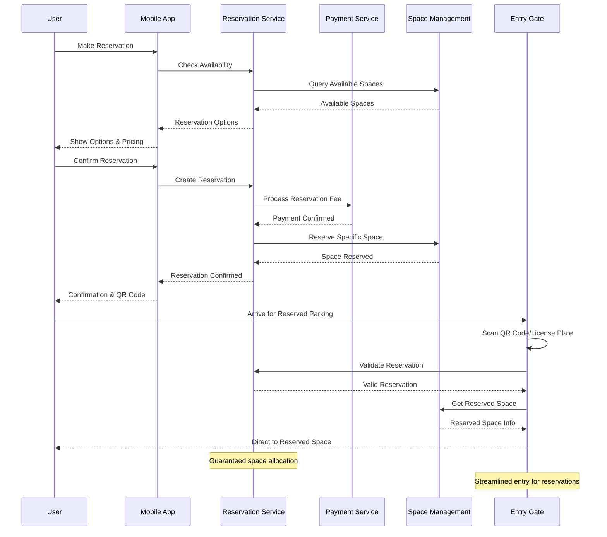

#### Dynamic Pricing and Demand Management
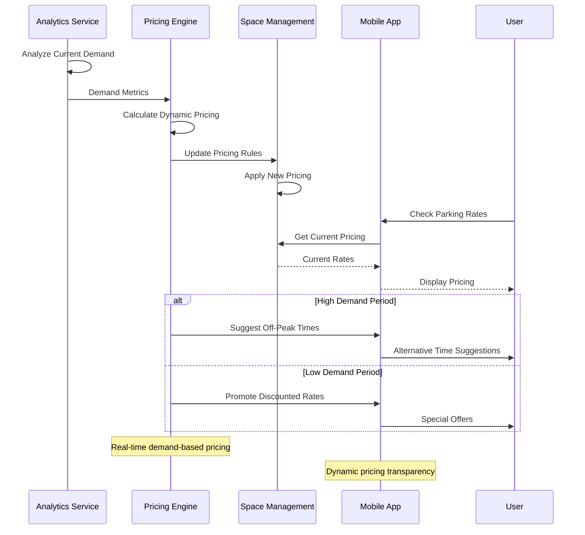

## 6. Scalability & Performance

### 6.1 Scaling Architecture

```mermaid
flowchart TD
    subgraph "Facility Scaling"
        A[Single Facility] --> B[Multi-Facility Management]
        B --> C[Geographic Distribution]
        C --> D[Franchise/Chain Support]
    end
    
    subgraph "IoT Device Scaling"
        E[Sensor Network Growth] --> F[Edge Computing]
        F --> G[Local Processing]
        G --> H[Cloud Synchronization]
    end
    
    subgraph "Data Processing Scaling"
        I[Real-time Data Volume] --> J[Kinesis Scaling]
        J --> K[Stream Processing]
        K --> L[Analytics Scaling]
    end
    
    subgraph "Application Scaling"
        M[User Growth] --> N[API Gateway Scaling]
        N --> O[Microservice Auto-scaling]
        O --> P[Database Scaling]
    end
    
    style C fill:#87CEEB
    style G fill:#90EE90
    style K fill:#FFB6C1
    style O fill:#DDA0DD
```

### 6.2 Performance Optimization

**Real-time Processing:**
- **Edge Computing**: Process sensor data locally to reduce latency
- **Event Streaming**: Efficient handling of high-frequency sensor updates
- **Caching Strategy**: Multi-layer caching for space availability data
- **Connection Pooling**: Efficient database connections for high throughput

**Mobile App Performance:**
- **Offline Capabilities**: Cache facility maps and basic functionality
- **Progressive Loading**: Load critical features first
- **Image Optimization**: Compressed facility maps and navigation images
- **Background Sync**: Sync data when network becomes available

**Hardware Integration:**
- **Protocol Optimization**: Efficient IoT communication protocols
- **Batch Updates**: Group sensor readings to reduce network traffic
- **Local Intelligence**: Edge processing for immediate responses
- **Redundancy**: Multiple sensors for critical areas

## 7. Reliability & Fault Tolerance

### 7.1 High Availability Design

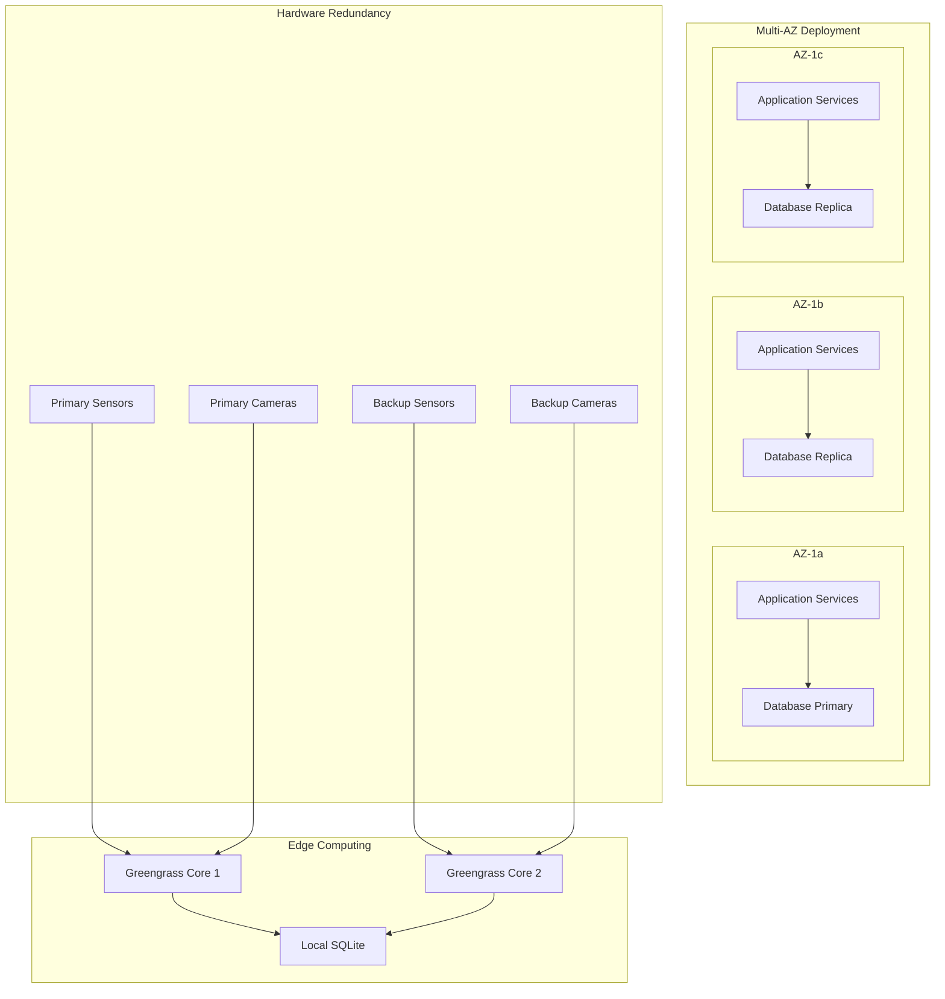

**Fault Tolerance Mechanisms:**
- **Edge Computing**: Local processing continues during network outages
- **Sensor Redundancy**: Multiple sensors for critical parking areas
- **Graceful Degradation**: Manual operations when automated systems fail
- **Data Synchronization**: Automatic sync when connectivity is restored

### 7.2 Disaster Recovery

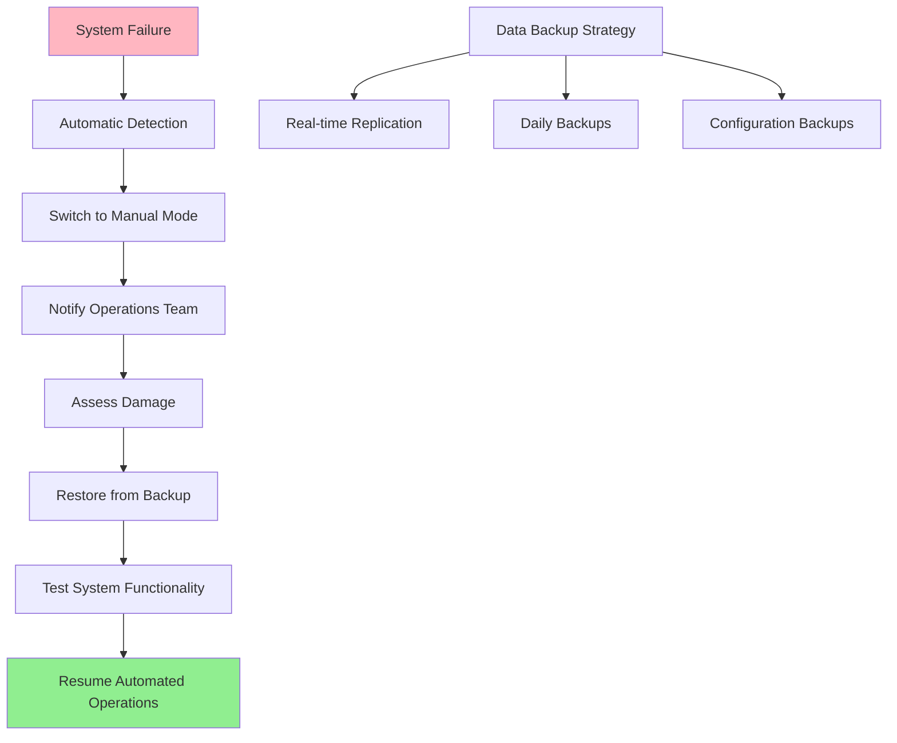

**RTO/RPO Targets:**
- **RTO**: 15 minutes for critical parking operations
- **RPO**: 5 minutes for payment and reservation data
- **Manual Fallback**: Immediate switch to manual operations
- **Hardware Recovery**: 4-hour target for sensor replacement

## 8. Security Architecture

### 8.1 Security Layers

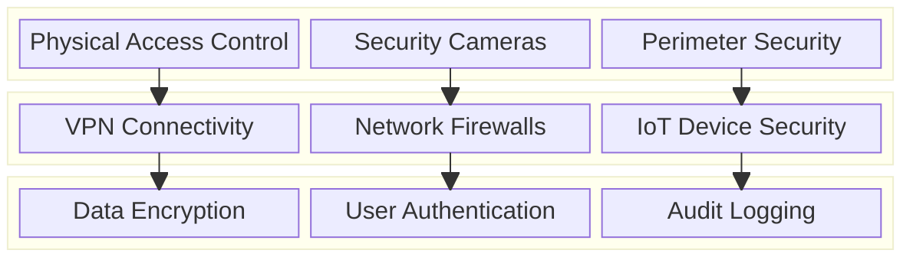

**Security Features:**
- **Device Authentication**: Certificate-based IoT device authentication
- **Data Encryption**: End-to-end encryption for sensitive data
- **Access Control**: Role-based access for different user types
- **Physical Security**: Integration with facility security systems

**Payment Security:**
- **PCI Compliance**: Secure handling of payment card data
- **Tokenization**: Replace sensitive payment data with tokens
- **Fraud Detection**: Anomaly detection for payment transactions
- **Secure Communications**: TLS encryption for all payment APIs

### 8.2 IoT Security Flow

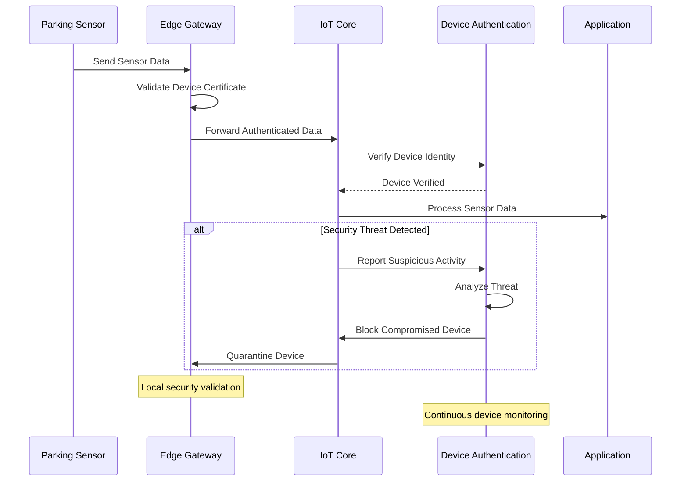

## 9. Monitoring & Observability

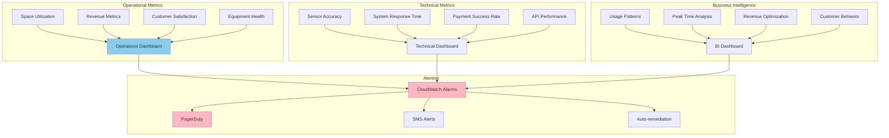

**Key Performance Indicators:**
- **Operational**: Space utilization rates, average parking duration, revenue per space
- **Technical**: Sensor uptime, payment processing success, API response times
- **Customer**: App usage, reservation completion rates, customer ratings
- **Maintenance**: Equipment health, maintenance schedules, failure rates

**Alerting Strategy:**
- **Critical**: Payment system failures, security breaches, gate malfunctions
- **Warning**: Sensor failures, high occupancy rates, maintenance due
- **Info**: Usage trends, revenue milestones, customer feedback

## 10. Cost Optimization

**Service-Level Cost Analysis:**
- **IoT Core**: $2,000/month (10,000 sensors, data ingestion and processing)
- **EKS**: $3,000/month (Application services, 30 nodes)
- **DynamoDB**: $1,500/month (Real-time space data and reservations)
- **Aurora**: $1,200/month (User and payment data)
- **Kinesis**: $800/month (Real-time sensor data streaming)
- **Lambda**: $400/month (Event processing functions)
- **ElastiCache**: $600/month (Caching layer)
- **S3 + CloudFront**: $300/month (Image storage and delivery)
- **Other Services**: $1,200/month (API Gateway, monitoring, etc.)
- **Total Estimated**: ~$11,000/month for 10,000 space facility

**Cost Optimization Strategies:**
- **Edge Computing**: Reduce cloud data processing costs through local processing
- **Sensor Optimization**: Use cost-effective sensors with longer battery life
- **Data Retention**: Implement lifecycle policies for sensor data
- **Reserved Instances**: Long-term commitments for predictable workloads
- **Energy Efficiency**: Solar-powered sensors and energy-efficient hardware

**Hardware Costs (One-time):**
- **Parking Sensors**: $50-100 per space ($500K-1M for 10,000 spaces)
- **License Plate Cameras**: $2,000-5,000 per entry/exit point
- **Entry/Exit Gates**: $10,000-20,000 per gate
- **Digital Displays**: $1,000-3,000 per display
- **Network Infrastructure**: $50,000-100,000 per facility

## 11. Implementation Strategy

### 11.1 Migration/Deployment Plan

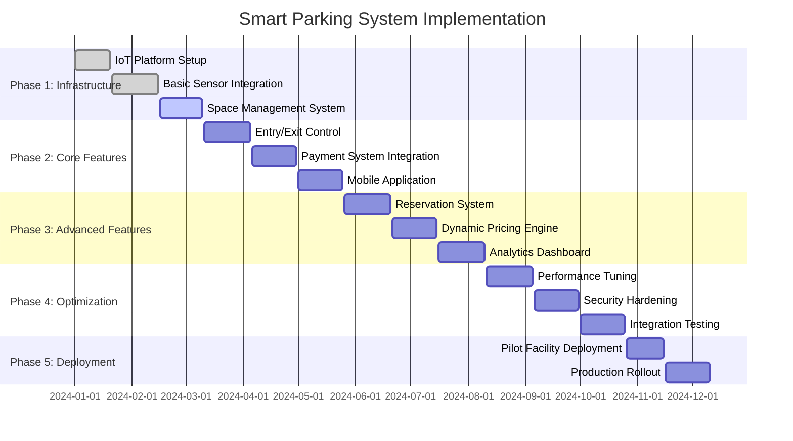

### 11.2 Technology Decisions & Trade-offs

**Sensor Technology:**
- **Ultrasonic vs Magnetic vs Camera**: Ultrasonic chosen for reliability and cost-effectiveness
- **Wired vs Wireless**: Wireless for flexibility, wired for critical areas
- **Battery vs Powered**: Battery-powered with solar charging for sustainability
- **Single vs Multi-sensor**: Redundant sensors for critical spaces

**Communication Protocols:**
- **LoRaWAN vs WiFi vs Cellular**: LoRaWAN for low power, WiFi for high bandwidth areas
- **MQTT vs HTTP**: MQTT for sensor communication, HTTP for APIs
- **Edge vs Cloud Processing**: Edge processing for real-time decisions
- **Synchronous vs Asynchronous**: Asynchronous for sensor data, synchronous for user interactions

**Payment Integration:**
- **Multiple Gateways**: Support various payment methods and providers
- **PCI Compliance**: Minimize scope through tokenization
- **Offline Payments**: Local payment processing capability
- **Mobile Integration**: Support for mobile wallets and contactless payments

**Future Evolution Path:**
- **AI Enhancement**: Computer vision for vehicle detection and classification
- **Smart City Integration**: Integration with traffic management systems
- **Electric Vehicle Support**: EV charging station integration
- **Autonomous Vehicle Preparation**: Infrastructure for self-parking vehicles

**Technical Debt & Improvement Areas:**
- **Advanced Analytics**: Machine learning for demand prediction and optimization
- **Integration Expansion**: Support for more hardware vendors and protocols
- **Mobile Enhancement**: Augmented reality navigation and advanced features
- **Sustainability**: Carbon footprint tracking and green parking initiatives
