# Distributed File System Design Architecture

## 1. Executive Summary & Requirements

### System Overview
A highly scalable distributed file system that provides reliable storage and retrieval of large files across multiple machines with fault tolerance, high availability, and strong consistency. The system handles petabyte-scale storage with automatic replication, load balancing, and seamless scaling similar to Google File System (GFS) or Hadoop Distributed File System (HDFS).

### Functional Requirements
- **File Storage**: Store and retrieve files of any size up to several terabytes
- **Hierarchical Namespace**: Support directory structure and file organization
- **High Throughput**: Optimized for large sequential reads and writes
- **Fault Tolerance**: Automatic recovery from hardware failures
- **Replication**: Configurable replication factor for data durability
- **Consistency**: Strong consistency for metadata, eventual consistency for data
- **Scalability**: Horizontal scaling by adding more storage nodes
- **Access Control**: File permissions and authentication mechanisms
- **Versioning**: Support for file versioning and snapshots
- **Compression**: Optional data compression to reduce storage costs

### Non-Functional Requirements
- **Availability**: 99.99% availability with automatic failover
- **Durability**: 99.999999999% (11 9's) data durability
- **Throughput**: 100+ GB/s aggregate throughput across the cluster
- **Scalability**: Support thousands of storage nodes and exabytes of data
- **Latency**: <100ms for metadata operations, optimized for large file transfers
- **Consistency**: Strong consistency for file system operations

### Key Constraints
- Optimize for large files and sequential access patterns
- Handle network partitions and node failures gracefully
- Minimize metadata overhead for large-scale deployments
- Support both batch processing and real-time access patterns

### Success Metrics
- 99.99% availability with <1 minute recovery time
- Support 10,000+ concurrent clients
- 99.999999999% data durability with automatic repair
- Linear scalability with cluster size
- <1% storage overhead for metadata

## 2. High-Level Architecture Overview

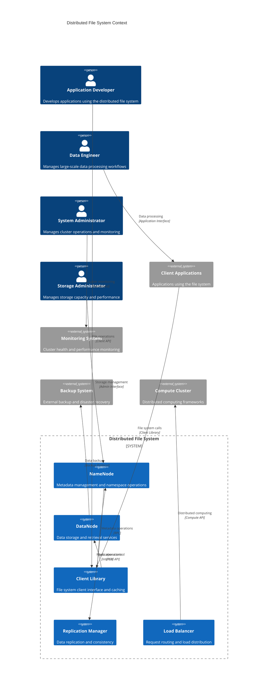

**Architectural Style Rationale**: Master-slave distributed architecture with separation of metadata and data chosen for:
- Centralized metadata management for consistency and performance
- Distributed data storage for scalability and fault tolerance
- Clear separation of concerns between metadata and data operations
- Support for both batch processing and real-time access patterns
- Linear scalability through addition of data nodes

## 3. Detailed System Architecture

### 3.1 AWS Service Stack Selection

**Compute Services:**
- **EC2**: High-performance instances for NameNode and DataNode services
- **EKS**: Kubernetes orchestration for containerized deployments
- **Auto Scaling Groups**: Automatic capacity management for data nodes
- **Spot Instances**: Cost-effective storage nodes for batch workloads

**Storage Services:**
- **EBS**: High-IOPS storage for NameNode metadata and logs
- **Instance Store**: High-performance local storage for data nodes
- **S3**: Cold storage tier and backup repository
- **EFS**: Shared storage for configuration and operational data

**Networking:**
- **VPC**: Isolated network with optimized instance placement
- **Placement Groups**: Cluster placement for low-latency communication
- **Enhanced Networking**: SR-IOV for high-performance networking
- **Direct Connect**: Dedicated network connections for enterprise

**Security:**
- **IAM**: Fine-grained access control for file system operations
- **KMS**: Encryption key management for data at rest
- **Security Groups**: Network-level access control
- **VPC Endpoints**: Secure access to AWS services

**Monitoring:**
- **CloudWatch**: Comprehensive monitoring and custom metrics
- **X-Ray**: Distributed tracing for file system operations
- **Systems Manager**: Configuration management and automation
- **CloudTrail**: API audit logging

**Data Processing:**
- **EMR**: Integration with Hadoop ecosystem
- **Glue**: ETL job integration with distributed file system
- **Athena**: Query interface for file system data
- **Kinesis**: Real-time data ingestion and processing

### 3.2 Component Architecture Diagram

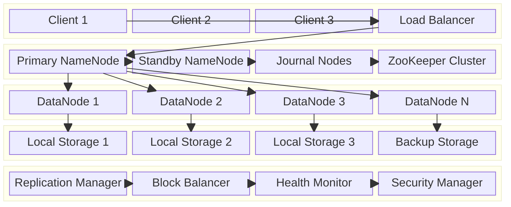

## 4. Data Architecture & Flow

### 4.1 Data Flow Diagrams

#### File Write Operation Flow
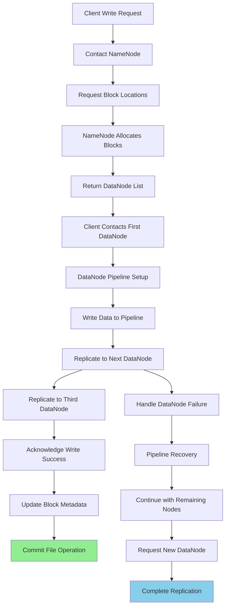

#### File Read Operation Flow
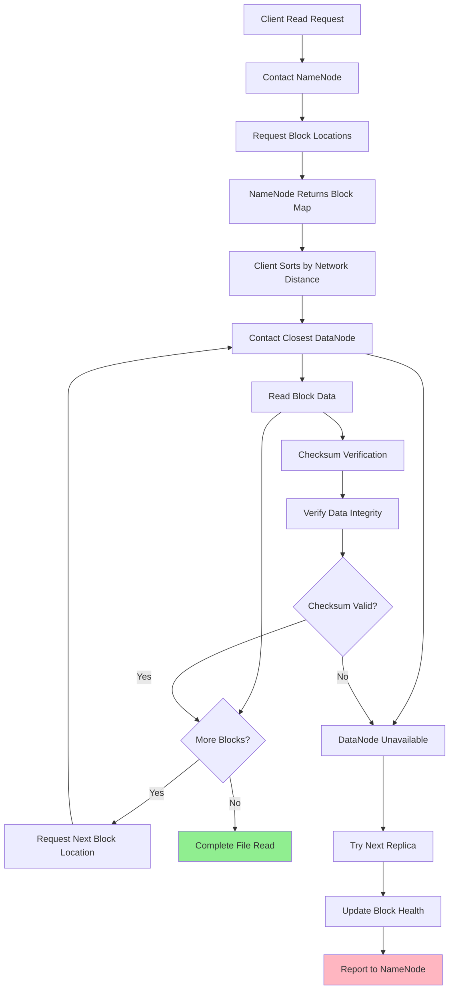

#### Block Replication and Recovery Flow
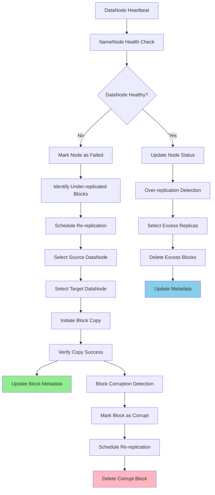

### 4.2 Database Design

#### Metadata Management Schema
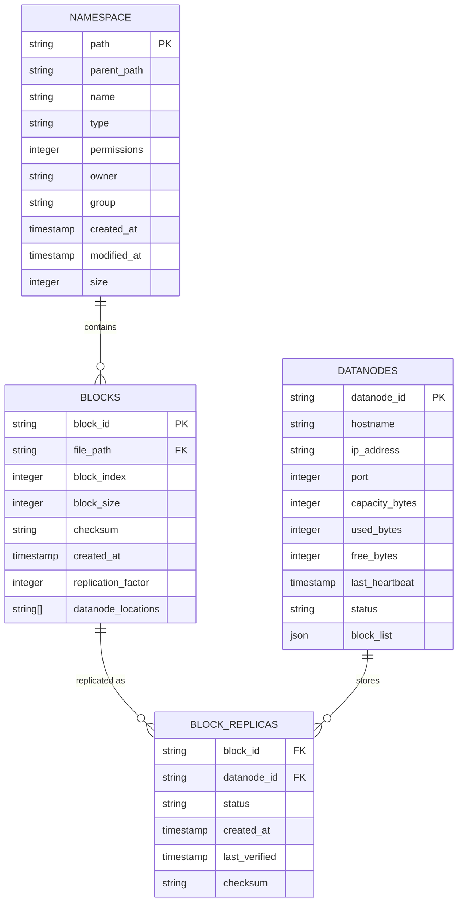

#### Operational Metadata Schema
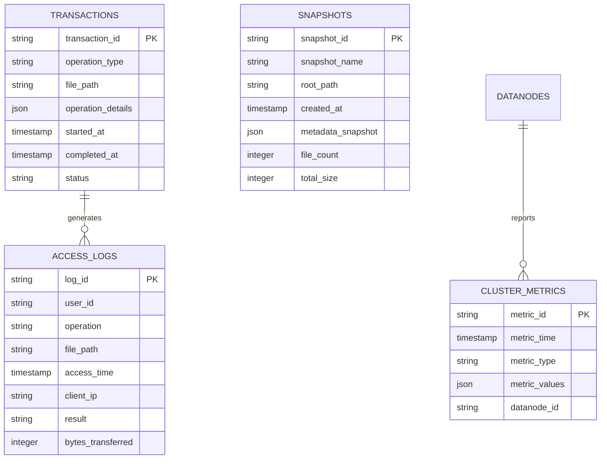

## 5. Detailed Component Design

### 5.1 NameNode Service

**Purpose & Responsibilities:**
- Maintain the file system namespace and directory tree
- Manage block allocation and mapping to DataNodes
- Handle client metadata requests and file system operations
- Coordinate replication and maintain data consistency
- Manage DataNode registration and health monitoring

**Metadata Management:**
- **In-Memory Metadata**: Keep entire namespace in memory for fast access
- **Edit Log**: Write-ahead log for all namespace modifications
- **FsImage**: Periodic snapshots of namespace state
- **Checkpointing**: Background process to merge edit logs with FsImage

**High Availability Features:**
- **Standby NameNode**: Hot standby for automatic failover
- **Shared Storage**: Journal nodes for edit log sharing
- **Automatic Failover**: ZooKeeper-based leader election
- **Consistent State**: Ensure metadata consistency across failures

### 5.2 DataNode Service

**Purpose & Responsibilities:**
- Store and serve file system blocks on local storage
- Handle block read and write operations from clients
- Participate in block replication pipelines
- Report block health and storage status to NameNode
- Perform periodic block verification and corruption detection

**Storage Management:**
- **Block Storage**: Manage blocks as individual files on local filesystem
- **Checksums**: Generate and verify checksums for data integrity
- **Storage Directories**: Support multiple storage directories per node
- **Block Caching**: Cache frequently accessed blocks in memory

**Replication Pipeline:**
- **Pipeline Setup**: Coordinate with other DataNodes for replication
- **Streaming**: Efficient streaming of block data between nodes
- **Acknowledgments**: Provide acknowledgments for successful writes
- **Error Handling**: Handle failures and coordinate recovery

### 5.3 Client Library

**Purpose & Responsibilities:**
- Provide file system API for client applications
- Cache metadata and block locations for performance
- Handle DataNode failures and automatic retry logic
- Implement read/write buffering and optimization
- Provide transparent access to distributed file system

**Performance Optimizations:**
- **Metadata Caching**: Cache frequently accessed metadata locally
- **Read Ahead**: Prefetch blocks for sequential read patterns
- **Write Buffering**: Buffer writes to optimize network utilization
- **Connection Pooling**: Reuse connections to DataNodes

### Critical User Journey Sequence Diagrams

#### Large File Write Operation
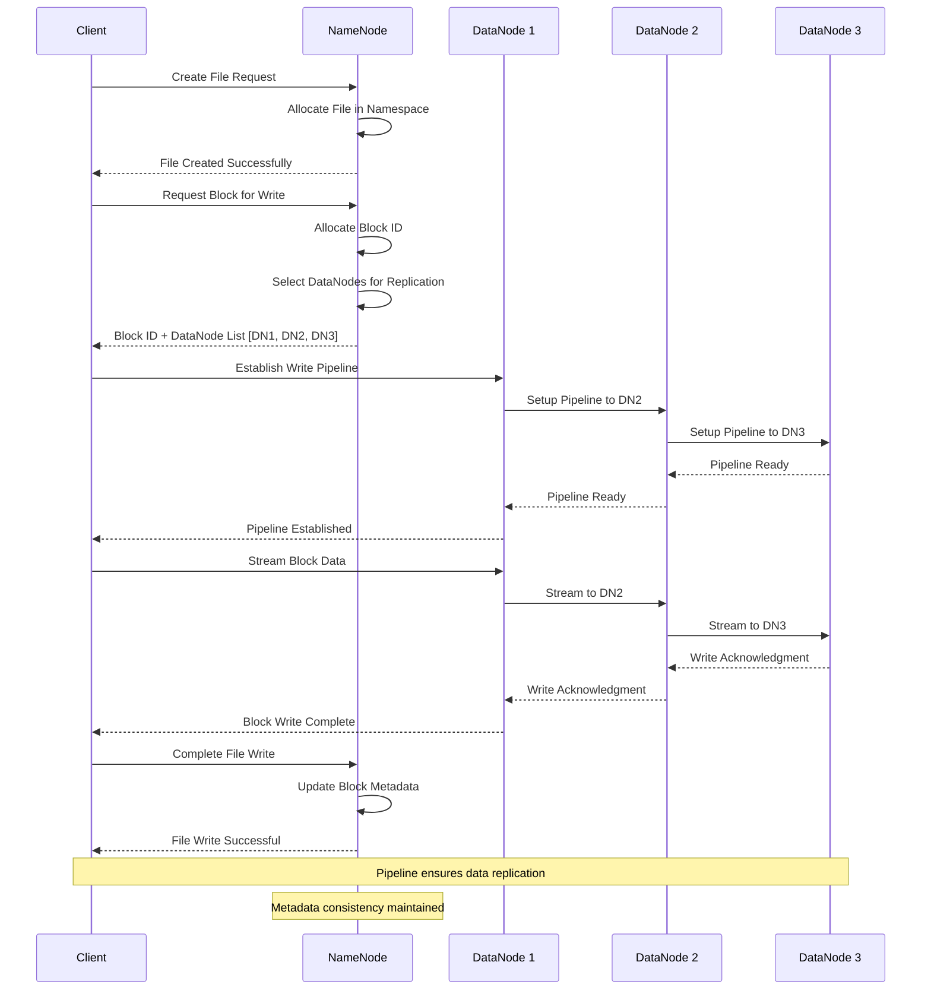

#### File Read with DataNode Failure
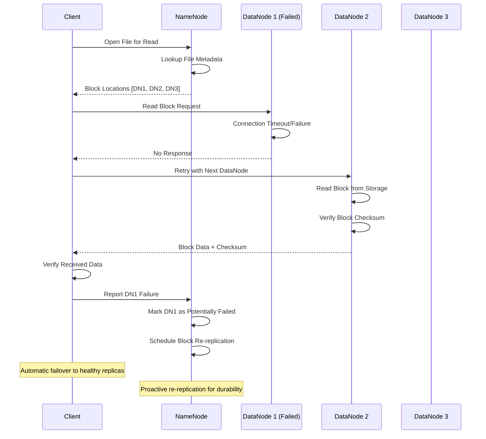

#### Automatic Block Re-replication
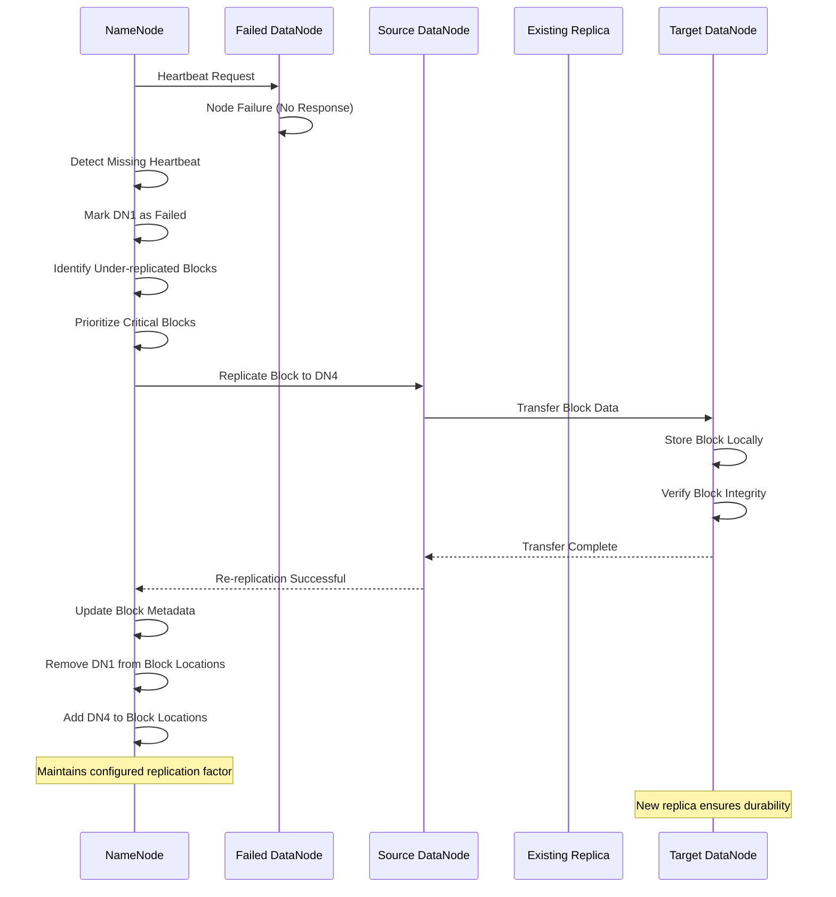

## 6. Scalability & Performance

### 6.1 Scaling Architecture

```mermaid
flowchart TD
    subgraph "Horizontal Scaling"
        A[Add DataNodes] --> B[Automatic Discovery]
        B --> C[Load Rebalancing]
        C --> D[Capacity Expansion]
    end
    
    subgraph "NameNode Scaling"
        E[Metadata Growth] --> F[Memory Optimization]
        F --> G[Federation Support]
        G --> H[Multiple NameNodes]
    end
    
    subgraph "Performance Scaling"
        I[I/O Optimization] --> J[Block Size Tuning]
        J --> K[Parallel Operations]
        K --> L[Network Optimization]
    end
    
    subgraph "Storage Scaling"
        M[Storage Tiers] --> N[Hot/Cold Data]
        N --> O[Automatic Tiering]
        O --> P[Cost Optimization]
    end
    
    style D fill:#87CEEB
    style H fill:#90EE90
    style L fill:#FFB6C1
    style P fill:#DDA0DD
```

### 6.2 Performance Optimization

**Read Performance:**
- **Block Caching**: Cache frequently accessed blocks in memory
- **Read Ahead**: Predictive prefetching for sequential access
- **Replica Selection**: Choose closest replica based on network topology
- **Connection Pooling**: Reuse connections to reduce connection overhead

**Write Performance:**
- **Write Pipelining**: Parallel replication to multiple DataNodes
- **Batch Operations**: Group small operations for efficiency
- **Asynchronous Replication**: Non-blocking replication for better throughput
- **Block Placement**: Intelligent placement based on network topology

**Metadata Performance:**
- **In-Memory Operations**: Keep all metadata in memory for fast access
- **Efficient Data Structures**: Optimized data structures for namespace operations
- **Background Processing**: Asynchronous operations for non-critical tasks
- **Checkpointing Optimization**: Efficient merging of edit logs

## 7. Reliability & Fault Tolerance

### 7.1 High Availability Design

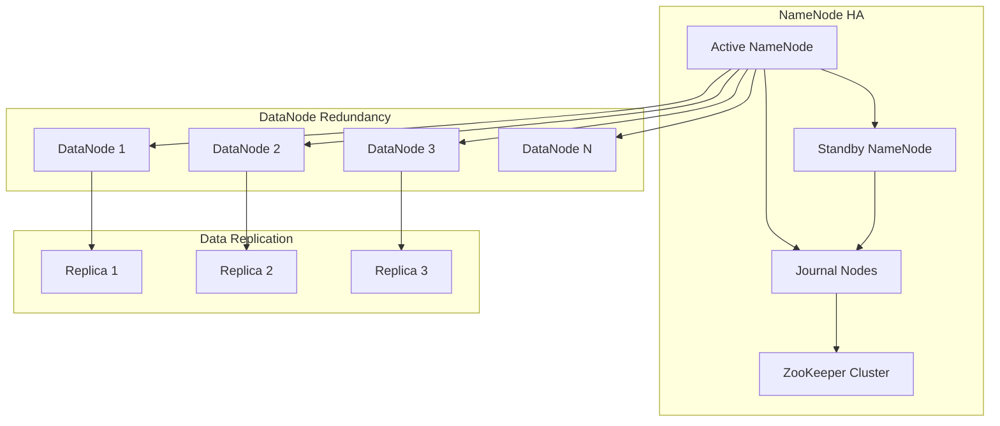

**Fault Tolerance Mechanisms:**
- **Automatic Failover**: Seamless failover from active to standby NameNode
- **Block Replication**: Configurable replication factor (default 3)
- **Checksum Verification**: Detect and recover from data corruption
- **Heartbeat Monitoring**: Continuous health monitoring of all nodes

### 7.2 Disaster Recovery

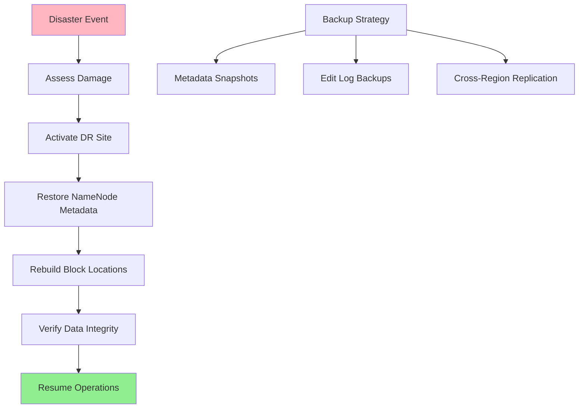

**RTO/RPO Targets:**
- **RTO**: 5 minutes for NameNode failover, 1 hour for full cluster recovery
- **RPO**: Near-zero with synchronous replication, 15 minutes for backups
- **Data Durability**: 99.999999999% with triple replication
- **Availability**: 99.99% with automatic failover

## 8. Security Architecture

### 8.1 Security Layers

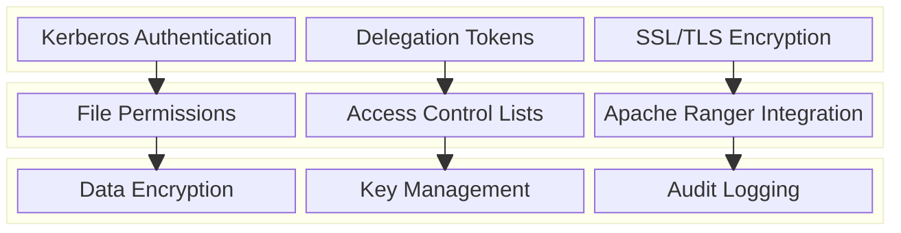

**Security Features:**
- **Strong Authentication**: Kerberos-based authentication for all operations
- **Authorization**: Fine-grained permissions and access control lists
- **Encryption**: Data encryption at rest and in transit
- **Audit Logging**: Comprehensive audit trails for compliance

**Data Protection:**
- **Transparent Encryption**: Automatic encryption/decryption of data
- **Key Management**: Secure key generation and rotation
- **Secure Deletion**: Secure deletion of sensitive data
- **Compliance**: Support for regulatory compliance requirements

### 8.2 Security Flow

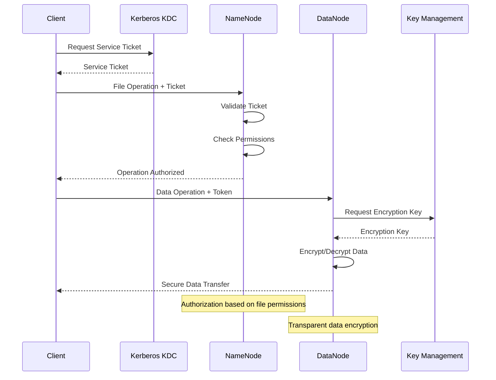

## 9. Monitoring & Observability

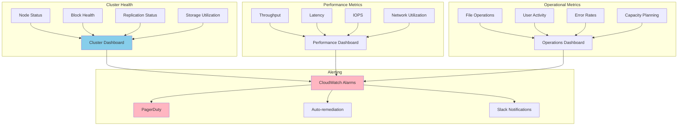

**Key Performance Indicators:**
- **Availability**: Cluster uptime, NameNode availability, DataNode health
- **Performance**: Read/write throughput, latency percentiles, IOPS
- **Durability**: Block corruption rates, replication health, backup success
- **Capacity**: Storage utilization, growth trends, capacity planning

**Alerting Strategy:**
- **Critical**: NameNode failures, data corruption, cluster unavailability
- **Warning**: DataNode failures, under-replication, high disk usage
- **Info**: Performance trends, capacity thresholds, maintenance schedules

## 10. Cost Optimization

**Service-Level Cost Analysis:**
- **EC2 Instances**: $20,000/month (100 nodes, mixed instance types)
- **EBS Storage**: $8,000/month (NameNode metadata and logs)
- **Instance Store**: $0/month (included with instances, primary data storage)
- **S3**: $2,000/month (backup storage and cold data archival)
- **Data Transfer**: $3,000/month (cross-AZ and internet traffic)
- **Monitoring**: $1,000/month (CloudWatch and custom metrics)
- **Other Services**: $2,000/month (Load balancers, VPN, etc.)
- **Total Estimated**: ~$36,000/month for 100-node cluster (10PB capacity)

**Cost Optimization Strategies:**
- **Spot Instances**: 60% cost reduction for batch processing DataNodes
- **Reserved Instances**: 40% savings on long-running NameNodes
- **Storage Tiering**: Move cold data to cheaper storage tiers
- **Compression**: Reduce storage requirements through data compression
- **Right-sizing**: Optimize instance types based on workload patterns

**Hardware Cost Considerations:**
- **Storage Cost**: $0.03-0.05 per GB per month for high-performance storage
- **Compute Cost**: $0.10-0.50 per hour per node depending on instance type
- **Network Cost**: $0.09 per GB for data transfer between regions
- **Total Cost of Ownership**: 3-5x lower than traditional storage solutions

## 11. Implementation Strategy

### 11.1 Migration/Deployment Plan

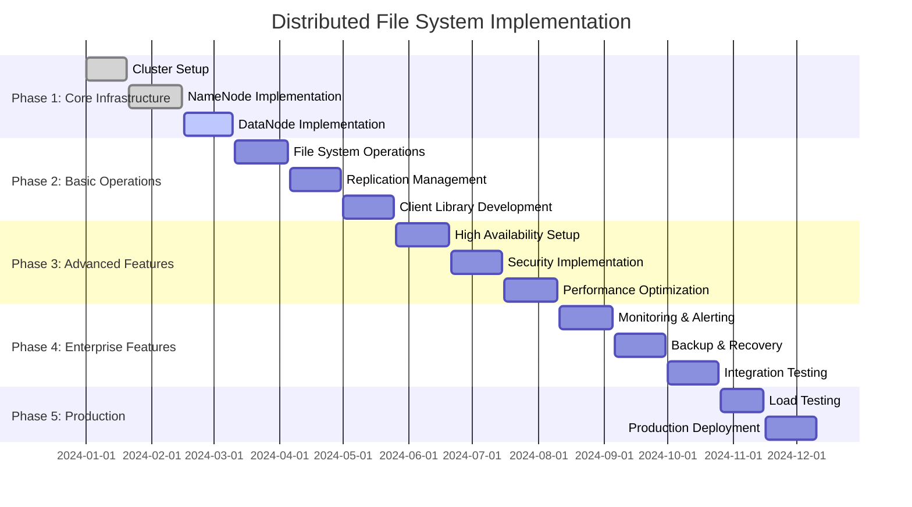

### 11.2 Technology Decisions & Trade-offs

**Architecture Decisions:**
- **Master-Slave vs Peer-to-Peer**: Master-slave chosen for consistency and simplicity
- **Centralized vs Distributed Metadata**: Centralized for performance and consistency
- **Block Size**: Large blocks (128MB-1GB) for big data workloads
- **Replication Factor**: Default 3 for balance of durability and cost

**Storage Technology:**
- **Local vs Network Storage**: Local storage for performance, network for flexibility
- **SSD vs HDD**: Mixed approach with SSD for metadata, HDD for bulk data
- **RAID vs Replication**: Software replication across nodes instead of RAID
- **Compression**: Optional compression with trade-off between CPU and storage

**Consistency Model:**
- **Strong Consistency**: For metadata operations and file system semantics
- **Eventual Consistency**: For non-critical operations and cross-region replication
- **Write-Once-Read-Many**: Optimized for append-only workloads
- **Immutable Files**: Simplify consistency and enable efficient caching

**Future Evolution Path:**
- **Erasure Coding**: Reduce storage overhead while maintaining durability
- **Tiered Storage**: Automatic movement between hot, warm, and cold storage
- **Multi-Tenancy**: Enhanced isolation and resource management
- **Cloud Integration**: Seamless integration with cloud storage services

**Technical Debt & Improvement Areas:**
- **Small File Performance**: Optimization for workloads with many small files
- **Metadata Scalability**: Horizontal scaling of metadata management
- **Cross-Datacenter Replication**: Efficient replication across geographic regions
- **Advanced Analytics**: Built-in analytics and query capabilities
