# Centralized Logging System Design Architecture

## 1. Executive Summary & Requirements

### System Overview
A comprehensive centralized logging system that collects, processes, stores, and analyzes logs from distributed applications and infrastructure components. The system provides real-time log ingestion, powerful search capabilities, alerting, and analytics to support operational monitoring, debugging, and compliance requirements.

### Functional Requirements
- **Log Collection**: Collect logs from multiple sources (applications, servers, containers, cloud services)
- **Real-time Processing**: Process and index logs in real-time with minimal latency
- **Search & Analytics**: Powerful search capabilities with filters, aggregations, and visualizations
- **Alerting**: Real-time alerting based on log patterns and anomalies
- **Data Retention**: Configurable retention policies with automated archival
- **Multi-tenancy**: Isolated log access for different teams and applications
- **Format Support**: Support various log formats (JSON, syslog, custom formats)
- **Compliance**: Audit trails and compliance reporting capabilities
- **Dashboard**: Real-time dashboards and visualization tools
- **API Access**: RESTful APIs for programmatic access to logs

### Non-Functional Requirements
- **Availability**: 99.99% uptime for log ingestion and search
- **Throughput**: Handle 1M+ log events per second
- **Latency**: <1 second from log generation to searchability
- **Storage**: Petabyte-scale log storage with efficient compression
- **Retention**: Support retention periods from days to years
- **Search Performance**: <1 second response time for typical queries

### Key Constraints
- Handle varying log volumes and traffic spikes
- Support structured and unstructured log data
- Maintain log ordering and timestamps across distributed systems
- Balance between storage costs and query performance
- Ensure data privacy and security for sensitive logs

### Success Metrics
- 99.99% availability for critical logging operations
- <500ms P95 search query response time
- >99% successful log ingestion rate
- <1% data loss during peak traffic
- Support 100TB+ daily log ingestion

## 2. High-Level Architecture Overview

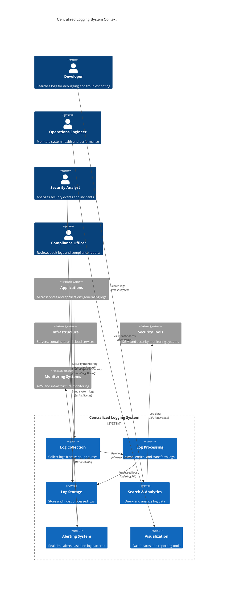

**Architectural Style Rationale**: Event-driven microservices architecture with stream processing chosen for:
- High-throughput log ingestion from distributed sources
- Real-time processing and indexing of log data
- Independent scaling of collection, processing, and storage components
- Fault tolerance and graceful handling of traffic spikes
- Support for multiple log formats and sources

## 3. Detailed System Architecture

### 3.1 AWS Service Stack Selection

**Log Collection:**
- **Kinesis Data Streams**: High-throughput log ingestion
- **Kinesis Firehose**: Managed log delivery to storage
- **CloudWatch Logs**: Native AWS log collection
- **AWS Lambda**: Serverless log processing functions

**Data Processing:**
- **Kinesis Analytics**: Real-time stream processing
- **EMR**: Large-scale batch processing for historical analysis
- **Glue**: ETL jobs for log transformation
- **Lambda**: Event-driven log processing

**Storage:**
- **OpenSearch**: Primary log search and analytics engine
- **S3**: Long-term log archival and cold storage
- **DynamoDB**: Metadata and configuration storage
- **ElastiCache Redis**: Caching for frequently accessed data

**Search & Analytics:**
- **OpenSearch**: Full-text search and log analytics
- **Athena**: SQL queries on archived logs in S3
- **QuickSight**: Business intelligence dashboards
- **Elasticsearch**: Alternative search backend

**Monitoring:**
- **CloudWatch**: System metrics and monitoring
- **X-Ray**: Distributed tracing for log processing pipeline
- **SNS**: Alert notifications and messaging
- **SQS**: Dead letter queues and retry mechanisms

**Security:**
- **IAM**: Fine-grained access control for log data
- **KMS**: Encryption key management for sensitive logs
- **VPC**: Network isolation for log processing components
- **CloudTrail**: Audit logging for the logging system itself

### 3.2 Component Architecture Diagram

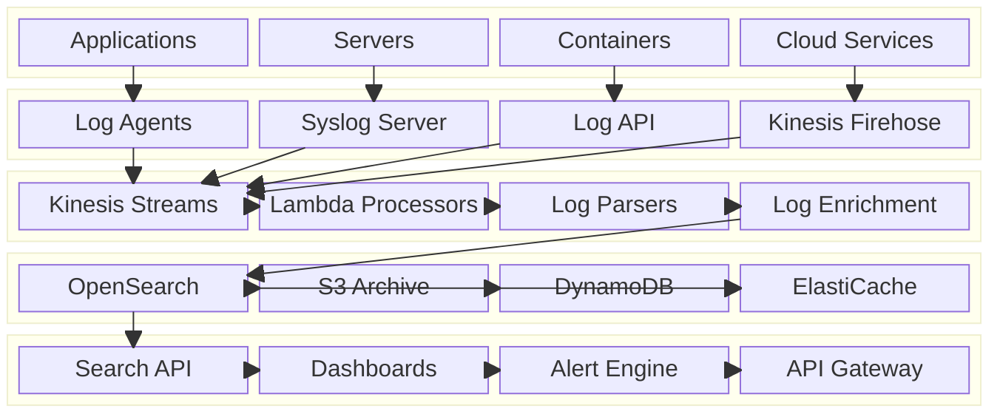

## 4. Data Architecture & Flow

### 4.1 Data Flow Diagrams

#### Log Ingestion and Processing Pipeline
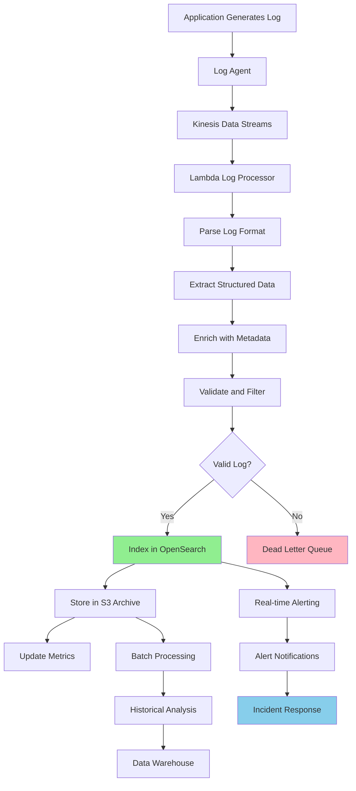

#### Log Search and Analytics Flow
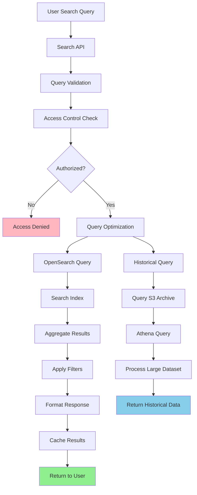

#### Real-time Alerting and Monitoring Flow
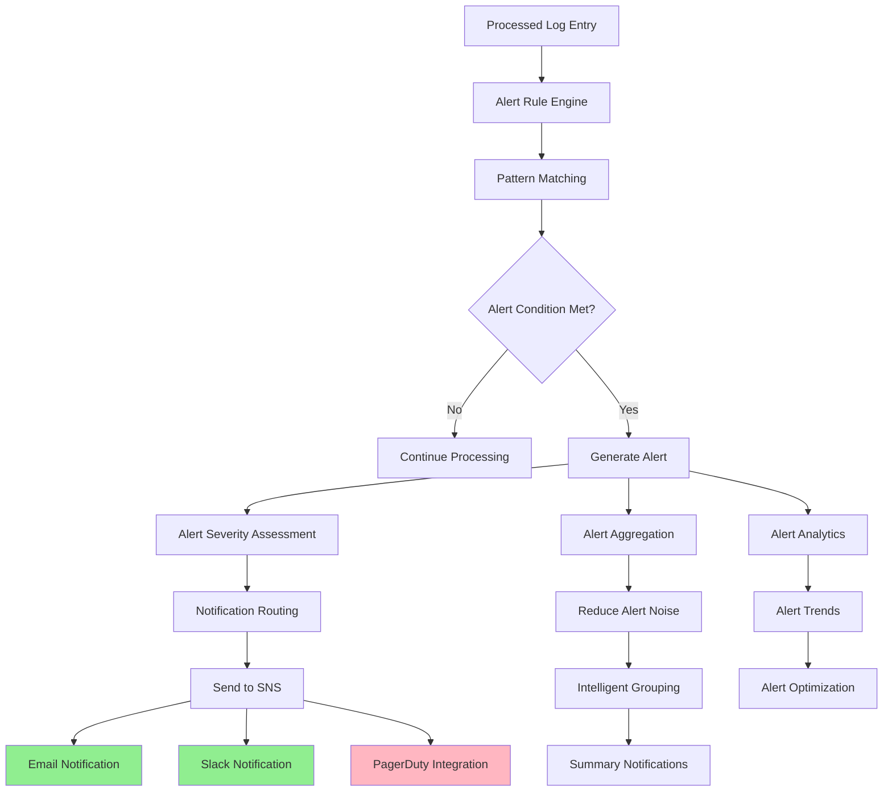

### 4.2 Database Design

#### Log Storage Schema (OpenSearch)
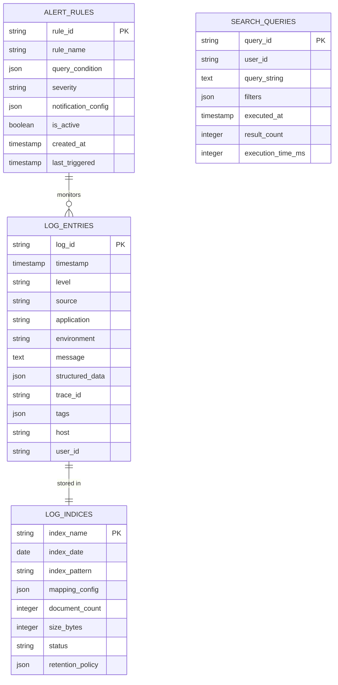

#### Configuration and Metadata Schema (DynamoDB)
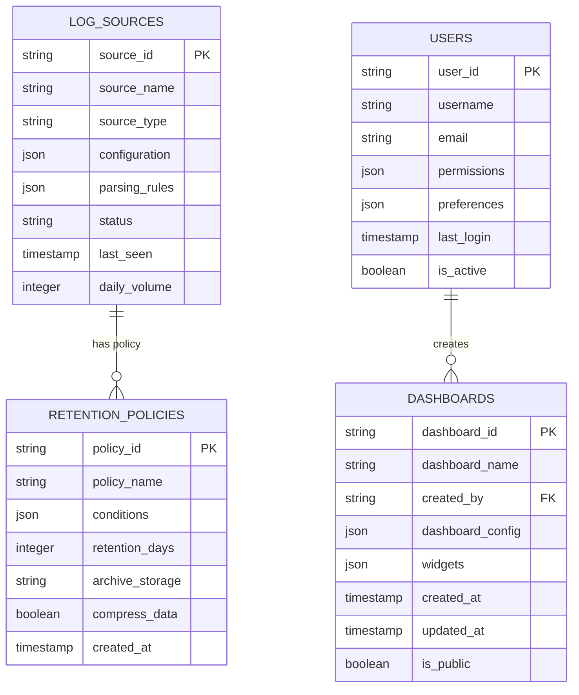

## 5. Detailed Component Design

### 5.1 Log Collection Service

**Purpose & Responsibilities:**
- Collect logs from diverse sources (applications, infrastructure, cloud services)
- Handle various log formats and protocols (syslog, JSON, custom formats)
- Provide reliable log delivery with buffering and retry mechanisms
- Support high-throughput ingestion with minimal performance impact
- Implement backpressure handling during traffic spikes

**Collection Methods:**
- **Log Agents**: Lightweight agents deployed on servers and containers
- **API Endpoints**: RESTful APIs for direct log submission
- **Syslog Protocol**: Standard syslog protocol support
- **Cloud Integrations**: Native integrations with AWS CloudWatch Logs

**Performance Optimizations:**
- **Batching**: Group logs for efficient network utilization
- **Compression**: Compress log data to reduce network overhead
- **Buffering**: Local buffering to handle temporary network issues
- **Load Balancing**: Distribute load across multiple ingestion endpoints

### 5.2 Log Processing Service

**Purpose & Responsibilities:**
- Parse and structure incoming log data
- Enrich logs with additional metadata and context
- Filter and transform logs based on business rules
- Handle schema evolution and format changes
- Implement data quality checks and validation

**Processing Features:**
- **Format Detection**: Automatic detection of log formats
- **Schema Extraction**: Extract structured data from unstructured logs
- **Field Mapping**: Map fields to standardized schema
- **Data Enrichment**: Add contextual information (GeoIP, user details)
- **Anomaly Detection**: Identify unusual patterns in log data

### 5.3 Search and Analytics Service

**Purpose & Responsibilities:**
- Provide fast and flexible log search capabilities
- Support complex queries with filters, aggregations, and analytics
- Implement full-text search with relevance scoring
- Handle time-series queries and trend analysis
- Optimize query performance for large datasets

**Search Features:**
- **Full-text Search**: Search across all log fields with relevance ranking
- **Structured Queries**: SQL-like queries for structured log data
- **Time-based Queries**: Efficient queries across time ranges
- **Aggregations**: Statistical analysis and grouping operations
- **Saved Searches**: Reusable search queries and templates

### Critical User Journey Sequence Diagrams

#### End-to-End Log Processing
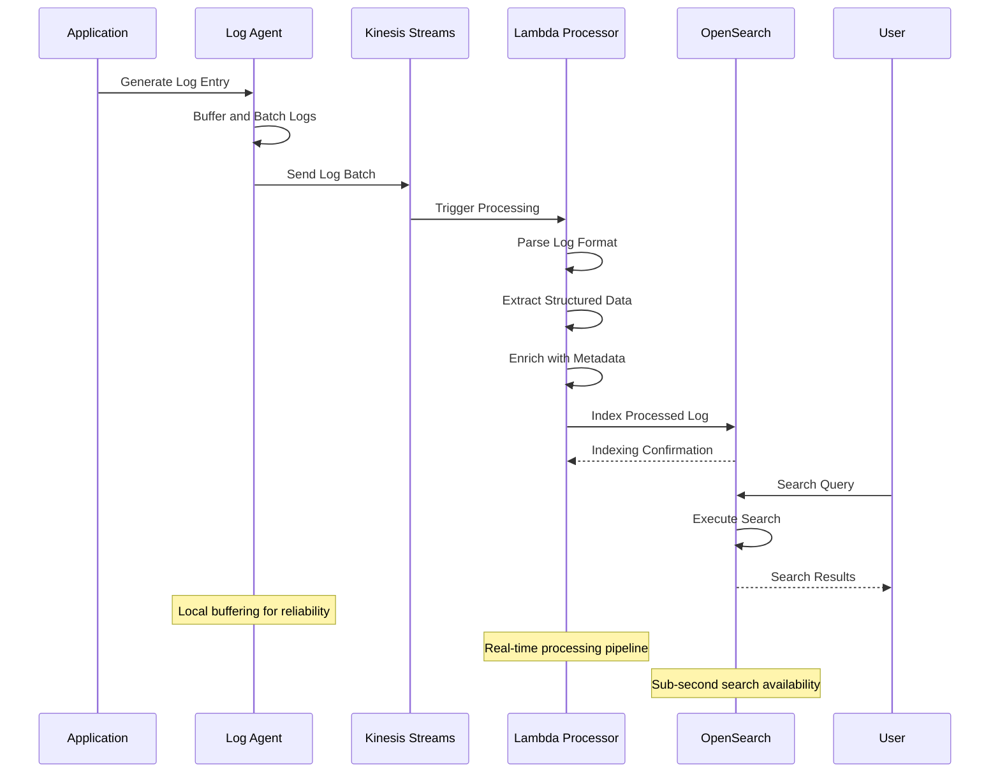

#### Alert Generation and Notification
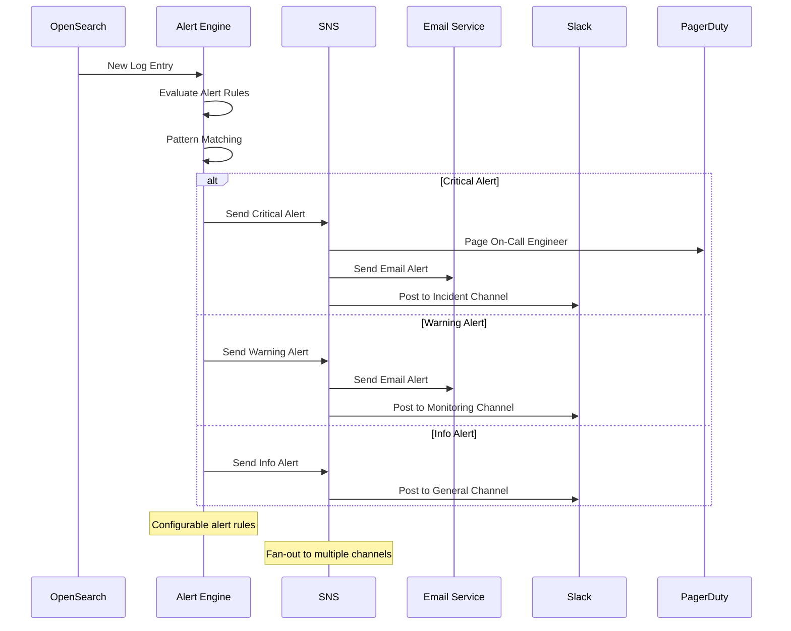

#### Historical Log Analysis
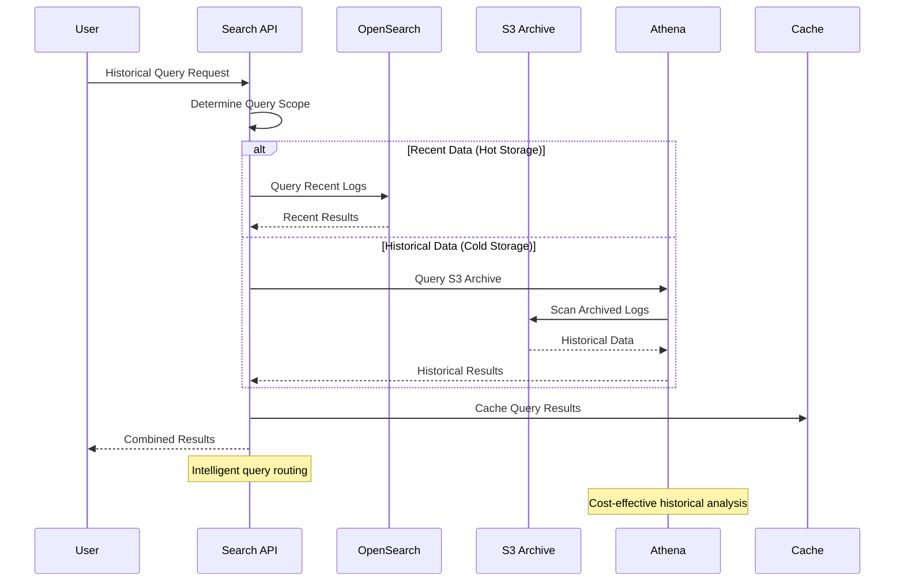

## 6. Scalability & Performance

### 6.1 Scaling Architecture

```mermaid
flowchart TD
    subgraph "Ingestion Scaling"
        A[Log Volume Growth] --> B[Kinesis Shard Scaling]
        B --> C[Lambda Concurrency]
        C --> D[Processing Pipeline Scale]
    end
    
    subgraph "Storage Scaling"
        E[Data Growth] --> F[OpenSearch Cluster Scaling]
        F --> G[Index Sharding]
        G --> H[Hot-Warm-Cold Architecture]
    end
    
    subgraph "Query Scaling"
        I[Search Load] --> J[OpenSearch Read Replicas]
        J --> K[Query Caching]
        K --> L[Load Balancing]
    end
    
    subgraph "Archive Scaling"
        M[Historical Data] --> N[S3 Intelligent Tiering]
        N --> O[Glacier Integration]
        O --> P[Cost Optimization]
    end
    
    style D fill:#87CEEB
    style H fill:#90EE90
    style L fill:#FFB6C1
    style P fill:#DDA0DD
```

### 6.2 Performance Optimization

**Ingestion Performance:**
- **Batch Processing**: Group logs for efficient processing
- **Parallel Processing**: Concurrent processing of log streams
- **Compression**: Reduce network and storage overhead
- **Schema Optimization**: Efficient field mapping and indexing

**Search Performance:**
- **Index Optimization**: Efficient index design and mapping
- **Query Caching**: Cache frequently executed queries
- **Data Tiering**: Hot-warm-cold storage architecture
- **Aggregation Caching**: Pre-computed aggregations for dashboards

**Storage Performance:**
- **SSD Storage**: High-performance storage for active indices
- **Index Lifecycle Management**: Automatic index lifecycle policies
- **Compression**: Reduce storage footprint without impacting performance
- **Replica Optimization**: Optimal replica configuration for read performance

## 7. Reliability & Fault Tolerance

### 7.1 High Availability Design

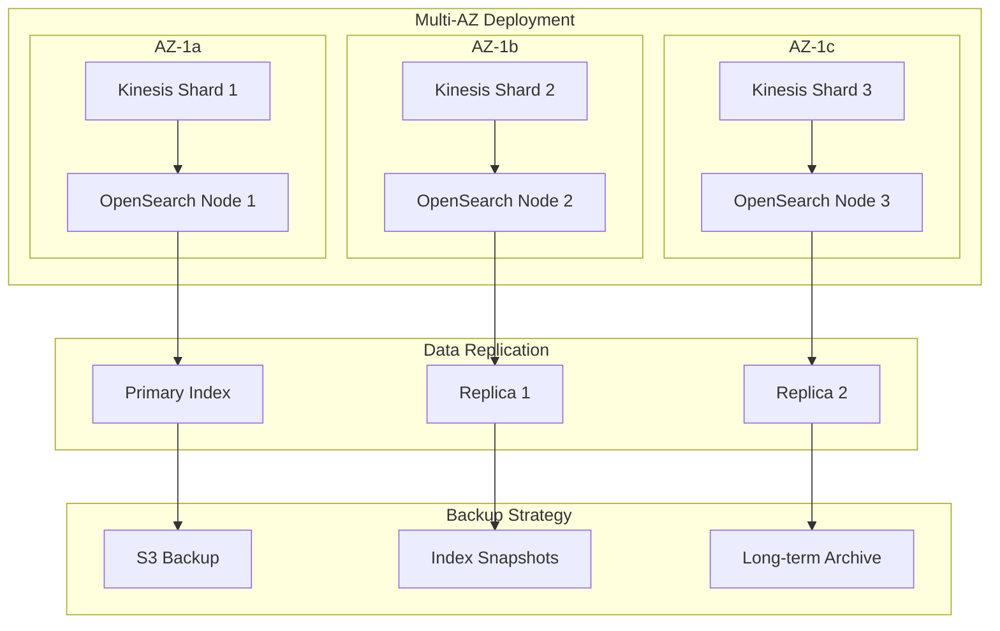

**Fault Tolerance Mechanisms:**
- **Automatic Failover**: Seamless failover between availability zones
- **Data Replication**: Multiple replicas for data durability
- **Circuit Breakers**: Prevent cascade failures in processing pipeline
- **Dead Letter Queues**: Handle failed log processing gracefully

### 7.2 Disaster Recovery

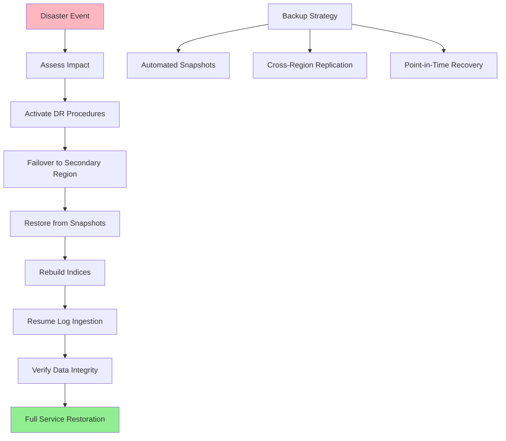

**RTO/RPO Targets:**
- **RTO**: 15 minutes for log ingestion, 1 hour for full search capability
- **RPO**: 5 minutes for log data, 1 hour for historical data
- **Data Retention**: 99.99% durability with cross-region replication
- **Recovery Testing**: Monthly disaster recovery drills

## 8. Security Architecture

### 8.1 Security Layers

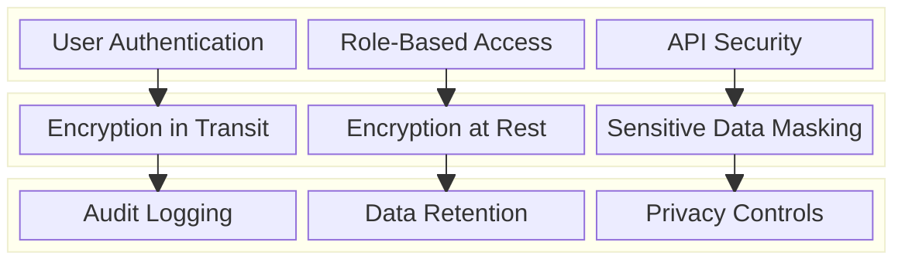

**Security Features:**
- **Multi-Factor Authentication**: Enhanced security for admin access
- **Role-Based Access Control**: Fine-grained permissions for log access
- **Data Encryption**: End-to-end encryption for sensitive log data
- **Audit Trails**: Comprehensive audit logging for compliance

**Data Protection:**
- **Field-Level Security**: Restrict access to sensitive log fields
- **Data Masking**: Automatic masking of PII and sensitive data
- **Retention Policies**: Automated data deletion for compliance
- **Access Logging**: Log all access to sensitive log data

### 8.2 Security and Compliance Flow

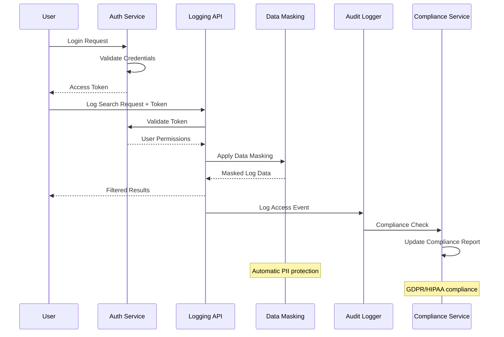

## 9. Monitoring & Observability

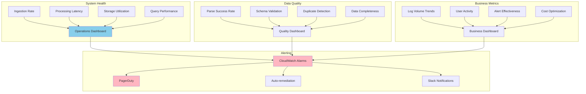

**Key Performance Indicators:**
- **Ingestion**: Log ingestion rate, processing latency, error rates
- **Storage**: Storage utilization, index health, retention compliance
- **Search**: Query response times, search success rates, user activity
- **Alerts**: Alert accuracy, response times, false positive rates

**Alerting Strategy:**
- **Critical**: Log ingestion failures, storage outages, security breaches
- **Warning**: High processing latency, storage capacity warnings, query performance issues
- **Info**: Usage trends, capacity planning alerts, maintenance notifications

## 10. Cost Optimization

**Service-Level Cost Analysis:**
- **OpenSearch**: $12,000/month (Large cluster with hot-warm-cold tiers)
- **Kinesis**: $4,000/month (High-throughput data streaming)
- **S3**: $3,000/month (Log archival and cold storage)
- **Lambda**: $2,000/month (Log processing functions)
- **EC2**: $3,000/month (Log agents and supporting infrastructure)
- **Data Transfer**: $1,500/month (Cross-region and internet traffic)
- **Other Services**: $2,500/month (CloudWatch, SNS, API Gateway)
- **Total Estimated**: ~$28,000/month for 100TB daily ingestion

**Cost Optimization Strategies:**
- **Data Tiering**: Move old logs to cheaper storage tiers automatically
- **Index Lifecycle Management**: Optimize index allocation and retention
- **Compression**: Reduce storage costs through efficient compression
- **Reserved Capacity**: Long-term commitments for predictable workloads
- **Query Optimization**: Efficient queries to reduce compute costs

**Cost Monitoring:**
- **Per-Source Costing**: Track costs by log source and application
- **Storage Optimization**: Monitor and optimize storage utilization
- **Query Cost Analysis**: Identify expensive queries and optimize them
- **Retention Optimization**: Balance retention requirements with costs

## 11. Implementation Strategy

### 11.1 Migration/Deployment Plan

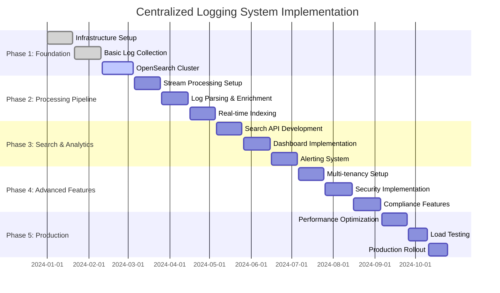

### 11.2 Technology Decisions & Trade-offs

**Storage Technology:**
- **OpenSearch vs Elasticsearch**: OpenSearch chosen for cost-effectiveness and AWS integration
- **Hot-Warm-Cold Architecture**: Balance performance and cost for different data access patterns
- **S3 vs EBS**: S3 for archival storage, EBS for active indices
- **Compression**: Balance between storage costs and query performance

**Processing Architecture:**
- **Stream vs Batch Processing**: Stream processing for real-time requirements
- **Lambda vs ECS**: Lambda for event-driven processing, ECS for long-running services
- **Synchronous vs Asynchronous**: Asynchronous processing for scalability
- **Schema-on-Write vs Schema-on-Read**: Hybrid approach for flexibility and performance

**Search and Analytics:**
- **Full-text vs Structured Search**: Support both for comprehensive log analysis
- **Real-time vs Near Real-time**: Near real-time for cost-performance balance
- **Aggregation Strategy**: Pre-computed aggregations for common queries
- **Query Optimization**: Balance between query flexibility and performance

**Future Evolution Path:**
- **Machine Learning**: Automated anomaly detection and log classification
- **Advanced Analytics**: Predictive analytics and trend analysis
- **Multi-Cloud Support**: Support for hybrid and multi-cloud deployments
- **Edge Processing**: Log processing at edge locations for reduced latency

**Technical Debt & Improvement Areas:**
- **Schema Management**: Better support for evolving log schemas
- **Query Performance**: Advanced query optimization and caching
- **Data Governance**: Enhanced data lineage and governance capabilities
- **Cost Intelligence**: ML-based cost optimization recommendations
