# Metrics and Analytics System Design Architecture

## 1. Executive Summary & Requirements

### System Overview
A comprehensive metrics and analytics platform that collects, processes, stores, and visualizes operational metrics from distributed systems. The system provides real-time monitoring, alerting, anomaly detection, and business intelligence capabilities to support data-driven decision making and operational excellence.

### Functional Requirements
- **Metrics Collection**: Collect metrics from applications, infrastructure, and business processes
- **Real-time Processing**: Process and aggregate metrics in real-time with sub-second latency
- **Time Series Storage**: Efficient storage and retrieval of time-series data at scale
- **Visualization**: Interactive dashboards, charts, and reporting capabilities
- **Alerting**: Real-time alerting based on metric thresholds and anomalies
- **Analytics**: Statistical analysis, trend detection, and predictive analytics
- **Multi-tenancy**: Isolated metrics access for different teams and applications
- **Custom Metrics**: Support for custom business and application metrics
- **Data Retention**: Configurable retention policies with data downsampling
- **API Access**: RESTful APIs for programmatic access to metrics data

### Non-Functional Requirements
- **Availability**: 99.99% uptime for metrics collection and visualization
- **Throughput**: Handle 10M+ metrics per second ingestion
- **Latency**: <100ms for metric ingestion, <1 second for query responses
- **Storage**: Petabyte-scale time-series data storage with compression
- **Retention**: Support retention periods from minutes to years
- **Query Performance**: <500ms response time for dashboard queries

### Key Constraints
- Handle high-cardinality metrics without performance degradation
- Support both push and pull-based metrics collection
- Maintain metric accuracy during system failures and network partitions
- Balance between storage costs and query performance
- Handle varying metric ingestion patterns and traffic spikes

### Success Metrics
- 99.99% availability for critical metrics operations
- <50ms P95 metric ingestion latency
- >99.9% successful metrics collection rate
- <100ms P95 dashboard query response time
- Support 1M+ unique metric series

## 2. High-Level Architecture Overview

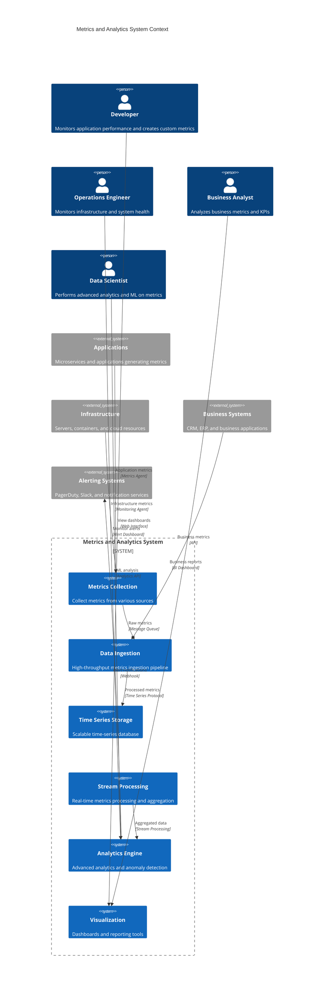

**Architectural Style Rationale**: Event-driven architecture with stream processing chosen for:
- High-throughput metrics ingestion from distributed sources
- Real-time processing and aggregation of time-series data
- Independent scaling of collection, storage, and analytics components
- Support for both real-time and batch analytics workloads
- Flexible integration with various monitoring and alerting tools

## 3. Detailed System Architecture

### 3.1 AWS Service Stack Selection

**Metrics Collection:**
- **CloudWatch Agent**: Native AWS metrics collection
- **Prometheus**: Open-source metrics collection and monitoring
- **Kinesis Data Streams**: High-throughput metrics ingestion
- **IoT Core**: IoT device metrics collection

**Data Processing:**
- **Kinesis Analytics**: Real-time stream processing
- **Lambda**: Serverless metrics processing functions
- **EMR**: Large-scale batch processing for historical analysis
- **Glue**: ETL jobs for metrics transformation

**Time Series Storage:**
- **Timestream**: Managed time-series database
- **OpenSearch**: Alternative time-series storage with analytics
- **S3**: Long-term metrics archival and cold storage
- **DynamoDB**: Metadata and configuration storage

**Analytics:**
- **SageMaker**: Machine learning for anomaly detection
- **Athena**: SQL queries on archived metrics
- **QuickSight**: Business intelligence dashboards
- **Kinesis Analytics**: Real-time analytics and alerting

**Visualization:**
- **Grafana**: Open-source dashboards and visualization
- **QuickSight**: AWS native business intelligence
- **Custom Dashboard**: React-based custom dashboard application

**Monitoring:**
- **CloudWatch**: System metrics and monitoring
- **X-Ray**: Distributed tracing for metrics pipeline
- **SNS**: Alert notifications and messaging
- **EventBridge**: Event routing for metrics-driven workflows

### 3.2 Component Architecture Diagram

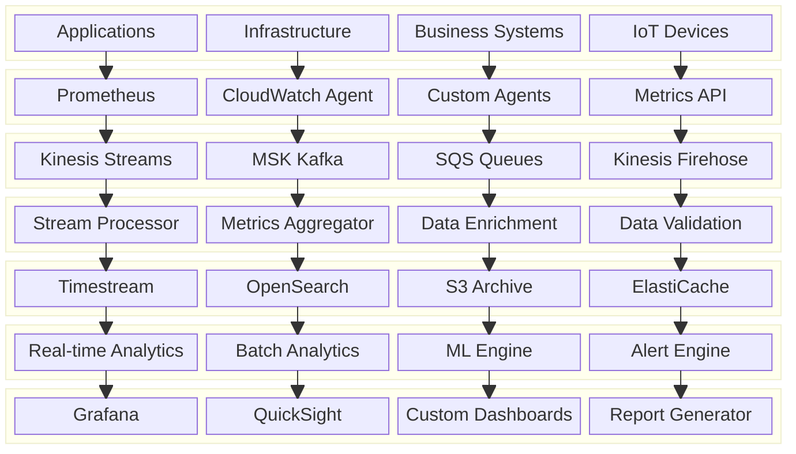

## 4. Data Architecture & Flow

### 4.1 Data Flow Diagrams

#### Metrics Collection and Processing Pipeline
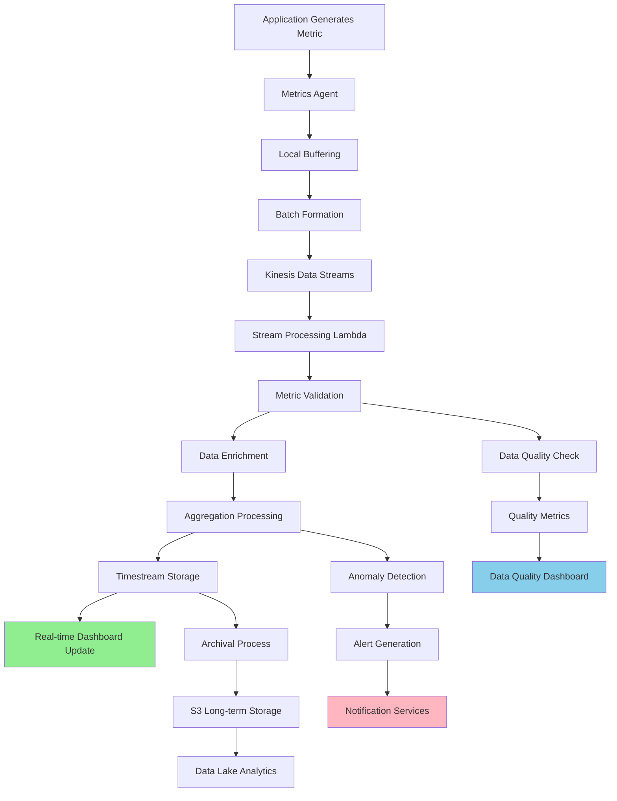

#### Real-time Analytics and Alerting Flow
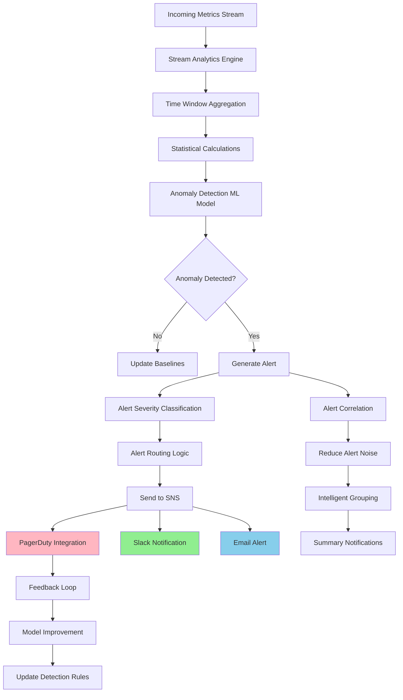

#### Dashboard Query and Visualization Flow
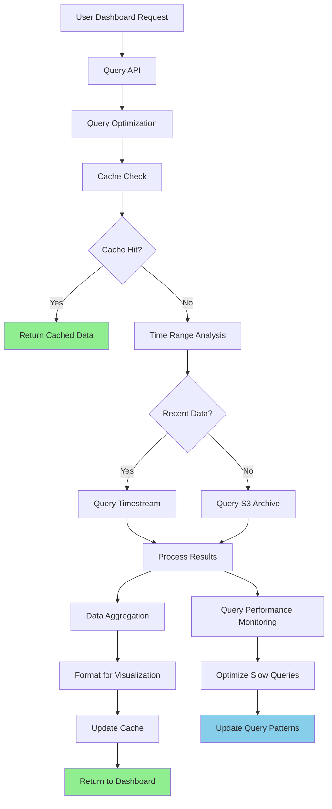

### 4.2 Database Design

#### Time Series Data Schema (Timestream)
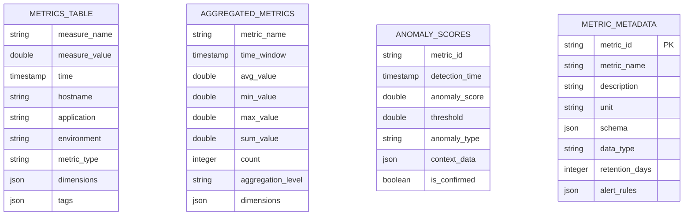

#### Configuration and Alert Schema (DynamoDB)
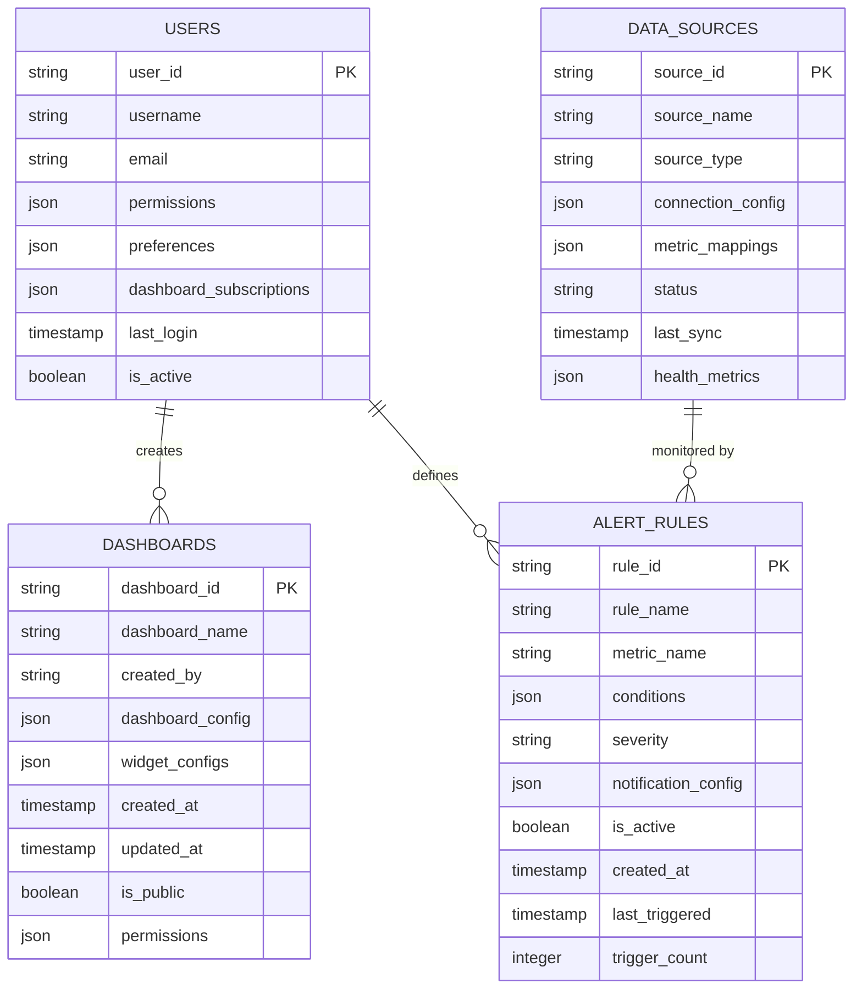

## 5. Detailed Component Design

### 5.1 Metrics Collection Service

**Purpose & Responsibilities:**
- Collect metrics from diverse sources (applications, infrastructure, business systems)
- Support multiple collection protocols (Prometheus, StatsD, custom APIs)
- Handle high-frequency metrics with efficient batching and compression
- Provide reliable delivery with buffering and retry mechanisms
- Support both push and pull-based collection models

**Collection Methods:**
- **Agent-based**: Lightweight agents deployed on servers and containers
- **Pull-based**: Prometheus-style scraping of metrics endpoints
- **Push-based**: Direct metrics submission via APIs
- **Sidecar Pattern**: Container sidecar for microservices metrics

**Performance Optimizations:**
- **Local Buffering**: Buffer metrics locally to handle network issues
- **Compression**: Compress metrics data to reduce network overhead
- **Sampling**: Intelligent sampling for high-frequency metrics
- **Deduplication**: Remove duplicate metrics at collection time

### 5.2 Stream Processing Service

**Purpose & Responsibilities:**
- Process high-volume metrics streams in real-time
- Perform data validation, enrichment, and transformation
- Calculate real-time aggregations and derived metrics
- Implement windowing operations for time-based analytics
- Handle out-of-order and late-arriving metrics

**Processing Features:**
- **Windowing**: Tumbling, sliding, and session windows for aggregations
- **Stateful Processing**: Maintain state for complex analytics
- **Exactly-Once Processing**: Ensure metrics are processed exactly once
- **Schema Evolution**: Handle changes in metrics schema gracefully
- **Backpressure Handling**: Manage processing load during traffic spikes

### 5.3 Analytics Engine

**Purpose & Responsibilities:**
- Perform advanced analytics on metrics data
- Implement anomaly detection using machine learning
- Generate insights and trend analysis
- Support custom analytics queries and computations
- Provide predictive analytics capabilities

**Analytics Capabilities:**
- **Statistical Analysis**: Mean, median, percentiles, standard deviation
- **Anomaly Detection**: Machine learning-based anomaly detection
- **Trend Analysis**: Identify patterns and trends in metrics
- **Correlation Analysis**: Find relationships between different metrics
- **Forecasting**: Predict future metric values and trends

### Critical User Journey Sequence Diagrams

#### End-to-End Metrics Processing
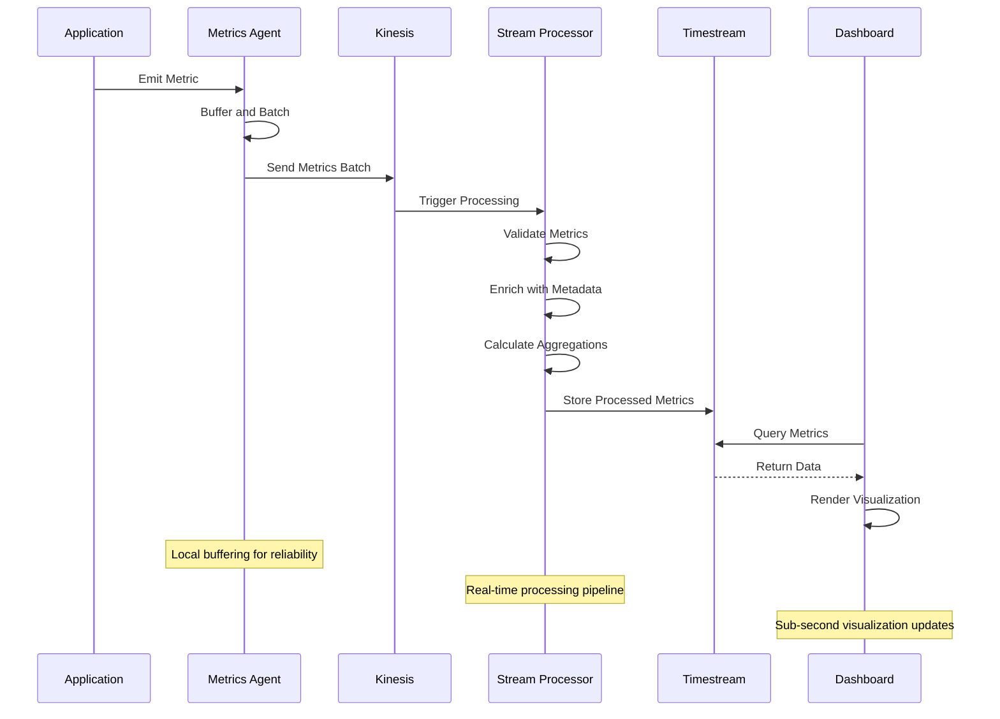

#### Anomaly Detection and Alerting
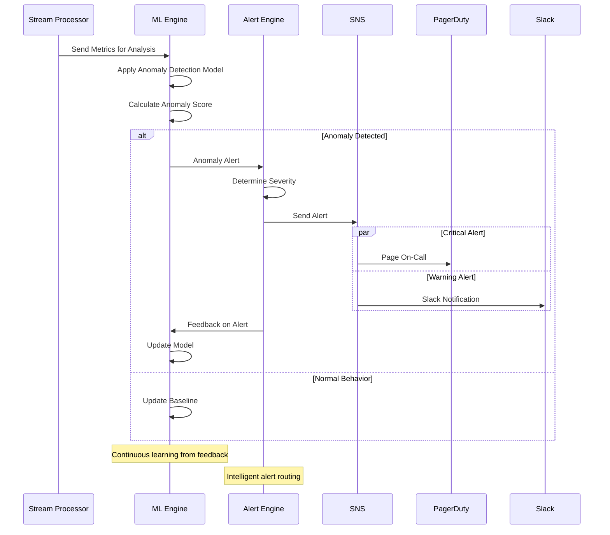

#### Dashboard Query Optimization
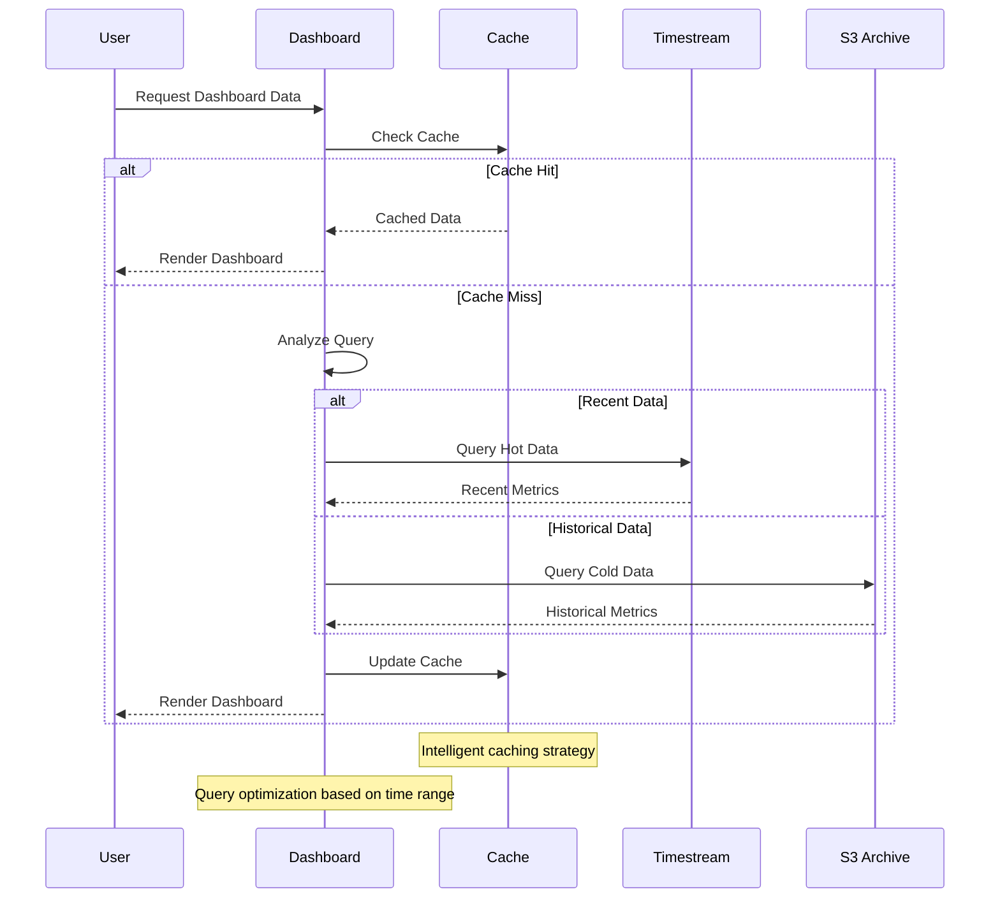

## 6. Scalability & Performance

### 6.1 Scaling Architecture

```mermaid
flowchart TD
    subgraph "Ingestion Scaling"
        A[Metrics Volume Growth] --> B[Kinesis Shard Scaling]
        B --> C[Stream Processor Scaling]
        C --> D[Parallel Processing]
    end
    
    subgraph "Storage Scaling"
        E[Data Growth] --> F[Timestream Auto-scaling]
        F --> G[Partition Management]
        G --> H[Automated Archival]
    end
    
    subgraph "Query Scaling"
        I[Dashboard Load] --> J[Query Caching]
        J --> K[Read Replicas]
        K --> L[Load Balancing]
    end
    
    subgraph "Analytics Scaling"
        M[Analytics Workload] --> N[EMR Cluster Scaling]
        N --> O[Distributed Processing]
        O --> P[Result Caching]
    end
    
    style D fill:#87CEEB
    style H fill:#90EE90
    style L fill:#FFB6C1
    style P fill:#DDA0DD
```

### 6.2 Performance Optimization

**Ingestion Performance:**
- **Batch Processing**: Group metrics for efficient ingestion
- **Compression**: Reduce network and storage overhead
- **Parallel Streams**: Multiple Kinesis shards for high throughput
- **Local Aggregation**: Pre-aggregate metrics at collection point

**Query Performance:**
- **Indexing Strategy**: Optimized indexes for time-series queries
- **Query Caching**: Cache frequently accessed dashboard queries
- **Data Tiering**: Hot-warm-cold storage architecture
- **Query Optimization**: Automatic query optimization and rewriting

**Storage Performance:**
- **Compression**: Efficient compression algorithms for time-series data
- **Partitioning**: Intelligent partitioning by time and dimensions
- **Retention Policies**: Automatic data lifecycle management
- **Memory Optimization**: In-memory caching for recent data

## 7. Reliability & Fault Tolerance

### 7.1 High Availability Design

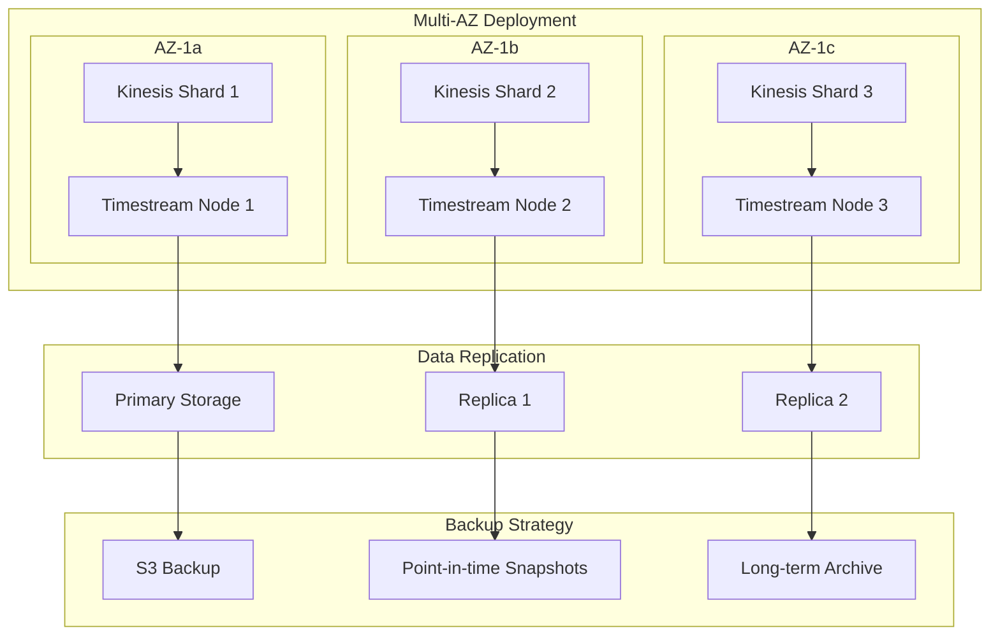

**Fault Tolerance Mechanisms:**
- **Automatic Failover**: Seamless failover between availability zones
- **Data Replication**: Multiple replicas for data durability
- **Circuit Breakers**: Prevent cascade failures in processing pipeline
- **Dead Letter Queues**: Handle failed metrics processing gracefully

### 7.2 Disaster Recovery

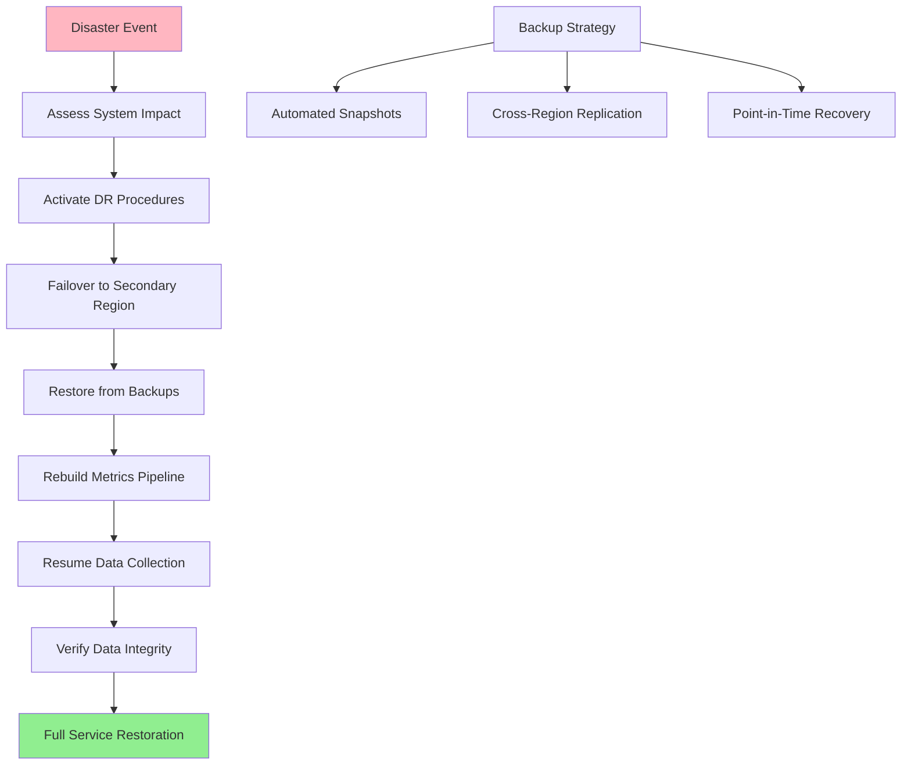

**RTO/RPO Targets:**
- **RTO**: 5 minutes for metrics ingestion, 15 minutes for full analytics
- **RPO**: 1 minute for metrics data, 5 minutes for aggregated data
- **Data Retention**: 99.999% durability with cross-region replication
- **Recovery Testing**: Weekly disaster recovery testing

## 8. Security Architecture

### 8.1 Security Layers

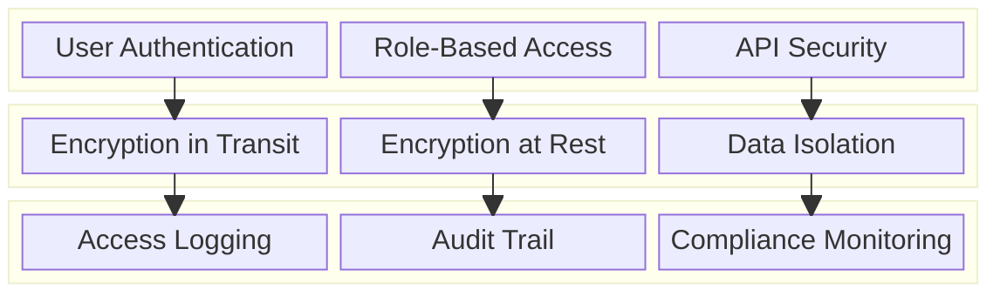

**Security Features:**
- **Multi-Factor Authentication**: Enhanced security for admin access
- **Role-Based Access Control**: Fine-grained permissions for metrics access
- **Data Encryption**: End-to-end encryption for sensitive metrics
- **Audit Logging**: Comprehensive audit trails for compliance

**Data Protection:**
- **Tenant Isolation**: Logical isolation between different organizations
- **Data Masking**: Automatic masking of sensitive metric values
- **Retention Policies**: Automated data deletion for compliance
- **Access Controls**: Granular access controls for different metric types

### 8.2 Security and Compliance Flow

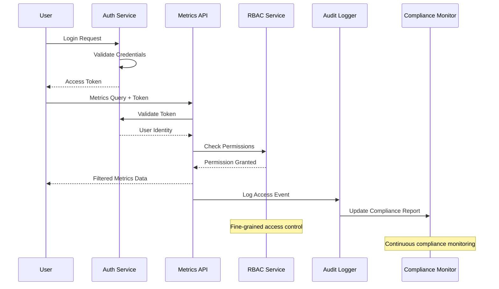

## 9. Monitoring & Observability

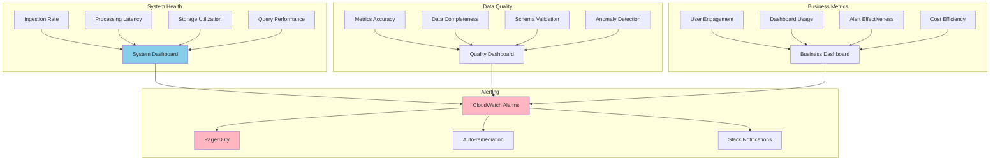

**Key Performance Indicators:**
- **Ingestion**: Metrics ingestion rate, processing latency, error rates
- **Storage**: Storage utilization, query performance, data retention
- **Analytics**: Dashboard load times, alert accuracy, anomaly detection effectiveness
- **Business**: User adoption, dashboard usage, operational efficiency gains

**Alerting Strategy:**
- **Critical**: Metrics ingestion failures, storage outages, security breaches
- **Warning**: High processing latency, storage capacity warnings, query performance issues
- **Info**: Usage trends, capacity planning alerts, maintenance notifications

## 10. Cost Optimization

**Service-Level Cost Analysis:**
- **Timestream**: $15,000/month (High-performance time-series database)
- **Kinesis**: $5,000/month (High-throughput data streaming)
- **Lambda**: $3,000/month (Stream processing functions)
- **S3**: $2,000/month (Long-term metrics archival)
- **EMR**: $4,000/month (Batch analytics processing)
- **CloudWatch**: $2,000/month (System monitoring and alerting)
- **EC2**: $3,000/month (Custom dashboard and processing services)
- **Data Transfer**: $1,000/month (Cross-region and internet traffic)
- **Total Estimated**: ~$35,000/month for 10M metrics/second

**Cost Optimization Strategies:**
- **Data Tiering**: Move old metrics to cheaper storage automatically
- **Compression**: Reduce storage costs through efficient compression
- **Sampling**: Intelligent sampling for high-frequency metrics
- **Reserved Capacity**: Long-term commitments for predictable workloads
- **Query Optimization**: Efficient queries to reduce compute costs

**Cost Monitoring:**
- **Per-Metric Costing**: Track costs by metric type and source
- **Storage Optimization**: Monitor and optimize storage utilization
- **Query Cost Analysis**: Identify expensive queries and optimize
- **Retention Optimization**: Balance retention requirements with costs

## 11. Implementation Strategy

### 11.1 Migration/Deployment Plan

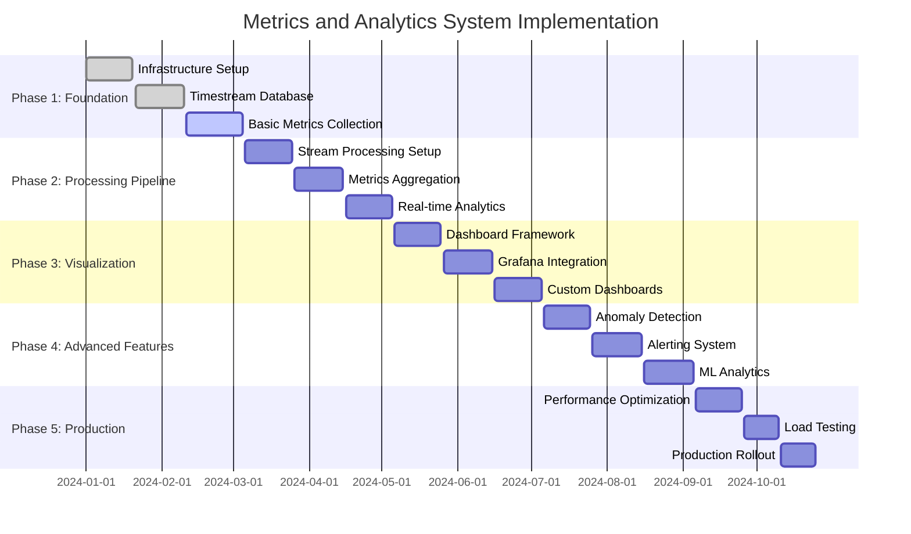

### 11.2 Technology Decisions & Trade-offs

**Storage Technology:**
- **Timestream vs InfluxDB**: Timestream chosen for managed service benefits and AWS integration
- **Hot-Warm-Cold Architecture**: Balance performance and cost for different data access patterns
- **Compression Strategy**: Balance between storage costs and query performance
- **Retention Policies**: Automated lifecycle management for cost optimization

**Processing Architecture:**
- **Stream vs Batch Processing**: Hybrid approach for real-time and historical analytics
- **Lambda vs ECS**: Lambda for event-driven processing, ECS for long-running analytics
- **Aggregation Strategy**: Pre-computed aggregations for common dashboard queries
- **Windowing Strategy**: Multiple window sizes for different analytics use cases

**Analytics and ML:**
- **Real-time vs Batch ML**: Real-time for anomaly detection, batch for trend analysis
- **Model Selection**: Balance between accuracy and computational cost
- **Feature Engineering**: Automated feature extraction from time-series data
- **Feedback Loops**: Continuous model improvement based on user feedback

**Future Evolution Path:**
- **Advanced ML**: Deep learning models for complex pattern recognition
- **Edge Analytics**: Real-time analytics at edge locations
- **Multi-Cloud Support**: Support for hybrid and multi-cloud deployments
- **Automated Insights**: AI-powered insights and recommendations

**Technical Debt & Improvement Areas:**
- **High-Cardinality Metrics**: Better support for high-cardinality time series
- **Query Performance**: Advanced query optimization and materialized views
- **Data Governance**: Enhanced data lineage and governance capabilities
- **Cost Intelligence**: ML-based cost optimization and resource planning
