# Recommendation System Design Architecture

## 1. Executive Summary & Requirements

### System Overview
A comprehensive machine learning-powered recommendation system that provides personalized content, product, and service recommendations to users across various platforms. The system processes user behavior, content features, and contextual signals to generate real-time recommendations that improve user engagement and business metrics.

### Functional Requirements
- **User Profiling**: Build comprehensive user profiles from behavioral data
- **Content Analysis**: Extract features from items (products, content, services)
- **Real-time Recommendations**: Serve personalized recommendations with low latency
- **Batch Processing**: Process large-scale data for model training and updates
- **A/B Testing**: Support experimentation and recommendation algorithm testing
- **Multi-objective Optimization**: Balance relevance, diversity, and business goals
- **Cold Start Handling**: Recommendations for new users and items
- **Contextual Recommendations**: Consider time, location, device, and session context
- **Explanation Generation**: Provide reasoning for recommendation decisions
- **Feedback Integration**: Learn from user interactions and explicit feedback

### Non-Functional Requirements
- **Availability**: 99.99% uptime for recommendation serving
- **Latency**: <100ms for real-time recommendation requests
- **Throughput**: Handle 100K+ recommendation requests per second
- **Scalability**: Support 100M+ users and 10M+ items
- **Accuracy**: >20% improvement in user engagement metrics
- **Freshness**: Incorporate new user behavior within 1 hour

### Key Constraints
- Handle sparse user-item interaction data
- Balance between exploration and exploitation in recommendations
- Manage computational costs for real-time serving
- Ensure recommendation diversity and avoid filter bubbles
- Comply with privacy regulations and user consent

### Success Metrics
- 99.99% availability for recommendation API
- <50ms P95 recommendation response time
- >25% click-through rate improvement
- >15% conversion rate improvement
- >90% user satisfaction with recommendations

## 2. High-Level Architecture Overview

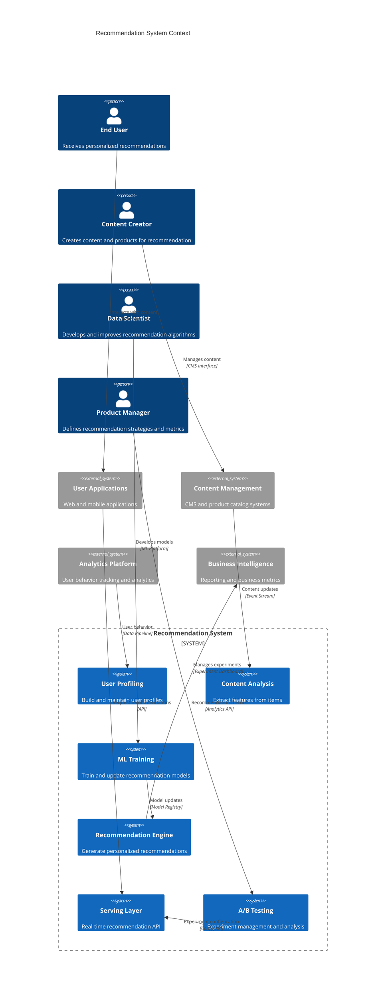

**Architectural Style Rationale**: Event-driven microservices with ML pipeline architecture chosen for:
- Independent scaling of different recommendation components
- Real-time and batch processing capabilities for different use cases
- Support for multiple recommendation algorithms and experimentation
- Integration with various data sources and user touchpoints
- Flexible deployment and model versioning capabilities

## 3. Detailed System Architecture

### 3.1 AWS Service Stack Selection

**Machine Learning:**
- **SageMaker**: End-to-end ML platform for model development and deployment
- **SageMaker Feature Store**: Centralized feature store for ML features
- **SageMaker Pipelines**: ML workflow orchestration and automation
- **SageMaker Endpoints**: Real-time model serving infrastructure

**Data Processing:**
- **EMR**: Large-scale data processing for feature engineering
- **Glue**: ETL jobs for data transformation and preparation
- **Kinesis Analytics**: Real-time stream processing for user events
- **Lambda**: Serverless functions for event processing

**Data Storage:**
- **S3**: Data lake for raw data, features, and model artifacts
- **DynamoDB**: Real-time user profiles and recommendation cache
- **Aurora**: User interactions, feedback, and experiment data
- **ElastiCache Redis**: High-speed caching for recommendations

**Real-time Serving:**
- **API Gateway**: Recommendation API management and routing
- **ECS Fargate**: Containerized recommendation services
- **Application Load Balancer**: Load balancing for recommendation endpoints
- **CloudFront**: CDN for static recommendation content

**Analytics:**
- **Kinesis Data Streams**: Real-time user behavior streaming
- **Athena**: SQL queries on recommendation data
- **QuickSight**: Business intelligence dashboards
- **CloudWatch**: System monitoring and custom metrics

**Experimentation:**
- **Lambda**: A/B testing logic and experiment management
- **DynamoDB**: Experiment configurations and results
- **EventBridge**: Event routing for experiment triggers

### 3.2 Component Architecture Diagram

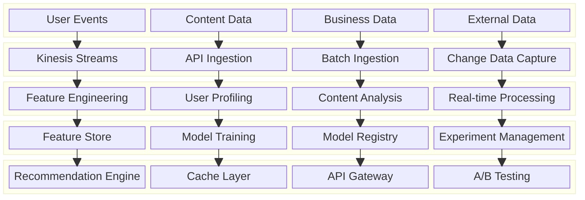

## 4. Data Architecture & Flow

### 4.1 Data Flow Diagrams

#### Real-time Recommendation Serving Flow
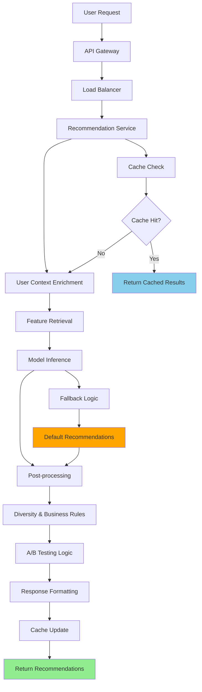

#### Batch Model Training Pipeline
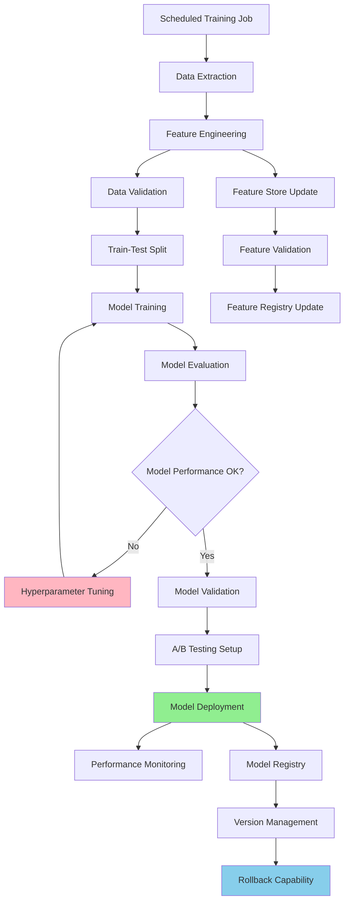

#### User Behavior Processing Flow
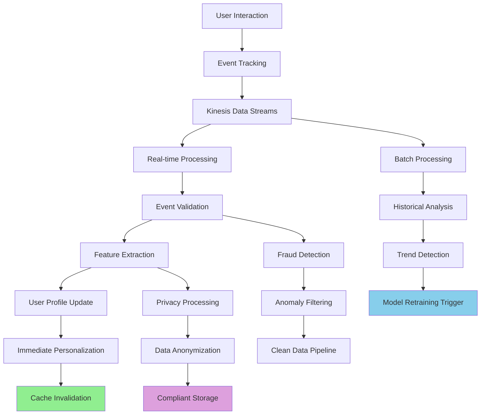

### 4.2 Database Design

#### User Profile and Behavior Schema
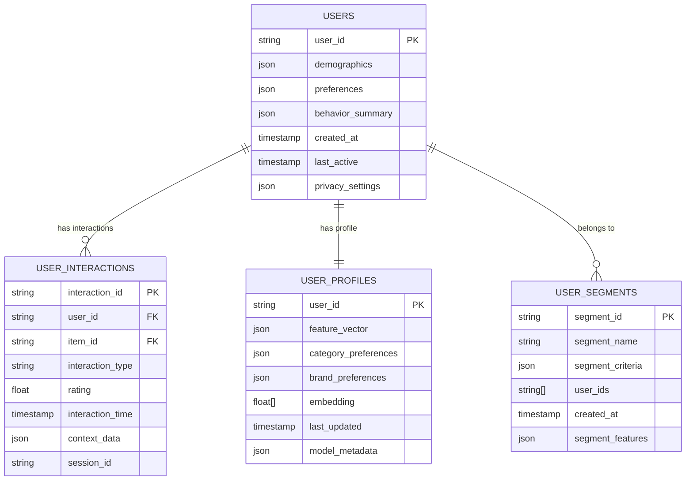

#### Item Catalog and Features Schema
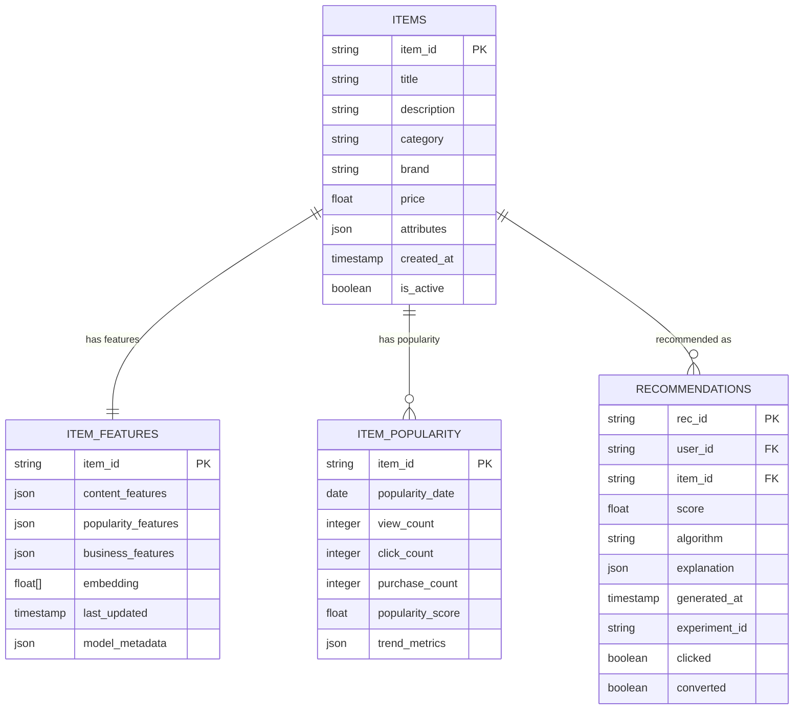

## 5. Detailed Component Design

### 5.1 Recommendation Engine

**Purpose & Responsibilities:**
- Generate personalized recommendations using multiple algorithms
- Combine collaborative filtering, content-based, and hybrid approaches
- Handle real-time inference with low latency requirements
- Implement business rules and diversity constraints
- Support multiple recommendation scenarios (homepage, product page, search)

**Algorithm Portfolio:**
- **Collaborative Filtering**: User-based and item-based collaborative filtering
- **Content-Based Filtering**: Item features and user preference matching
- **Matrix Factorization**: Deep learning embeddings for users and items
- **Deep Learning**: Neural collaborative filtering and autoencoders
- **Contextual Bandits**: Multi-armed bandit algorithms for exploration

**Model Serving:**
- **Real-time Inference**: Sub-100ms model inference for API requests
- **Batch Scoring**: Pre-computed recommendations for popular scenarios
- **Ensemble Methods**: Combine multiple models for better performance
- **Online Learning**: Continuous model updates from user feedback

### 5.2 Feature Engineering Service

**Purpose & Responsibilities:**
- Extract and transform raw data into ML-ready features
- Maintain feature consistency between training and serving
- Handle feature versioning and schema evolution
- Implement feature monitoring and quality checks
- Support both batch and real-time feature computation

**Feature Categories:**
- **User Features**: Demographics, behavior patterns, preferences
- **Item Features**: Content attributes, popularity metrics, business data
- **Contextual Features**: Time, location, device, session information
- **Interaction Features**: Historical interactions and derived metrics
- **Cross Features**: User-item interaction patterns and similarities

### 5.3 Experimentation Platform

**Purpose & Responsibilities:**
- Manage A/B testing for recommendation algorithms
- Implement statistical testing and significance analysis
- Support multi-variate testing and holdout groups
- Provide experiment monitoring and alerting
- Enable gradual rollout and automatic rollback

**Experiment Types:**
- **Algorithm Testing**: Compare different recommendation algorithms
- **Parameter Tuning**: Test different model parameters and configurations
- **UI/UX Testing**: Test different presentation formats and layouts
- **Business Logic**: Test different business rules and constraints
- **Personalization**: Test different levels of personalization

### Critical User Journey Sequence Diagrams

#### Real-time Recommendation Request
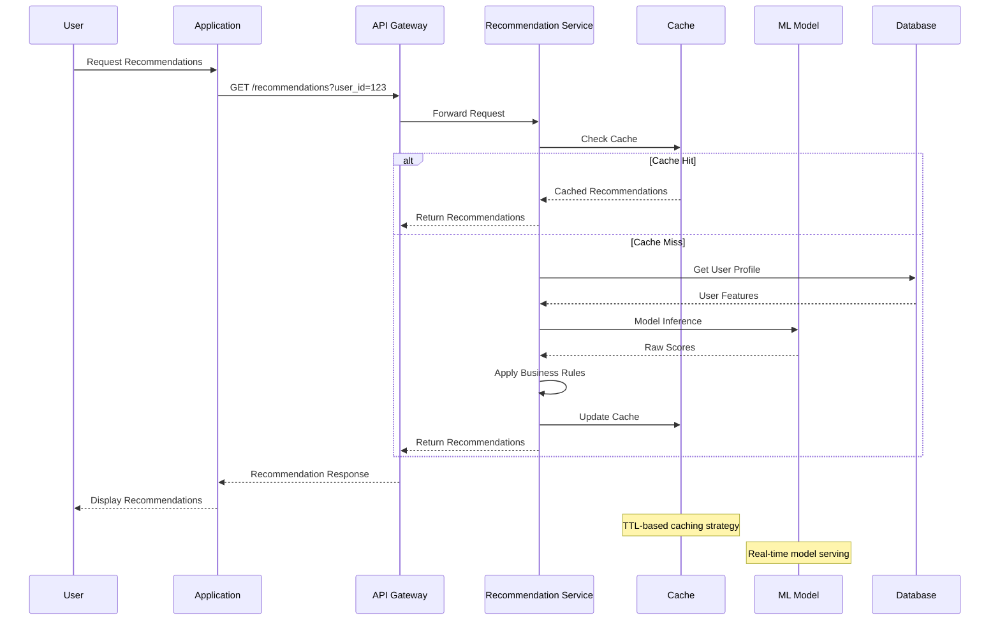

#### Model Training and Deployment
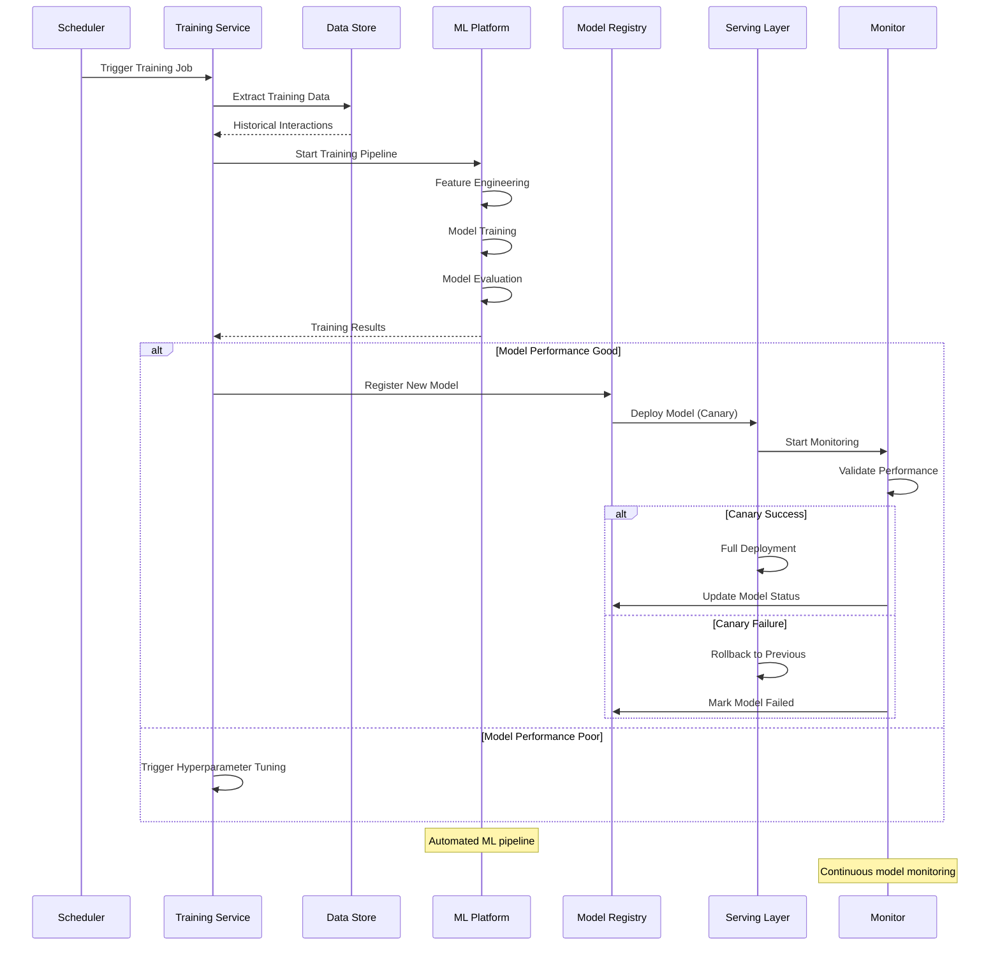

#### User Feedback Processing
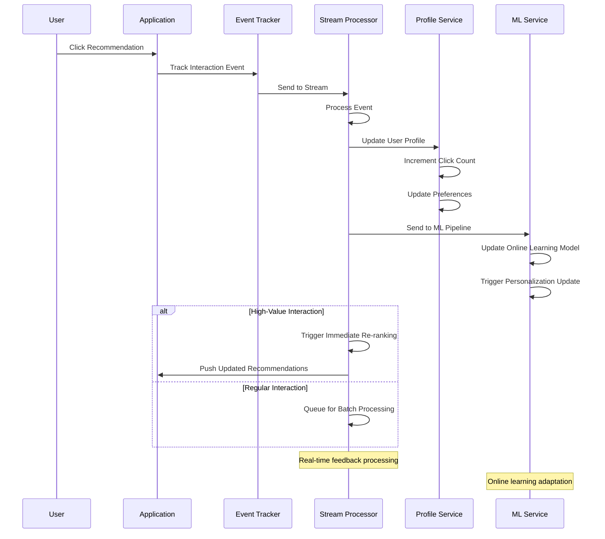

## 6. Scalability & Performance

### 6.1 Scaling Architecture

```mermaid
flowchart TD
    subgraph "Data Processing Scaling"
        A[User Growth] --> B[Kinesis Shard Scaling]
        B --> C[EMR Cluster Scaling]
        C --> D[Parallel Processing]
    end
    
    subgraph "Model Serving Scaling"
        E[Request Volume] --> F[Auto Scaling Groups]
        F --> G[Load Balancing]
        G --> H[Container Scaling]
    end
    
    subgraph "Storage Scaling"
        I[Data Growth] --> J[S3 Partitioning]
        J --> K[DynamoDB Scaling]
        K --> L[Feature Store Scaling]
    end
    
    subgraph "ML Pipeline Scaling"
        M[Model Complexity] --> N[SageMaker Scaling]
        N --> O[Distributed Training]
        O --> P[Model Parallelism]
    end
    
    style D fill:#87CEEB
    style H fill:#90EE90
    style L fill:#FFB6C1
    style P fill:#DDA0DD
```

### 6.2 Performance Optimization

**Serving Performance:**
- **Model Optimization**: Model quantization and pruning for faster inference
- **Caching Strategy**: Multi-level caching for recommendations and features
- **Batch Inference**: Pre-compute recommendations for common scenarios
- **Feature Caching**: Cache frequently accessed user and item features

**Training Performance:**
- **Distributed Training**: Multi-GPU and multi-node training for large models
- **Data Parallelism**: Parallel data loading and preprocessing
- **Model Checkpointing**: Efficient model saving and loading
- **Hyperparameter Optimization**: Automated hyperparameter tuning

**Data Processing Performance:**
- **Stream Processing**: Real-time processing for immediate personalization
- **Batch Optimization**: Efficient batch processing for large datasets
- **Feature Engineering**: Optimized feature computation and storage
- **Data Partitioning**: Intelligent data partitioning for parallel processing

## 7. Reliability & Fault Tolerance

### 7.1 High Availability Design

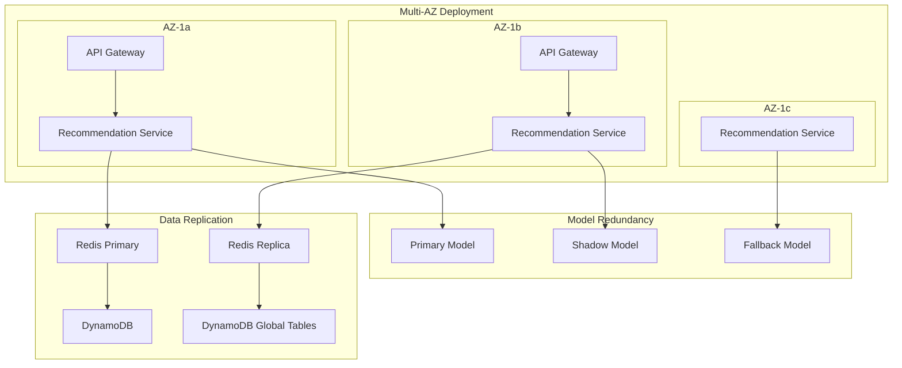

**Fault Tolerance Mechanisms:**
- **Model Fallbacks**: Multiple model versions for graceful degradation
- **Circuit Breakers**: Prevent cascade failures in recommendation pipeline
- **Graceful Degradation**: Serve popular recommendations when personalization fails
- **Data Replication**: Multi-region data replication for disaster recovery

### 7.2 Disaster Recovery

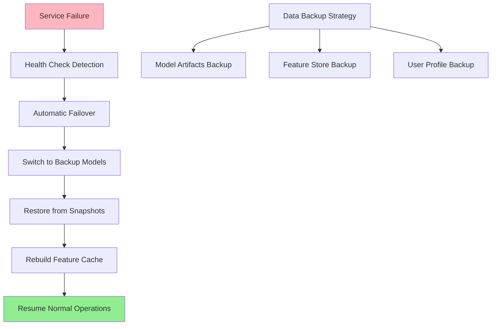

**RTO/RPO Targets:**
- **RTO**: 2 minutes for recommendation serving, 1 hour for full ML pipeline
- **RPO**: 5 minutes for user interactions, 1 hour for model training data
- **Model Recovery**: Automated model rollback within 30 seconds
- **Data Recovery**: Point-in-time recovery for critical user data

## 8. Security Architecture

### 8.1 Security Layers

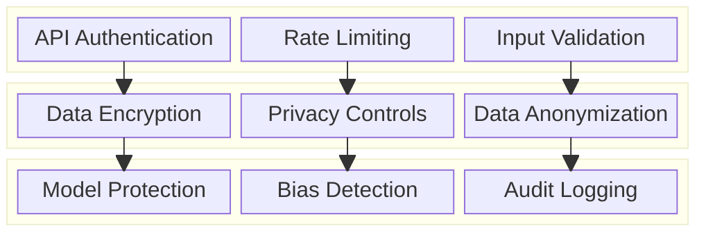

**Security Features:**
- **API Security**: Authentication, authorization, and rate limiting
- **Data Privacy**: User consent management and data anonymization
- **Model Security**: Protection against model extraction and adversarial attacks
- **Bias Detection**: Monitoring for algorithmic bias and fairness

**Privacy Compliance:**
- **GDPR Compliance**: Right to be forgotten and data portability
- **User Consent**: Granular consent management for personalization
- **Data Minimization**: Collect and process only necessary data
- **Transparency**: Explainable recommendations and data usage

### 8.2 Privacy and Ethics Flow

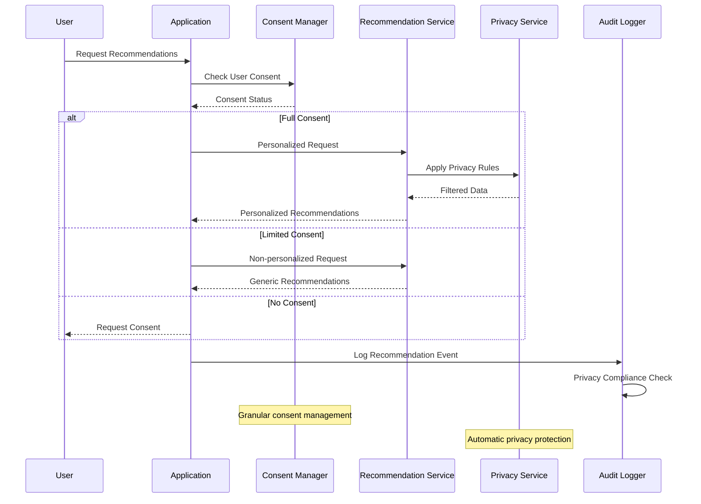

## 9. Monitoring & Observability

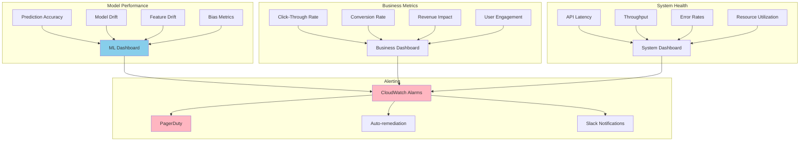

**Key Performance Indicators:**
- **Model Performance**: Accuracy, precision, recall, AUC, model drift
- **Business Impact**: CTR, conversion rate, revenue per user, engagement
- **System Performance**: API latency, throughput, availability, error rates
- **User Experience**: Recommendation diversity, freshness, satisfaction

**Alerting Strategy:**
- **Critical**: Model performance degradation, system outages, data pipeline failures
- **Warning**: High API latency, low recommendation quality, feature drift
- **Info**: A/B test results, capacity planning alerts, model training completion

## 10. Cost Optimization

**Service-Level Cost Analysis:**
- **SageMaker**: $15,000/month (Model training and serving infrastructure)
- **EMR**: $8,000/month (Large-scale data processing for features)
- **DynamoDB**: $5,000/month (User profiles and recommendation cache)
- **S3**: $3,000/month (Data lake for training data and model artifacts)
- **ECS Fargate**: $6,000/month (Recommendation serving containers)
- **Kinesis**: $2,000/month (Real-time user behavior streaming)
- **ElastiCache**: $3,000/month (High-performance recommendation caching)
- **Other Services**: $3,000/month (API Gateway, Lambda, monitoring)
- **Total Estimated**: ~$45,000/month for 100M users

**Cost Optimization Strategies:**
- **Spot Instances**: 60% cost reduction for batch training workloads
- **Reserved Instances**: 40% savings on predictable inference workloads
- **Model Optimization**: Reduce model size and complexity for cost-effective serving
- **Caching Strategy**: Intelligent caching to reduce inference costs
- **Feature Engineering**: Optimize feature computation and storage costs

**Cost Monitoring:**
- **Per-User Costing**: Track recommendation costs per user segment
- **Model ROI Analysis**: Measure return on investment for different models
- **Resource Optimization**: Monitor and optimize underutilized resources
- **A/B Test Cost Analysis**: Measure cost-effectiveness of different algorithms

## 11. Implementation Strategy

### 11.1 Migration/Deployment Plan

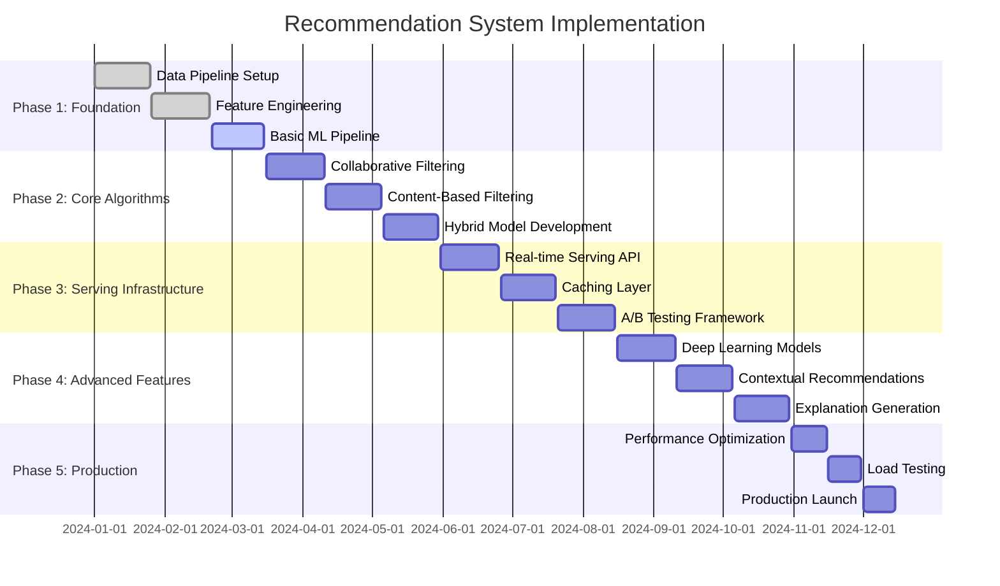

### 11.2 Technology Decisions & Trade-offs

**Algorithm Selection:**
- **Collaborative vs Content-Based**: Hybrid approach for comprehensive coverage
- **Matrix Factorization vs Deep Learning**: Progressive enhancement from simple to complex
- **Implicit vs Explicit Feedback**: Focus on implicit feedback for scalability
- **Online vs Offline Learning**: Hybrid approach for real-time adaptation

**Infrastructure Choices:**
- **SageMaker vs Custom ML**: SageMaker for managed ML operations
- **Real-time vs Batch Serving**: Hybrid approach for different use cases
- **Microservices vs Monolith**: Microservices for independent scaling
- **Cloud vs On-premise**: Cloud-first for scalability and managed services

**Data Strategy:**
- **Data Lake vs Data Warehouse**: Data lake for flexibility and ML workloads
- **Batch vs Stream Processing**: Both for comprehensive data processing
- **Feature Store**: Centralized feature management for consistency
- **Data Versioning**: Track data and model versions for reproducibility

**Future Evolution Path:**
- **Advanced AI**: Large language models for content understanding
- **Real-time Personalization**: Sub-second personalization updates
- **Federated Learning**: Privacy-preserving collaborative learning
- **Multi-modal Recommendations**: Text, image, and video content integration

**Technical Debt & Improvement Areas:**
- **Cold Start Problem**: Better handling of new users and items
- **Explainability**: Enhanced explanation generation for recommendations
- **Fairness**: Advanced bias detection and mitigation techniques
- **Scalability**: Support for billions of users and items with consistent performance
