# Payment System Design Architecture

## 1. Executive Summary & Requirements

### System Overview
A comprehensive payment processing system that handles secure financial transactions across multiple payment methods, currencies, and regulatory environments. The system supports real-time payment processing, fraud detection, compliance management, and multi-party settlements with high availability and strong consistency guarantees.

### Functional Requirements
- **Payment Processing**: Process various payment methods (credit cards, digital wallets, bank transfers)
- **Multi-currency Support**: Handle payments in multiple currencies with real-time exchange rates
- **Fraud Detection**: Real-time fraud screening and risk assessment
- **Compliance Management**: PCI DSS, AML, KYC, and regional regulatory compliance
- **Settlement Processing**: Multi-party settlements with configurable timing
- **Refunds & Chargebacks**: Handle payment reversals and dispute management
- **Recurring Payments**: Support subscription and scheduled payment processing
- **Payment Analytics**: Real-time reporting and business intelligence
- **Wallet Management**: Digital wallet creation and balance management
- **API Integration**: RESTful APIs for merchant and partner integration

### Non-Functional Requirements
- **Availability**: 99.99% uptime for payment processing
- **Latency**: <200ms for payment authorization, <2 seconds for processing
- **Throughput**: Handle 100K+ transactions per second at peak
- **Consistency**: Strong consistency for financial transactions
- **Security**: PCI DSS Level 1 compliance and end-to-end encryption
- **Durability**: 99.999999999% transaction data durability

### Key Constraints
- Strict regulatory compliance across multiple jurisdictions
- Zero tolerance for financial data loss or corruption
- Real-time fraud detection without impacting user experience
- Support for legacy payment systems and modern payment methods
- Handle seasonal traffic spikes (Black Friday, holiday shopping)

### Success Metrics
- 99.99% payment processing availability
- <0.1% false positive rate for fraud detection
- >99% successful payment completion rate
- <1 second average payment processing time
- 100% PCI DSS compliance audit success

## 2. High-Level Architecture Overview

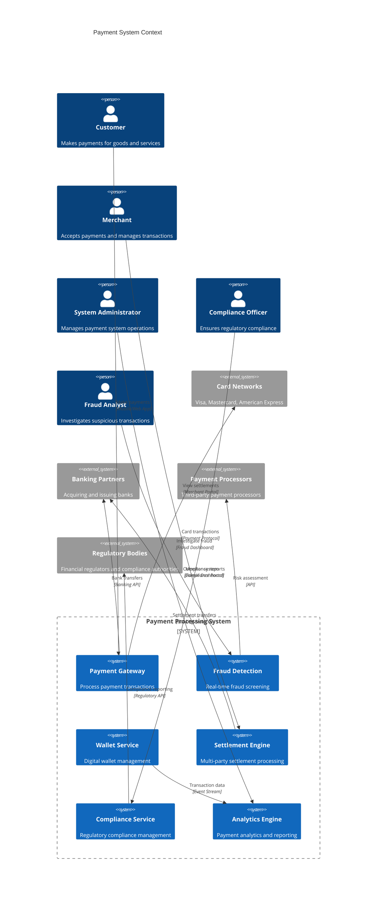

**Architectural Style Rationale**: Event-driven microservices with strong consistency chosen for:
- Independent scaling of different payment functions (processing, fraud, settlement)
- Strong consistency requirements for financial transactions
- Real-time processing capabilities for fraud detection and authorization
- Regulatory compliance through service isolation and audit trails
- Integration with multiple external payment systems and partners

## 3. Detailed System Architecture

### 3.1 AWS Service Stack Selection

**Core Payment Services:**
- **ECS Fargate**: Containerized payment processing services
- **Lambda**: Serverless functions for event processing
- **API Gateway**: Secure API management for payment endpoints
- **Application Load Balancer**: High-availability load balancing

**Data Storage:**
- **Aurora PostgreSQL**: ACID-compliant transaction storage
- **DynamoDB**: High-performance session and wallet data
- **ElastiCache Redis**: Real-time caching and session management
- **S3**: Secure document storage and audit logs

**Security & Compliance:**
- **KMS**: Encryption key management for sensitive data
- **Secrets Manager**: Secure storage of API keys and credentials
- **WAF**: Web application firewall for API protection
- **CloudHSM**: Hardware security modules for cryptographic operations

**Event Processing:**
- **Kinesis Data Streams**: Real-time transaction event streaming
- **SQS**: Reliable message queuing for settlement processing
- **SNS**: Event notifications and alerts
- **EventBridge**: Event routing for compliance and reporting

**Analytics & ML:**
- **SageMaker**: Machine learning for fraud detection
- **Kinesis Analytics**: Real-time fraud analysis
- **Athena**: SQL queries on transaction data
- **QuickSight**: Business intelligence dashboards

**Monitoring & Compliance:**
- **CloudWatch**: Comprehensive monitoring and alerting
- **CloudTrail**: API audit logging for compliance
- **Config**: Compliance monitoring and configuration management
- **X-Ray**: Distributed tracing for payment flows

### 3.2 Component Architecture Diagram

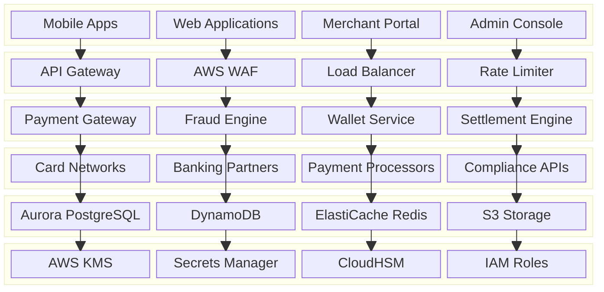

## 4. Data Architecture & Flow

### 4.1 Data Flow Diagrams

#### Credit Card Payment Processing Flow
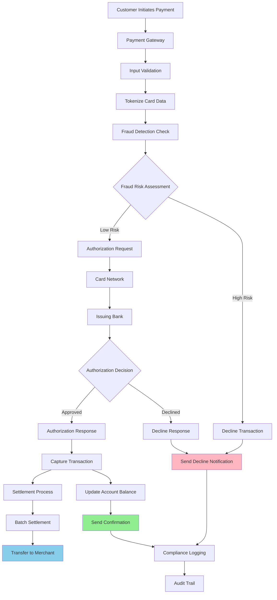

#### Digital Wallet Transaction Flow
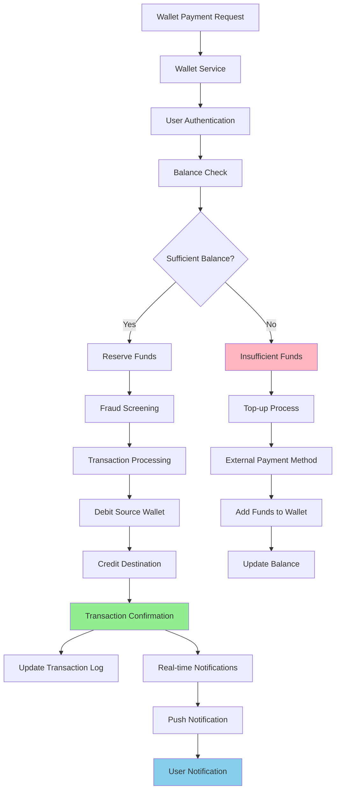

#### Fraud Detection and Risk Assessment Flow
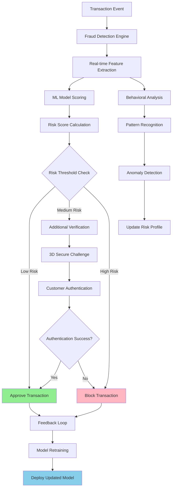

### 4.2 Database Design

#### Transaction and Payment Schema
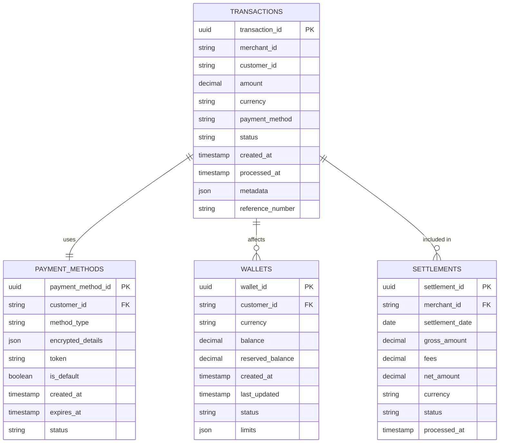

#### Fraud Detection and Compliance Schema
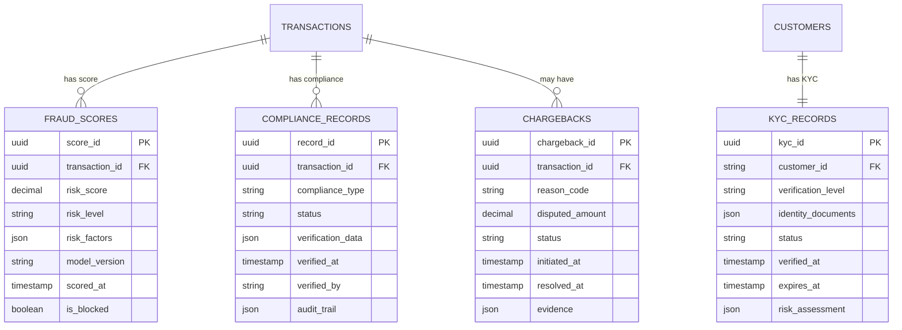

## 5. Detailed Component Design

### 5.1 Payment Gateway Service

**Purpose & Responsibilities:**
- Process payment transactions across multiple payment methods
- Handle payment method tokenization and secure data storage
- Manage payment authorization and capture flows
- Support recurring payments and subscription billing
- Integrate with multiple payment processors and card networks

**Payment Method Support:**
- **Credit/Debit Cards**: Visa, Mastercard, American Express, Discover
- **Digital Wallets**: Apple Pay, Google Pay, PayPal, Amazon Pay
- **Bank Transfers**: ACH, SEPA, wire transfers, open banking
- **Alternative Payments**: Buy now pay later, cryptocurrency, gift cards
- **Regional Methods**: Alipay, WeChat Pay, UPI, PIX

**Security Features:**
- **PCI DSS Compliance**: Level 1 compliance for card data handling
- **Tokenization**: Replace sensitive data with secure tokens
- **Encryption**: End-to-end encryption for all payment data
- **3D Secure**: Strong customer authentication for online payments

### 5.2 Fraud Detection Engine

**Purpose & Responsibilities:**
- Real-time fraud screening for all payment transactions
- Machine learning-based risk assessment and scoring
- Behavioral analysis and anomaly detection
- Integration with external fraud prevention services
- Continuous model improvement through feedback loops

**Fraud Detection Techniques:**
- **Machine Learning Models**: Random Forest, Neural Networks, XGBoost
- **Rule-based Screening**: Configurable business rules and thresholds
- **Behavioral Analysis**: User behavior patterns and anomaly detection
- **Device Fingerprinting**: Device identification and risk assessment
- **Velocity Checks**: Transaction frequency and amount limits

**Risk Assessment Factors:**
- **Transaction Attributes**: Amount, currency, merchant category, time
- **User Behavior**: Historical patterns, account age, device usage
- **Geographic Signals**: Location, IP address, shipping address
- **Network Analysis**: Connection patterns and graph-based analysis

### 5.3 Settlement Engine

**Purpose & Responsibilities:**
- Process multi-party settlements between merchants, platforms, and partners
- Handle currency conversion and cross-border settlements
- Manage settlement schedules and payment timing
- Calculate fees, taxes, and revenue sharing
- Generate settlement reports and reconciliation data

**Settlement Types:**
- **Standard Settlement**: Daily or weekly merchant settlements
- **Instant Settlement**: Real-time settlement for premium merchants
- **Split Payments**: Multi-party settlements with configurable splits
- **Marketplace Settlements**: Platform fee deduction and merchant payouts
- **Cross-border Settlements**: International payments with currency conversion

### Critical User Journey Sequence Diagrams

#### Complete Payment Transaction Flow
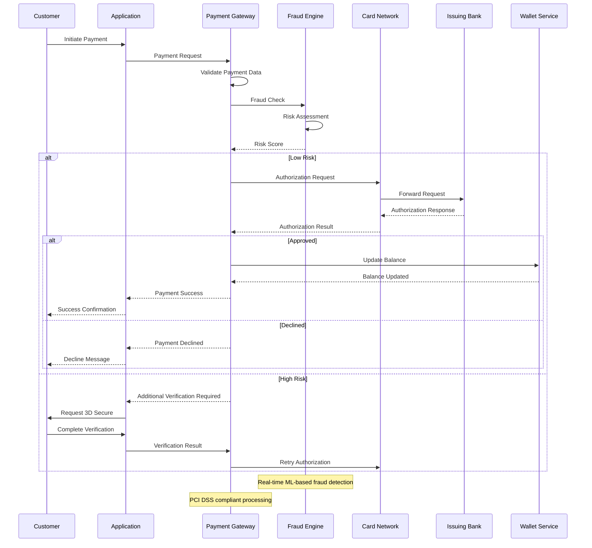

#### Chargeback and Dispute Handling
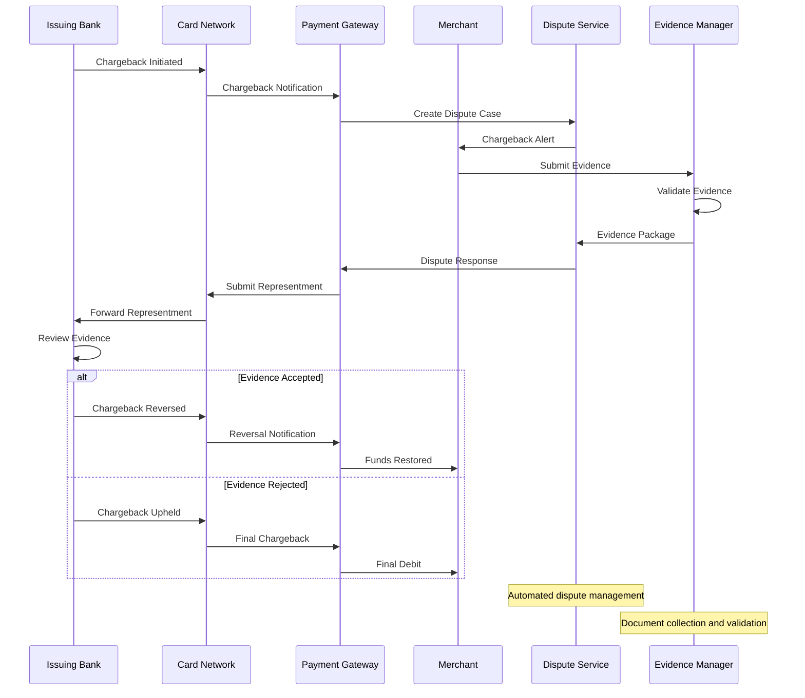

#### Multi-party Settlement Processing
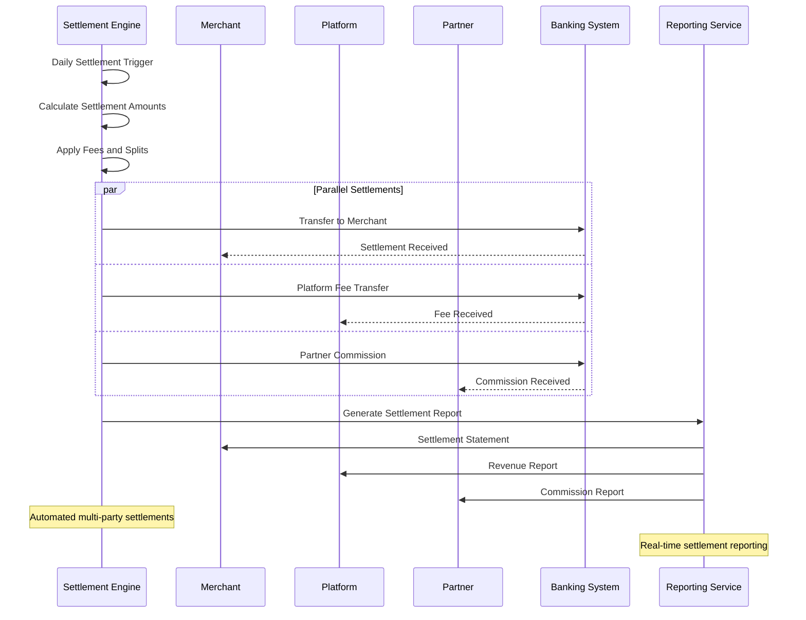

## 6. Scalability & Performance

### 6.1 Scaling Architecture

```mermaid
flowchart TD
    subgraph "Transaction Processing Scaling"
        A[Transaction Volume Growth] --> B[Horizontal Service Scaling]
        B --> C[Database Read Replicas]
        C --> D[Caching Layer Expansion]
    end
    
    subgraph "Geographic Scaling"
        E[Global Expansion] --> F[Multi-Region Deployment]
        F --> G[Regional Payment Processors]
        G --> H[Local Currency Support]
    end
    
    subgraph "Performance Optimization"
        I[Response Time Requirements] --> J[Connection Pooling]
        J --> K[Async Processing]
        K --> L[Event-Driven Architecture]
    end
    
    subgraph "Fraud Detection Scaling"
        M[Fraud Model Complexity] --> N[ML Pipeline Scaling]
        N --> O[Real-time Feature Store]
        O --> P[Model Serving Optimization]
    end
    
    style D fill:#87CEEB
    style H fill:#90EE90
    style L fill:#FFB6C1
    style P fill:#DDA0DD
```

### 6.2 Performance Optimization

**Transaction Processing Performance:**
- **Connection Pooling**: Efficient database connections for high throughput
- **Async Processing**: Non-blocking operations for payment flows
- **Caching Strategy**: Multi-layer caching for payment methods and user data
- **Database Optimization**: Query optimization and proper indexing

**Fraud Detection Performance:**
- **Real-time Scoring**: Sub-100ms fraud scoring for payment authorization
- **Feature Caching**: Cache frequently accessed fraud features
- **Model Optimization**: Optimized ML models for low-latency inference
- **Batch Processing**: Offline model training and feature engineering

**API Performance:**
- **Rate Limiting**: Intelligent rate limiting to prevent abuse
- **Response Compression**: Compress API responses to reduce bandwidth
- **CDN Integration**: Cache static content and API responses
- **Load Balancing**: Distribute traffic across multiple service instances

## 7. Reliability & Fault Tolerance

### 7.1 High Availability Design

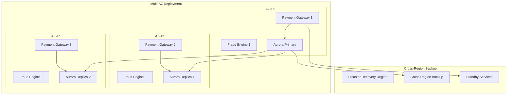

**Fault Tolerance Mechanisms:**
- **Circuit Breakers**: Prevent cascade failures between payment services
- **Graceful Degradation**: Maintain core payment functionality during outages
- **Retry Logic**: Intelligent retry mechanisms with exponential backoff
- **Bulkhead Pattern**: Isolate critical payment resources

### 7.2 Disaster Recovery

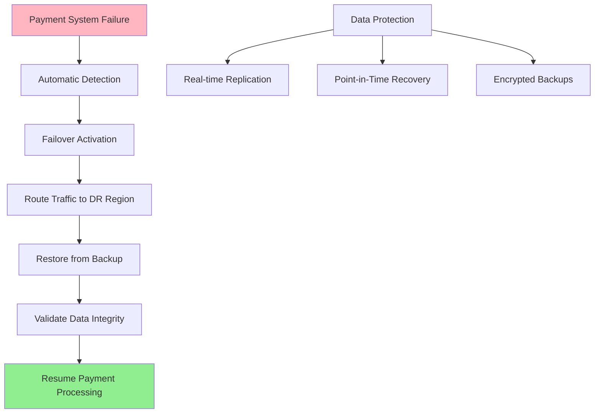

**RTO/RPO Targets:**
- **RTO**: 5 minutes for payment processing, 15 minutes for full system recovery
- **RPO**: Near-zero for financial transactions with synchronous replication
- **Data Durability**: 99.999999999% with cross-region replication
- **Compliance Recovery**: Maintain audit trails during disaster recovery

## 8. Security Architecture

### 8.1 Security Layers

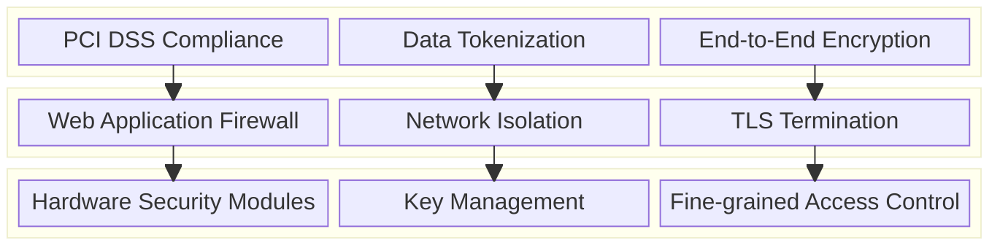

**Security Features:**
- **PCI DSS Level 1 Compliance**: Highest level of payment card security
- **End-to-End Encryption**: All payment data encrypted in transit and at rest
- **Tokenization**: Replace sensitive data with non-sensitive tokens
- **Multi-Factor Authentication**: Enhanced security for admin access

**Fraud Prevention:**
- **Real-time Monitoring**: Continuous monitoring for suspicious activities
- **Machine Learning**: AI-powered fraud detection and prevention
- **Device Fingerprinting**: Unique device identification and risk assessment
- **Behavioral Analysis**: User behavior analysis for anomaly detection

### 8.2 Payment Security Flow

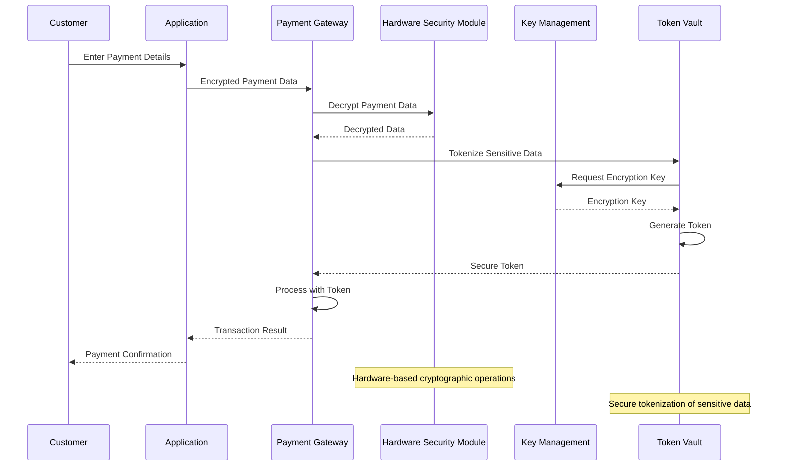

## 9. Monitoring & Observability

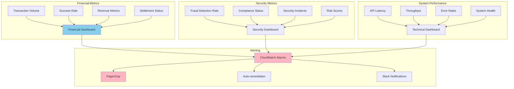

**Key Performance Indicators:**
- **Financial**: Transaction volume, success rates, revenue, settlement times
- **Security**: Fraud detection accuracy, compliance status, security incidents
- **Performance**: API latency, throughput, error rates, system availability
- **Business**: Customer satisfaction, merchant onboarding, payment method adoption

**Alerting Strategy:**
- **Critical**: Payment processing failures, security breaches, compliance violations
- **Warning**: High fraud rates, performance degradation, settlement delays
- **Info**: Traffic spikes, new merchant onboarding, system maintenance

## 10. Cost Optimization

**Service-Level Cost Analysis:**
- **ECS Fargate**: $15,000/month (Payment processing services, high-availability)
- **Aurora PostgreSQL**: $8,000/month (Transaction database with read replicas)
- **DynamoDB**: $6,000/month (Session data and wallet balances)
- **SageMaker**: $5,000/month (Fraud detection ML models)
- **KMS + CloudHSM**: $4,000/month (Encryption and key management)
- **ElastiCache**: $3,000/month (High-performance caching)
- **Data Transfer**: $3,000/month (Cross-region and external API calls)
- **Other Services**: $4,000/month (API Gateway, Lambda, monitoring)
- **Total Estimated**: ~$48,000/month for 100K transactions/day

**Cost Optimization Strategies:**
- **Reserved Instances**: 40% savings on predictable compute workloads
- **Spot Instances**: 60% cost reduction for batch fraud model training
- **Data Lifecycle Management**: Archive old transaction data to cheaper storage
- **API Optimization**: Reduce external API calls through intelligent caching
- **Resource Right-sizing**: Optimize instance types based on workload patterns

**Revenue Model:**
- **Transaction Fees**: 2.9% + $0.30 per transaction
- **Monthly Fees**: $29/month for basic merchant accounts
- **Premium Features**: Additional fees for advanced fraud protection
- **International Fees**: 3.9% for cross-border transactions
- **Chargeback Fees**: $15 per chargeback handling

## 11. Implementation Strategy

### 11.1 Migration/Deployment Plan

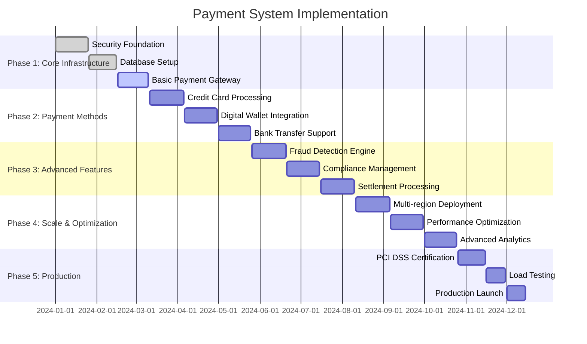

### 11.2 Technology Decisions & Trade-offs

**Database Strategy:**
- **Aurora vs DynamoDB**: Aurora for ACID transactions, DynamoDB for high-performance reads
- **Synchronous vs Asynchronous Replication**: Synchronous for financial data integrity
- **Sharding Strategy**: Partition by merchant ID and transaction date
- **Backup Strategy**: Continuous backup with point-in-time recovery

**Security Implementation:**
- **Tokenization vs Encryption**: Both approaches for defense in depth
- **HSM vs Software Encryption**: HSM for highest security requirements
- **PCI DSS Scope**: Minimize scope through tokenization and network segmentation
- **Key Management**: Centralized key management with automatic rotation

**Fraud Detection:**
- **Real-time vs Batch Processing**: Hybrid approach for comprehensive coverage
- **Rule-based vs ML**: Combination for accuracy and explainability
- **Model Selection**: Ensemble methods for improved accuracy
- **Feature Engineering**: Automated feature extraction from transaction data

**Future Evolution Path:**
- **Blockchain Integration**: Explore blockchain for settlement and transparency
- **Open Banking**: Integration with open banking APIs for account-to-account payments
- **Central Bank Digital Currencies**: Support for CBDC when available
- **Quantum-Resistant Cryptography**: Prepare for post-quantum security

**Technical Debt & Improvement Areas:**
- **Real-time Settlement**: Instant settlement capabilities for all payment methods
- **Advanced Fraud Detection**: Deep learning models for sophisticated fraud patterns
- **Global Compliance**: Automated compliance management for multiple jurisdictions
- **Customer Experience**: Seamless payment experience across all channels
