# Booking System (Airbnb-style) Design Architecture

## 1. Executive Summary & Requirements

### System Overview
A comprehensive vacation rental and accommodation booking platform that connects property owners (hosts) with travelers (guests), facilitating property listings, search and discovery, booking management, payment processing, and review systems. The platform supports millions of properties worldwide with real-time availability, dynamic pricing, and multi-party coordination.

### Functional Requirements
- **Property Management**: Host property listings with photos, descriptions, amenities, and availability
- **Search & Discovery**: Advanced search with filters, maps, and personalized recommendations
- **Booking Management**: Real-time availability checking, reservation processing, and modifications
- **Payment Processing**: Secure payments with split settlements between platform and hosts
- **User Management**: Host and guest profiles with identity verification and reviews
- **Communication**: Messaging system between hosts and guests
- **Calendar Management**: Real-time availability calendar with pricing rules
- **Review System**: Bidirectional reviews between hosts and guests
- **Dynamic Pricing**: AI-powered pricing recommendations for hosts
- **Multi-language Support**: Global platform with localization

### Non-Functional Requirements
- **Availability**: 99.99% uptime for booking and search operations
- **Latency**: <200ms for search results, <1 second for booking confirmation
- **Scale**: 10M+ properties, 100M+ users, 1M+ bookings per day
- **Consistency**: Strong consistency for booking availability and payments
- **Global Reach**: Support for 190+ countries with local regulations
- **Mobile Performance**: Optimized for mobile-first user experience

### Key Constraints
- Handle concurrent booking attempts for the same property
- Manage complex pricing rules and seasonal variations
- Support different property types (entire homes, private rooms, shared spaces)
- Comply with local regulations and tax requirements
- Handle currency conversion and international payments

### Success Metrics
- 99.99% availability during peak booking periods
- <2% booking abandonment rate due to technical issues
- >90% successful payment completion rate
- <5 seconds average property search response time
- Support 50+ languages and currencies

## 2. High-Level Architecture Overview

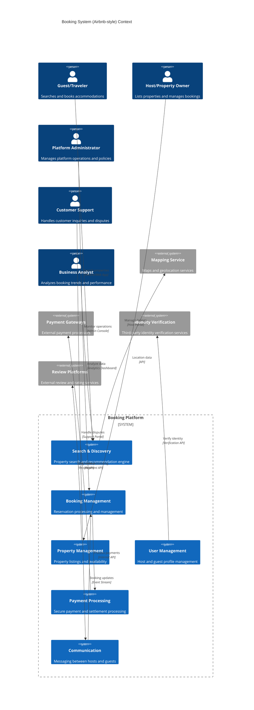

**Architectural Style Rationale**: Event-driven microservices architecture chosen for:
- Independent scaling of search, booking, and payment services
- Real-time event processing for availability updates and notifications
- Support for multiple property types and booking models
- Integration with various third-party services and payment providers
- Global deployment with regional data compliance

## 3. Detailed System Architecture

### 3.1 AWS Service Stack Selection

**Application Services:**
- **EKS**: Kubernetes orchestration for microservices
- **ECS Fargate**: Serverless containers for event processing
- **Lambda**: Serverless functions for real-time notifications
- **API Gateway**: API management with rate limiting and caching

**Search and Discovery:**
- **OpenSearch**: Property search with geospatial queries
- **Personalize**: AI-powered recommendation engine
- **SageMaker**: Machine learning for pricing and demand prediction
- **Kinesis Analytics**: Real-time analytics for search optimization

**Data Storage:**
- **Aurora PostgreSQL**: Transactional data for bookings and payments
- **DynamoDB**: High-performance property and user data
- **ElastiCache Redis**: Session management and real-time caching
- **S3**: Property images, documents, and data lakes

**Real-time Processing:**
- **Kinesis Data Streams**: Real-time booking and availability events
- **SQS**: Reliable message queuing for booking workflows
- **SNS**: Event notifications and alerts
- **EventBridge**: Event routing for booking state changes

**Global Infrastructure:**
- **CloudFront**: Global CDN for property images and static content
- **Route 53**: Global DNS with health checks and latency routing
- **Global Accelerator**: Network performance optimization
- **Multi-Region Deployment**: Regional data residency compliance

**Analytics:**
- **Athena**: SQL queries on booking and search data
- **QuickSight**: Business intelligence dashboards
- **EMR**: Large-scale data processing for analytics
- **Glue**: ETL jobs for data transformation

### 3.2 Component Architecture Diagram

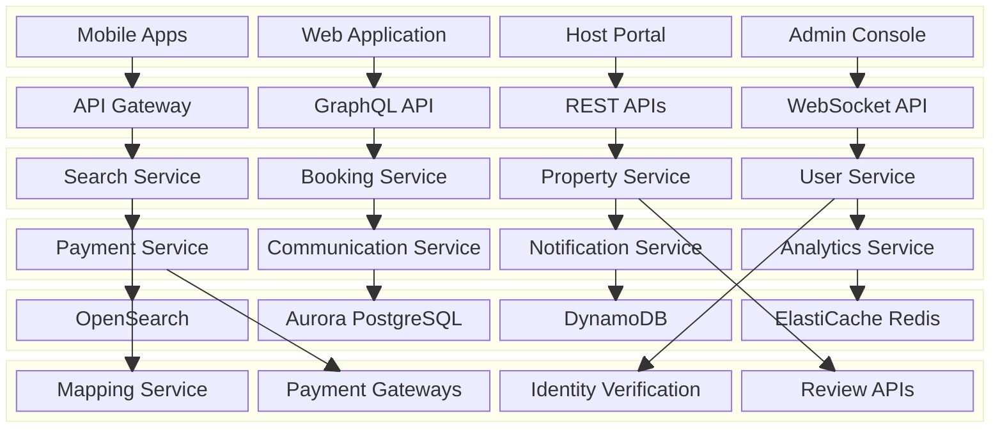

## 4. Data Architecture & Flow

### 4.1 Data Flow Diagrams

#### Property Search and Discovery Flow
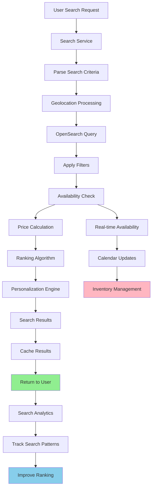

#### Booking Creation and Confirmation Flow
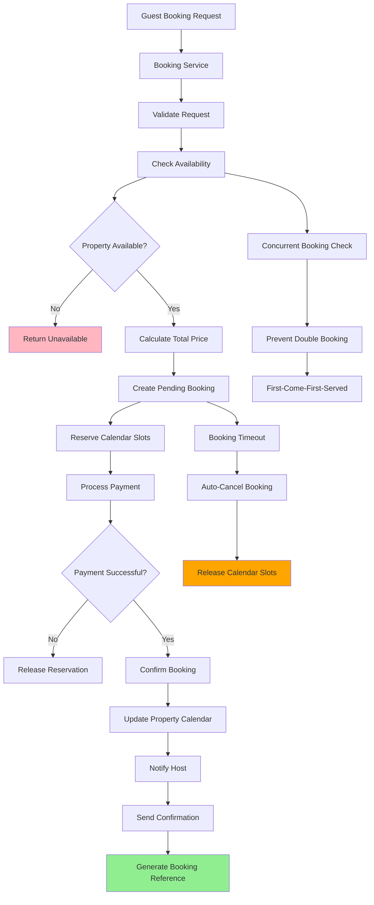

#### Dynamic Pricing and Revenue Optimization Flow
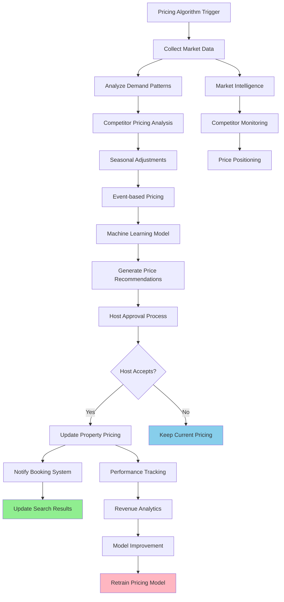

### 4.2 Database Design

#### Property and Booking Schema
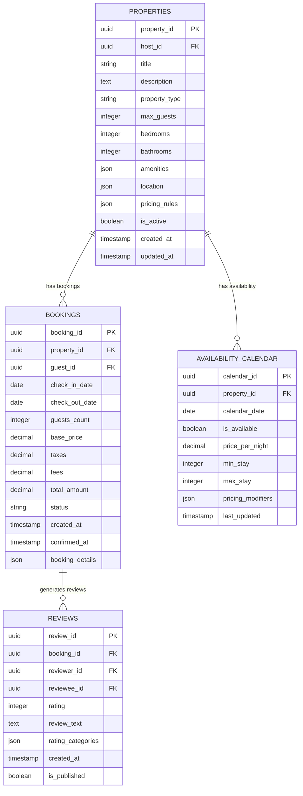

#### User Management and Communication Schema
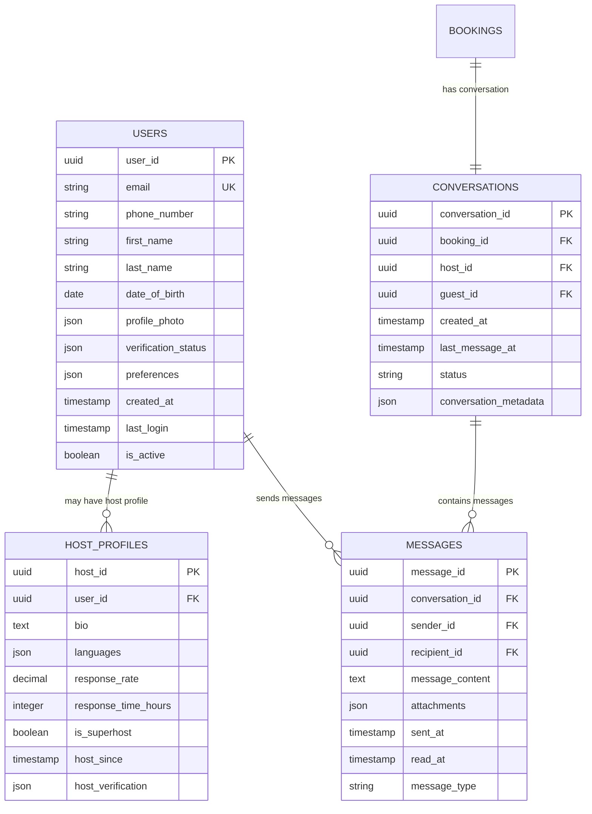

## 5. Detailed Component Design

### 5.1 Search and Discovery Service

**Purpose & Responsibilities:**
- Provide fast and relevant property search capabilities
- Handle complex queries with multiple filters and sorting options
- Implement geospatial search with map-based interfaces
- Generate personalized recommendations based on user behavior
- Support auto-complete and search suggestions

**Search Features:**
- **Geospatial Search**: Search by location, radius, and map boundaries
- **Advanced Filters**: Price range, property type, amenities, house rules
- **Faceted Search**: Dynamic filters based on search results
- **Personalization**: Tailored results based on user preferences and history
- **Multi-language Search**: Support for searches in multiple languages

**Performance Optimizations:**
- **Search Index Optimization**: Efficient indexing strategies for property data
- **Caching**: Cache popular searches and filter combinations
- **Auto-complete**: Real-time search suggestions and location auto-complete
- **Result Ranking**: Machine learning-based ranking for search relevance

### 5.2 Booking Management Service

**Purpose & Responsibilities:**
- Handle the complete booking lifecycle from request to completion
- Manage real-time availability checking and calendar updates
- Process booking modifications, cancellations, and refunds
- Coordinate with payment systems for secure transaction processing
- Handle booking conflicts and concurrent reservation attempts

**Booking Features:**
- **Real-time Availability**: Instant availability checking with calendar integration
- **Booking Workflows**: Multi-step booking process with payment integration
- **Instant Book**: Automated booking approval for qualified properties
- **Request to Book**: Host approval workflow for booking requests
- **Modification Handling**: Support for date changes and guest count updates

**Consistency Mechanisms:**
- **Distributed Locking**: Prevent double bookings through distributed locks
- **Event Sourcing**: Maintain complete booking history for audit and recovery
- **Saga Pattern**: Manage complex booking workflows across multiple services
- **Compensation**: Handle booking failures with automatic compensation

### 5.3 Property Management Service

**Purpose & Responsibilities:**
- Manage property listings, descriptions, and media content
- Handle property availability calendars and pricing rules
- Support multiple property types and listing configurations
- Integrate with external property management systems
- Provide analytics and performance insights for hosts

**Property Features:**
- **Rich Media Support**: High-quality photos, virtual tours, and videos
- **Dynamic Pricing**: AI-powered pricing recommendations and automation
- **Calendar Synchronization**: Sync with external calendar systems
- **Bulk Operations**: Bulk updates for property management companies
- **Performance Analytics**: Booking rates, revenue, and guest satisfaction metrics

### Critical User Journey Sequence Diagrams

#### Complete Booking Flow
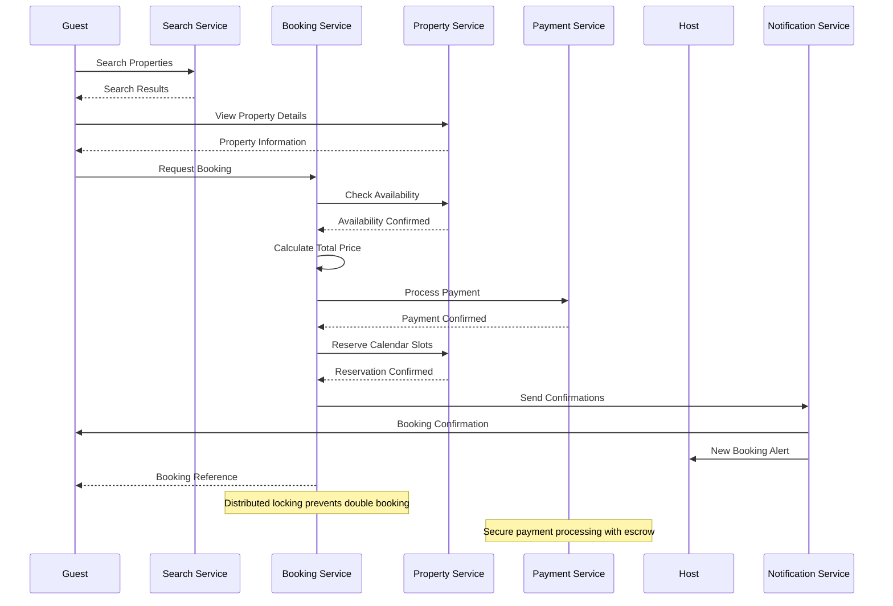

#### Host Property Management
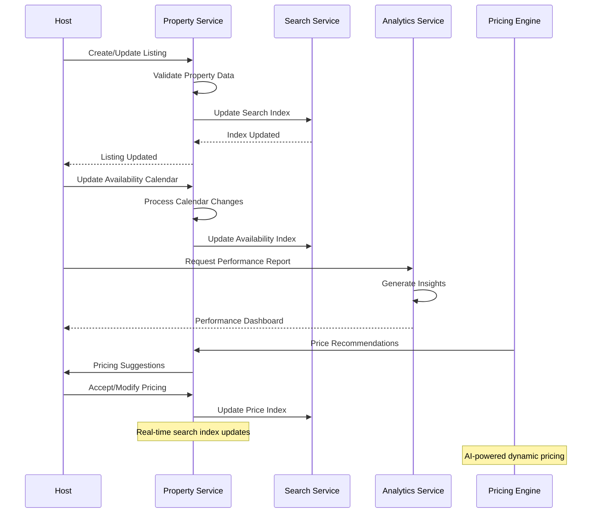

#### Booking Modification and Cancellation
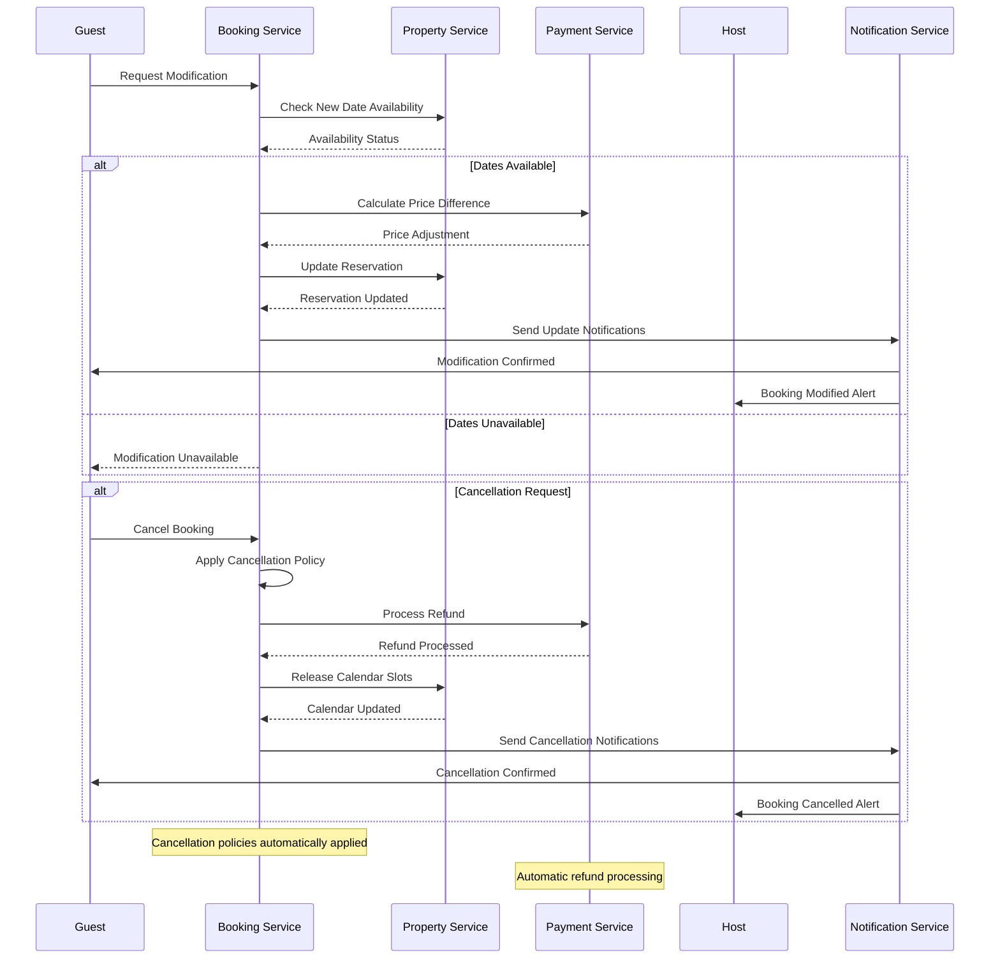

## 6. Scalability & Performance

### 6.1 Scaling Architecture

### 6.2 Performance Optimization

**Search Performance:**
- **Index Optimization**: Efficient indexing strategies for property search
- **Caching**: Multi-level caching for search results and filters
- **Query Optimization**: Optimize complex geospatial and filter queries
- **Auto-complete**: Fast type-ahead search with cached suggestions

**Booking Performance:**
- **Database Optimization**: Query optimization and proper indexing
- **Connection Pooling**: Efficient database connection management
- **Async Processing**: Non-blocking operations for booking workflows
- **Distributed Locking**: Efficient locking mechanisms for availability

**Global Performance:**
- **CDN Integration**: Global content delivery for images and static assets
- **Regional Deployment**: Deploy services closer to users
- **Data Locality**: Store data in regions closest to users
- **Network Optimization**: Optimize network paths and protocols

## 7. Reliability & Fault Tolerance

### 7.1 High Availability Design

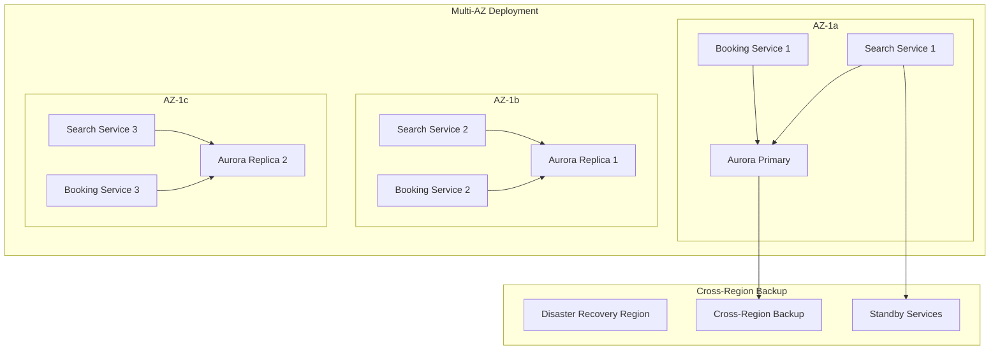

**Fault Tolerance Mechanisms:**
- **Circuit Breakers**: Prevent cascade failures between booking services
- **Graceful Degradation**: Maintain core functionality during partial outages
- **Retry Logic**: Intelligent retry mechanisms with exponential backoff
- **Bulkhead Pattern**: Isolate critical booking resources

### 7.2 Disaster Recovery

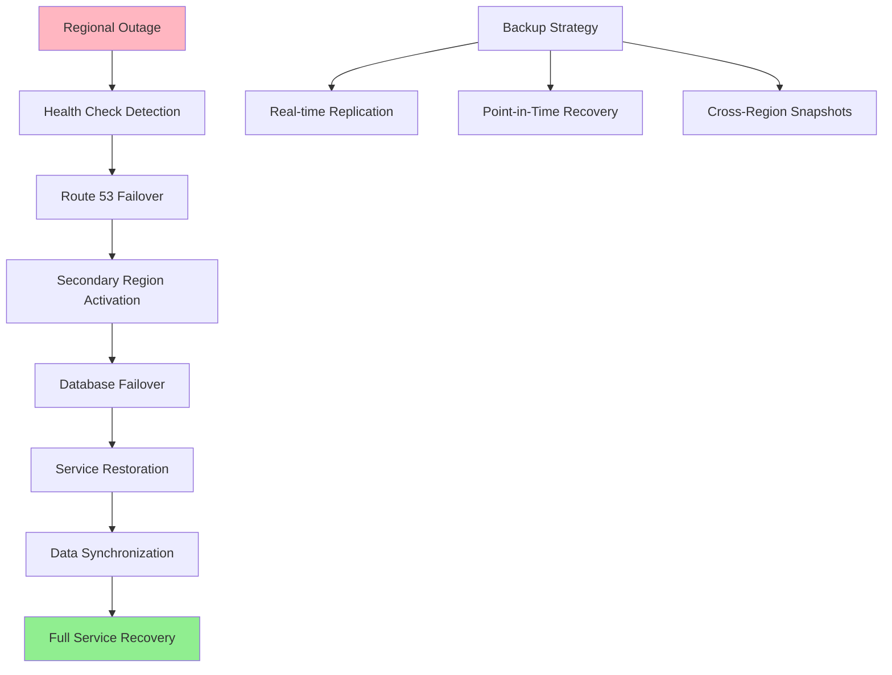

**RTO/RPO Targets:**
- **RTO**: 5 minutes for search services, 15 minutes for booking services
- **RPO**: 1 minute for booking data, 5 minutes for search data
- **Data Consistency**: Strong consistency for bookings, eventual for search
- **Recovery Testing**: Monthly disaster recovery drills

## 8. Security Architecture

### 8.1 Security Layers

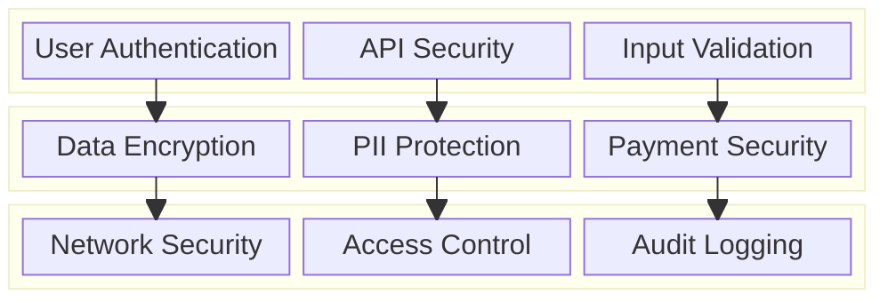

**Security Features:**
- **Multi-Factor Authentication**: Enhanced security for host and guest accounts
- **Identity Verification**: Government ID verification for hosts and guests
- **Payment Security**: PCI DSS compliant payment processing
- **Data Privacy**: GDPR and CCPA compliant data handling

**Trust and Safety:**
- **Background Checks**: Optional background checks for hosts
- **Property Verification**: Verify property ownership and legitimacy
- **Review System**: Bidirectional reviews for trust building
- **Fraud Detection**: AI-powered fraud detection for bookings and payments

### 8.2 Trust and Safety Flow

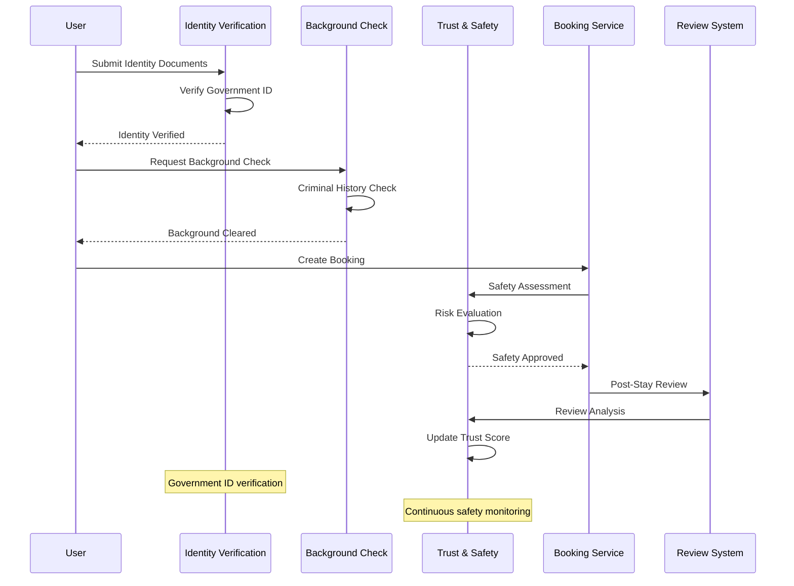

## 9. Monitoring & Observability

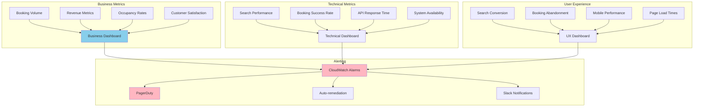

**Key Performance Indicators:**
- **Business**: Booking volume, revenue per booking, host acquisition, guest retention
- **Technical**: Search response times, booking success rates, API performance
- **User Experience**: Conversion rates, abandonment rates, customer satisfaction
- **Trust & Safety**: Identity verification rates, review scores, safety incidents

**Alerting Strategy:**
- **Critical**: Booking system failures, payment processing issues, security breaches
- **Warning**: High search latency, low conversion rates, host complaints
- **Info**: Traffic spikes, new market launches, seasonal trends

## 10. Cost Optimization

**Service-Level Cost Analysis:**
- **EKS**: $12,000/month (Microservices, 80 nodes with mixed instance types)
- **OpenSearch**: $8,000/month (Search cluster with multiple node types)
- **Aurora PostgreSQL**: $6,000/month (Multi-AZ with read replicas)
- **DynamoDB**: $4,000/month (Property and user data)
- **S3 + CloudFront**: $5,000/month (Image storage and global delivery)
- **ElastiCache**: $3,000/month (Session and search result caching)
- **SageMaker**: $4,000/month (ML models for pricing and recommendations)
- **Other Services**: $6,000/month (Lambda, SQS, monitoring, etc.)
- **Total Estimated**: ~$48,000/month for 1M properties

**Cost Optimization Strategies:**
- **Spot Instances**: 60% cost reduction for batch processing workloads
- **Reserved Instances**: 40% savings on predictable compute workloads
- **S3 Intelligent Tiering**: Automatic cost optimization for property images
- **Database Optimization**: Query optimization and connection pooling
- **CDN Optimization**: Efficient caching to reduce origin costs

**Revenue Model:**
- **Host Service Fee**: 3% of booking subtotal
- **Guest Service Fee**: 5-15% of booking subtotal (varies by region)
- **Payment Processing**: 3% + $0.30 per transaction
- **Experience Fees**: Commission on tours and activities
- **Premium Features**: Additional fees for enhanced listings

## 11. Implementation Strategy

### 11.1 Migration/Deployment Plan

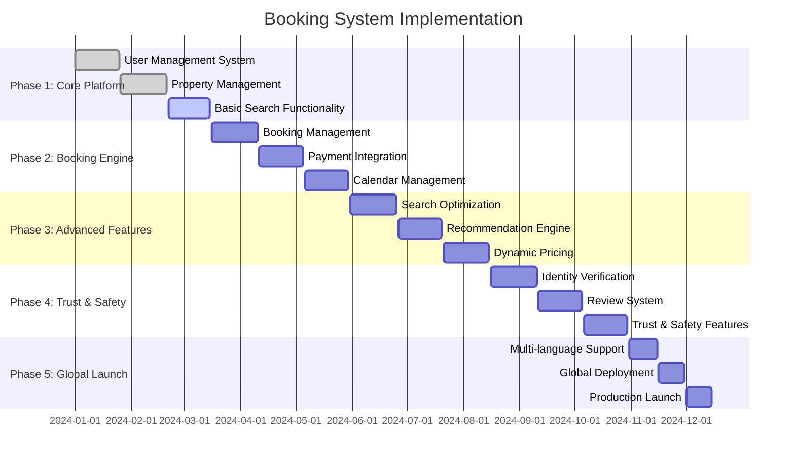

### 11.2 Technology Decisions & Trade-offs

**Search Technology:**
- **OpenSearch vs Elasticsearch**: OpenSearch for cost-effectiveness and AWS integration
- **SQL vs NoSQL**: Hybrid approach with PostgreSQL for transactions, DynamoDB for high-read data
- **Caching Strategy**: Multi-level caching with Redis for performance
- **Indexing**: Real-time indexing for property updates and availability

**Booking Architecture:**
- **Synchronous vs Asynchronous**: Hybrid approach for booking workflows
- **Event Sourcing**: Maintain complete booking history for audit and recovery
- **Distributed Locking**: Prevent double bookings with distributed locks
- **Saga Pattern**: Manage complex multi-service transactions

**Payment Processing:**
- **In-house vs Third-party**: Third-party processors with custom escrow logic
- **Multi-currency**: Support for 190+ currencies with real-time conversion
- **Split Payments**: Automatic fee calculation and multi-party settlements
- **Fraud Prevention**: AI-powered fraud detection and prevention

**Future Evolution Path:**
- **AI Enhancement**: Advanced recommendation algorithms and dynamic pricing
- **Blockchain Integration**: Smart contracts for booking and payment automation
- **IoT Integration**: Smart lock integration and property automation
- **Sustainability Features**: Carbon footprint tracking and eco-friendly properties

**Technical Debt & Improvement Areas:**
- **Advanced Search**: Machine learning-based search ranking and personalization
- **Real-time Communication**: Enhanced messaging and video calling features
- **Mobile Optimization**: Native mobile app performance and offline capabilities
- **Accessibility**: Enhanced accessibility features for users with disabilities
