# Distributed Message Queue System Design Architecture

## 1. Executive Summary & Requirements

### System Overview
A highly scalable distributed message queue system that provides reliable, ordered message delivery between distributed applications and services. The system supports multiple messaging patterns, guarantees message durability, handles high throughput, and provides exactly-once delivery semantics similar to Apache Kafka or Amazon SQS.

### Functional Requirements
- **Message Publishing**: Accept messages from producers with configurable partitioning
- **Message Consumption**: Deliver messages to consumers with various consumption patterns
- **Topic Management**: Support for topics, partitions, and consumer groups
- **Message Ordering**: Maintain message order within partitions
- **Durability**: Persistent message storage with configurable retention policies
- **Dead Letter Queues**: Handle failed message processing with retry mechanisms
- **Message Filtering**: Support message filtering and routing based on attributes
- **Batch Operations**: Batch message publishing and consumption for efficiency
- **Schema Management**: Message schema validation and evolution
- **Monitoring**: Real-time metrics and monitoring for queue performance

### Non-Functional Requirements
- **Availability**: 99.99% uptime with automatic failover
- **Throughput**: Handle 10M+ messages per second across all topics
- **Latency**: <10ms for message publishing, <100ms for message delivery
- **Scalability**: Support 100K+ topics and 1M+ concurrent connections
- **Durability**: 99.999999999% message durability with replication
- **Consistency**: At-least-once delivery with optional exactly-once semantics

### Key Constraints
- Handle network partitions and broker failures gracefully
- Support both real-time and batch processing patterns
- Maintain message ordering guarantees within partitions
- Balance between consistency, availability, and partition tolerance
- Support multiple programming languages and client libraries

### Success Metrics
- 99.99% availability for message publishing and consumption
- <5ms P95 latency for message publishing
- >99.9% successful message delivery rate
- Support 1M+ messages per second per partition
- Zero message loss during normal operations

## 2. High-Level Architecture Overview

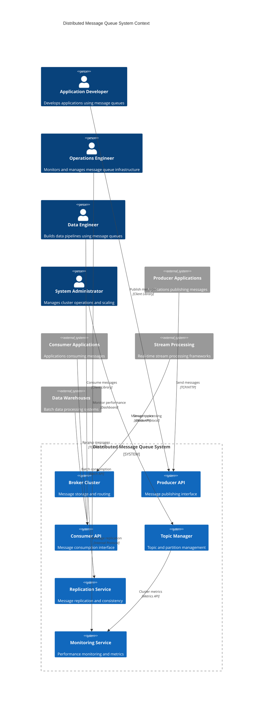

**Architectural Style Rationale**: Distributed log-based architecture chosen for:
- High throughput and low latency message processing
- Horizontal scalability through partitioning and clustering
- Strong durability guarantees through replication
- Support for both real-time and batch processing patterns
- Fault tolerance with automatic failover and recovery

## 3. Detailed System Architecture

### 3.1 AWS Service Stack Selection

**Core Messaging:**
- **MSK (Managed Streaming for Apache Kafka)**: Managed Kafka service
- **SQS**: Managed message queuing for simple use cases
- **SNS**: Pub/sub messaging for fan-out patterns
- **Kinesis Data Streams**: Real-time data streaming

**Compute Services:**
- **EKS**: Kubernetes for custom message broker deployment
- **EC2**: High-performance instances for broker nodes
- **Lambda**: Serverless message processing functions
- **Auto Scaling Groups**: Automatic broker scaling

**Storage:**
- **EBS**: High-IOPS storage for message logs
- **S3**: Long-term message archival and backup
- **EFS**: Shared storage for configuration and metadata
- **Instance Store**: High-performance local storage

**Networking:**
- **VPC**: Isolated network with optimized placement
- **Placement Groups**: Cluster placement for low-latency communication
- **Enhanced Networking**: SR-IOV for high-performance networking
- **Direct Connect**: Dedicated connections for enterprise clients

**Monitoring:**
- **CloudWatch**: Comprehensive monitoring and custom metrics
- **Prometheus**: Time-series metrics for Kafka monitoring
- **Grafana**: Visualization dashboards for operational metrics
- **X-Ray**: Distributed tracing for message flows

**Security:**
- **IAM**: Fine-grained access control for topics and operations
- **KMS**: Encryption key management for message encryption
- **Secrets Manager**: Secure storage of authentication credentials
- **VPC Endpoints**: Secure access to AWS services

### 3.2 Component Architecture Diagram

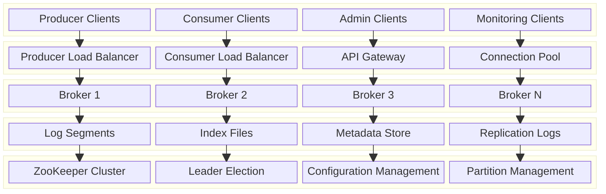

## 4. Data Architecture & Flow

### 4.1 Data Flow Diagrams

#### Message Publishing Flow
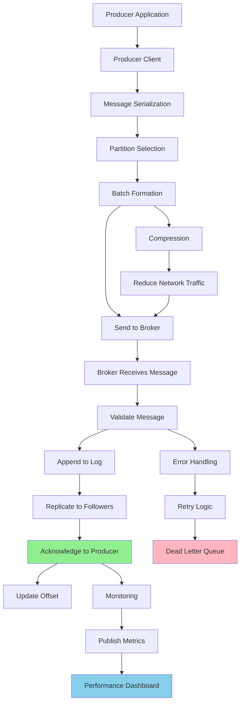

#### Message Consumption Flow
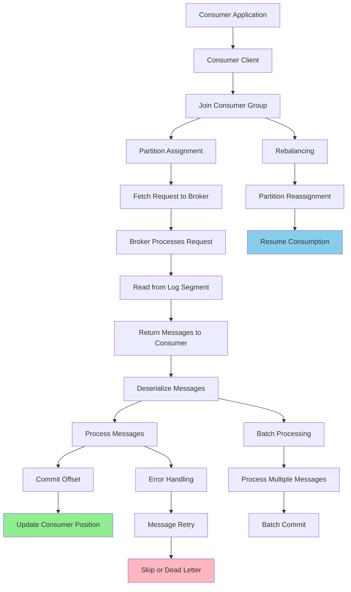

#### Replication and Consistency Flow
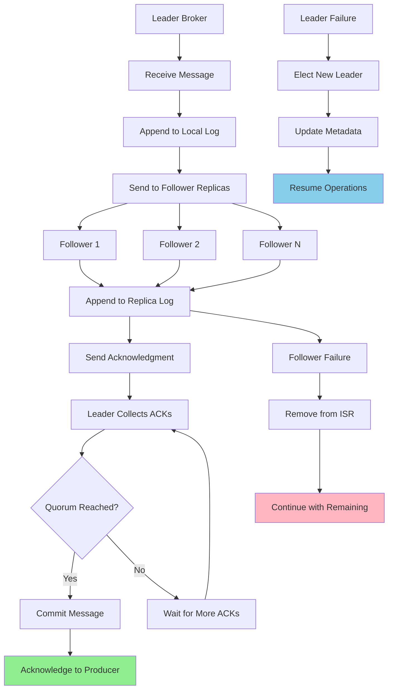

### 4.2 Database Design

#### Topic and Partition Metadata
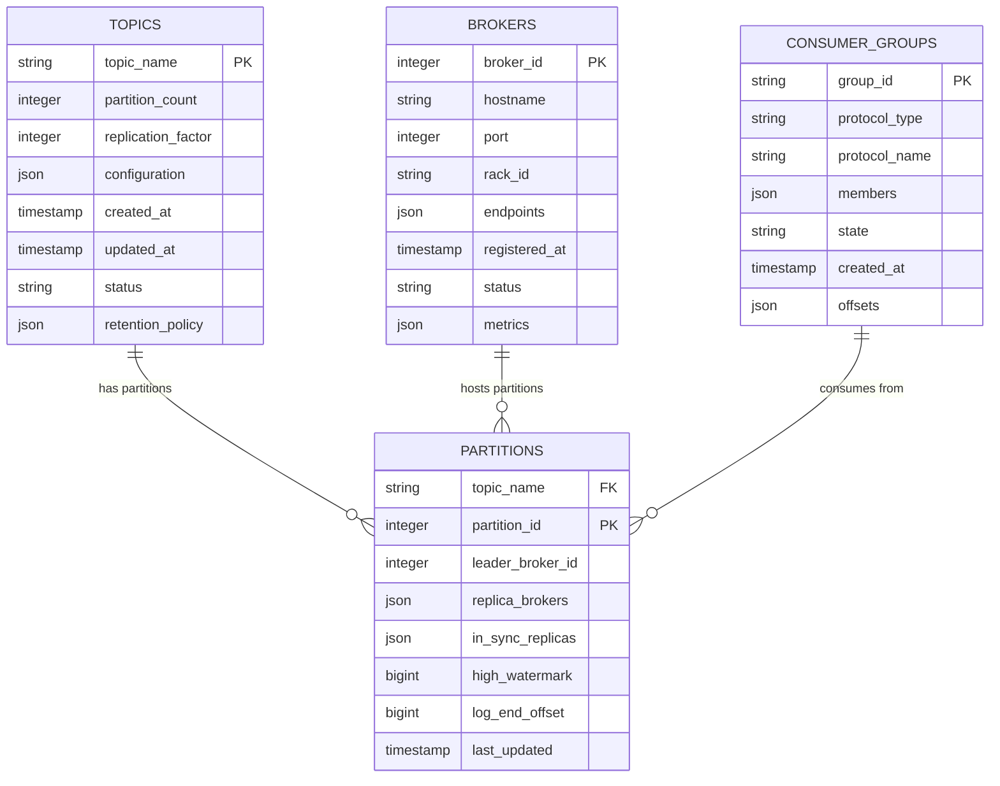

#### Message Storage Schema
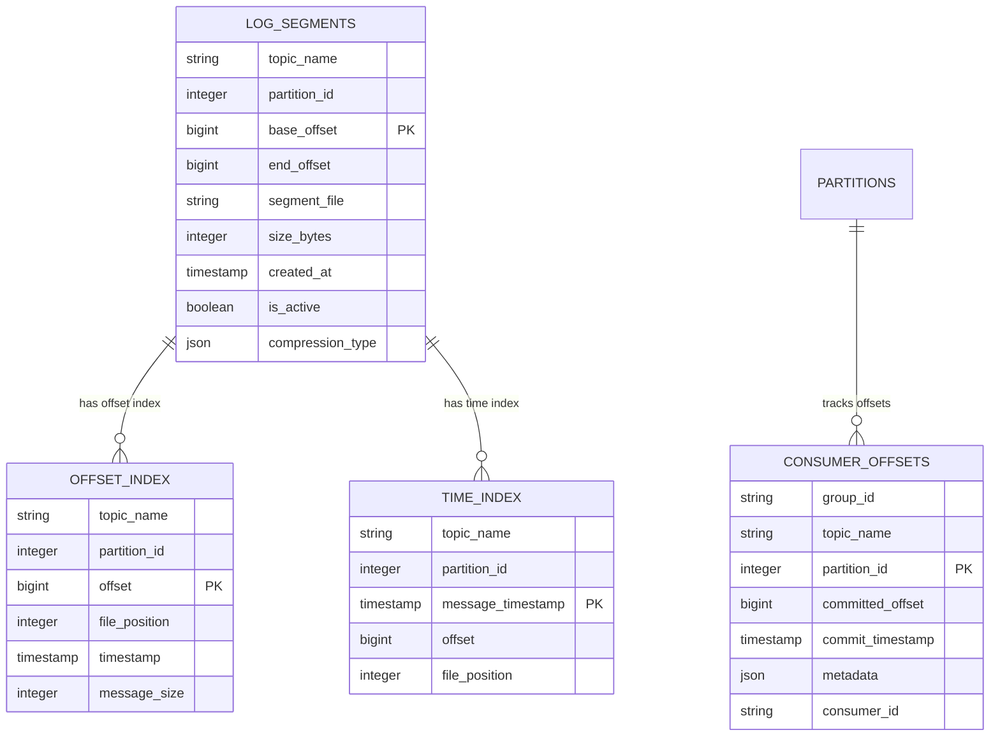

## 5. Detailed Component Design

### 5.1 Broker Service

**Purpose & Responsibilities:**
- Store and manage message logs for assigned partitions
- Handle producer publish requests and consumer fetch requests
- Manage partition leadership and follower replication
- Implement message retention and cleanup policies
- Provide metrics and monitoring for partition performance

**Storage Management:**
- **Log Segments**: Immutable log segments with configurable size limits
- **Index Files**: Offset and timestamp indexes for efficient message lookup
- **Compression**: Message compression to reduce storage and network usage
- **Retention**: Time-based and size-based retention policies

**Replication:**
- **Leader-Follower Model**: Each partition has one leader and multiple followers
- **In-Sync Replicas (ISR)**: Track replicas that are caught up with leader
- **Replication Protocol**: Efficient replication with batching and compression
- **Consistency**: Ensure strong consistency within partition replicas

### 5.2 Producer Client

**Purpose & Responsibilities:**
- Provide APIs for applications to publish messages to topics
- Handle message serialization, compression, and batching
- Implement partition selection strategies for load balancing
- Manage connections to broker cluster with failover support
- Provide delivery guarantees and error handling

**Publishing Features:**
- **Batching**: Group messages for efficient network utilization
- **Compression**: Support multiple compression algorithms (gzip, snappy, lz4)
- **Partitioning**: Configurable partitioning strategies (round-robin, hash, custom)
- **Idempotency**: Exactly-once semantics with idempotent producers
- **Async/Sync**: Support both asynchronous and synchronous publishing

### 5.3 Consumer Client

**Purpose & Responsibilities:**
- Provide APIs for applications to consume messages from topics
- Manage consumer group membership and partition assignment
- Handle message deserialization and offset management
- Implement consumer rebalancing during group changes
- Support various consumption patterns (at-least-once, at-most-once, exactly-once)

**Consumption Features:**
- **Consumer Groups**: Coordinate consumption across multiple consumers
- **Partition Assignment**: Automatic partition assignment and rebalancing
- **Offset Management**: Automatic or manual offset commit strategies
- **Message Ordering**: Maintain message order within partitions
- **Error Handling**: Dead letter queues and retry mechanisms

### Critical User Journey Sequence Diagrams

#### High-Throughput Message Publishing
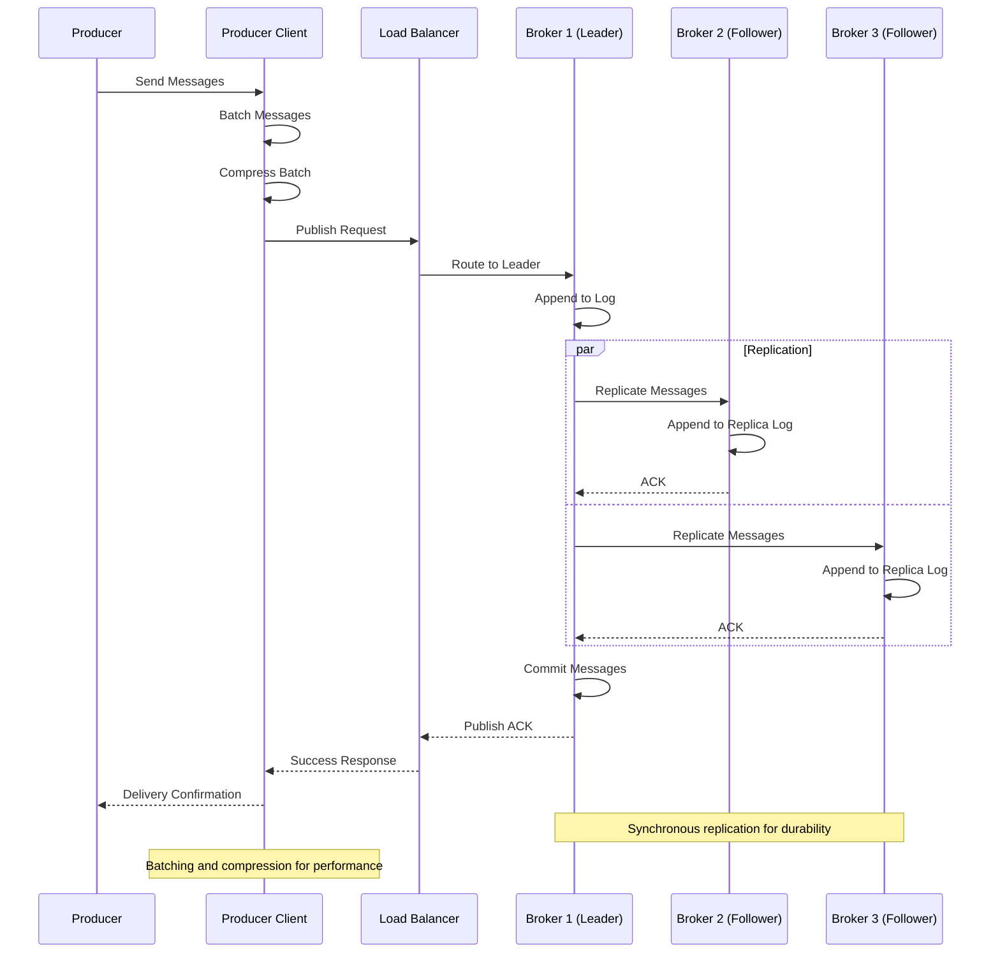

#### Consumer Group Rebalancing
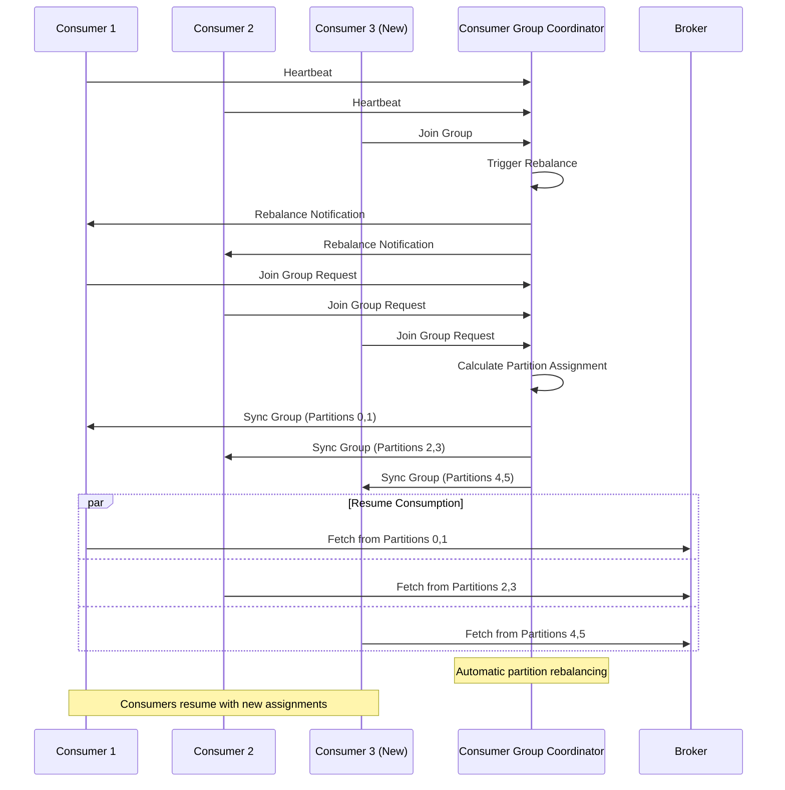

#### Message Processing with Error Handling
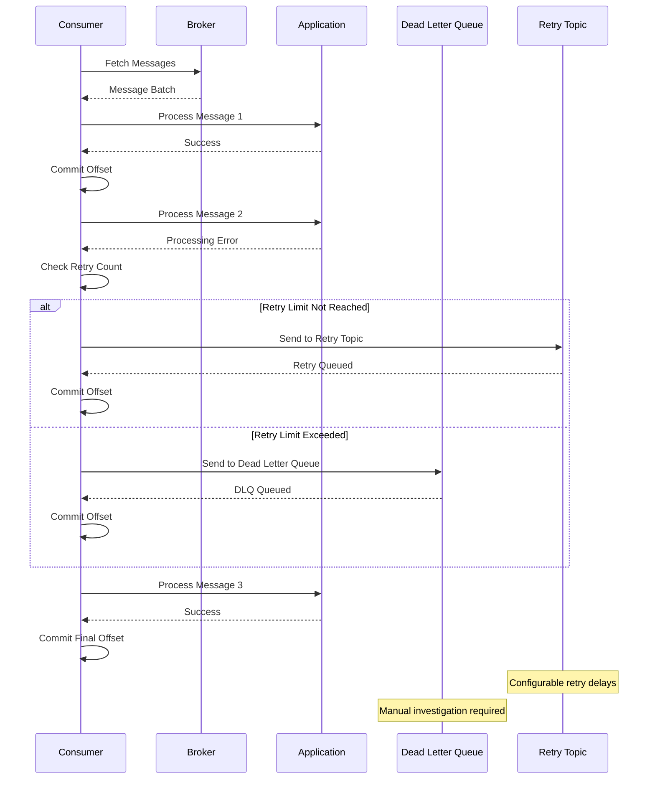

## 6. Scalability & Performance

### 6.1 Scaling Architecture

```mermaid
flowchart TD
    subgraph "Horizontal Scaling"
        A[Add Brokers] --> B[Partition Rebalancing]
        B --> C[Load Redistribution]
        C --> D[Increased Throughput]
    end
    
    subgraph "Partition Scaling"
        E[Increase Partitions] --> F[Parallel Processing]
        F --> G[Consumer Scaling]
        G --> H[Higher Concurrency]
    end
    
    subgraph "Storage Scaling"
        I[Storage Growth] --> J[Add EBS Volumes]
        J --> K[Segment Archival]
        K --> L[S3 Cold Storage]
    end
    
    subgraph "Network Scaling"
        M[Network Bottlenecks] --> N[Enhanced Networking]
        N --> O[Placement Groups]
        O --> P[Optimized Topology]
    end
    
    style D fill:#87CEEB
    style H fill:#90EE90
    style L fill:#FFB6C1
    style P fill:#DDA0DD
```

### 6.2 Performance Optimization

**Throughput Optimization:**
- **Batching**: Producer and consumer batching for network efficiency
- **Compression**: Message compression to reduce network and storage usage
- **Zero-Copy**: Use zero-copy transfers for high-performance I/O
- **Asynchronous I/O**: Non-blocking I/O operations for better concurrency

**Latency Optimization:**
- **Memory Mapping**: Use memory-mapped files for fast log access
- **Page Cache**: Leverage OS page cache for read performance
- **Network Optimization**: Optimize TCP settings and connection pooling
- **Local Storage**: Use high-performance local storage for active segments

**Storage Optimization:**
- **Log Compaction**: Remove duplicate keys to reduce storage usage
- **Tiered Storage**: Move old segments to cheaper storage tiers
- **Compression**: Use efficient compression algorithms for storage
- **Index Optimization**: Optimize index structures for fast lookups

## 7. Reliability & Fault Tolerance

### 7.1 High Availability Design

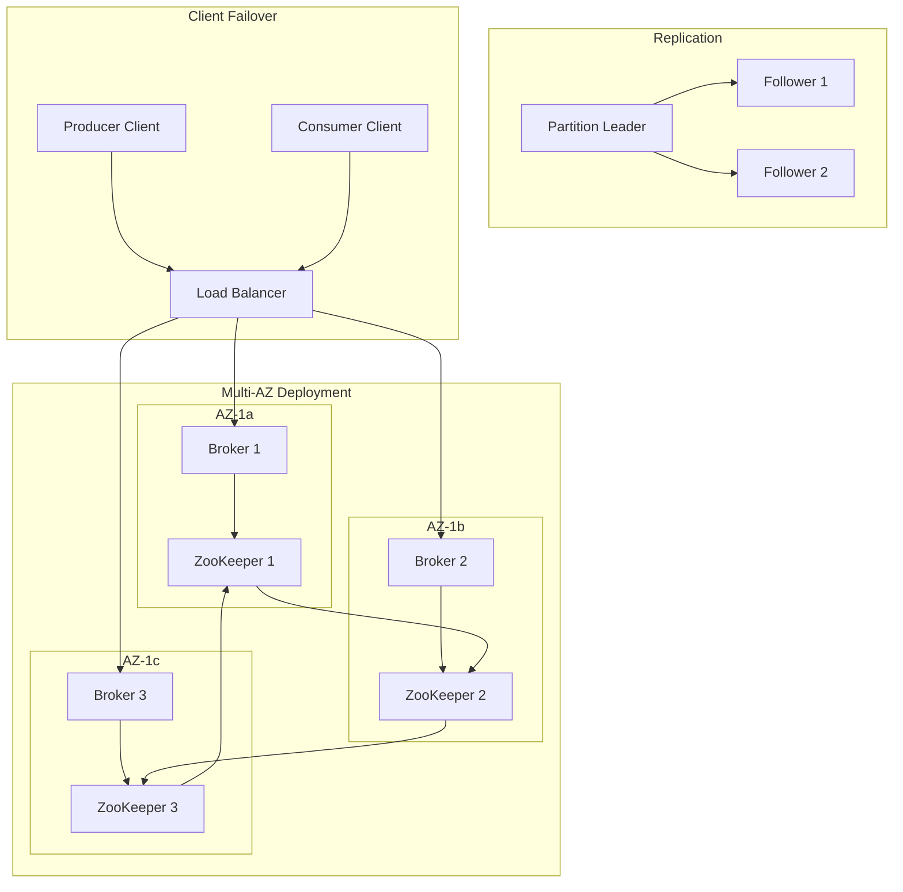

**Fault Tolerance Mechanisms:**
- **Replication**: Multi-replica storage with configurable replication factor
- **Leader Election**: Automatic leader election for partition availability
- **Client Failover**: Automatic client failover to healthy brokers
- **Data Durability**: Synchronous replication for critical data

### 7.2 Disaster Recovery

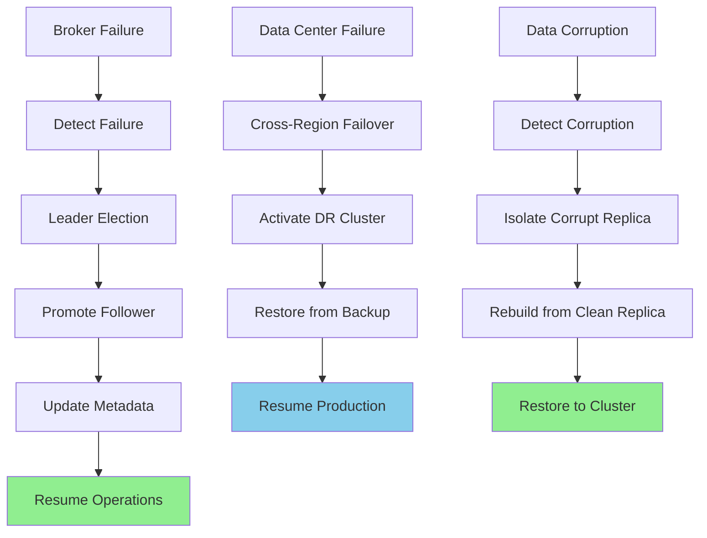

**RTO/RPO Targets:**
- **RTO**: 30 seconds for broker failover, 5 minutes for cluster recovery
- **RPO**: Near-zero with synchronous replication within region
- **Data Durability**: 99.999999999% with multi-AZ replication
- **Message Ordering**: Maintain ordering guarantees during failover

## 8. Security Architecture

### 8.1 Security Layers

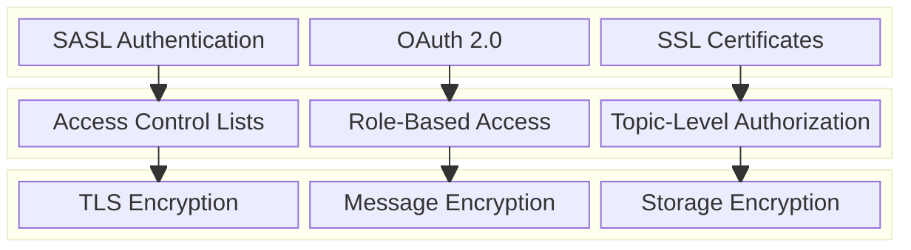

**Security Features:**
- **Authentication**: SASL/SCRAM, OAuth 2.0, and mutual TLS authentication
- **Authorization**: Fine-grained ACLs for topics, consumer groups, and operations
- **Encryption**: End-to-end encryption for messages in transit and at rest
- **Network Security**: VPC isolation and security group controls

**Data Protection:**
- **Message Encryption**: Optional message-level encryption with customer keys
- **Audit Logging**: Comprehensive audit trails for security compliance
- **Network Isolation**: Private subnets and VPC endpoints for secure access
- **Key Management**: Integration with AWS KMS for key management

### 8.2 Security Flow

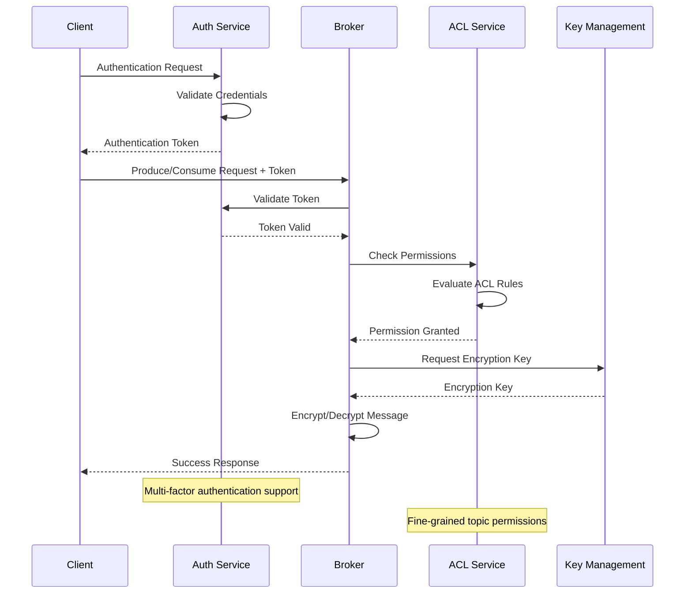

## 9. Monitoring & Observability

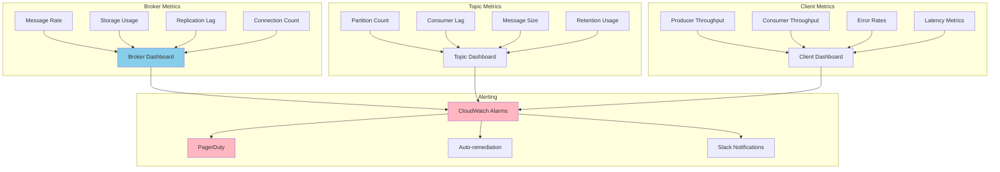

**Key Performance Indicators:**
- **Throughput**: Messages per second, bytes per second, partition throughput
- **Latency**: End-to-end latency, replication lag, consumer lag
- **Availability**: Broker uptime, partition availability, leader election time
- **Resource Usage**: CPU, memory, disk usage, network utilization

**Alerting Strategy:**
- **Critical**: Broker failures, data loss, partition unavailability
- **Warning**: High consumer lag, disk space warnings, replication issues
- **Info**: Topic creation, consumer group changes, performance trends

## 10. Cost Optimization

**Service-Level Cost Analysis:**
- **EC2 Instances**: $18,000/month (50 brokers, mixed instance types)
- **EBS Storage**: $12,000/month (High-IOPS storage for message logs)
- **Data Transfer**: $4,000/month (Cross-AZ and internet traffic)
- **ZooKeeper**: $3,000/month (3-node ZooKeeper cluster)
- **Monitoring**: $2,000/month (CloudWatch, Prometheus, Grafana)
- **S3 Archival**: $1,000/month (Long-term message archival)
- **Load Balancers**: $1,000/month (Network load balancers)
- **Total Estimated**: ~$41,000/month for 50-broker cluster

**Cost Optimization Strategies:**
- **Spot Instances**: 60% cost reduction for non-critical broker nodes
- **Reserved Instances**: 40% savings on long-running broker instances
- **Storage Tiering**: Move old messages to cheaper storage tiers
- **Compression**: Reduce storage and network costs through compression
- **Right-sizing**: Optimize instance types based on workload patterns

**Cost Monitoring:**
- **Per-Topic Costing**: Track costs by topic and application
- **Resource Utilization**: Monitor and optimize underutilized brokers
- **Storage Optimization**: Implement efficient retention policies
- **Network Optimization**: Minimize cross-AZ data transfer costs

## 11. Implementation Strategy

### 11.1 Migration/Deployment Plan

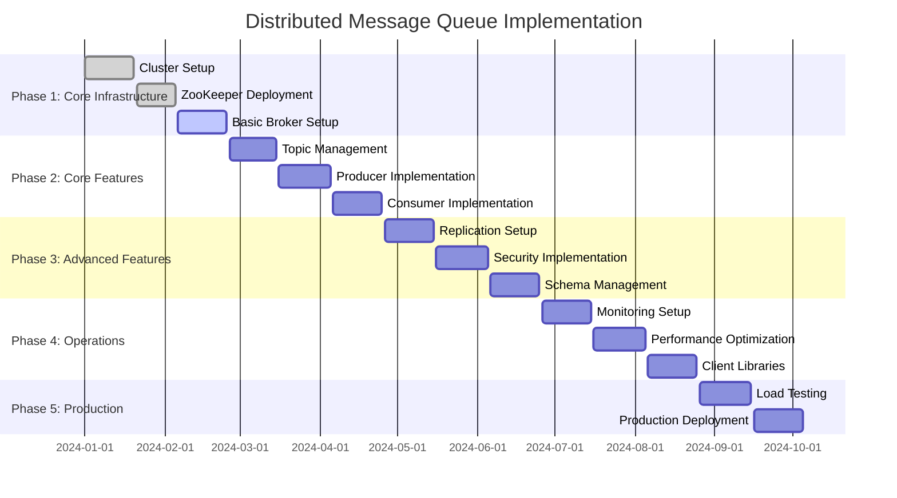

### 11.2 Technology Decisions & Trade-offs

**Architecture Decisions:**
- **Kafka vs SQS**: Kafka for high-throughput streaming, SQS for simple queuing
- **Self-managed vs MSK**: Self-managed for control, MSK for operational simplicity
- **ZooKeeper vs KRaft**: ZooKeeper for stability, KRaft for future migration
- **Replication Factor**: Balance between durability and cost (typically 3)

**Storage Strategy:**
- **EBS vs Instance Store**: EBS for durability, Instance Store for performance
- **gp3 vs io2**: gp3 for cost-effectiveness, io2 for high IOPS requirements
- **Log Compaction**: Enable for topics with key-based messages
- **Retention Policies**: Balance between data retention and storage costs

**Performance Tuning:**
- **Batch Size**: Optimize producer and consumer batch sizes
- **Compression**: Choose appropriate compression algorithm (lz4, snappy)
- **Partitioning**: Design partition strategy for even load distribution
- **Consumer Groups**: Size consumer groups based on partition count

**Future Evolution Path:**
- **KRaft Mode**: Migrate from ZooKeeper to KRaft for simplified operations
- **Tiered Storage**: Implement tiered storage for cost optimization
- **Schema Registry**: Enhanced schema management and evolution
- **Exactly-Once Semantics**: Implement exactly-once delivery guarantees

**Technical Debt & Improvement Areas:**
- **Multi-tenancy**: Better isolation between different applications
- **Cross-Datacenter Replication**: Active-active replication across regions
- **Advanced Monitoring**: Predictive analytics for capacity planning
- **Automated Operations**: Self-healing and auto-scaling capabilities
