# Stock Trading System Design Architecture

## 1. Executive Summary & Requirements

### System Overview
A high-performance electronic stock trading system that facilitates real-time trading of financial securities with ultra-low latency, high throughput, and strict regulatory compliance. The system handles order management, market data processing, trade execution, risk management, and settlement processing for institutional and retail investors.

### Functional Requirements
- **Order Management**: Accept, validate, and route trading orders
- **Market Data Processing**: Real-time market data feeds and price discovery
- **Trade Execution**: Match buy and sell orders with optimal execution
- **Risk Management**: Real-time risk assessment and position monitoring
- **Portfolio Management**: Track positions, P&L, and portfolio analytics
- **Settlement Processing**: Post-trade processing and settlement workflows
- **Regulatory Reporting**: Compliance reporting and audit trails
- **Market Making**: Support for algorithmic trading and market making
- **Multi-Asset Support**: Stocks, bonds, derivatives, and cryptocurrencies
- **API Integration**: RESTful and WebSocket APIs for external systems

### Non-Functional Requirements
- **Latency**: <1ms for order processing, <100μs for market data
- **Throughput**: Handle 1M+ orders per second during peak trading
- **Availability**: 99.99% uptime during market hours
- **Consistency**: Strong consistency for order matching and settlement
- **Compliance**: SOX, MiFID II, Dodd-Frank regulatory compliance
- **Security**: Multi-layered security with encryption and access controls

### Key Constraints
- Strict regulatory compliance across multiple jurisdictions
- Ultra-low latency requirements for high-frequency trading
- Handle market volatility and sudden volume spikes
- Maintain audit trails for all transactions
- Support multiple trading venues and dark pools

### Success Metrics
- <500μs average order-to-execution latency
- 99.99% order processing success rate
- Zero tolerance for trade settlement errors
- 100% regulatory compliance audit success
- Support 10M+ concurrent market data subscribers

## 2. High-Level Architecture Overview

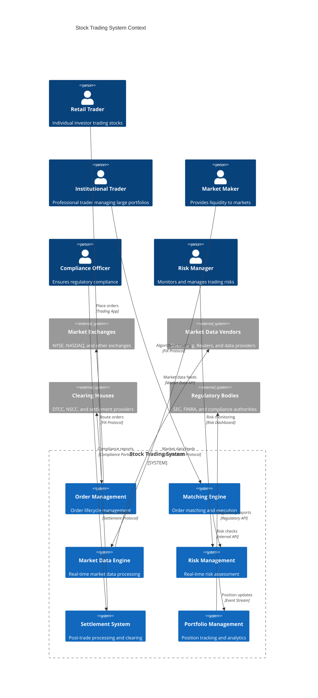

**Architectural Style Rationale**: Event-driven microservices with CQRS chosen for:
- Ultra-low latency requirements for order processing and market data
- High-throughput capabilities for handling millions of orders per second
- Strong consistency guarantees for financial transactions
- Regulatory compliance through comprehensive audit trails
- Scalability to handle market volatility and trading spikes

## 3. Detailed System Architecture

### 3.1 AWS Service Stack Selection

**Ultra-Low Latency Computing:**
- **EC2 C5n/M5zn Instances**: High-performance computing with enhanced networking
- **Placement Groups**: Cluster placement for minimal network latency
- **SR-IOV Enhanced Networking**: Single root I/O virtualization for network performance
- **Nitro System**: Hardware acceleration for compute and networking

**High-Performance Storage:**
- **Instance Store NVMe**: Ultra-low latency local storage
- **EBS io2 Block Express**: High IOPS persistent storage
- **EFS**: Shared storage for configuration and reference data
- **FSx for Lustre**: High-performance parallel file system

**Real-time Data Processing:**
- **Kinesis Data Streams**: High-throughput real-time data ingestion
- **MSK**: Managed Kafka for order and market data streaming
- **Lambda**: Serverless functions for event processing
- **Kinesis Analytics**: Real-time analytics for market data

**Databases:**
- **Aurora PostgreSQL**: ACID-compliant transaction storage
- **DynamoDB**: High-performance order book and position data
- **ElastiCache Redis**: Ultra-low latency caching and session management
- **MemoryDB**: In-memory database for real-time trading data

**Networking:**
- **Direct Connect**: Dedicated network connections to exchanges
- **Transit Gateway**: High-performance network routing
- **VPC**: Isolated network with optimized routing
- **Global Accelerator**: Network performance optimization

**Security & Compliance:**
- **KMS**: Encryption key management for sensitive data
- **CloudHSM**: Hardware security modules for cryptographic operations
- **WAF**: Web application firewall for API protection
- **Config**: Compliance monitoring and configuration management

**Monitoring:**
- **CloudWatch**: Real-time monitoring with custom metrics
- **X-Ray**: Distributed tracing for order flows
- **Systems Manager**: Operational insights and automation
- **CloudTrail**: Comprehensive audit logging

### 3.2 Component Architecture Diagram

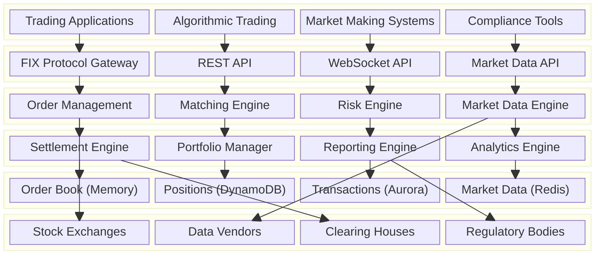

## 4. Data Architecture & Flow

### 4.1 Data Flow Diagrams

#### Order Processing and Execution Flow
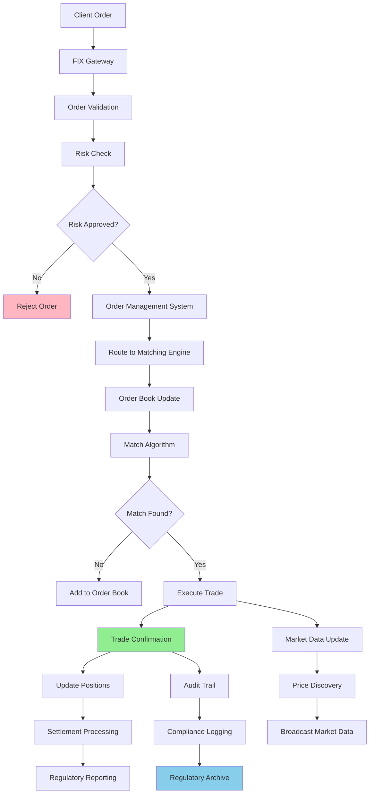

#### Real-time Market Data Processing Flow
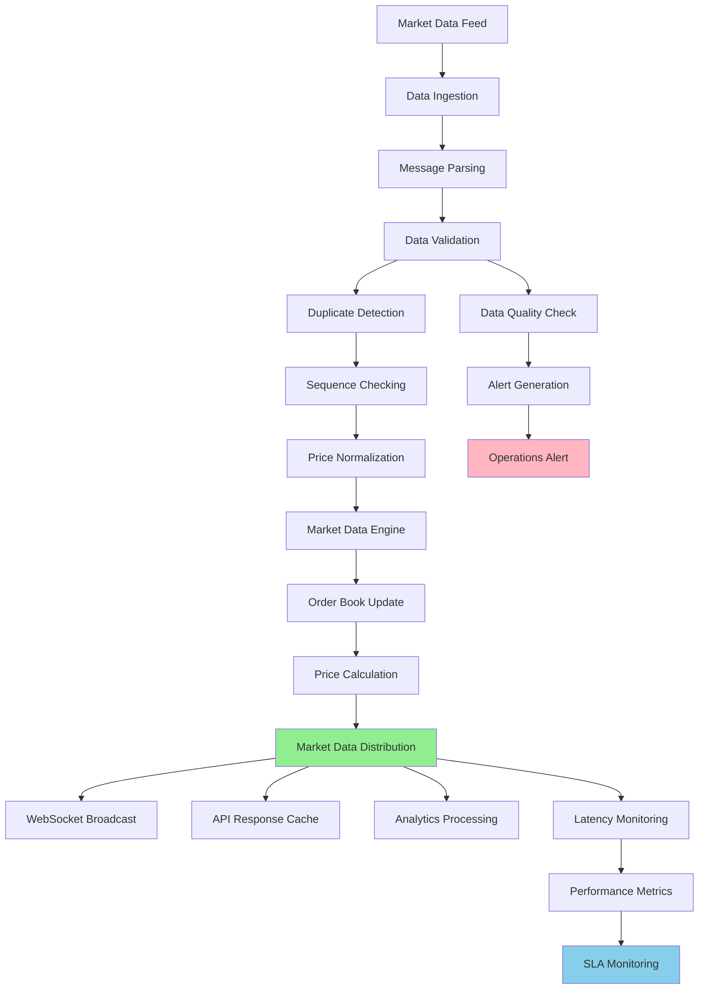

#### Risk Management and Position Tracking Flow
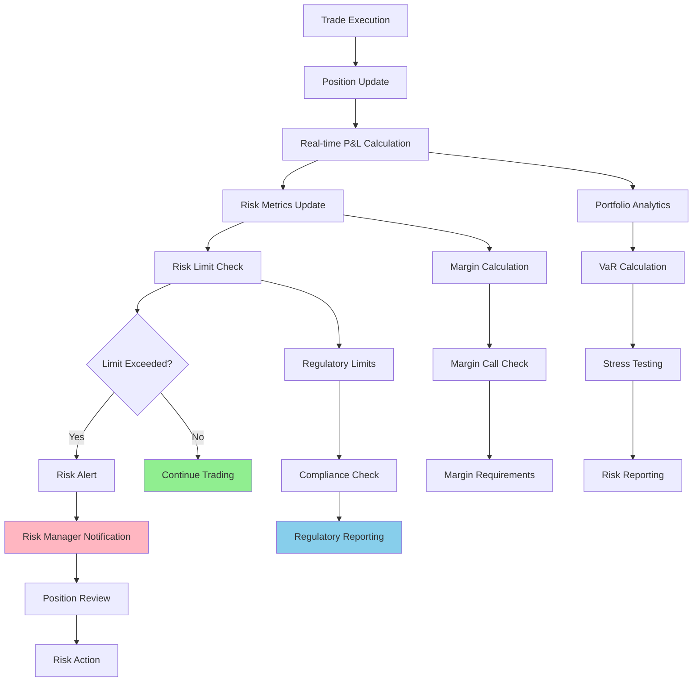

### 4.2 Database Design

#### Order and Trade Management Schema
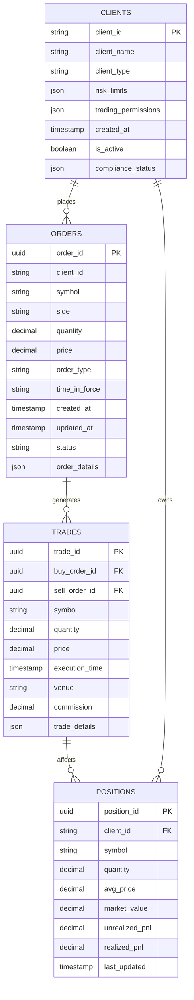

#### Market Data and Reference Schema
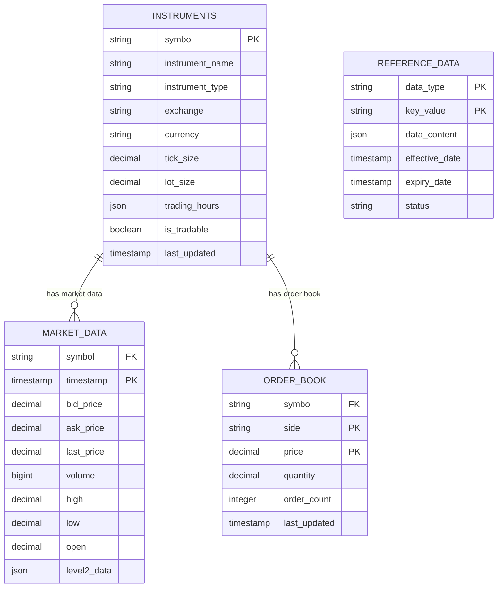

## 5. Detailed Component Design

### 5.1 Matching Engine

**Purpose & Responsibilities:**
- Execute order matching with price-time priority algorithm
- Maintain real-time order books for all tradable instruments
- Handle different order types (market, limit, stop, iceberg)
- Ensure fair and transparent order execution
- Support high-frequency trading requirements

**Matching Algorithms:**
- **Price-Time Priority**: Orders matched by best price, then time priority
- **Pro-Rata**: Proportional allocation for same-price orders
- **Size Priority**: Larger orders get priority at same price level
- **Hidden Liquidity**: Support for iceberg and hidden orders
- **Auction Matching**: Opening and closing auction algorithms

**Performance Optimizations:**
- **In-Memory Order Books**: Keep active order books in memory
- **Lock-Free Data Structures**: Minimize contention in multi-threaded environment
- **CPU Affinity**: Pin critical processes to specific CPU cores
- **NUMA Optimization**: Optimize memory access patterns
- **Zero-Copy Operations**: Minimize memory copying for performance

### 5.2 Risk Management Engine

**Purpose & Responsibilities:**
- Real-time risk assessment for all trading activities
- Monitor position limits, concentration limits, and leverage
- Calculate Value-at-Risk (VaR) and other risk metrics
- Implement pre-trade and post-trade risk controls
- Generate risk reports and alerts for compliance

**Risk Controls:**
- **Pre-trade Checks**: Order size, price, and position limits
- **Post-trade Monitoring**: Real-time P&L and risk metric tracking
- **Margin Management**: Initial and maintenance margin calculations
- **Stress Testing**: Scenario analysis and stress testing
- **Regulatory Limits**: Compliance with position and exposure limits

**Risk Metrics:**
- **Value-at-Risk (VaR)**: Statistical measure of potential losses
- **Expected Shortfall**: Average loss beyond VaR threshold
- **Greeks**: Delta, gamma, theta, vega for derivatives
- **Concentration Risk**: Exposure concentration by sector/instrument
- **Liquidity Risk**: Assessment of position liquidity

### 5.3 Market Data Engine

**Purpose & Responsibilities:**
- Process real-time market data feeds from multiple sources
- Maintain consolidated order books and market data
- Distribute market data to internal systems and external clients
- Handle market data normalization and conflation
- Ensure data quality and completeness

**Data Processing:**
- **Feed Handlers**: Protocol-specific handlers for different data sources
- **Message Sequencing**: Ensure proper message ordering and gap detection
- **Data Normalization**: Convert data to standard internal formats
- **Conflation**: Combine multiple updates into single messages
- **Quality Assurance**: Validate data integrity and completeness

### Critical User Journey Sequence Diagrams

#### High-Frequency Order Execution
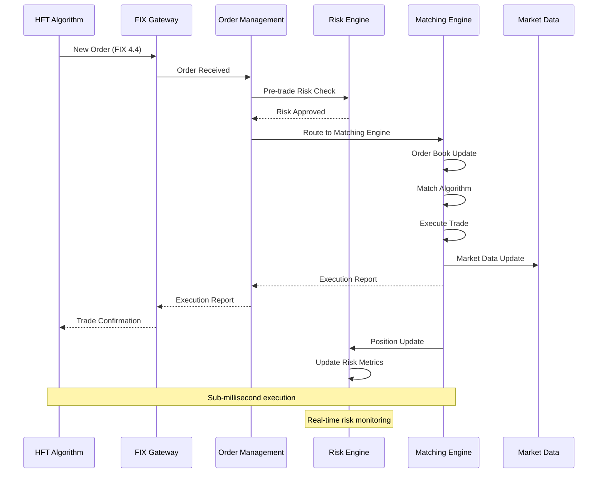

#### Market Data Distribution
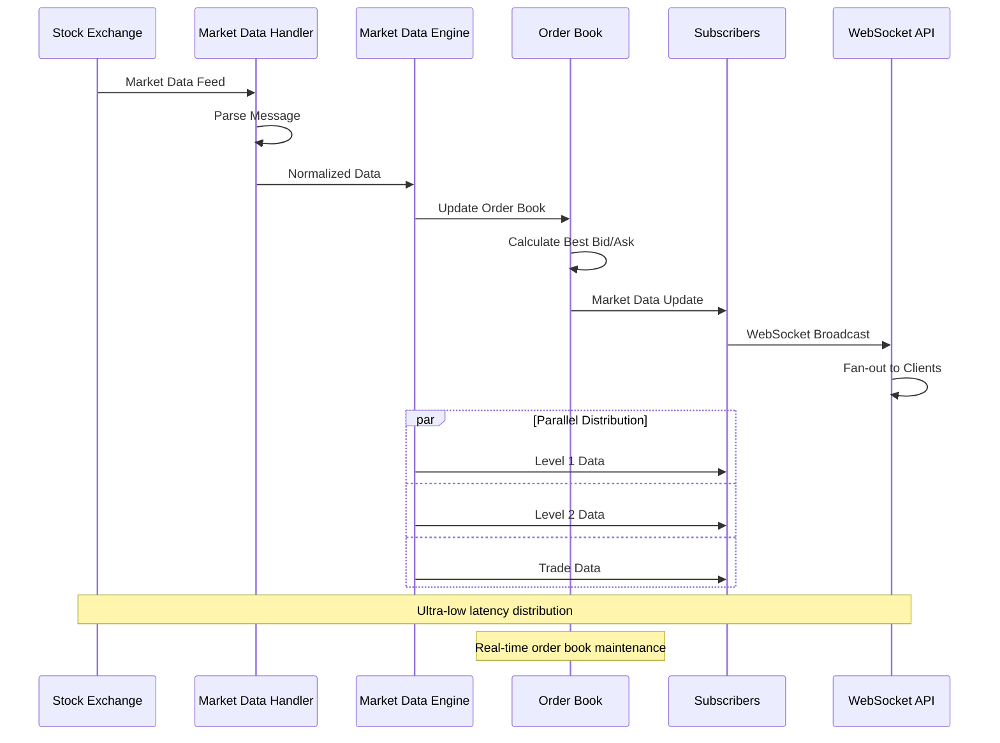

#### Risk Limit Breach Handling
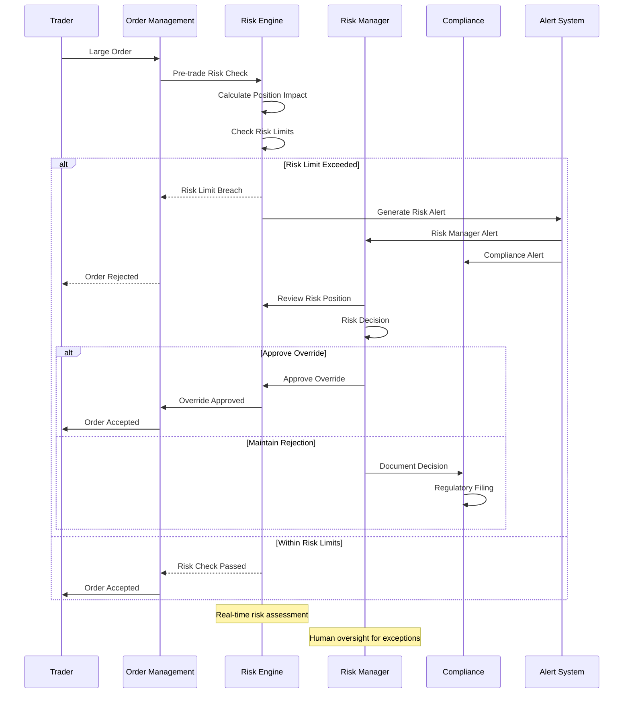

## 6. Scalability & Performance

### 6.1 Scaling Architecture

```mermaid
flowchart TD
    subgraph "Compute Scaling"
        A[CPU-Intensive Workloads] --> B[High-Performance Instances]
        B --> C[CPU Affinity Optimization]
        C --> D[NUMA-Aware Processing]
    end
    
    subgraph "Network Scaling"
        E[High Network Throughput] --> F[Enhanced Networking]
        F --> G[SR-IOV Optimization]
        G --> H[Placement Groups]
    end
    
    subgraph "Storage Scaling"
        I[Ultra-Low Latency Storage] --> J[NVMe Instance Store]
        J --> K[Memory-Mapped Files]
        K --> L[Zero-Copy Operations]
    end
    
    subgraph "Data Scaling"
        M[Market Data Volume] --> N[Parallel Processing]
        N --> O[Data Partitioning]
        O --> P[Distributed Caching]
    end
    
    style D fill:#87CEEB
    style H fill:#90EE90
    style L fill:#FFB6C1
    style P fill:#DDA0DD
```

### 6.2 Performance Optimization

**Ultra-Low Latency Optimization:**
- **CPU Optimization**: CPU pinning, NUMA awareness, and processor affinity
- **Memory Optimization**: Huge pages, memory pre-allocation, and cache optimization
- **Network Optimization**: Kernel bypass, user-space networking, and DPDK
- **Storage Optimization**: NVMe storage, memory-mapped files, and direct I/O

**High-Throughput Optimization:**
- **Parallel Processing**: Multi-threaded order processing and market data handling
- **Lock-Free Programming**: Atomic operations and lock-free data structures
- **Batch Processing**: Batch order processing and market data updates
- **Pipeline Optimization**: Instruction pipeline optimization and branch prediction

**System-Level Optimization:**
- **Operating System Tuning**: Linux kernel parameters and real-time scheduling
- **JVM Optimization**: Garbage collection tuning and memory management
- **Hardware Acceleration**: FPGA and GPU acceleration for specific workloads
- **Network Stack Optimization**: TCP tuning and custom protocols

## 7. Reliability & Fault Tolerance

### 7.1 High Availability Design

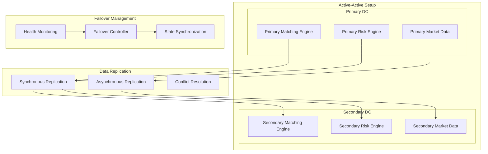

**Fault Tolerance Mechanisms:**
- **Hot-Standby Systems**: Active-passive setup with instant failover
- **Data Replication**: Synchronous replication for critical trading data
- **Circuit Breakers**: Prevent cascade failures during system stress
- **Graceful Degradation**: Maintain core functionality during partial outages

### 7.2 Disaster Recovery

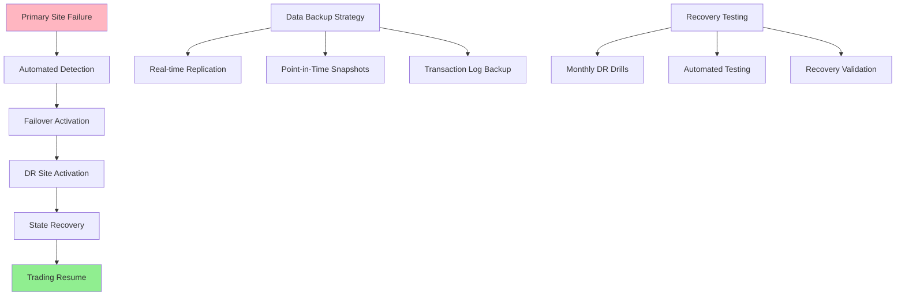

**RTO/RPO Targets:**
- **RTO**: 30 seconds for critical trading systems
- **RPO**: Near-zero with synchronous replication
- **Data Consistency**: Strong consistency for all financial transactions
- **Recovery Testing**: Weekly automated disaster recovery testing

## 8. Security Architecture

### 8.1 Security Layers

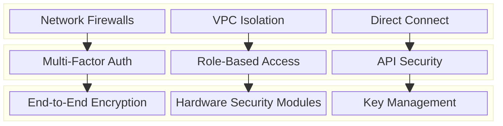

**Security Features:**
- **Multi-Factor Authentication**: Enhanced security for all trading access
- **End-to-End Encryption**: All data encrypted in transit and at rest
- **Hardware Security Modules**: Cryptographic key protection
- **Network Isolation**: Private networks with dedicated connections

**Regulatory Compliance:**
- **SOX Compliance**: Financial reporting and internal controls
- **MiFID II**: European financial regulations compliance
- **Dodd-Frank**: US financial reform compliance
- **GDPR**: Data protection and privacy compliance

### 8.2 Trading Security Flow

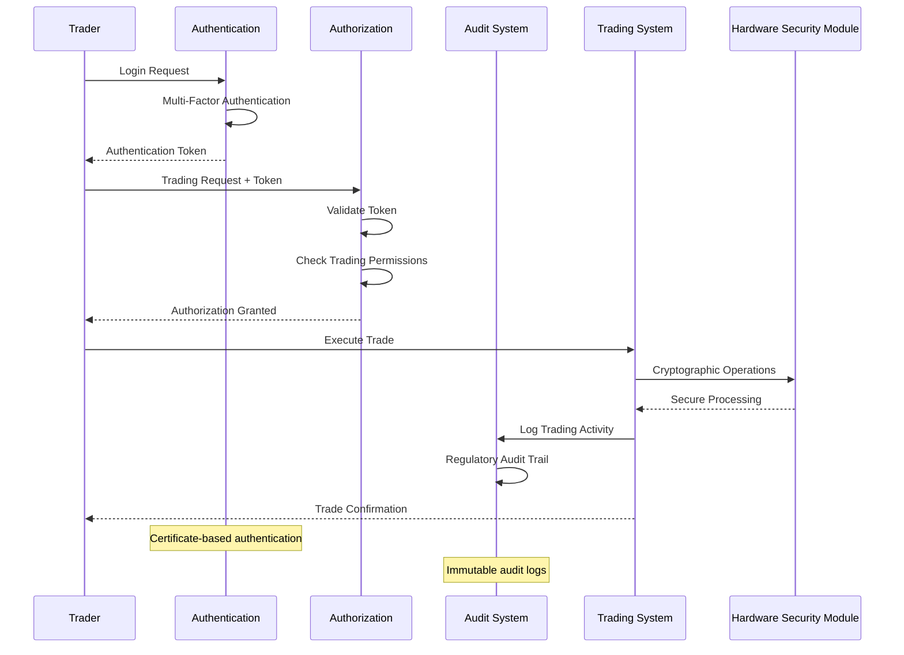

## 9. Monitoring & Observability

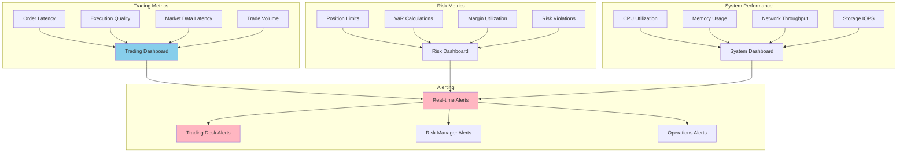

**Key Performance Indicators:**
- **Trading**: Order-to-execution latency, fill rates, execution quality, slippage
- **Risk**: Position limits, VaR, stress test results, margin utilization
- **System**: CPU/memory utilization, network latency, storage performance
- **Compliance**: Trade reporting accuracy, audit trail completeness

**Alerting Strategy:**
- **Critical**: System failures, risk limit breaches, regulatory violations
- **Warning**: High latency, capacity warnings, unusual trading patterns
- **Info**: Market events, system maintenance, performance trends

## 10. Cost Optimization

**Service-Level Cost Analysis:**
- **EC2 High-Performance**: $25,000/month (Ultra-low latency instances)
- **Direct Connect**: $8,000/month (Dedicated exchange connections)
- **Storage (NVMe)**: $6,000/month (High-IOPS local and persistent storage)
- **Aurora PostgreSQL**: $5,000/month (Transaction database with replicas)
- **DynamoDB**: $4,000/month (Position and reference data)
- **Market Data Feeds**: $15,000/month (Real-time market data subscriptions)
- **Compliance & Security**: $5,000/month (HSM, audit logging, encryption)
- **Monitoring**: $3,000/month (Real-time monitoring and alerting)
- **Total Estimated**: ~$71,000/month for institutional trading system

**Cost Optimization Strategies:**
- **Reserved Instances**: 40% savings on predictable compute workloads
- **Spot Instances**: 60% cost reduction for non-critical batch processing
- **Market Data Optimization**: Selective market data subscriptions
- **Storage Tiering**: Archive old trade data to cheaper storage
- **Network Optimization**: Optimize data transfer costs

**Revenue Model:**
- **Commission per Trade**: $0.005 per share for retail, volume discounts for institutions
- **Market Data Subscriptions**: $500-5,000/month per user
- **Platform Fees**: Monthly fees for advanced trading features
- **API Access**: Fees for programmatic trading access
- **Colocation Services**: Premium fees for ultra-low latency access

## 11. Implementation Strategy

### 11.1 Migration/Deployment Plan

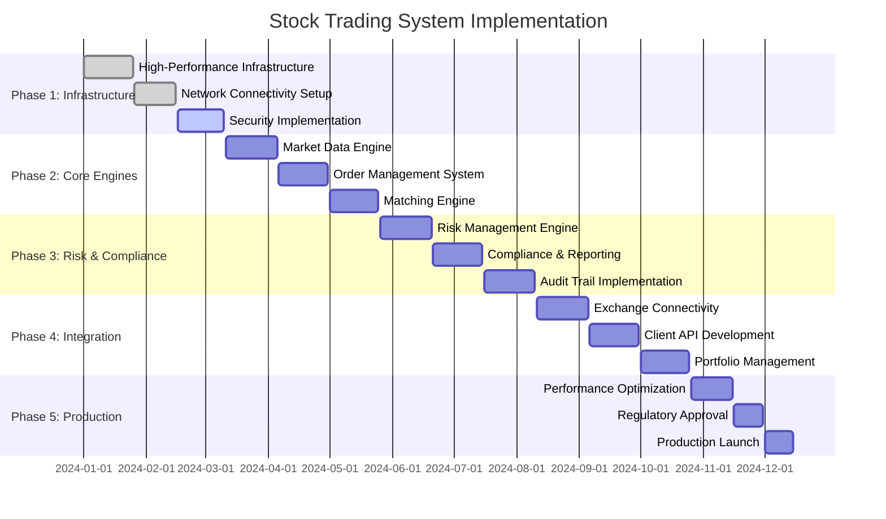

### 11.2 Technology Decisions & Trade-offs

**Latency vs Throughput:**
- **Ultra-Low Latency**: Optimize for sub-millisecond execution
- **High Throughput**: Handle millions of orders per second
- **Memory vs Storage**: In-memory processing for speed vs persistent storage for durability
- **Consistency vs Performance**: Strong consistency for trades vs eventual consistency for analytics

**Technology Stack:**
- **C++ vs Java**: C++ for matching engine, Java for business logic
- **Linux Kernel Bypass**: User-space networking for ultra-low latency
- **Hardware Acceleration**: FPGA for order processing, GPU for risk calculations
- **Database Selection**: In-memory for order books, ACID-compliant for settlements

**Regulatory Compliance:**
- **Audit Requirements**: Comprehensive audit trails for all transactions
- **Data Retention**: Long-term data retention for regulatory compliance
- **Reporting Automation**: Automated regulatory reporting and filing
- **Cross-Border Compliance**: Multi-jurisdiction regulatory compliance

**Future Evolution Path:**
- **Blockchain Integration**: Explore blockchain for settlement and clearing
- **AI/ML Enhancement**: Machine learning for market making and risk management
- **Quantum Computing**: Quantum algorithms for portfolio optimization
- **Cloud-Native Architecture**: Containerization and cloud-native deployment

**Technical Debt & Improvement Areas:**
- **Legacy System Integration**: Modernize legacy trading systems
- **Real-time Analytics**: Enhanced real-time market analytics
- **Mobile Trading**: Advanced mobile trading applications
- **Alternative Assets**: Support for cryptocurrencies and digital assets
