# Collaborative Document Editor System Design Architecture

## 1. Executive Summary & Requirements

### System Overview
A real-time collaborative document editing platform that enables multiple users to simultaneously edit documents with live synchronization, conflict resolution, and rich text formatting capabilities. The system provides seamless collaboration features, version control, and cross-platform compatibility similar to Google Docs or Microsoft 365.

### Functional Requirements
- **Real-time Collaboration**: Multiple users editing simultaneously with live updates
- **Rich Text Editing**: Support for formatting, images, tables, and multimedia content
- **Conflict Resolution**: Automatic resolution of concurrent editing conflicts
- **Version Control**: Document history, version tracking, and rollback capabilities
- **Commenting System**: Inline comments, suggestions, and review workflows
- **Sharing & Permissions**: Granular access control and sharing mechanisms
- **Offline Support**: Offline editing with synchronization when reconnected
- **Export/Import**: Support for various document formats (PDF, Word, etc.)
- **Real-time Cursors**: Show other users' cursors and selections
- **Document Templates**: Pre-built templates for different document types

### Non-Functional Requirements
- **Latency**: <100ms for real-time collaboration updates
- **Availability**: 99.99% uptime with global accessibility
- **Scalability**: Support 1M+ concurrent users and 10M+ documents
- **Consistency**: Strong consistency for document state across all users
- **Performance**: <2 seconds for document loading, smooth editing experience
- **Cross-platform**: Web, mobile, and desktop application support

### Key Constraints
- Handle network partitions and intermittent connectivity
- Maintain document integrity during concurrent edits
- Support various document formats and rich media content
- Ensure data privacy and security for sensitive documents
- Handle large documents with thousands of pages

### Success Metrics
- 99.99% availability for document editing services
- <50ms P95 latency for collaborative updates
- >99% conflict resolution accuracy
- <3 seconds document load time for 95% of requests
- Support 100+ concurrent editors per document

## 2. High-Level Architecture Overview

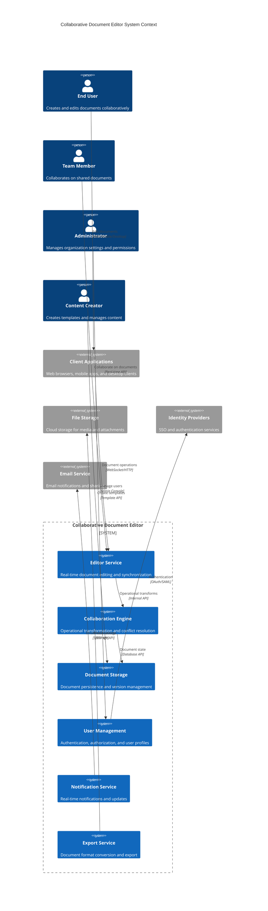

**Architectural Style Rationale**: Event-driven microservices with operational transformation chosen for:
- Real-time collaboration with low-latency synchronization
- Independent scaling of different editor functionalities
- Conflict resolution through operational transformation algorithms
- Support for multiple client types and platforms
- Flexible document format support and extensibility

## 3. Detailed System Architecture

### 3.1 AWS Service Stack Selection

**Real-time Communication:**
- **API Gateway WebSocket**: Real-time bidirectional communication
- **AppSync**: GraphQL API with real-time subscriptions
- **IoT Core**: Device connectivity for mobile and desktop clients
- **ElastiCache Redis**: Real-time session and collaboration state

**Application Services:**
- **EKS**: Kubernetes orchestration for microservices
- **Lambda**: Serverless functions for document processing
- **ECS Fargate**: Containerized services for document operations
- **Step Functions**: Workflow orchestration for complex operations

**Document Processing:**
- **Textract**: Extract text from images and scanned documents
- **Comprehend**: Natural language processing for document analysis
- **Translate**: Multi-language document translation
- **Polly**: Text-to-speech for accessibility features

**Storage Services:**
- **DynamoDB**: Document metadata and collaboration state
- **Aurora PostgreSQL**: User management and permissions
- **S3**: Document storage, media files, and backups
- **EFS**: Shared storage for temporary document processing

**Content Delivery:**
- **CloudFront**: Global CDN for client applications and media
- **S3 Transfer Acceleration**: Fast file uploads and downloads
- **Global Accelerator**: Network performance optimization

**Analytics and ML:**
- **Kinesis Data Streams**: Real-time collaboration analytics
- **SageMaker**: ML models for content suggestions and auto-completion
- **Athena**: Analytics queries on document usage patterns
- **QuickSight**: Business intelligence dashboards

**Security:**
- **Cognito**: User authentication and authorization
- **IAM**: Fine-grained access control for services
- **KMS**: Encryption key management for documents
- **WAF**: Web application firewall protection

### 3.2 Component Architecture Diagram

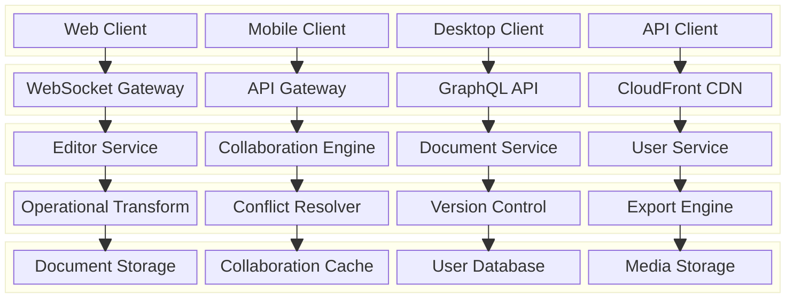

## 4. Data Architecture & Flow

### 4.1 Data Flow Diagrams

#### Real-time Collaborative Editing Flow
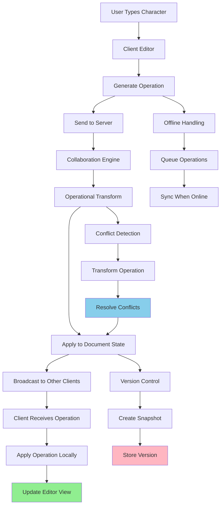

#### Document Loading and Initialization Flow
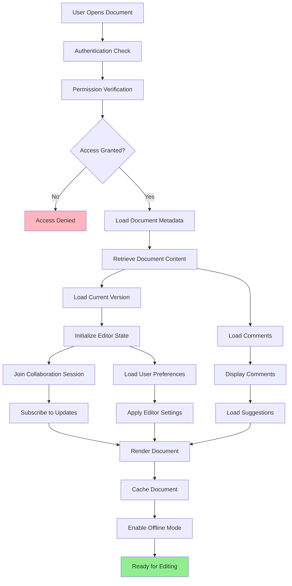

#### Version Control and History Management Flow
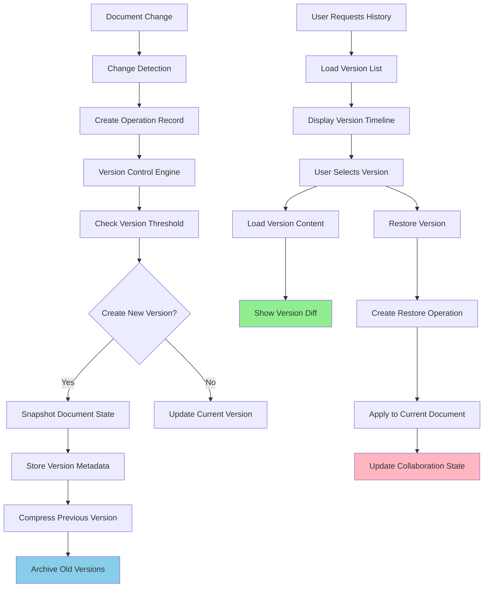

### 4.2 Database Design

#### Document Management Schema
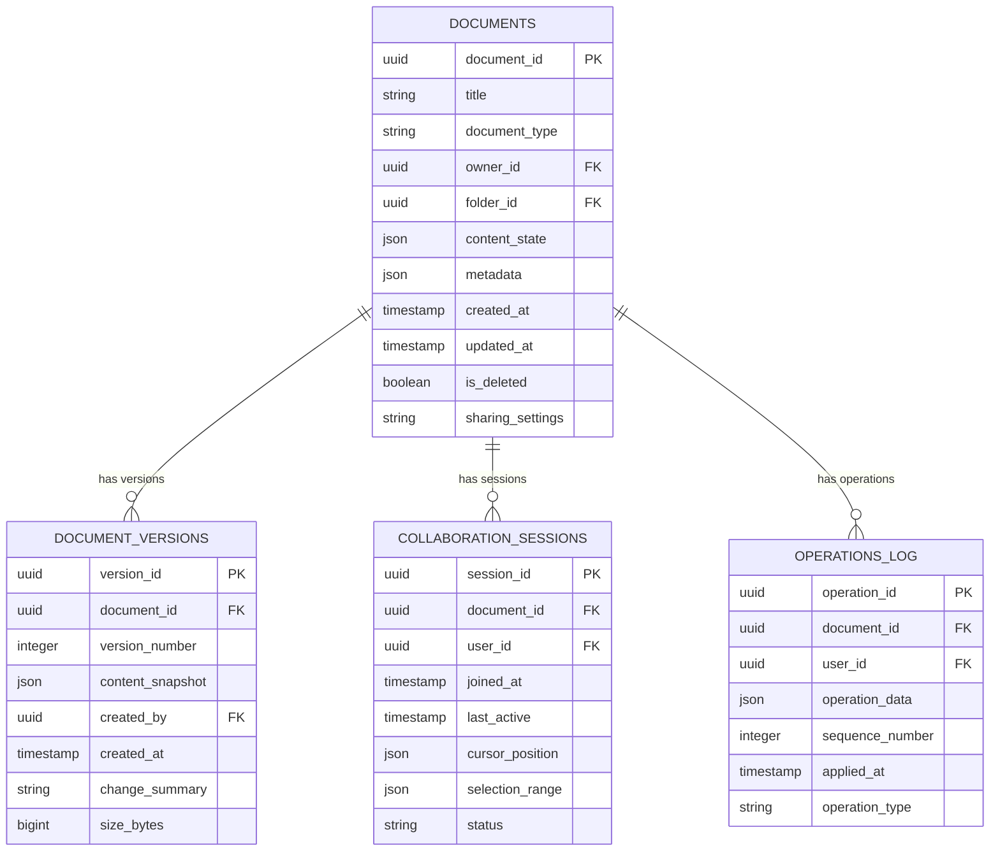

#### User and Permission Schema
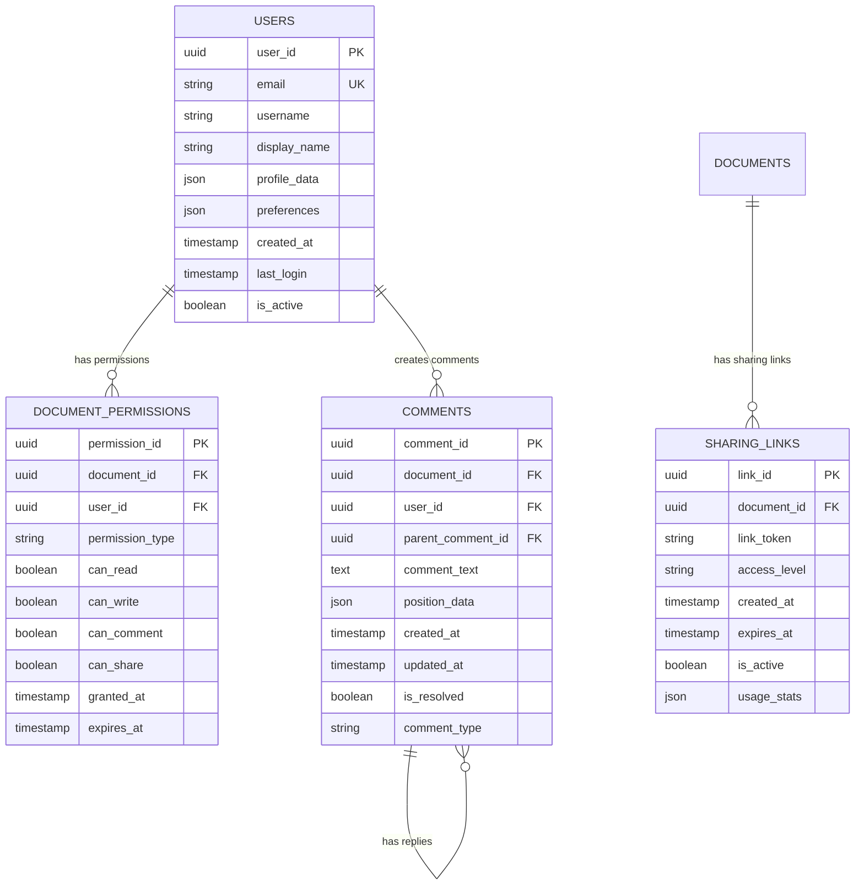

## 5. Detailed Component Design

### 5.1 Collaboration Engine

**Purpose & Responsibilities:**
- Implement operational transformation for concurrent editing
- Handle conflict resolution between simultaneous edits
- Maintain document consistency across all connected clients
- Manage real-time synchronization of document state
- Support various document operations (insert, delete, format, etc.)

**Operational Transformation:**
- **Transform Operations**: Adjust operations based on concurrent changes
- **Conflict Resolution**: Resolve conflicts using operational precedence
- **State Synchronization**: Maintain consistent document state
- **Operation Ordering**: Ensure proper ordering of operations
- **Convergence Guarantee**: Ensure all clients converge to same state

**Algorithms:**
- **Google's Operational Transform**: Industry-standard OT implementation
- **ShareJS Algorithm**: Real-time collaborative editing algorithm
- **CRDT (Conflict-free Replicated Data Types)**: Alternative to OT for specific use cases
- **Vector Clocks**: Logical timestamps for operation ordering

### 5.2 Editor Service

**Purpose & Responsibilities:**
- Handle real-time editing operations from clients
- Manage document formatting and rich text operations
- Process multimedia content insertion and management
- Implement undo/redo functionality with operation history
- Support various document formats and export capabilities

**Rich Text Features:**
- **Text Formatting**: Bold, italic, underline, fonts, colors
- **Paragraph Formatting**: Alignment, indentation, spacing, lists
- **Tables**: Create, edit, and format tables with complex layouts
- **Media Insertion**: Images, videos, links, and embedded content
- **Advanced Features**: Headers/footers, page breaks, table of contents

### 5.3 Document Storage Service

**Purpose & Responsibilities:**
- Persist document content and metadata
- Manage document versions and history
- Handle document templates and organizational structures
- Implement efficient storage and retrieval mechanisms
- Support document search and indexing

**Storage Optimization:**
- **Delta Compression**: Store only changes between versions
- **Content Deduplication**: Avoid storing duplicate content
- **Lazy Loading**: Load document sections on demand
- **Caching Strategy**: Cache frequently accessed documents
- **Archival Policies**: Move old versions to cheaper storage

### Critical User Journey Sequence Diagrams

#### Real-time Collaborative Editing
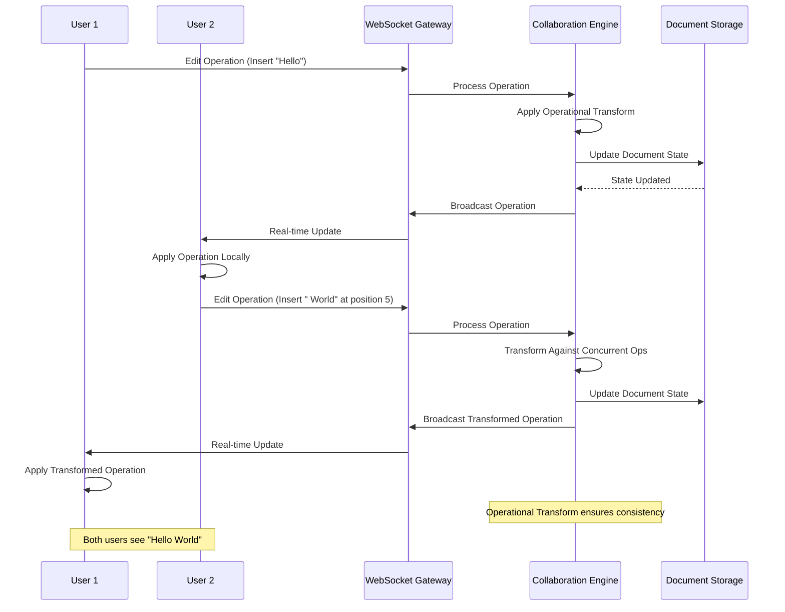

#### Document Version Management
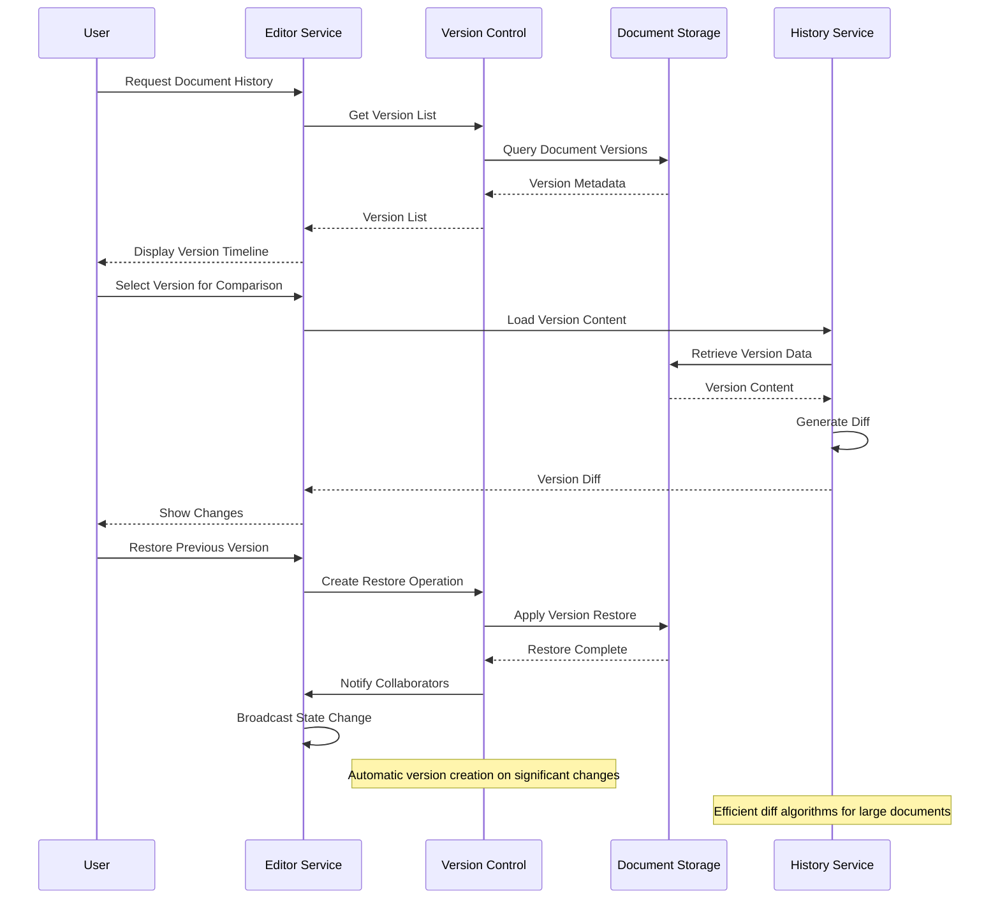

#### Offline Editing and Synchronization
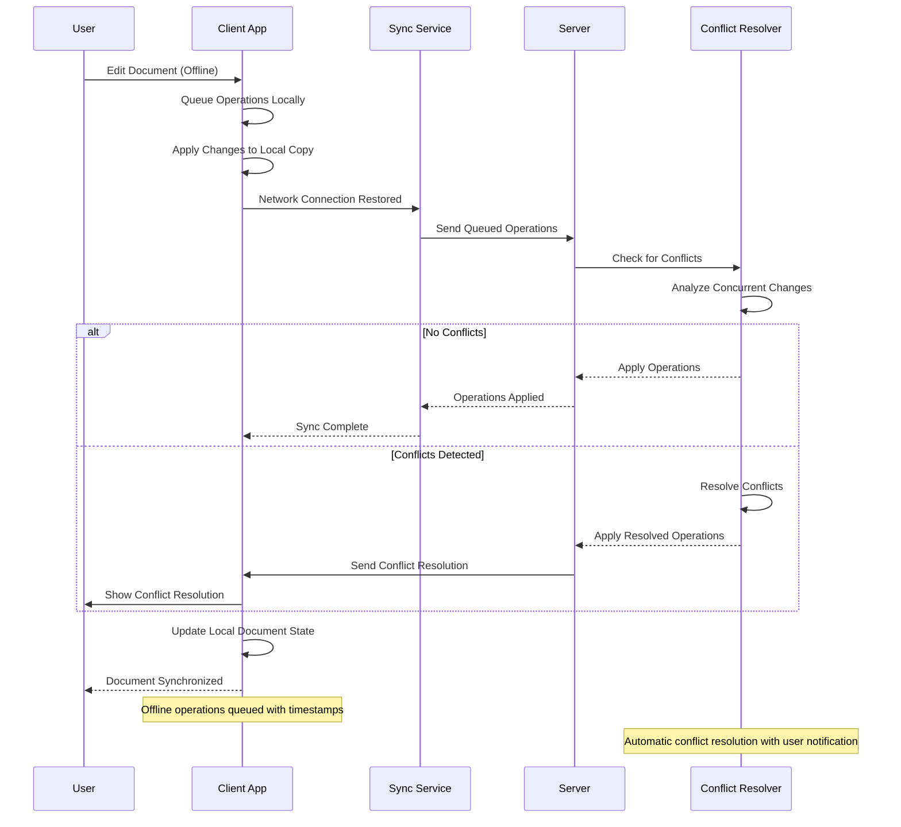

## 6. Scalability & Performance

### 6.1 Scaling Architecture

### 6.2 Performance Optimization

**Real-time Performance:**
- **WebSocket Optimization**: Efficient WebSocket connection management
- **Message Batching**: Batch multiple operations for network efficiency
- **Delta Synchronization**: Send only changes instead of full content
- **Client-side Caching**: Cache document content and operations locally

**Editor Performance:**
- **Virtual Scrolling**: Render only visible portions of large documents
- **Lazy Loading**: Load document sections and media on demand
- **Debounced Operations**: Batch rapid user inputs for efficiency
- **Memory Management**: Efficient memory usage for large documents

**Storage Performance:**
- **Content Compression**: Compress document content for storage and transfer
- **CDN Integration**: Global content delivery for media and static assets
- **Database Optimization**: Efficient queries and indexing strategies
- **Connection Pooling**: Optimize database connections for high concurrency

## 7. Reliability & Fault Tolerance

### 7.1 High Availability Design

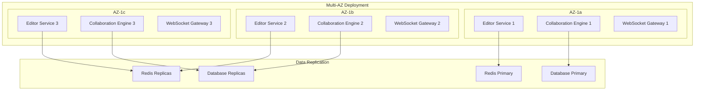

**Fault Tolerance Mechanisms:**
- **Graceful Degradation**: Maintain core editing functionality during outages
- **Circuit Breakers**: Prevent cascade failures between services
- **Retry Logic**: Intelligent retry mechanisms for failed operations
- **State Recovery**: Recover collaboration state after failures

### 7.2 Disaster Recovery

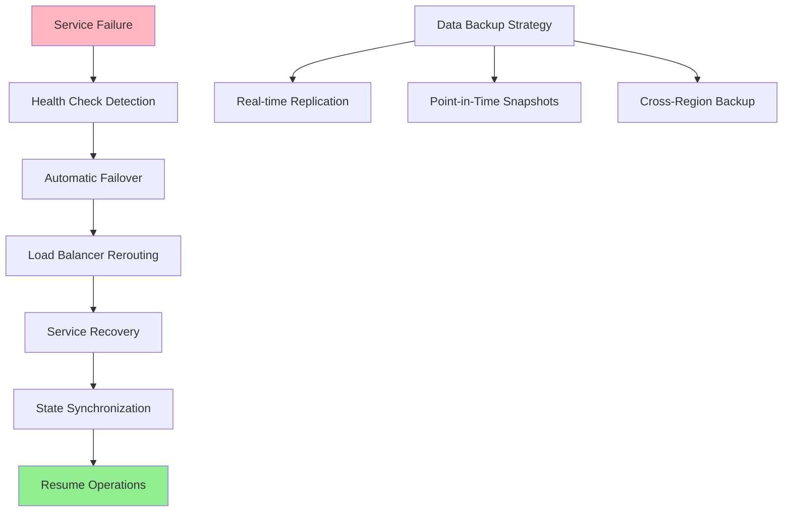

**RTO/RPO Targets:**
- **RTO**: 2 minutes for editor services, 5 minutes for full system recovery
- **RPO**: 30 seconds for document changes, near-zero for collaboration state
- **Data Consistency**: Strong consistency for document content
- **Recovery Testing**: Weekly automated disaster recovery testing

## 8. Security Architecture

### 8.1 Security Layers

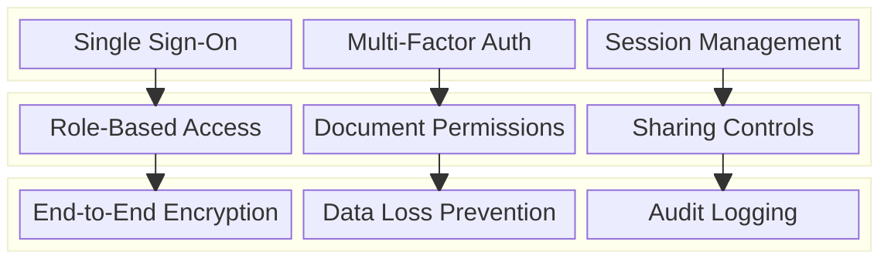

**Security Features:**
- **Authentication**: SSO integration with enterprise identity providers
- **Authorization**: Granular permissions for document access and operations
- **Encryption**: End-to-end encryption for document content and communications
- **Data Loss Prevention**: Prevent unauthorized sharing of sensitive content

**Privacy Protection:**
- **Data Anonymization**: Anonymize user data in analytics and logs
- **GDPR Compliance**: Right to be forgotten and data portability
- **Content Scanning**: Optional content scanning for compliance
- **Secure Sharing**: Encrypted sharing links with expiration and access controls

### 8.2 Document Security Flow

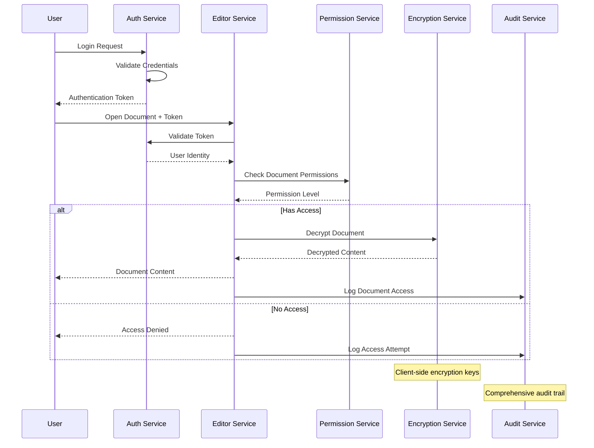

## 9. Monitoring & Observability

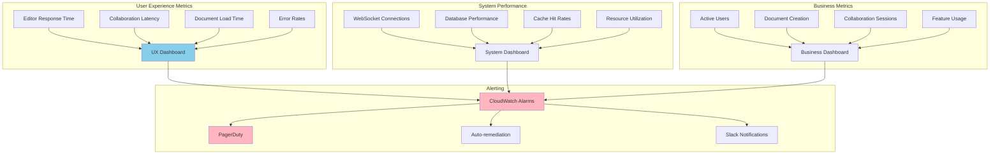

**Key Performance Indicators:**
- **User Experience**: Editor responsiveness, collaboration latency, document load times
- **System Health**: WebSocket connection stability, database performance, cache efficiency
- **Business Impact**: User engagement, document creation rates, collaboration effectiveness
- **Security**: Authentication success rates, permission violations, audit completeness

**Alerting Strategy:**
- **Critical**: Service outages, data corruption, security breaches
- **Warning**: High latency, increased error rates, capacity warnings
- **Info**: Usage trends, feature adoption, performance improvements

## 10. Cost Optimization

**Service-Level Cost Analysis:**
- **EKS**: $8,000/month (Microservices, 60 nodes with auto-scaling)
- **WebSocket API Gateway**: $3,000/month (Real-time connections)
- **DynamoDB**: $4,000/month (Document metadata and collaboration state)
- **Aurora PostgreSQL**: $3,000/month (User management and permissions)
- **ElastiCache Redis**: $2,500/month (Real-time collaboration cache)
- **S3 + CloudFront**: $2,000/month (Document storage and global delivery)
- **Lambda**: $1,500/month (Document processing functions)
- **Other Services**: $2,000/month (Monitoring, security, networking)
- **Total Estimated**: ~$26,000/month for 1M active users

**Cost Optimization Strategies:**
- **Spot Instances**: 60% cost reduction for batch processing workloads
- **Reserved Instances**: 40% savings on predictable compute workloads
- **S3 Intelligent Tiering**: Automatic cost optimization for document storage
- **Connection Optimization**: Efficient WebSocket connection management
- **Caching Strategy**: Reduce database queries through intelligent caching

**Revenue Model:**
- **Freemium**: Free tier with limited features and storage
- **Personal Plans**: $10/month for individual users
- **Business Plans**: $25/user/month for teams and organizations
- **Enterprise Plans**: $50/user/month with advanced security and compliance
- **API Access**: Additional fees for third-party integrations

## 11. Implementation Strategy

### 11.1 Migration/Deployment Plan

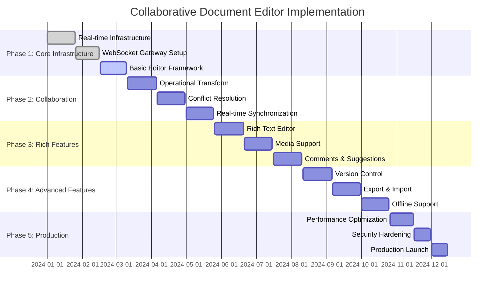

### 11.2 Technology Decisions & Trade-offs

**Collaboration Algorithm:**
- **Operational Transform vs CRDT**: OT chosen for proven real-time editing performance
- **Centralized vs Distributed**: Centralized approach for consistency guarantees
- **Synchronous vs Asynchronous**: Hybrid approach for optimal user experience
- **State-based vs Operation-based**: Operation-based for efficient network usage

**Client Architecture:**
- **Web-based vs Native**: Progressive Web App for cross-platform compatibility
- **React vs Vue vs Angular**: React chosen for ecosystem and performance
- **WebSocket vs Server-Sent Events**: WebSocket for bidirectional communication
- **Local Storage vs IndexedDB**: IndexedDB for offline document storage

**Storage Strategy:**
- **Document Storage**: JSON-based flexible schema for rich content
- **Version Control**: Delta-based storage for efficient version management
- **Media Handling**: Separate blob storage with CDN for global delivery
- **Caching**: Multi-level caching for performance optimization

**Future Evolution Path:**
- **AI Integration**: Smart suggestions, auto-completion, and content generation
- **Advanced Collaboration**: Video calls, screen sharing, and whiteboarding
- **Mobile Optimization**: Native mobile apps with full feature parity
- **Enterprise Features**: Advanced security, compliance, and integration capabilities

**Technical Debt & Improvement Areas:**
- **Performance Optimization**: Large document handling and memory management
- **Offline Capabilities**: Enhanced offline editing and conflict resolution
- **Accessibility**: Comprehensive accessibility features and compliance
- **Internationalization**: Multi-language support and right-to-left text
