# Social Network System Design Architecture

## 1. Executive Summary & Requirements

### System Overview
A comprehensive social networking platform that enables users to connect, share content, communicate, and build communities. The system supports user profiles, news feeds, messaging, content sharing, social graphs, and real-time interactions at massive scale similar to Facebook, Twitter, or LinkedIn.

### Functional Requirements
- **User Management**: Registration, authentication, profiles, and account management
- **Social Graph**: Friend connections, followers, and relationship management
- **News Feed**: Personalized content feeds with algorithmic ranking
- **Content Creation**: Posts, photos, videos, stories, and multimedia sharing
- **Messaging**: Real-time messaging, group chats, and video calls
- **Notifications**: Real-time notifications for interactions and updates
- **Groups & Communities**: Create and manage interest-based communities
- **Search & Discovery**: Search for users, content, groups, and hashtags
- **Privacy Controls**: Granular privacy settings and content visibility
- **Content Moderation**: Automated and manual content moderation systems

### Non-Functional Requirements
- **Scale**: 1B+ registered users, 100M+ daily active users
- **Performance**: <200ms for feed loading, <100ms for interactions
- **Availability**: 99.99% uptime with global distribution
- **Consistency**: Eventual consistency for feeds, strong for user data
- **Storage**: Petabyte-scale content storage with global distribution
- **Real-time**: <1 second for notifications and messaging

### Key Constraints
- Handle viral content and traffic spikes gracefully
- Maintain user privacy and data protection compliance
- Support multiple content types and media formats
- Scale recommendation algorithms for personalized feeds
- Handle diverse global user base with localization

### Success Metrics
- 99.99% availability during peak usage periods
- <150ms P95 response time for core user interactions
- >80% user engagement with personalized feeds
- <2 seconds average content upload time
- Support 10M+ concurrent active users

## 2. High-Level Architecture Overview

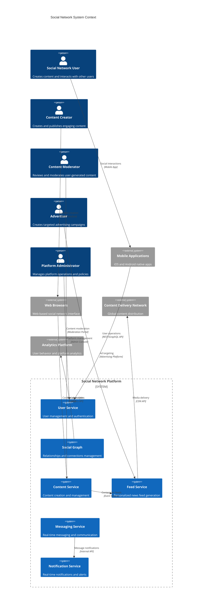

**Architectural Style Rationale**: Event-driven microservices architecture with CQRS chosen for:
- Independent scaling of different social features (feeds, messaging, content)
- Real-time event processing for notifications and live updates
- Support for massive user base with geographic distribution
- Flexible content recommendation and feed generation algorithms
- Integration with various client applications and third-party services

## 3. Detailed System Architecture

### 3.1 AWS Service Stack Selection

**Application Services:**
- **EKS**: Kubernetes orchestration for microservices at scale
- **ECS Fargate**: Serverless containers for event processing
- **Lambda**: Serverless functions for real-time processing
- **API Gateway**: API management with caching and rate limiting

**Content & Media:**
- **S3**: Massive-scale content storage with intelligent tiering
- **CloudFront**: Global CDN for content delivery and caching
- **Elemental MediaConvert**: Video processing and transcoding
- **Rekognition**: Image and video content analysis

**Real-time Services:**
- **AppSync**: GraphQL API with real-time subscriptions
- **IoT Core**: Real-time messaging and presence management
- **Kinesis Data Streams**: High-throughput event streaming
- **ElastiCache Redis**: Real-time caching and session management

**Data Storage:**
- **DynamoDB**: User profiles, social graph, and activity feeds
- **Aurora PostgreSQL**: Structured data and complex queries
- **DocumentDB**: Content metadata and flexible schemas
- **Neptune**: Graph database for social relationships

**Machine Learning:**
- **SageMaker**: ML models for content recommendation and ranking
- **Personalize**: Real-time personalization and recommendation engine
- **Comprehend**: Natural language processing for content analysis
- **Textract**: Text extraction from images and documents

**Search & Analytics:**
- **OpenSearch**: Content search and discovery
- **Kinesis Analytics**: Real-time analytics and insights
- **Athena**: Big data analytics and reporting
- **QuickSight**: Business intelligence dashboards

**Security & Compliance:**
- **Cognito**: User authentication and identity management
- **WAF**: Web application firewall and DDoS protection
- **KMS**: Encryption key management
- **Macie**: Data privacy and security scanning

### 3.2 Component Architecture Diagram

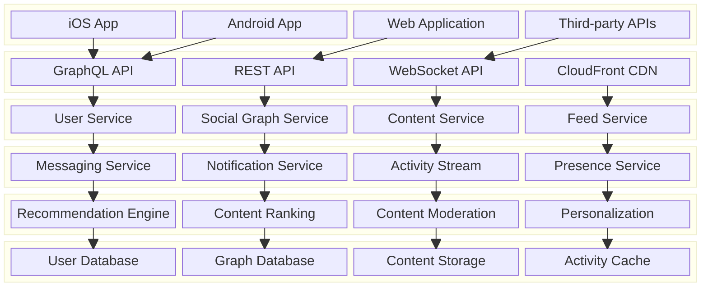

## 4. Data Architecture & Flow

### 4.1 Data Flow Diagrams

#### News Feed Generation and Personalization Flow
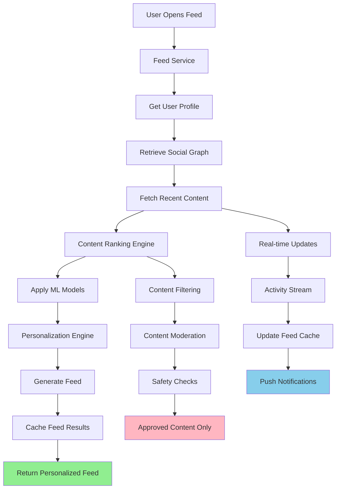

#### Content Creation and Distribution Flow
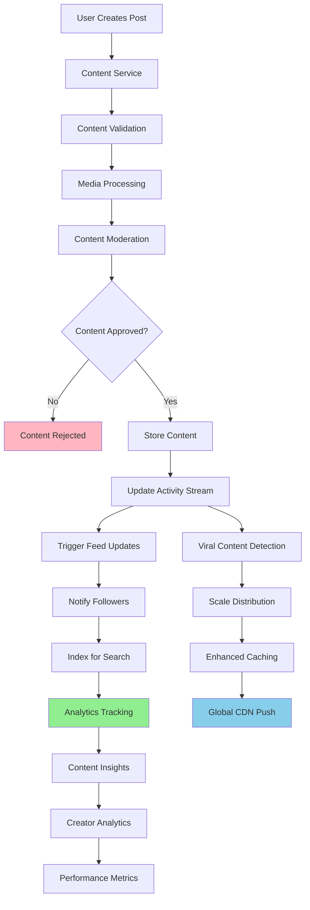

#### Real-time Messaging and Communication Flow
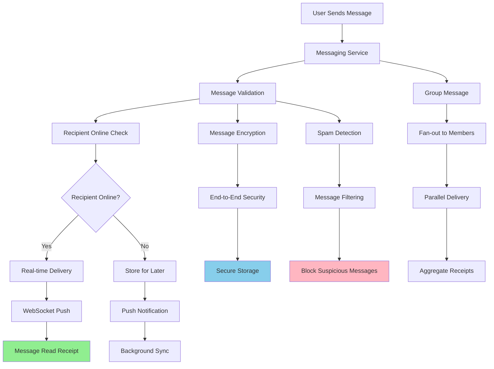

### 4.2 Database Design

#### User and Social Graph Schema
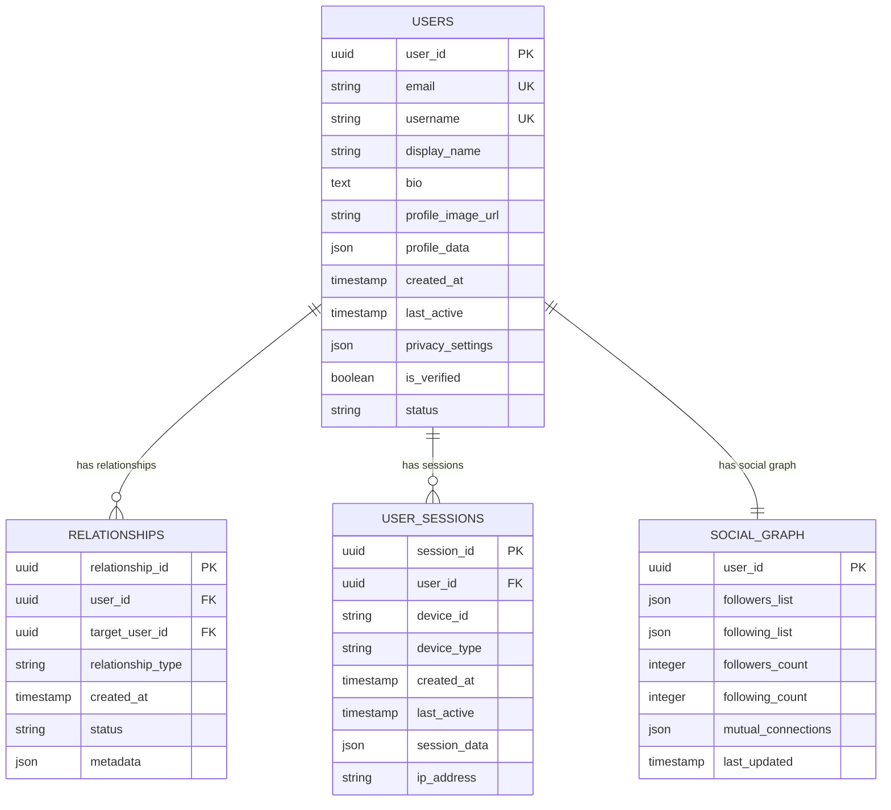

#### Content and Activity Schema
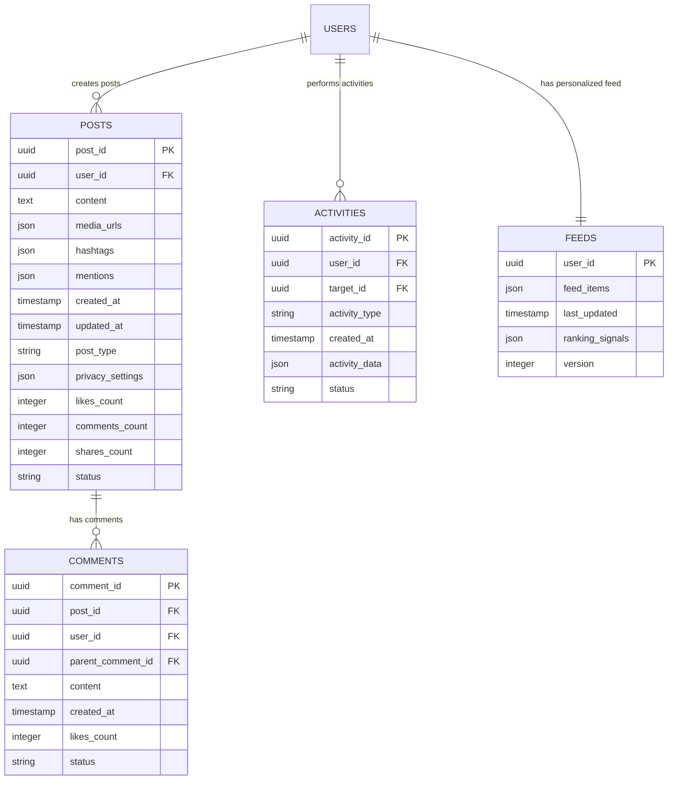

## 5. Detailed Component Design

### 5.1 Feed Generation Service

**Purpose & Responsibilities:**
- Generate personalized news feeds for each user
- Implement feed ranking algorithms based on user preferences
- Handle real-time feed updates and content insertion
- Manage feed caching and performance optimization
- Support different feed types (timeline, discovery, trending)

**Feed Algorithms:**
- **Chronological Feed**: Time-based ordering of content
- **Algorithmic Feed**: ML-based ranking and personalization
- **Interest-based Feed**: Content based on user interests and topics
- **Social Signals**: Prioritize content from close connections
- **Engagement Optimization**: Promote high-engagement content

**Performance Optimizations:**
- **Pre-computed Feeds**: Generate feeds in advance for active users
- **Incremental Updates**: Update feeds with new content efficiently
- **Caching Strategy**: Multi-layer caching for different user segments
- **Lazy Loading**: Load additional content on-demand

### 5.2 Social Graph Service

**Purpose & Responsibilities:**
- Manage user relationships and social connections
- Handle friend requests, follows, and connection management
- Provide social graph queries and traversal capabilities
- Support privacy controls for relationship visibility
- Generate social recommendations and suggestions

**Graph Operations:**
- **Connection Management**: Add, remove, and modify relationships
- **Graph Traversal**: Find mutual friends, shortest paths, communities
- **Recommendation Engine**: Suggest new connections based on graph analysis
- **Privacy Enforcement**: Respect user privacy settings for connections
- **Graph Analytics**: Analyze social network patterns and metrics

### 5.3 Content Moderation Service

**Purpose & Responsibilities:**
- Automatically detect and filter inappropriate content
- Implement community guidelines and content policies
- Handle user reports and manual moderation workflows
- Support different moderation strategies for various content types
- Provide appeals process and moderation transparency

**Moderation Techniques:**
- **AI-based Detection**: Machine learning models for content classification
- **Rule-based Filtering**: Automated rules for obvious violations
- **Human Review**: Manual moderation for complex cases
- **Community Moderation**: User-driven reporting and voting systems
- **Proactive Scanning**: Continuous monitoring of platform content

### Critical User Journey Sequence Diagrams

#### User Registration and Onboarding
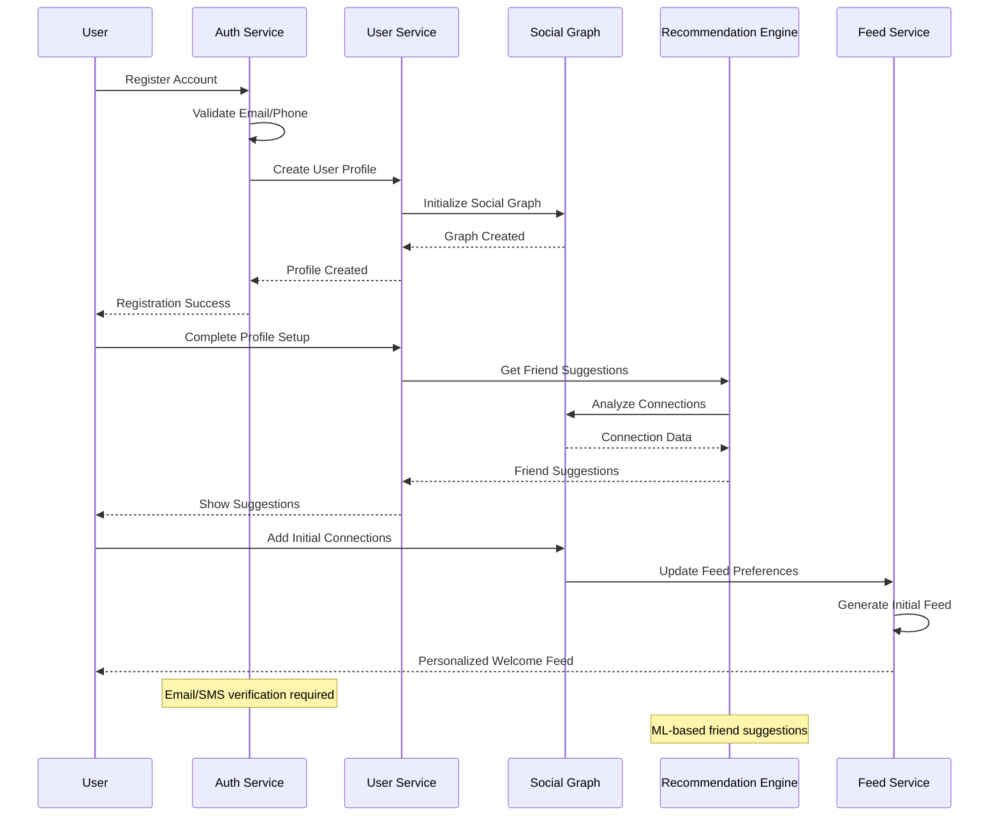

#### Content Sharing and Viral Distribution
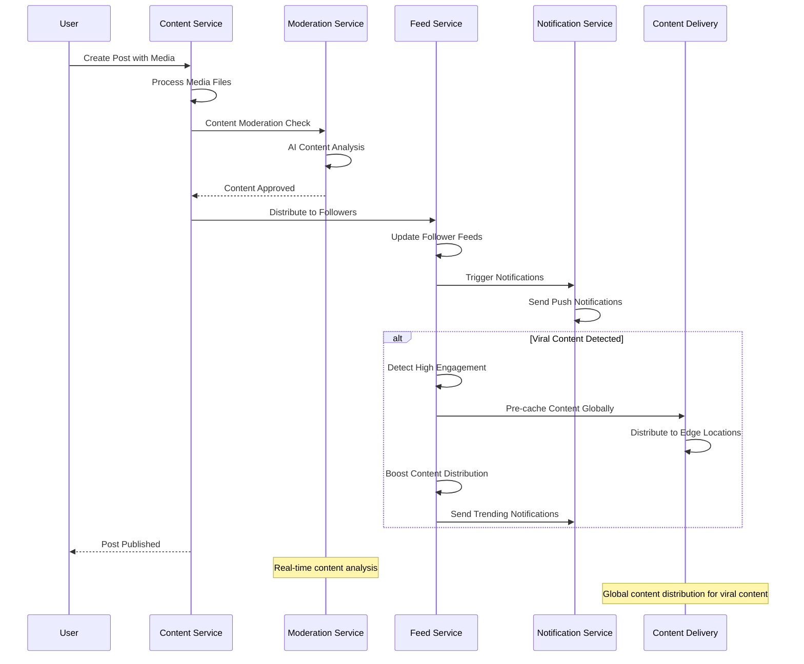

#### Real-time Messaging Flow
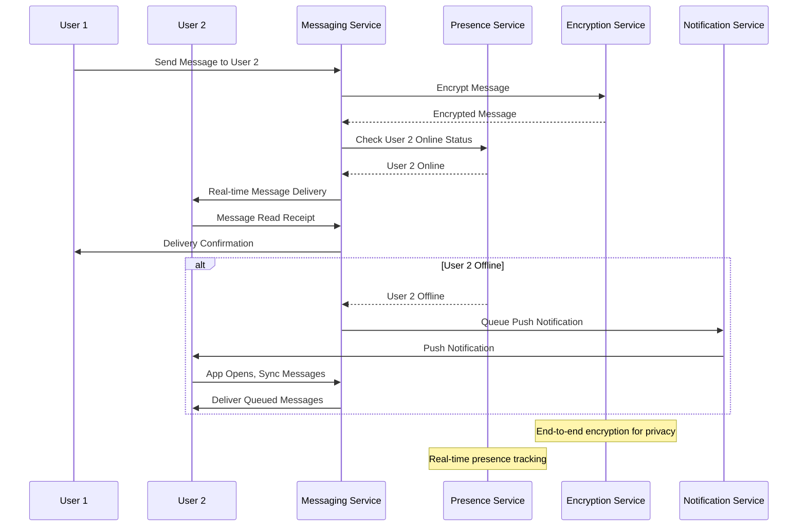

## 6. Scalability & Performance

### 6.1 Scaling Architecture

```mermaid
flowchart TD
    subgraph "User Base Scaling"
        A[User Growth] --> B[Horizontal Service Scaling]
        B --> C[Database Sharding]
        C --> D[Global Distribution]
    end
    
    subgraph "Content Scaling"
        E[Content Volume Growth] --> F[CDN Expansion]
        F --> G[Storage Tiering]
        G --> H[Media Processing Pipeline]
    end
    
    subgraph "Real-time Scaling"
        I[Concurrent Users] --> J[WebSocket Scaling]
        J --> K[Message Queue Scaling]
        K --> L[Notification Service Scaling]
    end
    
    subgraph "Feed Scaling"
        M[Feed Complexity] --> N[ML Pipeline Scaling]
        N --> O[Caching Strategy]
        O --> P[Pre-computation Optimization]
    end
    
    style D fill:#87CEEB
    style H fill:#90EE90
    style L fill:#FFB6C1
    style P fill:#DDA0DD
```

### 6.2 Performance Optimization

**Feed Performance:**
- **Pre-computed Feeds**: Generate feeds for active users in advance
- **Incremental Updates**: Efficiently update feeds with new content
- **Smart Caching**: Cache feeds based on user activity patterns
- **Lazy Loading**: Load additional content as user scrolls

**Content Delivery:**
- **Global CDN**: Distribute content globally for low-latency access
- **Image Optimization**: Multiple formats and sizes for different devices
- **Video Streaming**: Adaptive bitrate streaming for optimal quality
- **Edge Caching**: Cache popular content at edge locations

**Database Performance:**
- **Read Replicas**: Scale read operations across multiple replicas
- **Sharding Strategy**: Partition data by user ID and geographic region
- **Caching Layers**: Multi-level caching for frequently accessed data
- **Query Optimization**: Optimize complex social graph queries

## 7. Reliability & Fault Tolerance

### 7.1 High Availability Design

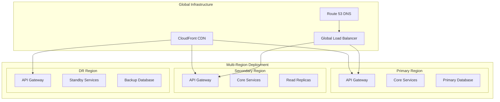

**Fault Tolerance Mechanisms:**
- **Circuit Breakers**: Prevent cascade failures between services
- **Graceful Degradation**: Maintain core functionality during outages
- **Retry Logic**: Intelligent retry mechanisms with exponential backoff
- **Bulkhead Pattern**: Isolate critical social features

### 7.2 Disaster Recovery

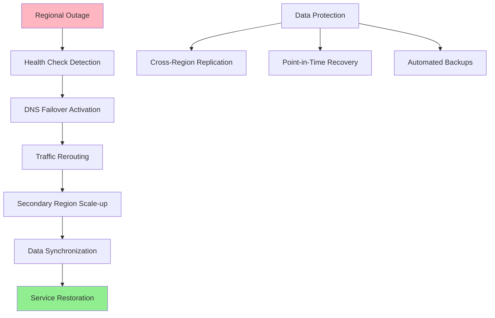

**RTO/RPO Targets:**
- **RTO**: 5 minutes for core social features, 15 minutes for full functionality
- **RPO**: 1 minute for user-generated content, 5 minutes for social graph data
- **Data Consistency**: Strong consistency for user data, eventual for feeds
- **Recovery Testing**: Monthly disaster recovery drills

## 8. Security Architecture

### 8.1 Security Layers

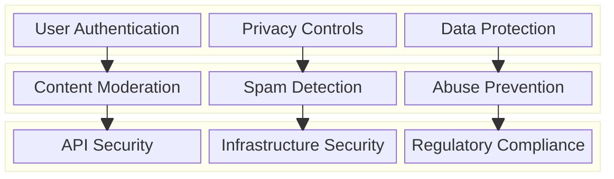

**Security Features:**
- **Multi-Factor Authentication**: Enhanced security for user accounts
- **End-to-End Encryption**: Secure messaging and private communications
- **Privacy Controls**: Granular privacy settings for content and profile
- **Content Moderation**: AI-powered content filtering and human review

**Data Protection:**
- **GDPR Compliance**: Right to be forgotten and data portability
- **Data Minimization**: Collect only necessary user data
- **Consent Management**: Granular consent for data usage
- **Audit Trails**: Comprehensive logging for compliance

### 8.2 Privacy and Safety Flow

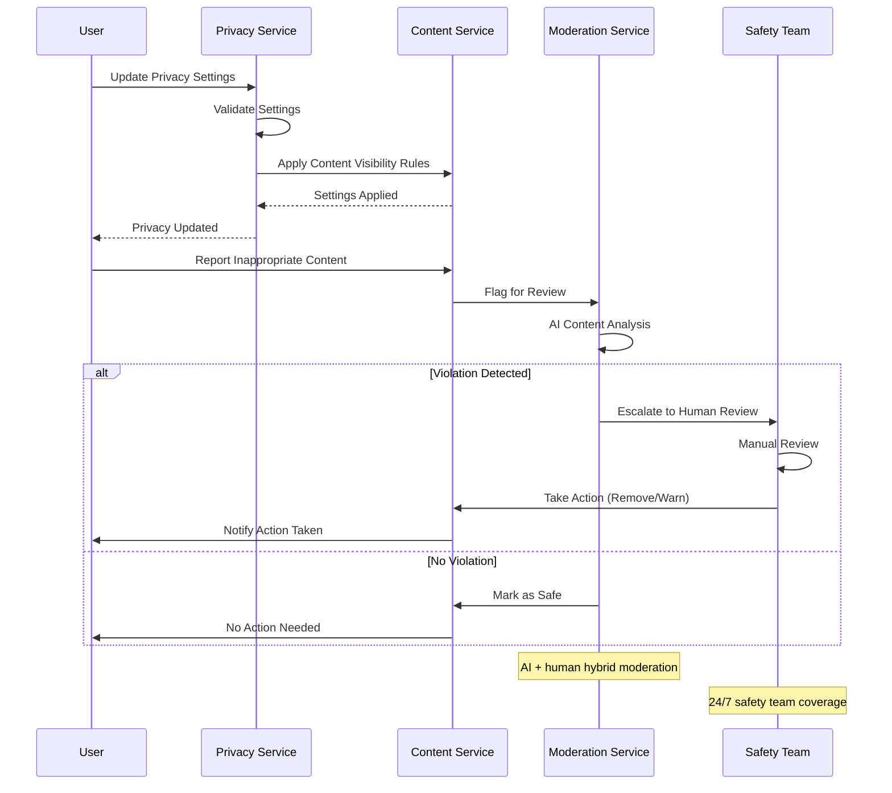

## 9. Monitoring & Observability

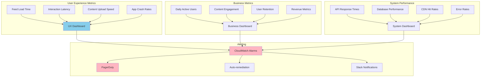

**Key Performance Indicators:**
- **User Engagement**: Daily/monthly active users, session duration, content interactions
- **Content Performance**: Upload success rates, content reach, engagement metrics
- **System Health**: API latencies, error rates, database performance, CDN efficiency
- **Safety Metrics**: Content moderation accuracy, user reports, safety incidents

**Alerting Strategy:**
- **Critical**: Service outages, security breaches, data loss, safety incidents
- **Warning**: High latency, increased error rates, content moderation backlogs
- **Info**: Traffic spikes, viral content, feature usage trends

## 10. Cost Optimization

**Service-Level Cost Analysis:**
- **EKS**: $20,000/month (Microservices, 200+ nodes with auto-scaling)
- **DynamoDB**: $15,000/month (User data, social graph, activity feeds)
- **S3 + CloudFront**: $12,000/month (Content storage and global delivery)
- **Aurora PostgreSQL**: $8,000/month (Structured data with read replicas)
- **ElastiCache**: $6,000/month (Feed caching and session management)
- **SageMaker**: $5,000/month (ML models for recommendations and ranking)
- **Kinesis**: $4,000/month (Real-time event streaming)
- **Other Services**: $10,000/month (Lambda, API Gateway, monitoring, etc.)
- **Total Estimated**: ~$80,000/month for 100M active users

**Cost Optimization Strategies:**
- **Spot Instances**: 60% cost reduction for batch processing and ML training
- **Reserved Instances**: 40% savings on predictable compute workloads
- **S3 Intelligent Tiering**: Automatic cost optimization for content storage
- **CDN Optimization**: Efficient caching to reduce origin costs
- **Database Optimization**: Query optimization and connection pooling

**Revenue Model:**
- **Advertising**: Targeted ads in feeds and stories ($50B+ annual revenue potential)
- **Premium Subscriptions**: Ad-free experience and enhanced features ($10/month)
- **Creator Monetization**: Revenue sharing with content creators
- **Enterprise Solutions**: Business profiles and marketing tools
- **Virtual Goods**: In-app purchases and digital gifts

## 11. Implementation Strategy

### 11.1 Migration/Deployment Plan

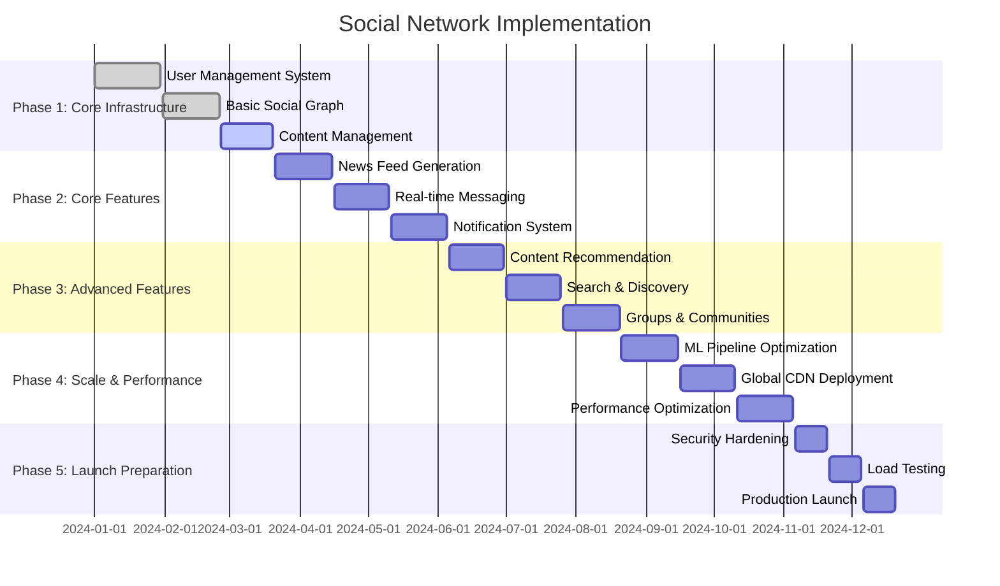

### 11.2 Technology Decisions & Trade-offs

**Database Strategy:**
- **Graph vs Relational**: Neptune for social graph, Aurora for structured data
- **NoSQL vs SQL**: DynamoDB for user profiles and feeds, PostgreSQL for complex queries
- **Consistency**: Strong consistency for user data, eventual consistency for feeds
- **Sharding**: Partition by user ID and geographic region for optimal performance

**Feed Algorithm:**
- **Chronological vs Algorithmic**: Hybrid approach with user preference
- **Real-time vs Batch**: Real-time updates with batch optimization
- **Personalization**: ML-based ranking with privacy-preserving techniques
- **Content Diversity**: Balance between relevance and content variety

**Content Strategy:**
- **Storage Tiering**: Hot content on fast storage, cold content on cheaper tiers
- **Media Processing**: Serverless processing for scalability and cost efficiency
- **CDN Strategy**: Global distribution with edge computing capabilities
- **Compression**: Advanced compression for bandwidth optimization

**Future Evolution Path:**
- **AI Integration**: Advanced AI for content creation and curation
- **AR/VR Features**: Immersive social experiences and virtual worlds
- **Blockchain Integration**: Decentralized identity and content ownership
- **Edge Computing**: Real-time processing at edge locations

**Technical Debt & Improvement Areas:**
- **Advanced Personalization**: More sophisticated ML models for content ranking
- **Real-time Analytics**: Enhanced real-time insights and recommendations
- **Mobile Optimization**: Native app performance and offline capabilities
- **Accessibility**: Comprehensive accessibility features for diverse users
