# Gaming Leaderboard System Design Architecture

## 1. Executive Summary & Requirements

### System Overview
A high-performance gaming leaderboard system that tracks player scores, rankings, and achievements across multiple games with real-time updates, global and regional leaderboards, and social features. The system handles millions of players and score updates with low latency and high accuracy similar to systems used by major gaming platforms.

### Functional Requirements
- **Score Management**: Accept and validate score submissions from games
- **Real-time Rankings**: Maintain live leaderboards with instant updates
- **Multi-Game Support**: Handle multiple games with different scoring systems
- **Time-based Leaderboards**: Daily, weekly, monthly, and all-time rankings
- **Regional Leaderboards**: Geographic and demographic-based rankings
- **Social Features**: Friends leaderboards and social comparisons
- **Achievement System**: Track and award achievements and badges
- **Historical Data**: Maintain score history and trend analysis
- **Anti-Cheat Protection**: Detect and prevent score manipulation
- **Leaderboard APIs**: RESTful APIs for game integration

### Non-Functional Requirements
- **Latency**: <50ms for score updates, <100ms for leaderboard queries
- **Throughput**: Handle 1M+ score updates per second during peak times
- **Availability**: 99.99% uptime for leaderboard services
- **Scalability**: Support 100M+ players across thousands of games
- **Consistency**: Strong consistency for score updates and rankings
- **Real-time**: <1 second for leaderboard position updates

### Key Constraints
- Handle score submission spikes during events and tournaments
- Maintain ranking accuracy during high-frequency updates
- Support various game genres with different scoring mechanics
- Prevent cheating and score manipulation attempts
- Scale across global player base with regional preferences

### Success Metrics
- 99.99% availability for score submission and leaderboard queries
- <25ms P95 latency for score updates
- >99.9% accuracy in leaderboard rankings
- Support 10K+ concurrent score updates per game
- Zero tolerance for fraudulent scores in rankings

## 2. High-Level Architecture Overview

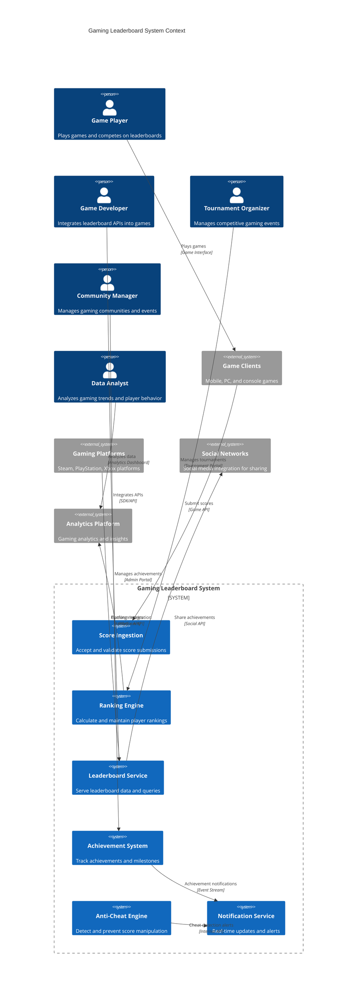

**Architectural Style Rationale**: Event-driven microservices with real-time processing chosen for:
- High-throughput score ingestion with real-time ranking updates
- Independent scaling of different gaming features (scores, rankings, achievements)
- Support for multiple games with varying requirements
- Real-time event processing for achievements and notifications
- Integration with various gaming platforms and social networks

## 3. Detailed System Architecture

### 3.1 AWS Service Stack Selection

**Real-time Processing:**
- **Kinesis Data Streams**: High-throughput score ingestion and processing
- **Kinesis Analytics**: Real-time score analysis and ranking calculations
- **Lambda**: Serverless functions for event processing and triggers
- **SQS**: Message queuing for score processing workflows

**Data Storage:**
- **DynamoDB**: High-performance player scores and rankings
- **ElastiCache Redis**: Real-time leaderboard caching and session management
- **Aurora PostgreSQL**: Game metadata and complex analytics queries
- **S3**: Historical data archival and analytics datasets

**Computing Services:**
- **EKS**: Kubernetes for microservices orchestration
- **ECS Fargate**: Containerized services for ranking calculations
- **Batch**: Large-scale batch processing for leaderboard recalculations
- **EC2**: High-performance instances for anti-cheat processing

**API and Integration:**
- **API Gateway**: Game API management with rate limiting
- **AppSync**: GraphQL API for real-time leaderboard subscriptions
- **EventBridge**: Event routing for achievements and notifications
- **Step Functions**: Workflow orchestration for complex operations

**Machine Learning:**
- **SageMaker**: ML models for cheat detection and player behavior analysis
- **Kinesis Analytics**: Real-time anomaly detection in score patterns
- **Comprehend**: Text analysis for player communications
- **Fraud Detector**: Automated fraud detection for suspicious scores

**Monitoring:**
- **CloudWatch**: Comprehensive monitoring and custom metrics
- **X-Ray**: Distributed tracing for score submission flows
- **OpenSearch**: Log analysis and anti-cheat investigations
- **QuickSight**: Gaming analytics and business intelligence

### 3.2 Component Architecture Diagram

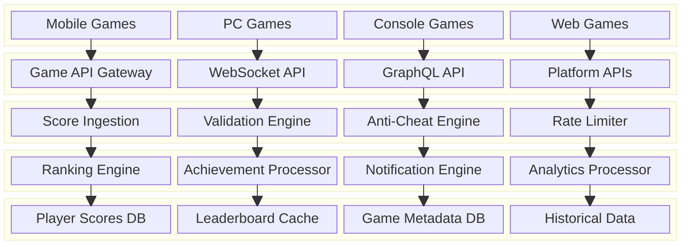

## 4. Data Architecture & Flow

### 4.1 Data Flow Diagrams

#### Score Submission and Processing Flow
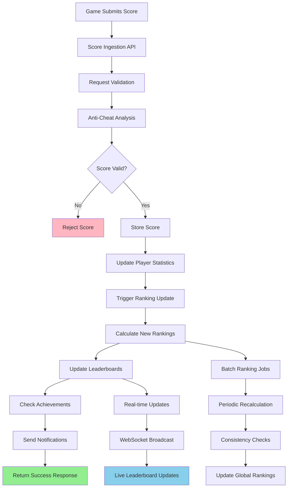

#### Leaderboard Query and Caching Flow
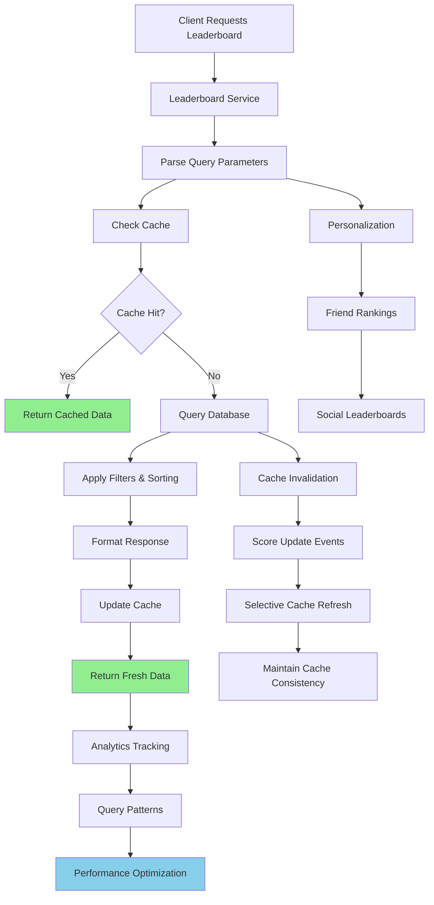

#### Anti-Cheat Detection and Response Flow
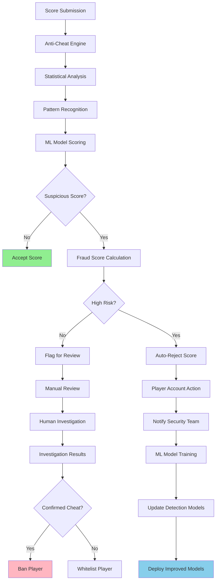

### 4.2 Database Design

#### Player and Score Management Schema
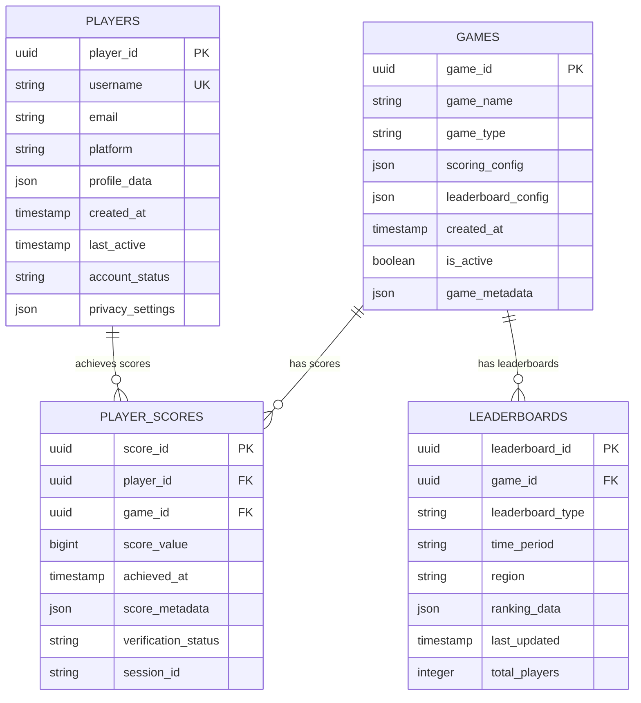

#### Achievement and Social Features Schema
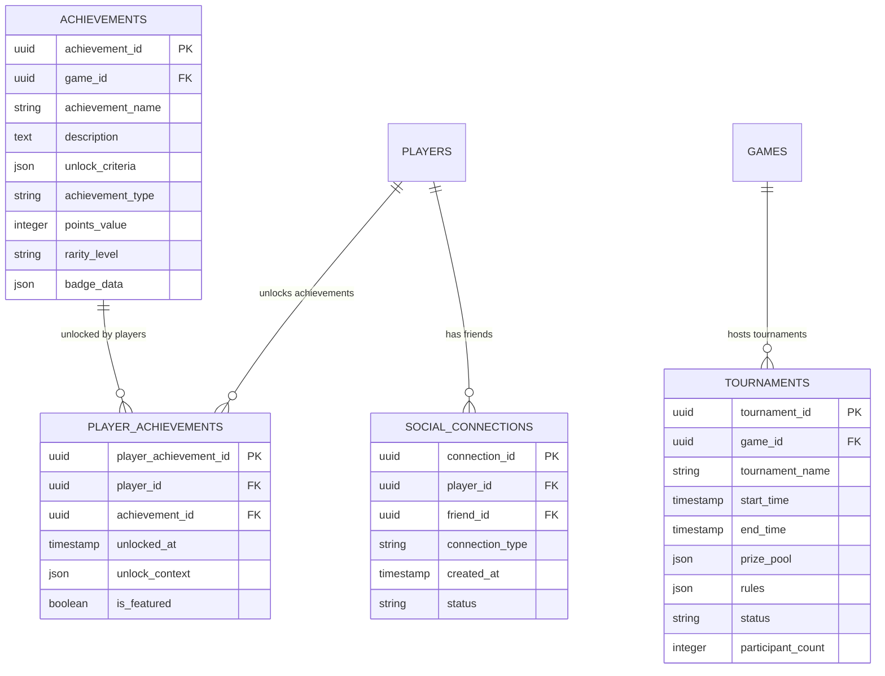

## 5. Detailed Component Design

### 5.1 Ranking Engine

**Purpose & Responsibilities:**
- Calculate and maintain real-time player rankings across all games
- Handle different ranking algorithms (ELO, percentile, absolute score)
- Manage time-based leaderboards (daily, weekly, monthly, all-time)
- Support regional and demographic-based rankings
- Optimize ranking calculations for high-throughput scenarios

**Ranking Algorithms:**
- **Absolute Score Ranking**: Direct score-based rankings
- **ELO Rating System**: Skill-based ranking for competitive games
- **Percentile Ranking**: Relative performance against player base
- **Seasonal Rankings**: Time-based ranking resets and seasons
- **Weighted Scoring**: Multi-factor scoring with different weights

**Performance Optimizations:**
- **Incremental Updates**: Update rankings without full recalculation
- **Batch Processing**: Periodic batch jobs for consistency checks
- **Caching Strategy**: Cache popular leaderboards and ranking segments
- **Parallel Processing**: Distribute ranking calculations across multiple workers

### 5.2 Anti-Cheat Engine

**Purpose & Responsibilities:**
- Detect suspicious score patterns and potential cheating attempts
- Implement statistical analysis and machine learning for cheat detection
- Maintain player behavior profiles and anomaly detection
- Handle automated responses and manual review workflows
- Continuously improve detection algorithms based on new cheat patterns

**Detection Techniques:**
- **Statistical Analysis**: Identify statistically impossible scores
- **Pattern Recognition**: Detect suspicious scoring patterns and timing
- **Behavioral Analysis**: Analyze player behavior and gameplay patterns
- **Machine Learning**: ML models trained on known cheat patterns
- **Community Reporting**: Player-driven reporting and verification

**Response Actions:**
- **Score Rejection**: Automatically reject suspicious scores
- **Account Flagging**: Flag accounts for manual review
- **Temporary Suspension**: Suspend accounts pending investigation
- **Permanent Ban**: Ban confirmed cheaters from leaderboards
- **Appeal Process**: Allow legitimate players to appeal decisions

### 5.3 Achievement System

**Purpose & Responsibilities:**
- Track player progress towards achievements and milestones
- Implement complex achievement criteria and unlock conditions
- Handle achievement notifications and social sharing
- Support dynamic achievements and limited-time events
- Provide achievement analytics and player engagement insights

**Achievement Types:**
- **Score-based**: Achievements based on score thresholds
- **Progression**: Achievements for game progression milestones
- **Social**: Achievements for social interactions and competitions
- **Rare**: Special achievements for exceptional performances
- **Seasonal**: Limited-time achievements for events and seasons

### Critical User Journey Sequence Diagrams

#### High-Frequency Score Submission
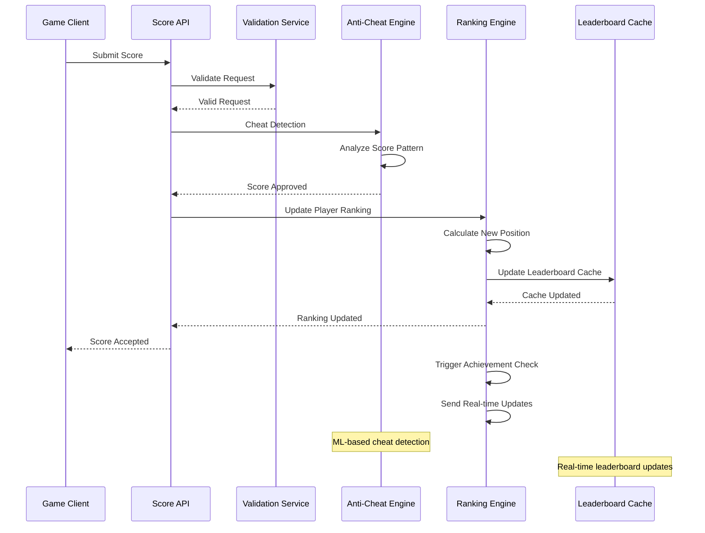

#### Tournament Leaderboard Management
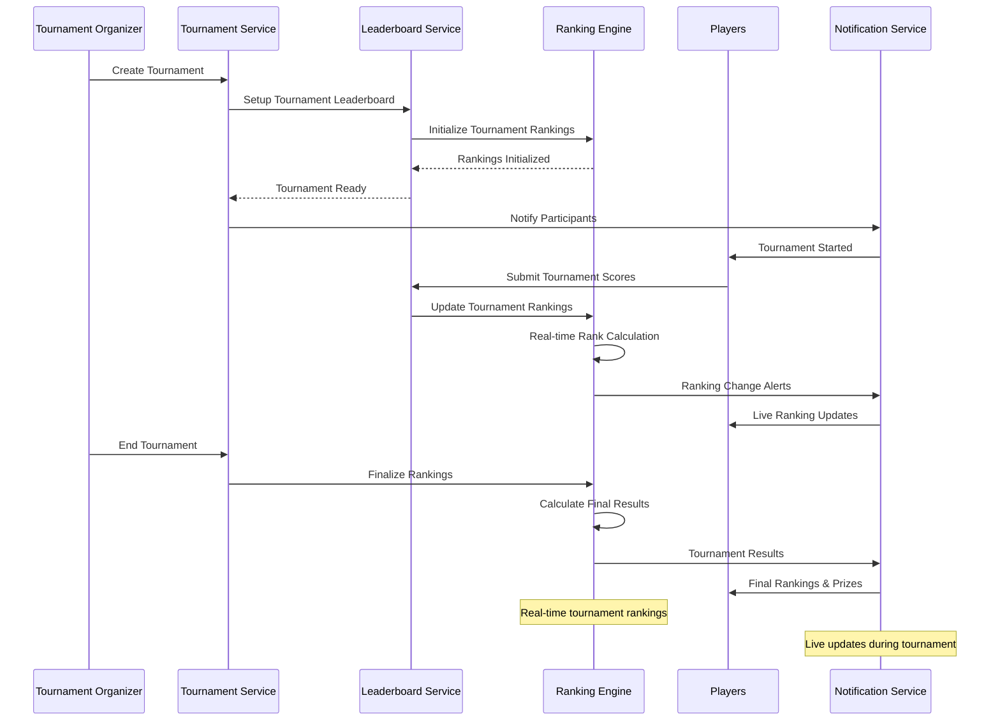

#### Achievement Unlock and Social Sharing
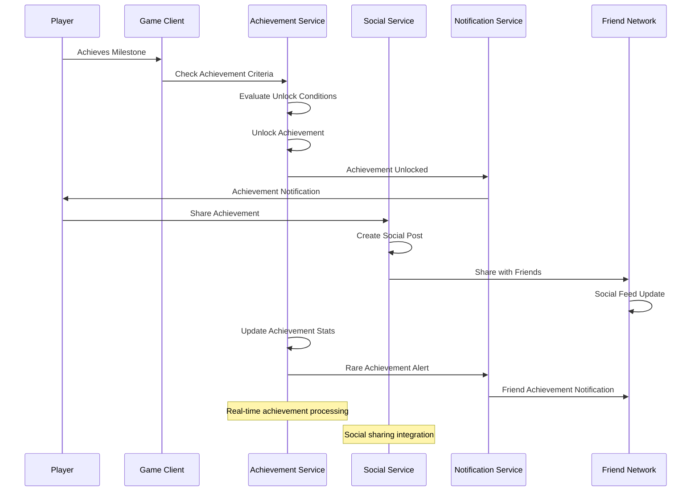

## 6. Scalability & Performance

### 6.1 Scaling Architecture

```mermaid
flowchart TD
    subgraph "Score Ingestion Scaling"
        A[Score Volume Growth] --> B[Kinesis Shard Scaling]
        B --> C[Lambda Auto-scaling]
        C --> D[Parallel Processing]
    end
    
    subgraph "Ranking Calculation Scaling"
        E[Player Base Growth] --> F[Distributed Computing]
        F --> G[Batch Processing Optimization]
        G --> H[Caching Layer Expansion]
    end
    
    subgraph "Query Scaling"
        I[Leaderboard Query Volume] --> J[Read Replica Scaling]
        J --> K[Cache Cluster Scaling]
        K --> L[CDN Integration]
    end
    
    subgraph "Global Scaling"
        M[Geographic Expansion] --> N[Multi-Region Deployment]
        N --> O[Regional Leaderboards]
        O --> P[Edge Computing]
    end
    
    style D fill:#87CEEB
    style H fill:#90EE90
    style L fill:#FFB6C1
    style P fill:#DDA0DD
```

### 6.2 Performance Optimization

**Score Processing Performance:**
- **Batch Processing**: Group score submissions for efficient processing
- **Async Processing**: Non-blocking score validation and ranking updates
- **Stream Processing**: Real-time processing with Kinesis Analytics
- **Connection Pooling**: Efficient database connections for high throughput

**Ranking Performance:**
- **Incremental Updates**: Update rankings without full recalculation
- **Materialized Views**: Pre-computed ranking segments for fast queries
- **Distributed Caching**: Cache rankings across multiple cache nodes
- **Lazy Loading**: Load ranking data on-demand for specific segments

**Query Performance:**
- **Index Optimization**: Efficient database indexes for ranking queries
- **Query Caching**: Cache frequently accessed leaderboard segments
- **Data Partitioning**: Partition data by game and time period
- **CDN Integration**: Cache static leaderboard content globally

## 7. Reliability & Fault Tolerance

### 7.1 High Availability Design

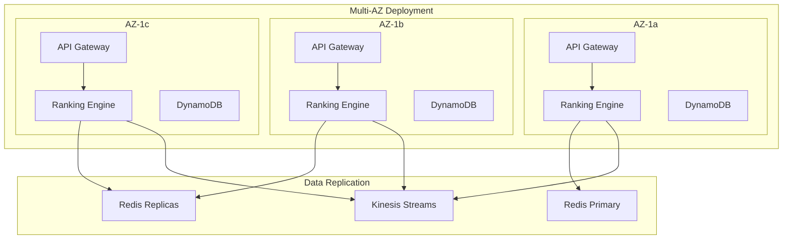

**Fault Tolerance Mechanisms:**
- **Circuit Breakers**: Prevent cascade failures during high load
- **Graceful Degradation**: Serve cached leaderboards during outages
- **Retry Logic**: Intelligent retry mechanisms for failed operations
- **Data Replication**: Multi-AZ replication for data durability

### 7.2 Disaster Recovery

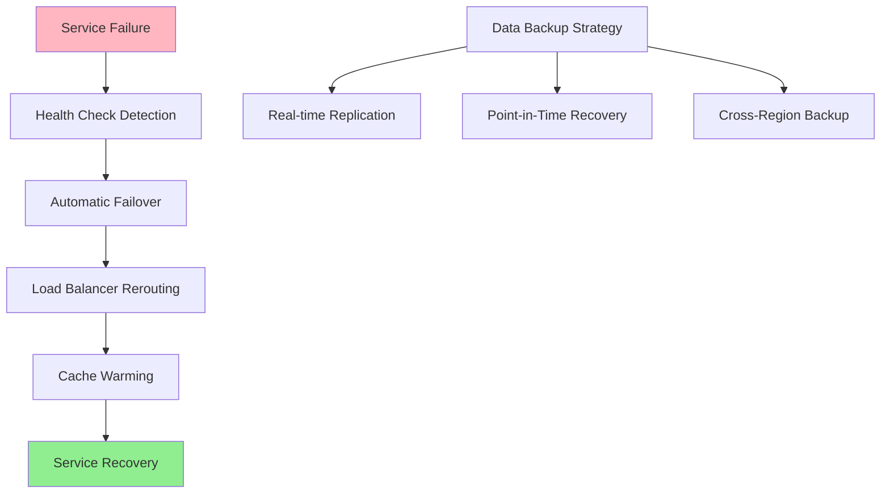

**RTO/RPO Targets:**
- **RTO**: 2 minutes for score submission, 5 minutes for full leaderboard service
- **RPO**: 30 seconds for score data, 1 minute for ranking data
- **Data Consistency**: Strong consistency for scores, eventual for rankings
- **Recovery Testing**: Weekly automated disaster recovery testing

## 8. Security Architecture

### 8.1 Security Layers

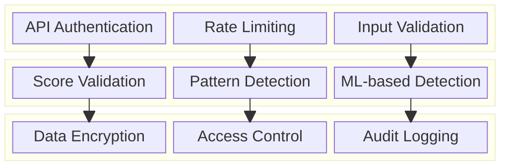

**Security Features:**
- **API Security**: Authentication, authorization, and rate limiting
- **Anti-Cheat Protection**: Multi-layered cheat detection and prevention
- **Data Protection**: Encryption and secure data handling
- **Audit Trails**: Comprehensive logging for security analysis

**Cheat Prevention:**
- **Score Validation**: Server-side validation of all score submissions
- **Statistical Analysis**: Detect statistically impossible achievements
- **Behavioral Monitoring**: Track player behavior patterns
- **Community Reporting**: Player-driven cheat reporting system

### 8.2 Anti-Cheat Security Flow

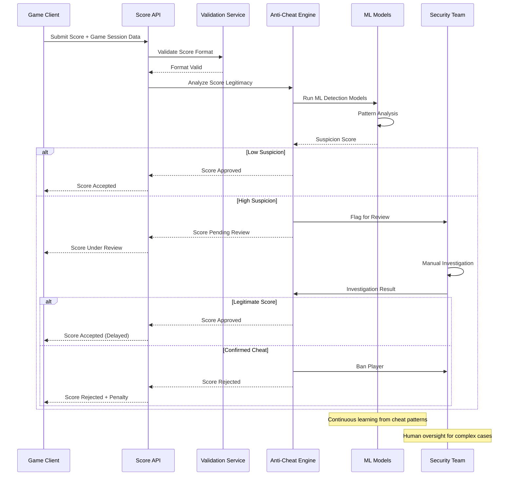

## 9. Monitoring & Observability

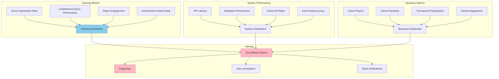

**Key Performance Indicators:**
- **Gaming**: Score submission rates, leaderboard accuracy, player engagement
- **Performance**: API latency, database performance, cache efficiency
- **Security**: Cheat detection accuracy, false positive rates, ban effectiveness
- **Business**: Player retention, tournament participation, social features usage

**Alerting Strategy:**
- **Critical**: Service outages, cheat detection failures, data corruption
- **Warning**: High API latency, increased error rates, unusual score patterns
- **Info**: Traffic spikes, new game launches, tournament events

## 10. Cost Optimization

**Service-Level Cost Analysis:**
- **Kinesis Data Streams**: $8,000/month (High-throughput score ingestion)
- **DynamoDB**: $6,000/month (Player scores and leaderboard data)
- **EKS**: $5,000/month (Microservices, 40 nodes)
- **ElastiCache Redis**: $4,000/month (Leaderboard caching)
- **Lambda**: $2,000/month (Event processing functions)
- **SageMaker**: $3,000/month (Anti-cheat ML models)
- **Aurora PostgreSQL**: $2,000/month (Game metadata and analytics)
- **Other Services**: $3,000/month (API Gateway, monitoring, etc.)
- **Total Estimated**: ~$33,000/month for 100M players

**Cost Optimization Strategies:**
- **Spot Instances**: 60% cost reduction for batch processing workloads
- **Reserved Instances**: 40% savings on predictable compute workloads
- **Data Tiering**: Move historical data to cheaper storage tiers
- **Cache Optimization**: Intelligent caching to reduce database queries
- **Serverless Optimization**: Use Lambda for variable workloads

**Revenue Model:**
- **Platform Fees**: Revenue sharing with game developers (30% platform fee)
- **Premium Features**: Advanced analytics and tournament tools ($50/month)
- **Tournament Hosting**: Fees for organizing competitive tournaments
- **Advertising**: Sponsored leaderboards and achievement promotions
- **Data Analytics**: Gaming insights and player behavior analytics

## 11. Implementation Strategy

### 11.1 Migration/Deployment Plan

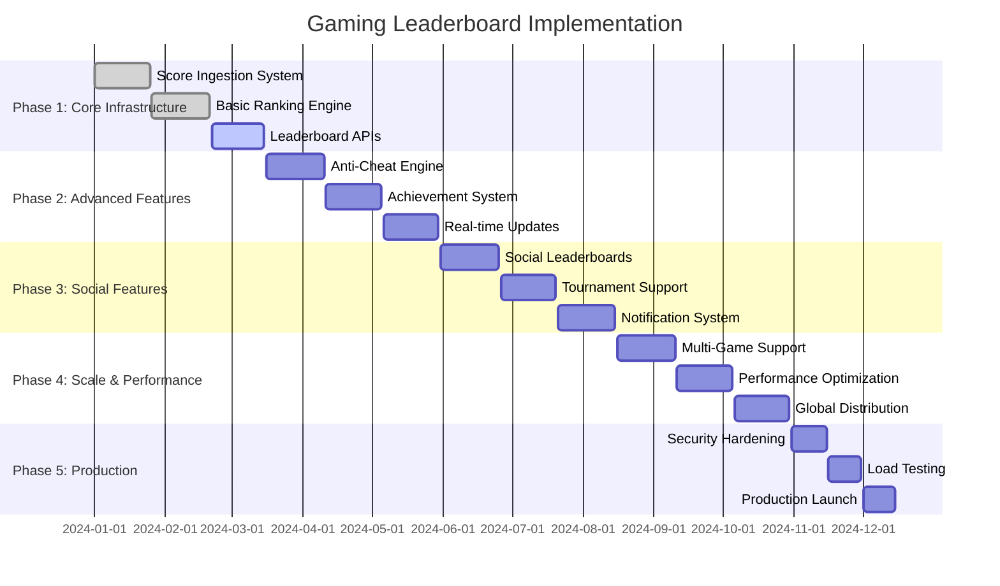

### 11.2 Technology Decisions & Trade-offs

**Database Strategy:**
- **DynamoDB vs Aurora**: DynamoDB for high-throughput scores, Aurora for complex analytics
- **Real-time vs Batch**: Hybrid approach for immediate updates and consistency checks
- **Consistency Model**: Strong consistency for scores, eventual consistency for rankings
- **Caching Strategy**: Multi-level caching with Redis for performance

**Anti-Cheat Approach:**
- **Rule-based vs ML**: Combination for comprehensive cheat detection
- **Real-time vs Offline**: Real-time detection with offline analysis
- **Automated vs Manual**: Automated responses with human oversight
- **Prevention vs Detection**: Focus on detection with prevention measures

**Ranking Algorithms:**
- **Simple vs Complex**: Start simple, add complexity based on game requirements
- **Real-time vs Batch**: Real-time updates with batch consistency checks
- **Global vs Regional**: Support both global and regional leaderboards
- **Historical vs Current**: Maintain historical data for trend analysis

**Future Evolution Path:**
- **Esports Integration**: Advanced tournament and competitive gaming features
- **AI Enhancement**: AI-powered player matching and skill assessment
- **Blockchain Integration**: Decentralized achievements and rewards
- **VR/AR Support**: Immersive leaderboard experiences

**Technical Debt & Improvement Areas:**
- **Advanced Analytics**: Enhanced player behavior analysis and insights
- **Mobile Optimization**: Native mobile SDK for better integration
- **Real-time Spectating**: Live viewing of competitive gameplay
- **Cross-Platform Play**: Unified leaderboards across different platforms
