# Distributed Lock Service System Design Architecture

## 1. Executive Summary & Requirements

### System Overview
A high-availability distributed lock service that provides mutual exclusion and coordination primitives for distributed systems. The service ensures that only one process can hold a lock at any given time, handles lock expiration, and provides strong consistency guarantees across a distributed infrastructure similar to Apache Zookeeper or etcd.

### Functional Requirements
- **Lock Acquisition**: Acquire exclusive locks with configurable timeout
- **Lock Release**: Release locks explicitly or through automatic expiration
- **Lock Renewal**: Extend lock duration for long-running operations
- **Blocking Locks**: Wait for lock availability with configurable timeout
- **Non-blocking Locks**: Try-lock operations with immediate response
- **Lock Queuing**: Fair queuing for lock acquisition requests
- **Lock Monitoring**: Monitor lock status and ownership
- **Deadlock Detection**: Detect and resolve potential deadlock situations
- **Lock Hierarchies**: Support hierarchical locking with parent-child relationships
- **Lock Statistics**: Detailed metrics and analytics on lock usage

### Non-Functional Requirements
- **Availability**: 99.99% uptime with automatic failover
- **Consistency**: Strong consistency for lock state across all nodes
- **Latency**: <10ms for lock acquisition, <5ms for lock release
- **Throughput**: Handle 100K+ lock operations per second
- **Durability**: Persist lock state with replication across multiple nodes
- **Scalability**: Support 1M+ concurrent locks across distributed systems

### Key Constraints
- Handle network partitions and node failures gracefully
- Prevent split-brain scenarios in distributed environments
- Support both short-lived and long-lived lock operations
- Maintain lock ordering and fairness guarantees
- Handle clock skew and time synchronization issues

### Success Metrics
- 99.99% availability for lock operations
- <5ms P95 latency for lock acquisition
- Zero lock state inconsistencies across nodes
- 100% deadlock detection and resolution
- Support 10K+ concurrent clients per cluster

## 2. High-Level Architecture Overview

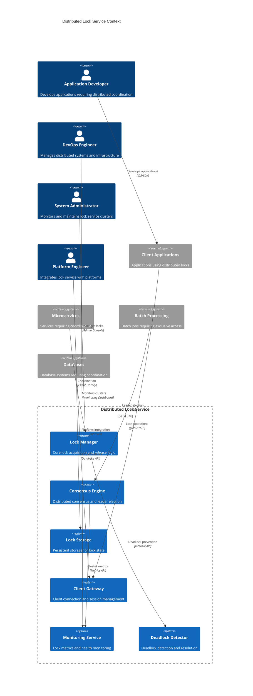

**Architectural Style Rationale**: Consensus-based distributed system architecture chosen for:
- Strong consistency guarantees for lock state across all nodes
- Fault tolerance through distributed consensus algorithms (Raft/PBFT)
- High availability with automatic leader election and failover
- Scalability through horizontal cluster expansion
- Integration with various distributed systems and applications

## 3. Detailed System Architecture

### 3.1 AWS Service Stack Selection

**Core Infrastructure:**
- **EC2**: High-performance instances for consensus nodes
- **EKS**: Kubernetes orchestration for lock service deployment
- **Auto Scaling Groups**: Automatic scaling and node replacement
- **Placement Groups**: Cluster placement for low-latency communication

**Consensus and Storage:**
- **EBS**: High-IOPS persistent storage for consensus logs
- **EFS**: Shared storage for cluster configuration and metadata
- **Instance Store**: High-performance local storage for active locks
- **S3**: Backup storage for lock state snapshots

**Networking:**
- **VPC**: Isolated network with optimized routing
- **Direct Connect**: Dedicated connections for enterprise clients
- **Network Load Balancer**: High-performance load balancing
- **Enhanced Networking**: SR-IOV for low-latency communication

**Monitoring and Operations:**
- **CloudWatch**: Comprehensive monitoring and custom metrics
- **X-Ray**: Distributed tracing for lock operations
- **Systems Manager**: Cluster management and automation
- **CloudTrail**: Audit logging for lock operations

**Security:**
- **IAM**: Fine-grained access control for lock operations
- **KMS**: Encryption key management for sensitive data
- **Secrets Manager**: Secure storage of cluster credentials
- **Security Groups**: Network security and access control

**Client Integration:**
- **API Gateway**: HTTP API for simple client integration
- **Application Load Balancer**: gRPC load balancing for client libraries
- **Route 53**: DNS-based service discovery
- **Lambda**: Serverless integration functions

### 3.2 Component Architecture Diagram

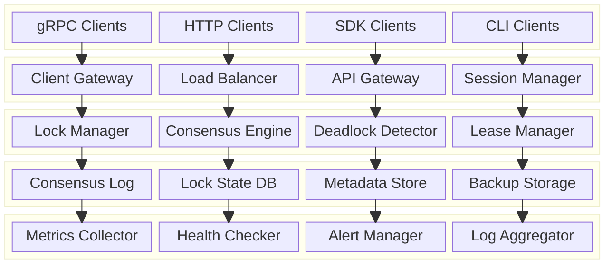

## 4. Data Architecture & Flow

### 4.1 Data Flow Diagrams

#### Lock Acquisition Flow
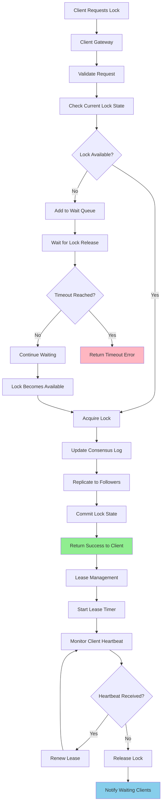

#### Consensus and Replication Flow
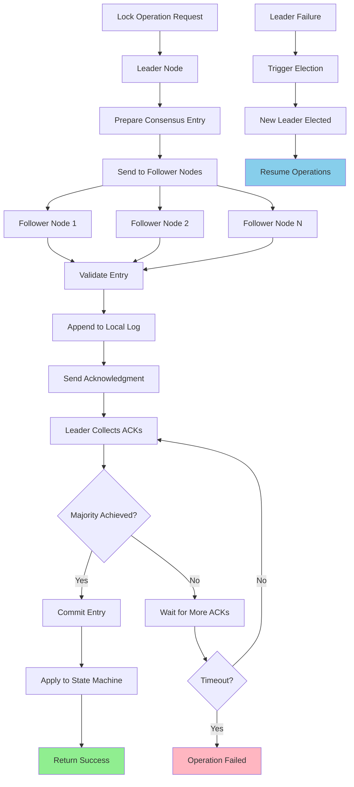

#### Deadlock Detection and Resolution Flow
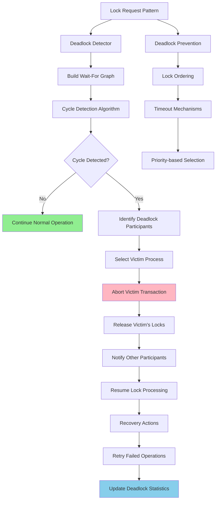

### 4.2 Database Design

#### Lock State Management Schema
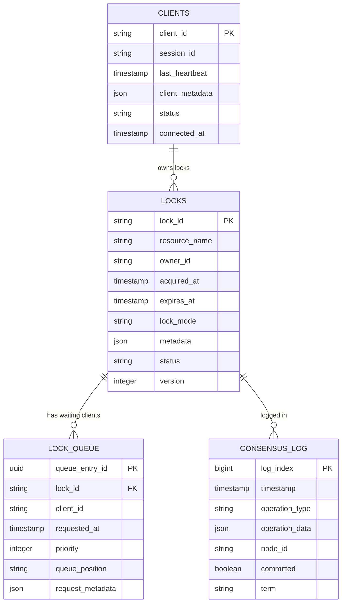

#### Cluster and Node Management Schema
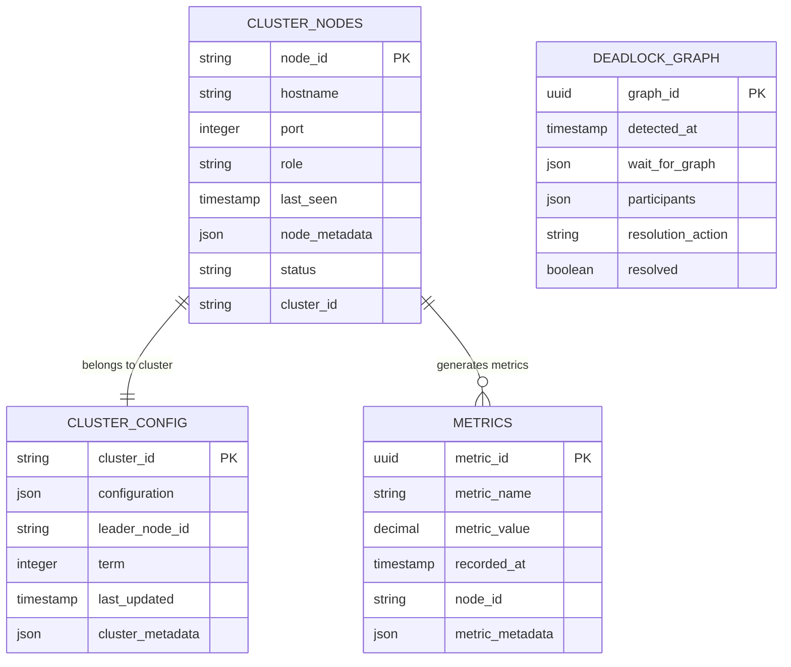

## 5. Detailed Component Design

### 5.1 Consensus Engine

**Purpose & Responsibilities:**
- Implement distributed consensus algorithm (Raft or PBFT)
- Handle leader election and follower synchronization
- Manage consensus log replication across cluster nodes
- Ensure strong consistency for all lock operations
- Handle network partitions and node failures

**Consensus Algorithm:**
- **Raft Consensus**: Leader-based consensus with log replication
- **Leader Election**: Automatic leader election during failures
- **Log Replication**: Ensure all nodes have consistent state
- **Membership Changes**: Dynamic cluster membership management
- **Snapshot Management**: Periodic state snapshots for efficiency

**Fault Tolerance:**
- **Split-brain Prevention**: Majority quorum requirements
- **Network Partition Handling**: Graceful handling of network splits
- **Node Recovery**: Automatic recovery of failed nodes
- **Data Consistency**: Strong consistency guarantees
- **Byzantine Fault Tolerance**: Optional BFT for enhanced security

### 5.2 Lock Manager

**Purpose & Responsibilities:**
- Handle lock acquisition, release, and renewal operations
- Implement different lock types (exclusive, shared, read-write)
- Manage lock queues and fair scheduling
- Handle lock timeouts and automatic expiration
- Provide lock status monitoring and diagnostics

**Lock Types:**
- **Exclusive Locks**: Mutual exclusion for critical sections
- **Shared Locks**: Multiple readers, single writer pattern
- **Read-Write Locks**: Separate read and write lock modes
- **Reentrant Locks**: Allow same client to acquire lock multiple times
- **Timed Locks**: Locks with automatic expiration

**Queue Management:**
- **FIFO Queuing**: First-in-first-out lock acquisition
- **Priority Queuing**: Priority-based lock scheduling
- **Fair Queuing**: Prevent lock starvation
- **Timeout Handling**: Configurable timeout for waiting clients
- **Queue Monitoring**: Real-time queue status and metrics

### 5.3 Deadlock Detector

**Purpose & Responsibilities:**
- Detect potential deadlock situations in real-time
- Build and maintain wait-for graphs
- Implement cycle detection algorithms
- Select appropriate victim processes for deadlock resolution
- Provide deadlock prevention mechanisms

**Detection Algorithms:**
- **Wait-For Graph**: Graph-based cycle detection
- **Banker's Algorithm**: Resource allocation deadlock prevention
- **Timeout-based Detection**: Detect deadlocks through timeouts
- **Proactive Detection**: Prevent deadlocks before they occur
- **Distributed Detection**: Coordinate detection across cluster nodes

### Critical User Journey Sequence Diagrams

#### Distributed Lock Acquisition with Consensus
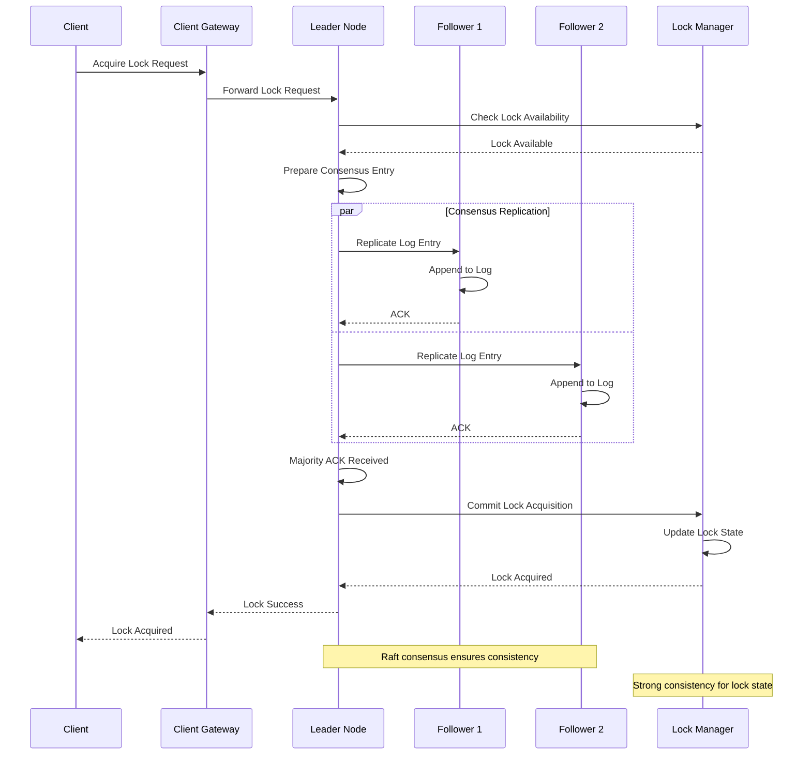

#### Deadlock Detection and Resolution
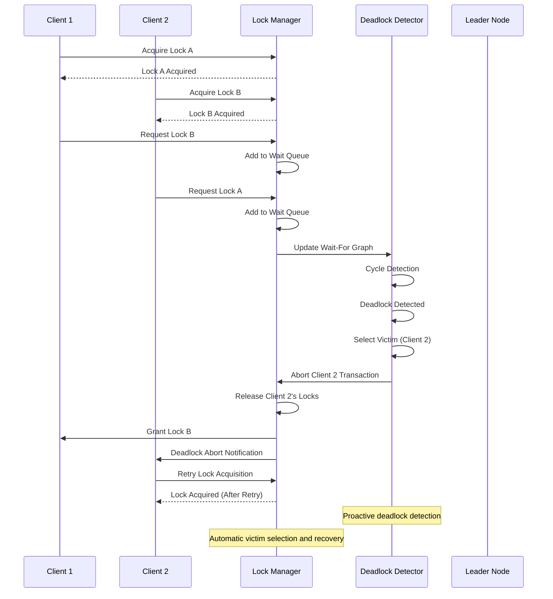

#### Leader Failover and Recovery
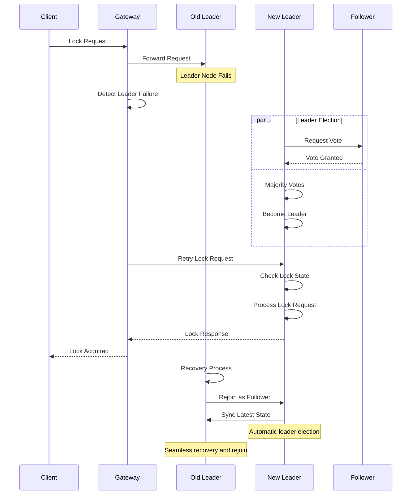

## 6. Scalability & Performance

### 6.1 Scaling Architecture

```mermaid
flowchart TD
    subgraph "Horizontal Scaling"
        A[Add Cluster Nodes] --> B[Distributed Consensus]
        B --> C[Load Distribution]
        C --> D[Increased Throughput]
    end
    
    subgraph "Performance Scaling"
        E[Optimize Consensus] --> F[Batch Operations]
        F --> G[Parallel Processing]
        G --> H[Reduced Latency]
    end
    
    subgraph "Regional Scaling"
        I[Multi-Region Deployment] --> J[Regional Clusters]
        J --> K[Cross-Region Coordination]
        K --> L[Global Consistency]
    end
    
    subgraph "Client Scaling"
        M[Connection Pooling] --> N[Session Management]
        N --> O[Load Balancing]
        O --> P[High Concurrency]
    end
    
    style D fill:#87CEEB
    style H fill:#90EE90
    style L fill:#FFB6C1
    style P fill:#DDA0DD
```

### 6.2 Performance Optimization

**Consensus Optimization:**
- **Batch Consensus**: Group multiple operations in single consensus round
- **Pipeline Processing**: Overlap consensus rounds for higher throughput
- **Log Compaction**: Periodic compaction to reduce log size
- **Snapshot Optimization**: Efficient state snapshots for fast recovery

**Lock Performance:**
- **Lock Caching**: Cache frequently accessed lock state
- **Hierarchical Locking**: Optimize lock tree traversal
- **Lock Coalescing**: Combine similar lock requests
- **Fast Path**: Optimize common lock operations

**Network Optimization:**
- **Connection Multiplexing**: Share connections across multiple clients
- **Message Compression**: Compress large consensus messages
- **Network Batching**: Batch network operations for efficiency
- **Local Optimization**: Optimize intra-cluster communication

## 7. Reliability & Fault Tolerance

### 7.1 High Availability Design

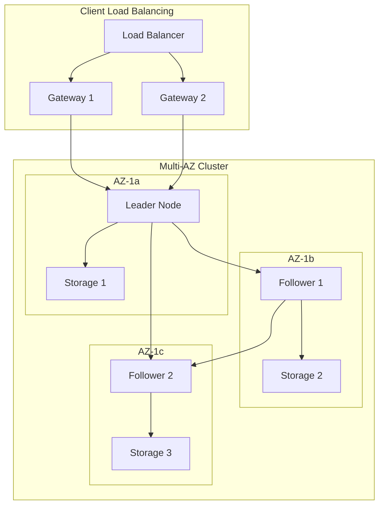

**Fault Tolerance Mechanisms:**
- **Automatic Failover**: Sub-second leader election and failover
- **Data Replication**: Synchronous replication across multiple nodes
- **Split-brain Prevention**: Majority quorum requirements
- **Graceful Degradation**: Read-only mode during network partitions

### 7.2 Disaster Recovery

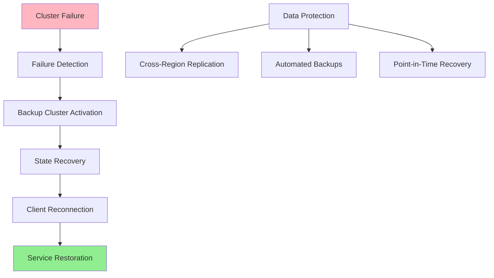

**RTO/RPO Targets:**
- **RTO**: 30 seconds for cluster failover, 2 minutes for full recovery
- **RPO**: Near-zero with synchronous replication
- **Data Consistency**: Strong consistency maintained across failures
- **Recovery Testing**: Weekly automated disaster recovery testing

## 8. Security Architecture

### 8.1 Security Layers

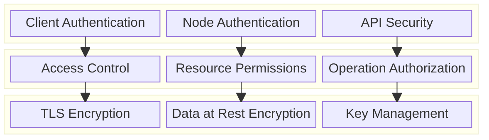

**Security Features:**
- **Mutual TLS**: Secure communication between all components
- **Certificate Management**: Automated certificate rotation and management
- **Access Control**: Fine-grained permissions for lock operations
- **Audit Logging**: Comprehensive audit trails for all operations

**Threat Protection:**
- **DDoS Protection**: Rate limiting and traffic filtering
- **Injection Attacks**: Input validation and sanitization
- **Unauthorized Access**: Strong authentication and authorization
- **Data Tampering**: Cryptographic integrity verification

### 8.2 Security Flow

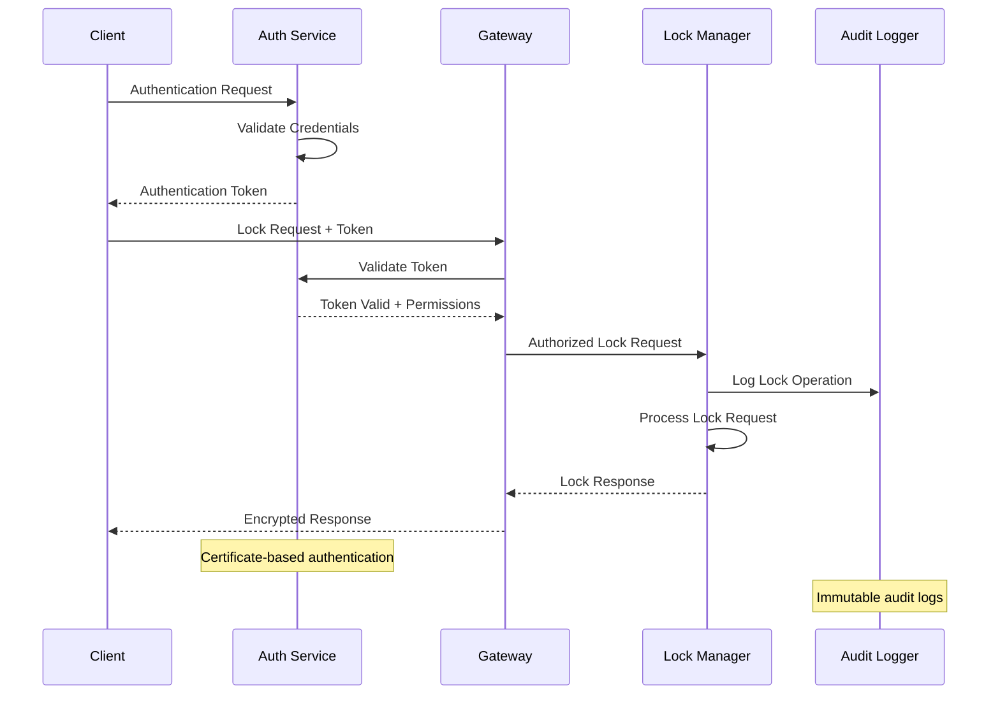

## 9. Monitoring & Observability

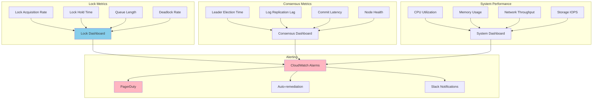

**Key Performance Indicators:**
- **Lock Performance**: Acquisition latency, hold time, throughput
- **Consensus Health**: Leader stability, replication lag, commit rate
- **System Resources**: CPU, memory, network, storage utilization
- **Client Experience**: Connection success rate, operation success rate

**Alerting Strategy:**
- **Critical**: Cluster failures, split-brain scenarios, data corruption
- **Warning**: High latency, resource exhaustion, deadlock detection
- **Info**: Performance trends, capacity planning, usage patterns

## 10. Cost Optimization

**Service-Level Cost Analysis:**
- **EC2 Instances**: $6,000/month (5-node cluster, high-performance instances)
- **EBS Storage**: $1,500/month (High-IOPS storage for consensus logs)
- **Network Load Balancer**: $500/month (Client load balancing)
- **CloudWatch**: $300/month (Monitoring and custom metrics)
- **Direct Connect**: $2,000/month (Enterprise dedicated connections)
- **Data Transfer**: $200/month (Cross-AZ and external traffic)
- **Other Services**: $500/month (S3, Lambda, etc.)
- **Total Estimated**: ~$11,000/month for enterprise cluster

**Cost Optimization Strategies:**
- **Right-sizing**: Optimize instance types based on workload patterns
- **Reserved Instances**: 40% savings on long-running cluster nodes
- **Storage Optimization**: Use appropriate storage types for different data
- **Network Optimization**: Minimize cross-AZ data transfer costs
- **Resource Monitoring**: Track and optimize underutilized resources

**Pricing Model:**
- **Open Source**: Free open-source version with community support
- **Enterprise License**: $10,000/year per cluster for enterprise features
- **Managed Service**: $500/month per node for fully managed service
- **Support Tiers**: $5,000-25,000/year for different support levels
- **Professional Services**: Custom pricing for implementation and training

## 11. Implementation Strategy

### 11.1 Migration/Deployment Plan

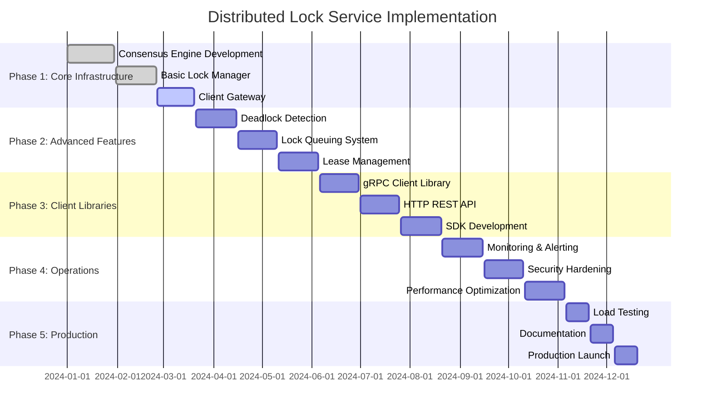

### 11.2 Technology Decisions & Trade-offs

**Consensus Algorithm:**
- **Raft vs PBFT**: Raft chosen for simplicity and proven performance
- **Leader-based vs Leaderless**: Leader-based for strong consistency
- **Synchronous vs Asynchronous**: Synchronous replication for consistency
- **Quorum Size**: Odd number of nodes (3, 5, 7) for split-brain prevention

**Storage Strategy:**
- **In-Memory vs Persistent**: Hybrid approach with persistent consensus log
- **Local vs Distributed Storage**: Local storage with replication
- **WAL vs State Machine**: Write-ahead logging for durability
- **Snapshot Strategy**: Periodic snapshots for log compaction

**Client Integration:**
- **gRPC vs HTTP**: gRPC for performance, HTTP for simplicity
- **Blocking vs Non-blocking**: Support both patterns
- **Client Libraries**: Multi-language SDK support
- **Connection Management**: Connection pooling and multiplexing

**Future Evolution Path:**
- **Multi-Tenancy**: Support for multiple isolated tenants
- **Geographic Distribution**: Cross-region clusters with eventual consistency
- **Performance Enhancements**: Hardware acceleration and optimization
- **Cloud-Native Features**: Kubernetes operator and cloud integrations

**Technical Debt & Improvement Areas:**
- **Advanced Monitoring**: Predictive analytics for cluster health
- **Auto-scaling**: Dynamic cluster scaling based on load
- **Multi-Cloud Support**: Support for multiple cloud providers
- **Edge Deployment**: Lightweight edge clusters for low-latency access
