# Email Service System Design Architecture

## 1. Executive Summary & Requirements

### System Overview
A comprehensive email service platform that provides reliable email delivery, management, and analytics capabilities for applications and businesses. The system handles transactional emails, marketing campaigns, email templates, deliverability optimization, and compliance management similar to SendGrid, Mailgun, or Amazon SES.

### Functional Requirements
- **Email Sending**: Send transactional and marketing emails at scale
- **Template Management**: Create, manage, and version email templates
- **Contact Management**: Manage recipient lists and segmentation
- **Campaign Management**: Create and execute email marketing campaigns
- **Deliverability Optimization**: Improve email delivery rates and reputation
- **Analytics & Tracking**: Email delivery, open, click, and bounce tracking
- **Suppression Management**: Handle unsubscribes, bounces, and complaints
- **Webhook Integration**: Real-time event notifications via webhooks
- **A/B Testing**: Test different email variations for optimization
- **Compliance Management**: GDPR, CAN-SPAM, and anti-spam compliance

### Non-Functional Requirements
- **Throughput**: Handle 100M+ emails per day with burst capacity
- **Delivery Speed**: <5 minutes for transactional emails, configurable for campaigns
- **Availability**: 99.99% uptime for email sending and API services
- **Deliverability**: >95% delivery rate with spam score optimization
- **Scalability**: Support 100K+ customers and billions of emails annually
- **Compliance**: Full compliance with email regulations and standards

### Key Constraints
- Handle email bounces, complaints, and reputation management
- Support multiple email protocols (SMTP, HTTP API, webhooks)
- Manage IP warming and domain reputation
- Handle large-scale email campaigns without affecting deliverability
- Support real-time and batch email processing

### Success Metrics
- 99.99% availability for email sending services
- >95% email delivery rate across all customers
- <2 seconds API response time for email submission
- <1% complaint rate to maintain sender reputation
- Support 1M+ emails per hour during peak campaigns

## 2. High-Level Architecture Overview

```mermaid
C4Context
    title Email Service System Context

    Person(app_developer, "Application Developer", "Integrates email functionality into applications")
    Person(marketing_manager, "Marketing Manager", "Creates and manages email campaigns")
    Person(email_admin, "Email Administrator", "Manages email infrastructure and deliverability")
    Person(compliance_officer, "Compliance Officer", "Ensures email compliance and regulations")
    Person(data_analyst, "Data Analyst", "Analyzes email performance and engagement")

    System_Boundary(email_service, "Email Service Platform") {
        System(email_api, "Email API", "Email sending and management APIs")
        System(template_engine, "Template Engine", "Email template processing and rendering")
        System(campaign_manager, "Campaign Manager", "Email campaign creation and execution")
        System(delivery_engine, "Delivery Engine", "Email routing and delivery optimization")
        System(analytics_service, "Analytics Service", "Email tracking and performance analytics")
        System(suppression_service, "Suppression Service", "Bounce and unsubscribe management")
    }

    System_Ext(client_applications, "Client Applications", "Applications sending emails via API")
    System_Ext(email_providers, "Email Providers", "Gmail, Outlook, Yahoo, and other email providers")
    System_Ext(smtp_servers, "SMTP Servers", "External SMTP servers and relay services")
    System_Ext(webhook_endpoints, "Webhook Endpoints", "Customer webhook URLs for event notifications")

    Rel(app_developer, client_applications, "Develops email integration", "SDK/API")
    Rel(marketing_manager, campaign_manager, "Creates campaigns", "Web Interface")
    Rel(email_admin, delivery_engine, "Manages deliverability", "Admin Console")
    Rel(compliance_officer, suppression_service, "Manages compliance", "Compliance Portal")
    Rel(data_analyst, analytics_service, "Analyzes performance", "Analytics Dashboard")
    
    Rel(client_applications, email_api, "Send emails", "REST/GraphQL API")
    Rel(email_api, template_engine, "Render templates", "Internal API")
    Rel(campaign_manager, delivery_engine, "Schedule delivery", "Internal API")
    Rel(delivery_engine, email_providers, "Deliver emails", "SMTP/API")
    Rel(analytics_service, webhook_endpoints, "Event notifications", "HTTP Webhooks")
    Rel(suppression_service, smtp_servers, "Feedback loops", "SMTP Protocol")
```

**Architectural Style Rationale**: Event-driven microservices with message queuing chosen for:
- High-throughput email processing with reliable delivery guarantees
- Independent scaling of different email functions (sending, tracking, analytics)
- Real-time event processing for email tracking and webhook notifications
- Integration with multiple email providers and delivery channels
- Compliance and reputation management through centralized services

## 3. Detailed System Architecture

### 3.1 AWS Service Stack Selection

**Email Infrastructure:**
- **SES**: Core email sending service with high deliverability
- **SNS**: Email bounce and complaint notifications
- **SQS**: Message queuing for email processing workflows
- **EventBridge**: Event routing for email lifecycle events

**Application Services:**
- **EKS**: Kubernetes orchestration for microservices
- **Lambda**: Serverless functions for event processing
- **API Gateway**: Email API management with rate limiting
- **Step Functions**: Workflow orchestration for complex campaigns

**Data Storage:**
- **DynamoDB**: High-performance email metadata and tracking data
- **Aurora PostgreSQL**: Customer data and campaign management
- **S3**: Email templates, attachments, and analytics data
- **ElastiCache Redis**: Real-time caching and session management

**Analytics & Monitoring:**
- **Kinesis Data Streams**: Real-time email event streaming
- **Kinesis Analytics**: Real-time email analytics and insights
- **Athena**: Big data analytics for email performance
- **QuickSight**: Business intelligence dashboards

**Content Processing:**
- **CloudFront**: Global CDN for email assets and tracking pixels
- **Textract**: Extract text from email attachments
- **Comprehend**: Email content analysis and sentiment detection
- **Personalize**: Personalized email recommendations

**Security & Compliance:**
- **KMS**: Encryption key management for sensitive data
- **Secrets Manager**: Secure storage of API keys and credentials
- **WAF**: Web application firewall for API protection
- **CloudTrail**: Comprehensive audit logging for compliance

### 3.2 Component Architecture Diagram

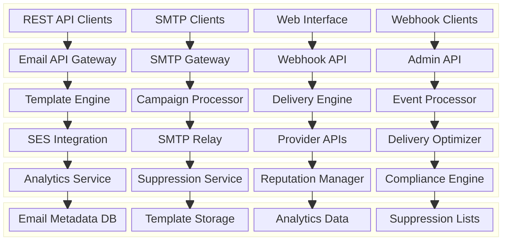

## 4. Data Architecture & Flow

### 4.1 Data Flow Diagrams

#### Email Sending and Delivery Flow
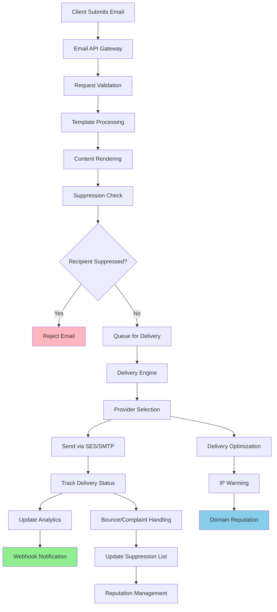

#### Campaign Processing and Execution Flow
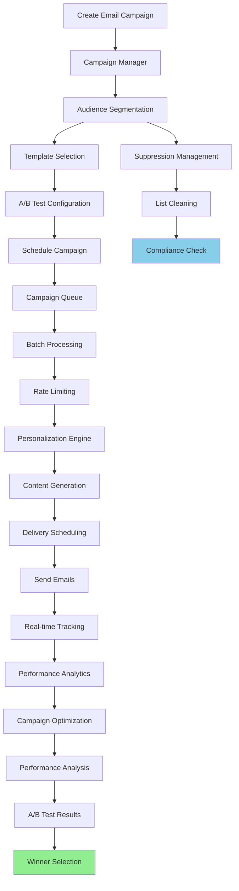

#### Email Tracking and Analytics Flow
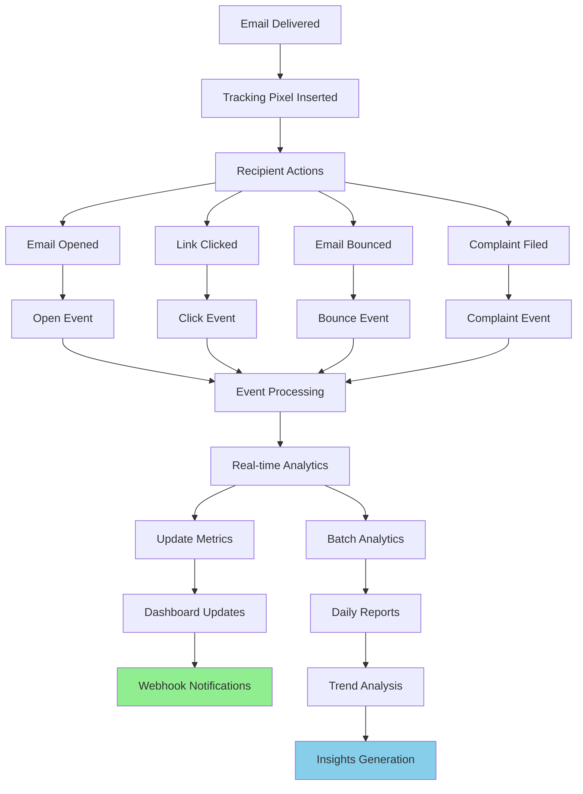

### 4.2 Database Design

#### Email Management Schema
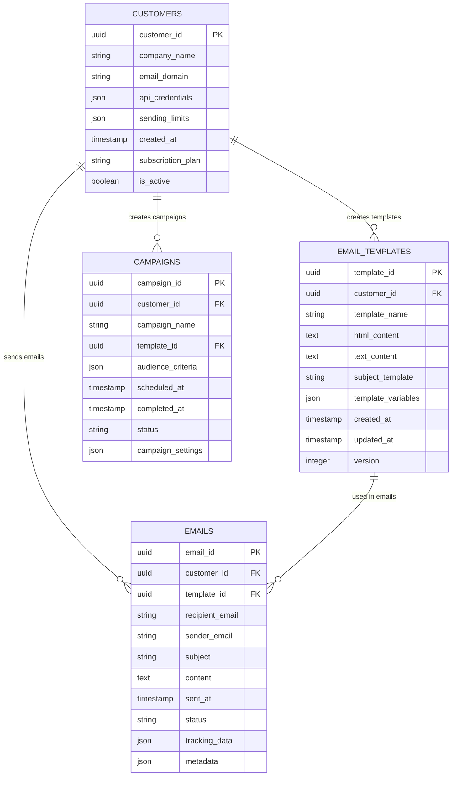

#### Tracking and Analytics Schema
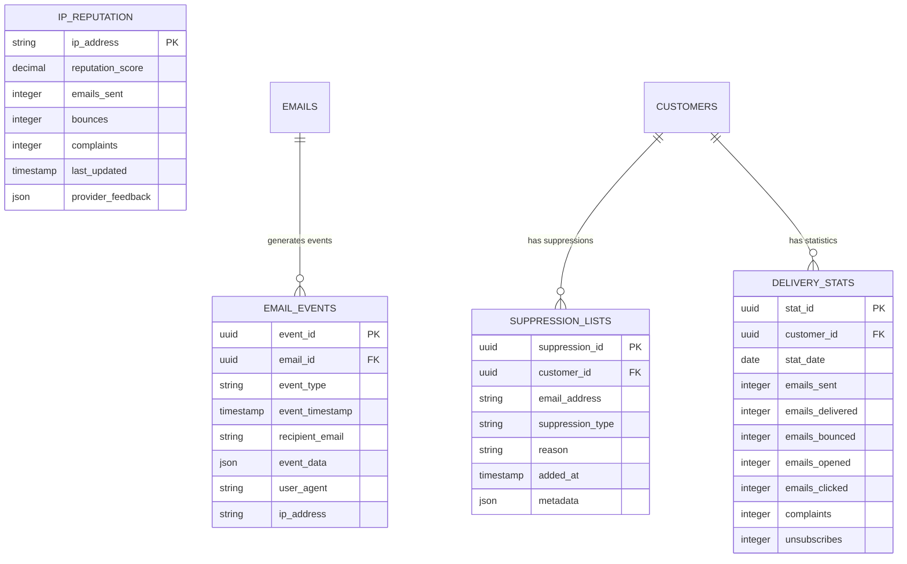

## 5. Detailed Component Design

### 5.1 Delivery Engine

**Purpose & Responsibilities:**
- Route emails through optimal delivery channels
- Manage IP warming and domain reputation
- Handle bounce and complaint processing
- Implement delivery rate limiting and throttling
- Optimize deliverability through provider selection

**Delivery Optimization:**
- **Provider Selection**: Choose best email provider based on recipient domain
- **IP Rotation**: Rotate sending IPs to maintain reputation
- **Domain Authentication**: Implement SPF, DKIM, and DMARC
- **Throttling**: Control sending rates to avoid provider limits
- **Retry Logic**: Intelligent retry mechanisms for failed deliveries

**Reputation Management:**
- **Bounce Handling**: Process hard and soft bounces appropriately
- **Complaint Processing**: Handle spam complaints and feedback loops
- **Blacklist Monitoring**: Monitor IP and domain blacklist status
- **Warming Schedules**: Gradually increase sending volume for new IPs
- **Quality Scoring**: Maintain quality scores for better deliverability

### 5.2 Template Engine

**Purpose & Responsibilities:**
- Process and render dynamic email templates
- Support multiple template formats (HTML, text, AMP)
- Handle template versioning and A/B testing
- Implement personalization and dynamic content
- Optimize template performance and deliverability

**Template Features:**
- **Dynamic Content**: Personalization using recipient data
- **Conditional Logic**: Show/hide content based on conditions
- **Multi-language Support**: Localization and internationalization
- **Responsive Design**: Mobile-optimized email templates
- **Template Inheritance**: Reusable components and layouts

**Rendering Optimization:**
- **Caching**: Cache rendered templates for performance
- **Lazy Loading**: Load template components on demand
- **Compression**: Compress email content for faster delivery
- **Validation**: Validate template syntax and deliverability
- **Preview**: Generate email previews for testing

### 5.3 Analytics Service

**Purpose & Responsibilities:**
- Track email delivery, opens, clicks, and other events
- Generate real-time and batch analytics reports
- Provide insights and recommendations for improvement
- Handle webhook notifications for email events
- Support custom analytics and reporting requirements

**Tracking Capabilities:**
- **Delivery Tracking**: Track successful email delivery
- **Open Tracking**: Monitor email opens with tracking pixels
- **Click Tracking**: Track link clicks with URL wrapping
- **Bounce Tracking**: Monitor bounce rates and types
- **Unsubscribe Tracking**: Track opt-out requests

**Analytics Features:**
- **Real-time Dashboards**: Live email performance metrics
- **Historical Reports**: Trend analysis and historical data
- **Segmentation**: Analytics by audience segments
- **A/B Testing**: Compare performance of email variations
- **Predictive Analytics**: ML-powered insights and recommendations

### Critical User Journey Sequence Diagrams

#### Transactional Email Sending
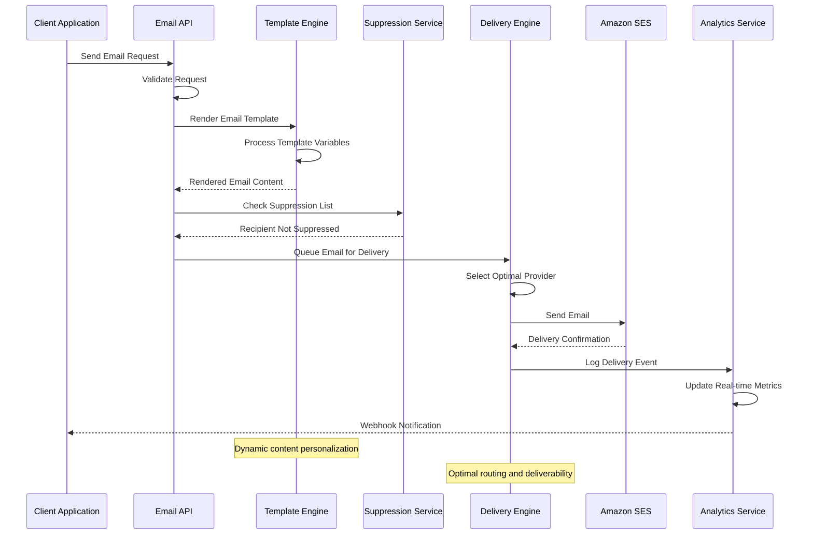

#### Email Campaign Execution
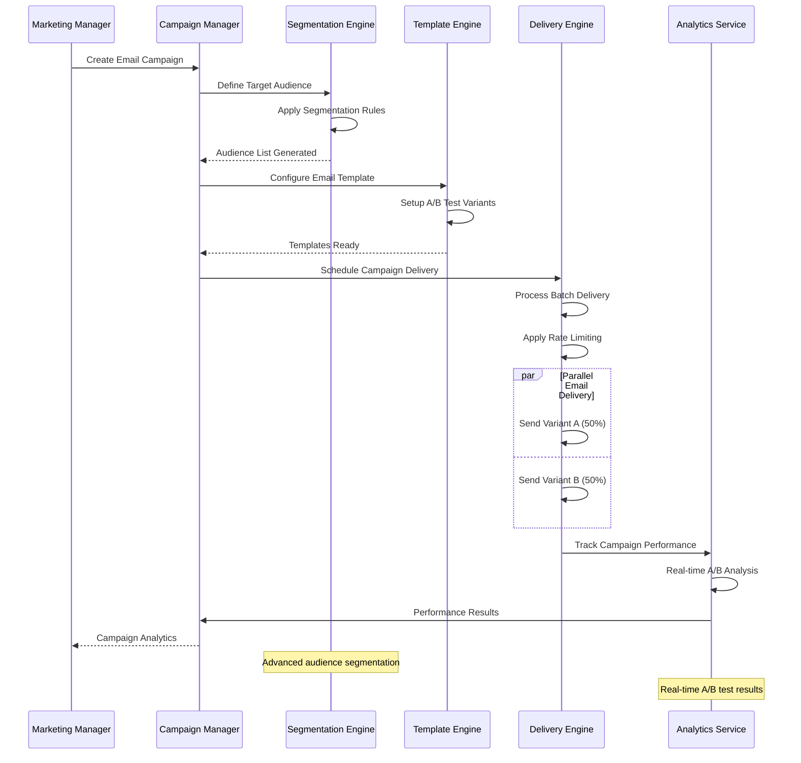

#### Bounce and Complaint Handling
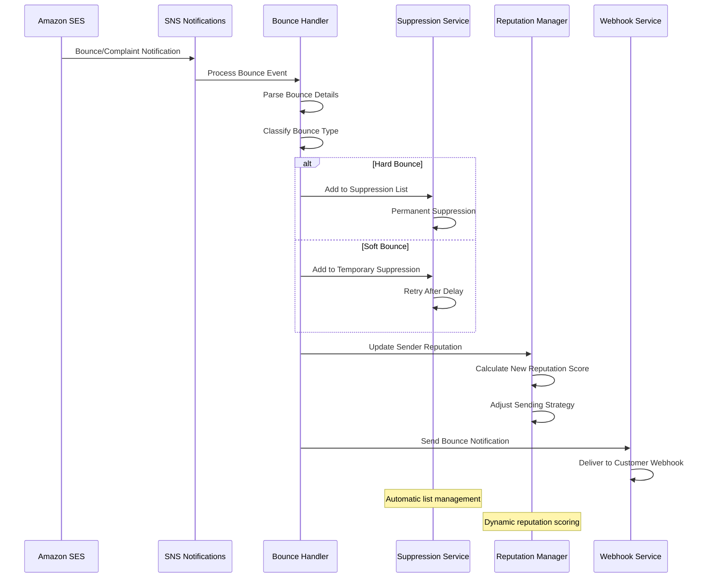

## 6. Scalability & Performance

### 6.1 Scaling Architecture

```mermaid
flowchart TD
    subgraph "Email Volume Scaling"
        A[Email Volume Growth] --> B[Queue Scaling]
        B --> C[Worker Scaling]
        C --> D[Provider Scaling]
    end
    
    subgraph "Geographic Scaling"
        E[Global Expansion] --> F[Multi-Region Deployment]
        F --> G[Regional Email Providers]
        G --> H[Local Compliance]
    end
    
    subgraph "Performance Scaling"
        I[Response Time Requirements] --> J[Caching Optimization]
        J --> K[Database Scaling]
        K --> L[CDN Integration]
    end
    
    subgraph "Analytics Scaling"
        M[Tracking Volume Growth] --> N[Stream Processing]
        N --> O[Data Lake Architecture]
        O --> P[Real-time Dashboards]
    end
    
    style D fill:#87CEEB
    style H fill:#90EE90
    style L fill:#FFB6C1
    style P fill:#DDA0DD
```

### 6.2 Performance Optimization

**Email Processing Performance:**
- **Batch Processing**: Group emails for efficient processing
- **Async Processing**: Non-blocking email submission and delivery
- **Connection Pooling**: Reuse SMTP connections for better throughput
- **Template Caching**: Cache rendered templates for faster processing

**Delivery Performance:**
- **Provider Optimization**: Route emails through fastest providers
- **Parallel Delivery**: Send emails concurrently across multiple channels
- **Rate Limiting**: Optimize sending rates for best deliverability
- **Retry Optimization**: Intelligent retry strategies for failed deliveries

**Analytics Performance:**
- **Stream Processing**: Real-time event processing with Kinesis
- **Data Aggregation**: Pre-compute common analytics queries
- **Caching**: Cache frequently accessed analytics data
- **Batch Analytics**: Process large analytics jobs efficiently

## 7. Reliability & Fault Tolerance

### 7.1 High Availability Design

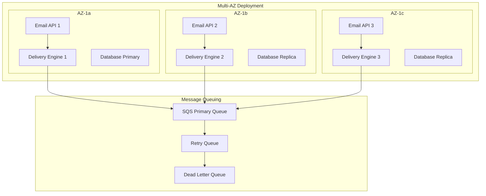

**Fault Tolerance Mechanisms:**
- **Circuit Breakers**: Prevent cascade failures during provider outages
- **Graceful Degradation**: Continue core email sending during partial outages
- **Retry Logic**: Intelligent retry mechanisms with exponential backoff
- **Dead Letter Queues**: Handle emails that fail repeated delivery attempts

### 7.2 Disaster Recovery

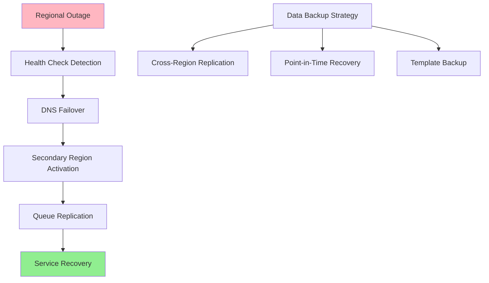

**RTO/RPO Targets:**
- **RTO**: 5 minutes for email API, 15 minutes for full service recovery
- **RPO**: 1 minute for email queue data, 5 minutes for analytics data
- **Data Consistency**: Strong consistency for email delivery, eventual for analytics
- **Recovery Testing**: Monthly automated disaster recovery testing

## 8. Security Architecture

### 8.1 Security Layers

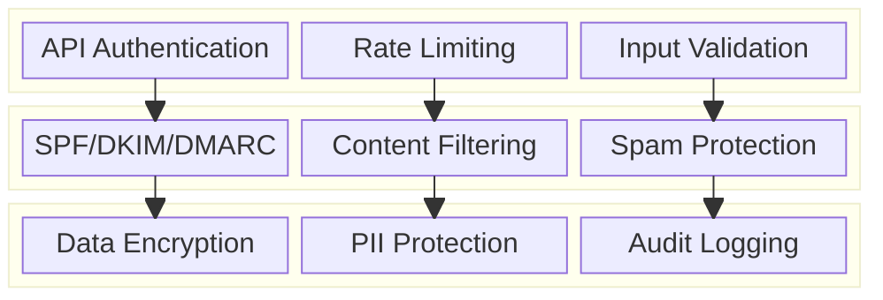

**Security Features:**
- **API Security**: Authentication, authorization, and rate limiting
- **Email Authentication**: SPF, DKIM, and DMARC implementation
- **Content Security**: Spam filtering and malicious content detection
- **Data Protection**: Encryption and PII handling compliance

**Compliance Features:**
- **GDPR Compliance**: Data protection and right to be forgotten
- **CAN-SPAM Compliance**: Anti-spam law compliance
- **CCPA Compliance**: California privacy law compliance
- **SOC 2 Compliance**: Security and availability controls

### 8.2 Email Security Flow

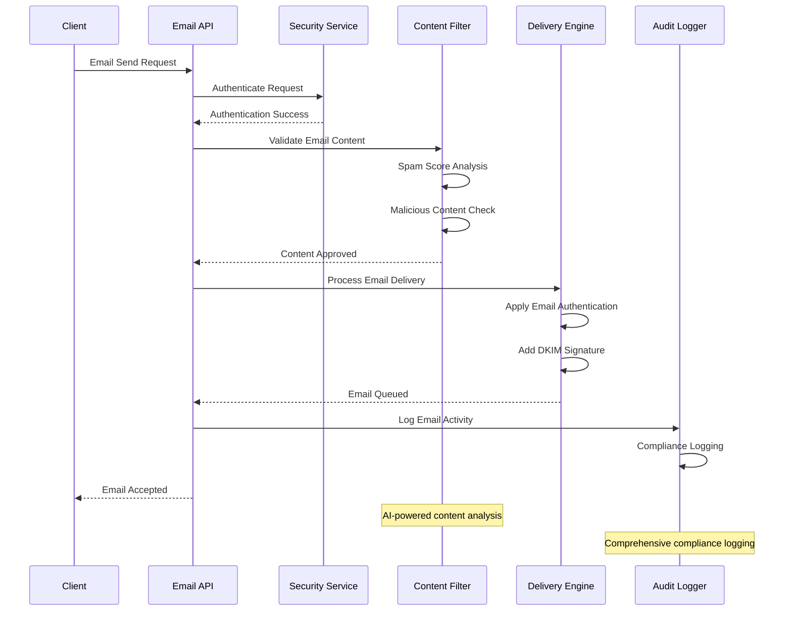

## 9. Monitoring & Observability

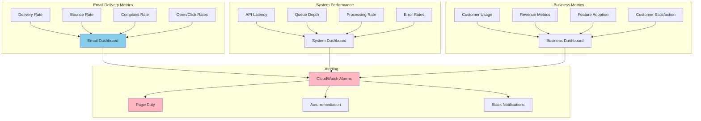

**Key Performance Indicators:**
- **Deliverability**: Delivery rates, bounce rates, complaint rates, reputation scores
- **Performance**: API response times, queue processing rates, error rates
- **Business**: Customer engagement, revenue metrics, feature usage
- **Compliance**: Opt-out rates, suppression list accuracy, audit completeness

**Alerting Strategy:**
- **Critical**: Service outages, high bounce rates, reputation issues, compliance violations
- **Warning**: Increased latency, queue backlogs, unusual error rates
- **Info**: Usage trends, performance improvements, customer milestones

## 10. Cost Optimization

**Service-Level Cost Analysis:**
- **SES**: $8,000/month (100M emails at $0.10/1000 emails)
- **EKS**: $6,000/month (Microservices, 50 nodes)
- **DynamoDB**: $4,000/month (Email metadata and tracking)
- **Aurora PostgreSQL**: $3,000/month (Customer and campaign data)
- **Kinesis**: $2,000/month (Real-time event streaming)
- **Lambda**: $1,500/month (Event processing functions)
- **S3 + CloudFront**: $2,000/month (Template storage and CDN)
- **Other Services**: $3,500/month (API Gateway, monitoring, etc.)
- **Total Estimated**: ~$30,000/month for 100M emails

**Cost Optimization Strategies:**
- **Reserved Instances**: 40% savings on predictable compute workloads
- **Spot Instances**: 60% cost reduction for batch processing
- **SES Optimization**: Negotiate volume discounts for high email volumes
- **Storage Tiering**: Move old analytics data to cheaper storage
- **Resource Right-sizing**: Optimize instance types based on workload

**Revenue Model:**
- **Pay-per-Email**: $0.001-0.01 per email based on volume tiers
- **Monthly Plans**: $25-500/month for different email volumes
- **Enterprise Plans**: Custom pricing for high-volume customers
- **Premium Features**: Additional fees for advanced analytics and features
- **Professional Services**: Implementation and consulting services

## 11. Implementation Strategy

### 11.1 Migration/Deployment Plan

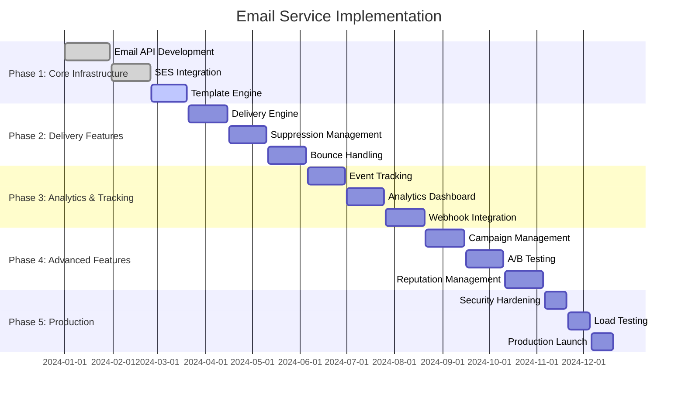

### 11.2 Technology Decisions & Trade-offs

**Email Delivery Strategy:**
- **SES vs Third-party**: SES for cost-effectiveness and AWS integration
- **Single vs Multi-provider**: Multi-provider for redundancy and deliverability
- **Shared vs Dedicated IPs**: Dedicated IPs for better reputation control
- **SMTP vs API**: API for better integration and features

**Template Engine:**
- **Server-side vs Client-side**: Server-side for security and consistency
- **Static vs Dynamic**: Dynamic templates for personalization
- **HTML vs AMP**: HTML with optional AMP support
- **Template Language**: Custom template language for security

**Analytics Architecture:**
- **Real-time vs Batch**: Hybrid approach for comprehensive analytics
- **SQL vs NoSQL**: DynamoDB for high-performance, Aurora for complex queries
- **Stream vs Batch Processing**: Stream processing for real-time insights
- **Data Retention**: Configurable retention policies for cost optimization

**Future Evolution Path:**
- **AI Enhancement**: Machine learning for deliverability optimization
- **Advanced Personalization**: AI-powered content personalization
- **Mobile Optimization**: Enhanced mobile email experiences
- **Integration Expansion**: Additional third-party integrations and APIs

**Technical Debt & Improvement Areas:**
- **Advanced Analytics**: Predictive analytics for email performance
- **Enhanced Security**: Advanced threat protection and content scanning
- **Global Expansion**: Multi-region deployment with local compliance
- **Performance Optimization**: Further optimization for high-volume customers
