# Code Deployment System Design Architecture

## 1. Executive Summary & Requirements

### System Overview
A comprehensive code deployment system that automates the software delivery pipeline from source code to production environments. The system provides continuous integration, continuous deployment, infrastructure as code, environment management, and deployment orchestration capabilities similar to GitHub Actions, Jenkins, or AWS CodePipeline.

### Functional Requirements
- **Source Code Integration**: Connect with Git repositories and version control systems
- **Build Automation**: Automated building, testing, and packaging of applications
- **Deployment Orchestration**: Coordinate deployments across multiple environments
- **Environment Management**: Manage development, staging, and production environments
- **Rollback Capabilities**: Quick rollback to previous stable versions
- **Blue-Green Deployments**: Zero-downtime deployment strategies
- **Infrastructure as Code**: Manage infrastructure through code and automation
- **Security Scanning**: Automated security and vulnerability scanning
- **Approval Workflows**: Multi-stage approval processes for production deployments
- **Monitoring Integration**: Integration with monitoring and observability tools

### Non-Functional Requirements
- **Availability**: 99.99% uptime for deployment services
- **Performance**: <5 minutes for typical application deployments
- **Scalability**: Support 10K+ applications and 100K+ deployments per day
- **Security**: Secure handling of secrets, credentials, and deployment artifacts
- **Auditability**: Complete audit trails for all deployments and changes
- **Reliability**: 99.9% deployment success rate with automatic failure recovery

### Key Constraints
- Support multiple programming languages and frameworks
- Handle complex deployment dependencies and ordering
- Manage secrets and sensitive configuration securely
- Support hybrid and multi-cloud deployment scenarios
- Maintain compliance with security and regulatory requirements

### Success Metrics
- 99.99% availability for deployment pipeline services
- <10 minutes average deployment time for production releases
- >99% deployment success rate with automated rollback
- <2 minutes mean time to detect deployment failures
- Support 1K+ concurrent deployment pipelines

## 2. High-Level Architecture Overview

```mermaid
C4Context
    title Code Deployment System Context

    Person(developer, "Software Developer", "Commits code and triggers deployments")
    Person(devops_engineer, "DevOps Engineer", "Manages deployment pipelines and infrastructure")
    Person(release_manager, "Release Manager", "Approves and coordinates production releases")
    Person(security_engineer, "Security Engineer", "Manages security policies and compliance")
    Person(platform_admin, "Platform Administrator", "Manages deployment system infrastructure")

    System_Boundary(deployment_system, "Code Deployment System") {
        System(pipeline_engine, "Pipeline Engine", "Orchestrates CI/CD pipelines and workflows")
        System(build_service, "Build Service", "Compiles, tests, and packages applications")
        System(deployment_service, "Deployment Service", "Deploys applications to target environments")
        System(environment_manager, "Environment Manager", "Manages deployment environments and infrastructure")
        System(artifact_repository, "Artifact Repository", "Stores build artifacts and deployment packages")
        System(security_scanner, "Security Scanner", "Performs security and vulnerability scanning")
    }

    System_Ext(source_repositories, "Source Repositories", "Git repositories and version control systems")
    System_Ext(target_environments, "Target Environments", "Development, staging, and production environments")
    System_Ext(monitoring_systems, "Monitoring Systems", "Application and infrastructure monitoring")
    System_Ext(notification_services, "Notification Services", "Email, Slack, and other notification channels")

    Rel(developer, source_repositories, "Commits code", "Git")
    Rel(devops_engineer, pipeline_engine, "Configures pipelines", "Web Interface")
    Rel(release_manager, deployment_service, "Approves releases", "Approval Portal")
    Rel(security_engineer, security_scanner, "Manages security policies", "Security Console")
    Rel(platform_admin, environment_manager, "Manages infrastructure", "Admin Console")
    
    Rel(source_repositories, pipeline_engine, "Triggers builds", "Webhooks")
    Rel(pipeline_engine, build_service, "Executes builds", "Internal API")
    Rel(build_service, artifact_repository, "Stores artifacts", "Artifact API")
    Rel(deployment_service, target_environments, "Deploys applications", "Deployment API")
    Rel(environment_manager, monitoring_systems, "Environment metrics", "Monitoring API")
    Rel(security_scanner, notification_services, "Security alerts", "Notification API")
```

**Architectural Style Rationale**: Event-driven microservices with workflow orchestration chosen for:
- Scalable pipeline execution with independent service scaling
- Flexible workflow definitions supporting various deployment patterns
- Integration with multiple source control and deployment targets
- Real-time event processing for build and deployment notifications
- Extensible plugin architecture for custom build and deployment steps

## 3. Detailed System Architecture

### 3.1 AWS Service Stack Selection

**Core Pipeline Services:**
- **CodePipeline**: Managed CI/CD pipeline orchestration
- **CodeBuild**: Scalable build service with custom environments
- **CodeDeploy**: Automated application deployment service
- **Step Functions**: Workflow orchestration for complex deployments

**Container and Compute:**
- **EKS**: Kubernetes orchestration for containerized applications
- **ECS Fargate**: Serverless containers for build and deployment tasks
- **Lambda**: Serverless functions for pipeline automation
- **EC2**: Compute instances for legacy applications and custom environments

**Artifact Management:**
- **ECR**: Container image registry for Docker images
- **S3**: Artifact storage for build outputs and deployment packages
- **CodeArtifact**: Package repository for application dependencies
- **Systems Manager Parameter Store**: Configuration and secrets management

**Infrastructure as Code:**
- **CloudFormation**: Infrastructure provisioning and management
- **CDK**: Cloud Development Kit for infrastructure as code
- **Terraform**: Third-party IaC tool integration
- **Config**: Infrastructure compliance and drift detection

**Security and Compliance:**
- **CodeGuru**: Code quality and security analysis
- **Inspector**: Application security assessment
- **GuardDuty**: Threat detection and security monitoring
- **KMS**: Encryption key management for secrets

**Monitoring and Observability:**
- **CloudWatch**: Pipeline monitoring and custom metrics
- **X-Ray**: Distributed tracing for deployment workflows
- **CloudTrail**: Audit logging for deployment activities
- **EventBridge**: Event routing for pipeline notifications

### 3.2 Component Architecture Diagram

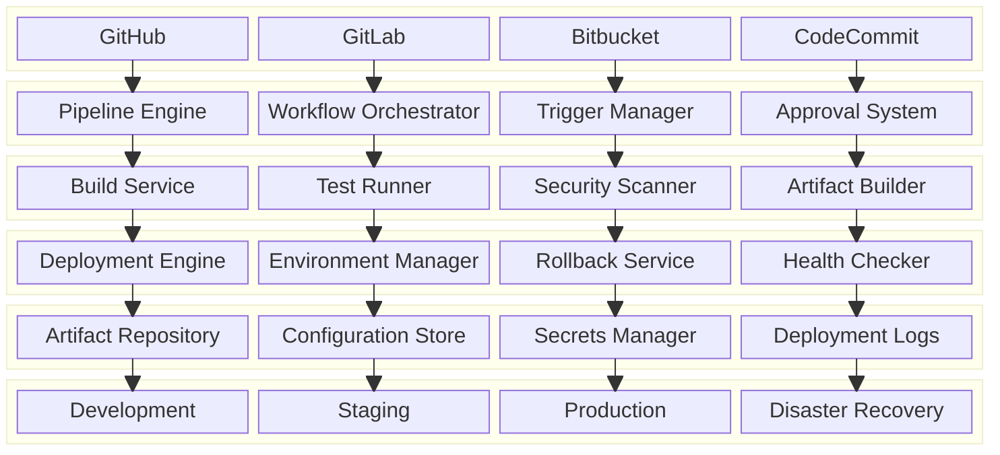

## 4. Data Architecture & Flow

### 4.1 Data Flow Diagrams

#### CI/CD Pipeline Execution Flow
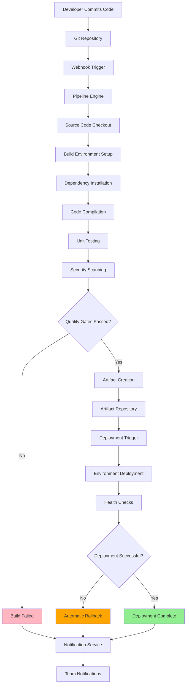

#### Blue-Green Deployment Flow
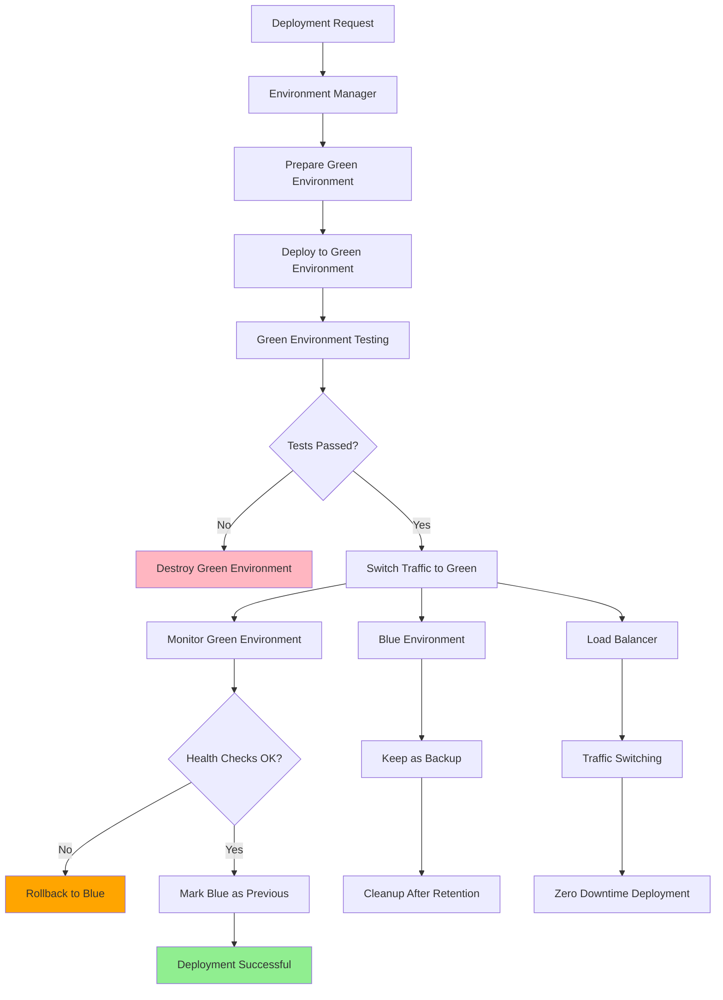

#### Infrastructure as Code Deployment Flow
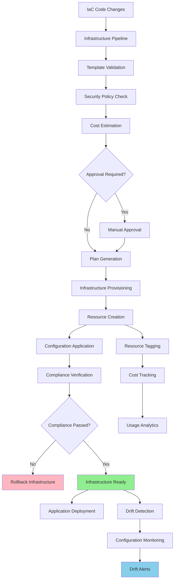

### 4.2 Database Design

#### Pipeline and Deployment Schema
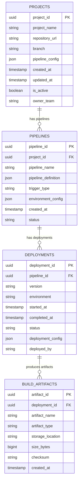

#### Environment and Configuration Schema
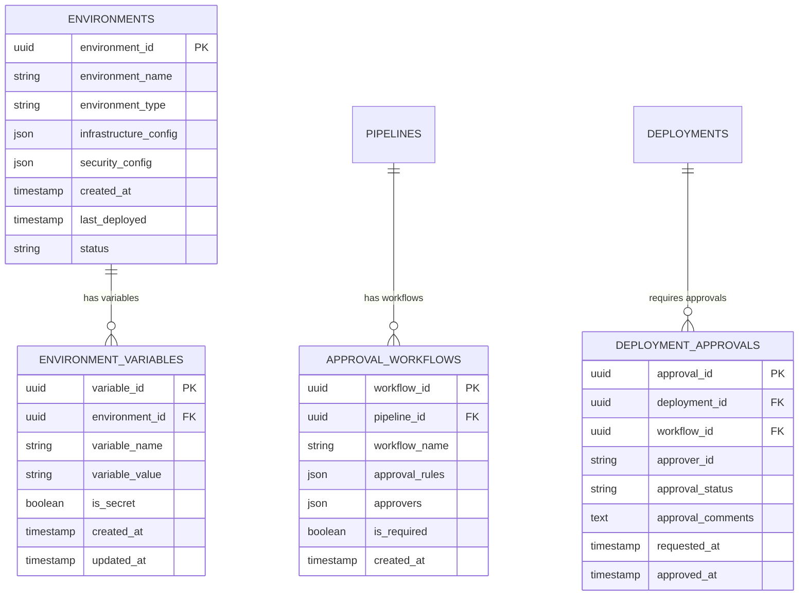

## 5. Detailed Component Design

### 5.1 Pipeline Engine

**Purpose & Responsibilities:**
- Orchestrate end-to-end CI/CD pipeline execution
- Manage pipeline triggers and webhook integrations
- Handle parallel and sequential pipeline stages
- Implement pipeline versioning and configuration management
- Support custom pipeline plugins and integrations

**Pipeline Features:**
- **Multi-stage Pipelines**: Sequential and parallel stage execution
- **Conditional Logic**: Branch-based and condition-based pipeline execution
- **Pipeline Templates**: Reusable pipeline templates and configurations
- **Custom Actions**: Support for custom build and deployment actions
- **Pipeline Metrics**: Performance monitoring and optimization insights

**Integration Capabilities:**
- **Source Control**: Git-based triggers and webhook integration
- **Artifact Management**: Integration with artifact repositories
- **Notification Systems**: Real-time notifications and status updates
- **External Tools**: Integration with third-party tools and services
- **API Integration**: RESTful APIs for pipeline management

### 5.2 Deployment Service

**Purpose & Responsibilities:**
- Execute application deployments to target environments
- Implement various deployment strategies (blue-green, canary, rolling)
- Handle deployment rollbacks and failure recovery
- Manage deployment dependencies and ordering
- Coordinate multi-service and multi-environment deployments

**Deployment Strategies:**
- **Blue-Green Deployment**: Zero-downtime deployments with traffic switching
- **Canary Deployment**: Gradual rollout with traffic splitting
- **Rolling Deployment**: Sequential update of application instances
- **A/B Testing**: Deploy multiple versions for testing and comparison
- **Feature Flags**: Control feature rollout through configuration

**Environment Management:**
- **Environment Provisioning**: Automated environment creation and teardown
- **Configuration Management**: Environment-specific configuration handling
- **Secret Management**: Secure handling of credentials and sensitive data
- **Health Monitoring**: Post-deployment health checks and monitoring
- **Rollback Automation**: Automatic rollback on deployment failures

### 5.3 Security Scanner

**Purpose & Responsibilities:**
- Perform automated security scanning of code and dependencies
- Implement vulnerability assessment and threat detection
- Enforce security policies and compliance requirements
- Generate security reports and remediation recommendations
- Integrate with security tools and vulnerability databases

**Security Scanning Types:**
- **Static Code Analysis**: Source code security vulnerability scanning
- **Dependency Scanning**: Third-party library vulnerability assessment
- **Container Scanning**: Docker image security analysis
- **Infrastructure Scanning**: Infrastructure configuration security review
- **Compliance Checking**: Regulatory compliance validation

### Critical User Journey Sequence Diagrams

#### Complete CI/CD Pipeline Execution
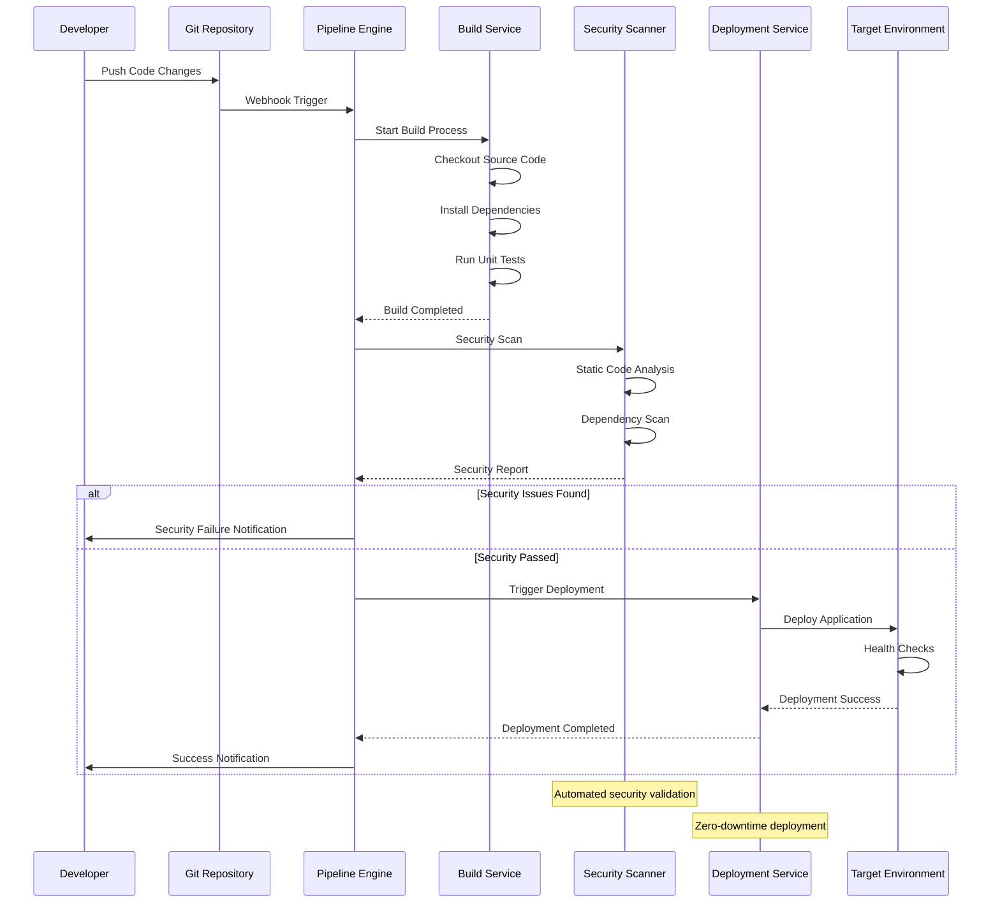

#### Production Deployment with Approval
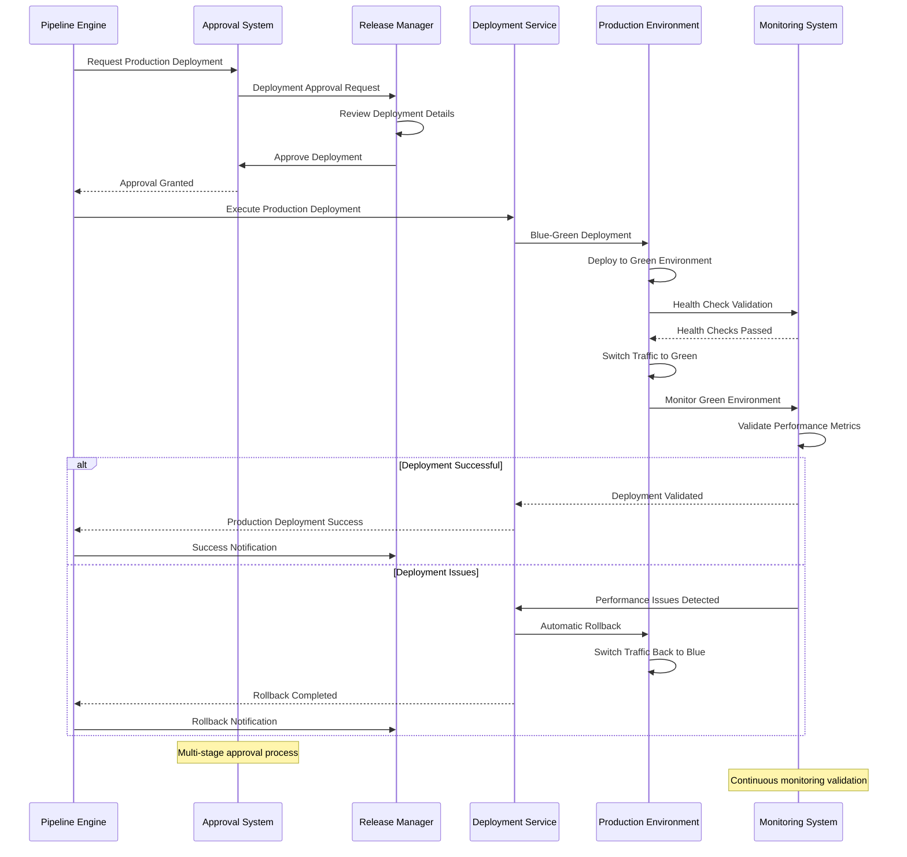

#### Infrastructure as Code Deployment
```mermaid
sequenceDiagram
    participant DEVOPS as DevOps Engineer
    parameter IaC as Infrastructure Code
    participant PIPELINE as Pipeline Engine
    participant VALIDATOR as Template Validator
    participant PLANNER as Infrastructure Planner
    participant PROVISIONER as Infrastructure Provisioner
    participant CLOUD as Cloud Provider
    
    DEVOPS->>IaC: Update Infrastructure Code
    IaC->>PIPELINE: Trigger Infrastructure Pipeline
    PIPELINE->>VALIDATOR: Validate Templates
    VALIDATOR->>VALIDATOR: Syntax Validation
    VALIDATOR->>VALIDATOR: Security Policy Check
    VALIDATOR-->>PIPELINE: Validation Results
    
    alt Validation Failed
        PIPELINE->>DEVOPS: Validation Error Notification
    else Validation Passed
        PIPELINE->>PLANNER: Generate Deployment Plan
        PLANNER->>PLANNER: Calculate Resource Changes
        PLANNER->>PLANNER: Cost Estimation
        PLANNER-->>PIPELINE: Deployment Plan
        
        PIPELINE->>PROVISIONER: Execute Infrastructure Changes
        PROVISIONER->>CLOUD: Provision Resources
        CLOUD->>CLOUD: Create/Update Infrastructure
        CLOUD-->>PROVISIONER: Infrastructure Ready
        PROVISIONER-->>PIPELINE: Infrastructure Deployment Complete
        PIPELINE->>DEVOPS: Infrastructure Success Notification
    end
    
    Note over VALIDATOR: Automated policy validation
    Note over PLANNER: Cost-aware infrastructure planning
```

## 6. Scalability & Performance

### 6.1 Scaling Architecture

```mermaid
flowchart TD
    subgraph "Pipeline Scaling"
        A[Pipeline Volume Growth] --> B[Horizontal Pipeline Workers]
        B --> C[Queue-based Processing]
        C --> D[Auto-scaling Build Agents]
    end
    
    subgraph "Build Scaling"
        E[Build Complexity Growth] --> F[Distributed Build System]
        F --> G[Container-based Builds]
        G --> H[Build Cache Optimization]
    end
    
    subgraph "Deployment Scaling"
        I[Deployment Frequency] --> J[Parallel Deployments]
        J --> K[Environment Pool Management]
        K --> L[Blue-Green Automation]
    end
    
    subgraph "Global Scaling"
        M[Geographic Distribution] --> N[Multi-Region Pipelines]
        N --> O[Regional Artifact Repositories]
        O --> P[Edge Build Caches]
    end
    
    style D fill:#87CEEB
    style H fill:#90EE90
    style L fill:#FFB6C1
    style P fill:#DDA0DD
```

### 6.2 Performance Optimization

**Pipeline Performance:**
- **Parallel Execution**: Run independent pipeline stages in parallel
- **Build Caching**: Cache dependencies and build artifacts for faster builds
- **Incremental Builds**: Build only changed components and dependencies
- **Pipeline Optimization**: Analyze and optimize pipeline execution times

**Build Performance:**
- **Container Optimization**: Optimize Docker images for faster builds
- **Dependency Caching**: Cache package managers and dependencies
- **Distributed Testing**: Parallelize test execution across multiple agents
- **Build Agent Optimization**: Right-size build agents for optimal performance

**Deployment Performance:**
- **Artifact Optimization**: Optimize artifact sizes and transfer times
- **Deployment Parallelization**: Deploy to multiple environments concurrently
- **Health Check Optimization**: Optimize health checks for faster validation
- **Rollback Optimization**: Pre-warm environments for faster rollbacks

## 7. Reliability & Fault Tolerance

### 7.1 High Availability Design

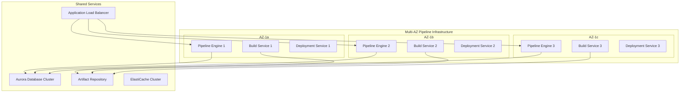

**Fault Tolerance Mechanisms:**
- **Circuit Breakers**: Prevent cascade failures during external service outages
- **Retry Logic**: Intelligent retry mechanisms for failed pipeline steps
- **Graceful Degradation**: Continue core pipeline functionality during partial outages
- **Queue Persistence**: Persistent queues to prevent job loss during failures

### 7.2 Disaster Recovery

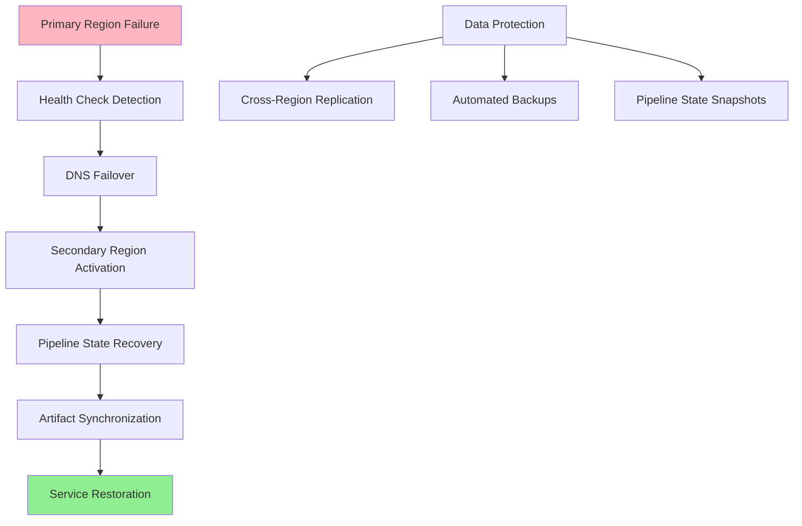

**RTO/RPO Targets:**
- **RTO**: 10 minutes for pipeline services, 30 minutes for full recovery
- **RPO**: 5 minutes for pipeline state, 15 minutes for artifact data
- **Data Consistency**: Strong consistency for pipeline state, eventual for artifacts
- **Recovery Testing**: Monthly automated disaster recovery testing

## 8. Security Architecture

### 8.1 Security Layers

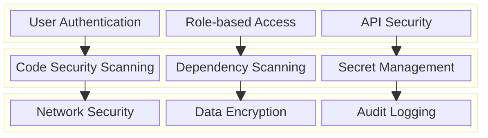

**Security Features:**
- **Identity Management**: Integration with enterprise identity providers
- **Secret Management**: Secure storage and rotation of secrets and credentials
- **Code Security**: Automated security scanning and vulnerability detection
- **Network Security**: VPC isolation and security group controls

**Compliance Features:**
- **SOC 2 Compliance**: Security and availability controls
- **GDPR Compliance**: Data protection and privacy controls
- **HIPAA Compliance**: Healthcare data protection (when applicable)
- **PCI DSS Compliance**: Payment card industry security standards

### 8.2 Secure Deployment Flow

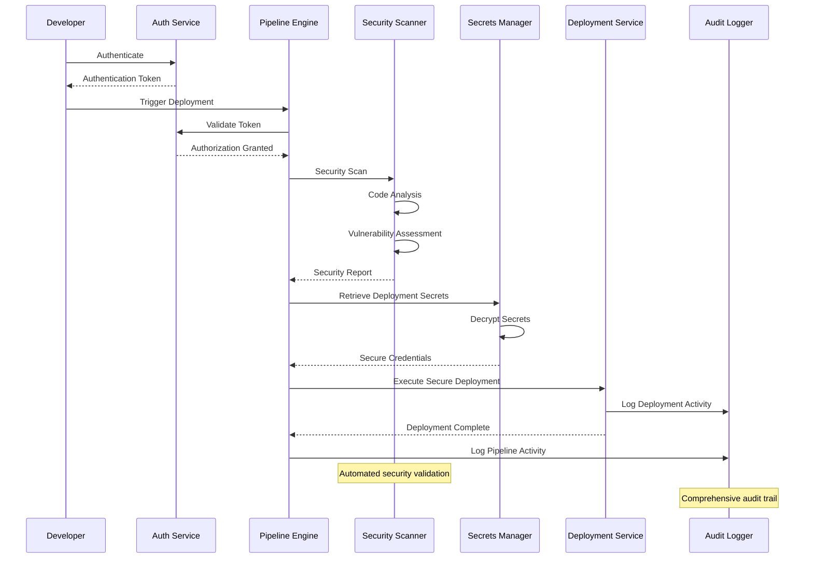

## 9. Monitoring & Observability

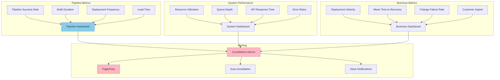

**Key Performance Indicators:**
- **DORA Metrics**: Deployment frequency, lead time, MTTR, change failure rate
- **Pipeline Health**: Success rates, duration, queue times, resource utilization
- **Security Metrics**: Vulnerability detection, compliance status, security incidents
- **Business Impact**: Customer satisfaction, feature delivery, system reliability

**Alerting Strategy:**
- **Critical**: Pipeline failures, security vulnerabilities, production deployment issues
- **Warning**: Performance degradation, resource exhaustion, approval delays
- **Info**: Deployment completions, performance improvements, usage trends

## 10. Cost Optimization

**Service-Level Cost Analysis:**
- **CodePipeline**: $3,000/month (10K pipelines at $1 per active pipeline)
- **CodeBuild**: $8,000/month (Build minutes for 100K builds)
- **EKS**: $4,000/month (Kubernetes cluster for deployment services)
- **ECR**: $1,000/month (Container image storage)
- **S3**: $2,000/month (Artifact storage and backup)
- **Lambda**: $1,500/month (Serverless automation functions)
- **RDS Aurora**: $2,000/month (Pipeline metadata and configuration)
- **Other Services**: $2,500/month (CloudWatch, X-Ray, etc.)
- **Total Estimated**: ~$24,000/month for enterprise deployment platform

**Cost Optimization Strategies:**
- **Spot Instances**: 60% cost reduction for build agents and batch processing
- **Reserved Instances**: 40% savings on predictable compute workloads
- **Build Optimization**: Optimize build times to reduce compute costs
- **Artifact Lifecycle**: Implement lifecycle policies for artifact cleanup
- **Resource Right-sizing**: Monitor and optimize resource allocation

**Pricing Model:**
- **Free Tier**: Limited pipelines and build minutes for small teams
- **Team Plan**: $50/user/month for professional features
- **Enterprise Plan**: $200/user/month with advanced security and compliance
- **Enterprise Plus**: Custom pricing for large-scale deployments
- **Professional Services**: Implementation and consulting services

## 11. Implementation Strategy

### 11.1 Migration/Deployment Plan

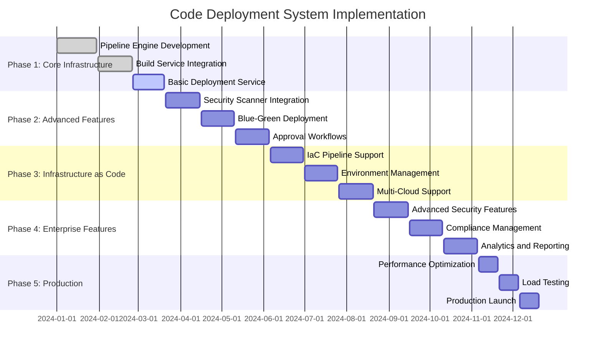

### 11.2 Technology Decisions & Trade-offs

**Pipeline Orchestration:**
- **Managed vs Self-hosted**: AWS CodePipeline for managed service benefits
- **YAML vs GUI**: YAML-based pipeline definitions for version control
- **Monolithic vs Microservices**: Microservices architecture for scalability
- **Event-driven vs Polling**: Event-driven for real-time responsiveness

**Build Strategy:**
- **Containers vs VMs**: Container-based builds for consistency and speed
- **Shared vs Isolated**: Isolated build environments for security
- **Caching Strategy**: Multi-level caching for performance optimization
- **Language Support**: Multi-language support with specialized build images

**Deployment Strategy:**
- **Push vs Pull**: Push-based deployments for immediate control
- **Imperative vs Declarative**: Declarative configurations for consistency
- **Rolling vs Blue-Green**: Support both strategies based on requirements
- **Canary Deployments**: Gradual rollout capabilities for risk mitigation

**Future Evolution Path:**
- **GitOps Integration**: Full GitOps workflow support
- **AI/ML Integration**: AI-powered deployment optimization and anomaly detection
- **Edge Deployment**: Support for edge computing and IoT deployments
- **Serverless Enhancement**: Enhanced serverless application deployment

**Technical Debt & Improvement Areas:**
- **Advanced Analytics**: Predictive analytics for deployment success
- **Enhanced Security**: Zero-trust security model implementation
- **Performance Optimization**: Further optimization for large-scale deployments
- **Multi-Cloud Enhancement**: Enhanced multi-cloud and hybrid deployment capabilities
